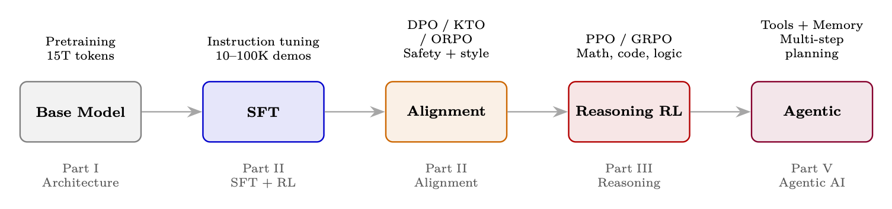

## About the Author

Haggai Roitman has spent over two decades at the intersection of AI research and large-scale production systems. His work bridges theory and practice—from publishing foundational research to shipping systems that serve millions of users.

His research interests span information retrieval, recommender systems, natural language processing, large language models, reinforcement learning for LLMs, and agentic AI. He has authored more than 100 peer-reviewed publications and holds approximately 100 patents. He earned his BSc (<em>Cum Laude</em>) and PhD from the Technion — Israel Institute of Technology.

When not thinking about gradient flows and KV caches, he can be found behind a set of turntables, mixing progressive trance and deep house.

## Preface

### Why This Guide Exists

Building intelligent AI systems in 2026 requires mastering an extraordinary breadth of knowledge — from how transformers process language internally, through the hardware and systems that make training possible, the optimization techniques that make it efficient, the reinforcement learning algorithms that teach models to reason and align with human intent, all the way to multi-agent architectures that coordinate autonomous systems at scale.

This knowledge is scattered across hundreds of papers, blog posts, GitHub repositories, and tribal knowledge within a handful of labs. This guide exists because practitioners need a single, unified reference that covers the entire stack — not just the theory, but the implementation details that make things actually work.

### A Personal Journey to Agentic AI

My fascination with intelligent agents began two decades ago, when I still studied for my first degree in information systems engineering. I took courses on Agent-Oriented Software Engineering (AOSE) [381] and learned to build multi-agent systems using JADE [22] (Java Agent DEvelopment Framework)—a FIPA-compliant [93] platform where agents communicated via structured protocols, negotiated over shared resources, and coordinated autonomously. Around the same time, Berners-Lee, Hendler, and Lassila’s seminal paper “The Semantic Web” [24] painted a vision of machine-readable knowledge that agents could reason over. These two threads—autonomous agent architectures and semantic knowledge representation—planted a seed that has guided my career ever since. One early project that crystallized this vision was an attempt to build a <em>shopping agent</em>—developed with OntoBuilder [103] under the guidance of my respected future academic advisor Prof. Avigdor Gal—a system that could automatically fill product search queries and orders across different heterogeneous websites, understanding their varied schemas through ontology matching and mapping. The Semantic Web promised that such agents would thrive in a world of structured, machine-readable data. In practice, the brittleness of hand-crafted ontologies, the messiness of real-world product data, and the lack of robust natural language understanding made the vision perpetually “five years away.”

Over the following years, I tracked each wave of AI progress as it arrived: neural networks and heuristic search for combinatorial optimization; deep learning and representation learning; information retrieval and personalization at scale; and most recently, the revolution of large language models. Each wave brought powerful new tools, but the dream remained the same: systems that <em>understand</em>, <em>reason</em>, and <em>act</em> autonomously in complex environments.

What makes 2024–2026 remarkable is that these threads have finally converged. LLMs provide the language understanding and generation; reinforcement learning teaches them to reason and align with human intent; tool-use protocols (MCP) give them hands to act in the world; and agent orchestration frameworks provide the coordination layer that JADE envisioned twenty years ago—now powered by foundation models instead of hand-coded ontologies. This guide is, in many ways, the reference I wish I had at each step of that journey.

### The Landscape in 2026

The journey to today’s agentic AI systems spans three decades of compounding breakthroughs across architecture, training, and deployment:

<ol><li>Architectural foundations (2017–2020): The Transformer [357] introduced self-attention as a universal sequence-processing primitive. Scaling laws revealed that larger models trained on more data reliably improve. GPT-2 and GPT-3 demonstrated that decoder-only transformers, scaled sufficiently, become capable few-shot learners.</li><li>Systems and efficiency (2020–2023): Flash Attention [64] made training 2–4<math alttext="\times" display="inline"><semantics><mo>×</mo></semantics></math> faster by eliminating memory bottlenecks. LoRA [147] enabled fine-tuning 70B+ models on a single node. Mixture-of-Experts (MoE) decoupled model capacity from compute cost. Inference engines like vLLM brought throughput within reach of real-time applications.</li><li>Alignment via RL (2022–2024): RLHF [280] transformed capable-but-unhelpful base models into useful assistants — the recipe behind ChatGPT. DPO [302] collapsed the reward model and RL loop into a single supervised loss, democratizing alignment. Variants proliferated: KTO [86], IPO [14], ORPO [141], GRPO [323].</li><li>Reasoning and autonomy (2024–2026): DeepSeek-R1 [69] and OpenAI’s o1/o3 demonstrated that RL could teach <em>reasoning itself</em> — models spontaneously discover chain-of-thought, backtracking, and self-verification. Simultaneously, the Model Context Protocol (MCP) standardized tool access, Agent-to-Agent (A2A) enabled inter-agent communication, and production-grade orchestration frameworks matured.</li></ol>

### Who This Guide Is For

This document is written for practitioners who build things:

<ul><li>ML engineers who need to understand transformer internals, training infrastructure, optimization, and why things diverge.</li><li>Applied researchers evaluating architectures, fine-tuning strategies, and RL methods for their specific domains.</li><li>Agent developers building production systems who need orchestration patterns, memory architectures, tool integration (MCP), and multi-agent coordination (A2A).</li><li>Systems engineers responsible for training infrastructure, GPU clusters, distributed training, and inference deployment.</li><li>Technical leaders making architectural and resourcing decisions across the full stack.</li></ul>

We assume familiarity with neural networks and basic probability. No prior LLM, RL, or systems knowledge is required — the guide builds from first principles.

### What You Will Gain

After reading this guide, you will be able to:

<ul><li>Understand LLM internals — attention mechanisms, positional encodings, MoE routing, Flash Attention, and why architectural choices matter for downstream capability.</li><li>Reason about systems — GPU memory budgets, distributed training strategies (FSDP, tensor/pipeline parallelism), inference optimization, and production deployment with vLLM.</li><li>Train and fine-tune efficiently — LoRA/QLoRA, quantization, knowledge distillation, optimizer selection, and learning rate scheduling.</li><li>Align models with human preferences — implement RLHF/DPO/GRPO/KTO pipelines, debug reward hacking and mode collapse, choose the right algorithm among 20+ methods.</li><li>Build reasoning models — understand how DeepSeek-R1, o1/o3, and QwQ discover chain-of-thought through RL without explicit demonstrations.</li><li>Architect agentic systems — select orchestration patterns, design memory, integrate tools via MCP, coordinate agents via A2A, evaluate with production benchmarks.</li><li>Evaluate rigorously — apply appropriate metrics, benchmarks, and LLM-as-Judge patterns for both model quality and agent capability.</li></ul>

### How This Guide Is Organized

The guide spans 30 chapters organized in six parts:

<ol><li>Part I — Foundations (Chapters 1–3): LLM architecture and optimization (transformers, attention, positional encodings, Flash Attention, LoRA, MoE), systems foundations (GPU hierarchies, distributed training, vLLM), and classical RL theory (MDPs, policy gradients, actor-critic).</li><li>Part II — RL Methods for LLMs (Chapters 4–12): The complete RL-for-LLMs toolkit. RL foundations for language models, then full mathematical treatment of PPO, DPO, GRPO, and preference optimization variants (Online DPO, KTO, IPO, ORPO, SimPO), reward model training, SFT best practices, system architecture at scale, and agentic training with trajectory-level RL.</li><li>Part III — Reasoning (Chapter 13): Large reasoning models — DeepSeek-R1, OpenAI o1/o3/o4-mini, QwQ — how RL discovers chain-of-thought, MCTS, process reward models, and test-time compute scaling.</li><li>Part IV — Evaluation (Chapter 14): Comprehensive LLM evaluation methodology — metrics, LLM-as-Judge, human annotation, benchmark suites, contamination detection, and agentic evaluation.</li><li>Part V — Agentic AI (Chapters 15–27): The complete agentic stack — introduction to agentic AI, RAG and retrieval, memory systems, orchestration and context management, loop engineering, design patterns, agentic environments and benchmarks, Model Context Protocol (MCP), agent skills, Agent-to-Agent communication (A2A), multi-agent systems, development frameworks, and agentic UI.</li><li>Part VI — Assessment &amp; Reference (Chapters 28–30): 108 detailed quiz questions with comprehensive answers spanning all topics, a quick-reference chapter consolidating key equations, API references, and failure mode diagnostics, and a conclusion with future directions.</li></ol>

The guide includes over 100 detailed quiz questions with comprehensive answers spanning all topics, plus a quick-reference chapter consolidating key equations, API references, and failure mode diagnostics.

### Design Philosophy

Three principles guide this document:

<ol><li>Intuition first, formalism second. Every equation is preceded by a plain-English explanation of what it means and why it matters.</li><li>Implementation-aware. Theory is useless without knowing how to make it work. We include code, hyperparameter tables, memory budgets, architecture diagrams, and debugging strategies throughout.</li><li>Honest about what works. We clearly state which approaches are production-tested and which are research explorations.</li></ol>

### Scope and Deliberate Omissions

This guide focuses on text-in, text-out language models and the RL, systems, and agentic infrastructure built around them. Several important areas are intentionally excluded:

<ul><li>Multimodal models (vision–language, audio, video). Multimodal architectures introduce distinct training pipelines (contrastive pre-training, cross-modal alignment, modality-specific encoders), data curation challenges, and evaluation protocols that each merit book-length treatment. Including them would double the scope without deepening the RL and agentic core that unifies this guide.</li><li>Domain-specific deployments (healthcare, legal, finance, scientific discovery). Domain adaptation introduces regulatory constraints, specialized evaluation, and data-access issues that are orthogonal to the general methods presented here. The algorithms and architectures we cover <em>are</em> the building blocks practitioners adapt to these domains, but the adaptation details are better served by dedicated references.</li><li>Personalization and recommendation systems. Personalization relies on user modeling, collaborative filtering, and interaction-history architectures that form a parallel research tradition. While LLMs are increasingly used <em>within</em> recommender systems, the core techniques (sequential models, bandit-based exploration, cold-start handling) are sufficiently distinct to warrant separate coverage.</li></ul>

By maintaining this boundary, we keep a single coherent thread—<em>from architectural foundations and systems infrastructure, through the training algorithms that produce aligned and reasoning models, to the orchestration and deployment of autonomous agents</em>—without fragmenting the narrative across modalities and verticals.

— <em>Haggai Roitman, 2026</em>

### What’s New in Version 1.3

Version 1.3 adds nineteen new topics reflecting developments through mid-2026:

<ul><li><strong>Chapter 1 — LLM Architecture and Optimization:</strong> •Muon optimizer — Newton–Schulz orthogonalization as an AdamW successor (adopted by GLM-5, Kimi K2, DeepSeek-V4).•Multi-head Latent Attention (MLA) — DeepSeek’s KV-cache compression via low-rank latent projection.•FP8/FP4 training — next-generation mixed precision with per-tile micro-scaling.•Auxiliary-loss-free MoE — adaptive bias-based load balancing replacing costly auxiliary losses.•Mid-training — the emerging stage between pre-training and SFT that prepares models for RL.</li><li><strong>Chapter 2 — Systems Foundations:</strong> •Dynamo — NVIDIA’s datacenter-scale inference orchestration framework.</li><li><strong>Chapter 11 — System Architecture at Scale:</strong> •Decoupled DiLoCo — Google’s geo-distributed training with 236<math alttext="\times" display="inline"><semantics><mo>×</mo></semantics></math> bandwidth reduction.•Miles — PyTorch-native RL post-training engine.</li><li><strong>Chapter 12 — LLM Agentic Training:</strong> •Interactive RL environments — NeMo Gym, RLFactory, and MOSAIC for agentic post-training.•Training on real agent traces — using production trajectories as RL training signal.</li><li><strong>Chapter 13 — RL for Large Reasoning Models:</strong> •Inference-time compute scaling laws — log-linear relationships and budget-aware prompting.•Latent reasoning — coconut-style continuous thought without token-level chain-of-thought.•On-policy self-distillation — dense token-level supervision from the model’s own privileged context, achieving RL-level reasoning at 10–100<math alttext="\times" display="inline"><semantics><mo>×</mo></semantics></math> lower compute.</li><li><strong>Chapter 17 — Agentic Memory Systems:</strong> •Proactive memory architectures — Meta AI’s behavioral-state decay and anticipatory retrieval.</li><li><strong>Chapter 19 — Loop Engineering:</strong> •Context engineering — the discipline of optimizing what fills the context window (Lütke, Karpathy, Anthropic).</li><li><strong>Chapter 21 — Agentic Environments:</strong> •UniClawBench and Terminal-Bench — 2026 benchmarks for robotic manipulation and long-horizon terminal tasks.</li><li><strong>Chapter 25 — Multi-Agent Systems:</strong> •BDI-LLM self-evolving agents — belief–desire–intention architectures with learned plan libraries.</li><li><strong>Chapter 26 — Agent Development Frameworks:</strong> •NVIDIA OO Agents (NOOA) — object-oriented framework where agents are Python objects, methods are tools, and <code>...</code> bodies become LLM-driven loops.</li></ul>

## Introduction

### The Big Picture

This guide takes you from first principles to production systems. It is written for practitioners — researchers, engineers, and applied scientists — who want to understand and build the full stack of modern AI: from transformer architectures and the hardware that runs them, through the training algorithms that align models with human intent and teach them to reason, to the agentic architectures that deploy them as autonomous systems.

The core thesis is simple: <em>building great AI systems requires understanding the entire pipeline, not just one layer</em>. An engineer debugging a training run needs to understand GPU memory hierarchies and optimizer dynamics. A fine-tuning practitioner needs to know when LoRA suffices and when full-parameter training is worth the cost. An agent developer needs to understand how the underlying model was trained. A technical leader evaluating frameworks needs to understand what trade-offs each one makes. This guide provides that complete picture.

### The Road to Agentic AI: A Brief History

Today’s agentic AI systems did not emerge in a vacuum. They stand on decades of milestone systems — each solving a narrower problem but collectively building the techniques, hardware, and ambition that made autonomous agents possible.

<ol><li>Deep Blue (1997)[37] — IBM’s chess engine defeated world champion Garry Kasparov using brute-force search (200 million positions/second) with handcrafted evaluation functions. It proved machines could exceed human performance in well-defined adversarial domains, but generalized to nothing else.</li><li>IBM Watson — Jeopardy! (2011)[90] — Watson combined information retrieval, NLP, and massive parallelism to defeat human champions at open-domain question answering. It demonstrated that AI could process unstructured text at scale, but required years of domain-specific engineering and couldn’t learn new domains without substantial human effort.</li><li>AlexNet and the Deep Learning Revolution (2012)[192] — Krizhevsky et al.’s CNN won ImageNet by a stunning margin, proving that deep neural networks trained on GPUs could learn representations from raw data. This single result triggered the modern deep learning era and the hardware investment that eventually made LLMs possible.</li><li>AlphaGo (2016)[331] — DeepMind’s system defeated Go world champion Lee Sedol using deep RL (policy networks + value networks + Monte Carlo Tree Search). Unlike Deep Blue’s brute force, AlphaGo <em>learned</em> to play — demonstrating that RL could master domains where search alone was intractable (<math alttext="10^{170}" display="inline"><semantics><msup><mn>10</mn><mn>170</mn></msup></semantics></math> board states). AlphaGo Zero (2017) [332] later learned entirely from self-play, needing no human games at all.</li><li>GPT-2/GPT-3 (2019–2020)[32] — OpenAI showed that scaling decoder-only transformers to billions of parameters produced emergent few-shot learning. GPT-3 (175B parameters) could perform tasks it was never explicitly trained for — translation, arithmetic, code generation — simply from in-context examples. The era of foundation models began.</li><li>AlphaFold (2020)[174] — DeepMind solved the 50-year protein folding problem, predicting 3D protein structures with atomic accuracy. AlphaFold demonstrated that deep learning could crack fundamental scientific problems previously considered decades away. It also showcased the power of architecture innovation (attention over residue pairs) combined with massive compute.</li><li>ChatGPT and RLHF (2022)[280] — InstructGPT/ChatGPT proved that a capable base model, when aligned via RLHF, becomes a genuinely useful assistant. This was the inflection point: AI went from a research tool to a consumer product used by hundreds of millions. The alignment techniques (reward models, PPO) became the template for all subsequent LLM post-training.</li><li>GPT-4 and Multimodal Models (2023)[274] — Multimodal capabilities (vision + language), longer contexts, and improved reasoning pushed LLMs toward general-purpose cognition. Tool use (code interpreter, web browsing) hinted at agentic capabilities.</li><li>Reasoning Models (2024)[69] — OpenAI’s o1 and DeepSeek-R1 showed that RL could teach models to <em>reason</em>: chain-of-thought, backtracking, self-verification emerged spontaneously from reward signals alone. Models began solving competition-level mathematics and complex coding tasks.</li><li>Agentic AI (2025–present) — The convergence point: LLMs with reasoning capabilities, equipped with standardized tool access (MCP), inter-agent communication (A2A), persistent memory, and sophisticated orchestration frameworks. Agents now autonomously write code, conduct research, manage workflows, and coordinate with other agents — the subject of this guide.</li></ol>

This guide picks up the story at the foundation model era and carries it forward through alignment, reasoning, and autonomous agency.

### What You Should Expect

Part I: Foundations (Chapters 1–3) builds the base knowledge the rest of the guide depends on. We start with how LLMs work internally — the architecture decisions that determine capability — then cover the hardware and systems that make training and inference possible, and finally introduce reinforcement learning from first principles.

<ul><li>Chapter 1 — LLM Architecture and Optimization: Transformer internals (self-attention, multi-head attention, RoPE, GQA), Flash Attention, optimization methods (AdamW, learning rate schedules, gradient clipping), mixed precision, LoRA/QLoRA, quantization, knowledge distillation, and Mixture of Experts.</li><li>Chapter 2 — Systems Foundations: GPU architecture (A100/H100/B200), memory hierarchies, NVLink/NVSwitch, distributed training (FSDP, DeepSpeed ZeRO, tensor/pipeline parallelism), and vLLM for high-throughput inference.</li><li>Chapter 3 — Introduction to RL: MDPs, Bellman equations, TD learning, Q-learning, policy gradients (REINFORCE), actor-critic methods, GAE — the algorithmic toolkit that underpins Part II.</li></ul>

Part II: RL Methods for LLMs (Chapters 4–12) is the training and alignment core. Here you learn how to align, improve, and fine-tune language models — from full mathematical derivations to working code.

<ul><li>Chapters 4–8: Every major RL/preference algorithm with math, intuition, and TRL code — PPO, DPO, GRPO, and preference optimization variants (Online DPO, KTO, IPO, ORPO, SimPO, Best-of-N).</li><li>Chapters 9–10: Reward model training (Bradley–Terry, scaling laws, reward hacking) and SFT best practices (data quality, curriculum, formatting).</li><li>Chapters 11–12: System architecture at scale (decoupled training, fault tolerance, GPU allocation) and LLM agentic training — how to train agents end-to-end with trajectory-level RL.</li></ul>

Part III: Reasoning (Chapter 13) covers the frontier of model capability — teaching LLMs to reason through multi-step problems.

<ul><li>Chapter 13 — RL for Large Reasoning Models: DeepSeek-R1, OpenAI o1/o3/o4-mini, QwQ — how RL discovers chain-of-thought, MCTS, process reward models, and test-time compute scaling.</li></ul>

Part IV: Evaluation (Chapter 14) provides the methodology for measuring whether any of this actually works.

<ul><li>Chapter 14 — LLM Evaluation: Metrics (perplexity, pass@k, ELO), LLM-as-Judge patterns, contamination detection, benchmark suites, and agentic evaluation methodology.</li></ul>

Part V: Agentic AI (Chapters 15–27) takes you from a trained model to a deployed autonomous system. This is the largest part, covering everything an agent needs to operate in the real world.

<ul><li>Chapter 15 — Introduction to Agentic AI: What makes a system agentic, the spectrum from chatbots to autonomous agents, and the foundational concepts for the rest of Part V.</li><li>Chapter 16 — RAG: Retrieval methods, chunking, embedding models, hybrid search, reranking, and production architectures.</li><li>Chapter 17 — Memory Systems: Working, episodic, semantic, and procedural memory for persistent agent knowledge.</li><li>Chapter 18 — Orchestration: ReAct, Plan-and-Execute, LLM Compiler, reflexion patterns, context management, and harness design.</li><li>Chapter 19 — Loop Engineering: Inference-time reinforcement learning, context engineering, adaptive orchestration loops, and loop-as-policy abstractions.</li><li>Chapter 20 — Design Patterns: Prompt chaining, routing, parallelization, evaluation-driven orchestration, and the simplicity principle.</li><li>Chapter 21 — Environments and Benchmarks: WebArena, SWE-bench, OSWorld, GAIA — evaluation environments for agentic capability.</li><li>Chapter 22 — Model Context Protocol (MCP): Architecture, transport layers, tool/resource/prompt primitives, security, and deployment.</li><li>Chapter 23 — Agent Skills: Skill libraries, tool composition, and capability abstraction.</li><li>Chapter 24 — A2A Communication: Google’s Agent-to-Agent protocol — Agent Cards, task lifecycle, streaming, enterprise patterns.</li><li>Chapter 25 — Multi-Agent Systems: Hierarchical, debate, marketplace, and swarm architectures — coordination at scale.</li><li>Chapter 26 — Development Frameworks: LangGraph, CrewAI, AutoGen, OpenAI Agents SDK, NVIDIA OO Agents — comparative analysis with code.</li><li>Chapter 27 — Agentic UI: Streaming interfaces, generative UI, canvas paradigms, tool visualization, human-in-the-loop patterns.</li></ul>

Part VI: Assessment &amp; Reference (Chapters 28–30) consolidates assessment material and provides quick-lookup references for practitioners.

<ul><li>Chapter 28 — Quiz Questions &amp; Detailed Answers: 108 questions spanning all topics — architecture, RL, reasoning, agentic systems — with comprehensive worked answers.</li><li>Chapter 29 — Quick Reference: Key equations, API references, hyperparameter tables, and failure mode diagnostics in a compact lookup format.</li><li>Chapter 30 — Conclusion and Future Directions: Where the field is heading — open problems, emerging paradigms, and the road ahead.</li></ul>

### The Modern AI Pipeline

The full pipeline from base model to deployed agent:

<figure id="chx4.f1"><figcaption>Figure 1:The modern LLM development pipeline: from pre-trained base model through alignment and reasoning to autonomous agentic capability. Each stage maps to a part of this guide.</figcaption></figure>

## Glossary of Acronyms

This guide uses many acronyms drawn from machine learning, systems engineering, and agent research. The following reference covers the most common ones; each entry appears in the chapter where the concept is first introduced in full.

<dl class="hh-glossary">
<dt>A2A</dt><dd>Agent-to-Agent (communication protocol)</dd>

<dt>AdamW</dt><dd>Adam with decoupled Weight decay</dd>

<dt>BDI</dt><dd>Belief–Desire–Intention (agent architecture)</dd>

<dt>BERT</dt><dd>Bidirectional Encoder Representations from Transformers</dd>

<dt>BLEU</dt><dd>Bilingual Evaluation Understudy (metric)</dd>

<dt>BPE</dt><dd>Byte-Pair Encoding</dd>

<dt>BT</dt><dd>Bradley–Terry (preference model)</dd>

<dt>CoT</dt><dd>Chain of Thought</dd>

<dt>CTDE</dt><dd>Centralized Training, Decentralized Execution</dd>

<dt>CUDA</dt><dd>Compute Unified Device Architecture</dd>

<dt>DAG</dt><dd>Directed Acyclic Graph</dd>

<dt>DAPO</dt><dd>Dynamic Adaptive Policy Optimization</dd>

<dt>DDP</dt><dd>Distributed Data Parallel</dd>

<dt>DiLoCo</dt><dd>Distributed Low-Communication (training)</dd>

<dt>DP</dt><dd>Data Parallelism</dd>

<dt>DPO</dt><dd>Direct Preference Optimization</dd>

<dt>DQN</dt><dd>Deep Q-Network</dd>

<dt>DRAM</dt><dd>Dynamic Random-Access Memory</dd>

<dt>ELO</dt><dd>Elo rating system (named after Arpad Elo)</dd>

<dt>EOS</dt><dd>End of Sequence (token)</dd>

<dt>FA</dt><dd>Flash Attention</dd>

<dt>FFN</dt><dd>Feed-Forward Network</dd>

<dt>FLOP</dt><dd>Floating-Point Operation</dd>

<dt>FSDP</dt><dd>Fully Sharded Data Parallel</dd>

<dt>GAE</dt><dd>Generalized Advantage Estimation</dd>

<dt>GAIA</dt><dd>General AI Assistants (benchmark)</dd>

<dt>GEMM</dt><dd>General Matrix Multiplication</dd>

<dt>GQA</dt><dd>Grouped Query Attention</dd>

<dt>GRPO</dt><dd>Group Relative Policy Optimization</dd>

<dt>HBM</dt><dd>High Bandwidth Memory</dd>

<dt>IPO</dt><dd>Identity Preference Optimization</dd>

<dt>KL</dt><dd>Kullback–Leibler (divergence)</dd>

<dt>KTO</dt><dd>Kahneman–Tversky Optimization</dd>

<dt>KV</dt><dd>Key–Value (cache)</dd>

<dt>LATS</dt><dd>Language Agent Tree Search</dd>

<dt>LLM</dt><dd>Large Language Model</dd>

<dt>LoRA</dt><dd>Low-Rank Adaptation</dd>

<dt>LR</dt><dd>Learning Rate</dd>

<dt>MCP</dt><dd>Model Context Protocol</dd>

<dt>MCTS</dt><dd>Monte Carlo Tree Search</dd>

<dt>MDP</dt><dd>Markov Decision Process</dd>

<dt>MFU</dt><dd>Model FLOPS Utilization</dd>

<dt>MHA</dt><dd>Multi-Head Attention</dd>

<dt>MLA</dt><dd>Multi-head Latent Attention</dd>

<dt>MLP</dt><dd>Multi-Layer Perceptron</dd>

<dt>MoE</dt><dd>Mixture of Experts</dd>

<dt>NOOA</dt><dd>NVIDIA Object-Oriented Agents</dd>

<dt>NLL</dt><dd>Negative Log-Likelihood</dd>

<dt>OPSD</dt><dd>On-Policy Self-Distillation</dd>

<dt>ORPO</dt><dd>Odds Ratio Preference Optimization</dd>

<dt>ORM</dt><dd>Outcome Reward Model</dd>

<dt>PEFT</dt><dd>Parameter-Efficient Fine-Tuning</dd>

<dt>PP</dt><dd>Pipeline Parallelism</dd>

<dt>PPO</dt><dd>Proximal Policy Optimization</dd>

<dt>PRM</dt><dd>Process Reward Model</dd>

<dt>QLoRA</dt><dd>Quantized Low-Rank Adaptation</dd>

<dt>RAG</dt><dd>Retrieval-Augmented Generation</dd>

<dt>ReAct</dt><dd>Reasoning + Acting (agent pattern)</dd>

<dt>RL</dt><dd>Reinforcement Learning</dd>

<dt>RLHF</dt><dd>Reinforcement Learning from Human Feedback</dd>

<dt>RLVR</dt><dd>Reinforcement Learning with Verifiable Rewards</dd>

<dt>RM</dt><dd>Reward Model</dd>

<dt>RoPE</dt><dd>Rotary Position Embedding</dd>

<dt>ROUGE</dt><dd>Recall-Oriented Understudy for Gisting Evaluation</dd>

<dt>RRF</dt><dd>Reciprocal Rank Fusion</dd>

<dt>SDK</dt><dd>Software Development Kit</dd>

<dt>SFT</dt><dd>Supervised Fine-Tuning</dd>

<dt>SGD</dt><dd>Stochastic Gradient Descent</dd>

<dt>SM</dt><dd>Streaming Multiprocessor</dd>

<dt>SPLADE</dt><dd>SParse Lexical AnD Expansion</dd>

<dt>SRAM</dt><dd>Static Random-Access Memory</dd>

<dt>SSE</dt><dd>Server-Sent Events</dd>

<dt>SWE-bench</dt><dd>Software Engineering Benchmark</dd>

<dt>TD</dt><dd>Temporal Difference (learning)</dd>

<dt>TP</dt><dd>Tensor Parallelism</dd>

<dt>TRL</dt><dd>Transformer Reinforcement Learning (library)</dd>

<dt>UCB</dt><dd>Upper Confidence Bound</dd>

<dt>vLLM</dt><dd>Virtual LLM (inference engine)</dd>
</dl>

<aside class="hh-next">

下一篇

Chapter 1 LLM Architecture and Optimization Methods

在「智能体 AI 漫游指南」分类下继续阅读。

</aside>

