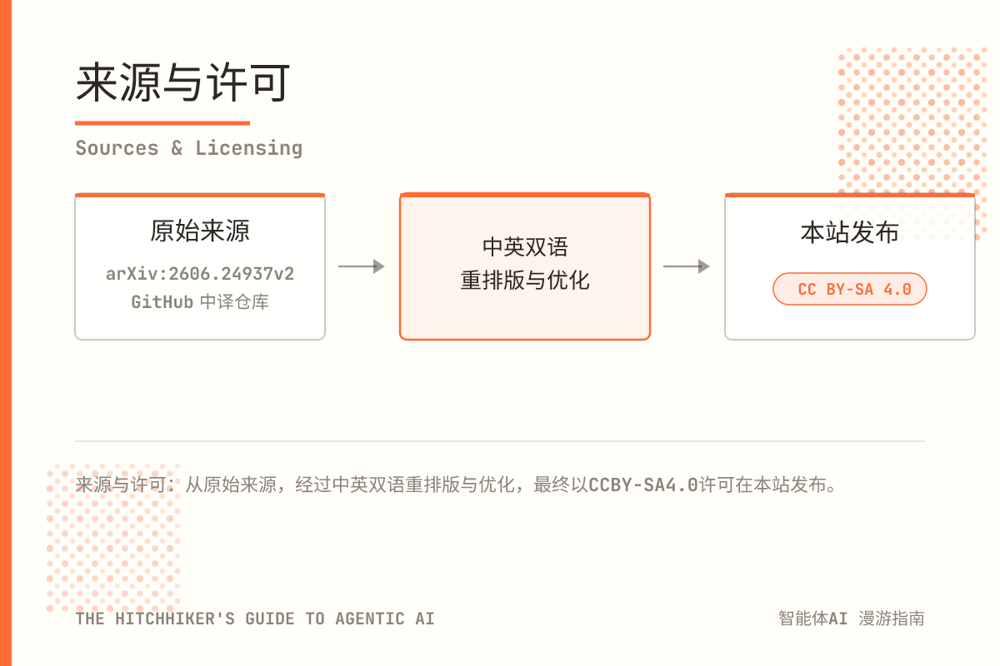

## 来源说明

本指南基于 [arXiv:2606.24937v2](https://arxiv.org/html/2606.24937v2) 与 [Chasing1020/agentic-ai-guide-zh](https://github.com/Chasing1020/agentic-ai-guide-zh) 进行中英文双语重排版与优化，使其适配本站的风格。文章的结构、顺序与内容均未作重大修改与调整。

## 独立声明

本文件是作者独立撰写的综述与教育资源。文中表达的观点、意见与结论仅代表作者本人，并不必然反映作者目前或曾经服务的任何雇主、组织或机构的立场。

本作品不包含任何专有、机密或商业秘密信息。所有引用材料均取自公开来源，包括同行评审出版物、开放获取预印本、官方文档以及开源代码仓库。

本内容按“原样”提供，不附带任何明示或暗示的保证。作者不就信息对任何特定用途的准确性、完整性或适用性作出任何陈述。读者在将任何论断、公式或实现细节应用于生产系统之前，应当独立核实。

## AI 使用披露

本书使用 deepseek-v4.1-flash 模型作为主要研究与起草辅助工具。所有内容均尽最大努力进行了编辑与核实。

<small>[model: deepseek-v4.1-flash, thinking: max, agent: pi-agent,token cost: 241,895,426 provider: opencode-go, date: 2026/09/16]</small>

## 反馈

如果您发现任何错误、不准确之处或有改进建议，欢迎反馈。 

## 许可证

本作品采用 Creative Commons Attribution-ShareAlike 4.0 International License（CC BY-SA 4.0）授权。您可以自由分享（复制与再分发）及改编（混编、转换、在其基础上创作）本材料，可用于任何目的（包括商业用途），前提是给予适当的署名、提供许可证的链接、指明是否做了修改，并以相同许可证分发任何衍生作品。完整许可证文本：<a href="https://creativecommons.org/licenses/by-sa/4.0/" target="_blank" rel="noopener noreferrer">https://creativecommons.org/licenses/by-sa/4.0/</a>。

