<div class="hh-guide">

<aside class="hh-part">
<p class="hh-part-title">第 I 部分 基础</p>
</aside>

本部分覆盖大语言模型的基础架构，以及让训练和推理高效化的关键优化技术。内容按课程顺序组织：先介绍 Transformer 本身，然后讨论如何高效训练、如何低成本适配、如何压缩、如何扩展规模，以及如何加速推理。

## LLM 工作原理：直觉概览

在深入架构细节之前，让我们先建立大语言模型如何将文本转换为文本的直觉。整个过程遵循一条简单的流水线：文本 <math alttext="\to" display="inline"><semantics><mo stretchy="false">→</mo></semantics></math> Token <math alttext="\to" display="inline"><semantics><mo stretchy="false">→</mo></semantics></math> 表征 <math alttext="\to" display="inline"><semantics><mo stretchy="false">→</mo></semantics></math> Token <math alttext="\to" display="inline"><semantics><mo stretchy="false">→</mo></semantics></math> 文本。

<figure id="ch1.f1"><figcaption><span class="hh-tag">图 1.1：</span>LLM 流水线：文本被分词为子词单元，转换为整数 ID，嵌入为稠密向量，经 Transformer 层处理，投影到词表 logits，最后解码回文本。虚线回路展示自回归生成——每个输出 Token 被追加到输入中，作为下一次前向传播的输入。</figcaption></figure>

## 分词（Tokenization）

分词（Tokenization）是将原始文本转换为语言模型所操作的离散符号的关键第一步。分词器的选择直接影响模型质量、多语种能力和计算效率。

### 为什么不用字符或词？

<div class="hh-table" id="ch1.t1"><table class="ltx_tabular ltx_align_middle"><thead><tr><th class="ltx_align_left"><span>粒度</span></th><th class="ltx_align_left"><span>词表大小</span></th><th class="ltx_align_left"><span>序列长度</span></th><th class="ltx_align_left"><span>问题</span></th></tr></thead><tbody><tr><th class="ltx_align_left">字符</th><td class="ltx_align_left"><math alttext="\sim" display="inline"><semantics><mo>∼</mo><span></span></semantics></math>256</td><th class="ltx_align_left">极长</th><td class="ltx_align_left">注意力开销 <math alttext="O(n^{2})" display="inline"><semantics><mrow><mi>O</mi><mo>⁡</mo><mrow><mo stretchy="false">(</mo><msup><mi>n</mi><mn>2</mn></msup><mo stretchy="false">)</mo></mrow></mrow><span></span></semantics></math>；难以学习长程语义</td></tr><tr><th class="ltx_align_left">词</th><td class="ltx_align_left"><math alttext="\sim" display="inline"><semantics><mo>∼</mo><span></span></semantics></math>500K+</td><th class="ltx_align_left">短</th><td class="ltx_align_left">无法处理稀有/新词；嵌入表巨大</td></tr><tr><th class="ltx_align_left">子词</th><td class="ltx_align_left">32K–128K</td><th class="ltx_align_left">适中</th><td class="ltx_align_left">最佳权衡：短序列、开放词表</td></tr></tbody></table><p class="hh-table-caption"><span class="hh-tag">表 1.1：</span>不同分词粒度的权衡。</p></div>

### 字节对编码（Byte-Pair Encoding，BPE）

字节对编码（Byte-Pair Encoding，BPE） [320] 是 GPT、Llama、Mistral 以及大多数现代 LLM 采用的主流分词算法。

<figure id="ch1.f2">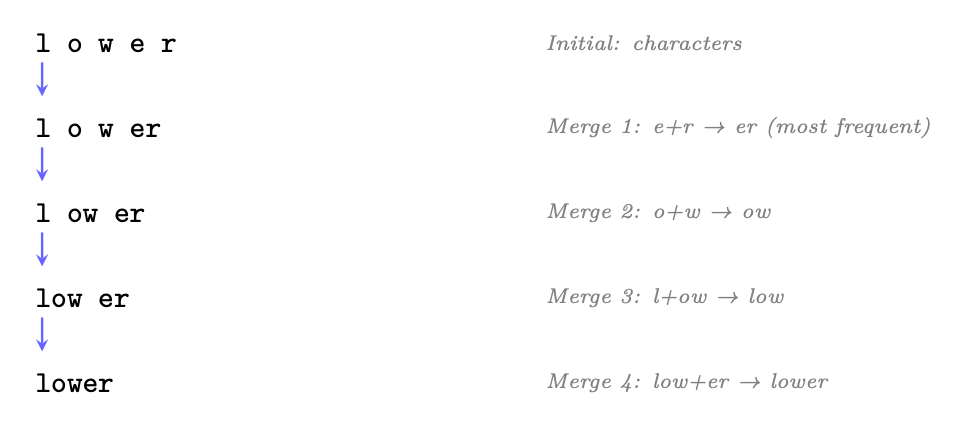<figcaption><span class="hh-tag">图 1.2：</span>BPE 分词示例：从字符开始，算法迭代地合并出现频率最高的相邻对，直到该词成为单个 Token 或词表预算耗尽。</figcaption></figure>

### 其他分词方法

<div class="hh-table" id="ch1.t2"><table class="ltx_tabular ltx_align_middle"><thead><tr><th class="ltx_align_left"><span>方法</span></th><th class="ltx_align_left ltx_align_top"><span class="ltx_align_top"><span><span>使用者</span></span></span></th><th class="ltx_align_left ltx_align_top"><span class="ltx_align_top"><span><span>核心思想</span></span></span></th></tr></thead><tbody><tr><th class="ltx_align_left">BPE</th><td class="ltx_align_left ltx_align_top"><span class="ltx_align_top"><span>GPT-4 <span>[274]</span>、Llama-3 <span>[118]</span>、Mistral <span>[165]</span></span></span></td><td class="ltx_align_left ltx_align_top"><span class="ltx_align_top"><span>自底向上合并频繁对；确定性</span></span></td></tr><tr><th class="ltx_align_left">WordPiece</th><td class="ltx_align_left ltx_align_top"><span class="ltx_align_top"><span>BERT <span>[76]</span>、DistilBERT <span>[312]</span></span></span></td><td class="ltx_align_left ltx_align_top"><span class="ltx_align_top"><span>类似 BPE，但最大化训练数据似然</span></span></td></tr><tr><th class="ltx_align_left">Unigram LM</th><td class="ltx_align_left ltx_align_top"><span class="ltx_align_top"><span>SentencePiece（T5 <span>[303]</span>、XLNet <span>[405]</span>）</span></span></td><td class="ltx_align_left ltx_align_top"><span class="ltx_align_top"><span>自顶向下：从大词表开始，按似然影响剪枝</span></span></td></tr><tr><th class="ltx_align_left">字节级 BPE（Byte-level BPE）</th><td class="ltx_align_left ltx_align_top"><span class="ltx_align_top"><span>GPT-2 <span>[301]</span>+</span></span></td><td class="ltx_align_left ltx_align_top"><span class="ltx_align_top"><span>在原始字节上做 BPE（不可能出现未知 Token）；256 个基础词表</span></span></td></tr></tbody></table><p class="hh-table-caption"><span class="hh-tag">表 1.2：</span>子词分词算法对比。</p></div>

### 分词最佳实践

<ol><li>词表大小很重要：32K 是最低限度；128K 能提供更好的多语种覆盖和代码处理能力。Llama-3 使用 128K Token。</li><li>特殊 Token：始终包含 <code>&lt;bos&gt;</code>、<code>&lt;eos&gt;</code>、<code>&lt;pad&gt;</code>、<code>&lt;unk&gt;</code>。对于指令微调模型，需添加角色标记（<code>&lt;|user|&gt;</code>、<code>&lt;|assistant|&gt;</code>）。</li><li>繁殖度（Fertility）：度量各语种的每词 Token 数。高繁殖度（每词产生很多 Token）表示对该语种的覆盖较差。</li><li>切勿跨边界分词：空格、标点和数字应一致处理。大多数现代分词器会在前面添加空格标记（如「the」）以区分词首 Token 与词中续接 Token。</li><li>数字：对算术任务考虑数字级分词。「2024」切为 [「2」「0」「2」「4」] 可以支持逐位推理。</li><li>代码：确保高效地分词空白（缩进）。Llama-3 将连续空格分词为单个 Token。</li></ol>

### 分词实战：HuggingFace 示例

<code>transformers</code> 库为所有分词器提供了统一接口。以下演示了使用现代 LLM 分词器进行编码和解码：

```
from transformers import AutoTokenizer

# Load Llama-3 tokenizer (128K vocabulary, byte-level BPE)
tokenizer = AutoTokenizer.from_pretrained("meta-llama/Meta-Llama-3-8B")

text = "Reinforcement learning optimizes long-term rewards."

# Encode: text -> token IDs
token_ids = tokenizer.encode(text)
print(token_ids)
# [128000, 29934, 262, 11008, 4815, 6900, 1317, 9860, 21845, 13]

# Decode individual tokens to see subword splits
tokens = tokenizer.convert_ids_to_tokens(token_ids)
print(tokens)
# ['<|begin_of_text|>', 'Re', 'inforce', 'ment', ' learning',
#  ' optimizes', ' long', '-term', ' rewards', '.']

# Decode back to text (round-trip)
reconstructed = tokenizer.decode(token_ids, skip_special_tokens=True)
assert reconstructed == text  # Perfect reconstruction

# Tokenize with attention mask (for batched inputs with padding)
batch = tokenizer(
    ["Short text.", "A much longer input sentence for comparison."],
    padding=True, return_tensors="pt"
)
print(batch.keys())  # dict_keys(['input_ids', 'attention_mask'])
```

<span class="hh-tag">代码清单 1：</span>使用 HuggingFace Transformers 进行分词编解码。

### 特殊 Token 与结构化提示

特殊 Token 是保留的词表条目，承载的是结构含义而非语言内容。它们对于控制模型行为至关重要。

<div class="hh-table" id="ch1.t3"><table class="ltx_tabular ltx_align_middle"><thead><tr><th class="ltx_align_left"><span>Token</span></th><th class="ltx_align_left"><span>别名</span></th><th class="ltx_align_left"><span>用途</span></th></tr></thead><tbody><tr><th class="ltx_align_left"><span>&lt;bos&gt;</span> / <span>&lt;|begin_of_text|&gt;</span></th><td class="ltx_align_left">BOS</td><td class="ltx_align_left">标记序列开始</td></tr><tr><th class="ltx_align_left"><span>&lt;eos&gt;</span> / <span>&lt;|end_of_text|&gt;</span></th><td class="ltx_align_left">EOS</td><td class="ltx_align_left">标记序列结束；停止生成</td></tr><tr><th class="ltx_align_left"><span>&lt;|user|&gt;</span></th><td class="ltx_align_left">—</td><td class="ltx_align_left">标记对话中用户回合的开始</td></tr><tr><th class="ltx_align_left"><span>&lt;|assistant|&gt;</span></th><td class="ltx_align_left">—</td><td class="ltx_align_left">标记对话中助手回合的开始</td></tr><tr><th class="ltx_align_left"><span>&lt;pad&gt;</span></th><td class="ltx_align_left">PAD</td><td class="ltx_align_left">填充 batch 至统一长度；在注意力中被掩码</td></tr><tr><th class="ltx_align_left"><span>&lt;unk&gt;</span></th><td class="ltx_align_left">UNK</td><td class="ltx_align_left">词表外占位符（使用 BPE 时很少出现）</td></tr><tr><th class="ltx_align_left"><span>[SEP]</span></th><td class="ltx_align_left">SEP</td><td class="ltx_align_left">分隔片段（BERT 风格）</td></tr><tr><th class="ltx_align_left"><span>[CLS]</span></th><td class="ltx_align_left">CLS</td><td class="ltx_align_left">分类 Token（BERT）</td></tr><tr><th class="ltx_align_left"><span>[MASK]</span></th><td class="ltx_align_left">MASK</td><td class="ltx_align_left">用于 MLM 预训练的掩码 Token</td></tr></tbody></table><p class="hh-table-caption"><span class="hh-tag">表 1.3：</span>各 LLM 系列中常见的特殊 Token。</p></div>

现代对话模型使用特殊 Token 来划定对话结构。它们并不被训练来承载语义含义——它们是模型学会解析的结构性分隔符：

```
# Llama-3 chat template
messages = [
    {"role": "system", "content": "You are a helpful assistant."},
    {"role": "user", "content": "Explain PPO in one sentence."},
]

# apply_chat_template handles all special token insertion
prompt = tokenizer.apply_chat_template(messages, tokenize=False)
print(prompt)
# <|begin_of_text|><|start_header_id|>system<|end_header_id|>
#
# You are a helpful assistant.<|eot_id|><|start_header_id|>user<|end_header_id|>
#
# Explain PPO in one sentence.<|eot_id|><|start_header_id|>assistant<|end_header_id|>
#
#
```

<span class="hh-tag">代码清单 2：</span>带特殊 Token 的对话模板（Llama-3 格式）。

## Transformer 架构

Transformer [357] 是所有现代 LLM 的基础。理解其各个组件对于掌握本指南中的每一项优化与训练方法都至关重要。

### 整体结构

仅解码器（decoder-only）Transformer 依次通过嵌入、重复的注意力+FFN 块以及最终投影到词表 logits 来处理 Token。图 图 1.3 展示了完整架构。

<figure id="ch1.f3">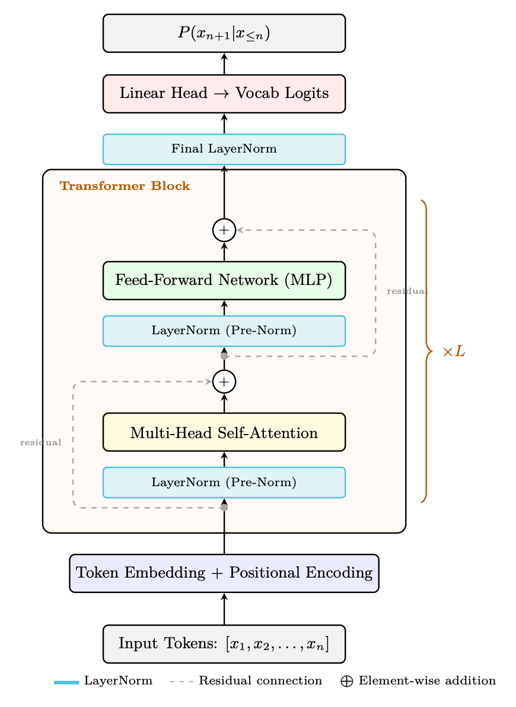<figcaption><span class="hh-tag">图 1.3：</span>仅解码器 Transformer 块（GPT 风格，Pre-Norm 变体）。每个子层（注意力、FFN）之前先做层归一化（LayerNorm），之后进行残差相加：<math alttext="\mathbf{x}+\text{SubLayer}(\text{LN}(\mathbf{x}))" display="inline"><semantics><mrow><mi>𝐱</mi><mo>+</mo><mrow><mtext>SubLayer</mtext><mo lspace="0em" rspace="0em">​</mo><mrow><mo stretchy="false">(</mo><mrow><mtext>LN</mtext><mo lspace="0em" rspace="0em">​</mo><mrow><mo stretchy="false">(</mo><mi>𝐱</mi><mo stretchy="false">)</mo></mrow></mrow><mo stretchy="false">)</mo></mrow></mrow></mrow></semantics></math>。这种 Pre-Norm 顺序（Llama、GPT-3、Mistral 采用）无需 warmup 即可稳定训练，不同于原始的 Post-Norm（在相加之后应用层归一化）。<math alttext="L" display="inline"><semantics><mi>L</mi></semantics></math> 个相同的块堆叠在一起，随后是最终的层归一化和到词表 logits 的线性投影。</figcaption></figure>

### 原始的编码器-解码器 Transformer

Transformer 最初 [357] 是作为编码器-解码器架构被提出的，用于序列到序列任务（机器翻译、摘要）。虽然现代 LLM 主要使用仅解码器变体（GPT 风格），但理解完整架构仍然至关重要，因为交叉注意力和掩码自注意力——两者都源于此——仍是基本的构建模块。

<figure id="ch1.f4">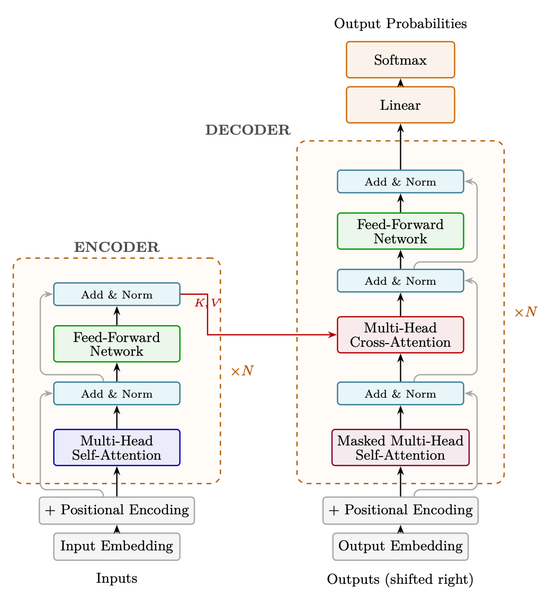<figcaption><span class="hh-tag">图 1.4：</span>原始 Transformer 架构（Vaswani 等，2017）。编码器（左）以双向自注意力处理完整输入。解码器（右）使用掩码自注意力以及对编码器表征的交叉注意力，自回归地生成 Token。虚线框表示重复的层块（<math alttext="\times N" display="inline"><semantics><mrow><mphantom></mphantom><mo lspace="0.222em" rspace="0.222em">×</mo><mi>N</mi></mrow></semantics></math>）；灰色线表示绕过每个子层的残差连接。注意：原始工作使用 Post-Norm（在残差相加<em>之后</em>应用层归一化：<math alttext="\text{LN}(\mathbf{x}+\text{SubLayer}(\mathbf{x}))" display="inline"><semantics><mrow><mtext>LN</mtext><mo lspace="0em" rspace="0em">​</mo><mrow><mo stretchy="false">(</mo><mrow><mi>𝐱</mi><mo>+</mo><mrow><mtext>SubLayer</mtext><mo lspace="0em" rspace="0em">​</mo><mrow><mo stretchy="false">(</mo><mi>𝐱</mi><mo stretchy="false">)</mo></mrow></mrow></mrow><mo stretchy="false">)</mo></mrow></mrow></semantics></math>），而现代 LLM 使用 Pre-Norm。</figcaption></figure>

编码器<em>双向地</em>处理整个输入序列——每个 Token 都关注所有其他 Token（无因果掩码）。这会产生丰富的上下文表征 <math alttext="\mathbf{H}^{\text{enc}}\in\mathbb{R}^{n\times d}" display="inline"><semantics><mrow><msup><mi>𝐇</mi><mtext>enc</mtext></msup><mo>∈</mo><msup><mi>ℝ</mi><mrow><mi>n</mi><mo lspace="0.222em" rspace="0.222em">×</mo><mi>d</mi></mrow></msup></mrow></semantics></math>，其中每个位置都编码了关于完整输入的信息：

<ul><li>输入：Token 嵌入 + 正弦位置编码</li><li>每层：多头自注意力 <math alttext="\to" display="inline"><semantics><mo stretchy="false">→</mo></semantics></math> Add &amp; Norm <math alttext="\to" display="inline"><semantics><mo stretchy="false">→</mo></semantics></math> FFN <math alttext="\to" display="inline"><semantics><mo stretchy="false">→</mo></semantics></math> Add &amp; Norm</li><li>无因果掩码：位置 <math alttext="i" display="inline"><semantics><mi>i</mi></semantics></math> 关注所有位置 <math alttext="1,\ldots,n" display="inline"><semantics><mrow><mn>1</mn><mo>,</mo><mi mathvariant="normal">…</mi><mo>,</mo><mi>n</mi></mrow></semantics></math></li><li>输出：完整输入序列的上下文表征</li></ul>

解码器一次生成一个输出 Token（自回归）。为防止模型「看到未来」，解码器中的自注意力使用因果掩码：

<div class="hh-equation" id="ch1.e1"><math alttext="\text{MaskedAttn}(Q,K,V)=\text{softmax}\!\left(\frac{QK^{T}}{\sqrt{d_{k}}}+M\right)V" display="block"><semantics><mrow><mrow><mtext>MaskedAttn</mtext><mo lspace="0em" rspace="0em">​</mo><mrow><mo stretchy="false">(</mo><mi>Q</mi><mo>,</mo><mi>K</mi><mo>,</mo><mi>V</mi><mo stretchy="false">)</mo></mrow></mrow><mo>=</mo><mrow><mpadded width="3.720em"><mtext>softmax</mtext></mpadded><mo lspace="0em" rspace="0em">​</mo><mrow><mo>(</mo><mrow><mfrac><mrow><mi>Q</mi><mo lspace="0em" rspace="0em">​</mo><msup><mi>K</mi><mi>T</mi></msup></mrow><msqrt><msub><mi>d</mi><mi>k</mi></msub></msqrt></mfrac><mo>+</mo><mi>M</mi></mrow><mo>)</mo></mrow><mo lspace="0em" rspace="0em">​</mo><mi>V</mi></mrow></mrow></semantics></math><span class="hh-equation-number">(1.1)</span></div>

其中掩码 <math alttext="M" display="inline"><semantics><mi>M</mi></semantics></math> 为：

<div class="hh-equation" id="ch1.ex1"><math alttext="M_{ij}=\begin{cases}0&amp;\text{if }i\geq j\text{ (can attend)}\\
-\infty&amp;\text{if }i&lt;j\text{ (future token --- blocked)}\end{cases}" display="block"><semantics><mrow><msub><mi>M</mi><mrow><mi>i</mi><mo lspace="0em" rspace="0em">​</mo><mi>j</mi></mrow></msub><mo>=</mo><mrow><mo>{</mo><mtable columnspacing="5pt" displaystyle="true" rowspacing="0pt"><mtr><mtd columnalign="left"><mn>0</mn></mtd><mtd columnalign="left"><mrow><mrow><mtext>if </mtext><mo lspace="0em" rspace="0em">​</mo><mi>i</mi></mrow><mo>≥</mo><mrow><mi>j</mi><mo lspace="0em" rspace="0em">​</mo><mtext> (can attend)</mtext></mrow></mrow></mtd></mtr><mtr><mtd columnalign="left"><mrow><mo>−</mo><mi mathvariant="normal">∞</mi></mrow></mtd><mtd columnalign="left"><mrow><mrow><mtext>if </mtext><mo lspace="0em" rspace="0em">​</mo><mi>i</mi></mrow><mo>&lt;</mo><mrow><mi>j</mi><mo lspace="0em" rspace="0em">​</mo><mtext> (future token — blocked)</mtext></mrow></mrow></mtd></mtr></mtable></mrow></mrow></semantics></math></div>

在掩码自注意力之后，每个解码器层应用交叉注意力，让解码器关注编码器的输出表征。这正是解码器「读取」输入的机制：

<div class="hh-equation" id="ch1.e2"><math alttext="\text{CrossAttn}(Q_{\text{dec}},K_{\text{enc}},V_{\text{enc}})=\text{softmax}\!\left(\frac{Q_{\text{dec}}K_{\text{enc}}^{T}}{\sqrt{d_{k}}}\right)V_{\text{enc}}" display="block"><semantics><mrow><mrow><mtext>CrossAttn</mtext><mo lspace="0em" rspace="0em">​</mo><mrow><mo stretchy="false">(</mo><msub><mi>Q</mi><mtext>dec</mtext></msub><mo>,</mo><msub><mi>K</mi><mtext>enc</mtext></msub><mo>,</mo><msub><mi>V</mi><mtext>enc</mtext></msub><mo stretchy="false">)</mo></mrow></mrow><mo>=</mo><mrow><mpadded width="3.720em"><mtext>softmax</mtext></mpadded><mo lspace="0em" rspace="0em">​</mo><mrow><mo>(</mo><mfrac><mrow><msub><mi>Q</mi><mtext>dec</mtext></msub><mo lspace="0em" rspace="0em">​</mo><msubsup><mi>K</mi><mtext>enc</mtext><mi>T</mi></msubsup></mrow><msqrt><msub><mi>d</mi><mi>k</mi></msub></msqrt></mfrac><mo>)</mo></mrow><mo lspace="0em" rspace="0em">​</mo><msub><mi>V</mi><mtext>enc</mtext></msub></mrow></mrow></semantics></math><span class="hh-equation-number">(1.2)</span></div>

<ul><li>Queries 来自解码器的前一个子层（掩码自注意力的输出）</li><li>Keys 与 Values 来自编码器的最终输出 <math alttext="\mathbf{H}^{\text{enc}}" display="inline"><semantics><msup><mi>𝐇</mi><mtext>enc</mtext></msup></semantics></math></li><li>不应用掩码——每个解码器位置都可以关注每个编码器位置</li><li>这使解码器能在每个生成步骤动态聚焦于输入的不同部分（例如，在英语<math alttext="\to" display="inline"><semantics><mo stretchy="false">→</mo></semantics></math>西班牙语的翻译中关注「cat」以生成「gato」）</li></ul>

每个解码器层包含三个子层（编码器中为两个）：

<ol><li>掩码多头自注意力 + 残差 + 层归一化</li><li>多头交叉注意力（指向编码器输出）+ 残差 + 层归一化</li><li>前馈网络（Feed-Forward Network） + 残差 + 层归一化</li></ol>

现代 LLM（GPT、Llama、Qwen）只使用解码器，完全去掉了编码器和交叉注意力层。关键洞见在于：对于生成式语言建模，单一的因果（掩码）自注意力栈已经足够——模型学会在一次前向传播中同时编码上下文并生成续写内容。这简化了架构、训练和推理，同时扩展得更高效。编码器-解码器模型（T5、BART）对于输入/输出结构分明的任务（翻译、摘要）仍然适用，而交叉注意力也重新出现在多模态模型中——由视觉编码器为语言解码器提供 keys/values。

### 仅解码器 vs 编码器-解码器

现代 LLM 几乎都只使用仅解码器架构，但理解其与编码器-解码器设计的权衡可以说明原因。

架构示例使用场景仅解码器GPT-4 [274]、Llama [118]、Mistral [165]、Qwen [350]自回归生成；在对话/推理中占主导编码器-解码器T5 [303]、BART [207]、Flan-T5 [59]序列到序列（翻译、摘要）；如今较少使用仅编码器BERT [76]、RoBERTa [234]分类/嵌入；不用于生成

### 嵌入：从离散 Token 到连续空间

在任何注意力或计算发生之前，Transformer 必须把离散的 Token ID 转换为神经网络可以处理的连续向量。这就是嵌入层的作用。

嵌入是离散符号的一种学习得到的稠密向量表示。我们不再把单词「king」表示为大小为 <math alttext="|\mathcal{V}|=128{,}000" display="inline"><semantics><mrow><mrow><mo stretchy="false">|</mo><mi>𝒱</mi><mo stretchy="false">|</mo></mrow><mo>=</mo><mn>128,000</mn></mrow></semantics></math> 的 one-hot 向量（大部分是零），而是表示为 <math alttext="\mathbb{R}^{d}" display="inline"><semantics><msup><mi>ℝ</mi><mi>d</mi></msup></semantics></math> 中的紧凑向量（例如 <math alttext="d=4096" display="inline"><semantics><mrow><mi>d</mi><mo>=</mo><mn>4096</mn></mrow></semantics></math>），以捕捉其<em>含义</em>。

关键洞见是：相似的概念会得到相近的向量。在一个训练良好的嵌入空间中：

<ul><li>「king」与「queen」距离很近（都属于王室）</li><li>「king」与「bicycle」距离很远（互不相关）</li><li>向量运算可以捕捉关系：<math alttext="\vec{\text{king}}-\vec{\text{man}}+\vec{\text{woman}}\approx\vec{\text{queen}}" display="inline"><semantics><mrow><mrow><mrow><mover accent="true"><mtext>king</mtext><mo stretchy="false">→</mo></mover><mo>−</mo><mover accent="true"><mtext>man</mtext><mo stretchy="false">→</mo></mover></mrow><mo>+</mo><mover accent="true"><mtext>woman</mtext><mo stretchy="false">→</mo></mover></mrow><mo>≈</mo><mover accent="true"><mtext>queen</mtext><mo stretchy="false">→</mo></mover></mrow></semantics></math></li></ul>

<figure id="ch1.f5">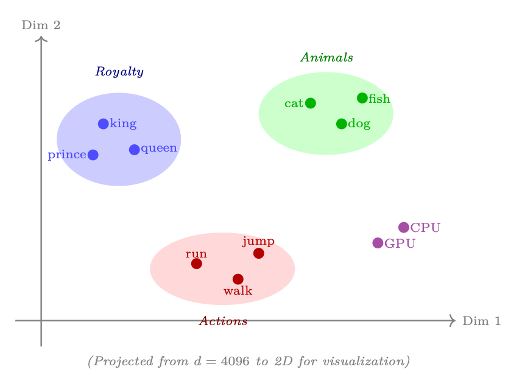<figcaption><span class="hh-tag">图 1.5：</span>嵌入空间可视化（二维投影）：语义相似的词聚在一起。嵌入表在预训练期间学习这些位置，纯粹从文本中的共现模式中捕捉含义。</figcaption></figure>

在实践中，嵌入层就是一个矩阵 <math alttext="\mathbf{E}\in\mathbb{R}^{|\mathcal{V}|\times d}" display="inline"><semantics><mrow><mi>𝐄</mi><mo>∈</mo><msup><mi>ℝ</mi><mrow><mrow><mo stretchy="false">|</mo><mi>𝒱</mi><mo rspace="0.055em" stretchy="false">|</mo></mrow><mo rspace="0.222em">×</mo><mi>d</mi></mrow></msup></mrow></semantics></math>，其中第 <math alttext="i" display="inline"><semantics><mi>i</mi></semantics></math> 行存储 Token <math alttext="i" display="inline"><semantics><mi>i</mi></semantics></math> 的嵌入向量：

<div class="hh-equation" id="ch1.e3"><math alttext="\text{embed}(x_{t})=\mathbf{E}[x_{t}]\in\mathbb{R}^{d}" display="block"><semantics><mrow><mrow><mtext>embed</mtext><mo lspace="0em" rspace="0em">​</mo><mrow><mo stretchy="false">(</mo><msub><mi>x</mi><mi>t</mi></msub><mo stretchy="false">)</mo></mrow></mrow><mo>=</mo><mrow><mi>𝐄</mi><mo>⁡</mo><mrow><mo stretchy="false">[</mo><msub><mi>x</mi><mi>t</mi></msub><mo stretchy="false">]</mo></mrow></mrow><mo>∈</mo><msup><mi>ℝ</mi><mi>d</mi></msup></mrow></semantics></math><span class="hh-equation-number">(1.3)</span></div>

对于 Token ID 序列 <math alttext="[x_{1},x_{2},\ldots,x_{n}]" display="inline"><semantics><mrow><mo stretchy="false">[</mo><mrow><msub><mi>x</mi><mn>1</mn></msub><mo>,</mo><msub><mi>x</mi><mn>2</mn></msub><mo>,</mo><mi mathvariant="normal">…</mi><mo>,</mo><msub><mi>x</mi><mi>n</mi></msub></mrow><mo stretchy="false">]</mo></mrow></semantics></math>，嵌入就是一次简单的查表（索引操作）：

<div class="hh-equation" id="ch1.ex2"><math alttext="\mathbf{H}_{0}=[\mathbf{E}[x_{1}];\;\mathbf{E}[x_{2}];\;\ldots;\;\mathbf{E}[x_{n}]]\in\mathbb{R}^{n\times d}" display="block"><semantics><mrow><msub><mi>𝐇</mi><mn>0</mn></msub><mo>=</mo><mrow><mo stretchy="false">[</mo><mrow><mrow><mi>𝐄</mi><mo>⁡</mo><mrow><mo stretchy="false">[</mo><msub><mi>x</mi><mn>1</mn></msub><mo stretchy="false">]</mo></mrow></mrow><mo rspace="0.447em">;</mo><mrow><mi>𝐄</mi><mo>⁡</mo><mrow><mo stretchy="false">[</mo><msub><mi>x</mi><mn>2</mn></msub><mo stretchy="false">]</mo></mrow></mrow><mo rspace="0.447em">;</mo><mi mathvariant="normal">…</mi><mo rspace="0.447em">;</mo><mrow><mi>𝐄</mi><mo>⁡</mo><mrow><mo stretchy="false">[</mo><msub><mi>x</mi><mi>n</mi></msub><mo stretchy="false">]</mo></mrow></mrow></mrow><mo stretchy="false">]</mo></mrow><mo>∈</mo><msup><mi>ℝ</mi><mrow><mi>n</mi><mo lspace="0.222em" rspace="0.222em">×</mo><mi>d</mi></mrow></msup></mrow></semantics></math></div>

当把预训练嵌入（例如来自 BERT 或 GPT-2 的嵌入）用于检索增强生成（RAG）或初始化推荐系统等下游任务时，会出现一个关键问题：学到的表征高度各向异性——它们在嵌入空间中占据一个狭窄的锥体，而不是均匀分布到所有方向 [87]。

<figure id="ch1.f6">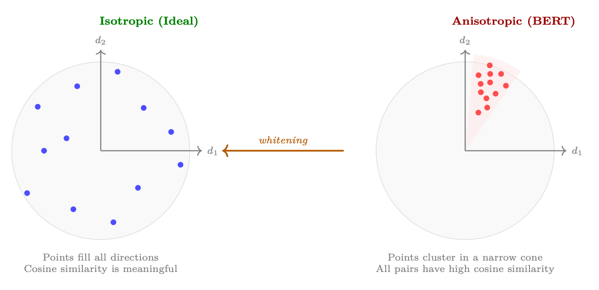<figcaption><span class="hh-tag">图 1.6：</span>嵌入空间中的等向性与各向异性。左：等向嵌入均匀分布，使余弦相似度成为衡量语义相关性的可靠指标。右：各向异性嵌入（如 BERT 中的情况）聚集在狭窄的锥体中，导致所有样本对的余弦相似度都很高，与语义内容无关。白化会重塑该空间，恢复等向性。</figcaption></figure>

这对应用为何重要：

<ul><li>检索增强生成（RAG）/ 检索：如果所有嵌入无论内容如何都拥有接近 <math alttext="&gt;0.7" display="inline"><semantics><mrow><mphantom></mphantom><mo>&gt;</mo><mn>0.7</mn></mrow></semantics></math> 的余弦相似度，检索排序就几乎变成随机的——系统无法区分相关与不相关的段落。</li><li>推荐系统：只有几何结构保留了有意义的相似性结构时，使用预训练 LLM 嵌入来表示物品/用户才有效。</li><li>聚类：各向异性嵌入会让簇塌缩，导致无法发现自然的分组。</li></ul>

一个简单而有效的修正方法是白化[341]——一种使嵌入分布变为等向（零均值、单位协方差）的线性变换：

<div class="hh-equation" id="ch1.e4"><math alttext="\tilde{\mathbf{h}}=\mathbf{D}^{-1/2}\mathbf{U}^{T}(\mathbf{h}-\bm{\mu})" display="block"><semantics><mrow><mover accent="true"><mi>𝐡</mi><mo>~</mo></mover><mo>=</mo><msup><mi>𝐃</mi><mrow><mo>−</mo><mn>1</mn><mo>/</mo><mn>2</mn></mrow></msup><msup><mi>𝐔</mi><mi>T</mi></msup><mrow><mo stretchy="false">(</mo><mi>𝐡</mi><mo>−</mo><mi>𝝁</mi><mo stretchy="false">)</mo></mrow></mrow></semantics></math><span class="hh-equation-number">(1.4)</span></div>

其中 <math alttext="\bm{\mu}" display="inline"><semantics><mi>𝝁</mi></semantics></math> 是平均嵌入，<math alttext="\mathbf{U}\mathbf{D}\mathbf{U}^{T}" display="inline"><semantics><msup><mi>𝐔𝐃𝐔</mi><mi>T</mi></msup></semantics></math> 是协方差矩阵 <math alttext="\Sigma=\frac{1}{N}\sum_{i}(\mathbf{h}_{i}-\bm{\mu})(\mathbf{h}_{i}-\bm{\mu})^{T}" display="inline"><semantics><mrow><mi mathvariant="normal">Σ</mi><mo>=</mo><mrow><mfrac><mn>1</mn><mi>N</mi></mfrac><mo lspace="0em" rspace="0em">​</mo><mrow><msub><mo rspace="0em">∑</mo><mi>i</mi></msub><mrow><mrow><mo stretchy="false">(</mo><mrow><msub><mi>𝐡</mi><mi>i</mi></msub><mo>−</mo><mi>𝝁</mi></mrow><mo stretchy="false">)</mo></mrow><mo lspace="0em" rspace="0em">​</mo><msup><mrow><mo stretchy="false">(</mo><mrow><msub><mi>𝐡</mi><mi>i</mi></msub><mo>−</mo><mi>𝝁</mi></mrow><mo stretchy="false">)</mo></mrow><mi>T</mi></msup></mrow></mrow></mrow></mrow></semantics></math> 的特征分解。

### 自注意力机制

自注意力是核心操作，它让每个 Token 都能关注序列中的每个其他 Token，并基于相关性计算加权组合。

朴素注意力计算的代价随序列长度呈二次增长：

<ul><li>时间：<math alttext="O(n^{2}\cdot d)" display="inline"><semantics><mrow><mi>O</mi><mo>⁡</mo><mrow><mo stretchy="false">(</mo><mrow><msup><mi>n</mi><mn>2</mn></msup><mo lspace="0.222em" rspace="0.222em">⋅</mo><mi>d</mi></mrow><mo stretchy="false">)</mo></mrow></mrow></semantics></math>——计算 <math alttext="QK^{T}" display="inline"><semantics><mrow><mi>Q</mi><mo lspace="0em" rspace="0em">​</mo><msup><mi>K</mi><mi>T</mi></msup></mrow></semantics></math> 需要 <math alttext="n^{2}" display="inline"><semantics><msup><mi>n</mi><mn>2</mn></msup></semantics></math> 次点积，每次的维度为 <math alttext="d_{k}" display="inline"><semantics><msub><mi>d</mi><mi>k</mi></msub></semantics></math>。</li><li>内存：<math alttext="O(n^{2})" display="inline"><semantics><mrow><mi>O</mi><mo>⁡</mo><mrow><mo stretchy="false">(</mo><msup><mi>n</mi><mn>2</mn></msup><mo stretchy="false">)</mo></mrow></mrow></semantics></math>——为了应用 softmax，必须显式地物化完整的注意力矩阵。</li></ul>

对于 <math alttext="d=4096" display="inline"><semantics><mrow><mi>d</mi><mo>=</mo><mn>4096</mn></mrow></semantics></math> 的 128K Token 上下文，仅注意力矩阵就有 <math alttext="128\text{K}\times 128\text{K}=16.4" display="inline"><semantics><mrow><mrow><mrow><mrow><mn>128</mn><mo lspace="0em" rspace="0em">​</mo><mtext>K</mtext></mrow><mo lspace="0.222em" rspace="0.222em">×</mo><mn>128</mn></mrow><mo lspace="0em" rspace="0em">​</mo><mtext>K</mtext></mrow><mo>=</mo><mn>16.4</mn></mrow></semantics></math> 十亿个元素（FP32 下为 64 GB）。这种二次增长是长上下文 LLM 的根本瓶颈。

<div class="hh-table" id="ch1.t4"><table class="ltx_tabular ltx_align_middle"><thead><tr><th class="ltx_align_left"><span>序列长度</span></th><th class="ltx_align_left"><span>注意力运算量</span></th><th class="ltx_align_left"><span>矩阵大小</span></th><th class="ltx_align_left"><span>实际影响</span></th></tr></thead><tbody><tr><td class="ltx_align_left">2K</td><td class="ltx_align_left">4M</td><td class="ltx_align_left">16 MB</td><td class="ltx_align_left">快速；可放入 SRAM</td></tr><tr><td class="ltx_align_left">8K</td><td class="ltx_align_left">64M</td><td class="ltx_align_left">256 MB</td><td class="ltx_align_left">使用 FlashAttention 时可控</td></tr><tr><td class="ltx_align_left">32K</td><td class="ltx_align_left">1B</td><td class="ltx_align_left">4 GB</td><td class="ltx_align_left">需要内存高效的 kernel</td></tr><tr><td class="ltx_align_left">128K</td><td class="ltx_align_left">16B</td><td class="ltx_align_left">64 GB</td><td class="ltx_align_left">超出现有单张 GPU 的 HBM</td></tr><tr><td class="ltx_align_left">1M</td><td class="ltx_align_left">1T</td><td class="ltx_align_left">4 TB</td><td class="ltx_align_left">不采用次二次方法则无法实现</td></tr></tbody></table><p class="hh-table-caption"><span class="hh-tag">表 1.4：</span>注意力代价的增长：为何朴素实现对长序列不可行。</p></div>

有多类方案可以应对这一二次瓶颈：

<ol><li>具备 IO 感知的精确注意力（FlashAttention [64]）：它并不降低计算复杂度，而是通过在能放入 SRAM 的分块中计算注意力，免去了在高带宽内存（HBM）中物化 <math alttext="n\times n" display="inline"><semantics><mrow><mi>n</mi><mo lspace="0.222em" rspace="0.222em">×</mo><mi>n</mi></mrow></semantics></math> 矩阵的需要。关键在于，FlashAttention 与下文的稀疏模式是正交的——它是一种执行引擎，而不是一种注意力模式。生产系统通常把 FlashAttention 与滑动窗口或块稀疏掩码结合使用，从而同时获得 IO 效率和更少的 FLOPs。我们将在第 1.6 FlashAttention——算法与硬件感知 节详细讨论该算法。</li><li>滑动窗口 / 局部注意力：每个 Token 只关注最近的 <math alttext="w" display="inline"><semantics><mi>w</mi></semantics></math> 个 Token（例如 <math alttext="w=4096" display="inline"><semantics><mrow><mi>w</mi><mo>=</mo><mn>4096</mn></mrow></semantics></math>）。代价变为 <math alttext="O(n\cdot w)" display="inline"><semantics><mrow><mi>O</mi><mo>⁡</mo><mrow><mo stretchy="false">(</mo><mrow><mi>n</mi><mo lspace="0.222em" rspace="0.222em">⋅</mo><mi>w</mi></mrow><mo stretchy="false">)</mo></mrow></mrow></semantics></math>——与 <math alttext="n" display="inline"><semantics><mi>n</mi></semantics></math> 呈线性关系。Mistral [165]（窗口 <math alttext="=4096" display="inline"><semantics><mrow><mphantom></mphantom><mo>=</mo><mn>4096</mn></mrow></semantics></math>）和 Longformer [23] 采用了这种方式。它以全局上下文换取效率；由于实践中大多数注意力都是局部的，因此效果良好。在现代技术栈中，滑动窗口掩码是在 FlashAttention kernel <em>内部</em>执行的。</li><li>稀疏注意力模式：将局部窗口与周期性的全局 Token 结合（例如每隔 512 个 Token 有一个关注全部）。BigBird [416] 和 LongT5 [125] 使用了这种方式。它以 <math alttext="O(n\sqrt{n})" display="inline"><semantics><mrow><mi>O</mi><mo>⁡</mo><mrow><mo stretchy="false">(</mo><mrow><mi>n</mi><mo lspace="0em" rspace="0em">​</mo><msqrt><mi>n</mi></msqrt></mrow><mo stretchy="false">)</mo></mrow></mrow></semantics></math> 的代价保留了一定的长程连通性。同样，FlashAttention 充当非零注意力块的底层 kernel。</li><li>线性注意力 / 状态空间模型：利用结合律把 <math alttext="\text{softmax}(QK^{T})V" display="inline"><semantics><mrow><mtext>softmax</mtext><mo lspace="0em" rspace="0em">​</mo><mrow><mo stretchy="false">(</mo><mrow><mi>Q</mi><mo lspace="0em" rspace="0em">​</mo><msup><mi>K</mi><mi>T</mi></msup></mrow><mo stretchy="false">)</mo></mrow><mo lspace="0em" rspace="0em">​</mo><mi>V</mi></mrow></semantics></math> 替换为 <math alttext="\phi(Q)(\phi(K)^{T}V)" display="inline"><semantics><mrow><mi>ϕ</mi><mo lspace="0em" rspace="0em">​</mo><mrow><mo stretchy="false">(</mo><mi>Q</mi><mo stretchy="false">)</mo></mrow><mo lspace="0em" rspace="0em">​</mo><mrow><mo stretchy="false">(</mo><mrow><mi>ϕ</mi><mo lspace="0em" rspace="0em">​</mo><msup><mrow><mo stretchy="false">(</mo><mi>K</mi><mo stretchy="false">)</mo></mrow><mi>T</mi></msup><mo lspace="0em" rspace="0em">​</mo><mi>V</mi></mrow><mo stretchy="false">)</mo></mrow></mrow></semantics></math>，或改写为递推形式（Mamba [122]、RWKV [288]）。理论上总量为 <math alttext="O(n\cdot d^{2})" display="inline"><semantics><mrow><mi>O</mi><mo>⁡</mo><mrow><mo stretchy="false">(</mo><mrow><mi>n</mi><mo lspace="0.222em" rspace="0.222em">⋅</mo><msup><mi>d</mi><mn>2</mn></msup></mrow><mo stretchy="false">)</mo></mrow></mrow></semantics></math>。与上面的方案 2–3 不同，这些是<em>架构层面的替换</em>，会改变模型的表达能力——无 softmax 的注意力在本质上的表达能力更弱，而且经验上这些模型在需要精确长程检索或复杂推理的任务上仍落后于 Transformer。</li><li>键值缓存（KV cache）压缩：在推理时压缩或逐出旧的 KV 对，以约束内存占用。相关技术包括：H<sub>2</sub>O [429]（heavy-hitter oracle——只保留注意力高的 keys）、StreamingLLM [394]（保留开头的「注意力汇」Token 加上最近的窗口），以及量化键值缓存 [238]。</li></ol>

### 多头注意力

多头注意力（Multi-Head Attention）并不只计算单个注意力函数，而是并行运行多个注意力操作，每个操作都学习关注输入的不同方面（句法、语义、位置等）。

DeepSeek-V2 [70] 引入了更激进的压缩：与 GQA 共享 KV 头不同，多头潜在注意力（Multi-head Latent Attention，MLA）把 <em>全部</em>键值信息压缩为每个 token 的单一低秩潜向量：

<div class="hh-equation" id="ch1.ex6"><math alttext="c_{t}=W_{DKV}\,h_{t},\quad K_{t}=W_{UK}\,c_{t},\quad V_{t}=W_{UV}\,c_{t}" display="block"><semantics><mrow><mrow><msub><mi>c</mi><mi>t</mi></msub><mo>=</mo><mrow><msub><mi>W</mi><mrow><mi>D</mi><mo lspace="0em" rspace="0em">​</mo><mi>K</mi><mo lspace="0em" rspace="0em">​</mo><mi>V</mi></mrow></msub><mo lspace="0em" rspace="0em">​</mo><msub><mi>h</mi><mi>t</mi></msub></mrow></mrow><mo rspace="1.167em">,</mo><mrow><msub><mi>K</mi><mi>t</mi></msub><mo>=</mo><mrow><msub><mi>W</mi><mrow><mi>U</mi><mo lspace="0em" rspace="0em">​</mo><mi>K</mi></mrow></msub><mo lspace="0em" rspace="0em">​</mo><msub><mi>c</mi><mi>t</mi></msub></mrow></mrow><mo rspace="1.167em">,</mo><mrow><msub><mi>V</mi><mi>t</mi></msub><mo>=</mo><mrow><msub><mi>W</mi><mrow><mi>U</mi><mo lspace="0em" rspace="0em">​</mo><mi>V</mi></mrow></msub><mo lspace="0em" rspace="0em">​</mo><msub><mi>c</mi><mi>t</mi></msub></mrow></mrow></mrow></semantics></math></div>

其中 <math alttext="c_{t}\in\mathbb{R}^{d_{c}}" display="inline"><semantics><mrow><msub><mi>c</mi><mi>t</mi></msub><mo>∈</mo><msup><mi>ℝ</mi><msub><mi>d</mi><mi>c</mi></msub></msup></mrow></semantics></math>，<math alttext="d_{c}\ll n_{h}\cdot d_{h}" display="inline"><semantics><mrow><msub><mi>d</mi><mi>c</mi></msub><mo>≪</mo><mrow><msub><mi>n</mi><mi>h</mi></msub><mo lspace="0.222em" rspace="0.222em">⋅</mo><msub><mi>d</mi><mi>h</mi></msub></mrow></mrow></semantics></math>。KV 缓存只存储 <math alttext="c_{t}" display="inline"><semantics><msub><mi>c</mi><mi>t</mi></msub></semantics></math>——甚至比 GQA 还小——而解压矩阵 <math alttext="W_{UK},W_{UV}" display="inline"><semantics><mrow><msub><mi>W</mi><mrow><mi>U</mi><mo lspace="0em" rspace="0em">​</mo><mi>K</mi></mrow></msub><mo>,</mo><msub><mi>W</mi><mrow><mi>U</mi><mo lspace="0em" rspace="0em">​</mo><mi>V</mi></mrow></msub></mrow></semantics></math> 会即时重建完整的键与值。由于压缩是端到端学到的，其质量达到甚至超过 GQA。MLA 使 DeepSeek 后续的 Sparse Attention 得以实现次二次复杂度的长上下文扩展，如今已是 DeepSeek-V3/V4 架构家族的基础。

### 位置编码

Transformer 在构造上是置换等变的——没有位置信息，模型无法区分「the cat sat on the mat」与「mat the on sat cat the」。位置编码注入序列顺序信号，使注意力能够推理 Token 的距离和方向。

<div class="hh-table" id="ch1.t5"><table class="ltx_tabular ltx_align_middle"><thead><tr><th class="ltx_align_left"><span>方法</span></th><th class="ltx_align_left ltx_align_top"><span class="ltx_align_top"><span><span>使用者</span></span></span></th><th class="ltx_align_left ltx_align_top"><span class="ltx_align_top"><span><span>核心思想</span></span></span></th></tr></thead><tbody><tr><th class="ltx_align_left">正弦</th><td class="ltx_align_left ltx_align_top"><span class="ltx_align_top"><span>原始 Transformer</span></span></td><td class="ltx_align_left ltx_align_top"><span class="ltx_align_top"><span>不同频率下的固定 <math alttext="\sin/\cos" display="inline"><semantics><mrow><mi>sin</mi><mo lspace="0em">/</mo><mi>cos</mi></mrow><span></span></semantics></math>。无需学习。</span></span></td></tr><tr><th class="ltx_align_left">学习的绝对位置</th><td class="ltx_align_left ltx_align_top"><span class="ltx_align_top"><span>GPT-2 <span>[301]</span>，BERT <span>[76]</span></span></span></td><td class="ltx_align_left ltx_align_top"><span class="ltx_align_top"><span>每个位置的学习嵌入。受限于训练长度。</span></span></td></tr><tr><th class="ltx_align_left">RoPE（旋转）</th><td class="ltx_align_left ltx_align_top"><span class="ltx_align_top"><span>Llama <span>[118]</span>，Qwen <span>[350]</span>，Mistral <span>[165]</span></span></span></td><td class="ltx_align_left ltx_align_top"><span class="ltx_align_top"><span>将 Q、K 向量按与位置相关的角度旋转。通过 NTK 感知缩放进行外推。</span></span></td></tr><tr><th class="ltx_align_left">ALiBi</th><td class="ltx_align_left ltx_align_top"><span class="ltx_align_top"><span>BLOOM <span>[383]</span>，MPT <span>[260]</span></span></span></td><td class="ltx_align_left ltx_align_top"><span class="ltx_align_top"><span>不使用位置嵌入；在注意力分数上添加线性偏置 <math alttext="-m|i-j|" display="inline"><semantics><mrow><mo>−</mo><mrow><mi>m</mi><mo lspace="0em" rspace="0em">​</mo><mrow><mo stretchy="false">|</mo><mrow><mi>i</mi><mo>−</mo><mi>j</mi></mrow><mo stretchy="false">|</mo></mrow></mrow></mrow><span></span></semantics></math>。简单，外推性好。</span></span></td></tr></tbody></table><p class="hh-table-caption"><span class="hh-tag">表 1.5：</span>现代 LLM 中的位置编码方法。</p></div>

该方法由原始 Transformer [357] 提出，在几何间隔的频率上使用固定的正弦函数：

<div class="hh-equation" id="ch1.ex7"><math alttext="\text{PE}(pos,2i)=\sin\!\Bigl(\frac{pos}{10000^{2i/d}}\Bigr),\qquad\text{PE}(pos,2i{+}1)=\cos\!\Bigl(\frac{pos}{10000^{2i/d}}\Bigr)" display="block"><semantics><mrow><mrow><mrow><mtext>PE</mtext><mo lspace="0em" rspace="0em">​</mo><mrow><mo stretchy="false">(</mo><mrow><mi>p</mi><mo lspace="0em" rspace="0em">​</mo><mi>o</mi><mo lspace="0em" rspace="0em">​</mo><mi>s</mi></mrow><mo>,</mo><mrow><mn>2</mn><mo lspace="0em" rspace="0em">​</mo><mi>i</mi></mrow><mo stretchy="false">)</mo></mrow></mrow><mo>=</mo><mrow><mpadded width="1.243em"><mi>sin</mi></mpadded><mo>⁡</mo><mrow><mo maxsize="1.600em" minsize="1.600em">(</mo><mfrac><mrow><mi>p</mi><mo lspace="0em" rspace="0em">​</mo><mi>o</mi><mo lspace="0em" rspace="0em">​</mo><mi>s</mi></mrow><msup><mn>10000</mn><mrow><mrow><mn>2</mn><mo lspace="0em" rspace="0em">​</mo><mi>i</mi></mrow><mo>/</mo><mi>d</mi></mrow></msup></mfrac><mo maxsize="1.600em" minsize="1.600em">)</mo></mrow></mrow></mrow><mo rspace="2.167em">,</mo><mrow><mrow><mtext>PE</mtext><mo lspace="0em" rspace="0em">​</mo><mrow><mo stretchy="false">(</mo><mrow><mi>p</mi><mo lspace="0em" rspace="0em">​</mo><mi>o</mi><mo lspace="0em" rspace="0em">​</mo><mi>s</mi></mrow><mo>,</mo><mrow><mrow><mn>2</mn><mo lspace="0em" rspace="0em">​</mo><mi>i</mi></mrow><mo>+</mo><mn>1</mn></mrow><mo stretchy="false">)</mo></mrow></mrow><mo>=</mo><mrow><mpadded width="1.216em"><mi>cos</mi></mpadded><mo>⁡</mo><mrow><mo maxsize="1.600em" minsize="1.600em">(</mo><mfrac><mrow><mi>p</mi><mo lspace="0em" rspace="0em">​</mo><mi>o</mi><mo lspace="0em" rspace="0em">​</mo><mi>s</mi></mrow><msup><mn>10000</mn><mrow><mrow><mn>2</mn><mo lspace="0em" rspace="0em">​</mo><mi>i</mi></mrow><mo>/</mo><mi>d</mi></mrow></msup></mfrac><mo maxsize="1.600em" minsize="1.600em">)</mo></mrow></mrow></mrow></mrow></semantics></math></div>

其中 <math alttext="pos" display="inline"><semantics><mrow><mi>p</mi><mo lspace="0em" rspace="0em">​</mo><mi>o</mi><mo lspace="0em" rspace="0em">​</mo><mi>s</mi></mrow></semantics></math> 是 Token 位置，<math alttext="i" display="inline"><semantics><mi>i</mi></semantics></math> 是维度索引，<math alttext="d" display="inline"><semantics><mi>d</mi></semantics></math> 是模型维度。

动机： 每个频率以不同尺度编码位置（类比二进制计数）。作者假设模型能够学会关注相对位置，因为 <math alttext="\text{PE}(pos+k)" display="inline"><semantics><mrow><mtext>PE</mtext><mo lspace="0em" rspace="0em">​</mo><mrow><mo stretchy="false">(</mo><mrow><mrow><mi>p</mi><mo lspace="0em" rspace="0em">​</mo><mi>o</mi><mo lspace="0em" rspace="0em">​</mo><mi>s</mi></mrow><mo>+</mo><mi>k</mi></mrow><mo stretchy="false">)</mo></mrow></mrow></semantics></math> 可以表示为 <math alttext="\text{PE}(pos)" display="inline"><semantics><mrow><mtext>PE</mtext><mo lspace="0em" rspace="0em">​</mo><mrow><mo stretchy="false">(</mo><mrow><mi>p</mi><mo lspace="0em" rspace="0em">​</mo><mi>o</mi><mo lspace="0em" rspace="0em">​</mo><mi>s</mi></mrow><mo stretchy="false">)</mo></mrow></mrow></semantics></math> 的线性函数。

优点： 零学习参数；确定性；理论上支持任意长度。 <br>

缺点： 实践中无法很好地外推到训练长度之外；模型必须间接学会从绝对信号中解码相对位置；大体上已被取代。

GPT-2 [301] 和 BERT [76] 采用该方法：把一个可学习的嵌入矩阵 <math alttext="\mathbf{E}_{\text{pos}}\in\mathbb{R}^{L_{\max}\times d}" display="inline"><semantics><mrow><msub><mi>𝐄</mi><mtext>pos</mtext></msub><mo>∈</mo><msup><mi>ℝ</mi><mrow><msub><mi>L</mi><mi>max</mi></msub><mo lspace="0.222em" rspace="0.222em">×</mo><mi>d</mi></mrow></msup></mrow></semantics></math> 加到 Token 嵌入上：

<div class="hh-equation" id="ch1.ex8"><math alttext="h_{0}^{(pos)}=\text{TokenEmbed}(x_{pos})+\mathbf{E}_{\text{pos}}[pos]" display="block"><semantics><mrow><msubsup><mi>h</mi><mn>0</mn><mrow><mo stretchy="false">(</mo><mrow><mi>p</mi><mo lspace="0em" rspace="0em">​</mo><mi>o</mi><mo lspace="0em" rspace="0em">​</mo><mi>s</mi></mrow><mo stretchy="false">)</mo></mrow></msubsup><mo>=</mo><mrow><mrow><mtext>TokenEmbed</mtext><mo lspace="0em" rspace="0em">​</mo><mrow><mo stretchy="false">(</mo><msub><mi>x</mi><mrow><mi>p</mi><mo lspace="0em" rspace="0em">​</mo><mi>o</mi><mo lspace="0em" rspace="0em">​</mo><mi>s</mi></mrow></msub><mo stretchy="false">)</mo></mrow></mrow><mo>+</mo><mrow><msub><mi>𝐄</mi><mtext>pos</mtext></msub><mo lspace="0em" rspace="0em">​</mo><mrow><mo stretchy="false">[</mo><mrow><mi>p</mi><mo lspace="0em" rspace="0em">​</mo><mi>o</mi><mo lspace="0em" rspace="0em">​</mo><mi>s</mi></mrow><mo stretchy="false">]</mo></mrow></mrow></mrow></mrow></semantics></math></div>

动机： 让模型自行学习对任务最优的位置表示，而不是强加某种固定结构。

优点： 灵活性最大；实现简单；在短序列上往往优于正弦位置编码。 <br>

缺点： 最大长度 <math alttext="L_{\max}" display="inline"><semantics><msub><mi>L</mi><mi>max</mi></msub></semantics></math> 被硬编码；无法泛化到该长度之外；<math alttext="L_{\max}" display="inline"><semantics><msub><mi>L</mi><mi>max</mi></msub></semantics></math> 末尾附近的嵌入训练不足；增加 <math alttext="L_{\max}\times d" display="inline"><semantics><mrow><msub><mi>L</mi><mi>max</mi></msub><mo lspace="0.222em" rspace="0.222em">×</mo><mi>d</mi></mrow></semantics></math> 个参数。

RoPE [340] 通过在二维子空间中 <em>旋转</em> 查询与键向量来编码位置：

<div class="hh-equation" id="ch1.ex9"><math alttext="\text{RoPE}(x_{m},m)=\begin{pmatrix}x_{m}^{(1)}\\
x_{m}^{(2)}\\
\vdots\\
x_{m}^{(d-1)}\\
x_{m}^{(d)}\end{pmatrix}\odot\begin{pmatrix}\cos m\theta_{1}\\
\cos m\theta_{1}\\
\vdots\\
\cos m\theta_{d/2}\\
\cos m\theta_{d/2}\end{pmatrix}+\begin{pmatrix}-x_{m}^{(2)}\\
x_{m}^{(1)}\\
\vdots\\
-x_{m}^{(d)}\\
x_{m}^{(d-1)}\end{pmatrix}\odot\begin{pmatrix}\sin m\theta_{1}\\
\sin m\theta_{1}\\
\vdots\\
\sin m\theta_{d/2}\\
\sin m\theta_{d/2}\end{pmatrix}" display="block"><semantics><mrow><mrow><mtext>RoPE</mtext><mo lspace="0em" rspace="0em">​</mo><mrow><mo stretchy="false">(</mo><msub><mi>x</mi><mi>m</mi></msub><mo>,</mo><mi>m</mi><mo stretchy="false">)</mo></mrow></mrow><mo>=</mo><mrow><mrow><mrow><mo>(</mo><mtable displaystyle="true" rowspacing="0pt"><mtr><mtd><msubsup><mi>x</mi><mi>m</mi><mrow><mo stretchy="false">(</mo><mn>1</mn><mo stretchy="false">)</mo></mrow></msubsup></mtd></mtr><mtr><mtd><msubsup><mi>x</mi><mi>m</mi><mrow><mo stretchy="false">(</mo><mn>2</mn><mo stretchy="false">)</mo></mrow></msubsup></mtd></mtr><mtr><mtd></mtd></mtr><mtr><mtd><msubsup><mi>x</mi><mi>m</mi><mrow><mo stretchy="false">(</mo><mrow><mi>d</mi><mo>−</mo><mn>1</mn></mrow><mo stretchy="false">)</mo></mrow></msubsup></mtd></mtr><mtr><mtd><msubsup><mi>x</mi><mi>m</mi><mrow><mo stretchy="false">(</mo><mi>d</mi><mo stretchy="false">)</mo></mrow></msubsup></mtd></mtr></mtable><mo rspace="0.055em">)</mo></mrow><mo rspace="0.222em">⊙</mo><mrow><mo>(</mo><mtable displaystyle="true" rowspacing="0pt"><mtr><mtd><mrow><mrow><mi>cos</mi><mo lspace="0.167em">⁡</mo><mi>m</mi></mrow><mo lspace="0em" rspace="0em">​</mo><msub><mi>θ</mi><mn>1</mn></msub></mrow></mtd></mtr><mtr><mtd><mrow><mrow><mi>cos</mi><mo lspace="0.167em">⁡</mo><mi>m</mi></mrow><mo lspace="0em" rspace="0em">​</mo><msub><mi>θ</mi><mn>1</mn></msub></mrow></mtd></mtr><mtr><mtd></mtd></mtr><mtr><mtd><mrow><mrow><mi>cos</mi><mo lspace="0.167em">⁡</mo><mi>m</mi></mrow><mo lspace="0em" rspace="0em">​</mo><msub><mi>θ</mi><mrow><mi>d</mi><mo>/</mo><mn>2</mn></mrow></msub></mrow></mtd></mtr><mtr><mtd><mrow><mrow><mi>cos</mi><mo lspace="0.167em">⁡</mo><mi>m</mi></mrow><mo lspace="0em" rspace="0em">​</mo><msub><mi>θ</mi><mrow><mi>d</mi><mo>/</mo><mn>2</mn></mrow></msub></mrow></mtd></mtr></mtable><mo>)</mo></mrow></mrow><mo>+</mo><mrow><mrow><mo>(</mo><mtable displaystyle="true" rowspacing="0pt"><mtr><mtd><mrow><mo>−</mo><msubsup><mi>x</mi><mi>m</mi><mrow><mo stretchy="false">(</mo><mn>2</mn><mo stretchy="false">)</mo></mrow></msubsup></mrow></mtd></mtr><mtr><mtd><msubsup><mi>x</mi><mi>m</mi><mrow><mo stretchy="false">(</mo><mn>1</mn><mo stretchy="false">)</mo></mrow></msubsup></mtd></mtr><mtr><mtd></mtd></mtr><mtr><mtd><mrow><mo>−</mo><msubsup><mi>x</mi><mi>m</mi><mrow><mo stretchy="false">(</mo><mi>d</mi><mo stretchy="false">)</mo></mrow></msubsup></mrow></mtd></mtr><mtr><mtd><msubsup><mi>x</mi><mi>m</mi><mrow><mo stretchy="false">(</mo><mrow><mi>d</mi><mo>−</mo><mn>1</mn></mrow><mo stretchy="false">)</mo></mrow></msubsup></mtd></mtr></mtable><mo rspace="0.055em">)</mo></mrow><mo rspace="0.222em">⊙</mo><mrow><mo>(</mo><mtable displaystyle="true" rowspacing="0pt"><mtr><mtd><mrow><mrow><mi>sin</mi><mo lspace="0.167em">⁡</mo><mi>m</mi></mrow><mo lspace="0em" rspace="0em">​</mo><msub><mi>θ</mi><mn>1</mn></msub></mrow></mtd></mtr><mtr><mtd><mrow><mrow><mi>sin</mi><mo lspace="0.167em">⁡</mo><mi>m</mi></mrow><mo lspace="0em" rspace="0em">​</mo><msub><mi>θ</mi><mn>1</mn></msub></mrow></mtd></mtr><mtr><mtd></mtd></mtr><mtr><mtd><mrow><mrow><mi>sin</mi><mo lspace="0.167em">⁡</mo><mi>m</mi></mrow><mo lspace="0em" rspace="0em">​</mo><msub><mi>θ</mi><mrow><mi>d</mi><mo>/</mo><mn>2</mn></mrow></msub></mrow></mtd></mtr><mtr><mtd><mrow><mrow><mi>sin</mi><mo lspace="0.167em">⁡</mo><mi>m</mi></mrow><mo lspace="0em" rspace="0em">​</mo><msub><mi>θ</mi><mrow><mi>d</mi><mo>/</mo><mn>2</mn></mrow></msub></mrow></mtd></mtr></mtable><mo>)</mo></mrow></mrow></mrow></mrow></semantics></math></div>

其中 <math alttext="\theta_{i}=10000^{-2i/d}" display="inline"><semantics><mrow><mi>θ</mi><msub><mrow></mrow><mi>i</mi></msub><mo>=</mo><mn>10000</mn><msup><mrow></mrow><mrow><mo>−</mo><mn>2</mn><mi>i</mi><mo>/</mo><mi>d</mi></mrow></msup></mrow></semantics></math>，<math alttext="m" display="inline"><semantics><mi>m</mi></semantics></math> 是位置索引。关键性质是：旋转后的查询与键之间的点积只依赖于相对位置：

<div class="hh-equation" id="ch1.ex10"><math alttext="\langle\text{RoPE}(q_{m},m),\;\text{RoPE}(k_{n},n)\rangle=f(q_{m},k_{n},m-n)" display="block"><semantics><mrow><mrow><mo stretchy="false">⟨</mo><mrow><mrow><mtext>RoPE</mtext><mo lspace="0em" rspace="0em">​</mo><mrow><mo stretchy="false">(</mo><msub><mi>q</mi><mi>m</mi></msub><mo>,</mo><mi>m</mi><mo stretchy="false">)</mo></mrow></mrow><mo rspace="0.447em">,</mo><mrow><mtext>RoPE</mtext><mo lspace="0em" rspace="0em">​</mo><mrow><mo stretchy="false">(</mo><msub><mi>k</mi><mi>n</mi></msub><mo>,</mo><mi>n</mi><mo stretchy="false">)</mo></mrow></mrow></mrow><mo stretchy="false">⟩</mo></mrow><mo>=</mo><mrow><mi>f</mi><mo>⁡</mo><mrow><mo stretchy="false">(</mo><msub><mi>q</mi><mi>m</mi></msub><mo>,</mo><msub><mi>k</mi><mi>n</mi></msub><mo>,</mo><mrow><mi>m</mi><mo>−</mo><mi>n</mi></mrow><mo stretchy="false">)</mo></mrow></mrow></mrow></semantics></math></div>

动机： 在不需要显式偏置项的情况下实现相对位置编码，同时保持与线性注意力和 KV 缓存的兼容性。

优点： 天然相对；不增加额外参数；与高效推理兼容；可通过 NTK 感知缩放 [289] 或 YaRN（调整 <math alttext="\theta" display="inline"><semantics><mi>θ</mi></semantics></math> 基数或对频率做插值）扩展到更长的上下文。 <br>

缺点： 每次注意力操作的计算量略有增加（旋转 + 交错）；外推需要显式的缩放策略；二维子空间中的旋转施加了一种结构，可能并非对所有任务都最优。

ALiBi [292] 采取了截然不同的思路：<em>完全不使用位置嵌入</em>。取而代之的是，从注意力分数中减去一个静态线性惩罚：

<div class="hh-equation" id="ch1.ex11"><math alttext="\text{Attention}(Q,K,V)=\text{softmax}\!\left(\frac{QK^{T}}{\sqrt{d_{k}}}-m\cdot\bigl[|i-j|\bigr]_{i,j}\right)V" display="block"><semantics><mrow><mrow><mtext>Attention</mtext><mo lspace="0em" rspace="0em">​</mo><mrow><mo stretchy="false">(</mo><mi>Q</mi><mo>,</mo><mi>K</mi><mo>,</mo><mi>V</mi><mo stretchy="false">)</mo></mrow></mrow><mo>=</mo><mrow><mpadded width="3.720em"><mtext>softmax</mtext></mpadded><mo lspace="0em" rspace="0em">​</mo><mrow><mo>(</mo><mrow><mfrac><mrow><mi>Q</mi><mo lspace="0em" rspace="0em">​</mo><msup><mi>K</mi><mi>T</mi></msup></mrow><msqrt><msub><mi>d</mi><mi>k</mi></msub></msqrt></mfrac><mo>−</mo><mrow><mi>m</mi><mo lspace="0.222em" rspace="0.222em">⋅</mo><msub><mrow><mo maxsize="1.200em" minsize="1.200em">[</mo><mrow><mo stretchy="false">|</mo><mrow><mi>i</mi><mo>−</mo><mi>j</mi></mrow><mo stretchy="false">|</mo></mrow><mo maxsize="1.200em" minsize="1.200em">]</mo></mrow><mrow><mi>i</mi><mo>,</mo><mi>j</mi></mrow></msub></mrow></mrow><mo>)</mo></mrow><mo lspace="0em" rspace="0em">​</mo><mi>V</mi></mrow></mrow></semantics></math></div>

其中 <math alttext="m" display="inline"><semantics><mi>m</mi></semantics></math> 是每个头特有的斜率（按几何方式设定：共 <math alttext="H" display="inline"><semantics><mi>H</mi></semantics></math> 个头中的第 <math alttext="h" display="inline"><semantics><mi>h</mi></semantics></math> 个头取 <math alttext="m_{h}=2^{-8h/H}" display="inline"><semantics><mrow><mi>m</mi><msub><mrow></mrow><mi>h</mi></msub><mo>=</mo><mn>2</mn><msup><mrow></mrow><mrow><mo>−</mo><mn>8</mn><mi>h</mi><mo>/</mo><mi>H</mi></mrow></msup></mrow></semantics></math>）。偏置 <math alttext="-m|i-j|" display="inline"><semantics><mrow><mo>−</mo><mrow><mi>m</mi><mo lspace="0em" rspace="0em">​</mo><mrow><mo stretchy="false">|</mo><mrow><mi>i</mi><mo>−</mo><mi>j</mi></mrow><mo stretchy="false">|</mo></mrow></mrow></mrow></semantics></math> 形成一个软局部注意力窗口，其宽度随头而异。

动机： 位置应当使注意力偏向邻近的 Token（近因先验），而不干扰嵌入空间。由于 ALiBi 完全在注意力分数空间中操作，它避免了用位置信号污染 Token 表示。

优点： 长度外推能力出色（在 1k 上训练，可工作到 8k+）；零参数；实现极其简单；头特有的斜率带来多尺度的局部性。 <br>

缺点： 对需要精确长程位置推理的任务（例如「第 5 个词是什么？」）表达能力较弱；线性衰减是一种很强的归纳偏置，可能不适合所有领域；由于 RoPE 的短上下文表现更好，ALiBi 在近期模型中大体上已被 RoPE 取代。

<div class="hh-table" id="ch1.t6"><table class="ltx_tabular ltx_align_middle"><thead><tr><th></th><th class="ltx_align_left ltx_align_top"><span class="ltx_align_top"><span><span>正弦</span></span></span></th><th class="ltx_align_left ltx_align_top"><span class="ltx_align_top"><span><span>学习的绝对位置</span></span></span></th><th class="ltx_align_left ltx_align_top"><span class="ltx_align_top"><span><span>RoPE</span></span></span></th><th class="ltx_align_left ltx_align_top"><span class="ltx_align_top"><span><span>ALiBi</span></span></span></th></tr></thead><tbody><tr><th class="ltx_align_left">额外参数</th><td class="ltx_align_left ltx_align_top"><span class="ltx_align_top"><span>无</span></span></td><td class="ltx_align_left ltx_align_top"><span class="ltx_align_top"><span><math alttext="L_{\max}\times d" display="inline"><semantics><mrow><msub><mi>L</mi><mi>max</mi></msub><mo lspace="0.222em" rspace="0.222em">×</mo><mi>d</mi></mrow><span></span></semantics></math></span></span></td><td class="ltx_align_left ltx_align_top"><span class="ltx_align_top"><span>无</span></span></td><td class="ltx_align_left ltx_align_top"><span class="ltx_align_top"><span>无</span></span></td></tr><tr><th class="ltx_align_left">位置类型</th><td class="ltx_align_left ltx_align_top"><span class="ltx_align_top"><span>绝对</span></span></td><td class="ltx_align_left ltx_align_top"><span class="ltx_align_top"><span>绝对</span></span></td><td class="ltx_align_left ltx_align_top"><span class="ltx_align_top"><span>相对</span></span></td><td class="ltx_align_left ltx_align_top"><span class="ltx_align_top"><span>相对（隐式）</span></span></td></tr><tr><th class="ltx_align_left">长度外推</th><td class="ltx_align_left ltx_align_top"><span class="ltx_align_top"><span>差</span></span></td><td class="ltx_align_left ltx_align_top"><span class="ltx_align_top"><span>无</span></span></td><td class="ltx_align_left ltx_align_top"><span class="ltx_align_top"><span>好（配合缩放）</span></span></td><td class="ltx_align_left ltx_align_top"><span class="ltx_align_top"><span>出色</span></span></td></tr><tr><th class="ltx_align_left">计算开销</th><td class="ltx_align_left ltx_align_top"><span class="ltx_align_top"><span>可忽略</span></span></td><td class="ltx_align_left ltx_align_top"><span class="ltx_align_top"><span>可忽略</span></span></td><td class="ltx_align_left ltx_align_top"><span class="ltx_align_top"><span>较小</span></span></td><td class="ltx_align_left ltx_align_top"><span class="ltx_align_top"><span>可忽略</span></span></td></tr><tr><th class="ltx_align_left">主导时期</th><td class="ltx_align_left ltx_align_top"><span class="ltx_align_top"><span>2017–19</span></span></td><td class="ltx_align_left ltx_align_top"><span class="ltx_align_top"><span>2018–20</span></span></td><td class="ltx_align_left ltx_align_top"><span class="ltx_align_top"><span>2022 年至今</span></span></td><td class="ltx_align_left ltx_align_top"><span class="ltx_align_top"><span>2022–23</span></span></td></tr></tbody></table><p class="hh-table-caption"><span class="hh-tag">表 1.6：</span>位置编码对比：实际权衡。</p></div>

现代前沿模型（Claude [11] 具有 200K–1M 上下文，Gemini 1.5 [108] 达到 1M+，GPT-4 [274] 为 128K）需要能在远超训练长度时依然保持可靠的位置编码。目前的主流方案有：

<ol><li>带频率缩放的 RoPE：将 RoPE 扩展到训练长度之外的标准做法。无需重新训练，而是对基频 <math alttext="\theta" display="inline"><semantics><mi>θ</mi></semantics></math> 重新缩放：<math alttext="\theta^{\prime}_{i}=\theta_{i}\cdot\left(\frac{L_{\text{target}}}{L_{\text{train}}}\right)^{2i/d}" display="block"><semantics><mrow><msubsup><mi>θ</mi><mi>i</mi><mo>′</mo></msubsup><mo>=</mo><mrow><msub><mi>θ</mi><mi>i</mi></msub><mo lspace="0.222em" rspace="0.222em">⋅</mo><msup><mrow><mo>(</mo><mfrac><msub><mi>L</mi><mtext>target</mtext></msub><msub><mi>L</mi><mtext>train</mtext></msub></mfrac><mo>)</mo></mrow><mrow><mrow><mn>2</mn><mo lspace="0em" rspace="0em">​</mo><mi>i</mi></mrow><mo>/</mo><mi>d</mi></mrow></msup></mrow></mrow></semantics></math>变体包括：<span class="hh-tag">•</span>线性缩放（位置插值） [48]：简单地把位置索引除以因子 <math alttext="s" display="inline"><semantics><mi>s</mi></semantics></math>。成本低，但在高扩展比例下会降低质量。<span class="hh-tag">•</span>NTK 感知缩放[289]：缩放基频 <math alttext="\theta=10000\to 10000\cdot s^{d/(d-2)}" display="inline"><semantics><mrow><mi>θ</mi><mo>=</mo><mn>10000</mn><mo stretchy="false">→</mo><mrow><mn>10000</mn><mo lspace="0.222em" rspace="0.222em">⋅</mo><msup><mi>s</mi><mrow><mi>d</mi><mo>/</mo><mrow><mo stretchy="false">(</mo><mrow><mi>d</mi><mo>−</mo><mn>2</mn></mrow><mo stretchy="false">)</mo></mrow></mrow></msup></mrow></mrow></semantics></math>。在扩展低频（全局）范围的同时保留高频（局部）信息。<span class="hh-tag">•</span>YaRN[289]（Yet another RoPE extensioN）：把 NTK 缩放与注意力温度校正以及在小型长上下文语料上的微调结合起来。Llama-3 用它把训练时的 8K 扩展到部署时的 128K。<span class="hh-tag">•</span>动态 NTK[289]：在推理时根据实际序列长度即时调整缩放因子。不需要固定的扩展比例——模型会随上下文增长而自适应。</li><li>在长数据上继续预训练：即使有 RoPE 缩放，模型也能从在长文档上进行的短暂继续预训练（1–5B Token）中受益。这教会模型真正 <em>使用</em> 远距离上下文，而不只是在位置上容忍它。Llama-3.1 采用了渐进式日程：8K <math alttext="\to" display="inline"><semantics><mo stretchy="false">→</mo></semantics></math> 64K <math alttext="\to" display="inline"><semantics><mo stretchy="false">→</mo></semantics></math> 128K。</li><li>Ring Attention / 分块并行[222]：对于超出单块 GPU 内存的序列（1M+ Token），Ring Attention 以环形拓扑把序列分布到多块 GPU 上。每块 GPU 持有一个块，并沿环传递 KV 块，计算局部的注意力瓦片。这使得内存随 GPU 数量线性扩展，同时保持精确注意力。</li><li>混合架构：一些系统把大多数层使用的局部滑动窗口（例如 4K）与特定层（例如每隔 4 层）的完整注意力结合起来。这样在大部分计算上只需付出 <math alttext="O(n\cdot w)" display="inline"><semantics><mrow><mi>O</mi><mo>⁡</mo><mrow><mo stretchy="false">(</mo><mrow><mi>n</mi><mo lspace="0.222em" rspace="0.222em">⋅</mo><mi>w</mi></mrow><mo stretchy="false">)</mo></mrow></mrow></semantics></math> 的代价，同时保持全局信息流动。</li></ol>

### 前馈网络（MLP）

每个 transformer 块都包含一个独立作用于每个位置的多层感知机（MLP）：

<div class="hh-equation" id="ch1.ex13"><math alttext="\text{FFN}(x)=W_{2}\cdot\sigma(W_{1}x+b_{1})+b_{2}" display="block"><semantics><mrow><mrow><mtext>FFN</mtext><mo lspace="0em" rspace="0em">​</mo><mrow><mo stretchy="false">(</mo><mi>x</mi><mo stretchy="false">)</mo></mrow></mrow><mo>=</mo><mrow><mrow><msub><mi>W</mi><mn>2</mn></msub><mo lspace="0.222em" rspace="0.222em">⋅</mo><mrow><mi>σ</mi><mo>⁡</mo><mrow><mo stretchy="false">(</mo><mrow><mrow><msub><mi>W</mi><mn>1</mn></msub><mo lspace="0em" rspace="0em">​</mo><mi>x</mi></mrow><mo>+</mo><msub><mi>b</mi><mn>1</mn></msub></mrow><mo stretchy="false">)</mo></mrow></mrow></mrow><mo>+</mo><msub><mi>b</mi><mn>2</mn></msub></mrow></mrow></semantics></math></div>

其中 <math alttext="W_{1}\in\mathbb{R}^{d\times 4d}" display="inline"><semantics><mrow><msub><mi>W</mi><mn>1</mn></msub><mo>∈</mo><msup><mi>ℝ</mi><mrow><mrow><mi>d</mi><mo lspace="0.222em" rspace="0.222em">×</mo><mn>4</mn></mrow><mo lspace="0em" rspace="0em">​</mo><mi>d</mi></mrow></msup></mrow></semantics></math>，<math alttext="W_{2}\in\mathbb{R}^{4d\times d}" display="inline"><semantics><mrow><msub><mi>W</mi><mn>2</mn></msub><mo>∈</mo><msup><mi>ℝ</mi><mrow><mrow><mn>4</mn><mo lspace="0em" rspace="0em">​</mo><mi>d</mi></mrow><mo lspace="0.222em" rspace="0.222em">×</mo><mi>d</mi></mrow></msup></mrow></semantics></math>。现代 LLM 使用：

<ul><li>SwiGLU 激活：<math alttext="\text{FFN}(x)=W_{2}(\text{Swish}(W_{1}x)\odot W_{3}x)" display="inline"><semantics><mrow><mrow><mtext>FFN</mtext><mo lspace="0em" rspace="0em">​</mo><mrow><mo stretchy="false">(</mo><mi>x</mi><mo stretchy="false">)</mo></mrow></mrow><mo>=</mo><mrow><msub><mi>W</mi><mn>2</mn></msub><mo lspace="0em" rspace="0em">​</mo><mrow><mo stretchy="false">(</mo><mrow><mrow><mrow><mtext>Swish</mtext><mo lspace="0em" rspace="0em">​</mo><mrow><mo stretchy="false">(</mo><mrow><msub><mi>W</mi><mn>1</mn></msub><mo lspace="0em" rspace="0em">​</mo><mi>x</mi></mrow><mo rspace="0.055em" stretchy="false">)</mo></mrow></mrow><mo rspace="0.222em">⊙</mo><msub><mi>W</mi><mn>3</mn></msub></mrow><mo lspace="0em" rspace="0em">​</mo><mi>x</mi></mrow><mo stretchy="false">)</mo></mrow></mrow></mrow></semantics></math> —— Llama [118]、Mistral [165] 使用。需要 3 个权重矩阵，但性能更好。</li><li>隐藏维度通常为 <math alttext="8/3\times d" display="inline"><semantics><mrow><mrow><mn>8</mn><mo>/</mo><mn>3</mn></mrow><mo lspace="0.222em" rspace="0.222em">×</mo><mi>d</mi></mrow></semantics></math>（为提升张量核心效率而取 256 的整数倍）。</li></ul>

### 层归一化（Layer Normalization）

层归一化（Layer Normalization）通过在特征维度上归一化激活值来稳定训练。它相对于注意力/FFN 子层的位置会显著影响训练动态。

给定一个隐藏状态向量 <math alttext="\mathbf{x}\in\mathbb{R}^{d}" display="inline"><semantics><mrow><mi>𝐱</mi><mo>∈</mo><msup><mi>ℝ</mi><mi>d</mi></msup></mrow></semantics></math>（单个 Token 的表示），LayerNorm [15] 计算：

<div class="hh-equation" id="ch1.e5"><math alttext="\text{LayerNorm}(\mathbf{x})=\gamma\odot\frac{\mathbf{x}-\mu}{\sqrt{\sigma^{2}+\epsilon}}+\beta" display="block"><semantics><mrow><mrow><mtext>LayerNorm</mtext><mo lspace="0em" rspace="0em">​</mo><mrow><mo stretchy="false">(</mo><mi>𝐱</mi><mo stretchy="false">)</mo></mrow></mrow><mo>=</mo><mrow><mrow><mi>γ</mi><mo lspace="0.222em" rspace="0.222em">⊙</mo><mfrac><mrow><mi>𝐱</mi><mo>−</mo><mi>μ</mi></mrow><msqrt><mrow><msup><mi>σ</mi><mn>2</mn></msup><mo>+</mo><mi>ϵ</mi></mrow></msqrt></mfrac></mrow><mo>+</mo><mi>β</mi></mrow></mrow></semantics></math><span class="hh-equation-number">(1.5)</span></div>

其中：

<ul><li><math alttext="\mu=\frac{1}{d}\sum_{i=1}^{d}x_{i}" display="inline"><semantics><mrow><mi>μ</mi><mo>=</mo><mrow><mfrac><mn>1</mn><mi>d</mi></mfrac><mo lspace="0em" rspace="0em">​</mo><mrow><msubsup><mo>∑</mo><mrow><mi>i</mi><mo>=</mo><mn>1</mn></mrow><mi>d</mi></msubsup><msub><mi>x</mi><mi>i</mi></msub></mrow></mrow></mrow></semantics></math>（在 <math alttext="d" display="inline"><semantics><mi>d</mi></semantics></math> 个特征维度上的均值）</li><li><math alttext="\sigma^{2}=\frac{1}{d}\sum_{i=1}^{d}(x_{i}-\mu)^{2}" display="inline"><semantics><mrow><msup><mi>σ</mi><mn>2</mn></msup><mo>=</mo><mrow><mfrac><mn>1</mn><mi>d</mi></mfrac><mo lspace="0em" rspace="0em">​</mo><mrow><msubsup><mo rspace="0em">∑</mo><mrow><mi>i</mi><mo>=</mo><mn>1</mn></mrow><mi>d</mi></msubsup><msup><mrow><mo stretchy="false">(</mo><mrow><msub><mi>x</mi><mi>i</mi></msub><mo>−</mo><mi>μ</mi></mrow><mo stretchy="false">)</mo></mrow><mn>2</mn></msup></mrow></mrow></mrow></semantics></math>（特征之间的方差）</li><li><math alttext="\gamma,\beta\in\mathbb{R}^{d}" display="inline"><semantics><mrow><mrow><mi>γ</mi><mo>,</mo><mi>β</mi></mrow><mo>∈</mo><msup><mi>ℝ</mi><mi>d</mi></msup></mrow></semantics></math> 是 可学习的 缩放与平移参数（逐维度）</li><li><math alttext="\epsilon\approx 10^{-5}" display="inline"><semantics><mrow><mi>ϵ</mi><mo>≈</mo><msup><mn>10</mn><mrow><mo>−</mo><mn>5</mn></mrow></msup></mrow></semantics></math> 防止除零</li></ul>

与 BatchNorm 的关键区别：LayerNorm 在单个样本的 <em>特征维度</em> 上归一化，而不是跨 batch 归一化。这使它与 batch 大小无关，并且在训练和推理时行为完全一致。

RMSNorm [421] 去掉了均值中心化步骤，仅用均方根进行归一化：

<div class="hh-equation" id="ch1.e6"><math alttext="\text{RMSNorm}(\mathbf{x})=\gamma\odot\frac{\mathbf{x}}{\text{RMS}(\mathbf{x})},\qquad\text{RMS}(\mathbf{x})=\sqrt{\frac{1}{d}\sum_{i=1}^{d}x_{i}^{2}}" display="block"><semantics><mrow><mrow><mrow><mtext>RMSNorm</mtext><mo lspace="0em" rspace="0em">​</mo><mrow><mo stretchy="false">(</mo><mi>𝐱</mi><mo stretchy="false">)</mo></mrow></mrow><mo>=</mo><mrow><mi>γ</mi><mo lspace="0.222em" rspace="0.222em">⊙</mo><mfrac><mi>𝐱</mi><mrow><mtext>RMS</mtext><mo lspace="0em" rspace="0em">​</mo><mrow><mo stretchy="false">(</mo><mi>𝐱</mi><mo stretchy="false">)</mo></mrow></mrow></mfrac></mrow></mrow><mo rspace="2.167em">,</mo><mrow><mrow><mtext>RMS</mtext><mo lspace="0em" rspace="0em">​</mo><mrow><mo stretchy="false">(</mo><mi>𝐱</mi><mo stretchy="false">)</mo></mrow></mrow><mo>=</mo><msqrt><mrow><mfrac><mn>1</mn><mi>d</mi></mfrac><mo lspace="0em" rspace="0em">​</mo><mrow><munderover><mo movablelimits="false">∑</mo><mrow><mi>i</mi><mo>=</mo><mn>1</mn></mrow><mi>d</mi></munderover><msubsup><mi>x</mi><mi>i</mi><mn>2</mn></msubsup></mrow></mrow></msqrt></mrow></mrow></semantics></math><span class="hh-equation-number">(1.6)</span></div>

没有 <math alttext="\beta" display="inline"><semantics><mi>β</mi></semantics></math>（平移）参数，也不做均值减法——只有缩放。这为每个 Token 省去一次归约操作，在 GPU 上快 <math alttext="\sim" display="inline"><semantics><mo>∼</mo></semantics></math>5–10%，同时达到同等的模型质量。所有现代 LLM（Llama、Mistral、Qwen）都使用 RMSNorm。

### 模型规模参考

下表汇总了广泛使用的开放权重模型（截至 2025 年的最新版本）的关键架构参数，供快速查阅模型规模与设计选择。

<div class="hh-table" id="ch1.t7"><table class="ltx_tabular ltx_align_middle"><thead><tr><th class="ltx_align_left"><span>模型</span></th><th class="ltx_align_left ltx_align_top"><span class="ltx_align_top"><span><span>参数</span></span></span></th><th class="ltx_align_left ltx_align_top"><span class="ltx_align_top"><span><span>层数</span></span></span></th><th class="ltx_align_left ltx_align_top"><span class="ltx_align_top"><span><math alttext="d" display="inline"><semantics><mi>d</mi><span></span></semantics></math></span></span></th><th class="ltx_align_left ltx_align_top"><span class="ltx_align_top"><span><span>头数</span></span></span></th><th class="ltx_align_left ltx_align_top"><span class="ltx_align_top"><span><span>KV 头数</span></span></span></th><th class="ltx_align_left ltx_align_top"><span class="ltx_align_top"><span><span>上下文</span></span></span></th></tr></thead><tbody><tr><th class="ltx_align_left">Llama-3.1 8B <span>[118]</span></th><td class="ltx_align_left ltx_align_top"><span class="ltx_align_top"><span>8B</span></span></td><td class="ltx_align_left ltx_align_top"><span class="ltx_align_top"><span>32</span></span></td><td class="ltx_align_left ltx_align_top"><span class="ltx_align_top"><span>4096</span></span></td><td class="ltx_align_left ltx_align_top"><span class="ltx_align_top"><span>32</span></span></td><td class="ltx_align_left ltx_align_top"><span class="ltx_align_top"><span>8</span></span></td><td class="ltx_align_left ltx_align_top"><span class="ltx_align_top"><span>128K</span></span></td></tr><tr><th class="ltx_align_left">Llama-3.1 405B <span>[118]</span></th><td class="ltx_align_left ltx_align_top"><span class="ltx_align_top"><span>405B</span></span></td><td class="ltx_align_left ltx_align_top"><span class="ltx_align_top"><span>126</span></span></td><td class="ltx_align_left ltx_align_top"><span class="ltx_align_top"><span>16384</span></span></td><td class="ltx_align_left ltx_align_top"><span class="ltx_align_top"><span>128</span></span></td><td class="ltx_align_left ltx_align_top"><span class="ltx_align_top"><span>8</span></span></td><td class="ltx_align_left ltx_align_top"><span class="ltx_align_top"><span>128K</span></span></td></tr><tr><th class="ltx_align_left">Llama-4 Maverick <span>[4]</span></th><td class="ltx_align_left ltx_align_top"><span class="ltx_align_top"><span>400B（17B 激活）</span></span></td><td class="ltx_align_left ltx_align_top"><span class="ltx_align_top"><span>48</span></span></td><td class="ltx_align_left ltx_align_top"><span class="ltx_align_top"><span>5120</span></span></td><td class="ltx_align_left ltx_align_top"><span class="ltx_align_top"><span>40</span></span></td><td class="ltx_align_left ltx_align_top"><span class="ltx_align_top"><span>8</span></span></td><td class="ltx_align_left ltx_align_top"><span class="ltx_align_top"><span>1M</span></span></td></tr><tr><th class="ltx_align_left">Mistral Large 2 <span>[5]</span></th><td class="ltx_align_left ltx_align_top"><span class="ltx_align_top"><span>123B</span></span></td><td class="ltx_align_left ltx_align_top"><span class="ltx_align_top"><span>88</span></span></td><td class="ltx_align_left ltx_align_top"><span class="ltx_align_top"><span>12288</span></span></td><td class="ltx_align_left ltx_align_top"><span class="ltx_align_top"><span>96</span></span></td><td class="ltx_align_left ltx_align_top"><span class="ltx_align_top"><span>8</span></span></td><td class="ltx_align_left ltx_align_top"><span class="ltx_align_top"><span>128K</span></span></td></tr><tr><th class="ltx_align_left">Qwen-2.5 72B <span>[350]</span></th><td class="ltx_align_left ltx_align_top"><span class="ltx_align_top"><span>72B</span></span></td><td class="ltx_align_left ltx_align_top"><span class="ltx_align_top"><span>80</span></span></td><td class="ltx_align_left ltx_align_top"><span class="ltx_align_top"><span>8192</span></span></td><td class="ltx_align_left ltx_align_top"><span class="ltx_align_top"><span>64</span></span></td><td class="ltx_align_left ltx_align_top"><span class="ltx_align_top"><span>8</span></span></td><td class="ltx_align_left ltx_align_top"><span class="ltx_align_top"><span>128K</span></span></td></tr><tr><th class="ltx_align_left">DeepSeek-V3 <span>[71]</span></th><td class="ltx_align_left ltx_align_top"><span class="ltx_align_top"><span>671B（37B 激活）</span></span></td><td class="ltx_align_left ltx_align_top"><span class="ltx_align_top"><span>61</span></span></td><td class="ltx_align_left ltx_align_top"><span class="ltx_align_top"><span>7168</span></span></td><td class="ltx_align_left ltx_align_top"><span class="ltx_align_top"><span>128</span></span></td><td class="ltx_align_left ltx_align_top"><span class="ltx_align_top"><span>MLA</span></span></td><td class="ltx_align_left ltx_align_top"><span class="ltx_align_top"><span>128K</span></span></td></tr></tbody></table><p class="hh-table-caption"><span class="hh-tag">表 1.7：</span>主流开放权重 LLM 的架构参数（2024–2025 一代）。</p></div>

<em>注</em>：标注了「激活」参数的模型采用专家混合（Mixture-of-Experts，MoE）架构——总参数代表模型容量，而激活参数反映每 Token 的计算开销。DeepSeek-V3 使用多头潜在注意力（Multi-head Latent Attention，MLA）而非标准 GQA，把 KV 压缩到低秩潜在空间。

### 注意力病态

注意力机制虽然强大，却存在一些系统性的失效模式，从业者必须理解它们——尤其是在扩展到长上下文或解释模型行为时。

Xiao 等人 [393] 发现，transformer 模型会给序列中的 <em>第一个 Token</em> 分配高得不成比例的注意力分数——无论其语义内容是什么。即使第一个 Token 只是一个无意义的 <code>⟨BOS⟩</code> 标记，各层的注意力头仍会持续关注它，有时占到总注意力权重的 20–50%。

Softmax 注意力必须产生一个合法的概率分布（<math alttext="\sum_{j}\alpha_{j}=1" display="inline"><semantics><mrow><mrow><msub><mo>∑</mo><mi>j</mi></msub><msub><mi>α</mi><mi>j</mi></msub></mrow><mo>=</mo><mn>1</mn></mrow></semantics></math>）。当没有任何键与某个查询特别相关时，模型需要为未使用的注意力权重找一个「倾倒」位置。训练过程中，第一个 Token 成为这个默认的汇点，因为它始终存在且位置可预测。它充当一个 <em>空操作的注意力目标</em>——模型已经学会把无关的注意力导向那里，而不是不可预测地分散它。

<div class="hh-equation" id="ch1.ex14"><math alttext="\alpha_{\text{sink}}=\frac{\exp(q^{\top}k_{0}/\sqrt{d})}{\sum_{j}\exp(q^{\top}k_{j}/\sqrt{d})}\gg\frac{1}{n}\quad\text{(even when }k_{0}\text{ is semantically irrelevant)}" display="block"><semantics><mrow><mrow><msub><mi>α</mi><mtext>sink</mtext></msub><mo>=</mo><mfrac><mrow><mi>exp</mi><mo>⁡</mo><mrow><mo stretchy="false">(</mo><mrow><mrow><msup><mi>q</mi><mo>⊤</mo></msup><mo lspace="0em" rspace="0em">​</mo><msub><mi>k</mi><mn>0</mn></msub></mrow><mo>/</mo><msqrt><mi>d</mi></msqrt></mrow><mo stretchy="false">)</mo></mrow></mrow><mrow><msub><mo>∑</mo><mi>j</mi></msub><mrow><mi>exp</mi><mo>⁡</mo><mrow><mo stretchy="false">(</mo><mrow><mrow><msup><mi>q</mi><mo>⊤</mo></msup><mo lspace="0em" rspace="0em">​</mo><msub><mi>k</mi><mi>j</mi></msub></mrow><mo>/</mo><msqrt><mi>d</mi></msqrt></mrow><mo stretchy="false">)</mo></mrow></mrow></mrow></mfrac><mo>≫</mo><mfrac><mn>1</mn><mi>n</mi></mfrac></mrow><mspace width="1em"></mspace><mrow><mtext>(even when </mtext><mo lspace="0em" rspace="0em">​</mo><msub><mi>k</mi><mn>0</mn></msub><mo lspace="0em" rspace="0em">​</mo><mtext> is semantically irrelevant)</mtext></mrow></mrow></semantics></math></div>

<ul><li>流式推理失败：使用滑动窗口 KV 缓存时，驱逐第一个 Token 会导致困惑度灾难性地飙升——模型失去了它的注意力汇。</li><li>误导性的可解释性：朴素的注意力可视化会让人觉得第一个 Token「很重要」，而它其实只是一个数学产物。</li><li>上下文窗口浪费：汇点 Token 占用了一个 KV 缓存槽位，却不携带有用信息。</li></ul>

<ul><li>StreamingLLM[393]：始终把前 <math alttext="k" display="inline"><semantics><mi>k</mi></semantics></math> 个 Token（「注意力汇」）与最近的滑动窗口一起保留在 KV 缓存中。从而在有界内存下实现无限长度生成。</li><li>按设计设置的汇点 Token：一些模型（例如 Mistral）在训练时会前置专门的汇点 Token，其用途明确就是吸收剩余的注意力。</li><li>Softmax 的替代方案：用 ReLU 注意力或 sigmoid 门控取代 softmax，这样零注意力可以被直接表示，无需借助倾倒目标。</li></ul>

随着序列长度 <math alttext="n" display="inline"><semantics><mi>n</mi></semantics></math> 增长，每个查询必须把注意力预算分散到更多的键上。每个 Token 的平均注意力权重按 <math alttext="O(1/n)" display="inline"><semantics><mrow><mi>O</mi><mo>⁡</mo><mrow><mo stretchy="false">(</mo><mrow><mn>1</mn><mo>/</mo><mi>n</mi></mrow><mo stretchy="false">)</mo></mrow></mrow></semantics></math> 下降，使模型越来越难以集中在少数真正相关的位置上——这一问题被称为 <em>注意力稀释</em> 或 <em>注意力扩散</em>[227]。

Liu 等人 [227] 表明，LLM 呈现出 U 形的检索曲线：放在长上下文 <em>开头</em> 或 <em>结尾</em> 的信息能被可靠检索，而 <em>中间</em> 的信息常常被忽略。这是注意力稀释叠加 RoPE/ALiBi 的位置偏置所直接导致的结果：

<ul><li>Softmax 饱和：键很多时，softmax 的等效温度降低，使分布更接近均匀（熵更高）。</li><li>位置衰减：RoPE 的相对位置编码会随距离产生自然衰减，从而抑制对既远离开头也远离结尾的中间位置的注意力。</li><li>训练分布：在较短序列上训练的模型会形成偏向近期上下文的注意力模式。</li></ul>

<ul><li>显式检索：把相关上下文放在 Prompt 的开头或结尾；使用 RAG 以避免依赖中间位置。</li><li>长上下文训练：在长文档上训练，并让关键信息的位置多样化 [100]。</li><li>层级式注意力：Mamba [123] 或 RWKV 之类的架构，完全避开 <math alttext="O(n^{2})" display="inline"><semantics><mrow><mi>O</mi><mo>⁡</mo><mrow><mo stretchy="false">(</mo><msup><mi>n</mi><mn>2</mn></msup><mo stretchy="false">)</mo></mrow></mrow></semantics></math> 注意力瓶颈。</li><li>地标 Token：在上下文中插入可检索的标记，充当注意力的「路标」。</li><li>温度缩放：一些实现会把注意力 logits 缩放 <math alttext="\log n" display="inline"><semantics><mrow><mi>log</mi><mo lspace="0.167em">⁡</mo><mi>n</mi></mrow></semantics></math>，以抵消长序列中的稀释。</li></ul>

<div class="hh-table" id="ch1.t8"><table class="ltx_tabular ltx_align_middle"><thead><tr><th class="ltx_align_left"><span>模式</span></th><th class="ltx_align_left ltx_align_top"><span class="ltx_align_top"><span><span>描述</span></span></span></th><th class="ltx_align_left ltx_align_top"><span class="ltx_align_top"><span><span>含义</span></span></span></th></tr></thead><tbody><tr><th class="ltx_align_left"><span>注意力头专门化</span></th><td class="ltx_align_left ltx_align_top"><span class="ltx_align_top"><span>不同的头学习不同的角色：句法头、共指头、位置头 <span>[361]</span></span></span></td><td class="ltx_align_left ltx_align_top"><span class="ltx_align_top"><span>并非所有头都同等重要；许多头可以被剪枝</span></span></td></tr><tr><th class="ltx_align_left"><span>归纳头</span></th><td class="ltx_align_left ltx_align_top"><span class="ltx_align_top"><span>实现 [A][B]…[A] <math alttext="\to" display="inline"><semantics><mo stretchy="false">→</mo><span></span></semantics></math> [B] 复制的头 <span>[273]</span></span></span></td><td class="ltx_align_left ltx_align_top"><span class="ltx_align_top"><span>对上下文学习至关重要；在 2 层及以上的模型中涌现</span></span></td></tr><tr><th class="ltx_align_left"><span>注意力塌缩</span></th><td class="ltx_align_left ltx_align_top"><span class="ltx_align_top"><span>在深层网络中，注意力分布可能趋同（所有头都关注相同的位置）</span></span></td><td class="ltx_align_left ltx_align_top"><span class="ltx_align_top"><span>损害表达能力；可通过注意力多样性损失来解决</span></span></td></tr><tr><th class="ltx_align_left"><span>检索头</span></th><td class="ltx_align_left ltx_align_top"><span class="ltx_align_top"><span>特定的头专门负责从上下文中检索事实信息 <span>[387]</span></span></span></td><td class="ltx_align_left ltx_align_top"><span class="ltx_align_top"><span>这解释了为什么剪枝某些头会导致幻觉激增</span></span></td></tr></tbody></table><p class="hh-table-caption"><span class="hh-tag">表 1.8：</span>在大型 transformer 中观察到的其他注意力模式。</p></div>

### 为可解释性而进行注意力可视化

注意力权重为了解模型推理提供了一个窗口——但必须谨慎解读。

最简单的做法：为每个头和每一层把 <math alttext="n\times n" display="inline"><semantics><mrow><mi>n</mi><mo lspace="0.222em" rspace="0.222em">×</mo><mi>n</mi></mrow></semantics></math> 注意力矩阵 <math alttext="A=\text{softmax}(QK^{\top}/\sqrt{d})" display="inline"><semantics><mrow><mi>A</mi><mo>=</mo><mrow><mtext>softmax</mtext><mo lspace="0em" rspace="0em">​</mo><mrow><mo stretchy="false">(</mo><mrow><mrow><mi>Q</mi><mo lspace="0em" rspace="0em">​</mo><msup><mi>K</mi><mo>⊤</mo></msup></mrow><mo>/</mo><msqrt><mi>d</mi></msqrt></mrow><mo stretchy="false">)</mo></mrow></mrow></mrow></semantics></math> 绘制成热力图。BertViz [359] 之类的工具可以渲染可交互的多头可视化。

单层的原始注意力具有误导性，因为信息会通过残差连接流经 <em>所有</em> 层。Abnar 和 Zuidema [2] 提出了 <em>注意力展开</em>：把各层的注意力矩阵相乘，以近似从输入到输出的总信息流：

<div class="hh-equation" id="ch1.ex15"><math alttext="R^{(l)}=A^{(l)}\cdot R^{(l-1)},\quad R^{(0)}=I" display="block"><semantics><mrow><mrow><msup><mi>R</mi><mrow><mo stretchy="false">(</mo><mi>l</mi><mo stretchy="false">)</mo></mrow></msup><mo>=</mo><mrow><msup><mi>A</mi><mrow><mo stretchy="false">(</mo><mi>l</mi><mo stretchy="false">)</mo></mrow></msup><mo lspace="0.222em" rspace="0.222em">⋅</mo><msup><mi>R</mi><mrow><mo stretchy="false">(</mo><mrow><mi>l</mi><mo>−</mo><mn>1</mn></mrow><mo stretchy="false">)</mo></mrow></msup></mrow></mrow><mo rspace="1.167em">,</mo><mrow><msup><mi>R</mi><mrow><mo stretchy="false">(</mo><mn>0</mn><mo stretchy="false">)</mo></mrow></msup><mo>=</mo><mi>I</mi></mrow></mrow></semantics></math></div>

其中 <math alttext="A^{(l)}" display="inline"><semantics><msup><mi>A</mi><mrow><mo stretchy="false">(</mo><mi>l</mi><mo stretchy="false">)</mo></mrow></msup></semantics></math> 是第 <math alttext="l" display="inline"><semantics><mi>l</mi></semantics></math> 层的（在多个头上取平均的）注意力矩阵，并做了调整以包含残差连接：<math alttext="A^{(l)}=0.5\cdot A^{(l)}_{\text{raw}}+0.5\cdot I" display="inline"><semantics><mrow><msup><mi>A</mi><mrow><mo stretchy="false">(</mo><mi>l</mi><mo stretchy="false">)</mo></mrow></msup><mo>=</mo><mrow><mrow><mn>0.5</mn><mo lspace="0.222em" rspace="0.222em">⋅</mo><msubsup><mi>A</mi><mtext>raw</mtext><mrow><mo stretchy="false">(</mo><mi>l</mi><mo stretchy="false">)</mo></mrow></msubsup></mrow><mo>+</mo><mrow><mn>0.5</mn><mo lspace="0.222em" rspace="0.222em">⋅</mo><mi>I</mi></mrow></mrow></mrow></semantics></math>。

把注意力权重与梯度信息结合起来，以识别哪些被关注的 Token 真正 <em>影响</em> 了输出 [20]：

<div class="hh-equation" id="ch1.ex16"><math alttext="\text{Relevance}(i)=\alpha_{i}\cdot\left|\frac{\partial y}{\partial h_{i}}\right|" display="block"><semantics><mrow><mrow><mtext>Relevance</mtext><mo lspace="0em" rspace="0em">​</mo><mrow><mo stretchy="false">(</mo><mi>i</mi><mo stretchy="false">)</mo></mrow></mrow><mo>=</mo><mrow><msub><mi>α</mi><mi>i</mi></msub><mo lspace="0.222em" rspace="0.222em">⋅</mo><mrow><mo>|</mo><mfrac><mrow><mo>∂</mo><mi>y</mi></mrow><mrow><mo>∂</mo><msub><mi>h</mi><mi>i</mi></msub></mrow></mfrac><mo>|</mo></mrow></mrow></mrow></semantics></math></div>

这回应了「高注意力 <math alttext="\neq" display="inline"><semantics><mo>≠</mo></semantics></math> 高影响」这一批评（一个 Token 可能获得很高的注意力，却经由接近零权重的路径被处理）。

transformer 的 MLP 和残差流中的单个神经元通常是 <em>多义的</em>——一个神经元会为多个互不相关的概念激活（例如「蓝色 AND 学术引用 AND 单词 'the'」）。这使直接的神经元级解读不可靠。

Cunningham 等人 [63] 和 Bricken 等人 [30] 证明，在模型激活上训练稀疏自编码器（SAE）可以把多义表示分解为 <em>单义特征</em>——每个特征都是对应单一概念的可解释方向：

<div class="hh-equation" id="ch1.ex17"><math alttext="h=W_{\text{dec}}\cdot\text{ReLU}(W_{\text{enc}}\cdot x+b_{\text{enc}})+b_{\text{dec}}" display="block"><semantics><mrow><mi>h</mi><mo>=</mo><mrow><mrow><mrow><msub><mi>W</mi><mtext>dec</mtext></msub><mo lspace="0.222em" rspace="0.222em">⋅</mo><mtext>ReLU</mtext></mrow><mo lspace="0em" rspace="0em">​</mo><mrow><mo stretchy="false">(</mo><mrow><mrow><msub><mi>W</mi><mtext>enc</mtext></msub><mo lspace="0.222em" rspace="0.222em">⋅</mo><mi>x</mi></mrow><mo>+</mo><msub><mi>b</mi><mtext>enc</mtext></msub></mrow><mo stretchy="false">)</mo></mrow></mrow><mo>+</mo><msub><mi>b</mi><mtext>dec</mtext></msub></mrow></mrow></semantics></math></div>

其中 <math alttext="W_{\text{enc}}\in\mathbb{R}^{m\times d}" display="inline"><semantics><mrow><msub><mi>W</mi><mtext>enc</mtext></msub><mo>∈</mo><msup><mi>ℝ</mi><mrow><mi>m</mi><mo lspace="0.222em" rspace="0.222em">×</mo><mi>d</mi></mrow></msup></mrow></semantics></math>，<math alttext="m\gg d" display="inline"><semantics><mrow><mi>m</mi><mo>≫</mo><mi>d</mi></mrow></semantics></math>（超完备基），而 ReLU + 稀疏性惩罚确保每个输入只有少数特征被激活。

<ul><li>特征是 <em>单义的</em>：每个特征编码一个人类可解释的概念（「用 Python 写的代码」「提到金门大桥」「第一人称叙述」） [30]。</li><li>特征是 <em>可操控的</em>：把某个特征的激活钳制到高/低值可以直接控制模型行为（例如强制打开「金门大桥」特征，会让模型在每次回答中都提到它） [353]。</li><li>特征可以组合：复杂行为由简单特征的组合涌现而来。</li><li>SAE 可扩展：Templeton 等人 [353] 在 Claude 3 Sonnet 上训练了最多包含 34M 个特征的 SAE，找到了对应安全相关概念（欺骗、谄媚、危险请求）的可解释特征。</li></ul>

SAE 把激活分解为可解释的 <em>向量</em>，但其特征仍需人工查看最大激活样本来理解。Anthropic 的自然语言自编码器（NLAE）[12] 采用了根本不同的思路：用 <em>自然语言描述</em> 取代稀疏瓶颈，从而使可解释性实现自动化。

<ol><li>编码器：一个语言模型读取隐藏激活（或输入文本），并生成对当前激活概念的自然语言描述：例如「该文本讨论法国菜，并使用正式的学术语气。」</li><li>解码器：第二个语言模型读取该自然语言描述，并重建原始激活（或预测下一个 Token）。</li><li>训练：编码器和解码器端到端训练以最小化重建损失，瓶颈是一个变长的自然语言字符串，而不是稀疏向量。</li></ol>

<ul><li>自解释：特征 <em>本身</em> 就是自然语言——无需人工标注。</li><li>可组合：能够表达复杂的关系性概念（「对某一事实主张的讽刺性回应」），而 SAE 特征无法把它们表示为单个方向。</li><li>层级式：描述可以在同一表示中同时捕捉细粒度（词级）和粗粒度（文档级）的性质。</li><li>可审计：瓶颈处的描述是人类可读的，从而可以直接查看模型「认为」存在哪些信息。</li></ul>

NLAE 引入了语言模型在环，因此计算成本高昂，并且可能与其他任何由模型生成的解释一样存在忠实性方面的担忧。它们也难以表示亚符号特征（几何模式、精确数值），而 SAE 可以自然地以激活幅度的形式处理这些特征。

## 预测头：Transformer 的输出

transformer 主体为每个位置产生上下文化的隐藏状态 <math alttext="\mathbf{h}_{t}\in\mathbb{R}^{d}" display="inline"><semantics><mrow><msub><mi>𝐡</mi><mi>t</mi></msub><mo>∈</mo><msup><mi>ℝ</mi><mi>d</mi></msup></mrow></semantics></math>。我们用这些隐藏状态 <em>做</em> 什么——也就是 预测头——定义了任务。只需更换预测头，同一个 transformer 主干就能承担截然不同的用途。

<figure id="ch1.f7">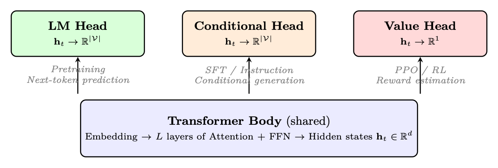<figcaption><span class="hh-tag">图 1.7：</span>同一个 transformer 主干通过更换预测头来支持不同任务。本文所使用的三个头在最终投影层之下架构完全相同。</figcaption></figure>

### 语言建模头（预训练阶段）

标准的 LM 头把最终的隐藏状态投影到词表 logits，并以交叉熵损失针对下一个 Token 进行训练：

<div class="hh-equation" id="ch1.e7"><math alttext="P(x_{t+1}|x_{\leq t})=\text{softmax}(\mathbf{W}_{\text{head}}\cdot\mathbf{h}_{t}+\mathbf{b})" display="block"><semantics><mrow><mrow><mi>P</mi><mo>⁡</mo><mrow><mo stretchy="false">(</mo><msub><mi>x</mi><mrow><mi>t</mi><mo>+</mo><mn>1</mn></mrow></msub><mo lspace="0em" rspace="0em">|</mo><msub><mi>x</mi><mrow><mphantom></mphantom><mo>≤</mo><mi>t</mi></mrow></msub><mo stretchy="false">)</mo></mrow></mrow><mo>=</mo><mrow><mtext>softmax</mtext><mo lspace="0em" rspace="0em">​</mo><mrow><mo stretchy="false">(</mo><mrow><mrow><msub><mi>𝐖</mi><mtext>head</mtext></msub><mo lspace="0.222em" rspace="0.222em">⋅</mo><msub><mi>𝐡</mi><mi>t</mi></msub></mrow><mo>+</mo><mi>𝐛</mi></mrow><mo stretchy="false">)</mo></mrow></mrow></mrow></semantics></math><span class="hh-equation-number">(1.7)</span></div>

其中 <math alttext="\mathbf{W}_{\text{head}}\in\mathbb{R}^{|\mathcal{V}|\times d}" display="inline"><semantics><mrow><msub><mi>𝐖</mi><mtext>head</mtext></msub><mo>∈</mo><msup><mi>ℝ</mi><mrow><mrow><mo stretchy="false">|</mo><mi>𝒱</mi><mo rspace="0.055em" stretchy="false">|</mo></mrow><mo rspace="0.222em">×</mo><mi>d</mi></mrow></msup></mrow></semantics></math>（通常与嵌入矩阵共享权重：<math alttext="\mathbf{W}_{\text{head}}=\mathbf{E}^{T}" display="inline"><semantics><mrow><msub><mi>𝐖</mi><mtext>head</mtext></msub><mo>=</mo><msup><mi>𝐄</mi><mi>T</mi></msup></mrow></semantics></math>）。

### 条件生成头（SFT / 指令跟随）

对于监督微调（SFT），其架构与 LM 头<em>完全相同</em>——同样是到词表 logits 的线性投影。区别完全在于<em>我们在什么上计算损失</em>：

<div class="hh-equation" id="ch1.e8"><math alttext="\mathcal{L}_{\text{SFT}}=-\frac{1}{|y|}\sum_{t=1}^{|y|}\log P(y_{t}|x_{\text{prompt}},y_{&lt;t})" display="block"><semantics><mrow><msub><mi>ℒ</mi><mtext>SFT</mtext></msub><mo rspace="0em">=</mo><mo lspace="0em">−</mo><mfrac><mn>1</mn><mrow><mo stretchy="false">|</mo><mi>y</mi><mo stretchy="false">|</mo></mrow></mfrac><munderover><mo movablelimits="false">∑</mo><mrow><mi>t</mi><mo>=</mo><mn>1</mn></mrow><mrow><mo stretchy="false">|</mo><mi>y</mi><mo stretchy="false">|</mo></mrow></munderover><mi>log</mi><mi>P</mi><mrow><mo stretchy="false">(</mo><msub><mi>y</mi><mi>t</mi></msub><mo fence="false" rspace="0.167em" stretchy="false">|</mo><msub><mi>x</mi><mtext>prompt</mtext></msub><mo>,</mo><msub><mi>y</mi><mrow><mphantom></mphantom><mo>&lt;</mo><mi>t</mi></mrow></msub><mo stretchy="false">)</mo></mrow></mrow></semantics></math><span class="hh-equation-number">(1.8)</span></div>

### 价值头（用于 RL 的回归头）

在强化学习（PPO、GRPO）中，我们需要估计一个状态<em>有多好</em>——这需要标量输出，而不是词表 logits。价值头用一个简单的回归层替换了 LM 投影：

<div class="hh-equation" id="ch1.e9"><math alttext="V(s_{t})=\mathbf{w}_{\text{value}}^{T}\cdot\mathbf{h}_{t}+b\in\mathbb{R}" display="block"><semantics><mrow><mrow><mi>V</mi><mo>⁡</mo><mrow><mo stretchy="false">(</mo><msub><mi>s</mi><mi>t</mi></msub><mo stretchy="false">)</mo></mrow></mrow><mo>=</mo><mrow><mrow><msubsup><mi>𝐰</mi><mtext>value</mtext><mi>T</mi></msubsup><mo lspace="0.222em" rspace="0.222em">⋅</mo><msub><mi>𝐡</mi><mi>t</mi></msub></mrow><mo>+</mo><mi>b</mi></mrow><mo>∈</mo><mi>ℝ</mi></mrow></semantics></math><span class="hh-equation-number">(1.9)</span></div>

其中 <math alttext="\mathbf{w}_{\text{value}}\in\mathbb{R}^{d}" display="inline"><semantics><mrow><msub><mi>𝐰</mi><mtext>value</mtext></msub><mo>∈</mo><msup><mi>ℝ</mi><mi>d</mi></msup></mrow></semantics></math>，<math alttext="b\in\mathbb{R}" display="inline"><semantics><mrow><mi>b</mi><mo>∈</mo><mi>ℝ</mi></mrow></semantics></math>。

### 预测头选择总览

<div class="hh-table" id="ch1.t9"><table class="ltx_tabular ltx_align_middle"><thead><tr><th class="ltx_align_left"><span>头</span></th><th class="ltx_align_left ltx_align_top"><span class="ltx_align_top"><span><span>输出</span></span></span></th><th class="ltx_align_left ltx_align_top"><span class="ltx_align_top"><span><span>损失</span></span></span></th><th class="ltx_align_left ltx_align_top"><span class="ltx_align_top"><span><span>阶段</span></span></span></th><th class="ltx_align_left ltx_align_top"><span class="ltx_align_top"><span><span>用途</span></span></span></th></tr></thead><tbody><tr><th class="ltx_align_left">LM 头</th><td class="ltx_align_left ltx_align_top"><span class="ltx_align_top"><span><math alttext="\mathbb{R}^{|\mathcal{V}|}" display="inline"><semantics><msup><mi>ℝ</mi><mrow><mo stretchy="false">|</mo><mi>𝒱</mi><mo stretchy="false">|</mo></mrow></msup><span></span></semantics></math></span></span></td><td class="ltx_align_left ltx_align_top"><span class="ltx_align_top"><span>交叉熵（所有 Token）</span></span></td><td class="ltx_align_left ltx_align_top"><span class="ltx_align_top"><span>预训练</span></span></td><td class="ltx_align_left ltx_align_top"><span class="ltx_align_top"><span>从原始文本中学习语言</span></span></td></tr><tr><th class="ltx_align_left">条件生成头</th><td class="ltx_align_left ltx_align_top"><span class="ltx_align_top"><span><math alttext="\mathbb{R}^{|\mathcal{V}|}" display="inline"><semantics><msup><mi>ℝ</mi><mrow><mo stretchy="false">|</mo><mi>𝒱</mi><mo stretchy="false">|</mo></mrow></msup><span></span></semantics></math></span></span></td><td class="ltx_align_left ltx_align_top"><span class="ltx_align_top"><span>交叉熵（仅回复）</span></span></td><td class="ltx_align_left ltx_align_top"><span class="ltx_align_top"><span>SFT</span></span></td><td class="ltx_align_left ltx_align_top"><span class="ltx_align_top"><span>学会遵循指令</span></span></td></tr><tr><th class="ltx_align_left">价值头</th><td class="ltx_align_left ltx_align_top"><span class="ltx_align_top"><span><math alttext="\mathbb{R}^{1}" display="inline"><semantics><msup><mi>ℝ</mi><mn>1</mn></msup><span></span></semantics></math></span></span></td><td class="ltx_align_left ltx_align_top"><span class="ltx_align_top"><span>MSE</span></span></td><td class="ltx_align_left ltx_align_top"><span class="ltx_align_top"><span>RL（PPO）</span></span></td><td class="ltx_align_left ltx_align_top"><span class="ltx_align_top"><span>估计状态价值以计算优势</span></span></td></tr><tr><th class="ltx_align_left">奖励头</th><td class="ltx_align_left ltx_align_top"><span class="ltx_align_top"><span><math alttext="\mathbb{R}^{1}" display="inline"><semantics><msup><mi>ℝ</mi><mn>1</mn></msup><span></span></semantics></math></span></span></td><td class="ltx_align_left ltx_align_top"><span class="ltx_align_top"><span>成对排序</span></span></td><td class="ltx_align_left ltx_align_top"><span class="ltx_align_top"><span>RM 训练</span></span></td><td class="ltx_align_left ltx_align_top"><span class="ltx_align_top"><span>为回复质量打分</span></span></td></tr></tbody></table><p class="hh-table-caption"><span class="hh-tag">表 1.9：</span>本文通篇使用的预测头及其训练语境。</p></div>

### HuggingFace 实现

```
from transformers import (
    AutoModelForCausalLM,          # LM head (pretraining + SFT)
    AutoModelForSequenceClassification,  # Reward head
    AutoTokenizer,
)
from trl import AutoModelForCausalLMWithValueHead  # Value head (PPO)
import torch

model_name = "meta-llama/Llama-3.1-8B-Instruct"
tokenizer = AutoTokenizer.from_pretrained(model_name)

# === 1. LM Head (Pretraining / SFT) ===
# The default CausalLM model -- projects hidden states to vocab logits
lm_model = AutoModelForCausalLM.from_pretrained(
    model_name,
    torch_dtype=torch.bfloat16,
    device_map="auto",
)
# lm_model.lm_head: Linear(hidden_size -> vocab_size)
# Output: logits of shape (batch, seq_len, vocab_size)

inputs = tokenizer("The capital of France is", return_tensors="pt")
outputs = lm_model(**inputs)
next_token_logits = outputs.logits[:, -1, :]  # (batch, vocab_size)
probs = torch.softmax(next_token_logits, dim=-1)

# === 2. Conditional Head (SFT) ===
# Architecturally identical to LM head -- difference is in loss masking
# During SFT, we only compute loss on response tokens:
messages = [
    {"role": "user", "content": "What is 2+2?"},
    {"role": "assistant", "content": "4"},
]
formatted = tokenizer.apply_chat_template(messages, return_tensors="pt")
labels = formatted.clone()
# Mask prompt tokens (set to -100 so cross-entropy ignores them)
prompt_len = len(tokenizer.apply_chat_template(messages[:1]))
labels[:, :prompt_len] = -100
loss = lm_model(input_ids=formatted, labels=labels).loss

# === 3. Value Head (PPO Critic) ===
# Adds a Linear(hidden_size -> 1) on top of the LM backbone
value_model = AutoModelForCausalLMWithValueHead.from_pretrained(
    model_name,
    torch_dtype=torch.bfloat16,
    device_map="auto",
)
# value_model.v_head: Linear(hidden_size -> 1)
# Returns both LM logits AND per-token value estimates

inputs = tokenizer("Explain quantum computing", return_tensors="pt")
lm_logits, loss, values = value_model(
    **inputs, return_dict=False
)
# values shape: (batch, seq_len, 1) -- scalar estimate per token

# === 4. Reward Head (Reward Model) ===
# Classification head: Linear(hidden_size -> 1) on last token
reward_model = AutoModelForSequenceClassification.from_pretrained(
    model_name,
    num_labels=1,              # single scalar output
    torch_dtype=torch.bfloat16,
    device_map="auto",
)
# Scores entire sequence by pooling the last token's hidden state
inputs = tokenizer("Good response here", return_tensors="pt")
reward_score = reward_model(**inputs).logits  # shape: (batch, 1)
```

<span class="hh-tag">代码清单 3：</span>使用 HuggingFace 加载与使用不同的预测头。

## LLM 训练的优化理论

训练一个大语言模型，意味着找到一组参数 <math alttext="\theta" display="inline"><semantics><mi>θ</mi></semantics></math>（数十亿个权重），使损失函数 <math alttext="\mathcal{L}(\theta)" display="inline"><semantics><mrow><mi>ℒ</mi><mo>⁡</mo><mrow><mo stretchy="false">(</mo><mi>θ</mi><mo stretchy="false">)</mo></mrow></mrow></semantics></math> 最小——通常是下一个 Token 的负对数似然。这是一个在极高维空间中进行的优化问题，而用来在这个空间中寻路的算法，决定了训练是成功、发散还是停滞。

### 梯度下降：基础

梯度 <math alttext="\nabla_{\theta}\mathcal{L}" display="inline"><semantics><mrow><msub><mo>∇</mo><mi>θ</mi></msub><mi>ℒ</mi></mrow></semantics></math> 是一个向量，指向损失<em>上升最陡</em>的方向。每个分量 <math alttext="\frac{\partial\mathcal{L}}{\partial\theta_{i}}" display="inline"><semantics><mfrac><mrow><mo>∂</mo><mi>ℒ</mi></mrow><mrow><mo>∂</mo><msub><mi>θ</mi><mi>i</mi></msub></mrow></mfrac></semantics></math> 告诉我们：如果略微增大参数 <math alttext="\theta_{i}" display="inline"><semantics><msub><mi>θ</mi><mi>i</mi></msub></semantics></math>，损失会变化多少。要<em>减小</em>损失，我们朝相反方向移动：

<div class="hh-equation" id="ch1.e10"><math alttext="\theta_{t+1}=\theta_{t}-\eta\nabla_{\theta}\mathcal{L}(\theta_{t})" display="block"><semantics><mrow><msub><mi>θ</mi><mrow><mi>t</mi><mo>+</mo><mn>1</mn></mrow></msub><mo>=</mo><mrow><msub><mi>θ</mi><mi>t</mi></msub><mo>−</mo><mrow><mi>η</mi><mo lspace="0.167em" rspace="0em">​</mo><mrow><msub><mo rspace="0.167em">∇</mo><mi>θ</mi></msub><mi>ℒ</mi></mrow><mo lspace="0em" rspace="0em">​</mo><mrow><mo stretchy="false">(</mo><msub><mi>θ</mi><mi>t</mi></msub><mo stretchy="false">)</mo></mrow></mrow></mrow></mrow></semantics></math><span class="hh-equation-number">(1.10)</span></div>

其中 <math alttext="\eta&gt;0" display="inline"><semantics><mrow><mi>η</mi><mo>&gt;</mo><mn>0</mn></mrow></semantics></math> 是学习率——即步长。这就是梯度下降[310]。

<figure id="ch1.f8">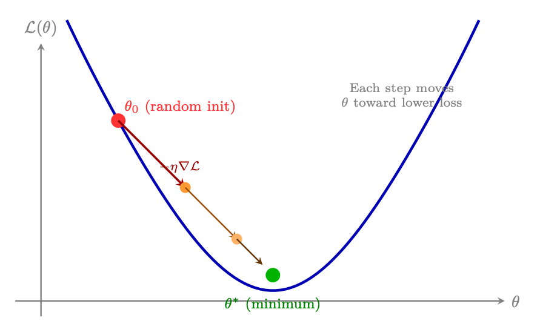<figcaption><span class="hh-tag">图 1.8：</span>梯度下降：从随机初始化 <math alttext="\theta_{0}" display="inline"><semantics><msub><mi>θ</mi><mn>0</mn></msub></semantics></math> 出发，每一步都把参数朝降低损失的方向移动，步长由学习率 <math alttext="\eta" display="inline"><semantics><mi>η</mi></semantics></math> 控制。该过程收敛到一个（局部）极小值。</figcaption></figure>

计算精确梯度需要在<em>整个</em>训练数据集上评估损失（对 LLM 而言是数万亿 Token）。这在计算上不可承受——单次梯度步就需要完整遍历全部数据。

解决方案：用数据的一个小随机子集（mini-batch）来估计梯度 [308]：

<div class="hh-equation" id="ch1.ex18"><math alttext="\nabla_{\theta}\mathcal{L}(\theta)\approx\frac{1}{B}\sum_{i=1}^{B}\nabla_{\theta}\ell(\theta;x_{i})" display="block"><semantics><mrow><mrow><mrow><msub><mo>∇</mo><mi>θ</mi></msub><mi>ℒ</mi></mrow><mo lspace="0em" rspace="0em">​</mo><mrow><mo stretchy="false">(</mo><mi>θ</mi><mo stretchy="false">)</mo></mrow></mrow><mo>≈</mo><mrow><mfrac><mn>1</mn><mi>B</mi></mfrac><mo lspace="0em" rspace="0em">​</mo><mrow><munderover><mo movablelimits="false">∑</mo><mrow><mi>i</mi><mo>=</mo><mn>1</mn></mrow><mi>B</mi></munderover><mrow><mrow><msub><mo rspace="0.167em">∇</mo><mi>θ</mi></msub><mi mathvariant="normal">ℓ</mi></mrow><mo lspace="0em" rspace="0em">​</mo><mrow><mo stretchy="false">(</mo><mi>θ</mi><mo>,</mo><msub><mi>x</mi><mi>i</mi></msub><mo stretchy="false">)</mo></mrow></mrow></mrow></mrow></mrow></semantics></math></div>

其中 <math alttext="B" display="inline"><semantics><mi>B</mi></semantics></math> 是 batch size（对 LLM 而言通常为 1K–4M Token）。mini-batch 梯度是真实梯度的一个<em>有噪声但无偏</em>的估计。

带动量的 SGD 在视觉模型（CNN）上表现良好，但 LLM 训练需要自适应优化器——即能按参数维护各自学习率的算法。

### 为何朴素 SGD 在 LLM 上失效

随机梯度下降按如下方式更新权重：

<div class="hh-equation" id="ch1.ex19"><math alttext="\theta_{t+1}=\theta_{t}-\eta\nabla_{\theta}\mathcal{L}(\theta_{t})" display="block"><semantics><mrow><msub><mi>θ</mi><mrow><mi>t</mi><mo>+</mo><mn>1</mn></mrow></msub><mo>=</mo><mrow><msub><mi>θ</mi><mi>t</mi></msub><mo>−</mo><mrow><mi>η</mi><mo lspace="0.167em" rspace="0em">​</mo><mrow><msub><mo rspace="0.167em">∇</mo><mi>θ</mi></msub><mi>ℒ</mi></mrow><mo lspace="0em" rspace="0em">​</mo><mrow><mo stretchy="false">(</mo><msub><mi>θ</mi><mi>t</mi></msub><mo stretchy="false">)</mo></mrow></mrow></mrow></mrow></semantics></math></div>

### Adam — 自适应矩估计（Adaptive Moment Estimation）

Adam [185] 为每个参数维护一阶矩（梯度的均值）与二阶矩（梯度的未中心化方差）的估计。

### AdamW — 解耦权重衰减（Decoupled Weight Decay, AdamW）

AdamW [239] 修复了权重衰减与自适应优化器交互方式中一个微妙但重要的问题。

### Muon：超越 AdamW

近十年来，AdamW 一直是神经网络训练中无可争议的默认优化器。Muon [225]（Liu 等，2025）是第一个对这一统治地位构成真正挑战的方法。其核心洞见是：Adam 累积的动量缓冲区携带着方向信息，而这些信息被自适应缩放这一步掩盖了；在施加该动量之前先对其做<em>正交化</em>，能产生本质上更好的更新方向。

Newton-Schulz 迭代是一个矩阵多项式，它收敛到 <math alttext="M_{t}" display="inline"><semantics><msub><mi>M</mi><mi>t</mi></msub></semantics></math> 的极分解中的正交因子。具体来说，从 <math alttext="X_{0}=M_{t}/\|M_{t}\|_{F}" display="inline"><semantics><mrow><msub><mi>X</mi><mn>0</mn></msub><mo>=</mo><mrow><msub><mi>M</mi><mi>t</mi></msub><mo>/</mo><msub><mrow><mo stretchy="false">‖</mo><msub><mi>M</mi><mi>t</mi></msub><mo stretchy="false">‖</mo></mrow><mi>F</mi></msub></mrow></mrow></semantics></math> 出发，迭代

<div class="hh-equation" id="ch1.ex26"><math alttext="X_{k+1}=\frac{3}{2}X_{k}-\frac{1}{2}X_{k}X_{k}^{\top}X_{k}" display="block"><semantics><mrow><msub><mi>X</mi><mrow><mi>k</mi><mo>+</mo><mn>1</mn></mrow></msub><mo>=</mo><mrow><mrow><mfrac><mn>3</mn><mn>2</mn></mfrac><mo lspace="0em" rspace="0em">​</mo><msub><mi>X</mi><mi>k</mi></msub></mrow><mo>−</mo><mrow><mfrac><mn>1</mn><mn>2</mn></mfrac><mo lspace="0em" rspace="0em">​</mo><msub><mi>X</mi><mi>k</mi></msub><mo lspace="0em" rspace="0em">​</mo><msubsup><mi>X</mi><mi>k</mi><mo>⊤</mo></msubsup><mo lspace="0em" rspace="0em">​</mo><msub><mi>X</mi><mi>k</mi></msub></mrow></mrow></mrow></semantics></math></div>

会迅速收敛（通常 5–10 步）到满足 <math alttext="\tilde{M}_{t}^{\top}\tilde{M}_{t}\approx I" display="inline"><semantics><mrow><mrow><msubsup><mover accent="true"><mi>M</mi><mo>~</mo></mover><mi>t</mi><mo>⊤</mo></msubsup><mo lspace="0em" rspace="0em">​</mo><msub><mover accent="true"><mi>M</mi><mo>~</mo></mover><mi>t</mi></msub></mrow><mo>≈</mo><mi>I</mi></mrow></semantics></math> 的矩阵 <math alttext="\tilde{M}_{t}" display="inline"><semantics><msub><mover accent="true"><mi>M</mi><mo>~</mo></mover><mi>t</mi></msub></semantics></math>。正交性确保更新把权重矩阵沿一个在所有奇异值方向上都尽可能展开的方向移动——从而避免优化器把更新压缩到低秩子空间上，而这正是 Adam 在奇异值谱高度偏斜的权重矩阵上已知的一种失效模式。

相对于 AdamW，Muon 宣称具有大约 2<math alttext="\times" display="inline"><semantics><mo>×</mo></semantics></math> 的计算效率：用大约一半的梯度步数就能达到相同的验证损失。这不是边际改进——它代表着优化器在损失地形上的样本效率发生了质的转变。

在大规模预训练中，趋势明显在向 Muon 倾斜：

<ul><li>GLM-4.5 / GLM-5（Zhipu AI）[434, 435]：预训练采用 Muon</li><li>Kimi K2（Moonshot AI）[17]：使用 MuonClip，这是加入了 <em>QK-Clip</em> 的变体——通过重新缩放 query 和 key 投影来限制注意力 logits，防止损失尖峰。Kimi K2 在 15.5T Token 上完成训练，损失尖峰为零，这是该规模模型的稳定性记录。</li><li>DeepSeek-V4（2026）[72]：其预训练运行采用了 Muon</li></ul>

### 学习率 — 最重要的超参数

### 学习率预热（Warmup）

<ul><li>线性预热：<math alttext="\eta_{t}=\eta_{\max}\times t/T_{\text{warmup}}" display="inline"><semantics><mrow><msub><mi>η</mi><mi>t</mi></msub><mo>=</mo><mrow><mrow><msub><mi>η</mi><mi>max</mi></msub><mo lspace="0.222em" rspace="0.222em">×</mo><mi>t</mi></mrow><mo>/</mo><msub><mi>T</mi><mtext>warmup</mtext></msub></mrow></mrow></semantics></math></li><li>典型预热时长： 预训练为总步数的 1–5%；微调为 3–10%（运行越短，所需预热占比越高）</li><li>对于 SFT： 通常为 50–200 个预热步</li></ul>

### 学习率调度策略

<figure id="ch1.f9">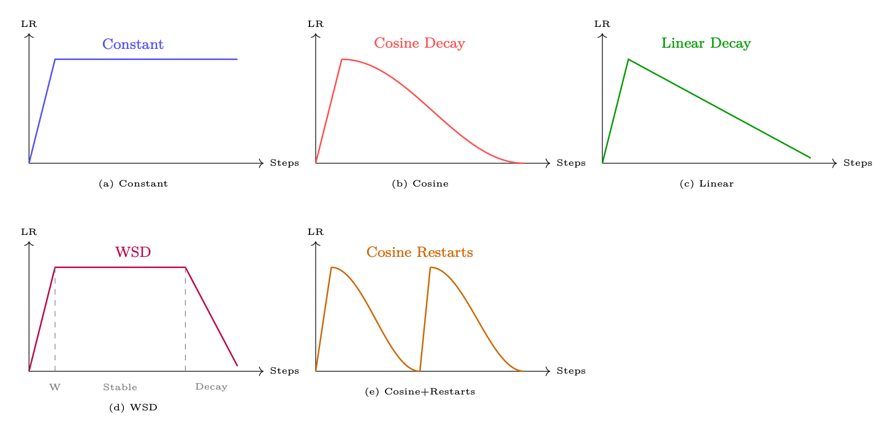<figcaption><span class="hh-tag">图 1.9：</span>常见的学习率调度。所有调度都包含线性预热阶段。WSD（预热-稳定-衰减）正在成为预训练的新标准。</figcaption></figure>

最简单的调度。适合希望避免把 LR 衰减过度的短程微调。风险：不做退火意味着模型可能无法收敛到最尖锐的极小值。

<div class="hh-equation" id="ch1.ex27"><math alttext="\eta_{t}=\eta_{\min}+\frac{1}{2}(\eta_{\max}-\eta_{\min})\left(1+\cos\!\left(\frac{t-T_{\text{warmup}}}{T-T_{\text{warmup}}}\pi\right)\right)" display="block"><semantics><mrow><msub><mi>η</mi><mi>t</mi></msub><mo>=</mo><mrow><msub><mi>η</mi><mi>min</mi></msub><mo>+</mo><mrow><mfrac><mn>1</mn><mn>2</mn></mfrac><mo lspace="0em" rspace="0em">​</mo><mrow><mo stretchy="false">(</mo><mrow><msub><mi>η</mi><mi>max</mi></msub><mo>−</mo><msub><mi>η</mi><mi>min</mi></msub></mrow><mo stretchy="false">)</mo></mrow><mo lspace="0em" rspace="0em">​</mo><mrow><mo>(</mo><mrow><mn>1</mn><mo>+</mo><mrow><mpadded width="1.216em"><mi>cos</mi></mpadded><mo>⁡</mo><mrow><mo>(</mo><mrow><mfrac><mrow><mi>t</mi><mo>−</mo><msub><mi>T</mi><mtext>warmup</mtext></msub></mrow><mrow><mi>T</mi><mo>−</mo><msub><mi>T</mi><mtext>warmup</mtext></msub></mrow></mfrac><mo lspace="0em" rspace="0em">​</mo><mi>π</mi></mrow><mo>)</mo></mrow></mrow></mrow><mo>)</mo></mrow></mrow></mrow></mrow></semantics></math></div>

预训练与 SFT 的标准选择。平滑衰减避免了 LR 的突变。<math alttext="\eta_{\min}" display="inline"><semantics><msub><mi>η</mi><mi>min</mi></msub></semantics></math> 通常为 <math alttext="\eta_{\max}/10" display="inline"><semantics><mrow><msub><mi>η</mi><mi>max</mi></msub><mo>/</mo><mn>10</mn></mrow></semantics></math>。

比余弦更简单，实证结果相近。当希望任意一步的 LR 都可预测时，优先选用。

大规模预训练的新标准 [150, 118]。共三个阶段：

<ol><li>预热： 线性升到 <math alttext="\eta_{\max}" display="inline"><semantics><msub><mi>η</mi><mi>max</mi></msub></semantics></math>（占步数的 1–5%）</li><li>稳定： 在训练的大部分时间保持 <math alttext="\eta_{\max}" display="inline"><semantics><msub><mi>η</mi><mi>max</mi></msub></semantics></math> 不变</li><li>衰减： 在最后 10–20% 的步数中快速余弦或线性衰减到 <math alttext="\eta_{\min}" display="inline"><semantics><msub><mi>η</mi><mi>min</mi></msub></semantics></math></li></ol>

关键优势：稳定阶段允许在任意时刻保存检查点并继续训练。衰减阶段可以在任何一次运行的末尾再施加。

周期性重启会把 LR 重置为 <math alttext="\eta_{\max}" display="inline"><semantics><msub><mi>η</mi><mi>max</mi></msub></semantics></math>。有助于逃离局部极小值。在 LLM 中不太常见，对小模型更有用。

### 梯度裁剪（Gradient Clipping）

下面的代码片段展示了本节的概念——带解耦权重衰减的 AdamW（第 1.6.6 节）、带线性预热的余弦学习率调度（第 1.6.7 节）以及梯度裁剪（第 1.6.8 节）——如何在使用 HuggingFace <code>transformers</code> 库的实践中结合起来。

```
from transformers import TrainingArguments, Trainer
from transformers import get_cosine_schedule_with_warmup
import torch

# --- Option 1: Using TrainingArguments (recommended) ---
training_args = TrainingArguments(
    output_dir="./checkpoints",

    # AdamW optimizer (decoupled weight decay, S1.6.6)
    optim="adamw_torch",
    learning_rate=2e-5,           # peak LR after warmup
    adam_beta1=0.9,               # first moment decay
    adam_beta2=0.999,             # second moment decay
    adam_epsilon=1e-8,            # numerical stability
    weight_decay=0.01,           # decoupled L2 penalty

    # Learning rate schedule (S1.6.7)
    lr_scheduler_type="cosine",  # cosine decay to 0
    warmup_ratio=0.1,            # 10% of steps = linear warmup

    # Gradient clipping (S1.6.8)
    max_grad_norm=1.0,           # clip by global L2 norm

    # Mixed precision (S1.6.9)
    bf16=True,                   # use BFloat16 on Ampere+ GPUs

    # Training duration
    num_train_epochs=3,
    per_device_train_batch_size=8,
    gradient_accumulation_steps=4,  # effective batch = 8*4 = 32
)

trainer = Trainer(
    model=model,
    args=training_args,
    train_dataset=dataset,
)
trainer.train()

# --- Option 2: Manual control (for custom training loops) ---
from torch.optim import AdamW

# Separate weight-decay groups (don't regularize biases/norms)
no_decay = ["bias", "LayerNorm.weight", "layernorm.weight"]
param_groups = [
    {
        "params": [p for n, p in model.named_parameters()
                   if not any(nd in n for nd in no_decay)],
        "weight_decay": 0.01,
    },
    {
        "params": [p for n, p in model.named_parameters()
                   if any(nd in n for nd in no_decay)],
        "weight_decay": 0.0,
    },
]

optimizer = AdamW(param_groups, lr=2e-5, betas=(0.9, 0.999))

# Cosine schedule with linear warmup
total_steps = len(train_dataloader) * num_epochs
warmup_steps = int(0.1 * total_steps)
scheduler = get_cosine_schedule_with_warmup(
    optimizer,
    num_warmup_steps=warmup_steps,
    num_training_steps=total_steps,
)

# Training loop with gradient clipping
for batch in train_dataloader:
    outputs = model(**batch)
    loss = outputs.loss
    loss.backward()

    # Clip gradients before optimizer step
    torch.nn.utils.clip_grad_norm_(model.parameters(), max_norm=1.0)

    optimizer.step()
    scheduler.step()
    optimizer.zero_grad()
```

<span class="hh-tag">代码清单 4：</span>结合 AdamW、余弦调度与梯度裁剪的完整优化器配置。

### 混合精度训练（Mixed Precision Training）

<ol><li>把损失乘以缩放因子 <math alttext="S" display="inline"><semantics><mi>S</mi></semantics></math>（例如 <math alttext="S=2^{15}" display="inline"><semantics><mrow><mi>S</mi><mo>=</mo><msup><mn>2</mn><mn>15</mn></msup></mrow></semantics></math>）</li><li>用 FP16 计算梯度（已被 <math alttext="S" display="inline"><semantics><mi>S</mi></semantics></math> 缩放）</li><li>在优化器更新之前，把梯度除以 <math alttext="S" display="inline"><semantics><mi>S</mi></semantics></math></li><li>检查是否溢出（NaN/Inf）；若溢出，则跳过该步并减小 <math alttext="S" display="inline"><semantics><mi>S</mi></semantics></math></li><li>若连续 <math alttext="N" display="inline"><semantics><mi>N</mi></semantics></math> 步都没有溢出，则增大 <math alttext="S" display="inline"><semantics><mi>S</mi></semantics></math></li></ol>

在混合精度训练中，权重以 FP32 存储（主副本），并在前向/反向传播时转换为 BF16/FP16。优化器更新在 FP32 下完成。这一点很重要，原因如下：

<ul><li>微小的梯度更新（<math alttext="\Delta\theta\ll\theta" display="inline"><semantics><mrow><mrow><mi mathvariant="normal">Δ</mi><mo lspace="0em" rspace="0em">​</mo><mi>θ</mi></mrow><mo>≪</mo><mi>θ</mi></mrow></semantics></math>）在 BF16 精度下会被丢掉（7 个尾数位 <math alttext="\approx" display="inline"><semantics><mo>≈</mo></semantics></math> 0.8% 的相对精度）</li><li>FP32 主权重能确保许多步之后微小更新仍被准确累积</li><li>显存开销：2<math alttext="\times" display="inline"><semantics><mo>×</mo></semantics></math> 的权重存储（FP32 + BF16 副本）</li></ul>

```
# === HuggingFace TrainingArguments (simplest approach) ===
from transformers import TrainingArguments

# BF16 on Ampere+ GPUs (A100, H100, RTX 30xx/40xx)
args_bf16 = TrainingArguments(
    output_dir="./out",
    bf16=True,               # BF16 forward/backward; FP32 master weights
    bf16_full_eval=True,     # also use BF16 during evaluation
    # No loss scaling needed -- BF16 has FP32-equivalent range
)

# FP16 on older GPUs (V100, T4, RTX 20xx)
args_fp16 = TrainingArguments(
    output_dir="./out",
    fp16=True,               # FP16 forward/backward
    fp16_full_eval=False,    # keep eval in FP32 for accuracy
    # Loss scaling is automatic via PyTorch GradScaler
)

# === Manual PyTorch AMP (for custom training loops) ===
import torch

# Setup (PyTorch 2.x API)
use_fp16 = not torch.cuda.is_bf16_supported()
scaler = torch.amp.GradScaler("cuda", enabled=use_fp16)  # only needed for FP16
optimizer = torch.optim.AdamW(model.parameters(), lr=2e-5)
dtype = torch.float16 if use_fp16 else torch.bfloat16

for batch in train_dataloader:
    optimizer.zero_grad()

    # Autocast: run forward pass in reduced precision
    with torch.autocast("cuda", dtype=dtype):
        outputs = model(**batch)
        loss = outputs.loss

    if use_fp16:
        # FP16 path: scale loss to prevent gradient underflow
        scaler.scale(loss).backward()
        scaler.unscale_(optimizer)          # unscale before clipping
        torch.nn.utils.clip_grad_norm_(model.parameters(), 1.0)
        scaler.step(optimizer)              # skips step on overflow
        scaler.update()                     # adjust scale factor
    else:
        # BF16 path: no scaling needed
        loss.backward()
        torch.nn.utils.clip_grad_norm_(model.parameters(), 1.0)
        optimizer.step()

    scheduler.step()
```

<span class="hh-tag">代码清单 5：</span>使用 HuggingFace 与手动 PyTorch AMP 进行混合精度训练。

DeepSeek-V3 [71] 证明，用 FP8（前向传播用 E4M3，反向传播用 E5M2）配合细粒度分块缩放来训练 671B 参数模型，相对于 BF16 的损失退化不到 0.25%——而总训练成本约为 560 万美元。关键技术包括：用随机舍入降低量化偏置、按分块自适应局部激活幅度的缩放因子，以及在量化最敏感的首尾层保持更高精度。NVIDIA 的 Nemotron 3 更进一步推向 NVFP4（4 位），通过让约 15% 的层保持 BF16，在 25T 训练 Token 上展现了稳定性。其经济意义极为深远：精心的精度工程把前沿训练成本降低 3–5<math alttext="\times" display="inline"><semantics><mo>×</mo></semantics></math>，使十亿参数级的训练不再局限于最大的实验室。

### 各训练阶段的优化器配置实践

## FlashAttention——算法与硬件感知

Flash Attention [64, 65] 是自 Transformer 本身以来深度学习领域最具影响力的算法创新之一。它不改变 Attention 的数学结果——它计算的输出<em>完全</em>相同——但它重构了内存访问模式，让 GPU 上容量有限的高速 SRAM 承担所有重活，从而将高带宽内存（HBM）占用从 <math alttext="O(n^{2})" display="inline"><semantics><mrow><mi>O</mi><mo>⁡</mo><mrow><mo stretchy="false">(</mo><msup><mi>n</mi><mn>2</mn></msup><mo stretchy="false">)</mo></mrow></mrow></semantics></math> 降至 <math alttext="O(n)" display="inline"><semantics><mrow><mi>O</mi><mo>⁡</mo><mrow><mo stretchy="false">(</mo><mi>n</mi><mo stretchy="false">)</mo></mrow></mrow></semantics></math>，并在典型工作负载上带来 2–4<math alttext="\times" display="inline"><semantics><mo>×</mo></semantics></math> 的端到端墙钟时间加速。

### 标准 Attention 的内存问题

标准的缩放点积 Attention 为：

<div class="hh-equation" id="ch1.ex29"><math alttext="\text{Attention}(Q,K,V)=\text{softmax}\!\left(\frac{QK^{T}}{\sqrt{d_{k}}}\right)V" display="block"><semantics><mrow><mrow><mtext>Attention</mtext><mo lspace="0em" rspace="0em">​</mo><mrow><mo stretchy="false">(</mo><mi>Q</mi><mo>,</mo><mi>K</mi><mo>,</mo><mi>V</mi><mo stretchy="false">)</mo></mrow></mrow><mo>=</mo><mrow><mpadded width="3.720em"><mtext>softmax</mtext></mpadded><mo lspace="0em" rspace="0em">​</mo><mrow><mo>(</mo><mfrac><mrow><mi>Q</mi><mo lspace="0em" rspace="0em">​</mo><msup><mi>K</mi><mi>T</mi></msup></mrow><msqrt><msub><mi>d</mi><mi>k</mi></msub></msqrt></mfrac><mo>)</mo></mrow><mo lspace="0em" rspace="0em">​</mo><mi>V</mi></mrow></mrow></semantics></math></div>

### FlashAttention 的核心洞察——分块（Tiling）与在线 Softmax（Online Softmax）

核心洞察是：我们从不需要把完整的 <math alttext="n\times n" display="inline"><semantics><mrow><mi>n</mi><mo lspace="0.222em" rspace="0.222em">×</mo><mi>n</mi></mrow></semantics></math> 矩阵一次性放入内存。我们可以按块逐步计算输出 <math alttext="O" display="inline"><semantics><mi>O</mi></semantics></math>，只要使用<em>在线 Softmax</em>技巧。

回想一下，为了数值稳定性，Softmax 需要一个全局最大值：

<div class="hh-equation" id="ch1.ex30"><math alttext="\text{softmax}(x_{i})=\frac{e^{x_{i}-m}}{\sum_{j}e^{x_{j}-m}},\quad m=\max_{j}x_{j}" display="block"><semantics><mrow><mrow><mrow><mtext>softmax</mtext><mo lspace="0em" rspace="0em">​</mo><mrow><mo stretchy="false">(</mo><msub><mi>x</mi><mi>i</mi></msub><mo stretchy="false">)</mo></mrow></mrow><mo>=</mo><mfrac><msup><mi>e</mi><mrow><msub><mi>x</mi><mi>i</mi></msub><mo>−</mo><mi>m</mi></mrow></msup><mrow><msub><mo>∑</mo><mi>j</mi></msub><msup><mi>e</mi><mrow><msub><mi>x</mi><mi>j</mi></msub><mo>−</mo><mi>m</mi></mrow></msup></mrow></mfrac></mrow><mo rspace="1.167em">,</mo><mrow><mi>m</mi><mo>=</mo><mrow><munder><mi>max</mi><mi>j</mi></munder><mo lspace="0.167em">⁡</mo><msub><mi>x</mi><mi>j</mi></msub></mrow></mrow></mrow></semantics></math></div>

技巧在于：我们可以在处理新块的过程中<em>更新</em>当前的运行最大值与归一化因子，而无需把整行具体化到内存中。

### FlashAttention 算法

### FlashAttention 2——更好的并行性

Flash Attention 2 [65] 带来了三项关键改进：

<ol><li>减少非矩阵乘法 FLOPs：最初的 FA 在内层循环中存在不必要的重缩放操作。FA2 重构循环以将这些操作降到最少。在 A100 上，张量核心（Tensor Core）的矩阵乘法速度约为标量运算的 16<math alttext="\times" display="inline"><semantics><mo>×</mo></semantics></math>，因此内层循环中哪怕很小比例的非矩阵乘法工作也会成为延迟瓶颈。</li><li>在序列维度上实现更好的并行：FA1 仅在 batch 和头上并行。FA2 还额外在查询序列维度上并行，从而在长序列、小 batch 场景下实现更好的 GPU 利用率。</li><li>因果掩码优化：对于自回归（因果）Attention，大约有一半的块被完全掩码。FA2 完全跳过这些块，使因果 Attention 相对双向 Attention 获得 <math alttext="\sim" display="inline"><semantics><mo>∼</mo></semantics></math>2<math alttext="\times" display="inline"><semantics><mo>×</mo></semantics></math> 的加速。</li></ol>

### FlashAttention 3——Hopper 架构

Flash Attention 3 [322] 专为 H100 设计，并利用了 Hopper 架构的三项专属特性：

<ul><li>TMA（Tensor Memory Accelerator，张量内存加速器）：H100 拥有一块专用硬件单元，用于在 HBM 与 SRAM 之间做异步批量数据搬运。FA3 使用 TMA 将数据加载与计算重叠，从而隐藏内存延迟。</li><li>线程束专用化（Warp-specialization）：FA3 把不同的 warp 分配给不同角色（生产者 warp 通过 TMA 加载数据；消费者 warp 执行 MMA 计算）。这是一种软件流水线技术，可让内存系统与张量核心同时保持忙碌。</li><li>FP8 支持：H100 支持 FP8（E4M3/E5M2）张量核心运算，吞吐量为 BF16 的 2<math alttext="\times" display="inline"><semantics><mo>×</mo></semantics></math>。FA3 支持带逐块量化的 FP8 Attention，以保持精度。</li></ul>

在 FP16 Attention 上，FA3 最高可达 H100 理论峰值的 75%，而 FA2 为 <math alttext="\sim" display="inline"><semantics><mo>∼</mo></semantics></math>35%。

### FlashAttention 4——Blackwell 架构

Flash Attention 4 [415] 瞄准 NVIDIA 的 Blackwell GPU（B200/GB200）：其张量核心吞吐量翻倍至 2.25 PFLOP/s（BF16），而非矩阵乘法单元（指数运算、共享内存带宽）的扩展速度则更慢。这种<em>硬件非对称扩展</em>意味着瓶颈发生了转移：在 Blackwell 上，Attention 不再受限于矩阵乘法，而是受限于 Softmax 指数运算及其周边的共享内存流量。

FA4 通过四项关键技术来解决这一问题：

<ul><li>完全异步的 MMA 流水线：Blackwell 的 MMA 指令是完全异步的（不同于 Hopper 的 wgmma 仍需阻塞等待完成）。FA4 重新设计流水线，在更大的 tile 尺寸下让 MMA、TMA 加载与 Softmax 重缩放彼此重叠，使所有硬件单元保持饱和。</li><li>软件模拟指数运算：FA4 不再调用硬件的 <code>ex2</code> 单元（它是吞吐量瓶颈），而是用多项式近似，在快得多的张量核心上模拟 <math alttext="e^{x}" display="inline"><semantics><msup><mi>e</mi><mi>x</mi></msup></semantics></math>。这是用额外的矩阵乘法指令来换取指数单元的停顿。</li><li>条件式 Softmax 重缩放：标准 FlashAttention 对每个 tile 都会重缩放运行中的 <math alttext="\max" display="inline"><semantics><mi>max</mi></semantics></math>。当新 tile 的最大值不超过运行最大值时（实践中很常见），FA4 会跳过重缩放，从而省下寄存器交换与同步屏障。</li><li>Tensor Memory + 2-CTA MMA 模式（反向传播）：反向传播使用 Blackwell 的 <em>Tensor Memory</em>（一块比共享内存更大的 per-SM 草稿区）以及一种 2-CTA 协作模式，把 <math alttext="dQ" display="inline"><semantics><mrow><mi>d</mi><mo lspace="0em" rspace="0em">​</mo><mi>Q</mi></mrow></semantics></math> 的累加跨两个线程块簇融合起来，使共享内存往返次数减半。</li></ul>

在 B200 上，BF16、头维度 128（因果、序列长度 8K）：

<ul><li>1613 TFLOP/s——达到 Blackwell 峰值利用率的 71%</li><li>比 cuDNN 9.13（NVIDIA 专有的融合 kernel）快 1.3<math alttext="\times" display="inline"><semantics><mo>×</mo></semantics></math></li><li>在相同硬件上比 Triton 快 2.7<math alttext="\times" display="inline"><semantics><mo>×</mo></semantics></math></li></ul>

## 预训练：最佳实践

预训练是 LLM 开发中最昂贵的阶段——消耗数百万 GPU 小时，并需要精心编排数据、算力与超参数。本节提炼了来自 Llama-3 [118]、Chinchilla [140] 与 GPT-4 [274] 的关键经验。

### 训练目标

所有现代仅解码器 LLM 都使用因果语言建模（CLM）：

<div class="hh-equation" id="ch1.ex31"><math alttext="\mathcal{L}_{\text{CLM}}=-\frac{1}{T}\sum_{t=1}^{T}\log P_{\theta}(x_{t}\mid x_{&lt;t})" display="block"><semantics><mrow><msub><mi>ℒ</mi><mtext>CLM</mtext></msub><mo rspace="0em">=</mo><mo lspace="0em">−</mo><mfrac><mn>1</mn><mi>T</mi></mfrac><munderover><mo movablelimits="false">∑</mo><mrow><mi>t</mi><mo>=</mo><mn>1</mn></mrow><mi>T</mi></munderover><mi>log</mi><msub><mi>P</mi><mi>θ</mi></msub><mrow><mo stretchy="false">(</mo><msub><mi>x</mi><mi>t</mi></msub><mo lspace="0em" rspace="0.167em">∣</mo><msub><mi>x</mi><mrow><mphantom></mphantom><mo>&lt;</mo><mi>t</mi></mrow></msub><mo stretchy="false">)</mo></mrow></mrow></semantics></math></div>

只要有足够的数据与规模，这个简单的目标无需显式监督 [32] 就能产生涌现能力（上下文学习、推理、指令遵循）。

### 数据流水线

### 扩展律

Hoffmann 等人 [140] 表明，算力最优的训练需要平衡模型规模 <math alttext="N" display="inline"><semantics><mi>N</mi></semantics></math> 与数据规模 <math alttext="D" display="inline"><semantics><mi>D</mi></semantics></math>：<math alttext="N_{\text{opt}}\propto C^{0.50}" display="inline"><semantics><mrow><msub><mi>N</mi><mtext>opt</mtext></msub><mo>∝</mo><msup><mi>C</mi><mn>0.50</mn></msup></mrow></semantics></math>，<math alttext="D_{\text{opt}}\propto C^{0.50}" display="inline"><semantics><mrow><msub><mi>D</mi><mtext>opt</mtext></msub><mo>∝</mo><msup><mi>C</mi><mn>0.50</mn></msup></mrow></semantics></math>。70B 模型在 <math alttext="\sim" display="inline"><semantics><mo>∼</mo></semantics></math>1.4T token 时达到算力最优。实践中，模型往往被<em>过度训练</em>（token 数超过 Chinchilla 最优），因为推理成本随模型规模而非训练 token 数增长——更小的过度训练模型部署起来更便宜。

### 关键超参数

<div class="hh-table" id="ch1.t10"><table class="ltx_tabular ltx_align_middle"><thead><tr><th class="ltx_align_left"><span>设置项</span></th><th class="ltx_align_left ltx_align_top"><span class="ltx_align_top"><span><span>Llama-3 405B</span></span></span></th><th class="ltx_align_left ltx_align_top"><span class="ltx_align_top"><span><span>Llama-3 8B</span></span></span></th><th class="ltx_align_left ltx_align_top"><span class="ltx_align_top"><span><span>Qwen-2.5 72B</span></span></span></th><th class="ltx_align_left ltx_align_top"><span class="ltx_align_top"><span><span>Mistral 7B</span></span></span></th></tr></thead><tbody><tr><th class="ltx_align_left">Token 数</th><td class="ltx_align_left ltx_align_top"><span class="ltx_align_top"><span>15T</span></span></td><td class="ltx_align_left ltx_align_top"><span class="ltx_align_top"><span>15T</span></span></td><td class="ltx_align_left ltx_align_top"><span class="ltx_align_top"><span>18T</span></span></td><td class="ltx_align_left ltx_align_top"><span class="ltx_align_top"><span>8T</span></span></td></tr><tr><th class="ltx_align_left">批大小（token）</th><td class="ltx_align_left ltx_align_top"><span class="ltx_align_top"><span>16M</span></span></td><td class="ltx_align_left ltx_align_top"><span class="ltx_align_top"><span>4M</span></span></td><td class="ltx_align_left ltx_align_top"><span class="ltx_align_top"><span>4M</span></span></td><td class="ltx_align_left ltx_align_top"><span class="ltx_align_top"><span>4M</span></span></td></tr><tr><th class="ltx_align_left">峰值学习率</th><td class="ltx_align_left ltx_align_top"><span class="ltx_align_top"><span><math alttext="8\text{e-}5" display="inline"><semantics><mrow><mn>8</mn><mo lspace="0em" rspace="0em">​</mo><mtext>e-</mtext><mo lspace="0em" rspace="0em">​</mo><mn>5</mn></mrow><span></span></semantics></math></span></span></td><td class="ltx_align_left ltx_align_top"><span class="ltx_align_top"><span><math alttext="3\text{e-}4" display="inline"><semantics><mrow><mn>3</mn><mo lspace="0em" rspace="0em">​</mo><mtext>e-</mtext><mo lspace="0em" rspace="0em">​</mo><mn>4</mn></mrow><span></span></semantics></math></span></span></td><td class="ltx_align_left ltx_align_top"><span class="ltx_align_top"><span><math alttext="3\text{e-}4" display="inline"><semantics><mrow><mn>3</mn><mo lspace="0em" rspace="0em">​</mo><mtext>e-</mtext><mo lspace="0em" rspace="0em">​</mo><mn>4</mn></mrow><span></span></semantics></math></span></span></td><td class="ltx_align_left ltx_align_top"><span class="ltx_align_top"><span><math alttext="3\text{e-}4" display="inline"><semantics><mrow><mn>3</mn><mo lspace="0em" rspace="0em">​</mo><mtext>e-</mtext><mo lspace="0em" rspace="0em">​</mo><mn>4</mn></mrow><span></span></semantics></math></span></span></td></tr><tr><th class="ltx_align_left">调度</th><td class="ltx_align_left ltx_align_top"><span class="ltx_align_top"><span>WSD</span></span></td><td class="ltx_align_left ltx_align_top"><span class="ltx_align_top"><span>WSD</span></span></td><td class="ltx_align_left ltx_align_top"><span class="ltx_align_top"><span>Cosine</span></span></td><td class="ltx_align_left ltx_align_top"><span class="ltx_align_top"><span>Cosine</span></span></td></tr><tr><th class="ltx_align_left">权重衰减</th><td class="ltx_align_left ltx_align_top"><span class="ltx_align_top"><span>0.1</span></span></td><td class="ltx_align_left ltx_align_top"><span class="ltx_align_top"><span>0.1</span></span></td><td class="ltx_align_left ltx_align_top"><span class="ltx_align_top"><span>0.1</span></span></td><td class="ltx_align_left ltx_align_top"><span class="ltx_align_top"><span>0.1</span></span></td></tr><tr><th class="ltx_align_left">上下文长度</th><td class="ltx_align_left ltx_align_top"><span class="ltx_align_top"><span>8192</span></span></td><td class="ltx_align_left ltx_align_top"><span class="ltx_align_top"><span>8192</span></span></td><td class="ltx_align_left ltx_align_top"><span class="ltx_align_top"><span>4096<math alttext="\to" display="inline"><semantics><mo stretchy="false">→</mo><span></span></semantics></math>32K</span></span></td><td class="ltx_align_left ltx_align_top"><span class="ltx_align_top"><span>8192</span></span></td></tr></tbody></table><p class="hh-table-caption"><span class="hh-tag">表 1.10：</span>已发表模型的预训练超参数。</p></div>

### 常见失败模式

### 中期训练：为强化学习做准备

在原始预训练与后训练之间，已经浮现出一个独立的流水线阶段。<em>中期训练</em>（有时称为「继续预训练」或「退火」）在高质量的精选数据上对 STEM、数学与代码加权，同时把上下文长度扩展到 128K–256K token。它的目的不是教授新知识，而是<em>为 RL 做好准备</em>：灌输验证、回溯、子目标分解这类认知行为，它们之后会被强化学习放大。

典型的中期训练使用 100B–500B token 的精选高质量数据，并采用余弦衰减的学习率。Llama 3 的「退火尾段」、MiMo 的三阶段混合（把数学+代码的比例逐步提升到 70%）以及 MAI-Thinking-1 对 STEM 的显式加权，都是这一模式的实例。

## 监督微调（Supervised Fine-Tuning，SFT）

SFT 通过在精心策划的 prompt–response 数据对上训练，把预训练语言模型转变为遵循指令的助手。它是原始语言建模与 RLHF 之间的桥梁。

### SFT 目标

损失与 CLM 完全相同，但只在回复 token上计算：

<div class="hh-equation" id="ch1.ex32"><math alttext="\mathcal{L}_{\text{SFT}}=-\frac{1}{|y|}\sum_{t=1}^{|y|}\log P_{\theta}(y_{t}\mid x_{\text{prompt}},y_{&lt;t})" display="block"><semantics><mrow><msub><mi>ℒ</mi><mtext>SFT</mtext></msub><mo rspace="0em">=</mo><mo lspace="0em">−</mo><mfrac><mn>1</mn><mrow><mo stretchy="false">|</mo><mi>y</mi><mo stretchy="false">|</mo></mrow></mfrac><munderover><mo movablelimits="false">∑</mo><mrow><mi>t</mi><mo>=</mo><mn>1</mn></mrow><mrow><mo stretchy="false">|</mo><mi>y</mi><mo stretchy="false">|</mo></mrow></munderover><mi>log</mi><msub><mi>P</mi><mi>θ</mi></msub><mrow><mo stretchy="false">(</mo><msub><mi>y</mi><mi>t</mi></msub><mo lspace="0em" rspace="0.167em">∣</mo><msub><mi>x</mi><mtext>prompt</mtext></msub><mo>,</mo><msub><mi>y</mi><mrow><mphantom></mphantom><mo>&lt;</mo><mi>t</mi></mrow></msub><mo stretchy="false">)</mo></mrow></mrow></semantics></math></div>

Prompt token 提供上下文，但不接收梯度（标签设为 <math alttext="-100" display="inline"><semantics><mrow><mo>−</mo><mn>100</mn></mrow></semantics></math>）。

### 数据质量：LIMA 原则

Zhou 等人 [439] 证明，1000 条精心策划的样本即可媲美在 50K+ 噪声样本上训练的模型。关键要求包括：

<ul><li>多样性：覆盖问答、摘要、代码、数学、创意写作、多轮对话</li><li>正确性：每条回复都必须事实准确且格式规范</li><li>长度均衡：混合短回复（1 句话）与长回复（多段）</li><li>去污染：移除与评测基准的重叠</li></ul>

### 训练配置

```python
from trl import SFTTrainer, SFTConfig

sft_config = SFTConfig(
    output_dir="./sft_output",
    max_seq_length=4096,
    packing=True,              # Pack short examples into full sequences
    learning_rate=2e-5,
    lr_scheduler_type="cosine",
    warmup_ratio=0.1,
    weight_decay=0.01,
    max_grad_norm=1.0,
    num_train_epochs=3,
    per_device_train_batch_size=4,
    gradient_accumulation_steps=8,
    bf16=True,
    gradient_checkpointing=True,
)
trainer = SFTTrainer(model=model, args=sft_config,
                     train_dataset=dataset, processing_class=tokenizer)
trainer.train()
```

### 高效训练方案

标准的 HuggingFace 训练会白白浪费大量性能。有若干库可为 SFT 工作负载提供即插即用的效率提升：

LinkedIn 开源的一套Triton 融合 kernel，在训练期间替代标准 PyTorch 算子。关键融合包括：

<ul><li>融合交叉熵：把最终的线性投影、Softmax 与损失计算合并到单个 kernel 中——避免具体化完整的 <math alttext="(\text{batch}\times\text{seq}\times\text{vocab})" display="inline"><semantics><mrow><mo stretchy="false">(</mo><mrow><mtext>batch</mtext><mo lspace="0.222em" rspace="0.222em">×</mo><mtext>seq</mtext><mo lspace="0.222em" rspace="0.222em">×</mo><mtext>vocab</mtext></mrow><mo stretchy="false">)</mo></mrow></semantics></math> logits 张量。</li><li>融合 RMSNorm / SwiGLU / RoPE：为常见的 LLM 构建块消除中间内存分配。</li><li>分块操作：以 tile 为单位处理大张量，使峰值内存保持有界。</li></ul>

效果：只需一行集成（<code>apply_liger_kernel_to_llama()</code>）即可获得 20% 的吞吐量提升与最高 60% 的内存降低。兼容 FSDP、DeepSpeed 与 LoRA。

一个专用的微调库，把自定义 CUDA/Triton kernel与激进的显存优化结合起来：

<ul><li>对 LoRA 层手动反向传播（避开 autograd 开销）。</li><li>4-bit QLoRA 配合融合反量化——可在单张 48 GB GPU 上训练 70B 模型。</li><li>针对每种架构（Llama、Mistral、Qwen、Gemma）的智能 RoPE 与 Attention kernel 融合。</li></ul>

效果：比原版 HuggingFace + PEFT 快 2–5<math alttext="\times" display="inline"><semantics><mo>×</mo></semantics></math>，显存占用低 60–70%。对单 GPU 与消费级硬件的工作流程尤为有效。

Meta 的原生 PyTorch 微调库（开发工作已于 2025 年逐步停止），其设计围绕可组合性，而非单体式抽象：

<ul><li>纯 PyTorch——没有 trainer 类；配方式脚本是易读的单文件。</li><li>与 <code>torch.compile</code>、FSDP2 及激活检查点的原生集成。</li><li>原生支持 QLoRA、全量微调与知识蒸馏。</li><li>内置量化感知训练（QAT），用于训练后压缩。</li></ul>

效果：速度与定制方案相当，但具备完整的可调试性，且不锁定框架。

### 最佳实践

<div class="hh-table" id="ch1.t11"><table class="ltx_tabular ltx_align_middle"><thead><tr><th class="ltx_align_left"><span>做法</span></th><th class="ltx_align_left ltx_align_top"><span class="ltx_align_top"><span><span>详情</span></span></span></th></tr></thead><tbody><tr><th class="ltx_align_left">打包（Packing）</th><td class="ltx_align_left ltx_align_top"><span class="ltx_align_top"><span>将多条短样本拼接为一个序列（以 EOS 分隔）。避免 padding 浪费。</span></span></td></tr><tr><th class="ltx_align_left">NEFTune <span>[159]</span></th><td class="ltx_align_left ltx_align_top"><span class="ltx_align_top"><span>向嵌入（embedding）添加均匀噪声（<math alttext="\alpha=5" display="inline"><semantics><mrow><mi>α</mi><mo>=</mo><mn>5</mn></mrow><span></span></semantics></math>）。零成本地把 MT-Bench 提升 5–15%。</span></span></td></tr><tr><th class="ltx_align_left">对话模板</th><td class="ltx_align_left ltx_align_top"><span class="ltx_align_top"><span>始终使用模型的原生模板。模板不匹配会降低质量。</span></span></td></tr><tr><th class="ltx_align_left">训练轮数</th><td class="ltx_align_left ltx_align_top"><span class="ltx_align_top"><span>大数据集 2–3 轮；小规模（<math alttext="&lt;" display="inline"><semantics><mo>&lt;</mo><span></span></semantics></math>10K）精选集最多 5 轮。过度训练会导致格式记忆。</span></span></td></tr></tbody></table><p class="hh-table-caption"><span class="hh-tag">表 1.11：</span>SFT 训练指南。</p></div>

## LoRA 与参数高效微调

对 70B 模型做全量微调需要存储 70B 可训练参数及其优化器状态（560+ GB 内存）。LoRA [146]（Low-Rank Adaptation，低秩适配）提供了一种只用 <math alttext="&lt;" display="inline"><semantics><mo>&lt;</mo></semantics></math>1% 的参数进行微调、同时达到相当质量的方法。

### LoRA 的核心洞察

<figure id="ch1.f10">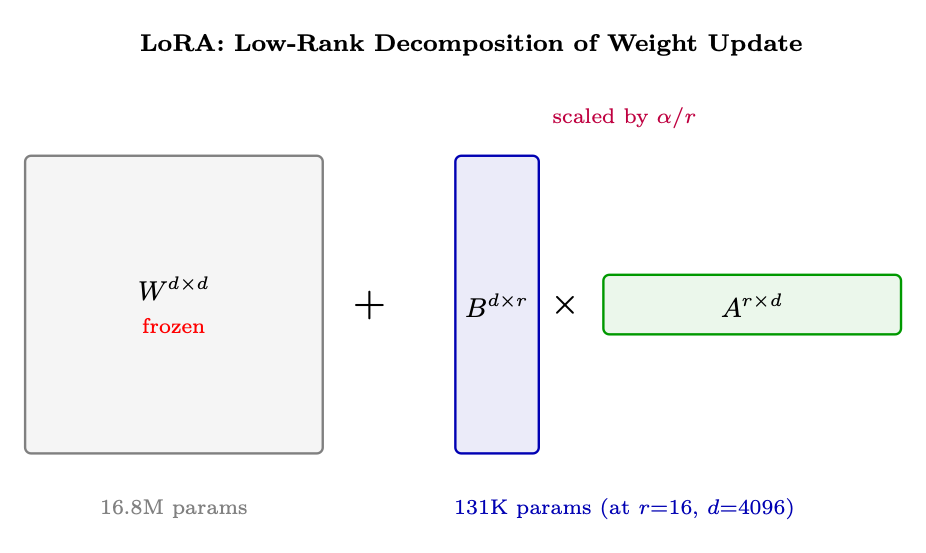<figcaption><span class="hh-tag">图 1.10：</span>LoRA 把权重更新 <math alttext="\Delta W" display="inline"><semantics><mrow><mi mathvariant="normal">Δ</mi><mo lspace="0em" rspace="0em">​</mo><mi>W</mi></mrow></semantics></math> 分解为两个小矩阵 <math alttext="B\times A" display="inline"><semantics><mrow><mi>B</mi><mo lspace="0.222em" rspace="0.222em">×</mo><mi>A</mi></mrow></semantics></math>。原始权重 <math alttext="W" display="inline"><semantics><mi>W</mi></semantics></math> 保持冻结；只有 <math alttext="B" display="inline"><semantics><mi>B</mi></semantics></math> 和 <math alttext="A" display="inline"><semantics><mi>A</mi></semantics></math> 接收梯度。在推理时，乘积 <math alttext="BA" display="inline"><semantics><mrow><mi>B</mi><mo lspace="0em" rspace="0em">​</mo><mi>A</mi></mrow></semantics></math> 可以零开销地合并进 <math alttext="W" display="inline"><semantics><mi>W</mi></semantics></math>。</figcaption></figure>

### LoRA 超参数

正确选择 LoRA 超参数至关重要——错误的秩或 alpha 要么导致欠拟合（约束过强），要么浪费内存（表达力过剩）。

<div class="hh-table" id="ch1.t12"><table class="ltx_tabular ltx_align_middle"><thead><tr><th class="ltx_align_left"><span>超参数</span></th><th class="ltx_align_left ltx_align_top"><span class="ltx_align_top"><span><span>典型取值</span></span></span></th><th class="ltx_align_left ltx_align_top"><span class="ltx_align_top"><span><span>指导建议</span></span></span></th></tr></thead><tbody><tr><th class="ltx_align_left"><span>r</span>（秩）</th><td class="ltx_align_left ltx_align_top"><span class="ltx_align_top"><span>8, 16, 32, 64</span></span></td><td class="ltx_align_left ltx_align_top"><span class="ltx_align_top"><span>越大则容量越强，但内存占用也越高。可从 16 开始。</span></span></td></tr><tr><th class="ltx_align_left"><span>lora_alpha</span></th><td class="ltx_align_left ltx_align_top"><span class="ltx_align_top"><span>16、32（通常为 <math alttext="=r" display="inline"><semantics><mrow><mphantom></mphantom><mo>=</mo><mi>r</mi></mrow><span></span></semantics></math> 或 <math alttext="2r" display="inline"><semantics><mrow><mn>2</mn><mo lspace="0em" rspace="0em">​</mo><mi>r</mi></mrow><span></span></semantics></math>）</span></span></td><td class="ltx_align_left ltx_align_top"><span class="ltx_align_top"><span>通过 <math alttext="\alpha/r" display="inline"><semantics><mrow><mi>α</mi><mo>/</mo><mi>r</mi></mrow><span></span></semantics></math> 缩放控制更新幅度。</span></span></td></tr><tr><th class="ltx_align_left"><span>target_modules</span></th><td class="ltx_align_left ltx_align_top"><span class="ltx_align_top"><span><span>q_proj, k_proj, v_proj, o_proj</span></span></span></td><td class="ltx_align_left ltx_align_top"><span class="ltx_align_top"><span>所有 Attention 投影层。加上 <span>gate_proj, up_proj, down_proj</span> 可实现全覆盖。</span></span></td></tr><tr><th class="ltx_align_left"><span>lora_dropout</span></th><td class="ltx_align_left ltx_align_top"><span class="ltx_align_top"><span>0.0–0.1</span></span></td><td class="ltx_align_left ltx_align_top"><span class="ltx_align_top"><span>正则化。小数据集上通常为 0.05。</span></span></td></tr><tr><th class="ltx_align_left"><span>bias</span></th><td class="ltx_align_left ltx_align_top"><span class="ltx_align_top"><span><span>"none"</span></span></span></td><td class="ltx_align_left ltx_align_top"><span class="ltx_align_top"><span>训练偏置新增的参数极少，但很少有帮助。</span></span></td></tr><tr><th class="ltx_align_left">学习率</th><td class="ltx_align_left ltx_align_top"><span class="ltx_align_top"><span><math alttext="1\text{e-}4" display="inline"><semantics><mrow><mn>1</mn><mo lspace="0em" rspace="0em">​</mo><mtext>e-</mtext><mo lspace="0em" rspace="0em">​</mo><mn>4</mn></mrow><span></span></semantics></math> 到 <math alttext="3\text{e-}4" display="inline"><semantics><mrow><mn>3</mn><mo lspace="0em" rspace="0em">​</mo><mtext>e-</mtext><mo lspace="0em" rspace="0em">​</mo><mn>4</mn></mrow><span></span></semantics></math></span></span></td><td class="ltx_align_left ltx_align_top"><span class="ltx_align_top"><span>高于全量微调（只有 adapter 更新）。</span></span></td></tr></tbody></table><p class="hh-table-caption"><span class="hh-tag">表 1.12：</span>LoRA 超参数指南。</p></div>

### LoRA 变体

<div class="hh-table" id="ch1.t13"><table class="ltx_tabular ltx_align_middle"><thead><tr><th class="ltx_align_left"><span>方法</span></th><th class="ltx_align_left ltx_align_top"><span class="ltx_align_top"><span><span>关键创新</span></span></span></th><th class="ltx_align_left ltx_align_top"><span class="ltx_align_top"><span><span>适用场景</span></span></span></th></tr></thead><tbody><tr><th class="ltx_align_left"><span>QLoRA</span><span>[75]</span></th><td class="ltx_align_left ltx_align_top"><span class="ltx_align_top"><span>4-bit 量化的基座 + BF16 的 LoRA。NF4 数据类型 + 双重量化。</span></span></td><td class="ltx_align_left ltx_align_top"><span class="ltx_align_top"><span>可在单张 48GB GPU 上微调 70B 模型。</span></span></td></tr><tr><th class="ltx_align_left"><span>DoRA</span><span>[229]</span></th><td class="ltx_align_left ltx_align_top"><span class="ltx_align_top"><span>将 <math alttext="W" display="inline"><semantics><mi>W</mi><span></span></semantics></math> 分解为幅度与方向；LoRA 只更新方向。</span></span></td><td class="ltx_align_left ltx_align_top"><span class="ltx_align_top"><span>在推理任务上泛化更好。</span></span></td></tr><tr><th class="ltx_align_left"><span>LoRA+</span><span>[136]</span></th><td class="ltx_align_left ltx_align_top"><span class="ltx_align_top"><span>对 <math alttext="A" display="inline"><semantics><mi>A</mi><span></span></semantics></math>/<math alttext="B" display="inline"><semantics><mi>B</mi><span></span></semantics></math> 使用不同的学习率（<math alttext="\eta_{B}=\lambda\eta_{A}" display="inline"><semantics><mrow><msub><mi>η</mi><mi>B</mi></msub><mo>=</mo><mrow><mi>λ</mi><mo lspace="0em" rspace="0em">​</mo><msub><mi>η</mi><mi>A</mi></msub></mrow></mrow><span></span></semantics></math>，<math alttext="\lambda\approx 16" display="inline"><semantics><mrow><mi>λ</mi><mo>≈</mo><mn>16</mn></mrow><span></span></semantics></math>）。</span></span></td><td class="ltx_align_left ltx_align_top"><span class="ltx_align_top"><span>白得 2% 的提升；无额外成本。</span></span></td></tr><tr><th class="ltx_align_left"><span>AdaLoRA</span><span>[424]</span></th><td class="ltx_align_left ltx_align_top"><span class="ltx_align_top"><span>跨层的动态秩预算（基于 SVD 的重要性）。</span></span></td><td class="ltx_align_left ltx_align_top"><span class="ltx_align_top"><span>算力预算非常紧张时。</span></span></td></tr><tr><th class="ltx_align_left"><span>rsLoRA</span><span>[176]</span></th><td class="ltx_align_left ltx_align_top"><span class="ltx_align_top"><span>以 <math alttext="\alpha/\sqrt{r}" display="inline"><semantics><mrow><mi>α</mi><mo>/</mo><msqrt><mi>r</mi></msqrt></mrow><span></span></semantics></math> 而非 <math alttext="\alpha/r" display="inline"><semantics><mrow><mi>α</mi><mo>/</mo><mi>r</mi></mrow><span></span></semantics></math> 进行缩放。在高秩下稳定。</span></span></td><td class="ltx_align_left ltx_align_top"><span class="ltx_align_top"><span>使用 <math alttext="r\geq 64" display="inline"><semantics><mrow><mi>r</mi><mo>≥</mo><mn>64</mn></mrow><span></span></semantics></math> 时。</span></span></td></tr><tr><th class="ltx_align_left"><span>VeRA</span><span>[190]</span></th><td class="ltx_align_left ltx_align_top"><span class="ltx_align_top"><span>共享的冻结随机 <math alttext="A,B" display="inline"><semantics><mrow><mi>A</mi><mo>,</mo><mi>B</mi></mrow><span></span></semantics></math>；只训练对角缩放。</span></span></td><td class="ltx_align_left ltx_align_top"><span class="ltx_align_top"><span>极致的参数效率。</span></span></td></tr><tr><th class="ltx_align_left"><span>LoRA-FA</span></th><td class="ltx_align_left ltx_align_top"><span class="ltx_align_top"><span>初始化后冻结 <math alttext="A" display="inline"><semantics><mi>A</mi><span></span></semantics></math>；只训练 <math alttext="B" display="inline"><semantics><mi>B</mi><span></span></semantics></math>。LoRA 内存减半。</span></span></td><td class="ltx_align_left ltx_align_top"><span class="ltx_align_top"><span>内存受限的场景。</span></span></td></tr></tbody></table><p class="hh-table-caption"><span class="hh-tag">表 1.13：</span>LoRA 变体及其创新点。</p></div>

DoRA [229] 观察到，全量微调对权重向量<em>方向</em>的改变往往大于对其幅度的改变。标准 LoRA 把两者混在一起。DoRA 把每个权重列分解为幅度 <math alttext="m=\|W\|_{\text{col}}" display="inline"><semantics><mrow><mi>m</mi><mo>=</mo><msub><mrow><mo stretchy="false">‖</mo><mi>W</mi><mo stretchy="false">‖</mo></mrow><mtext>col</mtext></msub></mrow></semantics></math> 与方向 <math alttext="\hat{V}=W/\|W\|_{\text{col}}" display="inline"><semantics><mrow><mover accent="true"><mi>V</mi><mo>^</mo></mover><mo>=</mo><mrow><mi>W</mi><mo>/</mo><msub><mrow><mo stretchy="false">‖</mo><mi>W</mi><mo stretchy="false">‖</mo></mrow><mtext>col</mtext></msub></mrow></mrow></semantics></math>，然后只对方向应用 LoRA：

<div class="hh-equation" id="ch1.ex35"><math alttext="W^{\prime}=m\odot\hat{V}^{\prime},\quad\hat{V}^{\prime}=\frac{W+BA}{\|W+BA\|_{\text{col}}}" display="block"><semantics><mrow><mrow><msup><mi>W</mi><mo>′</mo></msup><mo>=</mo><mrow><mi>m</mi><mo lspace="0.222em" rspace="0.222em">⊙</mo><msup><mover accent="true"><mi>V</mi><mo>^</mo></mover><mo>′</mo></msup></mrow></mrow><mo rspace="1.167em">,</mo><mrow><msup><mover accent="true"><mi>V</mi><mo>^</mo></mover><mo>′</mo></msup><mo>=</mo><mfrac><mrow><mi>W</mi><mo>+</mo><mrow><mi>B</mi><mo lspace="0em" rspace="0em">​</mo><mi>A</mi></mrow></mrow><msub><mrow><mo stretchy="false">‖</mo><mrow><mi>W</mi><mo>+</mo><mrow><mi>B</mi><mo lspace="0em" rspace="0em">​</mo><mi>A</mi></mrow></mrow><mo stretchy="false">‖</mo></mrow><mtext>col</mtext></msub></mfrac></mrow></mrow></semantics></math></div>

幅度 <math alttext="m" display="inline"><semantics><mi>m</mi></semantics></math> 是一个独立可学习的向量（每列一个标量）。在推理与指令遵循基准上，这一做法稳定地比 LoRA 高出 1–3%，且不增加推理成本（部署时合并）。

Hayou 等人 [136] 表明，LoRA 中的矩阵 <math alttext="A" display="inline"><semantics><mi>A</mi></semantics></math> 与 <math alttext="B" display="inline"><semantics><mi>B</mi></semantics></math> 具有不同的最优学习率。由于 <math alttext="B" display="inline"><semantics><mi>B</mi></semantics></math> 初始化为零，它一开始所处的状态与 <math alttext="A" display="inline"><semantics><mi>A</mi></semantics></math>（从 <math alttext="\mathcal{N}(0,\sigma^{2})" display="inline"><semantics><mrow><mi>𝒩</mi><mo>⁡</mo><mrow><mo stretchy="false">(</mo><mn>0</mn><mo>,</mo><msup><mi>σ</mi><mn>2</mn></msup><mo stretchy="false">)</mo></mrow></mrow></semantics></math> 初始化）差别很大。设置 <math alttext="\eta_{B}\approx 16\times\eta_{A}" display="inline"><semantics><mrow><msub><mi>η</mi><mi>B</mi></msub><mo>≈</mo><mrow><mn>16</mn><mo lspace="0.222em" rspace="0.222em">×</mo><msub><mi>η</mi><mi>A</mi></msub></mrow></mrow></semantics></math> 可把收敛速度与最终质量提升 <math alttext="\sim" display="inline"><semantics><mo>∼</mo></semantics></math>2%——这只需改动一行配置就能白得：

```python
# LoRA+ in PEFT: set different LRs per matrix
optimizer_grouped_parameters = [
    {"params": [p for n, p in model.named_parameters() if "lora_B" in n],
     "lr": 2e-4 * 16},   # B matrix: higher LR
    {"params": [p for n, p in model.named_parameters() if "lora_A" in n],
     "lr": 2e-4},         # A matrix: base LR
]
```

VeRA [190] 把参数效率推向极致：它不学习 <math alttext="A" display="inline"><semantics><mi>A</mi></semantics></math> 与 <math alttext="B" display="inline"><semantics><mi>B</mi></semantics></math>，而是把它们<em>冻结</em>为所有层共享的随机矩阵，只训练两个对角缩放向量 <math alttext="d_{b}\in\mathbb{R}^{r}" display="inline"><semantics><mrow><msub><mi>d</mi><mi>b</mi></msub><mo>∈</mo><msup><mi>ℝ</mi><mi>r</mi></msup></mrow></semantics></math> 与 <math alttext="d_{a}\in\mathbb{R}^{d}" display="inline"><semantics><mrow><msub><mi>d</mi><mi>a</mi></msub><mo>∈</mo><msup><mi>ℝ</mi><mi>d</mi></msup></mrow></semantics></math>：

<div class="hh-equation" id="ch1.ex36"><math alttext="\Delta W=B\cdot\text{diag}(d_{b})\cdot A\cdot\text{diag}(d_{a})" display="block"><semantics><mrow><mrow><mi mathvariant="normal">Δ</mi><mo lspace="0em" rspace="0em">​</mo><mi>W</mi></mrow><mo>=</mo><mrow><mrow><mrow><mi>B</mi><mo lspace="0.222em" rspace="0.222em">⋅</mo><mtext>diag</mtext></mrow><mo lspace="0em" rspace="0em">​</mo><mrow><mo stretchy="false">(</mo><msub><mi>d</mi><mi>b</mi></msub><mo rspace="0.055em" stretchy="false">)</mo></mrow></mrow><mo rspace="0.222em">⋅</mo><mi>A</mi><mo lspace="0.222em" rspace="0.222em">⋅</mo><mrow><mtext>diag</mtext><mo lspace="0em" rspace="0em">​</mo><mrow><mo stretchy="false">(</mo><msub><mi>d</mi><mi>a</mi></msub><mo stretchy="false">)</mo></mrow></mrow></mrow></mrow></semantics></math></div>

相比 LoRA，可训练参数减少 <math alttext="\sim" display="inline"><semantics><mo>∼</mo></semantics></math>10<math alttext="\times" display="inline"><semantics><mo>×</mo></semantics></math>（每层仅 <math alttext="r+d" display="inline"><semantics><mrow><mi>r</mi><mo>+</mo><mi>d</mi></mrow></semantics></math> 个参数），同时达到 LoRA 90–95% 的质量。最适合需要以极小存储量持有数百个任务专用 adapter 的场景。

```python
# QLoRA configuration with PEFT
from peft import LoraConfig, get_peft_model, prepare_model_for_kbit_training
from transformers import BitsAndBytesConfig
import torch

# 4-bit quantization config
bnb_config = BitsAndBytesConfig(
    load_in_4bit=True,
    bnb_4bit_quant_type="nf4",           # NormalFloat4 - optimal for weights
    bnb_4bit_compute_dtype=torch.bfloat16, # Compute in BF16
    bnb_4bit_use_double_quant=True,       # Quantize the quantization constants
)

# LoRA config
lora_config = LoraConfig(
    r=16,
    lora_alpha=32,                        # alpha/r = 2x scaling
    target_modules=["q_proj", "k_proj", "v_proj", "o_proj",
                    "gate_proj", "up_proj", "down_proj"],
    lora_dropout=0.05,
    bias="none",
    task_type="CAUSAL_LM",
)

model = prepare_model_for_kbit_training(model)  # Prepare for QLoRA
model = get_peft_model(model, lora_config)       # Add LoRA adapters
model.print_trainable_parameters()
# Output: trainable params: 83,886,080 || all params: 70,553,706,496 || 0.12%
```

### 其他 PEFT 方法

LoRA 主导了现代实践，但它并不是唯一的参数高效方法。为求完整，下面列出主要替代方案：

<div class="hh-table" id="ch1.t14"><table class="ltx_tabular ltx_align_middle"><thead><tr><th class="ltx_align_left"><span>方法</span></th><th class="ltx_align_left ltx_align_top"><span class="ltx_align_top"><span><span>机制</span></span></span></th><th class="ltx_align_left ltx_align_top"><span class="ltx_align_top"><span><span>优点 / 缺点</span></span></span></th><th class="ltx_align_left ltx_align_top"><span class="ltx_align_top"><span><span>现状</span></span></span></th></tr></thead><tbody><tr><th class="ltx_align_left"><span>LoRA</span><span>[146]</span>（及其变体）</th><td class="ltx_align_left ltx_align_top"><span class="ltx_align_top"><span>在现有权重上叠加低秩矩阵</span></span></td><td class="ltx_align_left ltx_align_top"><span class="ltx_align_top"><span>推理时可合并（零开销）；生态支持良好；适用于所有架构</span></span></td><td class="ltx_align_left ltx_align_top"><span class="ltx_align_top"><span><span>标准</span></span></span></td></tr><tr><th class="ltx_align_left"><span>Adapters</span><span>[144]</span></th><td class="ltx_align_left ltx_align_top"><span class="ltx_align_top"><span>在层与层之间插入小型瓶颈 MLP</span></span></td><td class="ltx_align_left ltx_align_top"><span class="ltx_align_top"><span>模块化；可堆叠；会增加推理延迟（额外的串行层）</span></span></td><td class="ltx_align_left ltx_align_top"><span class="ltx_align_top"><span>很少使用</span></span></td></tr><tr><th class="ltx_align_left"><span>Prefix Tuning</span><span>[212]</span></th><td class="ltx_align_left ltx_align_top"><span class="ltx_align_top"><span>在每一层的 key/value 前拼接可学习的「虚拟 token」</span></span></td><td class="ltx_align_left ltx_align_top"><span class="ltx_align_top"><span>不修改权重；对生成任务有效；会占用上下文长度</span></span></td><td class="ltx_align_left ltx_align_top"><span class="ltx_align_top"><span>小众</span></span></td></tr><tr><th class="ltx_align_left"><span>Prompt Tuning</span><span>[205]</span></th><td class="ltx_align_left ltx_align_top"><span class="ltx_align_top"><span>在输入端拼接可学习的软 prompt 嵌入（embedding）</span></span></td><td class="ltx_align_left ltx_align_top"><span class="ltx_align_top"><span>参数极少（<math alttext="&lt;" display="inline"><semantics><mo>&lt;</mo><span></span></semantics></math>0.01%）；复杂任务上弱于 LoRA</span></span></td><td class="ltx_align_left ltx_align_top"><span class="ltx_align_top"><span>小众</span></span></td></tr><tr><th class="ltx_align_left"><span>IA3</span><span>[223]</span></th><td class="ltx_align_left ltx_align_top"><span class="ltx_align_top"><span>用学习到的向量对 key、value 及 FFN 激活值进行重缩放</span></span></td><td class="ltx_align_left ltx_align_top"><span class="ltx_align_top"><span>参数比 LoRA 更少；可合并；容量有限</span></span></td><td class="ltx_align_left ltx_align_top"><span class="ltx_align_top"><span>已弃用</span></span></td></tr><tr><th class="ltx_align_left"><span>BitFit</span><span>[417]</span></th><td class="ltx_align_left ltx_align_top"><span class="ltx_align_top"><span>只训练偏置项</span></span></td><td class="ltx_align_left ltx_align_top"><span class="ltx_align_top"><span>参数接近于零；在简单任务上意外有效；表达力有限</span></span></td><td class="ltx_align_left ltx_align_top"><span class="ltx_align_top"><span>历史方法</span></span></td></tr></tbody></table><p class="hh-table-caption"><span class="hh-tag">表 1.14：</span>PEFT 方法族。LoRA 是 LLM 微调事实上的标准；其余方法出于历史脉络与小众用例而列出。</p></div>

## 专家混合模型（Mixture of Experts，MoE）

专家混合模型（Mixture of Experts，MoE） [325, 166] 通过对每个 Token 只激活参数的一个子集，从而在不按比例增加计算成本的情况下扩展模型容量。

### 架构

<figure id="ch1.f11">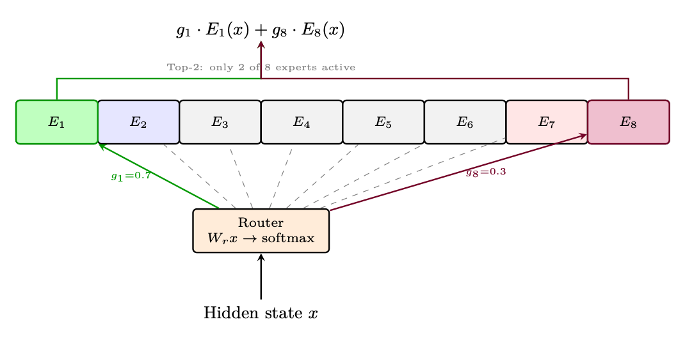<figcaption><span class="hh-tag">图 1.11：</span>具有 8 个专家和 Top-2 路由的 MoE 层。每个 Token 只计算门控值最高的两个专家；其余专家被完全跳过。</figcaption></figure>

### 负载均衡

### 噪声 Top-K 门控（Noisy Top-K Gating）：让离散路由变得可训练

MoE 的核心挑战在于 top-<math alttext="k" display="inline"><semantics><mi>k</mi></semantics></math> 选择是不可微的——你无法通过一个硬性的「挑选前 2 名」操作反向传播。该领域发展出了两个关键技巧来解决这个问题：

在 <em>进行</em> top-<math alttext="k" display="inline"><semantics><mi>k</mi></semantics></math> 选择之前，向路由器的 logits 添加可学习的高斯噪声：


<ul><li><math alttext="W_{\text{noise}}" display="inline"><semantics><msub><mi>W</mi><mtext>noise</mtext></msub></semantics></math> 是<em>学习得到</em>的噪声幅度——模型会学习每个专家需要多少探索量</li><li>在训练过程中，噪声偶尔会将「弱势」专家提升到 top-<math alttext="k" display="inline"><semantics><mi>k</mi></semantics></math> 中，使其获得梯度信号</li><li>在推理时去除噪声：使用干净的 logits <math alttext="h(x)" display="inline"><semantics><mrow><mi>h</mi><mo>⁡</mo><mrow><mo stretchy="false">(</mo><mi>x</mi><mo stretchy="false">)</mo></mrow></mrow></semantics></math> 进行确定性路由</li><li>Softplus 确保噪声尺度始终为正</li></ul>

来自变分推断文献的另一种方法 [161]。Gumbel-Max 技巧（Gumbel-Max trick）提供了从类别分布中精确采样的方式：

<div class="hh-equation" id="ch1.e12"><math alttext="z=\arg\max_{i}\left[\log\pi_{i}+G_{i}\right],\quad G_{i}\sim\text{Gumbel}(0,1)" display="block"><semantics><mrow><mrow><mi>z</mi><mo>=</mo><mrow><mrow><mi>arg</mi><mo lspace="0.167em">⁡</mo><munder><mi>max</mi><mi>i</mi></munder></mrow><mo lspace="0em" rspace="0em">​</mo><mrow><mo>[</mo><mrow><mrow><mi>log</mi><mo lspace="0.167em">⁡</mo><msub><mi>π</mi><mi>i</mi></msub></mrow><mo>+</mo><msub><mi>G</mi><mi>i</mi></msub></mrow><mo>]</mo></mrow></mrow></mrow><mo rspace="1.167em">,</mo><mrow><msub><mi>G</mi><mi>i</mi></msub><mo>∼</mo><mrow><mtext>Gumbel</mtext><mo lspace="0em" rspace="0em">​</mo><mrow><mo stretchy="false">(</mo><mn>0</mn><mo>,</mo><mn>1</mn><mo stretchy="false">)</mo></mrow></mrow></mrow></mrow></semantics></math><span class="hh-equation-number">(1.12)</span></div>

其中 Gumbel 噪声由 <math alttext="G_{i}=-\log(-\log(U_{i})),\;U_{i}\sim\text{Uniform}(0,1)" display="inline"><semantics><mrow><mrow><msub><mi>G</mi><mi>i</mi></msub><mo>=</mo><mrow><mo rspace="0.167em">−</mo><mrow><mi>log</mi><mo>⁡</mo><mrow><mo stretchy="false">(</mo><mrow><mo rspace="0.167em">−</mo><mrow><mi>log</mi><mo>⁡</mo><mrow><mo stretchy="false">(</mo><msub><mi>U</mi><mi>i</mi></msub><mo stretchy="false">)</mo></mrow></mrow></mrow><mo stretchy="false">)</mo></mrow></mrow></mrow></mrow><mo rspace="0.447em">,</mo><mrow><msub><mi>U</mi><mi>i</mi></msub><mo>∼</mo><mrow><mtext>Uniform</mtext><mo lspace="0em" rspace="0em">​</mo><mrow><mo stretchy="false">(</mo><mn>0</mn><mo>,</mo><mn>1</mn><mo stretchy="false">)</mo></mrow></mrow></mrow></mrow></semantics></math> 生成。

对于 top-<math alttext="k" display="inline"><semantics><mi>k</mi></semantics></math> 路由：取 <math alttext="(\log\pi_{i}+G_{i})" display="inline"><semantics><mrow><mo stretchy="false">(</mo><mrow><mrow><mi>log</mi><mo lspace="0.167em">⁡</mo><msub><mi>π</mi><mi>i</mi></msub></mrow><mo>+</mo><msub><mi>G</mi><mi>i</mi></msub></mrow><mo stretchy="false">)</mo></mrow></semantics></math> 的 top-<math alttext="k" display="inline"><semantics><mi>k</mi></semantics></math>，等价于从由 <math alttext="\pi" display="inline"><semantics><mi>π</mi></semantics></math> 定义的类别分布中<em>无放回</em>地抽取 <math alttext="k" display="inline"><semantics><mi>k</mi></semantics></math> 个样本。

由于 <math alttext="\arg\max" display="inline"><semantics><mrow><mi>arg</mi><mo lspace="0.167em">⁡</mo><mi>max</mi></mrow></semantics></math> 是不可微的，Gumbel-Softmax 松弛将其替换为一个由温度控制的 softmax：

<div class="hh-equation" id="ch1.e13"><math alttext="\hat{g}_{i}=\frac{\exp\left((\log\pi_{i}+G_{i})/\tau\right)}{\sum_{j}\exp\left((\log\pi_{j}+G_{j})/\tau\right)}" display="block"><semantics><mrow><msub><mover accent="true"><mi>g</mi><mo>^</mo></mover><mi>i</mi></msub><mo>=</mo><mfrac><mrow><mi>exp</mi><mo>⁡</mo><mrow><mo>(</mo><mrow><mrow><mo stretchy="false">(</mo><mrow><mrow><mi>log</mi><mo lspace="0.167em">⁡</mo><msub><mi>π</mi><mi>i</mi></msub></mrow><mo>+</mo><msub><mi>G</mi><mi>i</mi></msub></mrow><mo stretchy="false">)</mo></mrow><mo>/</mo><mi>τ</mi></mrow><mo>)</mo></mrow></mrow><mrow><msub><mo>∑</mo><mi>j</mi></msub><mrow><mi>exp</mi><mo>⁡</mo><mrow><mo>(</mo><mrow><mrow><mo stretchy="false">(</mo><mrow><mrow><mi>log</mi><mo lspace="0.167em">⁡</mo><msub><mi>π</mi><mi>j</mi></msub></mrow><mo>+</mo><msub><mi>G</mi><mi>j</mi></msub></mrow><mo stretchy="false">)</mo></mrow><mo>/</mo><mi>τ</mi></mrow><mo>)</mo></mrow></mrow></mrow></mfrac></mrow></semantics></math><span class="hh-equation-number">(1.13)</span></div>

<ul><li><math alttext="\tau\to 0" display="inline"><semantics><mrow><mi>τ</mi><mo stretchy="false">→</mo><mn>0</mn></mrow></semantics></math>：趋近于硬 one-hot（精确但不可微）</li><li><math alttext="\tau\to\infty" display="inline"><semantics><mrow><mi>τ</mi><mo stretchy="false">→</mo><mi mathvariant="normal">∞</mi></mrow></semantics></math>：趋近于均匀分布（可微但无信息量）</li><li>实践中，在训练过程中将 <math alttext="\tau" display="inline"><semantics><mi>τ</mi></semantics></math> 从 1.0 退火到 0.1–0.5</li><li>直通估计器（Straight-through estimator）：前向传播中使用硬 top-<math alttext="k" display="inline"><semantics><mi>k</mi></semantics></math>，反向传播中使用 Gumbel-Softmax 梯度——两全其美</li></ul>

标准做法是在训练损失上加一个均衡惩罚项，但 DeepSeek [372] 证明这会与路由信号相互对抗：损失把利用率推向均匀，而路由器想要专业化。他们的解决方案把均衡完全移出梯度，改为一个基于观测利用率更新的逐专家路由<em>偏置</em>——同时实现了更好的质量<em>和</em>更高的专家专业化。Qwen 的后续洞见进一步揭示：<em>聚合范围</em>比机制本身更重要——按 micro-batch（常见默认）计算均衡统计会悄无声息地摧毁专业化，因为 micro-batch 过于同质。像 MAI-Thinking-1 所证实的那样，在整个 global batch 上聚合，才能恢复专家分化所需的多样性信号。

### 值得关注的 MoE 模型

模型总参数量激活参数量专家数创新点Switch Transformer [89]1.6T100B128, Top-1首个大规模 MoE；简化的路由Mixtral 8x7B [166]47B13B8, Top-2开放权重；质量媲美 Llama-2 70BDeepSeek-V2 [70]236B21B160, Top-6带共享 + 路由专家的 DeepSeekMoEQwen-MoE [350]14.3B2.7B60, Top-4为提升效率而设计的细粒度专家DBRX [67]132B36B16, Top-4每块 4 个专家的细粒度结构

## LLM 训练中的多样性

多样性——在训练数据、模型输出和优化轨迹上的多样性——对于防止模式坍缩并确保鲁棒的通用 LLM 至关重要。本节介绍适用于所有 LLM 训练阶段的关键多样性机制。

### 采样多样性

### 训练数据多样性

<ul><li>Prompt 多样性：覆盖不同的领域、难度等级和格式。Goldilocks 原则：Prompt 的成功率应在 20–80% 之间。</li><li>去重：移除近似重复的训练样本（MinHash、n-gram 重叠）。重复样本会导致对特定模式的过拟合。</li><li>数据混合：使用温度加权采样或课程策略，在任务/领域之间进行平衡。</li></ul>

### 促进多样性的方法

方法它如何促进多样性温度缩放（Temperature scaling）更高的 <math alttext="\tau" display="inline"><semantics><mi>τ</mi></semantics></math> 会让分布变得更平坦；更多 Token 变得合理。Top-<math alttext="p" display="inline"><semantics><mi>p</mi></semantics></math> / Min-<math alttext="p" display="inline"><semantics><mi>p</mi></semantics></math>自适应阈值允许模型在不确定时进行更广的采样。频率惩罚（Frequency penalty）惩罚重复出现的 Token，强制在一次回复内产生词汇多样性。数据去重从训练数据中移除近似重复样本，防止对特定模式的过拟合。多领域混合跨领域的温度加权采样确保了广泛的覆盖。口头化采样（Verbalized sampling）提示模型显式地用语言表达出对各个回复的概率分布 [422]。参见第 7.5 GRPO 变体与扩展 节。

## 文本生成：解码方法

一个训练好的语言模型在每一步都会输出一个在词表上的概率分布：<math alttext="P(x_{t}|x_{&lt;t})" display="inline"><semantics><mrow><mi>P</mi><mo>⁡</mo><mrow><mo stretchy="false">(</mo><msub><mi>x</mi><mi>t</mi></msub><mo lspace="0em" rspace="0em">|</mo><msub><mi>x</mi><mrow><mphantom></mphantom><mo>&lt;</mo><mi>t</mi></mrow></msub><mo stretchy="false">)</mo></mrow></mrow></semantics></math>。解码策略决定了我们如何从该分布中选择下一个 Token。这个选择深刻地影响输出质量、多样性和连贯性。

### 贪心解码（Greedy Decoding）

最简单的策略：总是选择概率最高的 Token。

<div class="hh-equation" id="ch1.ex42"><math alttext="x_{t}=\arg\max_{v\in\mathcal{V}}P(v|x_{&lt;t})" display="block"><semantics><mrow><msub><mi>x</mi><mi>t</mi></msub><mo>=</mo><mrow><mi>arg</mi><mo lspace="0.167em">⁡</mo><mrow><munder><mi>max</mi><mrow><mi>v</mi><mo>∈</mo><mi>𝒱</mi></mrow></munder><mo lspace="0.167em">⁡</mo><mrow><mi>P</mi><mo>⁡</mo><mrow><mo stretchy="false">(</mo><mi>v</mi><mo lspace="0em" rspace="0em">|</mo><msub><mi>x</mi><mrow><mphantom></mphantom><mo>&lt;</mo><mi>t</mi></mrow></msub><mo stretchy="false">)</mo></mrow></mrow></mrow></mrow></mrow></semantics></math></div>

直觉：就像在句子中总是选取最显而易见的下一个词。「The capital of France is…」 <math alttext="\to" display="inline"><semantics><mo stretchy="false">→</mo></semantics></math> 「Paris」（概率 0.92）。

优点：确定性、快速、无超参数。<br>

缺点：产生重复、泛泛的文本。当一个早期的低概率 Token 会带来全局更优输出时会被错过。没有多样性。

### 束搜索（Beam Search）

并行维护 <math alttext="B" display="inline"><semantics><mi>B</mi></semantics></math> 个（束宽）部分假设，每一步用 top-<math alttext="k" display="inline"><semantics><mi>k</mi></semantics></math> 个 Token 扩展每个假设，并保留得分最高的 <math alttext="B" display="inline"><semantics><mi>B</mi></semantics></math> 个完整序列：

<div class="hh-equation" id="ch1.ex43"><math alttext="\text{score}(y_{1:t})=\sum_{i=1}^{t}\log P(y_{i}|y_{&lt;i})" display="block"><semantics><mrow><mtext>score</mtext><mrow><mo stretchy="false">(</mo><msub><mi>y</mi><mrow><mn>1</mn><mo lspace="0.278em" rspace="0.278em">:</mo><mi>t</mi></mrow></msub><mo stretchy="false">)</mo></mrow><mo rspace="0.111em">=</mo><munderover><mo movablelimits="false">∑</mo><mrow><mi>i</mi><mo>=</mo><mn>1</mn></mrow><mi>t</mi></munderover><mi>log</mi><mi>P</mi><mrow><mo stretchy="false">(</mo><msub><mi>y</mi><mi>i</mi></msub><mo fence="false" rspace="0.167em" stretchy="false">|</mo><msub><mi>y</mi><mrow><mphantom></mphantom><mo>&lt;</mo><mi>i</mi></mrow></msub><mo stretchy="false">)</mo></mrow></mrow></semantics></math></div>

配合长度归一化避免偏好短序列：

<div class="hh-equation" id="ch1.ex44"><math alttext="\text{score}_{\text{norm}}(y)=\frac{1}{|y|^{\alpha}}\sum_{i=1}^{|y|}\log P(y_{i}|y_{&lt;i}),\quad\alpha\in[0.6,1.0]" display="block"><semantics><mrow><mrow><mrow><msub><mtext>score</mtext><mtext>norm</mtext></msub><mo lspace="0em" rspace="0em">​</mo><mrow><mo stretchy="false">(</mo><mi>y</mi><mo stretchy="false">)</mo></mrow></mrow><mo>=</mo><mrow><mfrac><mn>1</mn><msup><mrow><mo stretchy="false">|</mo><mi>y</mi><mo stretchy="false">|</mo></mrow><mi>α</mi></msup></mfrac><mo lspace="0em" rspace="0em">​</mo><mrow><munderover><mo movablelimits="false">∑</mo><mrow><mi>i</mi><mo>=</mo><mn>1</mn></mrow><mrow><mo stretchy="false">|</mo><mi>y</mi><mo stretchy="false">|</mo></mrow></munderover><mrow><mi>log</mi><mo lspace="0.167em">⁡</mo><mrow><mi>P</mi><mo>⁡</mo><mrow><mo stretchy="false">(</mo><msub><mi>y</mi><mi>i</mi></msub><mo lspace="0em" rspace="0em">|</mo><msub><mi>y</mi><mrow><mphantom></mphantom><mo>&lt;</mo><mi>i</mi></mrow></msub><mo stretchy="false">)</mo></mrow></mrow></mrow></mrow></mrow></mrow><mo rspace="1.167em">,</mo><mrow><mi>α</mi><mo>∈</mo><mrow><mo stretchy="false">[</mo><mrow><mn>0.6</mn><mo>,</mo><mn>1.0</mn></mrow><mo stretchy="false">]</mo></mrow></mrow></mrow></semantics></math></div>

直觉：就像同时在迷宫中探索多条路径，并在每个岔路口只保留 <math alttext="B" display="inline"><semantics><mi>B</mi></semantics></math> 条最有希望的路径。

优点：能找到比贪心解码似然更高的序列；适合翻译和摘要等存在单一「正确」输出的任务。<br>

缺点：对开放式生成仍倾向于产生泛泛、重复的文本；计算量增加 <math alttext="B\times" display="inline"><semantics><mrow><mi>B</mi><mo lspace="0.222em">×</mo></mrow></semantics></math> 倍；所有束往往收敛到相似的输出。

<figure id="ch1.f12">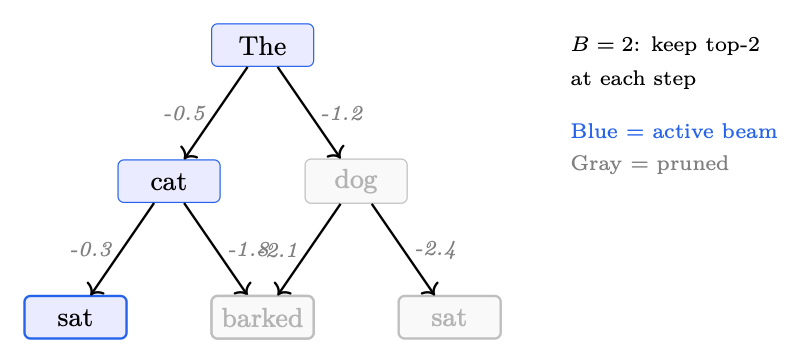<figcaption><span class="hh-tag">图 1.12：</span>束宽为 <math alttext="B=2" display="inline"><semantics><mrow><mi>B</mi><mo>=</mo><mn>2</mn></mrow></semantics></math> 的束搜索。在每一步，只有得分最高的 2 个部分序列会被保留（蓝色）。得分较低的候选会被剪枝（灰色）。</figcaption></figure>

### 多样化束搜索（Diverse Beam Search）

标准束搜索会产生近似重复的束。多样化束搜索 [360] 将束划分为 <math alttext="G" display="inline"><semantics><mi>G</mi></semantics></math> 个组，并在组之间添加一个不相似性惩罚：

<div class="hh-equation" id="ch1.ex45"><math alttext="\text{score}_{g}(y_{t})=\log P(y_{t}|y_{&lt;t})-\lambda\sum_{g^{\prime}&lt;g}\Delta(y_{t},Y_{g^{\prime}})" display="block"><semantics><mrow><mrow><msub><mtext>score</mtext><mi>g</mi></msub><mo lspace="0em" rspace="0em">​</mo><mrow><mo stretchy="false">(</mo><msub><mi>y</mi><mi>t</mi></msub><mo stretchy="false">)</mo></mrow></mrow><mo>=</mo><mrow><mrow><mi>log</mi><mo lspace="0.167em">⁡</mo><mrow><mi>P</mi><mo>⁡</mo><mrow><mo stretchy="false">(</mo><msub><mi>y</mi><mi>t</mi></msub><mo lspace="0em" rspace="0em">|</mo><msub><mi>y</mi><mrow><mphantom></mphantom><mo>&lt;</mo><mi>t</mi></mrow></msub><mo stretchy="false">)</mo></mrow></mrow></mrow><mo>−</mo><mrow><mi>λ</mi><mo lspace="0em" rspace="0em">​</mo><mrow><munder><mo movablelimits="false">∑</mo><mrow><msup><mi>g</mi><mo>′</mo></msup><mo>&lt;</mo><mi>g</mi></mrow></munder><mrow><mi mathvariant="normal">Δ</mi><mo>⁡</mo><mrow><mo stretchy="false">(</mo><msub><mi>y</mi><mi>t</mi></msub><mo>,</mo><msub><mi>Y</mi><msup><mi>g</mi><mo>′</mo></msup></msub><mo stretchy="false">)</mo></mrow></mrow></mrow></mrow></mrow></mrow></semantics></math></div>

其中 <math alttext="\Delta" display="inline"><semantics><mi mathvariant="normal">Δ</mi></semantics></math> 衡量与较早组已选 Token 的重叠（例如 Hamming 多样性），<math alttext="\lambda" display="inline"><semantics><mi>λ</mi></semantics></math> 控制多样性强度。

直觉：就像强迫一个头脑风暴小组生成不同的想法——每个子组若重复了较早子组所说的内容就会被惩罚。

优点：产生真正不同的候选序列；对重排序流水线很有用。<br>

缺点：多样性惩罚可能降低单个束的质量；超参数更多（<math alttext="G" display="inline"><semantics><mi>G</mi></semantics></math>、<math alttext="\lambda" display="inline"><semantics><mi>λ</mi></semantics></math>）。

### Top- kk 采样

仅从概率最高的 <math alttext="k" display="inline"><semantics><mi>k</mi></semantics></math> 个 Token 中采样，并重新分配概率质量：

<div class="hh-equation" id="ch1.ex46"><math alttext="P^{\prime}(v|x_{&lt;t})=\begin{cases}\dfrac{P(v|x_{&lt;t})}{\sum_{v^{\prime}\in\text{Top-}k}P(v^{\prime}|x_{&lt;t})}&amp;\text{if }v\in\text{Top-}k\\[6.0pt]
0&amp;\text{otherwise}\end{cases}" display="block"><semantics><mrow><mrow><msup><mi>P</mi><mo>′</mo></msup><mo lspace="0em" rspace="0em">​</mo><mrow><mo stretchy="false">(</mo><mi>v</mi><mo lspace="0em" rspace="0em">|</mo><msub><mi>x</mi><mrow><mphantom></mphantom><mo>&lt;</mo><mi>t</mi></mrow></msub><mo stretchy="false">)</mo></mrow></mrow><mo>=</mo><mrow><mo>{</mo><mtable columnspacing="5pt" displaystyle="true" rowspacing="0pt"><mtr><mtd columnalign="left"><mfrac><mrow><mi>P</mi><mo>⁡</mo><mrow><mo stretchy="false">(</mo><mi>v</mi><mo lspace="0em" rspace="0em">|</mo><msub><mi>x</mi><mrow><mphantom></mphantom><mo>&lt;</mo><mi>t</mi></mrow></msub><mo stretchy="false">)</mo></mrow></mrow><mrow><msub><mo>∑</mo><mrow><msup><mi>v</mi><mo>′</mo></msup><mo>∈</mo><mrow><mtext>Top-</mtext><mo lspace="0em" rspace="0em">​</mo><mi>k</mi></mrow></mrow></msub><mrow><mi>P</mi><mo>⁡</mo><mrow><mo stretchy="false">(</mo><msup><mi>v</mi><mo>′</mo></msup><mo lspace="0em" rspace="0em">|</mo><msub><mi>x</mi><mrow><mphantom></mphantom><mo>&lt;</mo><mi>t</mi></mrow></msub><mo stretchy="false">)</mo></mrow></mrow></mrow></mfrac></mtd><mtd columnalign="left"><mrow><mrow><mtext>if </mtext><mo lspace="0em" rspace="0em">​</mo><mi>v</mi></mrow><mo>∈</mo><mrow><mtext>Top-</mtext><mo lspace="0em" rspace="0em">​</mo><mi>k</mi></mrow></mrow></mtd></mtr><mtr><mtd columnalign="left"><mn>0</mn></mtd><mtd columnalign="left"><mtext>otherwise</mtext></mtd></mtr></mtable></mrow></mrow></semantics></math></div>

直觉：在「The cat sat on the…」之后，只考虑前 <math alttext="k" display="inline"><semantics><mi>k</mi></semantics></math> 个合理的延续（「mat」「floor」「couch」……），忽略那些极不可能的（「quantum」「archipelago」）。

优点：去除尾部噪声；实现简单。<br>

缺点：固定的 <math alttext="k" display="inline"><semantics><mi>k</mi></semantics></math> 对尖峰分布而言过于严格（浪费概率质量），对平坦分布而言又过于宽松（让垃圾 Token 进入）。

### Top- pp 采样（核采样，Nucleus Sampling）

从累计概率超过 <math alttext="p" display="inline"><semantics><mi>p</mi></semantics></math> 的最小 Token 集合中采样：

<div class="hh-equation" id="ch1.ex47"><math alttext="\text{Top-}p=\min\left\{S\subseteq\mathcal{V}:\sum_{v\in S}P(v|x_{&lt;t})\geq p\right\}" display="block"><semantics><mrow><mrow><mtext>Top-</mtext><mo lspace="0em" rspace="0em">​</mo><mi>p</mi></mrow><mo>=</mo><mrow><mi>min</mi><mo>⁡</mo><mrow><mo>{</mo><mrow><mi>S</mi><mo>⊆</mo><mi>𝒱</mi></mrow><mo lspace="0.278em" rspace="0.111em">:</mo><mrow><mrow><munder><mo movablelimits="false">∑</mo><mrow><mi>v</mi><mo>∈</mo><mi>S</mi></mrow></munder><mrow><mi>P</mi><mo>⁡</mo><mrow><mo stretchy="false">(</mo><mi>v</mi><mo lspace="0em" rspace="0em">|</mo><msub><mi>x</mi><mrow><mphantom></mphantom><mo>&lt;</mo><mi>t</mi></mrow></msub><mo stretchy="false">)</mo></mrow></mrow></mrow><mo>≥</mo><mi>p</mi></mrow><mo>}</mo></mrow></mrow></mrow></semantics></math></div>

其中 Token 按概率降序排序，并逐个加入直到达到阈值 <math alttext="p" display="inline"><semantics><mi>p</mi></semantics></math>。

直觉：自适应地调整候选池大小。如果模型很自信（「Paris」概率 95%），核就很小。如果不确定（「The movie was…」），核会扩展以包含许多合理的形容词。

优点：能适应分布形状；广泛使用的默认设置（<math alttext="p=0.9" display="inline"><semantics><mrow><mi>p</mi><mo>=</mo><mn>0.9</mn></mrow></semantics></math>–<math alttext="0.95" display="inline"><semantics><mn>0.95</mn></semantics></math>）。<br>

缺点：在核的尾部仍会包含一些低质量 Token；阈值是一个单一的全局超参数。

<figure id="ch1.f13">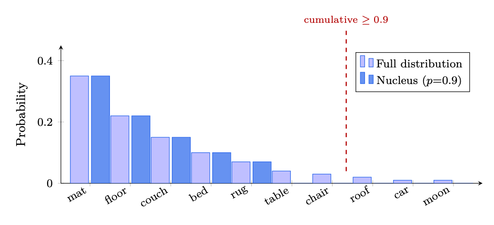<figcaption><span class="hh-tag">图 1.13：</span>Top-<math alttext="p" display="inline"><semantics><mi>p</mi></semantics></math>（核）采样：Token 按概率排序并依次加入，直到累计质量达到 <math alttext="p=0.9" display="inline"><semantics><mrow><mi>p</mi><mo>=</mo><mn>0.9</mn></mrow></semantics></math>。核（深蓝）会根据分布形状自适应其大小——这里 5 个 Token 就足够了。</figcaption></figure>

### Min- pp 采样

一种较新的替代方法，它设置了一个相对概率下限 [266]：

<div class="hh-equation" id="ch1.ex48"><math alttext="\text{Min-}p=\left\{v\in\mathcal{V}:P(v|x_{&lt;t})\geq p_{\min}\cdot\max_{v^{\prime}}P(v^{\prime}|x_{&lt;t})\right\}" display="block"><semantics><mrow><mrow><mtext>Min-</mtext><mo lspace="0em" rspace="0em">​</mo><mi>p</mi></mrow><mo>=</mo><mrow><mo>{</mo><mrow><mi>v</mi><mo>∈</mo><mi>𝒱</mi></mrow><mo lspace="0.278em" rspace="0.278em">:</mo><mrow><mrow><mi>P</mi><mo>⁡</mo><mrow><mo stretchy="false">(</mo><mi>v</mi><mo lspace="0em" rspace="0em">|</mo><msub><mi>x</mi><mrow><mphantom></mphantom><mo>&lt;</mo><mi>t</mi></mrow></msub><mo stretchy="false">)</mo></mrow></mrow><mo>≥</mo><mrow><msub><mi>p</mi><mi>min</mi></msub><mo lspace="0.222em" rspace="0.222em">⋅</mo><mrow><munder><mi>max</mi><msup><mi>v</mi><mo>′</mo></msup></munder><mo lspace="0.167em">⁡</mo><mrow><mi>P</mi><mo>⁡</mo><mrow><mo stretchy="false">(</mo><msup><mi>v</mi><mo>′</mo></msup><mo lspace="0em" rspace="0em">|</mo><msub><mi>x</mi><mrow><mphantom></mphantom><mo>&lt;</mo><mi>t</mi></mrow></msub><mo stretchy="false">)</mo></mrow></mrow></mrow></mrow></mrow><mo>}</mo></mrow></mrow></semantics></math></div>

只有概率至少为最高 Token 概率 <math alttext="p_{\min}" display="inline"><semantics><msub><mi>p</mi><mi>min</mi></msub></semantics></math> 倍的 Token 才会被保留。

直觉：「只考虑那些其可能性至少为最优 Token 10% 的 Token。」如果最高 Token 的概率为 0.8，那么只有概率高于 0.08 的 Token 能留下。如果最高 Token 的概率为 0.05（非常不确定），概率高于 0.005 的 Token 都能留下——自然地扩大了候选池。

优点：会随模型置信度自然伸缩；在尖峰分布上比 top-<math alttext="p" display="inline"><semantics><mi>p</mi></semantics></math> 产生更少的退化样本；只有一个直观的参数。<br>

缺点：较新、经受的实战检验较少；尚未在所有推理框架中成为标准。

### 温度缩放

在应用任何采样策略之前，将 logits 除以温度 <math alttext="T" display="inline"><semantics><mi>T</mi></semantics></math>：

<div class="hh-equation" id="ch1.ex49"><math alttext="P_{T}(v|x_{&lt;t})=\frac{\exp(z_{v}/T)}{\sum_{v^{\prime}}\exp(z_{v^{\prime}}/T)}" display="block"><semantics><mrow><mrow><msub><mi>P</mi><mi>T</mi></msub><mo lspace="0em" rspace="0em">​</mo><mrow><mo stretchy="false">(</mo><mi>v</mi><mo lspace="0em" rspace="0em">|</mo><msub><mi>x</mi><mrow><mphantom></mphantom><mo>&lt;</mo><mi>t</mi></mrow></msub><mo stretchy="false">)</mo></mrow></mrow><mo>=</mo><mfrac><mrow><mi>exp</mi><mo>⁡</mo><mrow><mo stretchy="false">(</mo><mrow><msub><mi>z</mi><mi>v</mi></msub><mo>/</mo><mi>T</mi></mrow><mo stretchy="false">)</mo></mrow></mrow><mrow><msub><mo>∑</mo><msup><mi>v</mi><mo>′</mo></msup></msub><mrow><mi>exp</mi><mo>⁡</mo><mrow><mo stretchy="false">(</mo><mrow><msub><mi>z</mi><msup><mi>v</mi><mo>′</mo></msup></msub><mo>/</mo><mi>T</mi></mrow><mo stretchy="false">)</mo></mrow></mrow></mrow></mfrac></mrow></semantics></math></div>

<ul><li><math alttext="T&lt;1" display="inline"><semantics><mrow><mi>T</mi><mo>&lt;</mo><mn>1</mn></mrow></semantics></math>：使分布更尖锐 <math alttext="\to" display="inline"><semantics><mo stretchy="false">→</mo></semantics></math> 更确定、更聚焦的输出。</li><li><math alttext="T=1" display="inline"><semantics><mrow><mi>T</mi><mo>=</mo><mn>1</mn></mrow></semantics></math>：未修改的模型分布。</li><li><math alttext="T&gt;1" display="inline"><semantics><mrow><mi>T</mi><mo>&gt;</mo><mn>1</mn></mrow></semantics></math>：使分布更平坦 <math alttext="\to" display="inline"><semantics><mo stretchy="false">→</mo></semantics></math> 更随机、更有创造性的输出。</li><li><math alttext="T\to 0" display="inline"><semantics><mrow><mi>T</mi><mo stretchy="false">→</mo><mn>0</mn></mrow></semantics></math>：退化为贪心解码。<math alttext="T\to\infty" display="inline"><semantics><mrow><mi>T</mi><mo stretchy="false">→</mo><mi mathvariant="normal">∞</mi></mrow></semantics></math>：退化为均匀采样。</li></ul>

常见设置：事实性任务 <math alttext="T=0.7" display="inline"><semantics><mrow><mi>T</mi><mo>=</mo><mn>0.7</mn></mrow></semantics></math>，创意写作 <math alttext="T=1.0" display="inline"><semantics><mrow><mi>T</mi><mo>=</mo><mn>1.0</mn></mrow></semantics></math>–<math alttext="1.2" display="inline"><semantics><mn>1.2</mn></semantics></math>，代码/数学 <math alttext="T=0.0" display="inline"><semantics><mrow><mi>T</mi><mo>=</mo><mn>0.0</mn></mrow></semantics></math>（贪心）。

### 对比解码（Contrastive Decoding）

对比解码（Contrastive Decoding） [211] 利用一个强模型（专家）与一个弱模型（业余者）之间的差异，来放大专家独有的知识：

<div class="hh-equation" id="ch1.ex50"><math alttext="x_{t}=\arg\max_{v\in\mathcal{V}(x_{&lt;t})}\left[\log P_{\text{expert}}(v|x_{&lt;t})-\log P_{\text{amateur}}(v|x_{&lt;t})\right]" display="block"><semantics><mrow><msub><mi>x</mi><mi>t</mi></msub><mo>=</mo><mrow><mrow><mi>arg</mi><mo lspace="0.167em">⁡</mo><munder><mi>max</mi><mrow><mi>v</mi><mo>∈</mo><mrow><mi>𝒱</mi><mo>⁡</mo><mrow><mo stretchy="false">(</mo><msub><mi>x</mi><mrow><mphantom></mphantom><mo>&lt;</mo><mi>t</mi></mrow></msub><mo stretchy="false">)</mo></mrow></mrow></mrow></munder></mrow><mo lspace="0em" rspace="0em">​</mo><mrow><mo>[</mo><mrow><mrow><mrow><mi>log</mi><mo lspace="0.167em">⁡</mo><msub><mi>P</mi><mtext>expert</mtext></msub></mrow><mo lspace="0em" rspace="0em">​</mo><mrow><mo stretchy="false">(</mo><mi>v</mi><mo lspace="0em" rspace="0em">|</mo><msub><mi>x</mi><mrow><mphantom></mphantom><mo>&lt;</mo><mi>t</mi></mrow></msub><mo stretchy="false">)</mo></mrow></mrow><mo>−</mo><mrow><mrow><mi>log</mi><mo lspace="0.167em">⁡</mo><msub><mi>P</mi><mtext>amateur</mtext></msub></mrow><mo lspace="0em" rspace="0em">​</mo><mrow><mo stretchy="false">(</mo><mi>v</mi><mo lspace="0em" rspace="0em">|</mo><msub><mi>x</mi><mrow><mphantom></mphantom><mo>&lt;</mo><mi>t</mi></mrow></msub><mo stretchy="false">)</mo></mrow></mrow></mrow><mo>]</mo></mrow></mrow></mrow></semantics></math></div>

其中 <math alttext="\mathcal{V}(x_{&lt;t})=\{v:P_{\text{expert}}(v|x_{&lt;t})\geq\alpha\cdot\max_{v^{\prime}}P_{\text{expert}}(v^{\prime}|x_{&lt;t})\}" display="inline"><semantics><mrow><mrow><mi>𝒱</mi><mo>⁡</mo><mrow><mo stretchy="false">(</mo><msub><mi>x</mi><mrow><mphantom></mphantom><mo>&lt;</mo><mi>t</mi></mrow></msub><mo stretchy="false">)</mo></mrow></mrow><mo>=</mo><mrow><mo stretchy="false">{</mo><mi>v</mi><mo lspace="0.278em" rspace="0.278em">:</mo><mrow><mrow><msub><mi>P</mi><mtext>expert</mtext></msub><mo lspace="0em" rspace="0em">​</mo><mrow><mo stretchy="false">(</mo><mi>v</mi><mo lspace="0em" rspace="0em">|</mo><msub><mi>x</mi><mrow><mphantom></mphantom><mo>&lt;</mo><mi>t</mi></mrow></msub><mo stretchy="false">)</mo></mrow></mrow><mo>≥</mo><mrow><mrow><mi>α</mi><mo lspace="0.222em" rspace="0.222em">⋅</mo><mrow><msub><mi>max</mi><msup><mi>v</mi><mo>′</mo></msup></msub><mo lspace="0.167em">⁡</mo><msub><mi>P</mi><mtext>expert</mtext></msub></mrow></mrow><mo lspace="0em" rspace="0em">​</mo><mrow><mo stretchy="false">(</mo><msup><mi>v</mi><mo>′</mo></msup><mo lspace="0em" rspace="0em">|</mo><msub><mi>x</mi><mrow><mphantom></mphantom><mo>&lt;</mo><mi>t</mi></mrow></msub><mo stretchy="false">)</mo></mrow></mrow></mrow><mo stretchy="false">}</mo></mrow></mrow></semantics></math> 是一个自适应的合理性约束。

直觉：业余模型捕捉到的是泛泛的、显而易见的模式（常用词、重复）。减去其对数概率就去除了这种「泛泛信号」，留下专家独有的知识和推理。就像从录音中去除背景噪声以听见信号一样。

优点：减少重复和泛泛的措辞；在不额外训练的情况下提升事实性和连贯性；可与任意一对模型搭配使用。<br>

缺点：需要运行两个模型（2<math alttext="\times" display="inline"><semantics><mo>×</mo></semantics></math> 的计算量）；对业余模型的选择敏感；合理性阈值 <math alttext="\alpha" display="inline"><semantics><mi>α</mi></semantics></math> 需要调优。

### 重复惩罚

与采样策略正交，重复惩罚会阻止模型重复 Token。给定 Token <math alttext="v" display="inline"><semantics><mi>v</mi></semantics></math> 的原始 logit <math alttext="z_{v}" display="inline"><semantics><msub><mi>z</mi><mi>v</mi></msub></semantics></math>（即 LM 头在 softmax <em>之前</em> 输出的未归一化得分），惩罚后的 logit 为：

<div class="hh-equation" id="ch1.ex51"><math alttext="z_{v}^{\prime}=\begin{cases}z_{v}/\theta&amp;\text{if }v\in\text{generated tokens and }z_{v}&gt;0\\
z_{v}\cdot\theta&amp;\text{if }v\in\text{generated tokens and }z_{v}&lt;0\end{cases}" display="block"><semantics><mrow><msubsup><mi>z</mi><mi>v</mi><mo>′</mo></msubsup><mo>=</mo><mrow><mo>{</mo><mtable columnspacing="5pt" displaystyle="true" rowspacing="0pt"><mtr><mtd columnalign="left"><mrow><msub><mi>z</mi><mi>v</mi></msub><mo>/</mo><mi>θ</mi></mrow></mtd><mtd columnalign="left"><mrow><mrow><mtext>if </mtext><mo lspace="0em" rspace="0em">​</mo><mi>v</mi></mrow><mo>∈</mo><mrow><mtext>generated tokens and </mtext><mo lspace="0em" rspace="0em">​</mo><msub><mi>z</mi><mi>v</mi></msub></mrow><mo>&gt;</mo><mn>0</mn></mrow></mtd></mtr><mtr><mtd columnalign="left"><mrow><msub><mi>z</mi><mi>v</mi></msub><mo lspace="0.222em" rspace="0.222em">⋅</mo><mi>θ</mi></mrow></mtd><mtd columnalign="left"><mrow><mrow><mtext>if </mtext><mo lspace="0em" rspace="0em">​</mo><mi>v</mi></mrow><mo>∈</mo><mrow><mtext>generated tokens and </mtext><mo lspace="0em" rspace="0em">​</mo><msub><mi>z</mi><mi>v</mi></msub></mrow><mo>&lt;</mo><mn>0</mn></mrow></mtd></mtr></mtable></mrow></mrow></semantics></math></div>

其中 <math alttext="\theta&gt;1" display="inline"><semantics><mrow><mi>θ</mi><mo>&gt;</mo><mn>1</mn></mrow></semantics></math> 是惩罚因子（通常为 1.1–1.3）。在两种情况下，其效果都是把 logit 推向零——从而降低先前生成 Token 的概率。频率惩罚和存在惩罚是 OpenAI API 使用的更简单的加性变体：

<div class="hh-equation" id="ch1.ex52"><math alttext="z_{v}^{\prime}=z_{v}-\alpha\cdot\text{count}(v)-\beta\cdot\mathbf{1}[v\in\text{generated}]" display="block"><semantics><mrow><msubsup><mi>z</mi><mi>v</mi><mo>′</mo></msubsup><mo>=</mo><msub><mi>z</mi><mi>v</mi></msub><mo>−</mo><mi>α</mi><mo lspace="0.222em" rspace="0.222em">⋅</mo><mtext>count</mtext><mrow><mo stretchy="false">(</mo><mi>v</mi><mo stretchy="false">)</mo></mrow><mo>−</mo><mi>β</mi><mo lspace="0.222em" rspace="0.222em">⋅</mo><mn>𝟏</mn><mrow><mo stretchy="false">[</mo><mi>v</mi><mo>∈</mo><mtext>generated</mtext><mo stretchy="false">]</mo></mrow></mrow></semantics></math></div>

其中 <math alttext="\alpha" display="inline"><semantics><mi>α</mi></semantics></math> 是频率惩罚（与 <math alttext="v" display="inline"><semantics><mi>v</mi></semantics></math> 出现次数成正比），<math alttext="\beta" display="inline"><semantics><mi>β</mi></semantics></math> 是存在惩罚（对任何先前出现给予恒定惩罚）。

### 实际对比

<div class="hh-table" id="ch1.t15"><table class="ltx_tabular ltx_align_middle"><thead><tr><th class="ltx_align_left"><span>方法</span></th><th class="ltx_align_left ltx_align_top"><span class="ltx_align_top"><span><span>是否确定性</span></span></span></th><th class="ltx_align_left ltx_align_top"><span class="ltx_align_top"><span><span>多样性</span></span></span></th><th class="ltx_align_left ltx_align_top"><span class="ltx_align_top"><span><span>质量</span></span></span></th><th class="ltx_align_left ltx_align_top"><span class="ltx_align_top"><span><span>最佳适用</span></span></span></th></tr></thead><tbody><tr><th class="ltx_align_left">贪心</th><td class="ltx_align_left ltx_align_top"><span class="ltx_align_top"><span>是</span></span></td><td class="ltx_align_left ltx_align_top"><span class="ltx_align_top"><span>无</span></span></td><td class="ltx_align_left ltx_align_top"><span class="ltx_align_top"><span>中等</span></span></td><td class="ltx_align_left ltx_align_top"><span class="ltx_align_top"><span>代码、事实问答</span></span></td></tr><tr><th class="ltx_align_left">束搜索（<math alttext="B" display="inline"><semantics><mi>B</mi><span></span></semantics></math>=4–8）</th><td class="ltx_align_left ltx_align_top"><span class="ltx_align_top"><span>是</span></span></td><td class="ltx_align_left ltx_align_top"><span class="ltx_align_top"><span>低</span></span></td><td class="ltx_align_left ltx_align_top"><span class="ltx_align_top"><span>高（较窄）</span></span></td><td class="ltx_align_left ltx_align_top"><span class="ltx_align_top"><span>翻译、摘要</span></span></td></tr><tr><th class="ltx_align_left">多样化束搜索</th><td class="ltx_align_left ltx_align_top"><span class="ltx_align_top"><span>是</span></span></td><td class="ltx_align_left ltx_align_top"><span class="ltx_align_top"><span>中等</span></span></td><td class="ltx_align_left ltx_align_top"><span class="ltx_align_top"><span>高</span></span></td><td class="ltx_align_left ltx_align_top"><span class="ltx_align_top"><span>用于重排序的候选生成</span></span></td></tr><tr><th class="ltx_align_left">Top-<math alttext="k" display="inline"><semantics><mi>k</mi><span></span></semantics></math>（<math alttext="k" display="inline"><semantics><mi>k</mi><span></span></semantics></math>=50）</th><td class="ltx_align_left ltx_align_top"><span class="ltx_align_top"><span>否</span></span></td><td class="ltx_align_left ltx_align_top"><span class="ltx_align_top"><span>中等</span></span></td><td class="ltx_align_left ltx_align_top"><span class="ltx_align_top"><span>中等</span></span></td><td class="ltx_align_left ltx_align_top"><span class="ltx_align_top"><span>通用生成</span></span></td></tr><tr><th class="ltx_align_left">Top-<math alttext="p" display="inline"><semantics><mi>p</mi><span></span></semantics></math>（<math alttext="p" display="inline"><semantics><mi>p</mi><span></span></semantics></math>=0.9）</th><td class="ltx_align_left ltx_align_top"><span class="ltx_align_top"><span>否</span></span></td><td class="ltx_align_left ltx_align_top"><span class="ltx_align_top"><span>自适应</span></span></td><td class="ltx_align_left ltx_align_top"><span class="ltx_align_top"><span>高</span></span></td><td class="ltx_align_left ltx_align_top"><span class="ltx_align_top"><span>开放式任务的默认选择</span></span></td></tr><tr><th class="ltx_align_left">Min-<math alttext="p" display="inline"><semantics><mi>p</mi><span></span></semantics></math>（<math alttext="p_{\min}" display="inline"><semantics><msub><mi>p</mi><mi>min</mi></msub><span></span></semantics></math>=0.1）</th><td class="ltx_align_left ltx_align_top"><span class="ltx_align_top"><span>否</span></span></td><td class="ltx_align_left ltx_align_top"><span class="ltx_align_top"><span>自适应</span></span></td><td class="ltx_align_left ltx_align_top"><span class="ltx_align_top"><span>高</span></span></td><td class="ltx_align_left ltx_align_top"><span class="ltx_align_top"><span>top-<math alttext="p" display="inline"><semantics><mi>p</mi><span></span></semantics></math> 的稳健替代</span></span></td></tr><tr><th class="ltx_align_left">对比解码</th><td class="ltx_align_left ltx_align_top"><span class="ltx_align_top"><span>是</span></span></td><td class="ltx_align_left ltx_align_top"><span class="ltx_align_top"><span>低</span></span></td><td class="ltx_align_left ltx_align_top"><span class="ltx_align_top"><span>非常高</span></span></td><td class="ltx_align_left ltx_align_top"><span class="ltx_align_top"><span>事实性、连贯的长文本</span></span></td></tr></tbody></table><p class="hh-table-caption"><span class="hh-tag">表 1.15：</span>LLM 文本生成中各解码方法的对比。</p></div>

### 受限解码（Constrained Decoding，结构化生成 Structured Generation）

上述所有方法都在每一步从<em>完整</em>的词表中采样。受限解码（Constrained Decoding）限制允许的 Token 集合，从而<em>保证</em>输出符合某种形式文法——通常是 JSON 模式、正则表达式或上下文无关文法（CFG）。

在每个解码步 <math alttext="t" display="inline"><semantics><mi>t</mi></semantics></math>，会根据当前解析器状态计算一个Token 掩码（token mask）<math alttext="M_{t}\subseteq\mathcal{V}" display="inline"><semantics><mrow><msub><mi>M</mi><mi>t</mi></msub><mo>⊆</mo><mi>𝒱</mi></mrow></semantics></math>。只有 <math alttext="M_{t}" display="inline"><semantics><msub><mi>M</mi><mi>t</mi></msub></semantics></math> 中的 Token 保留其原始 logits；在 softmax 之前，所有其它 Token 都被设为 <math alttext="-\infty" display="inline"><semantics><mrow><mo>−</mo><mi mathvariant="normal">∞</mi></mrow></semantics></math>：

<div class="hh-equation" id="ch1.ex53"><math alttext="P^{\prime}(v|x_{&lt;t})=\begin{cases}P(v|x_{&lt;t})/Z&amp;\text{if }v\in M_{t}\\
0&amp;\text{otherwise}\end{cases}" display="block"><semantics><mrow><mrow><msup><mi>P</mi><mo>′</mo></msup><mo lspace="0em" rspace="0em">​</mo><mrow><mo stretchy="false">(</mo><mi>v</mi><mo lspace="0em" rspace="0em">|</mo><msub><mi>x</mi><mrow><mphantom></mphantom><mo>&lt;</mo><mi>t</mi></mrow></msub><mo stretchy="false">)</mo></mrow></mrow><mo>=</mo><mrow><mo>{</mo><mtable columnspacing="5pt" displaystyle="true" rowspacing="0pt"><mtr><mtd columnalign="left"><mrow><mrow><mi>P</mi><mo>⁡</mo><mrow><mo stretchy="false">(</mo><mi>v</mi><mo lspace="0em" rspace="0em">|</mo><msub><mi>x</mi><mrow><mphantom></mphantom><mo>&lt;</mo><mi>t</mi></mrow></msub><mo stretchy="false">)</mo></mrow></mrow><mo>/</mo><mi>Z</mi></mrow></mtd><mtd columnalign="left"><mrow><mrow><mtext>if </mtext><mo lspace="0em" rspace="0em">​</mo><mi>v</mi></mrow><mo>∈</mo><msub><mi>M</mi><mi>t</mi></msub></mrow></mtd></mtr><mtr><mtd columnalign="left"><mn>0</mn></mtd><mtd columnalign="left"><mtext>otherwise</mtext></mtd></mtr></mtable></mrow></mrow></semantics></math></div>

其中 <math alttext="Z=\sum_{v\in M_{t}}P(v|x_{&lt;t})" display="inline"><semantics><mrow><mi>Z</mi><mo rspace="0.111em">=</mo><mrow><msub><mo>∑</mo><mrow><mi>v</mi><mo>∈</mo><msub><mi>M</mi><mi>t</mi></msub></mrow></msub><mrow><mi>P</mi><mo>⁡</mo><mrow><mo stretchy="false">(</mo><mi>v</mi><mo lspace="0em" rspace="0em">|</mo><msub><mi>x</mi><mrow><mphantom></mphantom><mo>&lt;</mo><mi>t</mi></mrow></msub><mo stretchy="false">)</mo></mrow></mrow></mrow></mrow></semantics></math> 用于重新归一化。由于掩码每一步都会变化（它取决于到目前为止已经生成的内容），约束是<em>逐步</em>强制实施的——模型在任何位置都不可能生成一个非法前缀。

编译流水线为：

<div class="hh-equation" id="ch1.ex54"><math alttext="\text{JSON Schema}\;\xrightarrow{\text{compile}}\;\text{Regex}\;\xrightarrow{\text{compile}}\;\text{FSM (DFA)}\;\xrightarrow{\text{index}}\;\text{Token Mask per State}" display="block"><semantics><mrow><mtext>JSON Schema</mtext><mover accent="true"><mo lspace="0.558em">→</mo><mtext mathsize="0.700em">compile</mtext></mover><mtext>Regex</mtext><mover accent="true"><mo lspace="0.558em">→</mo><mtext mathsize="0.700em">compile</mtext></mover><mtext>FSM (DFA)</mtext><mover accent="true"><mo lspace="0.558em">→</mo><mtext mathsize="0.700em">index</mtext></mover><mtext>Token Mask per State</mtext></mrow></semantics></math></div>

有限状态机（FSM）的状态对应正则表达式中的位置。对每个状态，所有能使字符串保持在该语言内的词表 Token 都被预计算成索引（对每个模式只需一次性的开销）。在运行时，查询掩码只是一次 <math alttext="O(1)" display="inline"><semantics><mrow><mi>O</mi><mo>⁡</mo><mrow><mo stretchy="false">(</mo><mn>1</mn><mo stretchy="false">)</mo></mrow></mrow></semantics></math> 的表访问——对每个解码步带来的延迟可忽略不计。

<ul><li>Outlines[378]：将 JSON 模式和正则表达式编译为交织的、由 FSM 引导的生成。支持任何提供 logits 接口的模型。</li><li>lm-format-enforcer：类似的 FSM 方法，重点放在与服务框架（vLLM、TGI）的集成上。</li><li>Guidance（Microsoft）：将受限生成与控制流（循环、条件）交织在一起，可实现超越扁平模式的复杂结构化输出。</li><li>XGrammar[77]：基于下推自动机的引擎，支持完整的上下文无关文法（不仅限于正则语言），被 MLC-LLM 和 vLLM 用于语法模式的解码。</li></ul>

受限解码<em>保证</em>了语法有效性——不会出现事后解析失败，也无需重试。然而：

<ul><li>语义质量：如果模型对「正确」答案的概率质量位于语法之外，强制结构可能会降低内容质量。在实践中，对于设计良好的模式和训练良好的模型，这种情况很少出现。</li><li>编译开销：必须为每个模式构建 FSM 索引。对于复杂模式可能需要 1–5 秒，但这一开销会在所有使用该模式的请求间摊销。</li><li>语法覆盖：正则/FSM 可处理 JSON、YAML、SQL 片段以及大多数结构化格式。完整的 CFG（通过 XGrammar 或 LALR 解析器）可覆盖 Python 或 XML 等语言。</li></ul>

## Prompt 工程

Prompt 工程是一门设计 LLM 输入的学科，目标是在不修改模型权重的情况下可靠地激发预期行为。微调修改的是模型本身，而 Prompt 工程则通过精心的框架、示例与结构来挖掘模型<em>已有的</em>能力。它是改善 LLM 输出最快、最便宜、也最易获得的杠杆，即使在使用微调模型时也依然不可或缺。

### 上下文学习（In-Context Learning，ICL）

上下文学习（In-Context Learning，ICL） [32] 是大语言模型一项令人瞩目的能力：在推理时仅凭 Prompt 中提供的示例就能学习任务，完全无需梯度更新。模型从输入–输出对的模式中隐式推断任务，并泛化到新的输入上。

ICL 主要在参数量 <math alttext="\sim" display="inline"><semantics><mo>∼</mo></semantics></math>1B 以上的模型中涌现，并随模型规模呈对数线性提升 [32]。较小的模型可以记住示例，但难以在同一上下文窗口内泛化到新的输入。

### 零样本提示（Zero-Shot Prompting）

零样本提示（Zero-Shot Prompting）<em>不</em>提供任何示例，只有任务描述或指令。模型必须完全依靠预训练知识与指令微调来生成正确的格式与内容。

<ul><li>模型在预训练/监督微调（SFT）阶段大量见过的任务（翻译、摘要、情感分析）</li><li>指令明确、输出格式无歧义</li><li>指令微调模型（如 ChatGPT、Claude、Llama-3-Instruct）在零样本任务上显著优于基座模型 [280]</li></ul>

全新格式、领域特定的标注方案，或模型无法仅凭指令推断出确切需求的模糊任务。

### 少样本提示（Few-Shot Prompting）

少样本提示（Few-Shot Prompting） [32] 在实际查询之前提供 <math alttext="k" display="inline"><semantics><mi>k</mi></semantics></math> 个输入–输出示例（即「shots」）。它是上下文学习最常见的形式，也仍然是最有效的提示策略之一。

<ol><li>多样性：覆盖预期输入的范围（不同长度、边界情况、类别）。</li><li>顺序：将较难或更具代表性的示例放在最后（近因偏差，recency bias） [242]。</li><li>标签平衡：分类任务中要包含所有类别的示例，以避免多数类偏差。</li><li>格式一致性：每个示例都必须遵循<em>完全</em>相同的结构。模型会模仿这种模式。</li><li>相关性：选用与目标查询语义相近的示例可获得最佳效果 [224]。</li></ol>

性能通常会从 0 个示例提升到 4–8 个示例，然后趋于平稳。超过 <math alttext="\sim" display="inline"><semantics><mo>∼</mo></semantics></math>20 个示例后收益微乎其微，反而有占满上下文窗口的风险。Min 等人 [257] 表明，示例的<em>格式</em>与<em>标签空间</em>比标签正确性更重要——即使随机标签也有帮助（不过正确标签帮助更大）。

### 指令跟随类 Prompt

指令微调模型对清晰、结构化的指令响应最好。关键洞察是：把 Prompt 当作一份 <em>规范说明</em>，而不是建议。

现代聊天 API 把 <em>system</em> prompt（持久指令、角色定义）与 <em>user</em> 消息（每轮输入）分离开来。system prompt 在多数模型中以更高的 attention 优先级被处理，是放置角色定义、约束和输出格式说明的天然位置 [274]。

### 结构化输出 Prompt（JSON/XML）

对于程序化用途，最关键的提示技术是强制结构化输出——尤其是 JSON。

<ul><li>Schema 优先：在输入 <em>之前</em>展示精确的 JSON schema，模型会把它当作模板。</li><li>约束解码（Constrained decoding）：使用基于语法的采样（如 Outlines [378]、Guidance）在 token 级别保证 JSON 语法合法。</li><li>XML 标签：对于嵌套或多段输出，XML 标签（如 <code>&lt;thinking&gt;...&lt;/thinking&gt;</code>）提供无歧义的分隔符，模型能可靠地遵循。</li><li>Pydantic/TypeScript 类型：提供类型定义有助于模型理解字段约束（OpenAI 的 function calling 内部就使用 JSON Schema）。</li></ul>

一种独立但互补的技术是 <em>JSON prompting</em>——将 Prompt <em>本身</em>格式化为 JSON 而非自然语言。这利用了模型在结构化数据（API、配置、代码）上大量的预训练，从而提升指令遵循度、降低歧义，并使多字段请求能够被确定性地解析。

### 思维链（Chain-of-Thought，CoT）Prompting

思维链（Chain-of-Thought, CoT）提示 [374] 要求模型在给出最终答案之前先产生中间推理步骤。这一简单技术能大幅提升需要多步推理的任务上的表现：算术、逻辑、常识推断和代码生成。

<ul><li>将计算串行化：Transformer 的深度固定，但生成长度可变。CoT 把并行的（困难）问题转化为串行的（容易）步骤，实际上扩大了模型的计算预算。</li><li>减少误差累积：每一步都是更简单的子问题，单步错误率更低。</li><li>暴露中间状态：使推理可审计、可调试。</li></ul>

Wang 等人 [367] 表明，采样多条思维链推理路径并对最终答案做多数投票，显著优于单路径 CoT。其直觉是：正确的推理路径往往会收敛到同一答案，而错误通常各有各的样子。这是用计算量（生成 <math alttext="N" display="inline"><semantics><mi>N</mi></semantics></math> 个样本）换取准确率——当延迟不如正确性重要时，这一做法很实用。

CoT 并非普遍有益。对于简单任务（单步分类、检索、格式化），CoT 会增加不必要的 token、提高延迟，甚至可能因过度思考而引入错误。应只在预期需要多步推理的任务上有选择地使用 CoT。

### 进阶 Prompting 技术

RAG [209] 不再仅仅依赖模型的参数化记忆，而是检索相关文档并把它们放进 Prompt 中：

```python
Context (retrieved): [document chunks]
Question: [user query]
Answer based ONLY on the provided context.
```

这使模型的回答建立在可验证的来源之上，并显著减少知识密集型任务中的幻觉。

复杂任务适合拆解成由更简单的 Prompt 组成的流水线，其中一步的输出成为下一步的输入：

<ol><li><em>抽取</em>文档中的关键事实</li><li>对抽取出的事实进行<em>推理</em></li><li><em>格式化</em>最终答案</li></ol>

每一步都可以使用不同的 Prompt 模板、模型或 temperature 设置。这比单个庞杂的 Prompt 更可控，也便于做有针对性的调试。

Bai 等人 [16] 提出了让模型依据一组原则批判并修订自身输出的 Prompt：

```python
[Generate initial response]
Critique: Does this response violate any of the following
principles? [list principles]
Revision: Rewrite the response addressing the critique.
```

近年来的工作不再手工打造 Prompt，而是自动设计 Prompt：

<ul><li>APE[441]：使用 LLM 自动生成候选 Prompt 并为其打分。</li><li>DSPy[182]：把声明式的任务描述编译成带学习到的少样本示例的优化 Prompt 流水线。</li><li>OPRO[402]：把 Prompt 优化视为一个优化问题，用 LLM 充当优化器。</li></ul>

ARQ [403] 针对标准提示的一个根本弱点：随着上下文长度增长，模型越来越容易“丢失”位于 Prompt 中部的关键信息（即 <em>lost-in-the-middle</em> 效应）。ARQ 通过把一个复杂查询拆解成多个聚焦的子查询来缓解这一问题，每个子查询都旨在把模型的注意力引导到上下文的某个特定部分：

<ol><li>查询分解：把用户问题拆解成若干原子子问题，每个只针对一个很窄的方面。</li><li>注意力检索：对每个子查询，只检索或高亮相关的上下文片段——迫使模型关注该片段。</li><li>聚合：把各子答案合并成连贯的最终回答。</li></ol>

这对长文档问答、在大规模检索集上的多跳推理，以及上下文窗口中包含大量 tool 输出的智能体（Agent）任务都特别有效。ARQ 可以看作一种结构化的思维链：它显式地管理模型<em>看哪里</em>，而不仅仅是<em>如何</em>推理。

### 最佳实践：打造高效 Prompt

基于文献中的实证发现以及实践者的经验，以下原则能可靠地提升 Prompt 质量：

<div class="hh-table" id="ch1.t16"><table class="ltx_tabular ltx_align_middle"><thead><tr><th class="ltx_align_left"><span>失效模式</span></th><th class="ltx_align_left ltx_align_top"><span class="ltx_align_top"><span><span>症状</span></span></span></th><th class="ltx_align_left ltx_align_top"><span class="ltx_align_top"><span><span>解决方案</span></span></span></th></tr></thead><tbody><tr><th class="ltx_align_left">指令遗忘</th><td class="ltx_align_left ltx_align_top"><span class="ltx_align_top"><span>在长 Prompt 中模型忽略约束</span></span></td><td class="ltx_align_left ltx_align_top"><span class="ltx_align_top"><span>把约束移到末尾；重复关键规则；使用 system prompt</span></span></td></tr><tr><th class="ltx_align_left">格式漂移</th><td class="ltx_align_left ltx_align_top"><span class="ltx_align_top"><span>输出开始时正确，但在长生成过程中逐渐退化</span></span></td><td class="ltx_align_left ltx_align_top"><span class="ltx_align_top"><span>使用约束解码；拆分成更短的链式 Prompt</span></span></td></tr><tr><th class="ltx_align_left">谄媚</th><td class="ltx_align_left ltx_align_top"><span class="ltx_align_top"><span>模型认同 Prompt 中的错误前提</span></span></td><td class="ltx_align_left ltx_align_top"><span class="ltx_align_top"><span>加入“如果假设有误就提出质疑”；使用 system 级指令</span></span></td></tr><tr><th class="ltx_align_left">幻觉细节</th><td class="ltx_align_left ltx_align_top"><span class="ltx_align_top"><span>模型编造提供的上下文中没有的事实</span></span></td><td class="ltx_align_left ltx_align_top"><span class="ltx_align_top"><span>加入“如果不知道，就说我不知道”；使用带来源归属的 RAG</span></span></td></tr><tr><th class="ltx_align_left">拒答过度触发</th><td class="ltx_align_left ltx_align_top"><span class="ltx_align_top"><span>模型因安全训练而拒绝无害请求</span></span></td><td class="ltx_align_left ltx_align_top"><span class="ltx_align_top"><span>换一种表述以澄清正当意图；明确说明该请求为何是合适的</span></span></td></tr></tbody></table><p class="hh-table-caption"><span class="hh-tag">表 1.16：</span>常见的提示失效模式与解决方案。</p></div>

## 模型压缩方法

模型压缩在保持质量的同时降低模型规模和推理成本。主要有三种方法：量化（降低精度）、剪枝（移除参数）和蒸馏（训练一个小模型来模仿大模型）。

### 量化（Quantization）

量化通过用更低精度的格式表示权重（以及可选的激活值）来降低模型规模和推理成本。其核心权衡是压缩比与质量退化之间的取舍。

<div class="hh-table" id="ch1.t17"><table class="ltx_tabular ltx_align_middle"><thead><tr><th class="ltx_align_left"><span>方法</span></th><th class="ltx_align_left"><span>比特</span></th><th class="ltx_align_left"><span>类型</span></th><th class="ltx_align_left"><span>核心思想</span></th></tr></thead><tbody><tr><td class="ltx_align_left"><span>GPTQ</span><span>[99]</span></td><td class="ltx_align_left">4-bit</td><td class="ltx_align_left">PTQ，仅权重</td><td class="ltx_align_left"><span class="ltx_align_top"><span>逐层量化，通过 optimal brain surgeon 最小化 <math alttext="\|WX-\hat{W}X\|^{2}" display="inline"><semantics><msup><mrow><mo stretchy="false">‖</mo><mrow><mrow><mi>W</mi><mo lspace="0em" rspace="0em">​</mo><mi>X</mi></mrow><mo>−</mo><mrow><mover accent="true"><mi>W</mi><mo>^</mo></mover><mo lspace="0em" rspace="0em">​</mo><mi>X</mi></mrow></mrow><mo stretchy="false">‖</mo></mrow><mn>2</mn></msup><span></span></semantics></math>。</span></span></td></tr><tr><td class="ltx_align_left"><span>AWQ</span><span>[218]</span></td><td class="ltx_align_left">4-bit</td><td class="ltx_align_left">PTQ，仅权重</td><td class="ltx_align_left"><span class="ltx_align_top"><span>保护显著权重（即激活值较大的权重）。1% 的权重承担了 99% 的重要性。</span></span></td></tr><tr><td class="ltx_align_left"><span>GGUF</span><span>[109]</span></td><td class="ltx_align_left">2–8 bit</td><td class="ltx_align_left">PTQ，仅权重</td><td class="ltx_align_left"><span class="ltx_align_top"><span>面向 CPU 优化的格式（llama.cpp）。按块量化，支持多种类型。</span></span></td></tr><tr><td class="ltx_align_left"><span>FP8</span>（E4M3）</td><td class="ltx_align_left">8-bit</td><td class="ltx_align_left">训练 + 推理</td><td class="ltx_align_left"><span class="ltx_align_top"><span>H100 原生支持。相比 BF16 有 2<math alttext="\times" display="inline"><semantics><mo>×</mo><span></span></semantics></math> 的吞吐。</span></span></td></tr><tr><td class="ltx_align_left"><span>SmoothQuant</span><span>[392]</span></td><td class="ltx_align_left">W8A8</td><td class="ltx_align_left">PTQ，权重+激活</td><td class="ltx_align_left"><span class="ltx_align_top"><span>量化前把激活的离群值平滑进权重。使能 INT8 GEMM。</span></span></td></tr><tr><td class="ltx_align_left"><span>QAT</span><span>[235]</span></td><td class="ltx_align_left">4-bit</td><td class="ltx_align_left">QAT</td><td class="ltx_align_left"><span class="ltx_align_top"><span>使用模拟量化进行训练。质量最高但代价高昂。</span></span></td></tr><tr><td class="ltx_align_left"><span>AQLM</span><span>[83]</span></td><td class="ltx_align_left">2-bit</td><td class="ltx_align_left">PTQ，加性编码</td><td class="ltx_align_left"><span class="ltx_align_top"><span>通过学习到的加性量化码本实现极致压缩。</span></span></td></tr></tbody></table><p class="hh-table-caption"><span class="hh-tag">表 1.17：</span>面向 LLM 的量化方法。</p></div>

### 剪枝（Pruning）

现代 LLM 包含数十亿参数，但实证研究一致表明，其中很大一部分权重对模型输出的贡献微乎其微。剪枝正是利用了这种过参数化：通过移除冗余权重，我们可以降低 显存占用（从而能部署到更小的 GPU 或边缘设备上）、推理延迟（每次前向传播的乘加运算更少）和 服务成本（每美元能获得更高吞吐）。与对所有权重统一降低精度的量化不同，剪枝是有选择地剔除权重——与量化结合时可带来相乘的节省（例如，50% 稀疏的 4-bit 模型比稠密的 BF16 基线少用 <math alttext="4\times" display="inline"><semantics><mrow><mn>4</mn><mo lspace="0.222em">×</mo></mrow></semantics></math> 内存）。难点在于在不损害生成质量的前提下实现高稀疏度，这也推动了无需重训练的原理化一次性方法的发展。

### 知识蒸馏（Knowledge Distillation）

知识蒸馏 [139] 把大型 <em>教师（teacher）</em>模型学到的行为迁移到更小、更廉价的 <em>学生（student）</em>模型中。核心思想是：教师在 token 上的输出分布所携带的信号，远比仅使用真实硬标签丰富——它揭示了类间相似性、校准程度和不确定性，而学生模型可以利用这些信息。

为了显露教师模型 logits 中的“暗知识”，我们用温度 <math alttext="T&gt;1" display="inline"><semantics><mrow><mi>T</mi><mo>&gt;</mo><mn>1</mn></mrow></semantics></math> 来软化分布：

<div class="hh-equation" id="ch1.ex56"><math alttext="p_{i}^{(T)}=\frac{\exp(z_{i}/T)}{\sum_{j}\exp(z_{j}/T)}" display="block"><semantics><mrow><msubsup><mi>p</mi><mi>i</mi><mrow><mo stretchy="false">(</mo><mi>T</mi><mo stretchy="false">)</mo></mrow></msubsup><mo>=</mo><mfrac><mrow><mi>exp</mi><mo>⁡</mo><mrow><mo stretchy="false">(</mo><mrow><msub><mi>z</mi><mi>i</mi></msub><mo>/</mo><mi>T</mi></mrow><mo stretchy="false">)</mo></mrow></mrow><mrow><msub><mo>∑</mo><mi>j</mi></msub><mrow><mi>exp</mi><mo>⁡</mo><mrow><mo stretchy="false">(</mo><mrow><msub><mi>z</mi><mi>j</mi></msub><mo>/</mo><mi>T</mi></mrow><mo stretchy="false">)</mo></mrow></mrow></mrow></mfrac></mrow></semantics></math></div>

在高温下，概率质量会分散到更多 token 上，使那些接近正确的备选项变得可见。训练时对学生模型施加同样的温度；推理时学生模型使用 <math alttext="T=1" display="inline"><semantics><mrow><mi>T</mi><mo>=</mo><mn>1</mn></mrow></semantics></math>。

<div class="hh-equation" id="ch1.ex57"><math alttext="\mathcal{L}_{\text{distill}}=\alpha\,T^{2}\cdot\text{KL}\!\bigl(P_{\text{teacher}}^{(T)}\;\|\;P_{\text{student}}^{(T)}\bigr)\;+\;(1-\alpha)\cdot\mathcal{L}_{\text{CE}}(y,P_{\text{student}}^{(1)})" display="block"><semantics><mrow><msub><mi>ℒ</mi><mtext>distill</mtext></msub><mo>=</mo><mi>α</mi><msup><mi>T</mi><mn>2</mn></msup><mo lspace="0.222em" rspace="0.222em">⋅</mo><mpadded width="1.431em"><mtext>KL</mtext></mpadded><mrow><mo maxsize="1.200em" minsize="1.200em">(</mo><msubsup><mi>P</mi><mtext>teacher</mtext><mrow><mo stretchy="false">(</mo><mi>T</mi><mo stretchy="false">)</mo></mrow></msubsup><mo lspace="0em" rspace="0.447em">∥</mo><msubsup><mi>P</mi><mtext>student</mtext><mrow><mo stretchy="false">(</mo><mi>T</mi><mo stretchy="false">)</mo></mrow></msubsup><mo maxsize="1.200em" minsize="1.200em" rspace="0.280em">)</mo></mrow><mo rspace="0.502em">+</mo><mrow><mo stretchy="false">(</mo><mn>1</mn><mo>−</mo><mi>α</mi><mo rspace="0.055em" stretchy="false">)</mo></mrow><mo rspace="0.222em">⋅</mo><msub><mi>ℒ</mi><mtext>CE</mtext></msub><mrow><mo stretchy="false">(</mo><mi>y</mi><mo>,</mo><msubsup><mi>P</mi><mtext>student</mtext><mrow><mo stretchy="false">(</mo><mn>1</mn><mo stretchy="false">)</mo></mrow></msubsup><mo stretchy="false">)</mo></mrow></mrow></semantics></math></div>

<math alttext="T^{2}" display="inline"><semantics><msup><mi>T</mi><mn>2</mn></msup></semantics></math> 因子用于补偿软化分布导致的梯度幅值减小。典型取值：<math alttext="T\in[2,20]" display="inline"><semantics><mrow><mi>T</mi><mo>∈</mo><mrow><mo stretchy="false">[</mo><mrow><mn>2</mn><mo>,</mo><mn>20</mn></mrow><mo stretchy="false">]</mo></mrow></mrow></semantics></math>、<math alttext="\alpha\in[0.5,0.9]" display="inline"><semantics><mrow><mi>α</mi><mo>∈</mo><mrow><mo stretchy="false">[</mo><mrow><mn>0.5</mn><mo>,</mo><mn>0.9</mn></mrow><mo stretchy="false">]</mo></mrow></mrow></semantics></math>（教师质量高时 KL 的权重更大）。

<div class="hh-table" id="ch1.t18"><table class="ltx_tabular ltx_align_middle"><thead><tr><th class="ltx_align_left"><span>范式</span></th><th class="ltx_align_left ltx_align_top"><span class="ltx_align_top"><span><span>机制</span></span></span></th><th class="ltx_align_left ltx_align_top"><span class="ltx_align_top"><span><span>优点</span></span></span></th><th class="ltx_align_left ltx_align_top"><span class="ltx_align_top"><span><span>缺点</span></span></span></th></tr></thead><tbody><tr><th class="ltx_align_left"><span>离线 / 白盒</span></th><td class="ltx_align_left ltx_align_top"><span class="ltx_align_top"><span>教师 logits 预先计算；学生在完整分布上训练</span></span></td><td class="ltx_align_left ltx_align_top"><span class="ltx_align_top"><span>拥有完整分布信号；教师成本一次性支出</span></span></td><td class="ltx_align_left ltx_align_top"><span class="ltx_align_top"><span>数据陈旧；存储开销大</span></span></td></tr><tr><th class="ltx_align_left"><span>在线 / 协同训练</span></th><td class="ltx_align_left ltx_align_top"><span class="ltx_align_top"><span>教师即时生成；学生看到新鲜的 logits</span></span></td><td class="ltx_align_left ltx_align_top"><span class="ltx_align_top"><span>能适应学生的薄弱环节</span></span></td><td class="ltx_align_left ltx_align_top"><span class="ltx_align_top"><span><math alttext="2\times" display="inline"><semantics><mrow><mn>2</mn><mo lspace="0.222em">×</mo></mrow><span></span></semantics></math> 计算量；基础设施复杂</span></span></td></tr><tr><th class="ltx_align_left"><span>黑盒（API）</span></th><td class="ltx_align_left ltx_align_top"><span class="ltx_align_top"><span>只能获得教师的 <em>文本</em> 输出（没有 logits）</span></span></td><td class="ltx_align_left ltx_align_top"><span class="ltx_align_top"><span>可用于专有模型</span></span></td><td class="ltx_align_left ltx_align_top"><span class="ltx_align_top"><span>丢失暗知识；类似 SFT</span></span></td></tr><tr><th class="ltx_align_left"><span>自蒸馏</span></th><td class="ltx_align_left ltx_align_top"><span class="ltx_align_top"><span>模型向自身的更小版本蒸馏</span></span></td><td class="ltx_align_left ltx_align_top"><span class="ltx_align_top"><span>无需单独的教师模型</span></span></td><td class="ltx_align_left ltx_align_top"><span class="ltx_align_top"><span>教师与学生同族；存在能力上限</span></span></td></tr></tbody></table><p class="hh-table-caption"><span class="hh-tag">表 1.18：</span>面向 LLM 的知识蒸馏范式。</p></div>

对每个训练 token 记录教师的完整 logit 向量（为节省存储也可只记录 top-<math alttext="k" display="inline"><semantics><mi>k</mi></semantics></math> logits）。学生模型最小化与这些已存储分布之间的 KL 散度。当可以不受限制地访问教师模型时，这是数据效率最高的范式。

动机：把教师推理与学生训练解耦——在高性能硬件上运行一次教师模型，然后廉价地训练许多学生模型。

优点：确定、可复现；教师成本可摊销；拥有完整分布信号。<br>

缺点：需要为每个 token 存储 <math alttext="|V|" display="inline"><semantics><mrow><mo stretchy="false">|</mo><mi>V</mi><mo stretchy="false">|</mo></mrow></semantics></math> 维向量（可通过 top-<math alttext="k" display="inline"><semantics><mi>k</mi></semantics></math> 剪枝缓解）；教师无法适应学生的失败。

教师与学生联合运行：教师为学生当前的训练 batch 生成 logits。

动机：让教师聚焦于学生当前还吃力的输入（类似课程学习）。

优点：数据新鲜；可以使用学生生成的输入做同策略蒸馏。<br>

缺点：GPU 成本翻倍；同步复杂；难以扩展。

当只能获得文本输出时（例如从专有 API 蒸馏），学生模型通过对教师的生成结果做 SFT 来训练，可选地加入思维链轨迹作为增强。

动机：现实情况——大多数前沿模型并不暴露 logits。

优点：流水线简单；适用于任何通过 API 访问的模型。<br>

缺点：没有软标签信号；容易放大幻觉；实质上就是监督微调。

模型从同一架构族内更大的版本（例如 Llama-3 70B <math alttext="\to" display="inline"><semantics><mo stretchy="false">→</mo></semantics></math> 8B）蒸馏，或在训练过程中从自身的检查点蒸馏。

动机：避免训练单独的教师模型；利用模型自身在不同规模下的能力。

优点：架构兼容；无外部依赖。<br>

缺点：教师的上限就是模型的上限；无法引入真正新的知识。

<ul><li>序列级 vs. token 级：token 级 KL 是标准做法；序列级蒸馏（在完整序列上最小化 KL）能更好地捕捉长程连贯性，但更难优化。</li><li>逐层提示（layer-wise hints）：对齐中间表示（attention 图、隐藏状态）能提供额外的学习信号——当学生架构与教师不同时尤其有用。</li><li>数据选择：蒸馏数据的质量很重要；精心挑选多样且困难的示例比随机采样能得到更好的学生模型。</li><li>学生容量：低于教师参数量 <math alttext="\sim" display="inline"><semantics><mo>∼</mo></semantics></math>10% 时收益递减；在极端压缩下，可能需要改变架构（例如 MoE <math alttext="\to" display="inline"><semantics><mo stretchy="false">→</mo></semantics></math> 稠密）。</li><li>与量化结合：蒸馏 + 4-bit 量化（例如 QLoRA 蒸馏得到的模型）可在 <math alttext="20\times" display="inline"><semantics><mrow><mn>20</mn><mo lspace="0.222em">×</mo></mrow></semantics></math> 的压缩率下达到接近教师的质量。</li></ul>

## 投机解码（Speculative Decoding）方法

投机解码 [206] 通过同时预测多个 token，再用目标模型的一次前向传播验证它们，来加速自回归生成。它与标准解码产生完全相同的输出分布（无质量损失），同时实现 2–3<math alttext="\times" display="inline"><semantics><mo>×</mo></semantics></math> 的加速。

### 核心原理

### 方法对比

<div class="hh-table" id="ch1.t19"><table class="ltx_tabular ltx_align_middle"><thead><tr><th class="ltx_align_left"><span>方法</span></th><th class="ltx_align_left"><span>草稿来源</span></th><th class="ltx_align_left"><span>加速比</span></th><th class="ltx_align_left ltx_align_top"><span class="ltx_align_top"><span><span>核心思想</span></span></span></th></tr></thead><tbody><tr><td class="ltx_align_left"><span>标准</span><span>[206]</span></td><td class="ltx_align_left">小模型（1–7B）</td><td class="ltx_align_left">2–3<math alttext="\times" display="inline"><semantics><mo>×</mo><span></span></semantics></math></td><td class="ltx_align_left ltx_align_top"><span class="ltx_align_top"><span>单独的草稿模型生成候选。简单，但需要加载 2 个模型。</span></span></td></tr><tr><td class="ltx_align_left"><span>Medusa</span><span>[35]</span></td><td class="ltx_align_left">并行 LM head</td><td class="ltx_align_left">2–3<math alttext="\times" display="inline"><semantics><mo>×</mo><span></span></semantics></math></td><td class="ltx_align_left ltx_align_top"><span class="ltx_align_top"><span>为目标模型增加 <math alttext="k" display="inline"><semantics><mi>k</mi><span></span></semantics></math> 个额外的预测头。每个头预测位置 <math alttext="+1,+2,\ldots,+k" display="inline"><semantics><mrow><mrow><mo>+</mo><mn>1</mn></mrow><mo>,</mo><mrow><mo>+</mo><mn>2</mn></mrow><mo>,</mo><mi mathvariant="normal">…</mi><mo>,</mo><mrow><mo>+</mo><mi>k</mi></mrow></mrow><span></span></semantics></math> 处的 token。</span></span></td></tr><tr><td class="ltx_align_left"><span>Eagle</span><span>[213]</span></td><td class="ltx_align_left">特征级</td><td class="ltx_align_left">2.5–3.5<math alttext="\times" display="inline"><semantics><mo>×</mo><span></span></semantics></math></td><td class="ltx_align_left ltx_align_top"><span class="ltx_align_top"><span>轻量级解码器从目标模型的隐藏状态生成草稿 token。接受率高于 Medusa。</span></span></td></tr><tr><td class="ltx_align_left"><span>Eagle-2</span><span>[213]</span></td><td class="ltx_align_left">上下文感知</td><td class="ltx_align_left">3–4<math alttext="\times" display="inline"><semantics><mo>×</mo><span></span></semantics></math></td><td class="ltx_align_left ltx_align_top"><span class="ltx_align_top"><span>带基于置信度扩展的动态草稿树。达到当前最优的接受率。</span></span></td></tr><tr><td class="ltx_align_left"><span>N-gram 查表</span></td><td class="ltx_align_left">N-gram 缓存</td><td class="ltx_align_left">1.5–2<math alttext="\times" display="inline"><semantics><mo>×</mo><span></span></semantics></math></td><td class="ltx_align_left ltx_align_top"><span class="ltx_align_top"><span>把 Prompt 中的 n-gram 与之前生成的文本进行匹配。零成本；对重复性输出效果极好。</span></span></td></tr><tr><td class="ltx_align_left"><span>Lookahead</span><span>[101]</span></td><td class="ltx_align_left">Jacobi 迭代</td><td class="ltx_align_left">2–2.5<math alttext="\times" display="inline"><semantics><mo>×</mo><span></span></semantics></math></td><td class="ltx_align_left ltx_align_top"><span class="ltx_align_top"><span>带 n-gram 验证的并行 Jacobi 解码。无需草稿模型；使用目标模型自身。</span></span></td></tr><tr><td class="ltx_align_left"><span>多 token</span><span>[111]</span></td><td class="ltx_align_left">改进架构</td><td class="ltx_align_left">2–3<math alttext="\times" display="inline"><semantics><mo>×</mo><span></span></semantics></math></td><td class="ltx_align_left ltx_align_top"><span class="ltx_align_top"><span>训练模型在每一步原生预测多个 token（Meta 在 Llama 中的做法）。</span></span></td></tr></tbody></table><p class="hh-table-caption"><span class="hh-tag">表 1.19：</span>现代推理引擎支持的投机解码方法。</p></div>

### Medusa 多头推测解码

### Eagle：特征级草稿

### N-gram 投机解码

### 与 vLLM 的集成

```python
from vllm import LLM, SamplingParams

# Standard speculative decoding (separate draft model)
llm = LLM(
    model="meta-llama/Llama-3-70B",
    tensor_parallel_size=4,
    speculative_config={
        "model": "meta-llama/Llama-3-8B",
        "num_speculative_tokens": 5,
    },
)

# N-gram speculation (zero-cost, no draft model needed)
llm = LLM(
    model="meta-llama/Llama-3-70B",
    speculative_config={
        "method": "ngram",
        "num_speculative_tokens": 5,
        "prompt_lookup_max": 4,  # Match up to 4-grams from prompt
    },
)

# EAGLE-style (feature-level draft, high acceptance rate)
llm = LLM(
    model="meta-llama/Meta-Llama-3-8B-Instruct",
    tensor_parallel_size=4,
    speculative_config={
        "model": "yuhuili/EAGLE-LLaMA3-Instruct-8B",
        "num_speculative_tokens": 2,
        "method": "eagle",
        "draft_tensor_parallel_size": 1,
    },
)

# MLP speculator (IBM-style, lightweight head)
llm = LLM(
    model="meta-llama/Meta-Llama-3.1-70B-Instruct",
    tensor_parallel_size=4,
    speculative_config={
        "model": "ibm-ai-platform/llama3-70b-accelerator",
        "draft_tensor_parallel_size": 1,
    },
)
```

## 幻觉检测

LLM 会生成流畅但可能事实错误的文本——这种现象称为幻觉[164]。本节介绍在模型层面（不依赖外部检索或多智能体校验）的基本检测方法。

### 幻觉的类型

### 检测方法（模型层级）

<div class="hh-table" id="ch1.t20"><table class="ltx_tabular ltx_align_middle"><thead><tr><th class="ltx_align_left"><span>方法</span></th><th class="ltx_align_left ltx_align_top"><span class="ltx_align_top"><span><span>机制</span></span></span></th><th class="ltx_align_left"><span>信号</span></th></tr></thead><tbody><tr><td class="ltx_align_left">Token 级熵</td><td class="ltx_align_left ltx_align_top"><span class="ltx_align_top"><span>生成时的高熵表示不确定 <span>[175]</span></span></span></td><td class="ltx_align_left"><math alttext="H(P(x_{t}))&gt;\tau" display="inline"><semantics><mrow><mrow><mi>H</mi><mo>⁡</mo><mrow><mo stretchy="false">(</mo><mrow><mi>P</mi><mo>⁡</mo><mrow><mo stretchy="false">(</mo><msub><mi>x</mi><mi>t</mi></msub><mo stretchy="false">)</mo></mrow></mrow><mo stretchy="false">)</mo></mrow></mrow><mo>&gt;</mo><mi>τ</mi></mrow><span></span></semantics></math></td></tr><tr><td class="ltx_align_left">序列对数概率</td><td class="ltx_align_left ltx_align_top"><span class="ltx_align_top"><span>输出的平均对数概率较低提示存在虚构</span></span></td><td class="ltx_align_left"><math alttext="\frac{1}{T}\sum_{t}\log P(x_{t})" display="inline"><semantics><mrow><mfrac><mn>1</mn><mi>T</mi></mfrac><mo lspace="0em" rspace="0em">​</mo><mrow><msub><mo>∑</mo><mi>t</mi></msub><mrow><mi>log</mi><mo lspace="0.167em">⁡</mo><mrow><mi>P</mi><mo>⁡</mo><mrow><mo stretchy="false">(</mo><msub><mi>x</mi><mi>t</mi></msub><mo stretchy="false">)</mo></mrow></mrow></mrow></mrow></mrow><span></span></semantics></math></td></tr><tr><td class="ltx_align_left">一致性采样</td><td class="ltx_align_left ltx_align_top"><span class="ltx_align_top"><span>生成 <math alttext="N" display="inline"><semantics><mi>N</mi><span></span></semantics></math> 个回复；一致性低 <math alttext="=" display="inline"><semantics><mo>=</mo><span></span></semantics></math> 可能幻觉 <span>[249]</span></span></span></td><td class="ltx_align_left">矛盾率</td></tr><tr><td class="ltx_align_left">语义熵（Semantic Entropy）</td><td class="ltx_align_left ltx_align_top"><span class="ltx_align_top"><span>对语义（而非字符串）聚类；语义熵高 <math alttext="=" display="inline"><semantics><mo>=</mo><span></span></semantics></math> 不确定 <span>[193]</span></span></span></td><td class="ltx_align_left">聚类多样性</td></tr><tr><td class="ltx_align_left">DoLA</td><td class="ltx_align_left ltx_align_top"><span class="ltx_align_top"><span>对比后层与前层的 logits；放大事实知识 <span>[58]</span></span></span></td><td class="ltx_align_left">层间差异</td></tr></tbody></table><p class="hh-table-caption"><span class="hh-tag">表 1.20：</span>在模型层面运作的基础幻觉检测方法。</p></div>

Kuhn 等人 [193] 观察到 token 级熵并不可靠（同义改写包含不同 token 但意义相同）。他们改为生成多个回复，按语义等价（通过 NLI）聚类，并在语义聚类上计算熵：

<div class="hh-equation" id="ch1.ex58"><math alttext="SE=-\sum_{c\in\text{clusters}}P(c)\log P(c)" display="block"><semantics><mrow><mi>S</mi><mi>E</mi><mo rspace="0em">=</mo><mo lspace="0em" rspace="0.055em">−</mo><munder><mo movablelimits="false">∑</mo><mrow><mi>c</mi><mo>∈</mo><mtext>clusters</mtext></mrow></munder><mi>P</mi><mrow><mo stretchy="false">(</mo><mi>c</mi><mo rspace="0.167em" stretchy="false">)</mo></mrow><mi>log</mi><mi>P</mi><mrow><mo stretchy="false">(</mo><mi>c</mi><mo stretchy="false">)</mo></mrow></mrow></semantics></math></div>

高 SE 意味着模型产生<em>语义不同</em>的答案——这是强烈的幻觉信号。

Manakul 等人 [249] 通过检查自一致性来检测幻觉：生成多个回复并验证主回复中的陈述是否被其他回复支持。若模型「自相矛盾」，则该陈述很可能是幻觉。无需外部知识。

Chuang 等人 [58] 观察到事实知识在 Transformer 较深的层中浮现，而较早的层保留更多通用/不确定的表示。DoLA 在每个解码步上对比较深（「成熟」）层与较早（「未成熟」）层的 logits 分布：

<div class="hh-equation" id="ch1.ex59"><math alttext="\text{DoLA}(x_{t})=\text{softmax}\!\bigl(\log P_{\text{late}}(x_{t})-\log P_{\text{early}}(x_{t})\bigr)" display="block"><semantics><mrow><mrow><mtext>DoLA</mtext><mo lspace="0em" rspace="0em">​</mo><mrow><mo stretchy="false">(</mo><msub><mi>x</mi><mi>t</mi></msub><mo stretchy="false">)</mo></mrow></mrow><mo>=</mo><mrow><mpadded width="3.720em"><mtext>softmax</mtext></mpadded><mo lspace="0em" rspace="0em">​</mo><mrow><mo maxsize="1.200em" minsize="1.200em">(</mo><mrow><mrow><mrow><mi>log</mi><mo lspace="0.167em">⁡</mo><msub><mi>P</mi><mtext>late</mtext></msub></mrow><mo lspace="0em" rspace="0em">​</mo><mrow><mo stretchy="false">(</mo><msub><mi>x</mi><mi>t</mi></msub><mo stretchy="false">)</mo></mrow></mrow><mo>−</mo><mrow><mrow><mi>log</mi><mo lspace="0.167em">⁡</mo><msub><mi>P</mi><mtext>early</mtext></msub></mrow><mo lspace="0em" rspace="0em">​</mo><mrow><mo stretchy="false">(</mo><msub><mi>x</mi><mi>t</mi></msub><mo stretchy="false">)</mo></mrow></mrow></mrow><mo maxsize="1.200em" minsize="1.200em">)</mo></mrow></mrow></mrow></semantics></math></div>

通过放大深层中事实知识所编码的信号，DoLA 在推理时<em>无需任何重新训练</em>即可降低幻觉——只需对对比层进行一次额外的前向传递。它与基于采样的方法互补，可以与之结合使用。

## LLM 安全与负责任 AI

安全并非事后补救——它是 LLM 训练流水线不可或缺的一部分。本节涵盖 LLM 安全的关键维度以及用于强制负责任行为的机制。

### 威胁分类

<div class="hh-table" id="ch1.t21"><table class="ltx_tabular ltx_align_middle"><thead><tr><th class="ltx_align_left"><span>类别</span></th><th class="ltx_align_left ltx_align_top"><span class="ltx_align_top"><span><span>描述与示例</span></span></span></th></tr></thead><tbody><tr><th class="ltx_align_left"><span>有害内容</span></th><td class="ltx_align_left ltx_align_top"><span class="ltx_align_top"><span>生成有毒、暴力或非法的指令（生物武器、CSAM）</span></span></td></tr><tr><th class="ltx_align_left"><span>偏见与歧视</span></th><td class="ltx_align_left ltx_align_top"><span class="ltx_align_top"><span>延续刻板印象；在不同人口群体间的不公正对待 <span>[104]</span></span></span></td></tr><tr><th class="ltx_align_left"><span>隐私侵犯</span></th><td class="ltx_align_left ltx_align_top"><span class="ltx_align_top"><span>泄露训练数据中的 PII；记忆攻击 <span>[39]</span></span></span></td></tr><tr><th class="ltx_align_left"><span>越狱（Jailbreaking）</span></th><td class="ltx_align_left ltx_align_top"><span class="ltx_align_top"><span>绕过安全护栏的对抗性 Prompt <span>[443]</span></span></span></td></tr><tr><th class="ltx_align_left"><span>虚假信息</span></th><td class="ltx_align_left ltx_align_top"><span class="ltx_align_top"><span>生成令人信服但虚假的陈述（规模化的幻觉）</span></span></td></tr><tr><th class="ltx_align_left"><span>双重用途</span></th><td class="ltx_align_left ltx_align_top"><span class="ltx_align_top"><span>合法能力（编程、化学）被武器化用于伤害</span></span></td></tr></tbody></table><p class="hh-table-caption"><span class="hh-tag">表 1.21：</span>LLM 安全威胁类别。</p></div>

### 安全训练流水线

<figure id="ch1.f14">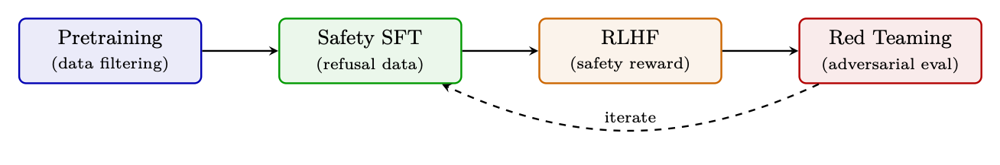<figcaption><span class="hh-tag">图 1.14：</span>安全贯穿每个阶段：预训练中的数据过滤、SFT 中的拒绝示例、RLHF 中安全专用的奖励模型，以及迭代式红队测试。</figcaption></figure>

### 关键安全机制

### 有用性与安全性的权衡

### 评测

<ul><li>安全基准：ToxiGen、RealToxicityPrompts、BBQ（偏见）、CrowS-Pairs</li><li>越狱鲁棒性：GCG 攻击 [443]、多轮越狱、编码式 Prompt</li><li>过度拒绝率：测量良性 Prompt 上的假阳性拒绝（目标 <math alttext="&lt;" display="inline"><semantics><mo>&lt;</mo></semantics></math>5%）</li><li>红队评估：由领域专家（生物安全、网络安全）进行的人工对抗测试</li></ul>

<aside class="hh-next">
<p class="hh-next-label">下一篇</p>
<p class="hh-next-title">第 2 章 面向 LLM 的系统基础</p>
<p class="hh-next-hint">在「智能体 AI 漫游指南」分类下继续阅读。</p>
</aside>

</div>
