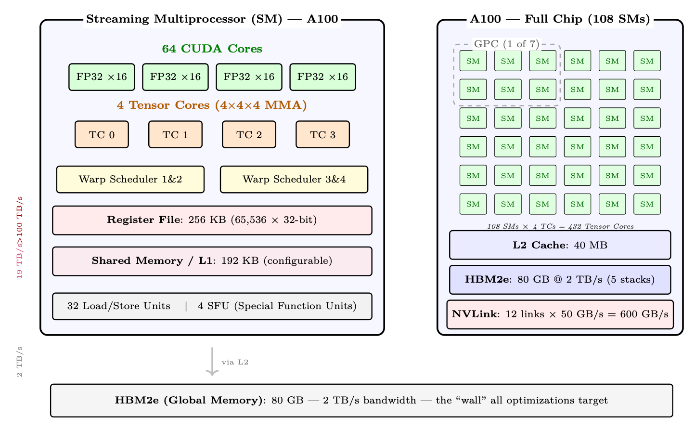
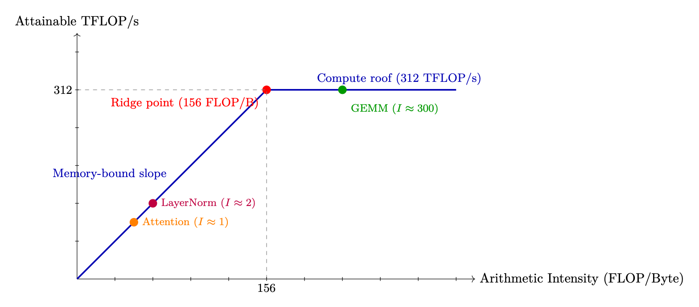
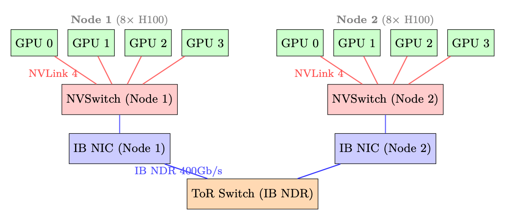
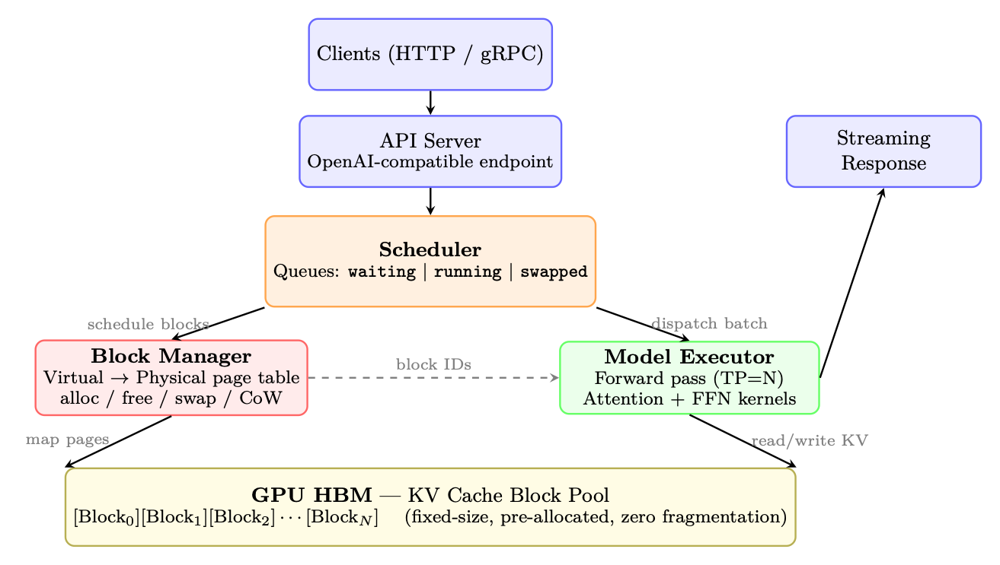

<div class="hh-guide">

<aside class="hh-part">
<p class="hh-part-title">Part I Foundations</p>
</aside>

## GPU Architecture – From Silicon to LLM Training

Modern large language models are trained and served almost exclusively on GPUs (Graphics Processing Units). Understanding GPU architecture is essential for making informed decisions about parallelism strategies, memory management, kernel optimization, and infrastructure sizing. This section provides a comprehensive introduction to GPU hardware as it relates to LLM workloads.

### Why GPUs for Deep Learning?

GPUs and CPUs represent fundamentally different hardware philosophies. Understanding this difference explains why LLM training is 100–1000<math alttext="\times" display="inline"><semantics><mo>×</mo></semantics></math> faster on GPUs.

### NVIDIA GPU Microarchitecture Generations

NVIDIA has released a series of GPU architectures, each bringing key innovations for deep learning:

<div class="hh-table" id="ch2.t1"><table class="ltx_tabular ltx_align_middle"><thead><tr><th class="ltx_align_left"><span>Architecture</span></th><th class="ltx_align_left ltx_align_top"><span class="ltx_align_top"><span><span>Year</span></span></span></th><th class="ltx_align_left ltx_align_top"><span class="ltx_align_top"><span><span>Flagship</span></span></span></th><th class="ltx_align_left ltx_align_top"><span class="ltx_align_top"><span><span>Key Deep Learning Innovation</span></span></span></th></tr></thead><tbody><tr><th class="ltx_align_left">Pascal</th><td class="ltx_align_left ltx_align_top"><span class="ltx_align_top"><span>2016</span></span></td><td class="ltx_align_left ltx_align_top"><span class="ltx_align_top"><span>P100</span></span></td><td class="ltx_align_left ltx_align_top"><span class="ltx_align_top"><span>First HBM GPU; FP16 support; NVLink 1</span></span></td></tr><tr><th class="ltx_align_left">Volta</th><td class="ltx_align_left ltx_align_top"><span class="ltx_align_top"><span>2017</span></span></td><td class="ltx_align_left ltx_align_top"><span class="ltx_align_top"><span>V100</span></span></td><td class="ltx_align_left ltx_align_top"><span class="ltx_align_top"><span><span>Tensor Cores</span> (first generation); mixed-precision training</span></span></td></tr><tr><th class="ltx_align_left">Turing</th><td class="ltx_align_left ltx_align_top"><span class="ltx_align_top"><span>2018</span></span></td><td class="ltx_align_left ltx_align_top"><span class="ltx_align_top"><span>T4</span></span></td><td class="ltx_align_left ltx_align_top"><span class="ltx_align_top"><span>INT8 inference; RT cores (not for ML)</span></span></td></tr><tr><th class="ltx_align_left">Ampere</th><td class="ltx_align_left ltx_align_top"><span class="ltx_align_top"><span>2020</span></span></td><td class="ltx_align_left ltx_align_top"><span class="ltx_align_top"><span>A100</span></span></td><td class="ltx_align_left ltx_align_top"><span class="ltx_align_top"><span>BF16 Tensor Cores; TF32; 3rd-gen NVLink; MIG</span></span></td></tr><tr><th class="ltx_align_left">Hopper</th><td class="ltx_align_left ltx_align_top"><span class="ltx_align_top"><span>2022</span></span></td><td class="ltx_align_left ltx_align_top"><span class="ltx_align_top"><span>H100</span></span></td><td class="ltx_align_left ltx_align_top"><span class="ltx_align_top"><span>FP8 Tensor Cores; TMA; Transformer Engine; NVLink 4</span></span></td></tr><tr><th class="ltx_align_left">Blackwell</th><td class="ltx_align_left ltx_align_top"><span class="ltx_align_top"><span>2024</span></span></td><td class="ltx_align_left ltx_align_top"><span class="ltx_align_top"><span>B200</span></span></td><td class="ltx_align_left ltx_align_top"><span class="ltx_align_top"><span>2nd-gen Transformer Engine; NVLink 5 (1.8 TB/s); FP4</span></span></td></tr></tbody></table><p class="hh-table-caption"><span class="hh-tag">Table 2.1:</span>NVIDIA GPU microarchitecture timeline for deep learning.</p></div>

### Common GPUs for LLM Training and Inference

<div class="hh-table" id="ch2.t2"><table class="ltx_tabular ltx_align_middle"><tbody><tr><td class="ltx_align_left"><span>GPU</span></td><td class="ltx_align_left"><span>Arch</span></td><td class="ltx_align_left"><span>HBM</span></td><td class="ltx_align_left"><span>BF16 TF</span></td><td class="ltx_align_left"><span>HBM BW</span></td><td class="ltx_align_left"><span>NVLink</span></td><td class="ltx_align_left"><span>LLM Role</span></td></tr><tr><td class="ltx_align_left"><span>V100-32GB</span></td><td class="ltx_align_left"><span>Volta</span></td><td class="ltx_align_left"><span>32 GB</span></td><td class="ltx_align_left"><span>125 TF*</span></td><td class="ltx_align_left"><span>900 GB/s</span></td><td class="ltx_align_left"><span>300 GB/s</span></td><td class="ltx_align_left"><span>Legacy; small model fine-tune</span></td></tr><tr><td class="ltx_align_left"><span>A100-40GB</span></td><td class="ltx_align_left"><span>Ampere</span></td><td class="ltx_align_left"><span>40 GB</span></td><td class="ltx_align_left"><span>312 TF</span></td><td class="ltx_align_left"><span>1.5 TB/s</span></td><td class="ltx_align_left"><span>600 GB/s</span></td><td class="ltx_align_left"><span>Budget training/inference</span></td></tr><tr><td class="ltx_align_left"><span>A100-80GB</span></td><td class="ltx_align_left"><span>Ampere</span></td><td class="ltx_align_left"><span>80 GB</span></td><td class="ltx_align_left"><span>312 TF</span></td><td class="ltx_align_left"><span>2.0 TB/s</span></td><td class="ltx_align_left"><span>600 GB/s</span></td><td class="ltx_align_left"><span>Standard RLHF (8–64 for 70B)</span></td></tr><tr><td class="ltx_align_left"><span>H100 SXM</span></td><td class="ltx_align_left"><span>Hopper</span></td><td class="ltx_align_left"><span>80 GB</span></td><td class="ltx_align_left"><span>990 TF</span></td><td class="ltx_align_left"><span>3.35 TB/s</span></td><td class="ltx_align_left"><span>900 GB/s</span></td><td class="ltx_align_left"><span>3<math alttext="\times" display="inline"><semantics><mo>×</mo><span></span></semantics></math> faster training</span></td></tr><tr><td class="ltx_align_left"><span>H200 SXM</span></td><td class="ltx_align_left"><span>Hopper</span></td><td class="ltx_align_left"><span>141 GB</span></td><td class="ltx_align_left"><span>990 TF</span></td><td class="ltx_align_left"><span>4.8 TB/s</span></td><td class="ltx_align_left"><span>900 GB/s</span></td><td class="ltx_align_left"><span>Fits 70B policy+ref on fewer GPUs</span></td></tr><tr><td class="ltx_align_left"><span>B200 SXM</span></td><td class="ltx_align_left"><span>Blackwell</span></td><td class="ltx_align_left"><span>192 GB</span></td><td class="ltx_align_left"><span>2250 TF</span></td><td class="ltx_align_left"><span>8.0 TB/s</span></td><td class="ltx_align_left"><span>1800 GB/s</span></td><td class="ltx_align_left"><span>Next-gen; 2<math alttext="\times" display="inline"><semantics><mo>×</mo><span></span></semantics></math> over H100</span></td></tr><tr><td class="ltx_align_left" colspan="7"><em>AMD and Google alternatives:</em></td></tr><tr><td class="ltx_align_left"><span>MI300X</span></td><td class="ltx_align_left"><span>CDNA3</span></td><td class="ltx_align_left"><span>192 GB</span></td><td class="ltx_align_left"><span>1300 TF</span></td><td class="ltx_align_left"><span>5.3 TB/s</span></td><td class="ltx_align_left"><span>N/A</span></td><td class="ltx_align_left"><span>Most memory; ROCm</span></td></tr><tr><td class="ltx_align_left"><span>TPU v5e</span></td><td class="ltx_align_left"><span>Google</span></td><td class="ltx_align_left"><span>16 GB</span></td><td class="ltx_align_left"><span>197 TF</span></td><td class="ltx_align_left"><span>1.6 TB/s</span></td><td class="ltx_align_left"><span>ICI 1.6 TB/s</span></td><td class="ltx_align_left"><span>Cloud-only; JAX/XLA</span></td></tr></tbody></table><p class="hh-table-caption"><span class="hh-tag">Table 2.2:</span>GPU specifications relevant to LLM workloads. All bandwidth figures are bidirectional.</p></div>

### GPU Internal Architecture – The Streaming Multiprocessor (SM)

A GPU is organized as an array of Streaming Multiprocessors (SMs), each of which is an independent processor with its own register file, shared memory, and execution units. Understanding SMs is key to understanding GPU performance.

<figure id="ch2.f1"><figcaption><span class="hh-tag">Figure 2.1:</span>Left: Internal structure of a single Streaming Multiprocessor (SM) on A100 — 64 FP32 CUDA cores, 4 Tensor Cores, 4 warp schedulers, 256 KB register file, and 192 KB shared memory/L1 cache. Right: The full A100 chip contains 108 SMs with shared 40 MB L2 cache and 80 GB HBM2e. Bandwidth annotations (left margin) show the dramatic drop from registers to HBM.</figcaption></figure>

### GPU Chip Scaling Across Generations

The evolution of NVIDIA’s GPU architectures shows consistent scaling of compute density, on-chip memory, and specialized units for deep learning:

<div class="hh-table" id="ch2.t3"><table class="ltx_tabular ltx_align_middle"><thead><tr><th class="ltx_align_left"><span>Architecture</span></th><th class="ltx_align_left"><span>SMs</span></th><th class="ltx_align_left"><span>TCs/SM</span></th><th class="ltx_align_left"><span>SRAM/SM</span></th><th class="ltx_align_left"><span>L2</span></th><th class="ltx_align_left"><span>Key Change</span></th></tr></thead><tbody><tr><td class="ltx_align_left">Volta (V100)</td><td class="ltx_align_left">80</td><td class="ltx_align_left">8</td><td class="ltx_align_left">128 KB</td><td class="ltx_align_left">6 MB</td><td class="ltx_align_left">Introduced Tensor Cores</td></tr><tr><td class="ltx_align_left">Ampere (A100)</td><td class="ltx_align_left">108</td><td class="ltx_align_left">4</td><td class="ltx_align_left">192 KB</td><td class="ltx_align_left">40 MB</td><td class="ltx_align_left">BF16/TF32; larger L2</td></tr><tr><td class="ltx_align_left">Hopper (H100)</td><td class="ltx_align_left">132</td><td class="ltx_align_left">4</td><td class="ltx_align_left">256 KB</td><td class="ltx_align_left">50 MB</td><td class="ltx_align_left">TMA; FP8; Thread Block Clusters</td></tr><tr><td class="ltx_align_left">Blackwell (B200)</td><td class="ltx_align_left">148</td><td class="ltx_align_left">4</td><td class="ltx_align_left">256 KB</td><td class="ltx_align_left">128 MB</td><td class="ltx_align_left">2<math alttext="\times" display="inline"><semantics><mo>×</mo><span></span></semantics></math> die; FP4; TMEM; NVLink 5</td></tr></tbody></table><p class="hh-table-caption"><span class="hh-tag">Table 2.3:</span>SM-level scaling across NVIDIA architectures.</p></div>

### GPU Memory Hierarchy and Bandwidth

Modern GPU training and inference performance is almost entirely determined by <em>how well you manage data movement</em> across the memory hierarchy. Understanding the hierarchy is not optional – it is the foundation for every optimization technique discussed in later sections.

Each CUDA thread has access to a private register file. Registers are the fastest storage on the chip – reads and writes happen in a single clock cycle with no arbitration. The A100 has 65,536 32-bit registers per SM. Spilling registers to local memory (L1/L2) is a major performance hazard.

Each SM has a combined L1/shared memory pool of 192 KB on A100 (256 KB on H100), with up to 164 KB configurable as shared memory on A100. Shared memory is explicitly managed by the programmer (or by the compiler in newer CUDA versions). Flash Attention, for example, is entirely built around the insight that the attention tile computation fits in SRAM.

The 40 MB L2 on A100 is shared across all 108 SMs. It acts as a staging area between SRAM and HBM. For workloads with good spatial locality (e.g., weight matrices accessed repeatedly across a batch), L2 hit rates can dramatically reduce effective HBM traffic.

HBM is stacked DRAM mounted directly on the GPU package, connected via a wide interposer. The A100 SXM has 80 GB of HBM2e at 2 TB/s. The H100 SXM5 has 80 GB of HBM3 at 3.35 TB/s. This is the primary working memory for model weights, KV caches, activations, and optimizer states.

Data transfer between GPU HBM and CPU DRAM traverses the PCIe bus. PCIe Gen4 <math alttext="\times" display="inline"><semantics><mo>×</mo></semantics></math>16 provides <math alttext="\sim" display="inline"><semantics><mo>∼</mo></semantics></math>32 GB/s per direction (64 GB/s bidirectional); Gen5 doubles this. This is a <math alttext="\sim" display="inline"><semantics><mo>∼</mo></semantics></math>60<math alttext="\times" display="inline"><semantics><mo>×</mo></semantics></math> bandwidth reduction compared to HBM (per-direction). CPU offloading (ZeRO-Infinity, DeepSpeed) exploits this link but must be used carefully to avoid becoming the bottleneck.

NVMe SSDs (e.g., Samsung 990 Pro) reach <math alttext="\sim" display="inline"><semantics><mo>∼</mo></semantics></math>7 GB/s sequential read. ZeRO-Infinity can offload optimizer states to NVMe, but this is only viable when the compute-to-IO ratio is very high (large batch sizes, slow training steps).

### Arithmetic Intensity and the Roofline Model

<figure id="ch2.f2"><figcaption><span class="hh-tag">Figure 2.2:</span>Roofline model for A100 BF16. Attention is deep in the memory-bound regime; large GEMMs (FFN layers) are compute-bound.</figcaption></figure>

### Attention is Memory-Bound; FFN is Compute-Bound

### Tensor Cores

<ul><li>Supported precisions: FP64, TF32, BF16, FP16, INT8, FP8 (H100+).</li><li>Accumulation: Always in FP32 internally, even for BF16 inputs. This prevents catastrophic cancellation during the dot product.</li><li>Requirement: Tensor Cores are most efficient when matrix dimensions are multiples of 8 (BF16) or 16 (FP8). Padding to these multiples is often worthwhile.</li><li>WGMMA (H100): Hopper introduces warpgroup-level MMA instructions that operate on larger tiles (64<math alttext="\times" display="inline"><semantics><mo>×</mo></semantics></math>256<math alttext="\times" display="inline"><semantics><mo>×</mo></semantics></math>16) and can be pipelined with TMA (Tensor Memory Accelerator) data movement.</li></ul>

### Communication Architecture – NVLink, InfiniBand, and PCIe

Distributed LLM training and inference require moving enormous amounts of data between GPUs, nodes, and storage. The communication fabric is often the bottleneck for large-scale training.

PCIe is used for:

<ul><li>CPU <math alttext="\leftrightarrow" display="inline"><semantics><mo stretchy="false">↔</mo></semantics></math> GPU data transfers (model loading, CPU offloading)</li><li>Cross-node GPU communication when NVLink is unavailable (rare, very slow)</li><li>NVMe storage access (via CPU)</li></ul>

NVLink is a point-to-point interconnect between GPUs on the same node. Each link is bidirectional. The H100 SXM5 has 18 NVLink 4 links, each providing 50 GB/s bidirectional, for a total of 900 GB/s.

In DGX H100 systems, all 8 GPUs are connected via NVSwitch – a dedicated switching chip that provides <em>full bisection bandwidth</em>. This means any GPU can communicate with any other GPU at full NVLink speed simultaneously, not just neighbors in a ring.

For communication between nodes (servers), InfiniBand provides high-bandwidth, low-latency networking with direct GPU memory access.

Large GPU clusters use fat-tree network topologies. A 3-level fat-tree with <math alttext="k" display="inline"><semantics><mi>k</mi></semantics></math>-port switches supports <math alttext="k^{3}/4" display="inline"><semantics><mrow><msup><mi>k</mi><mn>3</mn></msup><mo>/</mo><mn>4</mn></mrow></semantics></math> nodes with full bisection bandwidth. For 400Gb/s NDR switches with <math alttext="k=64" display="inline"><semantics><mrow><mi>k</mi><mo>=</mo><mn>64</mn></mrow></semantics></math> ports: <math alttext="64^{3}/4=65{,}536" display="inline"><semantics><mrow><mrow><msup><mn>64</mn><mn>3</mn></msup><mo>/</mo><mn>4</mn></mrow><mo>=</mo><mn>65,536</mn></mrow></semantics></math> nodes.

In practice, clusters use <em>rail-optimized</em> topologies where each GPU in a node connects to a different top-of-rack switch. This ensures that AllReduce operations (which involve all GPUs) use all network links simultaneously, maximizing bandwidth.

Distributed training relies on collective communication primitives. The choice of primitive determines bandwidth requirements and scaling behavior.

The following diagram illustrates a typical two-node GPU cluster topology showing both intra-node (NVLink) and inter-node (InfiniBand) communication paths.

<figure id="ch2.f3"><figcaption><span class="hh-tag">Figure 2.3:</span>Two-node 8-GPU topology. Intra-node: NVLink 4 via NVSwitch (900 GB/s total). Inter-node: InfiniBand NDR 400Gb/s via top-of-rack switch. Each node has 8 IB NICs (one per GPU) for rail-optimized AllReduce.</figcaption></figure>

## vLLM – PagedAttention and High-Throughput Inference

vLLM [196] introduced PagedAttention, which borrows the paging abstraction that operating systems use for RAM and applies it to the GPU’s KV cache. During LLM inference, the <em>KV cache</em> – the stored key and value tensors for all previous tokens – is the dominant memory consumer. Managing it efficiently is the central challenge of high-throughput inference.

### The KV Cache Fragmentation Problem

### PagedAttention – Virtual Memory for KV Caches

PagedAttention (Kwon et al., 2023) borrows the <em>paging</em> abstraction from operating systems. Instead of one contiguous block per sequence, the KV cache is carved into fixed-size pages (blocks), and an indirection table—analogous to a CPU page table—translates each sequence’s logical token positions into scattered physical GPU memory addresses.

### Benefits of PagedAttention

Internal fragmentation is bounded by at most one partially-filled block per sequence (the last block). With block size 16, worst-case waste is 15 tokens per sequence – negligible. External fragmentation is eliminated because blocks are fixed-size and interchangeable.

Blocks are allocated on demand as the sequence grows. No need to know the final sequence length in advance. This is critical for generation, where output length is unknown.

Multiple sequences sharing a common prefix (e.g., a system prompt) can share the <em>same physical blocks</em> for that prefix. The block table simply points multiple sequences to the same physical blocks. When a sequence needs to write to a shared block (diverging from the prefix), a copy-on-write is triggered.

When GPU memory is exhausted, vLLM can <em>preempt</em> a sequence by swapping its KV blocks to CPU DRAM (or simply discarding them and recomputing later). This is only feasible because blocks are self-contained and non-contiguous – swapping a contiguous allocation would require copying the entire buffer.

### Continuous Batching

Traditional batching (“static batching“) waits until <em>all</em> sequences in a batch finish before starting new ones. If one sequence generates 500 tokens and another generates 10, the GPU is idle for 490 steps on the short sequence. This is extremely wasteful.

### Speculative Decoding in vLLM

Speculative decoding uses a small <em>draft model</em> (e.g., 1B parameters) to propose <math alttext="k" display="inline"><semantics><mi>k</mi></semantics></math> candidate tokens quickly, which the large <em>target model</em> verifies in a single forward pass. All tokens up to the first rejection are accepted (expected acceptance: 3–5 tokens per verification step). This yields 2–3<math alttext="\times" display="inline"><semantics><mo>×</mo></semantics></math> speedup for latency-sensitive single-sequence generation without any quality loss.

vLLM integrates speculative decoding with PagedAttention:

<ul><li>Draft tokens are allocated speculative KV blocks</li><li>On rejection, speculative blocks are freed (cheap with paged allocation)</li><li>On acceptance, speculative blocks are promoted to the main sequence</li><li>The block table update is <math alttext="O(k)" display="inline"><semantics><mrow><mi>O</mi><mo>⁡</mo><mrow><mo stretchy="false">(</mo><mi>k</mi><mo stretchy="false">)</mo></mrow></mrow></semantics></math> – just updating a few table entries</li></ul>

### Concrete Memory Savings – 70B Model at Scale

### vLLM: End-to-End System

vLLM wraps PagedAttention inside a full serving stack: continuous batching, prefix caching, speculative decoding, and tensor-parallel model sharding all work together to maximize throughput per GPU dollar.

### Architecture Overview

<figure id="ch2.f4"><figcaption><span class="hh-tag">Figure 2.4:</span>vLLM architecture: Requests flow top-down. The Scheduler manages admission and preemption, the Block Manager handles virtual-to-physical KV cache mapping (like OS page tables), and the Model Executor runs batched inference reading from the pre-allocated block pool in GPU HBM.</figcaption></figure>

### Core Components

<ul><li>API Server: Accepts OpenAI-compatible requests (completions, chat). Tokenizes inputs and creates “sequence groups” (for beam search or multiple samples).</li><li>Scheduler: The brain of vLLM. Maintains three queues:<span class="hh-tag">–</span><code>waiting</code>: New requests not yet started (prefill pending)<span class="hh-tag">–</span><code>running</code>: Actively generating tokens (decode phase)<span class="hh-tag">–</span><code>swapped</code>: Preempted requests whose KV cache was offloaded to CPUEach iteration, the scheduler decides which requests to run based on available GPU memory blocks.</li><li>Block Manager: Implements the virtual memory abstraction for KV caches. Maps logical blocks (per-sequence) to physical blocks (in GPU memory pool). Handles:<span class="hh-tag">–</span>Allocation (new tokens generated <math alttext="\rightarrow" display="inline"><semantics><mo stretchy="false">→</mo></semantics></math> new blocks needed)<span class="hh-tag">–</span>Copy-on-write (for beam search: multiple beams share prefix blocks, copy only on divergence)<span class="hh-tag">–</span>Swap (GPU <math alttext="\leftrightarrow" display="inline"><semantics><mo stretchy="false">↔</mo></semantics></math> CPU migration when preempting/resuming)<span class="hh-tag">–</span>Prefix caching (reuse cached blocks when prompts share common prefixes)</li><li>Model Executor: Runs the actual LLM forward pass. Manages tensor parallelism across GPUs, dispatches attention kernels that read from paged KV cache blocks.</li><li>KV Cache Pool: Pre-allocated GPU memory divided into fixed-size blocks (default: 16 tokens <math alttext="\times" display="inline"><semantics><mo>×</mo></semantics></math> num_heads <math alttext="\times" display="inline"><semantics><mo>×</mo></semantics></math> head_dim <math alttext="\times" display="inline"><semantics><mo>×</mo></semantics></math> 2 bytes per block). No dynamic allocation at runtime <math alttext="\rightarrow" display="inline"><semantics><mo stretchy="false">→</mo></semantics></math> zero fragmentation.</li></ul>

### Request Lifecycle (End-to-End Flow)

<ol><li>Arrival: Client sends prompt. API server tokenizes it, creates a <code>SequenceGroup</code>, places it in the <code>waiting</code> queue.</li><li>Scheduling: At each step, the scheduler runs:<span class="hh-tag">(a)</span>Check if any <code>swapped</code> sequences can be resumed (enough free blocks).<span class="hh-tag">(b)</span>Check if any <code>waiting</code> sequences can start prefill (enough blocks for the full prompt).<span class="hh-tag">(c)</span>Budget remaining blocks across <code>running</code> sequences (need 1 new block per sequence per step if current block is full).<span class="hh-tag">(d)</span>If over budget: preempt lowest-priority running sequences (swap KV to CPU or recompute later).</li><li>Prefill (first iteration for a request): The entire prompt is processed in one forward pass. KV cache is computed for all prompt tokens and stored in allocated blocks. This is compute-bound (large batch of tokens).</li><li>Decode (subsequent iterations): One new token generated per sequence per step. All running sequences are batched together (continuous batching). This is memory-bound (reads full KV cache, generates 1 token).</li><li>Block Allocation: After each decode step, if the last block for a sequence is full, the Block Manager allocates a new physical block and maps it to the next logical block.</li><li>Completion: When a sequence hits EOS or max length, it’s removed from <code>running</code>. Its physical blocks are freed immediately <math alttext="\rightarrow" display="inline"><semantics><mo stretchy="false">→</mo></semantics></math> available for other sequences. Response is streamed back to client.</li></ol>

### Prefix Caching (Automatic Prompt Caching)

When multiple requests share a common prefix (system prompt, few-shot examples):

<ol><li>Hash the token content of each logical block.</li><li>On new request arrival, check if any prefix blocks are already in the cache.</li><li>If hit: skip prefill for those tokens, directly reuse physical KV blocks. Time-to-first-token drops dramatically.</li><li>Eviction: LRU policy. Cached blocks are freed only when memory pressure requires it.</li></ol>

Impact: For chat applications with long system prompts (2K+ tokens shared across all users), prefix caching reduces TTFT by 60–80%.

### Guided (Constrained) Decoding in vLLM

vLLM natively supports constrained decoding (Section 1.12.11 Constrained Decoding (Structured Generation)) through pluggable backends, enabling <em>guaranteed</em> structured output at serving time with minimal performance overhead.

The OpenAI-compatible API accepts constraints via the <code>guided_*</code> parameters or the <code>response_format</code> field:

```python
from openai import OpenAI
client = OpenAI(base_url="http://localhost:8000/v1")

# --- JSON Schema constraint ---
response = client.chat.completions.create(
    model="meta-llama/Llama-3-70B-Instruct",
    messages=[{"role": "user",
               "content": "Extract: name, age, city from: "
                          "'John is 30 and lives in NYC'"}],
    extra_body={
        "guided_json": {
            "type": "object",
            "properties": {
                "name": {"type": "string"},
                "age": {"type": "integer"},
                "city": {"type": "string"}
            },
            "required": ["name", "age", "city"]
        }
    }
)
# Output is guaranteed valid JSON matching the schema

# --- Regex constraint ---
response = client.completions.create(
    model="meta-llama/Llama-3-70B-Instruct",
    prompt="Generate an IPv4 address: ",
    extra_body={
        "guided_regex": r"\d{1,3}\.\d{1,3}\.\d{1,3}\.\d{1,3}"
    }
)

# --- Choice constraint ---
response = client.completions.create(
    model="meta-llama/Llama-3-70B-Instruct",
    prompt="Sentiment: ",
    extra_body={"guided_choice": ["positive", "negative", "neutral"]}
)
```

vLLM delegates mask computation to a backend engine:

<ul><li>XGrammar (default since v0.7): Pushdown-automaton engine supporting JSON schemas, regexes, and arbitrary EBNF grammars. Fastest for complex schemas due to efficient C++ core.</li><li>Outlines[378]: FSM-based; supports JSON and regex. Used as fallback when XGrammar is unavailable.</li></ul>

The mask is applied <em>after</em> the model’s forward pass produces logits and <em>before</em> sampling—adding <math alttext="&lt;" display="inline"><semantics><mo>&lt;</mo></semantics></math>1 ms per step in practice, since the FSM/PDA state transition and precomputed index lookup are <math alttext="O(1)" display="inline"><semantics><mrow><mi>O</mi><mo>⁡</mo><mrow><mo stretchy="false">(</mo><mn>1</mn><mo stretchy="false">)</mo></mrow></mrow></semantics></math>.

Because the constraint only masks logits (no recomputation of attention or FFN), throughput loss is negligible (<math alttext="&lt;" display="inline"><semantics><mo>&lt;</mo></semantics></math>2% in benchmarks). The main cost is <em>compilation</em> of the schema into an FSM/PDA index, which takes 0.5–5 s depending on schema complexity. vLLM caches compiled schemas across requests, so this cost is paid once per unique schema.

<div class="hh-table" id="ch2.t4"><table class="ltx_tabular ltx_align_middle"><thead><tr><th class="ltx_align_left"><span>Metric</span></th><th class="ltx_align_left ltx_align_top"><span class="ltx_align_top"><span><span>vLLM</span></span></span></th><th class="ltx_align_left ltx_align_top"><span class="ltx_align_top"><span><span>HF Generate</span></span></span></th><th class="ltx_align_left ltx_align_top"><span class="ltx_align_top"><span><span>Why</span></span></span></th></tr></thead><tbody><tr><th class="ltx_align_left">Throughput (tok/s)</th><td class="ltx_align_left ltx_align_top"><span class="ltx_align_top"><span>2,500–4,000</span></span></td><td class="ltx_align_left ltx_align_top"><span class="ltx_align_top"><span>300–600</span></span></td><td class="ltx_align_left ltx_align_top"><span class="ltx_align_top"><span>Continuous batching + PagedAttention</span></span></td></tr><tr><th class="ltx_align_left">Memory utilization</th><td class="ltx_align_left ltx_align_top"><span class="ltx_align_top"><span>90–95%</span></span></td><td class="ltx_align_left ltx_align_top"><span class="ltx_align_top"><span>50–60%</span></span></td><td class="ltx_align_left ltx_align_top"><span class="ltx_align_top"><span>Zero fragmentation, dynamic block alloc</span></span></td></tr><tr><th class="ltx_align_left">Max concurrent seqs</th><td class="ltx_align_left ltx_align_top"><span class="ltx_align_top"><span>200–500</span></span></td><td class="ltx_align_left ltx_align_top"><span class="ltx_align_top"><span>16–32</span></span></td><td class="ltx_align_left ltx_align_top"><span class="ltx_align_top"><span>Paged KV eliminates per-seq reservation</span></span></td></tr><tr><th class="ltx_align_left">Time-to-first-token</th><td class="ltx_align_left ltx_align_top"><span class="ltx_align_top"><span>100–300ms</span></span></td><td class="ltx_align_left ltx_align_top"><span class="ltx_align_top"><span>500–2000ms</span></span></td><td class="ltx_align_left ltx_align_top"><span class="ltx_align_top"><span>Prefix caching for repeated system prompts</span></span></td></tr></tbody></table><p class="hh-table-caption"><span class="hh-tag">Table 2.4:</span>vLLM performance vs. alternatives (70B model, A100 <math alttext="\times" display="inline"><semantics><mo>×</mo></semantics></math> 4, TP=4).</p></div>

Dynamo [270] is NVIDIA’s open-source orchestration layer that sits <em>above</em> individual inference engines (SGLang, TensorRT-LLM, vLLM) and turns them into a coordinated multi-node serving system. Key capabilities include disaggregated serving (separating prefill and decode phases across specialized node pools), intelligent request routing based on KV cache locality, multi-tier KV caching (GPU <math alttext="\to" display="inline"><semantics><mo stretchy="false">→</mo></semantics></math> CPU <math alttext="\to" display="inline"><semantics><mo stretchy="false">→</mo></semantics></math> SSD), and automatic scaling. It addresses the gap between single-GPU inference optimization (covered by vLLM) and production serving at datacenter scale.

<aside class="hh-next">
<p class="hh-next-label">下一篇</p>
<p class="hh-next-title">The Hitchhiker's Guide to Agentic AI · Chapter 3 Introduction to Reinforcement Learning</p>
<p class="hh-next-hint">在「智能体 AI 漫游指南」分类下继续阅读。</p>
</aside>

</div>
