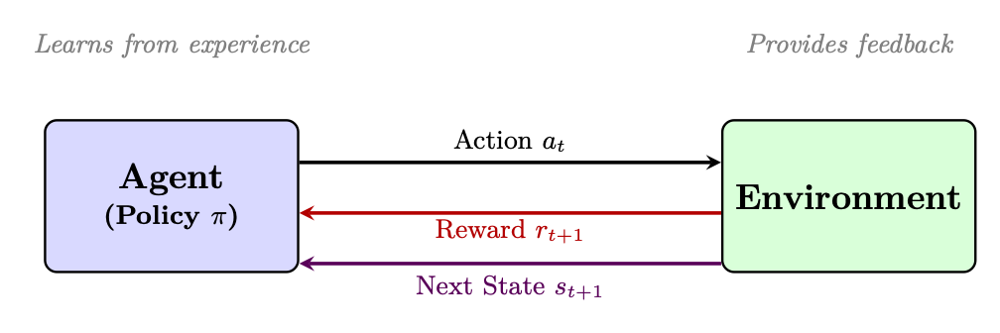
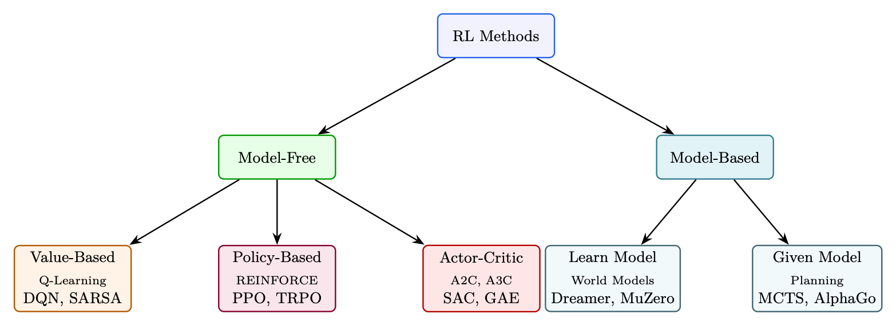
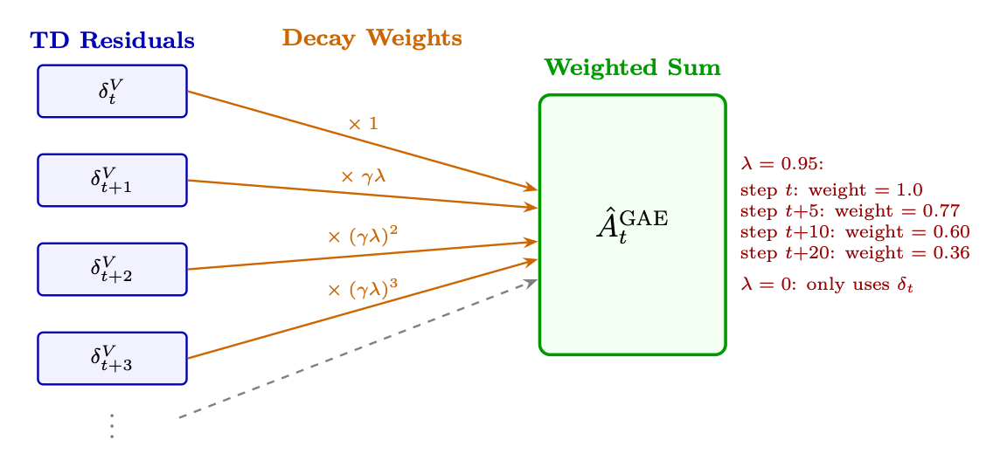
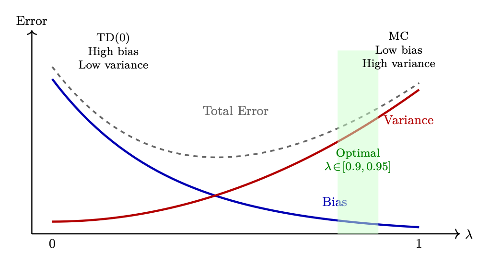

<div class="hh-guide">

<aside class="hh-part">
<p class="hh-part-title">第 I 部分 基础</p>
</aside>

强化学习（Reinforcement Learning，RL）是一种范式：智能体（Agent）通过与环境（environment）交互、接收作为反馈的奖励（reward），并优化其策略（policy）以最大化长期累积奖励来学习做出序贯决策[346]。与监督学习（需要带标签的输入-输出对）不同，RL 通过<em>试错</em>来发现最优行为。

<figure id="ch3.f1"><figcaption><span class="hh-tag">图 3.1：</span>强化学习概览：智能体与环境交互，接收奖励作为反馈，并通过试错更新其策略。与从带标签数据对中学习的监督学习不同，RL 通过经验最大化奖励来学习应当做什么。</figcaption></figure>

## 马尔可夫决策过程（Markov Decision Process，MDP）

MDP 是一个五元组<math alttext="(S,A,P,R,\gamma)" display="inline"><semantics><mrow><mo stretchy="false">(</mo><mi>S</mi><mo>,</mo><mi>A</mi><mo>,</mo><mi>P</mi><mo>,</mo><mi>R</mi><mo>,</mo><mi>γ</mi><mo stretchy="false">)</mo></mrow></semantics></math>：

<ul><li><math alttext="S" display="inline"><semantics><mi>S</mi></semantics></math>：状态空间——环境所有可能的配置</li><li><math alttext="A" display="inline"><semantics><mi>A</mi></semantics></math>：动作空间——智能体可用的所有动作</li><li><math alttext="P(s^{\prime}|s,a)" display="inline"><semantics><mrow><mi>P</mi><mo>⁡</mo><mrow><mo stretchy="false">(</mo><msup><mi>s</mi><mo>′</mo></msup><mo lspace="0em" rspace="0em">|</mo><mrow><mi>s</mi><mo>,</mo><mi>a</mi></mrow><mo stretchy="false">)</mo></mrow></mrow></semantics></math>：转移函数——在状态 <math alttext="s" display="inline"><semantics><mi>s</mi></semantics></math> 下采取动作 <math alttext="a" display="inline"><semantics><mi>a</mi></semantics></math> 后到达状态 <math alttext="s^{\prime}" display="inline"><semantics><msup><mi>s</mi><mo>′</mo></msup></semantics></math> 的概率</li><li><math alttext="R(s,a,s^{\prime})" display="inline"><semantics><mrow><mi>R</mi><mo>⁡</mo><mrow><mo stretchy="false">(</mo><mi>s</mi><mo>,</mo><mi>a</mi><mo>,</mo><msup><mi>s</mi><mo>′</mo></msup><mo stretchy="false">)</mo></mrow></mrow></semantics></math>：奖励函数——一次状态转移获得的即时标量反馈</li><li><math alttext="\gamma\in[0,1]" display="inline"><semantics><mrow><mi>γ</mi><mo>∈</mo><mrow><mo stretchy="false">[</mo><mrow><mn>0</mn><mo>,</mo><mn>1</mn></mrow><mo stretchy="false">]</mo></mrow></mrow></semantics></math>：折扣因子——未来奖励相对于即时奖励的权重</li></ul>

马尔可夫性质：未来只依赖于当前状态，而不依赖于历史：

<div class="hh-equation" id="ch3.ex1"><math alttext="P(s_{t+1}|s_{t},a_{t},s_{t-1},a_{t-1},\ldots)=P(s_{t+1}|s_{t},a_{t})" display="block"><semantics><mrow><mrow><mi>P</mi><mo>⁡</mo><mrow><mo stretchy="false">(</mo><msub><mi>s</mi><mrow><mi>t</mi><mo>+</mo><mn>1</mn></mrow></msub><mo lspace="0em" rspace="0em">|</mo><mrow><msub><mi>s</mi><mi>t</mi></msub><mo>,</mo><msub><mi>a</mi><mi>t</mi></msub><mo>,</mo><msub><mi>s</mi><mrow><mi>t</mi><mo>−</mo><mn>1</mn></mrow></msub><mo>,</mo><msub><mi>a</mi><mrow><mi>t</mi><mo>−</mo><mn>1</mn></mrow></msub><mo>,</mo><mi mathvariant="normal">…</mi></mrow><mo stretchy="false">)</mo></mrow></mrow><mo>=</mo><mrow><mi>P</mi><mo>⁡</mo><mrow><mo stretchy="false">(</mo><msub><mi>s</mi><mrow><mi>t</mi><mo>+</mo><mn>1</mn></mrow></msub><mo lspace="0em" rspace="0em">|</mo><mrow><msub><mi>s</mi><mi>t</mi></msub><mo>,</mo><msub><mi>a</mi><mi>t</mi></msub></mrow><mo stretchy="false">)</mo></mrow></mrow></mrow></semantics></math></div>

这一性质使问题变得可处理。

## 核心概念与定义

策略（Policy）<math alttext="\pi(a|s)" display="inline"><semantics><mrow><mi>π</mi><mo>⁡</mo><mrow><mo stretchy="false">(</mo><mi>a</mi><mo lspace="0em" rspace="0em">|</mo><mi>s</mi><mo stretchy="false">)</mo></mrow></mrow></semantics></math>：从状态到动作概率的映射。确定性策略：<math alttext="a=\pi(s)" display="inline"><semantics><mrow><mi>a</mi><mo>=</mo><mrow><mi>π</mi><mo>⁡</mo><mrow><mo stretchy="false">(</mo><mi>s</mi><mo stretchy="false">)</mo></mrow></mrow></mrow></semantics></math>。随机性策略：<math alttext="a\sim\pi(\cdot|s)" display="inline"><semantics><mrow><mi>a</mi><mo>∼</mo><mi>π</mi><mrow><mo stretchy="false">(</mo><mo lspace="0em" rspace="0em">⋅</mo><mo fence="false" rspace="0.167em" stretchy="false">|</mo><mi>s</mi><mo stretchy="false">)</mo></mrow></mrow></semantics></math>。

回报（Return）（累积折扣奖励）：

<div class="hh-equation" id="ch3.e1"><math alttext="G_{t}=\sum_{k=0}^{\infty}\gamma^{k}r_{t+k}=r_{t}+\gamma r_{t+1}+\gamma^{2}r_{t+2}+\cdots" display="block"><semantics><mrow><msub><mi>G</mi><mi>t</mi></msub><mo rspace="0.111em">=</mo><mrow><munderover><mo movablelimits="false">∑</mo><mrow><mi>k</mi><mo>=</mo><mn>0</mn></mrow><mi mathvariant="normal">∞</mi></munderover><mrow><msup><mi>γ</mi><mi>k</mi></msup><mo lspace="0em" rspace="0em">​</mo><msub><mi>r</mi><mrow><mi>t</mi><mo>+</mo><mi>k</mi></mrow></msub></mrow></mrow><mo>=</mo><mrow><msub><mi>r</mi><mi>t</mi></msub><mo>+</mo><mrow><mi>γ</mi><mo lspace="0em" rspace="0em">​</mo><msub><mi>r</mi><mrow><mi>t</mi><mo>+</mo><mn>1</mn></mrow></msub></mrow><mo>+</mo><mrow><msup><mi>γ</mi><mn>2</mn></msup><mo lspace="0em" rspace="0em">​</mo><msub><mi>r</mi><mrow><mi>t</mi><mo>+</mo><mn>2</mn></mrow></msub></mrow><mo>+</mo><mo lspace="0em">⋯</mo></mrow></mrow></semantics></math><span class="hh-equation-number">(3.1)</span></div>

价值函数（在策略 <math alttext="\pi" display="inline"><semantics><mi>π</mi></semantics></math> 下从状态 <math alttext="s" display="inline"><semantics><mi>s</mi></semantics></math> 出发的期望回报）：

<div class="hh-equation" id="ch3.e2"><math alttext="V^{\pi}(s)=\mathbb{E}_{\pi}\left[G_{t}\mid s_{t}=s\right]=\mathbb{E}_{\pi}\left[\sum_{k=0}^{\infty}\gamma^{k}r_{t+k}\mid s_{t}=s\right]" display="block"><semantics><mrow><mrow><msup><mi>V</mi><mi>π</mi></msup><mo lspace="0em" rspace="0em">​</mo><mrow><mo stretchy="false">(</mo><mi>s</mi><mo stretchy="false">)</mo></mrow></mrow><mo>=</mo><mrow><msub><mi>𝔼</mi><mi>π</mi></msub><mo lspace="0em" rspace="0em">​</mo><mrow><mo>[</mo><mrow><msub><mi>G</mi><mi>t</mi></msub><mo lspace="0em" rspace="0.167em">∣</mo><mrow><msub><mi>s</mi><mi>t</mi></msub><mo>=</mo><mi>s</mi></mrow></mrow><mo>]</mo></mrow></mrow><mo>=</mo><mrow><msub><mi>𝔼</mi><mi>π</mi></msub><mo lspace="0em" rspace="0em">​</mo><mrow><mo>[</mo><mrow><mrow><munderover><mo lspace="0em" movablelimits="false">∑</mo><mrow><mi>k</mi><mo>=</mo><mn>0</mn></mrow><mi mathvariant="normal">∞</mi></munderover><mrow><msup><mi>γ</mi><mi>k</mi></msup><mo lspace="0em" rspace="0em">​</mo><msub><mi>r</mi><mrow><mi>t</mi><mo>+</mo><mi>k</mi></mrow></msub></mrow></mrow><mo lspace="0em" rspace="0.167em">∣</mo><mrow><msub><mi>s</mi><mi>t</mi></msub><mo>=</mo><mi>s</mi></mrow></mrow><mo>]</mo></mrow></mrow></mrow></semantics></math><span class="hh-equation-number">(3.2)</span></div>

动作价值函数（从状态 <math alttext="s" display="inline"><semantics><mi>s</mi></semantics></math> 出发、采取动作 <math alttext="a" display="inline"><semantics><mi>a</mi></semantics></math>、其后遵循 <math alttext="\pi" display="inline"><semantics><mi>π</mi></semantics></math> 的期望回报）：

<div class="hh-equation" id="ch3.e3"><math alttext="Q^{\pi}(s,a)=\mathbb{E}_{\pi}\left[G_{t}\mid s_{t}=s,a_{t}=a\right]" display="block"><semantics><mrow><msup><mi>Q</mi><mi>π</mi></msup><mrow><mo stretchy="false">(</mo><mi>s</mi><mo>,</mo><mi>a</mi><mo stretchy="false">)</mo></mrow><mo>=</mo><msub><mi>𝔼</mi><mi>π</mi></msub><mrow><mo>[</mo><msub><mi>G</mi><mi>t</mi></msub><mo lspace="0em" rspace="0.167em">∣</mo><msub><mi>s</mi><mi>t</mi></msub><mo>=</mo><mi>s</mi><mo>,</mo><msub><mi>a</mi><mi>t</mi></msub><mo>=</mo><mi>a</mi><mo>]</mo></mrow></mrow></semantics></math><span class="hh-equation-number">(3.3)</span></div>

优势函数（动作 <math alttext="a" display="inline"><semantics><mi>a</mi></semantics></math> 相对于平均水平好多少）：

<div class="hh-equation" id="ch3.e4"><math alttext="A^{\pi}(s,a)=Q^{\pi}(s,a)-V^{\pi}(s)" display="block"><semantics><mrow><mrow><msup><mi>A</mi><mi>π</mi></msup><mo lspace="0em" rspace="0em">​</mo><mrow><mo stretchy="false">(</mo><mi>s</mi><mo>,</mo><mi>a</mi><mo stretchy="false">)</mo></mrow></mrow><mo>=</mo><mrow><mrow><msup><mi>Q</mi><mi>π</mi></msup><mo lspace="0em" rspace="0em">​</mo><mrow><mo stretchy="false">(</mo><mi>s</mi><mo>,</mo><mi>a</mi><mo stretchy="false">)</mo></mrow></mrow><mo>−</mo><mrow><msup><mi>V</mi><mi>π</mi></msup><mo lspace="0em" rspace="0em">​</mo><mrow><mo stretchy="false">(</mo><mi>s</mi><mo stretchy="false">)</mo></mrow></mrow></mrow></mrow></semantics></math><span class="hh-equation-number">(3.4)</span></div>

贝尔曼方程（递归关系）：


## 强化学习方法的分类

强化学习算法可以从多个维度进行分类。理解这一分类体系有助于针对特定问题选择合适的方法。

<figure id="ch3.s3.fig1"></figure>

## 时序差分（Temporal Difference，TD）学习

TD 学习[347]采用自举（bootstrap）思想——它使用其他价值估计来更新价值估计，无需等待完整 episode 结束。

### 理解 TD 误差：以「惊讶」作为学习信号

TD 误差衡量智能体对未来奖励的当前估计与采取一步后新估计之间的差异。简单来说，就是智能体原本<em>以为</em>会发生的事，与实际<em>发生</em>的事加上对未来的新预期之间的差。它代表了智能体的「惊讶」。

### TD 误差公式

<div class="hh-equation" id="ch3.e9"><math alttext="\boxed{\delta_{t}=R_{t+1}+\gamma V(S_{t+1})-V(S_{t})}" display="block"><semantics><menclose notation="box"><mrow><msub><mi>δ</mi><mi>t</mi></msub><mo>=</mo><mrow><mrow><msub><mi>R</mi><mrow><mi>t</mi><mo>+</mo><mn>1</mn></mrow></msub><mo>+</mo><mrow><mi>γ</mi><mo lspace="0em" rspace="0em">​</mo><mi>V</mi><mo lspace="0em" rspace="0em">​</mo><mrow><mo stretchy="false">(</mo><msub><mi>S</mi><mrow><mi>t</mi><mo>+</mo><mn>1</mn></mrow></msub><mo stretchy="false">)</mo></mrow></mrow></mrow><mo>−</mo><mrow><mi>V</mi><mo>⁡</mo><mrow><mo stretchy="false">(</mo><msub><mi>S</mi><mi>t</mi></msub><mo stretchy="false">)</mo></mrow></mrow></mrow></mrow></menclose></semantics></math><span class="hh-equation-number">(3.9)</span></div>

<ul><li><math alttext="R_{t+1}" display="inline"><semantics><msub><mi>R</mi><mrow><mi>t</mi><mo>+</mo><mn>1</mn></mrow></msub></semantics></math>：采取动作后收到的即时奖励。</li><li><math alttext="\gamma V(S_{t+1})" display="inline"><semantics><mrow><mi>γ</mi><mo lspace="0em" rspace="0em">​</mo><mi>V</mi><mo lspace="0em" rspace="0em">​</mo><mrow><mo stretchy="false">(</mo><msub><mi>S</mi><mrow><mi>t</mi><mo>+</mo><mn>1</mn></mrow></msub><mo stretchy="false">)</mo></mrow></mrow></semantics></math>：下一个状态的估计折扣价值（智能体预期从下一状态开始往后能获得的回报，按折扣因子 <math alttext="\gamma" display="inline"><semantics><mi>γ</mi></semantics></math> 缩放）。</li><li><math alttext="V(S_{t})" display="inline"><semantics><mrow><mi>V</mi><mo>⁡</mo><mrow><mo stretchy="false">(</mo><msub><mi>S</mi><mi>t</mi></msub><mo stretchy="false">)</mo></mrow></mrow></semantics></math>：当前状态价值的原始估计。</li></ul>

合并后的项 <math alttext="(R_{t+1}+\gamma V(S_{t+1}))" display="inline"><semantics><mrow><mo stretchy="false">(</mo><mrow><msub><mi>R</mi><mrow><mi>t</mi><mo>+</mo><mn>1</mn></mrow></msub><mo>+</mo><mrow><mi>γ</mi><mo lspace="0em" rspace="0em">​</mo><mi>V</mi><mo lspace="0em" rspace="0em">​</mo><mrow><mo stretchy="false">(</mo><msub><mi>S</mi><mrow><mi>t</mi><mo>+</mo><mn>1</mn></mrow></msub><mo stretchy="false">)</mo></mrow></mrow></mrow><mo stretchy="false">)</mo></mrow></semantics></math> 称为 TD 目标。因此：

<div class="hh-equation" id="ch3.e10"><math alttext="\text{TD Error}=\text{TD Target}-\text{Old Estimate}" display="block"><semantics><mrow><mtext>TD Error</mtext><mo>=</mo><mrow><mtext>TD Target</mtext><mo>−</mo><mtext>Old Estimate</mtext></mrow></mrow></semantics></math><span class="hh-equation-number">(3.10)</span></div>

### 智能体如何使用 TD 误差

智能体调整其价值函数，使 TD 误差趋向于零：

<div class="hh-equation" id="ch3.e11"><math alttext="\boxed{V(S_{t})\leftarrow V(S_{t})+\alpha\cdot\delta_{t}}" display="block"><semantics><menclose notation="box"><mrow><mrow><mi>V</mi><mo>⁡</mo><mrow><mo stretchy="false">(</mo><msub><mi>S</mi><mi>t</mi></msub><mo stretchy="false">)</mo></mrow></mrow><mo stretchy="false">←</mo><mrow><mrow><mi>V</mi><mo>⁡</mo><mrow><mo stretchy="false">(</mo><msub><mi>S</mi><mi>t</mi></msub><mo stretchy="false">)</mo></mrow></mrow><mo>+</mo><mrow><mi>α</mi><mo lspace="0.222em" rspace="0.222em">⋅</mo><msub><mi>δ</mi><mi>t</mi></msub></mrow></mrow></mrow></menclose></semantics></math><span class="hh-equation-number">(3.11)</span></div>

<ul><li>如果 <math alttext="\delta_{t}&gt;0" display="inline"><semantics><mrow><msub><mi>δ</mi><mi>t</mi></msub><mo>&gt;</mo><mn>0</mn></mrow></semantics></math>：结果好于预测 <math alttext="\rightarrow" display="inline"><semantics><mo stretchy="false">→</mo></semantics></math> 提高 <math alttext="V(S_{t})" display="inline"><semantics><mrow><mi>V</mi><mo>⁡</mo><mrow><mo stretchy="false">(</mo><msub><mi>S</mi><mi>t</mi></msub><mo stretchy="false">)</mo></mrow></mrow></semantics></math>，使智能体趋向该状态。</li><li>如果 <math alttext="\delta_{t}&lt;0" display="inline"><semantics><mrow><msub><mi>δ</mi><mi>t</mi></msub><mo>&lt;</mo><mn>0</mn></mrow></semantics></math>：结果差于预测 <math alttext="\rightarrow" display="inline"><semantics><mo stretchy="false">→</mo></semantics></math> 降低 <math alttext="V(S_{t})" display="inline"><semantics><mrow><mi>V</mi><mo>⁡</mo><mrow><mo stretchy="false">(</mo><msub><mi>S</mi><mi>t</mi></msub><mo stretchy="false">)</mo></mrow></mrow></semantics></math>，使智能体避开该状态。</li><li>如果 <math alttext="\delta_{t}=0" display="inline"><semantics><mrow><msub><mi>δ</mi><mi>t</mi></msub><mo>=</mo><mn>0</mn></mrow></semantics></math>：预测完全准确 <math alttext="\rightarrow" display="inline"><semantics><mo stretchy="false">→</mo></semantics></math> 无需更新（收敛）。</li></ul>

TD 目标：<math alttext="y_{t}=r_{t}+\gamma V(s_{t+1})" display="inline"><semantics><mrow><msub><mi>y</mi><mi>t</mi></msub><mo>=</mo><mrow><msub><mi>r</mi><mi>t</mi></msub><mo>+</mo><mrow><mi>γ</mi><mo lspace="0em" rspace="0em">​</mo><mi>V</mi><mo lspace="0em" rspace="0em">​</mo><mrow><mo stretchy="false">(</mo><msub><mi>s</mi><mrow><mi>t</mi><mo>+</mo><mn>1</mn></mrow></msub><mo stretchy="false">)</mo></mrow></mrow></mrow></mrow></semantics></math>——我们向其逼近的「更好估计」。

多步 TD（n 步回报）：

<div class="hh-equation" id="ch3.e12"><math alttext="G_{t}^{(n)}=r_{t}+\gamma r_{t+1}+\cdots+\gamma^{n-1}r_{t+n-1}+\gamma^{n}V(s_{t+n})" display="block"><semantics><mrow><msubsup><mi>G</mi><mi>t</mi><mrow><mo stretchy="false">(</mo><mi>n</mi><mo stretchy="false">)</mo></mrow></msubsup><mo>=</mo><mrow><msub><mi>r</mi><mi>t</mi></msub><mo>+</mo><mrow><mi>γ</mi><mo lspace="0em" rspace="0em">​</mo><msub><mi>r</mi><mrow><mi>t</mi><mo>+</mo><mn>1</mn></mrow></msub></mrow><mo>+</mo><mo lspace="0em" rspace="0em">⋯</mo><mo>+</mo><mrow><msup><mi>γ</mi><mrow><mi>n</mi><mo>−</mo><mn>1</mn></mrow></msup><mo lspace="0em" rspace="0em">​</mo><msub><mi>r</mi><mrow><mrow><mi>t</mi><mo>+</mo><mi>n</mi></mrow><mo>−</mo><mn>1</mn></mrow></msub></mrow><mo>+</mo><mrow><msup><mi>γ</mi><mi>n</mi></msup><mo lspace="0em" rspace="0em">​</mo><mi>V</mi><mo lspace="0em" rspace="0em">​</mo><mrow><mo stretchy="false">(</mo><msub><mi>s</mi><mrow><mi>t</mi><mo>+</mo><mi>n</mi></mrow></msub><mo stretchy="false">)</mo></mrow></mrow></mrow></mrow></semantics></math><span class="hh-equation-number">(3.12)</span></div>

## Q-Learning

Q-Learning[373] 是基础的 off-policy、基于价值算法。它直接学习最优 <math alttext="Q^{*}" display="inline"><semantics><msup><mi>Q</mi><mo>∗</mo></msup></semantics></math>，而不管当前遵循的是何种策略。

更新规则：

<div class="hh-equation" id="ch3.e13"><math alttext="\boxed{Q(s_{t},a_{t})\leftarrow Q(s_{t},a_{t})+\alpha\left[r_{t}+\gamma\max_{a^{\prime}}Q(s_{t+1},a^{\prime})-Q(s_{t},a_{t})\right]}" display="block"><semantics><menclose notation="box"><mrow><mrow><mi>Q</mi><mo>⁡</mo><mrow><mo stretchy="false">(</mo><msub><mi>s</mi><mi>t</mi></msub><mo>,</mo><msub><mi>a</mi><mi>t</mi></msub><mo stretchy="false">)</mo></mrow></mrow><mo stretchy="false">←</mo><mrow><mrow><mi>Q</mi><mo>⁡</mo><mrow><mo stretchy="false">(</mo><msub><mi>s</mi><mi>t</mi></msub><mo>,</mo><msub><mi>a</mi><mi>t</mi></msub><mo stretchy="false">)</mo></mrow></mrow><mo>+</mo><mrow><mi>α</mi><mo>⁡</mo><mrow><mo>[</mo><mrow><mrow><msub><mi>r</mi><mi>t</mi></msub><mo>+</mo><mrow><mi>γ</mi><mo lspace="0.167em" rspace="0em">​</mo><mrow><munder><mi>max</mi><msup><mi>a</mi><mo>′</mo></msup></munder><mo lspace="0.167em">⁡</mo><mrow><mi>Q</mi><mo>⁡</mo><mrow><mo stretchy="false">(</mo><msub><mi>s</mi><mrow><mi>t</mi><mo>+</mo><mn>1</mn></mrow></msub><mo>,</mo><msup><mi>a</mi><mo>′</mo></msup><mo stretchy="false">)</mo></mrow></mrow></mrow></mrow></mrow><mo>−</mo><mrow><mi>Q</mi><mo>⁡</mo><mrow><mo stretchy="false">(</mo><msub><mi>s</mi><mi>t</mi></msub><mo>,</mo><msub><mi>a</mi><mi>t</mi></msub><mo stretchy="false">)</mo></mrow></mrow></mrow><mo>]</mo></mrow></mrow></mrow></mrow></menclose></semantics></math><span class="hh-equation-number">(3.13)</span></div>

SARSA[311]（on-policy 的替代方案）：使用<em>实际采取</em>的动作，而非取最大值：

<div class="hh-equation" id="ch3.e14"><math alttext="Q(s_{t},a_{t})\leftarrow Q(s_{t},a_{t})+\alpha\left[r_{t}+\gamma Q(s_{t+1},a_{t+1})-Q(s_{t},a_{t})\right]" display="block"><semantics><mrow><mrow><mi>Q</mi><mo>⁡</mo><mrow><mo stretchy="false">(</mo><msub><mi>s</mi><mi>t</mi></msub><mo>,</mo><msub><mi>a</mi><mi>t</mi></msub><mo stretchy="false">)</mo></mrow></mrow><mo stretchy="false">←</mo><mrow><mrow><mi>Q</mi><mo>⁡</mo><mrow><mo stretchy="false">(</mo><msub><mi>s</mi><mi>t</mi></msub><mo>,</mo><msub><mi>a</mi><mi>t</mi></msub><mo stretchy="false">)</mo></mrow></mrow><mo>+</mo><mrow><mi>α</mi><mo>⁡</mo><mrow><mo>[</mo><mrow><mrow><msub><mi>r</mi><mi>t</mi></msub><mo>+</mo><mrow><mi>γ</mi><mo lspace="0em" rspace="0em">​</mo><mi>Q</mi><mo lspace="0em" rspace="0em">​</mo><mrow><mo stretchy="false">(</mo><msub><mi>s</mi><mrow><mi>t</mi><mo>+</mo><mn>1</mn></mrow></msub><mo>,</mo><msub><mi>a</mi><mrow><mi>t</mi><mo>+</mo><mn>1</mn></mrow></msub><mo stretchy="false">)</mo></mrow></mrow></mrow><mo>−</mo><mrow><mi>Q</mi><mo>⁡</mo><mrow><mo stretchy="false">(</mo><msub><mi>s</mi><mi>t</mi></msub><mo>,</mo><msub><mi>a</mi><mi>t</mi></msub><mo stretchy="false">)</mo></mrow></mrow></mrow><mo>]</mo></mrow></mrow></mrow></mrow></semantics></math><span class="hh-equation-number">(3.14)</span></div>

深度 Q 网络（DQN）[259]：用神经网络 <math alttext="Q_{\theta}(s,a)" display="inline"><semantics><mrow><msub><mi>Q</mi><mi>θ</mi></msub><mo lspace="0em" rspace="0em">​</mo><mrow><mo stretchy="false">(</mo><mi>s</mi><mo>,</mo><mi>a</mi><mo stretchy="false">)</mo></mrow></mrow></semantics></math> 替换表格型 <math alttext="Q(s,a)" display="inline"><semantics><mrow><mi>Q</mi><mo>⁡</mo><mrow><mo stretchy="false">(</mo><mi>s</mi><mo>,</mo><mi>a</mi><mo stretchy="false">)</mo></mrow></mrow></semantics></math>。关键创新：经验回放缓冲区（off-policy 数据复用）、目标网络（稳定性）、<math alttext="\epsilon" display="inline"><semantics><mi>ϵ</mi></semantics></math>-greedy 探索。

DQN 损失函数：网络在从回放缓冲区采样的 mini-batch 上最小化 TD 误差的均方值：

<div class="hh-equation" id="ch3.e15"><math alttext="\boxed{\mathcal{L}(\theta)=\mathbb{E}_{(s,a,r,s^{\prime})\sim\mathcal{B}}\!\left[\left(r+\gamma\max_{a^{\prime}}Q_{\bar{\theta}}(s^{\prime},a^{\prime})-Q_{\theta}(s,a)\right)^{2}\right]}" display="block"><semantics><menclose notation="box"><mrow><mrow><mi>ℒ</mi><mo>⁡</mo><mrow><mo stretchy="false">(</mo><mi>θ</mi><mo stretchy="false">)</mo></mrow></mrow><mo>=</mo><mrow><msub><mi>𝔼</mi><mrow><mrow><mo stretchy="false">(</mo><mi>s</mi><mo>,</mo><mi>a</mi><mo>,</mo><mi>r</mi><mo>,</mo><msup><mi>s</mi><mo>′</mo></msup><mo stretchy="false">)</mo></mrow><mo>∼</mo><mi>ℬ</mi></mrow></msub><mo lspace="0em" rspace="0em">​</mo><mrow><mo>[</mo><msup><mrow><mo>(</mo><mrow><mrow><mi>r</mi><mo>+</mo><mrow><mi>γ</mi><mo lspace="0.167em" rspace="0em">​</mo><munder><mi>max</mi><msup><mi>a</mi><mo>′</mo></msup></munder><mo lspace="0.167em" rspace="0em">​</mo><msub><mi>Q</mi><mover accent="true"><mi>θ</mi><mo>¯</mo></mover></msub><mo lspace="0em" rspace="0em">​</mo><mrow><mo stretchy="false">(</mo><msup><mi>s</mi><mo>′</mo></msup><mo>,</mo><msup><mi>a</mi><mo>′</mo></msup><mo stretchy="false">)</mo></mrow></mrow></mrow><mo>−</mo><mrow><msub><mi>Q</mi><mi>θ</mi></msub><mo lspace="0em" rspace="0em">​</mo><mrow><mo stretchy="false">(</mo><mi>s</mi><mo>,</mo><mi>a</mi><mo stretchy="false">)</mo></mrow></mrow></mrow><mo>)</mo></mrow><mn>2</mn></msup><mo>]</mo></mrow></mrow></mrow></menclose></semantics></math><span class="hh-equation-number">(3.15)</span></div>

其中 <math alttext="Q_{\bar{\theta}}" display="inline"><semantics><msub><mi>Q</mi><mover accent="true"><mi>θ</mi><mo>¯</mo></mover></msub></semantics></math> 是目标网络——<math alttext="Q_{\theta}" display="inline"><semantics><msub><mi>Q</mi><mi>θ</mi></msub></semantics></math> 的冻结副本，仅每 <math alttext="C" display="inline"><semantics><mi>C</mi></semantics></math> 步更新一次（例如 <math alttext="C=10{,}000" display="inline"><semantics><mrow><mi>C</mi><mo>=</mo><mn>10,000</mn></mrow></semantics></math>）。这可以防止移动目标问题：若没有它，预测与目标会同时偏移，导致发散。

梯度更新：对 <math alttext="\theta" display="inline"><semantics><mi>θ</mi></semantics></math> 求损失的梯度（注意：目标 <math alttext="y" display="inline"><semantics><mi>y</mi></semantics></math> 被视为常数——没有梯度流经 <math alttext="\bar{\theta}" display="inline"><semantics><mover accent="true"><mi>θ</mi><mo>¯</mo></mover></semantics></math>）：

<div class="hh-equation" id="ch3.e16"><math alttext="\nabla_{\theta}\mathcal{L}=-\mathbb{E}\!\left[\underbrace{\left(r+\gamma\max_{a^{\prime}}Q_{\bar{\theta}}(s^{\prime},a^{\prime})-Q_{\theta}(s,a)\right)}_{\text{TD error }\delta}\;\nabla_{\theta}Q_{\theta}(s,a)\right]" display="block"><semantics><mrow><mrow><msub><mo>∇</mo><mi>θ</mi></msub><mi>ℒ</mi></mrow><mo>=</mo><mrow><mo>−</mo><mrow><mpadded width="0.497em"><mi>𝔼</mi></mpadded><mo>⁡</mo><mrow><mo>[</mo><mrow><munder><munder accentunder="true"><mrow><mo>(</mo><mrow><mrow><mi>r</mi><mo>+</mo><mrow><mi>γ</mi><mo lspace="0.167em" rspace="0em">​</mo><munder><mi>max</mi><msup><mi>a</mi><mo>′</mo></msup></munder><mo lspace="0.167em" rspace="0em">​</mo><msub><mi>Q</mi><mover accent="true"><mi>θ</mi><mo>¯</mo></mover></msub><mo lspace="0em" rspace="0em">​</mo><mrow><mo stretchy="false">(</mo><msup><mi>s</mi><mo>′</mo></msup><mo>,</mo><msup><mi>a</mi><mo>′</mo></msup><mo stretchy="false">)</mo></mrow></mrow></mrow><mo>−</mo><mrow><msub><mi>Q</mi><mi>θ</mi></msub><mo lspace="0em" rspace="0em">​</mo><mrow><mo stretchy="false">(</mo><mi>s</mi><mo>,</mo><mi>a</mi><mo stretchy="false">)</mo></mrow></mrow></mrow><mo>)</mo></mrow><mo stretchy="true">⏟</mo></munder><mrow><mtext>TD error </mtext><mo lspace="0em" rspace="0em">​</mo><mi>δ</mi></mrow></munder><mo lspace="0.167em" rspace="0em">​</mo><mrow><msub><mo rspace="0.167em">∇</mo><mi>θ</mi></msub><msub><mi>Q</mi><mi>θ</mi></msub></mrow><mo lspace="0em" rspace="0em">​</mo><mrow><mo stretchy="false">(</mo><mi>s</mi><mo>,</mo><mi>a</mi><mo stretchy="false">)</mo></mrow></mrow><mo>]</mo></mrow></mrow></mrow></mrow></semantics></math><span class="hh-equation-number">(3.16)</span></div>

<div class="hh-equation" id="ch3.e17"><math alttext="\theta\leftarrow\theta-\alpha\cdot\delta\cdot\nabla_{\theta}Q_{\theta}(s,a)" display="block"><semantics><mrow><mi>θ</mi><mo stretchy="false">←</mo><mrow><mi>θ</mi><mo>−</mo><mrow><mi>α</mi><mo lspace="0.222em" rspace="0.222em">⋅</mo><mi>δ</mi><mo lspace="0.222em" rspace="0.222em">⋅</mo><mrow><mrow><msub><mo rspace="0.167em">∇</mo><mi>θ</mi></msub><msub><mi>Q</mi><mi>θ</mi></msub></mrow><mo lspace="0em" rspace="0em">​</mo><mrow><mo stretchy="false">(</mo><mi>s</mi><mo>,</mo><mi>a</mi><mo stretchy="false">)</mo></mrow></mrow></mrow></mrow></mrow></semantics></math><span class="hh-equation-number">(3.17)</span></div>

学习方案（每个训练步）：

<ol><li>行动：通过 <math alttext="\epsilon" display="inline"><semantics><mi>ϵ</mi></semantics></math>-greedy 选择动作：以概率 <math alttext="\epsilon" display="inline"><semantics><mi>ϵ</mi></semantics></math> 采取随机动作，否则 <math alttext="a=\arg\max_{a}Q_{\theta}(s,a)" display="inline"><semantics><mrow><mi>a</mi><mo>=</mo><mrow><mrow><mi>arg</mi><mo lspace="0.167em">⁡</mo><msub><mi>max</mi><mi>a</mi></msub></mrow><mo lspace="0.167em" rspace="0em">​</mo><msub><mi>Q</mi><mi>θ</mi></msub><mo lspace="0em" rspace="0em">​</mo><mrow><mo stretchy="false">(</mo><mi>s</mi><mo>,</mo><mi>a</mi><mo stretchy="false">)</mo></mrow></mrow></mrow></semantics></math>。在前 100 万步内将 <math alttext="\epsilon" display="inline"><semantics><mi>ϵ</mi></semantics></math> 从 1.0 <math alttext="\rightarrow" display="inline"><semantics><mo stretchy="false">→</mo></semantics></math> 0.01 退火。</li><li>存储：将转移 <math alttext="(s,a,r,s^{\prime},d)" display="inline"><semantics><mrow><mo stretchy="false">(</mo><mi>s</mi><mo>,</mo><mi>a</mi><mo>,</mo><mi>r</mi><mo>,</mo><msup><mi>s</mi><mo>′</mo></msup><mo>,</mo><mi>d</mi><mo stretchy="false">)</mo></mrow></semantics></math> 保存到回放缓冲区 <math alttext="\mathcal{B}" display="inline"><semantics><mi>ℬ</mi></semantics></math> 中（容量 <math alttext="\sim" display="inline"><semantics><mo>∼</mo></semantics></math>1M）。</li><li>采样：从 <math alttext="\mathcal{B}" display="inline"><semantics><mi>ℬ</mi></semantics></math> 中均匀抽取 32 条转移组成的 mini-batch。</li><li>计算目标：<math alttext="y=r+\gamma(1-d)\max_{a^{\prime}}Q_{\bar{\theta}}(s^{\prime},a^{\prime})" display="inline"><semantics><mrow><mi>y</mi><mo>=</mo><mrow><mi>r</mi><mo>+</mo><mrow><mrow><mi>γ</mi><mo>⁡</mo><mrow><mo stretchy="false">(</mo><mrow><mn>1</mn><mo>−</mo><mi>d</mi></mrow><mo stretchy="false">)</mo></mrow></mrow><mo lspace="0.167em" rspace="0em">​</mo><msub><mi>max</mi><msup><mi>a</mi><mo>′</mo></msup></msub><mo lspace="0.167em" rspace="0em">​</mo><msub><mi>Q</mi><mover accent="true"><mi>θ</mi><mo>¯</mo></mover></msub><mo lspace="0em" rspace="0em">​</mo><mrow><mo stretchy="false">(</mo><msup><mi>s</mi><mo>′</mo></msup><mo>,</mo><msup><mi>a</mi><mo>′</mo></msup><mo stretchy="false">)</mo></mrow></mrow></mrow></mrow></semantics></math>（若为终止状态，则未来价值为零）。</li><li>更新：对 <math alttext="(y-Q_{\theta}(s,a))^{2}" display="inline"><semantics><msup><mrow><mo stretchy="false">(</mo><mrow><mi>y</mi><mo>−</mo><mrow><msub><mi>Q</mi><mi>θ</mi></msub><mo lspace="0em" rspace="0em">​</mo><mrow><mo stretchy="false">(</mo><mi>s</mi><mo>,</mo><mi>a</mi><mo stretchy="false">)</mo></mrow></mrow></mrow><mo stretchy="false">)</mo></mrow><mn>2</mn></msup></semantics></math> 执行梯度下降。将梯度裁剪到 <math alttext="[-1,1]" display="inline"><semantics><mrow><mo stretchy="false">[</mo><mrow><mrow><mo>−</mo><mn>1</mn></mrow><mo>,</mo><mn>1</mn></mrow><mo stretchy="false">]</mo></mrow></semantics></math>（Huber 损失变体）。</li><li>同步目标：每 <math alttext="C" display="inline"><semantics><mi>C</mi></semantics></math> 步复制 <math alttext="\bar{\theta}\leftarrow\theta" display="inline"><semantics><mrow><mover accent="true"><mi>θ</mi><mo>¯</mo></mover><mo stretchy="false">←</mo><mi>θ</mi></mrow></semantics></math>。</li></ol>

### 理解重放缓冲区

回放缓冲区[220]（经验回放）是一种数据存储机制，用于保存过往经验，以便智能体日后从中重新学习。智能体不再在动作之后立即丢弃数据，而是将转移存入记忆库，并从中随机采样 mini-batch 进行训练。

存储内容：每条转移是一个元组：

<div class="hh-equation" id="ch3.e18"><math alttext="e_{t}=(s_{t},a_{t},r_{t},s_{t+1},d_{t})" display="block"><semantics><mrow><msub><mi>e</mi><mi>t</mi></msub><mo>=</mo><mrow><mo stretchy="false">(</mo><msub><mi>s</mi><mi>t</mi></msub><mo>,</mo><msub><mi>a</mi><mi>t</mi></msub><mo>,</mo><msub><mi>r</mi><mi>t</mi></msub><mo>,</mo><msub><mi>s</mi><mrow><mi>t</mi><mo>+</mo><mn>1</mn></mrow></msub><mo>,</mo><msub><mi>d</mi><mi>t</mi></msub><mo stretchy="false">)</mo></mrow></mrow></semantics></math><span class="hh-equation-number">(3.18)</span></div>

其中 <math alttext="d_{t}" display="inline"><semantics><msub><mi>d</mi><mi>t</mi></msub></semantics></math> 是表示 episode 是否结束的布尔标志。

```python
import random
from collections import deque

class ReplayBuffer:
    def __init__(self, capacity):
        self.buffer = deque(maxlen=capacity)  # Bounded queue

    def push(self, state, action, reward, next_state, done):
        self.buffer.append((state, action, reward, next_state, done))

    def sample(self, batch_size):
        # Break correlation by selecting random experiences
        return random.sample(self.buffer, batch_size)

    def __len__(self):
        return len(self.buffer)
```

## 策略梯度方法——REINFORCE

与其学习价值函数再导出策略，不如直接优化策略参数 <math alttext="\theta" display="inline"><semantics><mi>θ</mi></semantics></math>，以最大化期望回报 [379]。

目标：<math alttext="J(\theta)=\mathbb{E}_{\tau\sim\pi_{\theta}}[R(\tau)]=\mathbb{E}_{\pi_{\theta}}\left[\sum_{t=0}^{T}r_{t}\right]" display="inline"><semantics><mrow><mrow><mi>J</mi><mo>⁡</mo><mrow><mo stretchy="false">(</mo><mi>θ</mi><mo stretchy="false">)</mo></mrow></mrow><mo>=</mo><mrow><msub><mi>𝔼</mi><mrow><mi>τ</mi><mo>∼</mo><msub><mi>π</mi><mi>θ</mi></msub></mrow></msub><mo lspace="0em" rspace="0em">​</mo><mrow><mo stretchy="false">[</mo><mrow><mi>R</mi><mo>⁡</mo><mrow><mo stretchy="false">(</mo><mi>τ</mi><mo stretchy="false">)</mo></mrow></mrow><mo stretchy="false">]</mo></mrow></mrow><mo>=</mo><mrow><msub><mi>𝔼</mi><msub><mi>π</mi><mi>θ</mi></msub></msub><mo lspace="0em" rspace="0em">​</mo><mrow><mo>[</mo><mrow><msubsup><mo lspace="0em">∑</mo><mrow><mi>t</mi><mo>=</mo><mn>0</mn></mrow><mi>T</mi></msubsup><msub><mi>r</mi><mi>t</mi></msub></mrow><mo>]</mo></mrow></mrow></mrow></semantics></math>

策略梯度定理：

<div class="hh-equation" id="ch3.e19"><math alttext="\boxed{\nabla_{\theta}J(\theta)=\mathbb{E}_{\pi_{\theta}}\left[\sum_{t=0}^{T}\nabla_{\theta}\log\pi_{\theta}(a_{t}|s_{t})\cdot G_{t}\right]}" display="block"><semantics><menclose notation="box"><mrow><mrow><mrow><msub><mo>∇</mo><mi>θ</mi></msub><mi>J</mi></mrow><mo lspace="0em" rspace="0em">​</mo><mrow><mo stretchy="false">(</mo><mi>θ</mi><mo stretchy="false">)</mo></mrow></mrow><mo>=</mo><mrow><msub><mi>𝔼</mi><msub><mi>π</mi><mi>θ</mi></msub></msub><mo lspace="0em" rspace="0em">​</mo><mrow><mo>[</mo><mrow><mrow><munderover><mo lspace="0em" movablelimits="false">∑</mo><mrow><mi>t</mi><mo>=</mo><mn>0</mn></mrow><mi>T</mi></munderover><mrow><msub><mo>∇</mo><mi>θ</mi></msub><mo lspace="0.167em" rspace="0em">​</mo><mi>log</mi><mo lspace="0.167em" rspace="0em">​</mo><msub><mi>π</mi><mi>θ</mi></msub><mo lspace="0em" rspace="0em">​</mo><mrow><mo stretchy="false">(</mo><msub><mi>a</mi><mi>t</mi></msub><mo lspace="0em" rspace="0em">|</mo><msub><mi>s</mi><mi>t</mi></msub><mo rspace="0.055em" stretchy="false">)</mo></mrow></mrow></mrow><mo rspace="0.222em">⋅</mo><msub><mi>G</mi><mi>t</mi></msub></mrow><mo>]</mo></mrow></mrow></mrow></menclose></semantics></math><span class="hh-equation-number">(3.19)</span></div>

REINFORCE 算法[379]（Williams，1992）：

<ol><li>在 <math alttext="\pi_{\theta}" display="inline"><semantics><msub><mi>π</mi><mi>θ</mi></msub></semantics></math> 下采样完整轨迹 <math alttext="\tau=(s_{0},a_{0},r_{0},s_{1},a_{1},r_{1},\ldots)" display="inline"><semantics><mrow><mi>τ</mi><mo>=</mo><mrow><mo stretchy="false">(</mo><msub><mi>s</mi><mn>0</mn></msub><mo>,</mo><msub><mi>a</mi><mn>0</mn></msub><mo>,</mo><msub><mi>r</mi><mn>0</mn></msub><mo>,</mo><msub><mi>s</mi><mn>1</mn></msub><mo>,</mo><msub><mi>a</mi><mn>1</mn></msub><mo>,</mo><msub><mi>r</mi><mn>1</mn></msub><mo>,</mo><mi mathvariant="normal">…</mi><mo stretchy="false">)</mo></mrow></mrow></semantics></math></li><li>计算每个时间步的回报 <math alttext="G_{t}=\sum_{k=0}^{T-t}\gamma^{k}r_{t+k}" display="inline"><semantics><mrow><msub><mi>G</mi><mi>t</mi></msub><mo rspace="0.111em">=</mo><mrow><msubsup><mo>∑</mo><mrow><mi>k</mi><mo>=</mo><mn>0</mn></mrow><mrow><mi>T</mi><mo>−</mo><mi>t</mi></mrow></msubsup><mrow><msup><mi>γ</mi><mi>k</mi></msup><mo lspace="0em" rspace="0em">​</mo><msub><mi>r</mi><mrow><mi>t</mi><mo>+</mo><mi>k</mi></mrow></msub></mrow></mrow></mrow></semantics></math></li><li>更新：<math alttext="\theta\leftarrow\theta+\alpha\sum_{t}\nabla_{\theta}\log\pi_{\theta}(a_{t}|s_{t})\cdot G_{t}" display="inline"><semantics><mrow><mi>θ</mi><mo stretchy="false">←</mo><mrow><mi>θ</mi><mo>+</mo><mrow><mrow><mi>α</mi><mo lspace="0em" rspace="0em">​</mo><mrow><msub><mo>∑</mo><mi>t</mi></msub><mrow><msub><mo>∇</mo><mi>θ</mi></msub><mo lspace="0.167em" rspace="0em">​</mo><mi>log</mi><mo lspace="0.167em" rspace="0em">​</mo><msub><mi>π</mi><mi>θ</mi></msub><mo lspace="0em" rspace="0em">​</mo><mrow><mo stretchy="false">(</mo><msub><mi>a</mi><mi>t</mi></msub><mo lspace="0em" rspace="0em">|</mo><msub><mi>s</mi><mi>t</mi></msub><mo rspace="0.055em" stretchy="false">)</mo></mrow></mrow></mrow></mrow><mo rspace="0.222em">⋅</mo><msub><mi>G</mi><mi>t</mi></msub></mrow></mrow></mrow></semantics></math></li></ol>

使用基线降低方差：

<div class="hh-equation" id="ch3.e20"><math alttext="\nabla_{\theta}J(\theta)=\mathbb{E}_{\pi_{\theta}}\left[\sum_{t=0}^{T}\nabla_{\theta}\log\pi_{\theta}(a_{t}|s_{t})\cdot(G_{t}-b(s_{t}))\right]" display="block"><semantics><mrow><mrow><mrow><msub><mo>∇</mo><mi>θ</mi></msub><mi>J</mi></mrow><mo lspace="0em" rspace="0em">​</mo><mrow><mo stretchy="false">(</mo><mi>θ</mi><mo stretchy="false">)</mo></mrow></mrow><mo>=</mo><mrow><msub><mi>𝔼</mi><msub><mi>π</mi><mi>θ</mi></msub></msub><mo lspace="0em" rspace="0em">​</mo><mrow><mo>[</mo><mrow><mrow><munderover><mo lspace="0em" movablelimits="false">∑</mo><mrow><mi>t</mi><mo>=</mo><mn>0</mn></mrow><mi>T</mi></munderover><mrow><msub><mo>∇</mo><mi>θ</mi></msub><mo lspace="0.167em" rspace="0em">​</mo><mi>log</mi><mo lspace="0.167em" rspace="0em">​</mo><msub><mi>π</mi><mi>θ</mi></msub><mo lspace="0em" rspace="0em">​</mo><mrow><mo stretchy="false">(</mo><msub><mi>a</mi><mi>t</mi></msub><mo lspace="0em" rspace="0em">|</mo><msub><mi>s</mi><mi>t</mi></msub><mo rspace="0.055em" stretchy="false">)</mo></mrow></mrow></mrow><mo rspace="0.222em">⋅</mo><mrow><mo stretchy="false">(</mo><mrow><msub><mi>G</mi><mi>t</mi></msub><mo>−</mo><mrow><mi>b</mi><mo>⁡</mo><mrow><mo stretchy="false">(</mo><msub><mi>s</mi><mi>t</mi></msub><mo stretchy="false">)</mo></mrow></mrow></mrow><mo stretchy="false">)</mo></mrow></mrow><mo>]</mo></mrow></mrow></mrow></semantics></math><span class="hh-equation-number">(3.20)</span></div>

任何不依赖于 <math alttext="a_{t}" display="inline"><semantics><msub><mi>a</mi><mi>t</mi></msub></semantics></math> 的基线 <math alttext="b(s_{t})" display="inline"><semantics><mrow><mi>b</mi><mo>⁡</mo><mrow><mo stretchy="false">(</mo><msub><mi>s</mi><mi>t</mi></msub><mo stretchy="false">)</mo></mrow></mrow></semantics></math> 都能保持梯度无偏并降低方差。最佳选择：<math alttext="b(s_{t})=V^{\pi}(s_{t})" display="inline"><semantics><mrow><mrow><mi>b</mi><mo>⁡</mo><mrow><mo stretchy="false">(</mo><msub><mi>s</mi><mi>t</mi></msub><mo stretchy="false">)</mo></mrow></mrow><mo>=</mo><mrow><msup><mi>V</mi><mi>π</mi></msup><mo lspace="0em" rspace="0em">​</mo><mrow><mo stretchy="false">(</mo><msub><mi>s</mi><mi>t</mi></msub><mo stretchy="false">)</mo></mrow></mrow></mrow></semantics></math>。此时 <math alttext="G_{t}-V(s_{t})\approx A^{\pi}(s_{t},a_{t})" display="inline"><semantics><mrow><mrow><msub><mi>G</mi><mi>t</mi></msub><mo>−</mo><mrow><mi>V</mi><mo>⁡</mo><mrow><mo stretchy="false">(</mo><msub><mi>s</mi><mi>t</mi></msub><mo stretchy="false">)</mo></mrow></mrow></mrow><mo>≈</mo><mrow><msup><mi>A</mi><mi>π</mi></msup><mo lspace="0em" rspace="0em">​</mo><mrow><mo stretchy="false">(</mo><msub><mi>s</mi><mi>t</mi></msub><mo>,</mo><msub><mi>a</mi><mi>t</mi></msub><mo stretchy="false">)</mo></mrow></mrow></mrow></semantics></math> = 优势。

## Actor-Critic 方法

将策略梯度（actor）与学习得到的价值函数（critic）结合，在保持策略优化灵活性的同时降低方差。

架构：

<ul><li>演员（actor）<math alttext="\pi_{\theta}(a|s)" display="inline"><semantics><mrow><msub><mi>π</mi><mi>θ</mi></msub><mo lspace="0em" rspace="0em">​</mo><mrow><mo stretchy="false">(</mo><mi>a</mi><mo lspace="0em" rspace="0em">|</mo><mi>s</mi><mo stretchy="false">)</mo></mrow></mrow></semantics></math>：即策略。负责提议动作。</li><li>评论家（critic）<math alttext="V_{\phi}(s)" display="inline"><semantics><mrow><msub><mi>V</mi><mi>ϕ</mi></msub><mo lspace="0em" rspace="0em">​</mo><mrow><mo stretchy="false">(</mo><mi>s</mi><mo stretchy="false">)</mo></mrow></mrow></semantics></math> 或 <math alttext="Q_{\phi}(s,a)" display="inline"><semantics><mrow><msub><mi>Q</mi><mi>ϕ</mi></msub><mo lspace="0em" rspace="0em">​</mo><mrow><mo stretchy="false">(</mo><mi>s</mi><mo>,</mo><mi>a</mi><mo stretchy="false">)</mo></mrow></mrow></semantics></math>：评估状态/动作的好坏。提供低方差的基线。</li></ul>

actor 更新（使用来自 critic 的优势）：

<div class="hh-equation" id="ch3.e21"><math alttext="\nabla_{\theta}J=\mathbb{E}\left[\nabla_{\theta}\log\pi_{\theta}(a_{t}|s_{t})\cdot\hat{A}_{t}\right],\quad\hat{A}_{t}=r_{t}+\gamma V_{\phi}(s_{t+1})-V_{\phi}(s_{t})" display="block"><semantics><mrow><mrow><mrow><msub><mo>∇</mo><mi>θ</mi></msub><mi>J</mi></mrow><mo>=</mo><mrow><mi>𝔼</mi><mo>⁡</mo><mrow><mo>[</mo><mrow><mrow><msub><mo>∇</mo><mi>θ</mi></msub><mo lspace="0.167em" rspace="0em">​</mo><mi>log</mi><mo lspace="0.167em" rspace="0em">​</mo><msub><mi>π</mi><mi>θ</mi></msub><mo lspace="0em" rspace="0em">​</mo><mrow><mo stretchy="false">(</mo><msub><mi>a</mi><mi>t</mi></msub><mo lspace="0em" rspace="0em">|</mo><msub><mi>s</mi><mi>t</mi></msub><mo rspace="0.055em" stretchy="false">)</mo></mrow></mrow><mo rspace="0.222em">⋅</mo><msub><mover accent="true"><mi>A</mi><mo>^</mo></mover><mi>t</mi></msub></mrow><mo>]</mo></mrow></mrow></mrow><mo rspace="1.167em">,</mo><mrow><msub><mover accent="true"><mi>A</mi><mo>^</mo></mover><mi>t</mi></msub><mo>=</mo><mrow><mrow><msub><mi>r</mi><mi>t</mi></msub><mo>+</mo><mrow><mi>γ</mi><mo lspace="0em" rspace="0em">​</mo><msub><mi>V</mi><mi>ϕ</mi></msub><mo lspace="0em" rspace="0em">​</mo><mrow><mo stretchy="false">(</mo><msub><mi>s</mi><mrow><mi>t</mi><mo>+</mo><mn>1</mn></mrow></msub><mo stretchy="false">)</mo></mrow></mrow></mrow><mo>−</mo><mrow><msub><mi>V</mi><mi>ϕ</mi></msub><mo lspace="0em" rspace="0em">​</mo><mrow><mo stretchy="false">(</mo><msub><mi>s</mi><mi>t</mi></msub><mo stretchy="false">)</mo></mrow></mrow></mrow></mrow></mrow></semantics></math><span class="hh-equation-number">(3.21)</span></div>

critic 更新（最小化 TD 误差）：

<div class="hh-equation" id="ch3.e22"><math alttext="\mathcal{L}_{\text{critic}}=\mathbb{E}\left[(r_{t}+\gamma V_{\phi}(s_{t+1})-V_{\phi}(s_{t}))^{2}\right]" display="block"><semantics><mrow><msub><mi>ℒ</mi><mtext>critic</mtext></msub><mo>=</mo><mrow><mi>𝔼</mi><mo>⁡</mo><mrow><mo>[</mo><msup><mrow><mo stretchy="false">(</mo><mrow><mrow><msub><mi>r</mi><mi>t</mi></msub><mo>+</mo><mrow><mi>γ</mi><mo lspace="0em" rspace="0em">​</mo><msub><mi>V</mi><mi>ϕ</mi></msub><mo lspace="0em" rspace="0em">​</mo><mrow><mo stretchy="false">(</mo><msub><mi>s</mi><mrow><mi>t</mi><mo>+</mo><mn>1</mn></mrow></msub><mo stretchy="false">)</mo></mrow></mrow></mrow><mo>−</mo><mrow><msub><mi>V</mi><mi>ϕ</mi></msub><mo lspace="0em" rspace="0em">​</mo><mrow><mo stretchy="false">(</mo><msub><mi>s</mi><mi>t</mi></msub><mo stretchy="false">)</mo></mrow></mrow></mrow><mo stretchy="false">)</mo></mrow><mn>2</mn></msup><mo>]</mo></mrow></mrow></mrow></semantics></math><span class="hh-equation-number">(3.22)</span></div>

## 广义优势估计（Generalized Advantage Estimation，GAE）

动机：Actor-Critic 框架需要优势 <math alttext="A(s,a)=Q(s,a)-V(s)" display="inline"><semantics><mrow><mrow><mi>A</mi><mo>⁡</mo><mrow><mo stretchy="false">(</mo><mi>s</mi><mo>,</mo><mi>a</mi><mo stretchy="false">)</mo></mrow></mrow><mo>=</mo><mrow><mrow><mi>Q</mi><mo>⁡</mo><mrow><mo stretchy="false">(</mo><mi>s</mi><mo>,</mo><mi>a</mi><mo stretchy="false">)</mo></mrow></mrow><mo>−</mo><mrow><mi>V</mi><mo>⁡</mo><mrow><mo stretchy="false">(</mo><mi>s</mi><mo stretchy="false">)</mo></mrow></mrow></mrow></mrow></semantics></math> 的良好估计——这个动作比平均水平好多少？但这里存在一个根本性的张力：

<ul><li>1 步 TD 优势（<math alttext="r_{t}+\gamma V(s_{t+1})-V(s_{t})" display="inline"><semantics><mrow><mrow><msub><mi>r</mi><mi>t</mi></msub><mo>+</mo><mrow><mi>γ</mi><mo lspace="0em" rspace="0em">​</mo><mi>V</mi><mo lspace="0em" rspace="0em">​</mo><mrow><mo stretchy="false">(</mo><msub><mi>s</mi><mrow><mi>t</mi><mo>+</mo><mn>1</mn></mrow></msub><mo stretchy="false">)</mo></mrow></mrow></mrow><mo>−</mo><mrow><mi>V</mi><mo>⁡</mo><mrow><mo stretchy="false">(</mo><msub><mi>s</mi><mi>t</mi></msub><mo stretchy="false">)</mo></mrow></mrow></mrow></semantics></math>）：方差低（只有一步随机性），但有偏——如果价值函数 <math alttext="V" display="inline"><semantics><mi>V</mi></semantics></math> 有误，优势估计会系统性偏离。</li><li>蒙特卡洛优势（<math alttext="G_{t}-V(s_{t})" display="inline"><semantics><mrow><msub><mi>G</mi><mi>t</mi></msub><mo>−</mo><mrow><mi>V</mi><mo>⁡</mo><mrow><mo stretchy="false">(</mo><msub><mi>s</mi><mi>t</mi></msub><mo stretchy="false">)</mo></mrow></mrow></mrow></semantics></math>）：无偏（使用实际回报），但方差高——众多随机奖励之和在不同 episode 之间剧烈波动。</li></ul>

GAE[318]（Schulman 等，2016）通过单个参数 <math alttext="\lambda\in[0,1]" display="inline"><semantics><mrow><mi>λ</mi><mo>∈</mo><mrow><mo stretchy="false">[</mo><mrow><mn>0</mn><mo>,</mo><mn>1</mn></mrow><mo stretchy="false">]</mo></mrow></mrow></semantics></math> 在这两个极端之间提供平滑插值。它对所有 <math alttext="n" display="inline"><semantics><mi>n</mi></semantics></math> 的 <math alttext="n" display="inline"><semantics><mi>n</mi></semantics></math> 步优势估计取指数加权平均，给出了在偏差与方差之间权衡的原则性方法。

核心思想：在每个时间步计算 1 步 TD 误差 <math alttext="\delta_{t}" display="inline"><semantics><msub><mi>δ</mi><mi>t</mi></msub></semantics></math>，然后用指数衰减权重 <math alttext="(\gamma\lambda)^{l}" display="inline"><semantics><msup><mrow><mo stretchy="false">(</mo><mrow><mi>γ</mi><mo lspace="0em" rspace="0em">​</mo><mi>λ</mi></mrow><mo stretchy="false">)</mo></mrow><mi>l</mi></msup></semantics></math> 将它们混合——近期的 TD 误差获得全权重，久远的则被降权：

<div class="hh-equation" id="ch3.e23"><math alttext="\boxed{\hat{A}_{t}^{\text{GAE}}=\sum_{l=0}^{T-t}(\gamma\lambda)^{l}\delta_{t+l},\quad\delta_{t}=r_{t}+\gamma V(s_{t+1})-V(s_{t})}" display="block"><semantics><menclose notation="box"><mrow><mrow><msubsup><mover accent="true"><mi>A</mi><mo>^</mo></mover><mi>t</mi><mtext>GAE</mtext></msubsup><mo rspace="0.111em">=</mo><mrow><munderover><mo movablelimits="false" rspace="0em">∑</mo><mrow><mi>l</mi><mo>=</mo><mn>0</mn></mrow><mrow><mi>T</mi><mo>−</mo><mi>t</mi></mrow></munderover><mrow><msup><mrow><mo stretchy="false">(</mo><mrow><mi>γ</mi><mo lspace="0em" rspace="0em">​</mo><mi>λ</mi></mrow><mo stretchy="false">)</mo></mrow><mi>l</mi></msup><mo lspace="0em" rspace="0em">​</mo><msub><mi>δ</mi><mrow><mi>t</mi><mo>+</mo><mi>l</mi></mrow></msub></mrow></mrow></mrow><mo rspace="1.167em">,</mo><mrow><msub><mi>δ</mi><mi>t</mi></msub><mo>=</mo><mrow><mrow><msub><mi>r</mi><mi>t</mi></msub><mo>+</mo><mrow><mi>γ</mi><mo lspace="0em" rspace="0em">​</mo><mi>V</mi><mo lspace="0em" rspace="0em">​</mo><mrow><mo stretchy="false">(</mo><msub><mi>s</mi><mrow><mi>t</mi><mo>+</mo><mn>1</mn></mrow></msub><mo stretchy="false">)</mo></mrow></mrow></mrow><mo>−</mo><mrow><mi>V</mi><mo>⁡</mo><mrow><mo stretchy="false">(</mo><msub><mi>s</mi><mi>t</mi></msub><mo stretchy="false">)</mo></mrow></mrow></mrow></mrow></mrow></menclose></semantics></math><span class="hh-equation-number">(3.23)</span></div>

<figure id="ch3.f2"><figcaption><span class="hh-tag">图 3.2：</span>GAE 数据流：每个 TD 残差 <math alttext="\delta_{t+l}^{V}" display="inline"><semantics><msubsup><mi>δ</mi><mrow><mi>t</mi><mo>+</mo><mi>l</mi></mrow><mi>V</mi></msubsup></semantics></math> 在求和前先按 <math alttext="(\gamma\lambda)^{l}" display="inline"><semantics><msup><mrow><mo stretchy="false">(</mo><mrow><mi>γ</mi><mo lspace="0em" rspace="0em">​</mo><mi>λ</mi></mrow><mo stretchy="false">)</mo></mrow><mi>l</mi></msup></semantics></math> 加权。<math alttext="\lambda" display="inline"><semantics><mi>λ</mi></semantics></math> 越高，纳入的未来残差越多（偏差更低、方差更高）。</figcaption></figure>

### GAE 中偏差与方差的直观映射

在监督学习中，偏差与方差源于模型的结构性假设。在通过 GAE 进行的强化学习中，它们源于你在多大程度上信任一个有缺陷的模型，相对于你在多大程度上信任一个混沌的环境：

<ul><li>偏差（系统性错位）：当估计器依赖于价值网络 <math alttext="V_{\theta}" display="inline"><semantics><msub><mi>V</mi><mi>θ</mi></msub></semantics></math> 的结构性假设与不完美预测时产生。如果 <math alttext="\theta" display="inline"><semantics><mi>θ</mi></semantics></math> 训练不足或容量不够，基线猜测会系统性出错。</li><li>方差（样本抖动）：当估计器依赖于长而不受约束的环境轨迹时产生。随机转移、随机种子与策略执行噪声在长时间跨度上累积，使经验样本奖励在不同 rollout 之间剧烈摆动。</li></ul>

### 架构光谱：边界情形分析

<figure id="ch3.f3"><figcaption><span class="hh-tag">图 3.3：</span>GAE 中的偏差与方差：<math alttext="\lambda" display="inline"><semantics><mi>λ</mi></semantics></math> 控制这一权衡。较小的 <math alttext="\lambda" display="inline"><semantics><mi>λ</mi></semantics></math>（左）通过自举带来高偏差/低方差；较大的 <math alttext="\lambda" display="inline"><semantics><mi>λ</mi></semantics></math>（右）使用完整蒙特卡洛回报带来低偏差/高方差。最优选择（<math alttext="\lambda\in[0.9,0.95]" display="inline"><semantics><mrow><mi>λ</mi><mo>∈</mo><mrow><mo stretchy="false">[</mo><mrow><mn>0.9</mn><mo>,</mo><mn>0.95</mn></mrow><mo stretchy="false">]</mo></mrow></mrow></semantics></math>）在稳定训练与准确的长时间跨度信用分配之间取得平衡。</figcaption></figure>

超参数 <math alttext="\lambda" display="inline"><semantics><mi>λ</mi></semantics></math> 充当两种基本估计范式之间的调节标尺。

### 权衡矩阵

通过选择 <math alttext="\lambda\in[0.95,0.99]" display="inline"><semantics><mrow><mi>λ</mi><mo>∈</mo><mrow><mo stretchy="false">[</mo><mrow><mn>0.95</mn><mo>,</mo><mn>0.99</mn></mrow><mo stretchy="false">]</mo></mrow></mrow></semantics></math>，GAE 最小化优势估计的总均方误差：

<div class="hh-table" id="ch3.t1"><table class="ltx_tabular ltx_align_middle"><thead><tr><th class="ltx_align_left"><span>配置</span></th><th class="ltx_align_left ltx_align_top"><span class="ltx_align_top"><span><span>统计特性</span></span></span></th><th class="ltx_align_left ltx_align_top"><span class="ltx_align_top"><span><span>核心依赖</span></span></span></th><th class="ltx_align_left ltx_align_top"><span class="ltx_align_top"><span><span>实践风险</span></span></span></th></tr></thead><tbody><tr><th class="ltx_align_left"><math alttext="\lambda=0" display="inline"><semantics><mrow><mi>λ</mi><mo>=</mo><mn>0</mn></mrow><span></span></semantics></math></th><td class="ltx_align_left ltx_align_top"><span class="ltx_align_top"><span>高偏差、低方差</span></span></td><td class="ltx_align_left ltx_align_top"><span class="ltx_align_top"><span>模型参数（<math alttext="\theta" display="inline"><semantics><mi>θ</mi><span></span></semantics></math>）</span></span></td><td class="ltx_align_left ltx_align_top"><span class="ltx_align_top"><span>策略陷入次优局部极小值</span></span></td></tr><tr><th class="ltx_align_left"><math alttext="\lambda\in[0.95,0.99]" display="inline"><semantics><mrow><mi>λ</mi><mo>∈</mo><mrow><mo stretchy="false">[</mo><mrow><mn>0.95</mn><mo>,</mo><mn>0.99</mn></mrow><mo stretchy="false">]</mo></mrow></mrow><span></span></semantics></math></th><td class="ltx_align_left ltx_align_top"><span class="ltx_align_top"><span>平衡（最优 MSE）</span></span></td><td class="ltx_align_left ltx_align_top"><span class="ltx_align_top"><span>混合加权</span></span></td><td class="ltx_align_left ltx_align_top"><span class="ltx_align_top"><span>需要根据环境随机性进行调参</span></span></td></tr><tr><th class="ltx_align_left"><math alttext="\lambda=1" display="inline"><semantics><mrow><mi>λ</mi><mo>=</mo><mn>1</mn></mrow><span></span></semantics></math></th><td class="ltx_align_left ltx_align_top"><span class="ltx_align_top"><span>低偏差、高方差</span></span></td><td class="ltx_align_left ltx_align_top"><span class="ltx_align_top"><span>经验环境 rollout</span></span></td><td class="ltx_align_left ltx_align_top"><span class="ltx_align_top"><span>破坏性梯度更新；训练爆炸</span></span></td></tr></tbody></table><p class="hh-table-caption"><span class="hh-tag">表 3.1：</span>GAE 参数取值的操作层面对比。</p></div>

### 调优 λ\lambda 的诊断方法

监控训练曲线可以直接洞察是偏差还是方差占主导：

<ol><li>高方差指标：策略熵急剧下降，同时价值函数的解释方差变得高度负向或剧烈波动 <math alttext="\rightarrow" display="inline"><semantics><mo stretchy="false">→</mo></semantics></math> 策略更新噪声很大。对策：降低 <math alttext="\lambda" display="inline"><semantics><mi>λ</mi></semantics></math> 以使目标更新更平滑。</li><li>高偏差指标：智能体在早期训练稳定，但完全无法发现复杂的延迟奖励序列 <math alttext="\rightarrow" display="inline"><semantics><mo stretchy="false">→</mo></semantics></math> 因自举而低估了长时间跨度的依赖关系。对策：将 <math alttext="\lambda" display="inline"><semantics><mi>λ</mi></semantics></math> 提高到更接近 <math alttext="1.0" display="inline"><semantics><mn>1.0</mn></semantics></math>，使策略接触到真实的下游轨迹信号。</li></ol>

## 同策略 vs 异策略——详细对比

On-PolicyOff-Policy数据来源仅当前策略 <math alttext="\pi_{\theta}" display="inline"><semantics><msub><mi>π</mi><mi>θ</mi></msub></semantics></math>任意策略（回放缓冲区）更新之后旧数据失效，必须重新生成旧数据仍然可用样本效率低（数据只用一次）高（数据可反复使用）稳定性更稳定（分布一致）可能发散（分布不匹配）示例REINFORCE、PPO、A2C、GRPOQ-Learning、DQN、SAC、DPO对 LLM 而言PPO、GRPO（每步都重新生成）DPO（静态偏好数据集）

## 基于模型 vs 无模型

无模型基于模型学习内容直接学习策略 <math alttext="\pi" display="inline"><semantics><mi>π</mi></semantics></math> 和/或价值 <math alttext="V" display="inline"><semantics><mi>V</mi></semantics></math>/<math alttext="Q" display="inline"><semantics><mi>Q</mi></semantics></math>环境模型 <math alttext="\hat{P}(s^{\prime}|s,a)" display="inline"><semantics><mrow><mover accent="true"><mi>P</mi><mo>^</mo></mover><mo lspace="0em" rspace="0em">​</mo><mrow><mo stretchy="false">(</mo><msup><mi>s</mi><mo>′</mo></msup><mo lspace="0em" rspace="0em">|</mo><mrow><mi>s</mi><mo>,</mo><mi>a</mi></mrow><mo stretchy="false">)</mo></mrow></mrow></semantics></math>规划无规划，反应式决策可以模拟未来轨迹样本效率低（必须亲历一切）高（可以在想象中规划）准确性无模型偏差模型误差会累积适用场景动力学复杂/未知动力学简单、需要效率示例PPO、DQN、SAC [129]MuZero [316]、Dreamer [130]、AlphaGo [331]

## 奖励塑形（Reward Shaping）

奖励塑形[265] 是一种技术：开发者修改或补充环境原有的奖励函数。其主要目标是把稀疏奖励场景——智能体仅在任务最终完成时才收到反馈——转化为带有中间反馈信号的密集奖励场景，以加速收敛。

### 数学框架

设时间步 <math alttext="t" display="inline"><semantics><mi>t</mi></semantics></math> 的原始奖励为 <math alttext="R_{t}(s,a,s^{\prime})" display="inline"><semantics><mrow><msub><mi>R</mi><mi>t</mi></msub><mo lspace="0em" rspace="0em">​</mo><mrow><mo stretchy="false">(</mo><mi>s</mi><mo>,</mo><mi>a</mi><mo>,</mo><msup><mi>s</mi><mo>′</mo></msup><mo stretchy="false">)</mo></mrow></mrow></semantics></math>。塑形后的奖励加上一个辅助塑形函数 <math alttext="F" display="inline"><semantics><mi>F</mi></semantics></math>：

<div class="hh-equation" id="ch3.e26"><math alttext="\boxed{R^{\prime}_{t}(s,a,s^{\prime})=R_{t}(s,a,s^{\prime})+F(s,a,s^{\prime})}" display="block"><semantics><menclose notation="box"><mrow><mrow><msubsup><mi>R</mi><mi>t</mi><mo>′</mo></msubsup><mo lspace="0em" rspace="0em">​</mo><mrow><mo stretchy="false">(</mo><mi>s</mi><mo>,</mo><mi>a</mi><mo>,</mo><msup><mi>s</mi><mo>′</mo></msup><mo stretchy="false">)</mo></mrow></mrow><mo>=</mo><mrow><mrow><msub><mi>R</mi><mi>t</mi></msub><mo lspace="0em" rspace="0em">​</mo><mrow><mo stretchy="false">(</mo><mi>s</mi><mo>,</mo><mi>a</mi><mo>,</mo><msup><mi>s</mi><mo>′</mo></msup><mo stretchy="false">)</mo></mrow></mrow><mo>+</mo><mrow><mi>F</mi><mo>⁡</mo><mrow><mo stretchy="false">(</mo><mi>s</mi><mo>,</mo><mi>a</mi><mo>,</mo><msup><mi>s</mi><mo>′</mo></msup><mo stretchy="false">)</mo></mrow></mrow></mrow></mrow></menclose></semantics></math><span class="hh-equation-number">(3.26)</span></div>

### 基于势函数的奖励塑形（Potential-Based Reward Shaping，PBRS）

为了从数学上保证重塑不会改变最优策略，可采用基于势能的奖励塑形（Potential-Based Reward Shaping）。塑形函数 <math alttext="F" display="inline"><semantics><mi>F</mi></semantics></math> 被约束为标量势函数 <math alttext="\Phi" display="inline"><semantics><mi mathvariant="normal">Φ</mi></semantics></math> 在不同状态间的差值：

<div class="hh-equation" id="ch3.e27"><math alttext="\boxed{F(s,a,s^{\prime})=\gamma\,\Phi(s^{\prime})-\Phi(s)}" display="block"><semantics><menclose notation="box"><mrow><mrow><mi>F</mi><mo>⁡</mo><mrow><mo stretchy="false">(</mo><mi>s</mi><mo>,</mo><mi>a</mi><mo>,</mo><msup><mi>s</mi><mo>′</mo></msup><mo stretchy="false">)</mo></mrow></mrow><mo>=</mo><mrow><mrow><mi>γ</mi><mo lspace="0.170em" rspace="0em">​</mo><mi mathvariant="normal">Φ</mi><mo lspace="0em" rspace="0em">​</mo><mrow><mo stretchy="false">(</mo><msup><mi>s</mi><mo>′</mo></msup><mo stretchy="false">)</mo></mrow></mrow><mo>−</mo><mrow><mi mathvariant="normal">Φ</mi><mo>⁡</mo><mrow><mo stretchy="false">(</mo><mi>s</mi><mo stretchy="false">)</mo></mrow></mrow></mrow></mrow></menclose></semantics></math><span class="hh-equation-number">(3.27)</span></div>

其中 <math alttext="\Phi:\mathcal{S}\to\mathbb{R}" display="inline"><semantics><mrow><mi mathvariant="normal">Φ</mi><mo lspace="0.278em" rspace="0.278em">:</mo><mrow><mi>𝒮</mi><mo stretchy="false">→</mo><mi>ℝ</mi></mrow></mrow></semantics></math> 是实值势函数，用于评估某个状态接近目标的理想程度；<math alttext="\gamma" display="inline"><semantics><mi>γ</mi></semantics></math> 是折扣因子。

完整的 PBRS 奖励为：

<div class="hh-equation" id="ch3.e28"><math alttext="R^{\prime}(s,a,s^{\prime})=R(s,a,s^{\prime})+\gamma\,\Phi(s^{\prime})-\Phi(s)" display="block"><semantics><mrow><mrow><msup><mi>R</mi><mo>′</mo></msup><mo lspace="0em" rspace="0em">​</mo><mrow><mo stretchy="false">(</mo><mi>s</mi><mo>,</mo><mi>a</mi><mo>,</mo><msup><mi>s</mi><mo>′</mo></msup><mo stretchy="false">)</mo></mrow></mrow><mo>=</mo><mrow><mrow><mrow><mi>R</mi><mo>⁡</mo><mrow><mo stretchy="false">(</mo><mi>s</mi><mo>,</mo><mi>a</mi><mo>,</mo><msup><mi>s</mi><mo>′</mo></msup><mo stretchy="false">)</mo></mrow></mrow><mo>+</mo><mrow><mi>γ</mi><mo lspace="0.170em" rspace="0em">​</mo><mi mathvariant="normal">Φ</mi><mo lspace="0em" rspace="0em">​</mo><mrow><mo stretchy="false">(</mo><msup><mi>s</mi><mo>′</mo></msup><mo stretchy="false">)</mo></mrow></mrow></mrow><mo>−</mo><mrow><mi mathvariant="normal">Φ</mi><mo>⁡</mo><mrow><mo stretchy="false">(</mo><mi>s</mi><mo stretchy="false">)</mo></mrow></mrow></mrow></mrow></semantics></math><span class="hh-equation-number">(3.28)</span></div>

### 理论保证

<aside class="hh-next">
<p class="hh-next-label">下一篇</p>
<p class="hh-next-title">第 4 章 大语言模型的强化学习基础</p>
<p class="hh-next-hint">在「智能体 AI 漫游指南」分类下继续阅读。</p>
</aside>

</div>
