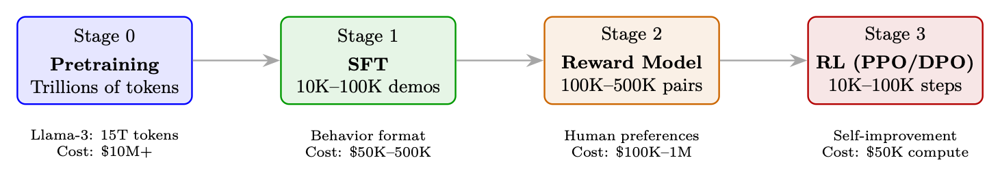
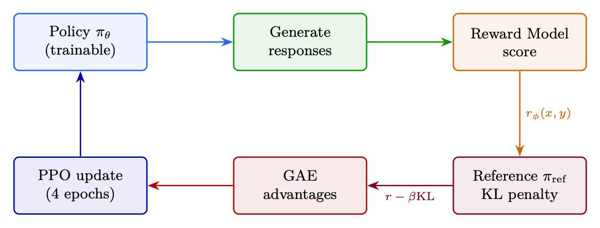

<div class="hh-guide">

<aside class="hh-part">
<p class="hh-part-title">Part II RL Methods for LLMs</p>
</aside>

## Motivation and History

Problem: Vanilla policy gradient updates have no constraint on step size. A single unlucky batch can push the policy into a region where it generates garbage <math alttext="\rightarrow" display="inline"><semantics><mo stretchy="false">→</mo></semantics></math> garbage gets low rewards <math alttext="\rightarrow" display="inline"><semantics><mo stretchy="false">→</mo></semantics></math> next gradient makes things worse <math alttext="\rightarrow" display="inline"><semantics><mo stretchy="false">→</mo></semantics></math> unrecoverable collapse.

Solution history:

<ol><li>TRPO[317] (2015): Constrain KL divergence between old and new policy. Works perfectly but requires expensive second-order optimization (Fisher information matrix, conjugate gradients).</li><li>PPO (2017) [319]: Achieve similar stability with a simple first-order clipped objective. 10<math alttext="\times" display="inline"><semantics><mo>×</mo></semantics></math> simpler to implement, works almost as well, scales to distributed training trivially.</li></ol>

## The Clipped Objective

The core innovation of PPO is a clipped surrogate objective that prevents destructively large policy updates while remaining simple to implement.

<div class="hh-equation" id="ch5.e1"><math alttext="\boxed{L^{\text{CLIP}}(\theta)=\mathbb{E}_{t}\left[\min\left(r_{t}(\theta)\hat{A}_{t},\;\text{clip}(r_{t}(\theta),1{-}\epsilon,1{+}\epsilon)\hat{A}_{t}\right)\right]}" display="block"><semantics><menclose notation="box"><mrow><mrow><msup><mi>L</mi><mtext>CLIP</mtext></msup><mo lspace="0em" rspace="0em">​</mo><mrow><mo stretchy="false">(</mo><mi>θ</mi><mo stretchy="false">)</mo></mrow></mrow><mo>=</mo><mrow><msub><mi>𝔼</mi><mi>t</mi></msub><mo lspace="0em" rspace="0em">​</mo><mrow><mo>[</mo><mrow><mi>min</mi><mo>⁡</mo><mrow><mo>(</mo><mrow><msub><mi>r</mi><mi>t</mi></msub><mo lspace="0em" rspace="0em">​</mo><mrow><mo stretchy="false">(</mo><mi>θ</mi><mo stretchy="false">)</mo></mrow><mo lspace="0em" rspace="0em">​</mo><msub><mover accent="true"><mi>A</mi><mo>^</mo></mover><mi>t</mi></msub></mrow><mo rspace="0.447em">,</mo><mrow><mtext>clip</mtext><mo lspace="0em" rspace="0em">​</mo><mrow><mo stretchy="false">(</mo><mrow><msub><mi>r</mi><mi>t</mi></msub><mo lspace="0em" rspace="0em">​</mo><mrow><mo stretchy="false">(</mo><mi>θ</mi><mo stretchy="false">)</mo></mrow></mrow><mo>,</mo><mrow><mn>1</mn><mo>−</mo><mi>ϵ</mi></mrow><mo>,</mo><mrow><mn>1</mn><mo>+</mo><mi>ϵ</mi></mrow><mo stretchy="false">)</mo></mrow><mo lspace="0em" rspace="0em">​</mo><msub><mover accent="true"><mi>A</mi><mo>^</mo></mover><mi>t</mi></msub></mrow><mo>)</mo></mrow></mrow><mo>]</mo></mrow></mrow></mrow></menclose></semantics></math><span class="hh-equation-number">(5.1)</span></div>

where <math alttext="r_{t}(\theta)=\frac{\pi_{\theta}(a_{t}|s_{t})}{\pi_{\theta_{\text{old}}}(a_{t}|s_{t})}" display="inline"><semantics><mrow><mrow><msub><mi>r</mi><mi>t</mi></msub><mo lspace="0em" rspace="0em">​</mo><mrow><mo stretchy="false">(</mo><mi>θ</mi><mo stretchy="false">)</mo></mrow></mrow><mo>=</mo><mfrac><mrow><msub><mi>π</mi><mi>θ</mi></msub><mo lspace="0em" rspace="0em">​</mo><mrow><mo stretchy="false">(</mo><msub><mi>a</mi><mi>t</mi></msub><mo lspace="0em" rspace="0em">|</mo><msub><mi>s</mi><mi>t</mi></msub><mo stretchy="false">)</mo></mrow></mrow><mrow><msub><mi>π</mi><msub><mi>θ</mi><mtext>old</mtext></msub></msub><mo lspace="0em" rspace="0em">​</mo><mrow><mo stretchy="false">(</mo><msub><mi>a</mi><mi>t</mi></msub><mo lspace="0em" rspace="0em">|</mo><msub><mi>s</mi><mi>t</mi></msub><mo stretchy="false">)</mo></mrow></mrow></mfrac></mrow></semantics></math> is the probability ratio.

## Full PPO Loss

<div class="hh-equation" id="ch5.e2"><math alttext="L=L^{\text{CLIP}}-c_{1}\underbrace{(V_{\theta}(s_{t})-V^{\text{target}}_{t})^{2}}_{\text{value loss}}+c_{2}\underbrace{H[\pi_{\theta}(\cdot|s_{t})]}_{\text{entropy bonus}}" display="block"><semantics><mrow><mi>L</mi><mo>=</mo><mrow><mrow><msup><mi>L</mi><mtext>CLIP</mtext></msup><mo>−</mo><mrow><msub><mi>c</mi><mn>1</mn></msub><mo lspace="0em" rspace="0em">​</mo><munder><munder accentunder="true"><msup><mrow><mo stretchy="false">(</mo><mrow><mrow><msub><mi>V</mi><mi>θ</mi></msub><mo lspace="0em" rspace="0em">​</mo><mrow><mo stretchy="false">(</mo><msub><mi>s</mi><mi>t</mi></msub><mo stretchy="false">)</mo></mrow></mrow><mo>−</mo><msubsup><mi>V</mi><mi>t</mi><mtext>target</mtext></msubsup></mrow><mo stretchy="false">)</mo></mrow><mn>2</mn></msup><mo stretchy="true">⏟</mo></munder><mtext>value loss</mtext></munder></mrow></mrow><mo>+</mo><mrow><msub><mi>c</mi><mn>2</mn></msub><mo lspace="0em" rspace="0em">​</mo><munder><munder accentunder="true"><mrow><mi>H</mi><mo stretchy="false">[</mo><mi>π</mi><msub><mrow></mrow><mi>θ</mi></msub><mo stretchy="false">(</mo><mo lspace="0em" rspace="0em">⋅</mo><mo fence="false" rspace="0.167em" stretchy="false">|</mo><mi>s</mi><msub><mrow></mrow><mi>t</mi></msub><mo stretchy="false">)</mo><mo stretchy="false">]</mo></mrow><mo stretchy="true">⏟</mo></munder><mtext>entropy bonus</mtext></munder></mrow></mrow></mrow></semantics></math><span class="hh-equation-number">(5.2)</span></div>

<ul><li>Value loss (<math alttext="c_{1}=0.1" display="inline"><semantics><mrow><msub><mi>c</mi><mn>1</mn></msub><mo>=</mo><mn>0.1</mn></mrow></semantics></math>): Trains the critic to predict returns. Also clipped for stability.</li><li>Entropy bonus (<math alttext="c_{2}=0.01" display="inline"><semantics><mrow><msub><mi>c</mi><mn>2</mn></msub><mo>=</mo><mn>0.01</mn></mrow></semantics></math>): Prevents premature convergence to deterministic policy. Critical for exploration.</li></ul>

## Derivation of the PPO Gradient and Update Rule

This section traces the mathematical path from the RL objective to the PPO update rule, showing <em>why</em> the clipped surrogate works.

### Step 1: The RL Objective

The goal is to maximize expected cumulative reward under the policy:

<div class="hh-equation" id="ch5.e3"><math alttext="J(\theta)=\mathbb{E}_{\tau\sim\pi_{\theta}}\left[\sum_{t=0}^{T}r_{t}\right]" display="block"><semantics><mrow><mrow><mi>J</mi><mo>⁡</mo><mrow><mo stretchy="false">(</mo><mi>θ</mi><mo stretchy="false">)</mo></mrow></mrow><mo>=</mo><mrow><msub><mi>𝔼</mi><mrow><mi>τ</mi><mo>∼</mo><msub><mi>π</mi><mi>θ</mi></msub></mrow></msub><mo lspace="0em" rspace="0em">​</mo><mrow><mo>[</mo><mrow><munderover><mo lspace="0em" movablelimits="false">∑</mo><mrow><mi>t</mi><mo>=</mo><mn>0</mn></mrow><mi>T</mi></munderover><msub><mi>r</mi><mi>t</mi></msub></mrow><mo>]</mo></mrow></mrow></mrow></semantics></math><span class="hh-equation-number">(5.3)</span></div>

### Step 2: Policy Gradient Theorem

The gradient of <math alttext="J(\theta)" display="inline"><semantics><mrow><mi>J</mi><mo>⁡</mo><mrow><mo stretchy="false">(</mo><mi>θ</mi><mo stretchy="false">)</mo></mrow></mrow></semantics></math> with respect to policy parameters:

<div class="hh-equation" id="ch5.e4"><math alttext="\boxed{\nabla_{\theta}J(\theta)=\mathbb{E}_{\pi_{\theta}}\left[\sum_{t=0}^{T}\nabla_{\theta}\log\pi_{\theta}(a_{t}|s_{t})\cdot\hat{A}_{t}\right]}" display="block"><semantics><menclose notation="box"><mrow><mrow><mrow><msub><mo>∇</mo><mi>θ</mi></msub><mi>J</mi></mrow><mo lspace="0em" rspace="0em">​</mo><mrow><mo stretchy="false">(</mo><mi>θ</mi><mo stretchy="false">)</mo></mrow></mrow><mo>=</mo><mrow><msub><mi>𝔼</mi><msub><mi>π</mi><mi>θ</mi></msub></msub><mo lspace="0em" rspace="0em">​</mo><mrow><mo>[</mo><mrow><mrow><munderover><mo lspace="0em" movablelimits="false">∑</mo><mrow><mi>t</mi><mo>=</mo><mn>0</mn></mrow><mi>T</mi></munderover><mrow><msub><mo>∇</mo><mi>θ</mi></msub><mo lspace="0.167em" rspace="0em">​</mo><mi>log</mi><mo lspace="0.167em" rspace="0em">​</mo><msub><mi>π</mi><mi>θ</mi></msub><mo lspace="0em" rspace="0em">​</mo><mrow><mo stretchy="false">(</mo><msub><mi>a</mi><mi>t</mi></msub><mo lspace="0em" rspace="0em">|</mo><msub><mi>s</mi><mi>t</mi></msub><mo rspace="0.055em" stretchy="false">)</mo></mrow></mrow></mrow><mo rspace="0.222em">⋅</mo><msub><mover accent="true"><mi>A</mi><mo>^</mo></mover><mi>t</mi></msub></mrow><mo>]</mo></mrow></mrow></mrow></menclose></semantics></math><span class="hh-equation-number">(5.4)</span></div>

where <math alttext="\hat{A}_{t}" display="inline"><semantics><msub><mover accent="true"><mi>A</mi><mo>^</mo></mover><mi>t</mi></msub></semantics></math> is the advantage function (how much better action <math alttext="a_{t}" display="inline"><semantics><msub><mi>a</mi><mi>t</mi></msub></semantics></math> was compared to the average action in state <math alttext="s_{t}" display="inline"><semantics><msub><mi>s</mi><mi>t</mi></msub></semantics></math>). This replaces the full return with the advantage to reduce variance.

### Step 3: Importance Sampling for Off-Policy Data

PPO collects data using <math alttext="\pi_{\theta_{\text{old}}}" display="inline"><semantics><msub><mi>π</mi><msub><mi>θ</mi><mtext>old</mtext></msub></msub></semantics></math> but updates <math alttext="\pi_{\theta}" display="inline"><semantics><msub><mi>π</mi><mi>θ</mi></msub></semantics></math>. To correct for this distribution mismatch, apply importance sampling:

<div class="hh-equation" id="ch5.e5"><math alttext="\nabla_{\theta}J(\theta)=\mathbb{E}_{\pi_{\theta_{\text{old}}}}\left[\frac{\pi_{\theta}(a_{t}|s_{t})}{\pi_{\theta_{\text{old}}}(a_{t}|s_{t})}\nabla_{\theta}\log\pi_{\theta}(a_{t}|s_{t})\cdot\hat{A}_{t}\right]" display="block"><semantics><mrow><mrow><mrow><msub><mo>∇</mo><mi>θ</mi></msub><mi>J</mi></mrow><mo lspace="0em" rspace="0em">​</mo><mrow><mo stretchy="false">(</mo><mi>θ</mi><mo stretchy="false">)</mo></mrow></mrow><mo>=</mo><mrow><msub><mi>𝔼</mi><msub><mi>π</mi><msub><mi>θ</mi><mtext>old</mtext></msub></msub></msub><mo lspace="0em" rspace="0em">​</mo><mrow><mo>[</mo><mrow><mrow><mfrac><mrow><msub><mi>π</mi><mi>θ</mi></msub><mo lspace="0em" rspace="0em">​</mo><mrow><mo stretchy="false">(</mo><msub><mi>a</mi><mi>t</mi></msub><mo lspace="0em" rspace="0em">|</mo><msub><mi>s</mi><mi>t</mi></msub><mo stretchy="false">)</mo></mrow></mrow><mrow><msub><mi>π</mi><msub><mi>θ</mi><mtext>old</mtext></msub></msub><mo lspace="0em" rspace="0em">​</mo><mrow><mo stretchy="false">(</mo><msub><mi>a</mi><mi>t</mi></msub><mo lspace="0em" rspace="0em">|</mo><msub><mi>s</mi><mi>t</mi></msub><mo stretchy="false">)</mo></mrow></mrow></mfrac><mo lspace="0.167em" rspace="0em">​</mo><msub><mo>∇</mo><mi>θ</mi></msub><mo lspace="0.167em" rspace="0em">​</mo><mrow><mi>log</mi><mo lspace="0.167em">⁡</mo><msub><mi>π</mi><mi>θ</mi></msub></mrow><mo lspace="0em" rspace="0em">​</mo><mrow><mo stretchy="false">(</mo><msub><mi>a</mi><mi>t</mi></msub><mo lspace="0em" rspace="0em">|</mo><msub><mi>s</mi><mi>t</mi></msub><mo rspace="0.055em" stretchy="false">)</mo></mrow></mrow><mo rspace="0.222em">⋅</mo><msub><mover accent="true"><mi>A</mi><mo>^</mo></mover><mi>t</mi></msub></mrow><mo>]</mo></mrow></mrow></mrow></semantics></math><span class="hh-equation-number">(5.5)</span></div>

Define the probability ratio <math alttext="r_{t}(\theta)=\frac{\pi_{\theta}(a_{t}|s_{t})}{\pi_{\theta_{\text{old}}}(a_{t}|s_{t})}" display="inline"><semantics><mrow><mrow><msub><mi>r</mi><mi>t</mi></msub><mo lspace="0em" rspace="0em">​</mo><mrow><mo stretchy="false">(</mo><mi>θ</mi><mo stretchy="false">)</mo></mrow></mrow><mo>=</mo><mfrac><mrow><msub><mi>π</mi><mi>θ</mi></msub><mo lspace="0em" rspace="0em">​</mo><mrow><mo stretchy="false">(</mo><msub><mi>a</mi><mi>t</mi></msub><mo lspace="0em" rspace="0em">|</mo><msub><mi>s</mi><mi>t</mi></msub><mo stretchy="false">)</mo></mrow></mrow><mrow><msub><mi>π</mi><msub><mi>θ</mi><mtext>old</mtext></msub></msub><mo lspace="0em" rspace="0em">​</mo><mrow><mo stretchy="false">(</mo><msub><mi>a</mi><mi>t</mi></msub><mo lspace="0em" rspace="0em">|</mo><msub><mi>s</mi><mi>t</mi></msub><mo stretchy="false">)</mo></mrow></mrow></mfrac></mrow></semantics></math>. Using the identity <math alttext="\nabla_{\theta}\log f=\frac{\nabla_{\theta}f}{f}" display="inline"><semantics><mrow><mrow><msub><mo>∇</mo><mi>θ</mi></msub><mo lspace="0.167em" rspace="0em">​</mo><mi>log</mi><mo lspace="0.167em" rspace="0em">​</mo><mi>f</mi></mrow><mo>=</mo><mfrac><mrow><msub><mo>∇</mo><mi>θ</mi></msub><mi>f</mi></mrow><mi>f</mi></mfrac></mrow></semantics></math>, we get:

<div class="hh-equation" id="ch5.e6"><math alttext="\nabla_{\theta}J(\theta)=\mathbb{E}_{\pi_{\theta_{\text{old}}}}\left[\nabla_{\theta}\,r_{t}(\theta)\cdot\hat{A}_{t}\right]" display="block"><semantics><mrow><mrow><mrow><msub><mo>∇</mo><mi>θ</mi></msub><mi>J</mi></mrow><mo lspace="0em" rspace="0em">​</mo><mrow><mo stretchy="false">(</mo><mi>θ</mi><mo stretchy="false">)</mo></mrow></mrow><mo>=</mo><mrow><msub><mi>𝔼</mi><msub><mi>π</mi><msub><mi>θ</mi><mtext>old</mtext></msub></msub></msub><mo lspace="0em" rspace="0em">​</mo><mrow><mo>[</mo><mrow><mrow><mrow><msub><mo rspace="0.167em">∇</mo><mi>θ</mi></msub><msub><mi>r</mi><mi>t</mi></msub></mrow><mo lspace="0em" rspace="0em">​</mo><mrow><mo stretchy="false">(</mo><mi>θ</mi><mo rspace="0.055em" stretchy="false">)</mo></mrow></mrow><mo rspace="0.222em">⋅</mo><msub><mover accent="true"><mi>A</mi><mo>^</mo></mover><mi>t</mi></msub></mrow><mo>]</mo></mrow></mrow></mrow></semantics></math><span class="hh-equation-number">(5.6)</span></div>

This means maximizing the surrogate objective:

<div class="hh-equation" id="ch5.e7"><math alttext="L^{\text{CPI}}(\theta)=\mathbb{E}_{t}\left[r_{t}(\theta)\cdot\hat{A}_{t}\right]" display="block"><semantics><mrow><mrow><msup><mi>L</mi><mtext>CPI</mtext></msup><mo lspace="0em" rspace="0em">​</mo><mrow><mo stretchy="false">(</mo><mi>θ</mi><mo stretchy="false">)</mo></mrow></mrow><mo>=</mo><mrow><msub><mi>𝔼</mi><mi>t</mi></msub><mo lspace="0em" rspace="0em">​</mo><mrow><mo>[</mo><mrow><mrow><msub><mi>r</mi><mi>t</mi></msub><mo lspace="0em" rspace="0em">​</mo><mrow><mo stretchy="false">(</mo><mi>θ</mi><mo rspace="0.055em" stretchy="false">)</mo></mrow></mrow><mo rspace="0.222em">⋅</mo><msub><mover accent="true"><mi>A</mi><mo>^</mo></mover><mi>t</mi></msub></mrow><mo>]</mo></mrow></mrow></mrow></semantics></math><span class="hh-equation-number">(5.7)</span></div>

### Step 4: The Problem with Unconstrained Surrogates

<math alttext="L^{\text{CPI}}" display="inline"><semantics><msup><mi>L</mi><mtext>CPI</mtext></msup></semantics></math> is a valid objective, but without constraints, a single gradient step can push <math alttext="r_{t}(\theta)" display="inline"><semantics><mrow><msub><mi>r</mi><mi>t</mi></msub><mo lspace="0em" rspace="0em">​</mo><mrow><mo stretchy="false">(</mo><mi>θ</mi><mo stretchy="false">)</mo></mrow></mrow></semantics></math> far from 1.0, causing:

<ul><li>Importance weights become extreme <math alttext="\rightarrow" display="inline"><semantics><mo stretchy="false">→</mo></semantics></math> high variance</li><li>Policy enters untested regions <math alttext="\rightarrow" display="inline"><semantics><mo stretchy="false">→</mo></semantics></math> reward model gives unreliable scores</li><li>Catastrophic collapse: policy generates garbage, can’t recover</li></ul>

TRPO solution: Constrain <math alttext="D_{\text{KL}}(\pi_{\theta_{\text{old}}}\|\pi_{\theta})\leq\delta" display="inline"><semantics><mrow><msub><mi>D</mi><mtext>KL</mtext></msub><mrow><mo stretchy="false">(</mo><msub><mi>π</mi><msub><mi>θ</mi><mtext>old</mtext></msub></msub><mo lspace="0em" rspace="0.167em">∥</mo><msub><mi>π</mi><mi>θ</mi></msub><mo stretchy="false">)</mo></mrow><mo>≤</mo><mi>δ</mi></mrow></semantics></math>. Requires second-order methods (expensive).

### Step 5: PPO’s Clipped Surrogate (First-Order Approximation)

PPO replaces the hard KL constraint with a clipped objective that achieves similar behavior using only first-order gradients:

<div class="hh-equation" id="ch5.e8"><math alttext="\boxed{L^{\text{CLIP}}(\theta)=\mathbb{E}_{t}\left[\min\!\left(r_{t}(\theta)\hat{A}_{t},\;\text{clip}(r_{t}(\theta),1{-}\epsilon,1{+}\epsilon)\hat{A}_{t}\right)\right]}" display="block"><semantics><menclose notation="box"><mrow><mrow><msup><mi>L</mi><mtext>CLIP</mtext></msup><mo lspace="0em" rspace="0em">​</mo><mrow><mo stretchy="false">(</mo><mi>θ</mi><mo stretchy="false">)</mo></mrow></mrow><mo>=</mo><mrow><msub><mi>𝔼</mi><mi>t</mi></msub><mo lspace="0em" rspace="0em">​</mo><mrow><mo>[</mo><mrow><mpadded width="1.653em"><mi>min</mi></mpadded><mo>⁡</mo><mrow><mo>(</mo><mrow><msub><mi>r</mi><mi>t</mi></msub><mo lspace="0em" rspace="0em">​</mo><mrow><mo stretchy="false">(</mo><mi>θ</mi><mo stretchy="false">)</mo></mrow><mo lspace="0em" rspace="0em">​</mo><msub><mover accent="true"><mi>A</mi><mo>^</mo></mover><mi>t</mi></msub></mrow><mo rspace="0.447em">,</mo><mrow><mtext>clip</mtext><mo lspace="0em" rspace="0em">​</mo><mrow><mo stretchy="false">(</mo><mrow><msub><mi>r</mi><mi>t</mi></msub><mo lspace="0em" rspace="0em">​</mo><mrow><mo stretchy="false">(</mo><mi>θ</mi><mo stretchy="false">)</mo></mrow></mrow><mo>,</mo><mrow><mn>1</mn><mo>−</mo><mi>ϵ</mi></mrow><mo>,</mo><mrow><mn>1</mn><mo>+</mo><mi>ϵ</mi></mrow><mo stretchy="false">)</mo></mrow><mo lspace="0em" rspace="0em">​</mo><msub><mover accent="true"><mi>A</mi><mo>^</mo></mover><mi>t</mi></msub></mrow><mo>)</mo></mrow></mrow><mo>]</mo></mrow></mrow></mrow></menclose></semantics></math><span class="hh-equation-number">(5.8)</span></div>

Derivation of the gradient:

Let <math alttext="L_{t}=\min(r_{t}\hat{A}_{t},\;\bar{r}_{t}\hat{A}_{t})" display="inline"><semantics><mrow><msub><mi>L</mi><mi>t</mi></msub><mo>=</mo><mrow><mi>min</mi><mo>⁡</mo><mrow><mo stretchy="false">(</mo><mrow><msub><mi>r</mi><mi>t</mi></msub><mo lspace="0em" rspace="0em">​</mo><msub><mover accent="true"><mi>A</mi><mo>^</mo></mover><mi>t</mi></msub></mrow><mo rspace="0.447em">,</mo><mrow><msub><mover accent="true"><mi>r</mi><mo>¯</mo></mover><mi>t</mi></msub><mo lspace="0em" rspace="0em">​</mo><msub><mover accent="true"><mi>A</mi><mo>^</mo></mover><mi>t</mi></msub></mrow><mo stretchy="false">)</mo></mrow></mrow></mrow></semantics></math> where <math alttext="\bar{r}_{t}=\text{clip}(r_{t},1{-}\epsilon,1{+}\epsilon)" display="inline"><semantics><mrow><msub><mover accent="true"><mi>r</mi><mo>¯</mo></mover><mi>t</mi></msub><mo>=</mo><mrow><mtext>clip</mtext><mo lspace="0em" rspace="0em">​</mo><mrow><mo stretchy="false">(</mo><msub><mi>r</mi><mi>t</mi></msub><mo>,</mo><mrow><mn>1</mn><mo>−</mo><mi>ϵ</mi></mrow><mo>,</mo><mrow><mn>1</mn><mo>+</mo><mi>ϵ</mi></mrow><mo stretchy="false">)</mo></mrow></mrow></mrow></semantics></math>.

<div class="hh-equation" id="ch5.e9"><math alttext="\nabla_{\theta}L_{t}=\begin{cases}\nabla_{\theta}r_{t}(\theta)\cdot\hat{A}_{t}&amp;\text{if }r_{t}\hat{A}_{t}&lt;\bar{r}_{t}\hat{A}_{t}\text{ (unclipped term is smaller)}\\
0&amp;\text{if }r_{t}\hat{A}_{t}\geq\bar{r}_{t}\hat{A}_{t}\text{ (clipped term is smaller, gradient = 0)}\end{cases}" display="block"><semantics><mrow><mrow><msub><mo>∇</mo><mi>θ</mi></msub><msub><mi>L</mi><mi>t</mi></msub></mrow><mo>=</mo><mrow><mo>{</mo><mtable columnspacing="5pt" displaystyle="true" rowspacing="0pt"><mtr><mtd columnalign="left"><mrow><mrow><mrow><msub><mo>∇</mo><mi>θ</mi></msub><msub><mi>r</mi><mi>t</mi></msub></mrow><mo lspace="0em" rspace="0em">​</mo><mrow><mo stretchy="false">(</mo><mi>θ</mi><mo rspace="0.055em" stretchy="false">)</mo></mrow></mrow><mo rspace="0.222em">⋅</mo><msub><mover accent="true"><mi>A</mi><mo>^</mo></mover><mi>t</mi></msub></mrow></mtd><mtd columnalign="left"><mrow><mrow><mtext>if </mtext><mo lspace="0em" rspace="0em">​</mo><msub><mi>r</mi><mi>t</mi></msub><mo lspace="0em" rspace="0em">​</mo><msub><mover accent="true"><mi>A</mi><mo>^</mo></mover><mi>t</mi></msub></mrow><mo>&lt;</mo><mrow><msub><mover accent="true"><mi>r</mi><mo>¯</mo></mover><mi>t</mi></msub><mo lspace="0em" rspace="0em">​</mo><msub><mover accent="true"><mi>A</mi><mo>^</mo></mover><mi>t</mi></msub><mo lspace="0em" rspace="0em">​</mo><mtext> (unclipped term is smaller)</mtext></mrow></mrow></mtd></mtr><mtr><mtd columnalign="left"><mn>0</mn></mtd><mtd columnalign="left"><mrow><mrow><mtext>if </mtext><mo lspace="0em" rspace="0em">​</mo><msub><mi>r</mi><mi>t</mi></msub><mo lspace="0em" rspace="0em">​</mo><msub><mover accent="true"><mi>A</mi><mo>^</mo></mover><mi>t</mi></msub></mrow><mo>≥</mo><mrow><msub><mover accent="true"><mi>r</mi><mo>¯</mo></mover><mi>t</mi></msub><mo lspace="0em" rspace="0em">​</mo><msub><mover accent="true"><mi>A</mi><mo>^</mo></mover><mi>t</mi></msub><mo lspace="0em" rspace="0em">​</mo><mtext> (clipped term is smaller, gradient = 0)</mtext></mrow></mrow></mtd></mtr></mtable></mrow></mrow></semantics></math><span class="hh-equation-number">(5.9)</span></div>

Expanding the conditions:

<ul><li>When <math alttext="\hat{A}_{t}&gt;0" display="inline"><semantics><mrow><msub><mover accent="true"><mi>A</mi><mo>^</mo></mover><mi>t</mi></msub><mo>&gt;</mo><mn>0</mn></mrow></semantics></math> and <math alttext="r_{t}&lt;1+\epsilon" display="inline"><semantics><mrow><msub><mi>r</mi><mi>t</mi></msub><mo>&lt;</mo><mrow><mn>1</mn><mo>+</mo><mi>ϵ</mi></mrow></mrow></semantics></math>: Gradient flows normally — policy is encouraged to increase <math alttext="\pi_{\theta}(a_{t}|s_{t})" display="inline"><semantics><mrow><msub><mi>π</mi><mi>θ</mi></msub><mo lspace="0em" rspace="0em">​</mo><mrow><mo stretchy="false">(</mo><msub><mi>a</mi><mi>t</mi></msub><mo lspace="0em" rspace="0em">|</mo><msub><mi>s</mi><mi>t</mi></msub><mo stretchy="false">)</mo></mrow></mrow></semantics></math>.</li><li>When <math alttext="\hat{A}_{t}&gt;0" display="inline"><semantics><mrow><msub><mover accent="true"><mi>A</mi><mo>^</mo></mover><mi>t</mi></msub><mo>&gt;</mo><mn>0</mn></mrow></semantics></math> and <math alttext="r_{t}\geq 1+\epsilon" display="inline"><semantics><mrow><msub><mi>r</mi><mi>t</mi></msub><mo>≥</mo><mrow><mn>1</mn><mo>+</mo><mi>ϵ</mi></mrow></mrow></semantics></math>: Gradient is zero — policy has already increased enough, stop pushing.</li><li>When <math alttext="\hat{A}_{t}&lt;0" display="inline"><semantics><mrow><msub><mover accent="true"><mi>A</mi><mo>^</mo></mover><mi>t</mi></msub><mo>&lt;</mo><mn>0</mn></mrow></semantics></math> and <math alttext="r_{t}&gt;1-\epsilon" display="inline"><semantics><mrow><msub><mi>r</mi><mi>t</mi></msub><mo>&gt;</mo><mrow><mn>1</mn><mo>−</mo><mi>ϵ</mi></mrow></mrow></semantics></math>: Gradient flows normally — policy is encouraged to decrease <math alttext="\pi_{\theta}(a_{t}|s_{t})" display="inline"><semantics><mrow><msub><mi>π</mi><mi>θ</mi></msub><mo lspace="0em" rspace="0em">​</mo><mrow><mo stretchy="false">(</mo><msub><mi>a</mi><mi>t</mi></msub><mo lspace="0em" rspace="0em">|</mo><msub><mi>s</mi><mi>t</mi></msub><mo stretchy="false">)</mo></mrow></mrow></semantics></math>.</li><li>When <math alttext="\hat{A}_{t}&lt;0" display="inline"><semantics><mrow><msub><mover accent="true"><mi>A</mi><mo>^</mo></mover><mi>t</mi></msub><mo>&lt;</mo><mn>0</mn></mrow></semantics></math> and <math alttext="r_{t}\leq 1-\epsilon" display="inline"><semantics><mrow><msub><mi>r</mi><mi>t</mi></msub><mo>≤</mo><mrow><mn>1</mn><mo>−</mo><mi>ϵ</mi></mrow></mrow></semantics></math>: Gradient is zero — policy has already decreased enough, stop pushing.</li></ul>

### Step 6: The Complete PPO Update Rule

Combining the clipped policy loss, value loss, and entropy bonus:

<div class="hh-equation" id="ch5.e10"><math alttext="\boxed{\theta_{k+1}=\theta_{k}+\alpha\cdot\nabla_{\theta}\left[L^{\text{CLIP}}(\theta)-c_{1}L^{\text{VF}}(\theta)+c_{2}H[\pi_{\theta}]\right]}" display="block"><semantics><menclose notation="box"><mrow><msub><mi>θ</mi><mrow><mi>k</mi><mo>+</mo><mn>1</mn></mrow></msub><mo>=</mo><mrow><msub><mi>θ</mi><mi>k</mi></msub><mo>+</mo><mrow><mi>α</mi><mo lspace="0.222em" rspace="0.222em">⋅</mo><mrow><msub><mo>∇</mo><mi>θ</mi></msub><mrow><mo>[</mo><mrow><mrow><mrow><msup><mi>L</mi><mtext>CLIP</mtext></msup><mo lspace="0em" rspace="0em">​</mo><mrow><mo stretchy="false">(</mo><mi>θ</mi><mo stretchy="false">)</mo></mrow></mrow><mo>−</mo><mrow><msub><mi>c</mi><mn>1</mn></msub><mo lspace="0em" rspace="0em">​</mo><msup><mi>L</mi><mtext>VF</mtext></msup><mo lspace="0em" rspace="0em">​</mo><mrow><mo stretchy="false">(</mo><mi>θ</mi><mo stretchy="false">)</mo></mrow></mrow></mrow><mo>+</mo><mrow><msub><mi>c</mi><mn>2</mn></msub><mo lspace="0em" rspace="0em">​</mo><mi>H</mi><mo lspace="0em" rspace="0em">​</mo><mrow><mo stretchy="false">[</mo><msub><mi>π</mi><mi>θ</mi></msub><mo stretchy="false">]</mo></mrow></mrow></mrow><mo>]</mo></mrow></mrow></mrow></mrow></mrow></menclose></semantics></math><span class="hh-equation-number">(5.10)</span></div>

where:


## Rollout Buffer and Rollouts

In PPO, data management relies on a specialized, short-term storage system known as a Rollout Buffer. Unlike off-policy algorithms (DQN) that store experiences indefinitely in a replay buffer, PPO requires an ephemeral structure to satisfy its on-policy mathematical constraints.

### What is a Rollout?

A rollout (trajectory) is a sequence of interactions generated by the agent running its current policy in the environment:

<ul><li>The process: The agent observes a state, selects an action, receives a reward, and moves to the next state. It repeats for a fixed number of steps or until the episode ends.</li><li>In LLMs/RLHF: A rollout consists of taking a prompt from a dataset and letting the language model generate a complete sequence of tokens token-by-token until an end-of-text marker is hit. Each token is one “step.”</li></ul>

### The Rollout Buffer

The rollout buffer temporarily stores all data collected during the rollout phase. For every generated token/step, it records:

<div class="hh-equation" id="ch5.e13"><math alttext="\boxed{\mathcal{B}=\left\{\left(s_{t},\;a_{t},\;\log\pi_{\theta_{\text{old}}}(a_{t}|s_{t}),\;r_{t},\;V(s_{t})\right)\right\}_{t=1}^{T}}" display="block"><semantics><menclose notation="box"><mrow><mi>ℬ</mi><mo>=</mo><msubsup><mrow><mo>{</mo><mrow><mo>(</mo><msub><mi>s</mi><mi>t</mi></msub><mo>,</mo><msub><mi>a</mi><mi>t</mi></msub><mo>,</mo><mrow><mrow><mi>log</mi><mo lspace="0.167em">⁡</mo><msub><mi>π</mi><msub><mi>θ</mi><mtext>old</mtext></msub></msub></mrow><mo lspace="0em" rspace="0em">​</mo><mrow><mo stretchy="false">(</mo><msub><mi>a</mi><mi>t</mi></msub><mo lspace="0em" rspace="0em">|</mo><msub><mi>s</mi><mi>t</mi></msub><mo stretchy="false">)</mo></mrow></mrow><mo>,</mo><msub><mi>r</mi><mi>t</mi></msub><mo>,</mo><mrow><mi>V</mi><mo>⁡</mo><mrow><mo stretchy="false">(</mo><msub><mi>s</mi><mi>t</mi></msub><mo stretchy="false">)</mo></mrow></mrow><mo>)</mo></mrow><mo>}</mo></mrow><mrow><mi>t</mi><mo>=</mo><mn>1</mn></mrow><mi>T</mi></msubsup></mrow></menclose></semantics></math><span class="hh-equation-number">(5.13)</span></div>

<ul><li><math alttext="s_{t},a_{t},r_{t}" display="inline"><semantics><mrow><msub><mi>s</mi><mi>t</mi></msub><mo>,</mo><msub><mi>a</mi><mi>t</mi></msub><mo>,</mo><msub><mi>r</mi><mi>t</mi></msub></mrow></semantics></math>: State, action taken, and reward at step <math alttext="t" display="inline"><semantics><mi>t</mi></semantics></math>.</li><li><math alttext="\log\pi_{\theta_{\text{old}}}(a_{t}|s_{t})" display="inline"><semantics><mrow><mrow><mi>log</mi><mo lspace="0.167em">⁡</mo><msub><mi>π</mi><msub><mi>θ</mi><mtext>old</mtext></msub></msub></mrow><mo lspace="0em" rspace="0em">​</mo><mrow><mo stretchy="false">(</mo><msub><mi>a</mi><mi>t</mi></msub><mo lspace="0em" rspace="0em">|</mo><msub><mi>s</mi><mi>t</mi></msub><mo stretchy="false">)</mo></mrow></mrow></semantics></math>: Log-probability of taking that action under the exact policy that generated it (needed for ratio computation).</li><li><math alttext="V(s_{t})" display="inline"><semantics><mrow><mi>V</mi><mo>⁡</mo><mrow><mo stretchy="false">(</mo><msub><mi>s</mi><mi>t</mi></msub><mo stretchy="false">)</mo></mrow></mrow></semantics></math>: Value function’s baseline prediction (needed for GAE advantage computation).</li></ul>

### The Rollout Buffer Lifecycle

The buffer operates in a strict three-phase clockwork cycle:

<ol><li>Collect: The active policy interacts with the environment to fill the buffer with fresh trajectories (for a 70B model with batch=128, max_tokens=512: up to 65K token-level transitions per rollout).</li><li>Train: Compute GAE advantages across trajectories. Run <math alttext="K" display="inline"><semantics><mi>K</mi></semantics></math> epochs (typically 3–10) of mini-batch gradient descent to update policy weights using the clipped objective.</li><li>Purge: The entire buffer is completely wiped clean. Because PPO is on-policy, data generated by the old policy cannot be safely reused for the next update cycle — the ratio <math alttext="r_{t}(\theta)" display="inline"><semantics><mrow><msub><mi>r</mi><mi>t</mi></msub><mo lspace="0em" rspace="0em">​</mo><mrow><mo stretchy="false">(</mo><mi>θ</mi><mo stretchy="false">)</mo></mrow></mrow></semantics></math> would become stale and the clipping guarantees would break.</li></ol>

## PPO for RLHF: The Full Loop

<figure id="ch5.s6.fig1"></figure>

## Detailed Mechanics: Logits and Policy Updates

<figure id="ch5.f1"><figcaption><span class="hh-tag">Figure 5.1:</span>PPO end-to-end: from prompt batch through generation, reward scoring, KL computation, advantage estimation, to clipped policy update. The feedback loop shows the updated policy being used for the next generation step.</figcaption></figure>

PPO manages two distinct parameter states in memory, which share the same neural network topology but hold different weight values during optimization:

### Phase 1: Rollout (Data Collection)

During data collection, the agent interacts with the environment for <math alttext="T" display="inline"><semantics><mi>T</mi></semantics></math> steps. At each time-step <math alttext="t" display="inline"><semantics><mi>t</mi></semantics></math>:

<ol><li>The environment yields the current state/observation <math alttext="s_{t}" display="inline"><semantics><msub><mi>s</mi><mi>t</mi></msub></semantics></math> (for LLMs: prompt + tokens generated so far).</li><li>State <math alttext="s_{t}" display="inline"><semantics><msub><mi>s</mi><mi>t</mi></msub></semantics></math> is passed through the current network snapshot (<math alttext="\theta_{\text{old}}" display="inline"><semantics><msub><mi>θ</mi><mtext>old</mtext></msub></semantics></math>).</li><li>The network outputs raw unnormalized values — logits<math alttext="z_{\text{old}}" display="inline"><semantics><msub><mi>z</mi><mtext>old</mtext></msub></semantics></math> — a vector of size <math alttext="|V|" display="inline"><semantics><mrow><mo stretchy="false">|</mo><mi>V</mi><mo stretchy="false">|</mo></mrow></semantics></math> (vocabulary size 32K–128K).</li><li>Probabilities are computed via Softmax:<math alttext="\boxed{P(a\mid s_{t})=\text{Softmax}(z_{\text{old}})=\frac{\exp(z_{\text{old},a})}{\sum_{j=1}^{|V|}\exp(z_{\text{old},j})}}" display="block"><semantics><menclose notation="box"><mrow><mrow><mi>P</mi><mo>⁡</mo><mrow><mo stretchy="false">(</mo><mi>a</mi><mo fence="true" lspace="0em" rspace="0em">∣</mo><msub><mi>s</mi><mi>t</mi></msub><mo stretchy="false">)</mo></mrow></mrow><mo>=</mo><mrow><mtext>Softmax</mtext><mo lspace="0em" rspace="0em">​</mo><mrow><mo stretchy="false">(</mo><msub><mi>z</mi><mtext>old</mtext></msub><mo stretchy="false">)</mo></mrow></mrow><mo>=</mo><mfrac><mrow><mi>exp</mi><mo>⁡</mo><mrow><mo stretchy="false">(</mo><msub><mi>z</mi><mrow><mtext>old</mtext><mo>,</mo><mi>a</mi></mrow></msub><mo stretchy="false">)</mo></mrow></mrow><mrow><msubsup><mo>∑</mo><mrow><mi>j</mi><mo>=</mo><mn>1</mn></mrow><mrow><mo stretchy="false">|</mo><mi>V</mi><mo stretchy="false">|</mo></mrow></msubsup><mrow><mi>exp</mi><mo>⁡</mo><mrow><mo stretchy="false">(</mo><msub><mi>z</mi><mrow><mtext>old</mtext><mo>,</mo><mi>j</mi></mrow></msub><mo stretchy="false">)</mo></mrow></mrow></mrow></mfrac></mrow></menclose></semantics></math><span class="hh-tag">(5.14)</span></li><li>An action <math alttext="a_{t}" display="inline"><semantics><msub><mi>a</mi><mi>t</mi></msub></semantics></math> (next token) is sampled from <math alttext="P(a\mid s_{t})" display="inline"><semantics><mrow><mi>P</mi><mo>⁡</mo><mrow><mo stretchy="false">(</mo><mi>a</mi><mo fence="true" lspace="0em" rspace="0em">∣</mo><msub><mi>s</mi><mi>t</mi></msub><mo stretchy="false">)</mo></mrow></mrow></semantics></math>, and the transition tuple <math alttext="\langle s_{t},a_{t},r_{t},s_{t+1}\rangle" display="inline"><semantics><mrow><mo stretchy="false">⟨</mo><mrow><msub><mi>s</mi><mi>t</mi></msub><mo>,</mo><msub><mi>a</mi><mi>t</mi></msub><mo>,</mo><msub><mi>r</mi><mi>t</mi></msub><mo>,</mo><msub><mi>s</mi><mrow><mi>t</mi><mo>+</mo><mn>1</mn></mrow></msub></mrow><mo stretchy="false">⟩</mo></mrow></semantics></math> along with <math alttext="\log\pi_{\theta_{\text{old}}}(a_{t}\mid s_{t})" display="inline"><semantics><mrow><mrow><mi>log</mi><mo lspace="0.167em">⁡</mo><msub><mi>π</mi><msub><mi>θ</mi><mtext>old</mtext></msub></msub></mrow><mo lspace="0em" rspace="0em">​</mo><mrow><mo stretchy="false">(</mo><msub><mi>a</mi><mi>t</mi></msub><mo fence="true" lspace="0em" rspace="0em">∣</mo><msub><mi>s</mi><mi>t</mi></msub><mo stretchy="false">)</mo></mrow></mrow></semantics></math> is stored in the rollout buffer.</li></ol>

### Phase 2: Optimization Loop (Mini-Batch Updates)

Once the rollout buffer is full, PPO runs <math alttext="K" display="inline"><semantics><mi>K</mi></semantics></math> epochs (typically 3–10) over mini-batches. For every gradient step, logits are generated for both policies using the stored state <math alttext="s_{t}" display="inline"><semantics><msub><mi>s</mi><mi>t</mi></msub></semantics></math>:

Old Policy Evaluation (frozen):

<div class="hh-equation" id="ch5.e15"><math alttext="z_{\text{old}}=f(s_{t};\theta_{\text{old}})\quad\longrightarrow\quad\log\pi_{\theta_{\text{old}}}(a_{t}\mid s_{t})=\text{LogSoftmax}(z_{\text{old}})[a_{t}]" display="block"><semantics><mrow><mrow><msub><mi>z</mi><mtext>old</mtext></msub><mo>=</mo><mrow><mi>f</mi><mo>⁡</mo><mrow><mo stretchy="false">(</mo><msub><mi>s</mi><mi>t</mi></msub><mo>,</mo><msub><mi>θ</mi><mtext>old</mtext></msub><mo stretchy="false">)</mo></mrow></mrow></mrow><mspace width="1em"></mspace><mo stretchy="false">⟶</mo><mspace width="1.167em"></mspace><mrow><mrow><mrow><mi>log</mi><mo lspace="0.167em">⁡</mo><msub><mi>π</mi><msub><mi>θ</mi><mtext>old</mtext></msub></msub></mrow><mo lspace="0em" rspace="0em">​</mo><mrow><mo stretchy="false">(</mo><msub><mi>a</mi><mi>t</mi></msub><mo fence="true" lspace="0em" rspace="0em">∣</mo><msub><mi>s</mi><mi>t</mi></msub><mo stretchy="false">)</mo></mrow></mrow><mo>=</mo><mrow><mtext>LogSoftmax</mtext><mo lspace="0em" rspace="0em">​</mo><mrow><mo stretchy="false">(</mo><msub><mi>z</mi><mtext>old</mtext></msub><mo stretchy="false">)</mo></mrow><mo lspace="0em" rspace="0em">​</mo><mrow><mo stretchy="false">[</mo><msub><mi>a</mi><mi>t</mi></msub><mo stretchy="false">]</mo></mrow></mrow></mrow></mrow></semantics></math><span class="hh-equation-number">(5.15)</span></div>

<em>Implementation shortcut: reuse the stored scalar from rollout instead of re-computing.</em>

Live Policy Evaluation (updating):

<div class="hh-equation" id="ch5.e16"><math alttext="z_{\text{new}}=f(s_{t};\theta)\quad\longrightarrow\quad\log\pi_{\theta}(a_{t}\mid s_{t})=\text{LogSoftmax}(z_{\text{new}})[a_{t}]" display="block"><semantics><mrow><mrow><msub><mi>z</mi><mtext>new</mtext></msub><mo>=</mo><mrow><mi>f</mi><mo>⁡</mo><mrow><mo stretchy="false">(</mo><msub><mi>s</mi><mi>t</mi></msub><mo>,</mo><mi>θ</mi><mo stretchy="false">)</mo></mrow></mrow></mrow><mspace width="1em"></mspace><mo stretchy="false">⟶</mo><mspace width="1.167em"></mspace><mrow><mrow><mrow><mi>log</mi><mo lspace="0.167em">⁡</mo><msub><mi>π</mi><mi>θ</mi></msub></mrow><mo lspace="0em" rspace="0em">​</mo><mrow><mo stretchy="false">(</mo><msub><mi>a</mi><mi>t</mi></msub><mo fence="true" lspace="0em" rspace="0em">∣</mo><msub><mi>s</mi><mi>t</mi></msub><mo stretchy="false">)</mo></mrow></mrow><mo>=</mo><mrow><mtext>LogSoftmax</mtext><mo lspace="0em" rspace="0em">​</mo><mrow><mo stretchy="false">(</mo><msub><mi>z</mi><mtext>new</mtext></msub><mo stretchy="false">)</mo></mrow><mo lspace="0em" rspace="0em">​</mo><mrow><mo stretchy="false">[</mo><msub><mi>a</mi><mi>t</mi></msub><mo stretchy="false">]</mo></mrow></mrow></mrow></mrow></semantics></math><span class="hh-equation-number">(5.16)</span></div>

Because <math alttext="\theta" display="inline"><semantics><mi>θ</mi></semantics></math> updates after every mini-batch gradient step, <math alttext="z_{\text{new}}" display="inline"><semantics><msub><mi>z</mi><mtext>new</mtext></msub></semantics></math> changes continuously throughout the optimization loop, whereas <math alttext="z_{\text{old}}" display="inline"><semantics><msub><mi>z</mi><mtext>old</mtext></msub></semantics></math> remains perfectly static.

### From Logits to Probability Ratio

The core PPO ratio measures how much more or less likely an action is under the new policy vs the old:

<div class="hh-equation" id="ch5.e17"><math alttext="\boxed{r_{t}(\theta)=\frac{\pi_{\theta}(a_{t}\mid s_{t})}{\pi_{\theta_{\text{old}}}(a_{t}\mid s_{t})}}" display="block"><semantics><menclose notation="box"><mrow><mrow><msub><mi>r</mi><mi>t</mi></msub><mo lspace="0em" rspace="0em">​</mo><mrow><mo stretchy="false">(</mo><mi>θ</mi><mo stretchy="false">)</mo></mrow></mrow><mo>=</mo><mfrac><mrow><msub><mi>π</mi><mi>θ</mi></msub><mo lspace="0em" rspace="0em">​</mo><mrow><mo stretchy="false">(</mo><msub><mi>a</mi><mi>t</mi></msub><mo fence="true" lspace="0em" rspace="0em">∣</mo><msub><mi>s</mi><mi>t</mi></msub><mo stretchy="false">)</mo></mrow></mrow><mrow><msub><mi>π</mi><msub><mi>θ</mi><mtext>old</mtext></msub></msub><mo lspace="0em" rspace="0em">​</mo><mrow><mo stretchy="false">(</mo><msub><mi>a</mi><mi>t</mi></msub><mo fence="true" lspace="0em" rspace="0em">∣</mo><msub><mi>s</mi><mi>t</mi></msub><mo stretchy="false">)</mo></mrow></mrow></mfrac></mrow></menclose></semantics></math><span class="hh-equation-number">(5.17)</span></div>

To avoid catastrophic numerical underflow/overflow from dividing raw probabilities, the calculation is performed in log-space:


The ratio is recovered via exponentiation of the difference:

<div class="hh-equation" id="ch5.e20"><math alttext="\boxed{r_{t}(\theta)=\exp\!\left(\log\pi_{\theta}(a_{t}\mid s_{t})-\log\pi_{\theta_{\text{old}}}(a_{t}\mid s_{t})\right)}" display="block"><semantics><menclose notation="box"><mrow><mrow><msub><mi>r</mi><mi>t</mi></msub><mo lspace="0em" rspace="0em">​</mo><mrow><mo stretchy="false">(</mo><mi>θ</mi><mo stretchy="false">)</mo></mrow></mrow><mo>=</mo><mrow><mpadded width="1.370em"><mi>exp</mi></mpadded><mo>⁡</mo><mrow><mo>(</mo><mrow><mrow><mrow><mi>log</mi><mo lspace="0.167em">⁡</mo><msub><mi>π</mi><mi>θ</mi></msub></mrow><mo lspace="0em" rspace="0em">​</mo><mrow><mo stretchy="false">(</mo><msub><mi>a</mi><mi>t</mi></msub><mo fence="true" lspace="0em" rspace="0em">∣</mo><msub><mi>s</mi><mi>t</mi></msub><mo stretchy="false">)</mo></mrow></mrow><mo>−</mo><mrow><mrow><mi>log</mi><mo lspace="0.167em">⁡</mo><msub><mi>π</mi><msub><mi>θ</mi><mtext>old</mtext></msub></msub></mrow><mo lspace="0em" rspace="0em">​</mo><mrow><mo stretchy="false">(</mo><msub><mi>a</mi><mi>t</mi></msub><mo fence="true" lspace="0em" rspace="0em">∣</mo><msub><mi>s</mi><mi>t</mi></msub><mo stretchy="false">)</mo></mrow></mrow></mrow><mo>)</mo></mrow></mrow></mrow></menclose></semantics></math><span class="hh-equation-number">(5.20)</span></div>

This ratio is injected into the PPO clipping objective:

<div class="hh-equation" id="ch5.e21"><math alttext="\boxed{\mathcal{L}^{\text{CLIP}}(\theta)=\hat{\mathbb{E}}_{t}\left[\min\!\left(r_{t}(\theta)\hat{A}_{t},\;\text{clip}(r_{t}(\theta),\,1{-}\epsilon,\,1{+}\epsilon)\,\hat{A}_{t}\right)\right]}" display="block"><semantics><menclose notation="box"><mrow><mrow><msup><mi>ℒ</mi><mtext>CLIP</mtext></msup><mo lspace="0em" rspace="0em">​</mo><mrow><mo stretchy="false">(</mo><mi>θ</mi><mo stretchy="false">)</mo></mrow></mrow><mo>=</mo><mrow><msub><mover accent="true"><mi>𝔼</mi><mo>^</mo></mover><mi>t</mi></msub><mo lspace="0em" rspace="0em">​</mo><mrow><mo>[</mo><mrow><mpadded width="1.653em"><mi>min</mi></mpadded><mo>⁡</mo><mrow><mo>(</mo><mrow><msub><mi>r</mi><mi>t</mi></msub><mo lspace="0em" rspace="0em">​</mo><mrow><mo stretchy="false">(</mo><mi>θ</mi><mo stretchy="false">)</mo></mrow><mo lspace="0em" rspace="0em">​</mo><msub><mover accent="true"><mi>A</mi><mo>^</mo></mover><mi>t</mi></msub></mrow><mo rspace="0.447em">,</mo><mrow><mtext>clip</mtext><mo lspace="0em" rspace="0em">​</mo><mrow><mo stretchy="false">(</mo><mrow><msub><mi>r</mi><mi>t</mi></msub><mo lspace="0em" rspace="0em">​</mo><mrow><mo stretchy="false">(</mo><mi>θ</mi><mo stretchy="false">)</mo></mrow></mrow><mo>,</mo><mrow><mn> 1</mn><mo>−</mo><mi>ϵ</mi></mrow><mo>,</mo><mrow><mn> 1</mn><mo>+</mo><mi>ϵ</mi></mrow><mo stretchy="false">)</mo></mrow><mo lspace="0.170em" rspace="0em">​</mo><msub><mover accent="true"><mi>A</mi><mo>^</mo></mover><mi>t</mi></msub></mrow><mo>)</mo></mrow></mrow><mo>]</mo></mrow></mrow></mrow></menclose></semantics></math><span class="hh-equation-number">(5.21)</span></div>

### The PPO Weight Lifecycle

<div class="hh-table" id="ch5.t1"><table class="ltx_tabular ltx_align_middle"><thead><tr><th class="ltx_align_left"><span>Phase</span></th><th class="ltx_align_left ltx_align_top"><span class="ltx_align_top"><span><span>Live <math alttext="\theta" display="inline"><semantics><mi>θ</mi><span></span></semantics></math></span></span></span></th><th class="ltx_align_left ltx_align_top"><span class="ltx_align_top"><span><span>Old <math alttext="\theta_{\text{old}}" display="inline"><semantics><msub><mi>θ</mi><mtext>old</mtext></msub><span></span></semantics></math></span></span></span></th><th class="ltx_align_left ltx_align_top"><span class="ltx_align_top"><span><span>Ratio <math alttext="r_{t}(\theta)" display="inline"><semantics><mrow><msub><mi>r</mi><mi>t</mi></msub><mo lspace="0em" rspace="0em">​</mo><mrow><mo stretchy="false">(</mo><mi>θ</mi><mo stretchy="false">)</mo></mrow></mrow><span></span></semantics></math></span></span></span></th></tr></thead><tbody><tr><th class="ltx_align_left">1. Rollout Start</th><td class="ltx_align_left ltx_align_top"><span class="ltx_align_top"><span>Active copy</span></span></td><td class="ltx_align_left ltx_align_top"><span class="ltx_align_top"><span>Same active copy</span></span></td><td class="ltx_align_left ltx_align_top"><span class="ltx_align_top"><span>Always <math alttext="1.0" display="inline"><semantics><mn>1.0</mn><span></span></semantics></math> (by identity)</span></span></td></tr><tr><th class="ltx_align_left">2. Batch Step 1</th><td class="ltx_align_left ltx_align_top"><span class="ltx_align_top"><span>Computes gradients</span></span></td><td class="ltx_align_left ltx_align_top"><span class="ltx_align_top"><span>Frozen</span></span></td><td class="ltx_align_left ltx_align_top"><span class="ltx_align_top"><span><math alttext="1.0" display="inline"><semantics><mn>1.0</mn><span></span></semantics></math> (initial step)</span></span></td></tr><tr><th class="ltx_align_left">3. Batch Step <math alttext="N" display="inline"><semantics><mi>N</mi><span></span></semantics></math></th><td class="ltx_align_left ltx_align_top"><span class="ltx_align_top"><span>Modifying (<math alttext="\theta\neq\theta_{\text{old}}" display="inline"><semantics><mrow><mi>θ</mi><mo>≠</mo><msub><mi>θ</mi><mtext>old</mtext></msub></mrow><span></span></semantics></math>)</span></span></td><td class="ltx_align_left ltx_align_top"><span class="ltx_align_top"><span>Frozen</span></span></td><td class="ltx_align_left ltx_align_top"><span class="ltx_align_top"><span>Deviates from <math alttext="1.0" display="inline"><semantics><mn>1.0</mn><span></span></semantics></math> (e.g., <math alttext="1.06" display="inline"><semantics><mn>1.06</mn><span></span></semantics></math>, <math alttext="0.94" display="inline"><semantics><mn>0.94</mn><span></span></semantics></math>)</span></span></td></tr><tr><th class="ltx_align_left">4. Clipping Active</th><td class="ltx_align_left ltx_align_top"><span class="ltx_align_top"><span>Bounded by <math alttext="\epsilon" display="inline"><semantics><mi>ϵ</mi><span></span></semantics></math></span></span></td><td class="ltx_align_left ltx_align_top"><span class="ltx_align_top"><span>Frozen</span></span></td><td class="ltx_align_left ltx_align_top"><span class="ltx_align_top"><span>Trapped at bound (<math alttext="1\pm\epsilon" display="inline"><semantics><mrow><mn>1</mn><mo>±</mo><mi>ϵ</mi></mrow><span></span></semantics></math>)</span></span></td></tr><tr><th class="ltx_align_left">5. Optimization End</th><td class="ltx_align_left ltx_align_top"><span class="ltx_align_top"><span>Highly optimized</span></span></td><td class="ltx_align_left ltx_align_top"><span class="ltx_align_top"><span>Discarded</span></span></td><td class="ltx_align_left ltx_align_top"><span class="ltx_align_top"><span>N/A</span></span></td></tr><tr><th class="ltx_align_left">6. Next Cycle</th><td class="ltx_align_left ltx_align_top"><span class="ltx_align_top"><span><math alttext="\theta\rightarrow\theta_{\text{old}}" display="inline"><semantics><mrow><mi>θ</mi><mo stretchy="false">→</mo><msub><mi>θ</mi><mtext>old</mtext></msub></mrow><span></span></semantics></math></span></span></td><td class="ltx_align_left ltx_align_top"><span class="ltx_align_top"><span>Receives fresh <math alttext="\theta" display="inline"><semantics><mi>θ</mi><span></span></semantics></math></span></span></td><td class="ltx_align_left ltx_align_top"><span class="ltx_align_top"><span>Resets back to <math alttext="1.0" display="inline"><semantics><mn>1.0</mn><span></span></semantics></math></span></span></td></tr></tbody></table><p class="hh-table-caption"><span class="hh-tag">Table 5.1:</span>Evolution of <math alttext="\theta" display="inline"><semantics><mi>θ</mi></semantics></math> and <math alttext="\theta_{\text{old}}" display="inline"><semantics><msub><mi>θ</mi><mtext>old</mtext></msub></semantics></math> across PPO training phases.</p></div>

### Continuous Action Spaces Extension

For continuous action spaces (not typical for LLMs, but important for robotics RL), the network outputs distribution parameters instead of discrete logits:

<ul><li>Predicted mean vector <math alttext="\mu" display="inline"><semantics><mi>μ</mi></semantics></math></li><li>Predicted standard deviation vector <math alttext="\sigma" display="inline"><semantics><mi>σ</mi></semantics></math></li></ul>

Log-probabilities are computed via the Gaussian log-PDF:

<div class="hh-equation" id="ch5.e22"><math alttext="\boxed{\log\pi(a_{t}\mid s_{t})=-\frac{1}{2}\left(\frac{a_{t}-\mu}{\sigma}\right)^{\!2}-\log(\sigma)-\frac{1}{2}\log(2\pi)}" display="block"><semantics><menclose notation="box"><mrow><mrow><mi>log</mi><mo lspace="0.167em">⁡</mo><mrow><mi>π</mi><mo>⁡</mo><mrow><mo stretchy="false">(</mo><msub><mi>a</mi><mi>t</mi></msub><mo fence="true" lspace="0em" rspace="0em">∣</mo><msub><mi>s</mi><mi>t</mi></msub><mo stretchy="false">)</mo></mrow></mrow></mrow><mo>=</mo><mrow><mrow><mo>−</mo><mrow><mfrac><mn>1</mn><mn>2</mn></mfrac><mo lspace="0em" rspace="0em">​</mo><msup><mrow><mo>(</mo><mfrac><mrow><msub><mi>a</mi><mi>t</mi></msub><mo>−</mo><mi>μ</mi></mrow><mi>σ</mi></mfrac><mo>)</mo></mrow><mn>2</mn></msup></mrow></mrow><mo>−</mo><mrow><mi>log</mi><mo>⁡</mo><mrow><mo stretchy="false">(</mo><mi>σ</mi><mo stretchy="false">)</mo></mrow></mrow><mo>−</mo><mrow><mfrac><mn>1</mn><mn>2</mn></mfrac><mo lspace="0.167em" rspace="0em">​</mo><mrow><mi>log</mi><mo>⁡</mo><mrow><mo stretchy="false">(</mo><mrow><mn>2</mn><mo lspace="0em" rspace="0em">​</mo><mi>π</mi></mrow><mo stretchy="false">)</mo></mrow></mrow></mrow></mrow></mrow></menclose></semantics></math><span class="hh-equation-number">(5.22)</span></div>

The ratio <math alttext="r_{t}(\theta)=\exp(\log\pi_{\theta}-\log\pi_{\theta_{\text{old}}})" display="inline"><semantics><mrow><mrow><msub><mi>r</mi><mi>t</mi></msub><mo lspace="0em" rspace="0em">​</mo><mrow><mo stretchy="false">(</mo><mi>θ</mi><mo stretchy="false">)</mo></mrow></mrow><mo>=</mo><mrow><mi>exp</mi><mo>⁡</mo><mrow><mo stretchy="false">(</mo><mrow><mrow><mi>log</mi><mo lspace="0.167em">⁡</mo><msub><mi>π</mi><mi>θ</mi></msub></mrow><mo>−</mo><mrow><mi>log</mi><mo lspace="0.167em">⁡</mo><msub><mi>π</mi><msub><mi>θ</mi><mtext>old</mtext></msub></msub></mrow></mrow><mo stretchy="false">)</mo></mrow></mrow></mrow></semantics></math> is then computed identically and fed into the same clipping objective.

## TRL Implementation

The HuggingFace TRL library [376] provides production-ready implementations of all major RL methods for LLMs.

```python
from trl import PPOConfig, PPOTrainer, AutoModelForCausalLMWithValueHead
from transformers import AutoTokenizer
from peft import LoraConfig

# Model setup
model = AutoModelForCausalLMWithValueHead.from_pretrained(
    "meta-llama/Llama-3.1-8B-Instruct",
    torch_dtype=torch.bfloat16, device_map="auto",
    peft_config=LoraConfig(r=64, lora_alpha=16, target_modules=["q_proj","v_proj","k_proj","o_proj"])
)
tokenizer = AutoTokenizer.from_pretrained("meta-llama/Llama-3.1-8B-Instruct")

# PPO config with all critical hyperparameters
ppo_config = PPOConfig(
    learning_rate=1.5e-6,        # Low LR for stability
    batch_size=128,              # Prompts per step
    mini_batch_size=16,          # Gradient accumulation unit
    ppo_epochs=4,                # Epochs per batch (reuse data)
    gamma=1.0,                   # No discounting (single turn)
    lam=0.95,                    # GAE lambda
    cliprange=0.2,               # PPO epsilon
    cliprange_value=0.2,         # Value function clipping
    vf_coef=0.1,                 # Value loss coefficient
    init_kl_coef=0.05,           # Initial KL penalty
    target_kl=6.0,               # Adaptive KL target
    whiten_rewards=True,         # Normalize advantages
    gradient_accumulation_steps=4,
    max_grad_norm=1.0,
)

ppo_trainer = PPOTrainer(config=ppo_config, model=model, tokenizer=tokenizer,
    dataset=prompt_dataset, data_collator=collator)

# Training loop
for batch in ppo_trainer.dataloader:
    # 1. Generate responses
    query_tensors = batch["input_ids"]
    response_tensors = ppo_trainer.generate(
        query_tensors, max_new_tokens=512, temperature=0.7, top_p=0.9, do_sample=True
    )
    # 2. Score with reward model
    texts = [tokenizer.decode(r, skip_special_tokens=True) for r in response_tensors]
    rewards = [torch.tensor(reward_model.score(q, r)) for q, r in zip(batch["query"], texts)]
    # 3. PPO update (handles KL, GAE, clipping internally)
    stats = ppo_trainer.step(query_tensors, response_tensors, rewards)
    # Monitor: stats["ppo/mean_scores"], stats["ppo/policy/approx_kl"]
```

## Critical Hyperparameters

ParameterTypicalEffect of Getting It Wrong<code>cliprange</code>0.2Too low: no learning. Too high: instability.<code>init_kl_coef</code>0.01–0.1Too low: reward hacking. Too high: stuck at SFT.<code>target_kl</code>4–8Adaptive controller target. Lower = conservative.<code>ppo_epochs</code>4Too many: overfits to batch. Too few: wastes gen compute.<code>learning_rate</code><math alttext="1{-}5\times 10^{-6}" display="inline"><semantics><mrow><mn>1</mn><mo>−</mo><mrow><mn>5</mn><mo lspace="0.222em" rspace="0.222em">×</mo><msup><mn>10</mn><mrow><mo>−</mo><mn>6</mn></mrow></msup></mrow></mrow></semantics></math>Too high: catastrophic forgetting.<code>batch_size</code>64–256Larger = smoother gradients, more gen compute.<code>temperature</code>0.7–1.0Lower: less exploration. Higher: noisier advantages.

<aside class="hh-next">
<p class="hh-next-label">下一篇</p>
<p class="hh-next-title">The Hitchhiker's Guide to Agentic AI · Chapter 6 DPO — Direct Preference Optimization</p>
<p class="hh-next-hint">在「智能体 AI 漫游指南」分类下继续阅读。</p>
</aside>

</div>
