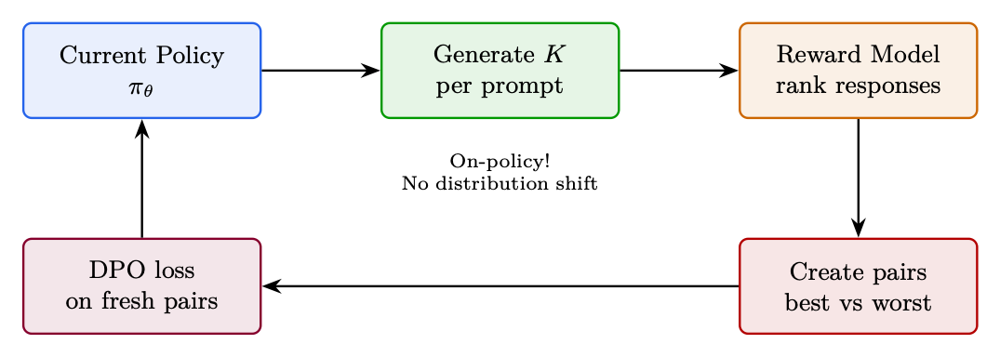

<div class="hh-guide">

<aside class="hh-part">
<p class="hh-part-title">第 II 部分 面向大语言模型的强化学习方法</p>
</aside>

本章涵盖一类方法，它们以不同的目标函数、数据假设或架构权衡来扩展或替换 DPO。每种方法都针对标准 offline DPO 的某个具体局限：分布偏移（Online DPO）、需要配对数据（KTO）、对噪声标签过拟合（IPO）、参考模型显存开销（ORPO）或训练复杂度（Best-of-N）。

## Online DPO

### 动机

标准 DPO 的主要局限：偏好数据由一个<em>不同的</em>模型生成（通常是较旧的 checkpoint，甚至是不同的模型族）。随着训练推进，policy 生成的文本与训练 pair 已完全不同 <math alttext="\rightarrow" display="inline"><semantics><mo stretchy="false">→</mo></semantics></math> loss 在一个无关分布上进行优化。

Online DPO 的解决方案[127]：每一步都从<em>当前</em> policy 生成新鲜的偏好 pair，用 reward model 判定，然后应用 DPO loss。

### 算法

<ol><li>从当前 <math alttext="\pi_{\theta}" display="inline"><semantics><msub><mi>π</mi><mi>θ</mi></msub></semantics></math> 为每个 prompt 生成 <math alttext="K" display="inline"><semantics><mi>K</mi></semantics></math> 条响应</li><li>用 reward model <math alttext="r_{\phi}" display="inline"><semantics><msub><mi>r</mi><mi>ϕ</mi></msub></semantics></math> 给所有响应打分</li><li>构造 pair：最高分 = chosen，最低分 = rejected</li><li>在这些新鲜 pair 上应用 DPO loss</li><li>重复（每步重新生成）</li></ol>

### TRL 实现

下面给出一个基于 HuggingFace TRL 的最小可运行示例。

```python
from trl import OnlineDPOConfig, OnlineDPOTrainer
from transformers import AutoModelForCausalLM, AutoModelForSequenceClassification

model = AutoModelForCausalLM.from_pretrained("meta-llama/Llama-3.1-8B-Instruct",
    torch_dtype=torch.bfloat16)
reward_model = AutoModelForSequenceClassification.from_pretrained(
    "RLHFlow/ArmoRM-Llama3-8B-v0.1", torch_dtype=torch.bfloat16)

online_dpo_config = OnlineDPOConfig(
    output_dir="./online_dpo_output",
    learning_rate=5e-7,
    beta=0.1,                    # DPO beta (same meaning as standard DPO)
    num_generations=4,           # K responses per prompt
    per_device_train_batch_size=4,
    gradient_accumulation_steps=4,
    max_new_tokens=512,
    temperature=0.7,
    bf16=True,
    num_train_epochs=1,
    logging_steps=10,
)

trainer = OnlineDPOTrainer(
    model=model,
    reward_model=reward_model,
    args=online_dpo_config,
    train_dataset=prompt_dataset,
    tokenizer=tokenizer,
)
trainer.train()
```

### Online DPO vs Offline DPO vs PPO

数据模型Loss最适合Offline DPO静态 pair2（policy + reference）DPO快速对齐、算力有限Online DPO从 <math alttext="\pi_{\theta}" display="inline"><semantics><msub><mi>π</mi><mi>θ</mi></msub></semantics></math> 新鲜采样3（policy + reference + reward model）DPO当 DPO 停滞、需要探索时PPO从 <math alttext="\pi_{\theta}" display="inline"><semantics><msub><mi>π</mi><mi>θ</mi></msub></semantics></math> 新鲜采样4（policy + reference + reward model + value head）PPO clip极致质量、复杂推理

## KTO ——Kahneman-Tversky Optimization

### 动机

DPO 需要<em>成对</em>的偏好数据：对同一 prompt，你既需要好的响应也需要坏的响应。实际上大多数反馈是<em>未配对</em>的：用户对单个响应给出点赞/点踩，没有匹配的 pair。

KTO 的洞见[86]：使用前景理论（来自行为经济学）。人类对损失的感受比对收益更强烈。“点踩”应当产生比“点赞”更强的 gradient。

### Loss 函数

<div class="hh-equation" id="ch8.e1"><math alttext="\boxed{\mathcal{L}_{\text{KTO}}=\mathbb{E}_{y_{w}}\left[\lambda_{w}(1-v(x,y_{w}))\right]+\mathbb{E}_{y_{l}}\left[\lambda_{l}\cdot v(x,y_{l})\right]}" display="block"><semantics><menclose notation="box"><mrow><msub><mi>ℒ</mi><mtext>KTO</mtext></msub><mo>=</mo><mrow><mrow><msub><mi>𝔼</mi><msub><mi>y</mi><mi>w</mi></msub></msub><mo lspace="0em" rspace="0em">​</mo><mrow><mo>[</mo><mrow><msub><mi>λ</mi><mi>w</mi></msub><mo lspace="0em" rspace="0em">​</mo><mrow><mo stretchy="false">(</mo><mrow><mn>1</mn><mo>−</mo><mrow><mi>v</mi><mo>⁡</mo><mrow><mo stretchy="false">(</mo><mi>x</mi><mo>,</mo><msub><mi>y</mi><mi>w</mi></msub><mo stretchy="false">)</mo></mrow></mrow></mrow><mo stretchy="false">)</mo></mrow></mrow><mo>]</mo></mrow></mrow><mo>+</mo><mrow><msub><mi>𝔼</mi><msub><mi>y</mi><mi>l</mi></msub></msub><mo lspace="0em" rspace="0em">​</mo><mrow><mo>[</mo><mrow><msub><mi>λ</mi><mi>l</mi></msub><mo lspace="0.222em" rspace="0.222em">⋅</mo><mrow><mi>v</mi><mo>⁡</mo><mrow><mo stretchy="false">(</mo><mi>x</mi><mo>,</mo><msub><mi>y</mi><mi>l</mi></msub><mo stretchy="false">)</mo></mrow></mrow></mrow><mo>]</mo></mrow></mrow></mrow></mrow></menclose></semantics></math><span class="hh-equation-number">(8.1)</span></div>

其中 <math alttext="v(x,y)=\sigma\left(\beta\log\frac{\pi_{\theta}(y|x)}{\pi_{\text{ref}}(y|x)}-z_{\text{ref}}\right)" display="inline"><semantics><mrow><mrow><mi>v</mi><mo>⁡</mo><mrow><mo stretchy="false">(</mo><mi>x</mi><mo>,</mo><mi>y</mi><mo stretchy="false">)</mo></mrow></mrow><mo>=</mo><mrow><mi>σ</mi><mo>⁡</mo><mrow><mo>(</mo><mrow><mrow><mi>β</mi><mo lspace="0.167em" rspace="0em">​</mo><mrow><mi>log</mi><mo lspace="0.167em">⁡</mo><mfrac><mrow><msub><mi>π</mi><mi>θ</mi></msub><mo lspace="0em" rspace="0em">​</mo><mrow><mo stretchy="false">(</mo><mi>y</mi><mo lspace="0em" rspace="0em">|</mo><mi>x</mi><mo stretchy="false">)</mo></mrow></mrow><mrow><msub><mi>π</mi><mtext>ref</mtext></msub><mo lspace="0em" rspace="0em">​</mo><mrow><mo stretchy="false">(</mo><mi>y</mi><mo lspace="0em" rspace="0em">|</mo><mi>x</mi><mo stretchy="false">)</mo></mrow></mrow></mfrac></mrow></mrow><mo>−</mo><msub><mi>z</mi><mtext>ref</mtext></msub></mrow><mo>)</mo></mrow></mrow></mrow></semantics></math>，<math alttext="z_{\text{ref}}" display="inline"><semantics><msub><mi>z</mi><mtext>ref</mtext></msub></semantics></math> 是期望 KL 散度（一个滑动 baseline）。

### TRL 实现

下面给出一个基于 HuggingFace TRL 的最小可运行示例。

```python
from trl import KTOConfig, KTOTrainer

# Dataset format: {"prompt": str, "completion": str, "label": bool}
# label=True for desirable, label=False for undesirable
kto_dataset = [
    {"prompt": "What's 2+2?", "completion": "The answer is 4.", "label": True},
    {"prompt": "What's 2+2?", "completion": "It might be 5.", "label": False},
]

kto_config = KTOConfig(
    output_dir="./kto_output",
    beta=0.1,
    desirable_weight=1.0,        # Weight for good examples
    undesirable_weight=1.0,      # Weight for bad examples (increase for loss aversion)
    learning_rate=5e-7,
    max_length=2048,
    per_device_train_batch_size=4,
    gradient_accumulation_steps=4,
    num_train_epochs=1,
    bf16=True,
)

trainer = KTOTrainer(
    model=model,
    ref_model=ref_model,  # Or None with LoRA
    args=kto_config,
    train_dataset=kto_dataset,
    tokenizer=tokenizer,
)
trainer.train()
```

### 何时选择 KTO

<ul><li>你有二值反馈，但<em>没有</em>匹配的 pair</li><li>大规模的生产点赞/点踩数据</li><li>某一类占主导（例如 90% 好、10% 坏）——KTO 对不平衡的处理更好</li><li>带噪声标签的快速迭代（比 DPO 对噪声更鲁棒）</li></ul>

## IPO ——Identity Preference Optimization

### 动机

DPO 存在一个退化解：只要把 chosen 与 rejected 之间的 margin 变得<em>无限大</em>，就能取得零 loss。实践中这意味着 DPO 过拟合——把 chosen 的概率推到 1、rejected 推到 0，记住训练数据。

IPO 的修正[14]：不用会饱和的 log-sigmoid，而使用平方 loss，其目标是某个<em>特定的</em> margin。loss 在有限的间隔处取到最小，而非在无穷处。

### Loss 函数

<div class="hh-equation" id="ch8.e2"><math alttext="\boxed{\mathcal{L}_{\text{IPO}}=\mathbb{E}\left[\left(\log\frac{\pi_{\theta}(y_{w}|x)}{\pi_{\text{ref}}(y_{w}|x)}-\log\frac{\pi_{\theta}(y_{l}|x)}{\pi_{\text{ref}}(y_{l}|x)}-\frac{1}{2\beta}\right)^{2}\right]}" display="block"><semantics><menclose notation="box"><mrow><msub><mi>ℒ</mi><mtext>IPO</mtext></msub><mo>=</mo><mrow><mi>𝔼</mi><mo>⁡</mo><mrow><mo>[</mo><msup><mrow><mo>(</mo><mrow><mrow><mi>log</mi><mo lspace="0.167em">⁡</mo><mfrac><mrow><msub><mi>π</mi><mi>θ</mi></msub><mo lspace="0em" rspace="0em">​</mo><mrow><mo stretchy="false">(</mo><msub><mi>y</mi><mi>w</mi></msub><mo lspace="0em" rspace="0em">|</mo><mi>x</mi><mo stretchy="false">)</mo></mrow></mrow><mrow><msub><mi>π</mi><mtext>ref</mtext></msub><mo lspace="0em" rspace="0em">​</mo><mrow><mo stretchy="false">(</mo><msub><mi>y</mi><mi>w</mi></msub><mo lspace="0em" rspace="0em">|</mo><mi>x</mi><mo stretchy="false">)</mo></mrow></mrow></mfrac></mrow><mo>−</mo><mrow><mi>log</mi><mo lspace="0.167em">⁡</mo><mfrac><mrow><msub><mi>π</mi><mi>θ</mi></msub><mo lspace="0em" rspace="0em">​</mo><mrow><mo stretchy="false">(</mo><msub><mi>y</mi><mi>l</mi></msub><mo lspace="0em" rspace="0em">|</mo><mi>x</mi><mo stretchy="false">)</mo></mrow></mrow><mrow><msub><mi>π</mi><mtext>ref</mtext></msub><mo lspace="0em" rspace="0em">​</mo><mrow><mo stretchy="false">(</mo><msub><mi>y</mi><mi>l</mi></msub><mo lspace="0em" rspace="0em">|</mo><mi>x</mi><mo stretchy="false">)</mo></mrow></mrow></mfrac></mrow><mo>−</mo><mfrac><mn>1</mn><mrow><mn>2</mn><mo lspace="0em" rspace="0em">​</mo><mi>β</mi></mrow></mfrac></mrow><mo>)</mo></mrow><mn>2</mn></msup><mo>]</mo></mrow></mrow></mrow></menclose></semantics></math><span class="hh-equation-number">(8.2)</span></div>

### TRL 实现

下面给出一个基于 HuggingFace TRL 的最小可运行示例。

```python
from trl import DPOConfig, DPOTrainer

# IPO is implemented as a DPO loss_type variant in TRL
ipo_config = DPOConfig(
    output_dir="./ipo_output",
    beta=0.1,
    loss_type="ipo",             # The key difference!
    learning_rate=5e-7,
    max_length=2048,
    per_device_train_batch_size=4,
    gradient_accumulation_steps=8,
    bf16=True,
    num_train_epochs=1,
)

trainer = DPOTrainer(
    model=model, ref_model=None, args=ipo_config,
    train_dataset=pref_dataset, tokenizer=tokenizer, peft_config=lora_config,
)
trainer.train()
```

### 何时选择 IPO 而非 DPO

<ul><li>噪声偏好数据（众包标注、AI 评判有误）</li><li>观察到 DPO 过拟合（train loss <math alttext="\to" display="inline"><semantics><mo stretchy="false">→</mo></semantics></math> 0，但 eval 退化）</li><li>想要更保守、更鲁棒的对齐</li><li>需要多个 epoch（DPO 在第 1 个 epoch 之后会退化；IPO 更稳定）</li></ul>

## ORPO ——Odds Ratio Preference Optimization

### 动机

到目前为止的所有方法都需要一个参考模型——要么作为独立副本（显存翻倍），要么通过 LoRA 隐式提供。ORPO [141] 把 SFT 与偏好对齐结合在单一 loss 中，从而彻底消除了参考模型。

关键洞见：用生成 chosen 与 rejected 的<em>几率比</em>作为偏好信号。SFT 组件天然防止坍缩（无需 KL 正则化）。

### Loss 函数

<div class="hh-equation" id="ch8.e3"><math alttext="\boxed{\mathcal{L}_{\text{ORPO}}=\underbrace{\mathcal{L}_{\text{SFT}}(y_{w})}_{\text{standard NLL on chosen}}-\lambda\cdot\underbrace{\log\sigma\left(\log\frac{\text{odds}_{\theta}(y_{w}|x)}{\text{odds}_{\theta}(y_{l}|x)}\right)}_{\text{preference alignment via odds ratio}}}" display="block"><semantics><menclose notation="box"><mrow><msub><mi>ℒ</mi><mtext>ORPO</mtext></msub><mo>=</mo><mrow><munder><munder accentunder="true"><mrow><msub><mi>ℒ</mi><mtext>SFT</mtext></msub><mo lspace="0em" rspace="0em">​</mo><mrow><mo stretchy="false">(</mo><msub><mi>y</mi><mi>w</mi></msub><mo stretchy="false">)</mo></mrow></mrow><mo stretchy="true">⏟</mo></munder><mtext>standard NLL on chosen</mtext></munder><mo>−</mo><mrow><mi>λ</mi><mo lspace="0.222em" rspace="0.222em">⋅</mo><munder><munder accentunder="true"><mrow><mi>log</mi><mo lspace="0.167em">⁡</mo><mrow><mi>σ</mi><mo>⁡</mo><mrow><mo>(</mo><mrow><mi>log</mi><mo lspace="0.167em">⁡</mo><mfrac><mrow><msub><mtext>odds</mtext><mi>θ</mi></msub><mo lspace="0em" rspace="0em">​</mo><mrow><mo stretchy="false">(</mo><msub><mi>y</mi><mi>w</mi></msub><mo lspace="0em" rspace="0em">|</mo><mi>x</mi><mo stretchy="false">)</mo></mrow></mrow><mrow><msub><mtext>odds</mtext><mi>θ</mi></msub><mo lspace="0em" rspace="0em">​</mo><mrow><mo stretchy="false">(</mo><msub><mi>y</mi><mi>l</mi></msub><mo lspace="0em" rspace="0em">|</mo><mi>x</mi><mo stretchy="false">)</mo></mrow></mrow></mfrac></mrow><mo>)</mo></mrow></mrow></mrow><mo stretchy="true">⏟</mo></munder><mtext>preference alignment via odds ratio</mtext></munder></mrow></mrow></mrow></menclose></semantics></math><span class="hh-equation-number">(8.3)</span></div>

其中 <math alttext="\text{odds}_{\theta}(y|x)=\frac{P_{\theta}(y|x)}{1-P_{\theta}(y|x)}" display="inline"><semantics><mrow><mrow><msub><mtext>odds</mtext><mi>θ</mi></msub><mo lspace="0em" rspace="0em">​</mo><mrow><mo stretchy="false">(</mo><mi>y</mi><mo lspace="0em" rspace="0em">|</mo><mi>x</mi><mo stretchy="false">)</mo></mrow></mrow><mo>=</mo><mfrac><mrow><msub><mi>P</mi><mi>θ</mi></msub><mo lspace="0em" rspace="0em">​</mo><mrow><mo stretchy="false">(</mo><mi>y</mi><mo lspace="0em" rspace="0em">|</mo><mi>x</mi><mo stretchy="false">)</mo></mrow></mrow><mrow><mn>1</mn><mo>−</mo><mrow><msub><mi>P</mi><mi>θ</mi></msub><mo lspace="0em" rspace="0em">​</mo><mrow><mo stretchy="false">(</mo><mi>y</mi><mo lspace="0em" rspace="0em">|</mo><mi>x</mi><mo stretchy="false">)</mo></mrow></mrow></mrow></mfrac></mrow></semantics></math>。

### TRL 实现

下面给出一个基于 HuggingFace TRL 的最小可运行示例。

```python
from trl import ORPOConfig, ORPOTrainer

orpo_config = ORPOConfig(
    output_dir="./orpo_output",
    beta=0.1,                    # Odds ratio weight (lambda)
    learning_rate=5e-7,
    max_length=2048,
    per_device_train_batch_size=2,
    gradient_accumulation_steps=8,
    bf16=True,
    num_train_epochs=1,
    gradient_checkpointing=True,
)

trainer = ORPOTrainer(
    model=model,                 # No ref_model needed!
    args=orpo_config,
    train_dataset=pref_dataset,  # Same format as DPO: prompt/chosen/rejected
    tokenizer=tokenizer,
    peft_config=lora_config,
)
trainer.train()
```

### 何时选择 ORPO

<ul><li>显存受限：无法承担参考模型副本（70B 模型可节省 70–140GB）</li><li>从 base model 开始（尚未做 SFT）——ORPO 同时完成 SFT</li><li>想要尽可能简单的流水线：一个模型、一个 loss、一次训练</li><li>从一开始就有好的偏好数据</li></ul>

## Best-of-N 采样（拒绝采样）

### 动机

有时最简单的方法反而胜出。Best-of-N [262] 在 RL 阶段<em>完全不需要训练</em>——只需生成多个候选并挑出其中最好的一个。

### 算法

<ol><li>对每个 prompt，从 policy 生成 <math alttext="N" display="inline"><semantics><mi>N</mi></semantics></math> 条响应（通常 <math alttext="N=4" display="inline"><semantics><mrow><mi>N</mi><mo>=</mo><mn>4</mn></mrow></semantics></math>–<math alttext="64" display="inline"><semantics><mn>64</mn></semantics></math>）</li><li>用 reward model 给所有响应打分</li><li>选择得分最高的响应</li><li>（可选）把选中的响应用作下一轮迭代的 SFT 数据</li></ol>

<div class="hh-equation" id="ch8.e4"><math alttext="\boxed{\text{Best-of-N response}:\quad y^{*}=\arg\max_{y_{i}\sim\pi_{\theta}(\cdot|x)}r_{\phi}(x,y_{i})}" display="block"><semantics><menclose notation="box"><mrow><mtext>Best-of-N response</mtext><mo lspace="0.278em" rspace="0.278em">:</mo><mi>y</mi><msup><mrow></mrow><mo>∗</mo></msup><mo>=</mo><mi>arg</mi><mi>max</mi><msub><mrow></mrow><mrow><mi>y</mi><msub><mrow></mrow><mi>i</mi></msub><mo>∼</mo><mi>π</mi><msub><mrow></mrow><mi>θ</mi></msub><mo stretchy="false">(</mo><mo lspace="0em" rspace="0em">⋅</mo><mo fence="false" rspace="0.167em" stretchy="false">|</mo><mi>x</mi><mo stretchy="false">)</mo></mrow></msub><mi>r</mi><msub><mrow></mrow><mi>ϕ</mi></msub><mo stretchy="false">(</mo><mi>x</mi><mo>,</mo><mi>y</mi><msub><mrow></mrow><mi>i</mi></msub><mo stretchy="false">)</mo></mrow></menclose></semantics></math><span class="hh-equation-number">(8.4)</span></div>

### TRL 实现

下面给出一个基于 HuggingFace TRL 的最小可运行示例。

```python
from transformers import pipeline
import numpy as np

# Inference-time Best-of-N (manual implementation)
gen_pipeline = pipeline("text-generation", model=model, tokenizer=tokenizer)

def best_of_n(prompt, n=16, temperature=0.8):
    """Generate N candidates and return the highest-reward one."""
    candidates = gen_pipeline(
        prompt, num_return_sequences=n,
        temperature=temperature, do_sample=True, max_new_tokens=512,
    )
    scores = [reward_model.score(prompt, c["generated_text"]) for c in candidates]
    return candidates[np.argmax(scores)]["generated_text"]

best_response = best_of_n(prompt, n=16)

# Training: Rejection Sampling Fine-Tuning (RFT)
from trl import SFTConfig, SFTTrainer

# Step 1: Generate and filter
all_responses = []
for prompt in prompts:
    candidates = [generate(prompt, temp=0.9) for _ in range(16)]
    scores = [reward_model.score(prompt, c) for c in candidates]
    best_idx = np.argmax(scores)
    if scores[best_idx] > threshold:  # Quality gate
        all_responses.append({"prompt": prompt, "completion": candidates[best_idx]})

# Step 2: SFT on best responses
sft_config = SFTConfig(output_dir="./rft_output", learning_rate=2e-5, num_train_epochs=2, max_seq_length=2048)
trainer = SFTTrainer(model=model, args=sft_config, train_dataset=all_responses, tokenizer=tokenizer)
trainer.train()
# Step 3: Repeat from Step 1 with updated model (iterative RFT)
```

### Best-of-N 的扩展律

<math alttext="N" display="inline"><semantics><mi>N</mi></semantics></math>质量收益成本说明1基线<math alttext="1\times" display="inline"><semantics><mrow><mn>1</mn><mo lspace="0.222em">×</mo></mrow></semantics></math>标准采样4+5–8% win-rate<math alttext="4\times" display="inline"><semantics><mrow><mn>4</mn><mo lspace="0.222em">×</mo></mrow></semantics></math>最低可用。成本/质量比良好16+10–15% win-rate<math alttext="16\times" display="inline"><semantics><mrow><mn>16</mn><mo lspace="0.222em">×</mo></mrow></semantics></math>很强。通常可媲美 PPO 的质量64+15–20% win-rate<math alttext="64\times" display="inline"><semantics><mrow><mn>64</mn><mo lspace="0.222em">×</mo></mrow></semantics></math>开始出现收益递减256+18–22% win-rate<math alttext="256\times" display="inline"><semantics><mrow><mn>256</mn><mo lspace="0.222em">×</mo></mrow></semantics></math>仅用于关键应用

## 总结：如何选择对齐方法

至此，我们已经完整考察了偏好优化与基于 RL 的对齐方法的整体图景。本节把关键权衡汇总成一份统一的参考，帮助从业者根据自己的约束条件选择合适的方案。

<div class="hh-table" id="ch8.t1"><table class="ltx_tabular ltx_align_middle"><thead><tr><th class="ltx_align_left"><span>方法</span></th><th class="ltx_align_left"><span>模型</span></th><th class="ltx_align_left"><span>数据</span></th><th class="ltx_align_left"><span>算力</span></th><th class="ltx_align_left"><span>稳定性</span></th><th class="ltx_align_left"><span>最适合</span></th></tr></thead><tbody><tr><th class="ltx_align_left"><span>PPO</span></th><th class="ltx_align_left"><span>4</span></th><td class="ltx_align_left"><span>Online（生成）</span></td><td class="ltx_align_left"><span>极高</span></td><td class="ltx_align_left"><span>低</span></td><td class="ltx_align_left"><span>极致质量、复杂推理</span></td></tr><tr><th class="ltx_align_left"><span>GRPO</span></th><th class="ltx_align_left"><span>2（无 critic）</span></th><td class="ltx_align_left"><span>Online（生成）</span></td><td class="ltx_align_left"><span>高</span></td><td class="ltx_align_left"><span>中</span></td><td class="ltx_align_left"><span>数学/代码（可验证奖励）</span></td></tr><tr><th class="ltx_align_left"><span>DPO</span></th><th class="ltx_align_left"><span>2</span></th><td class="ltx_align_left"><span>Offline pair</span></td><td class="ltx_align_left"><span>低</span></td><td class="ltx_align_left"><span>高</span></td><td class="ltx_align_left"><span>风格/安全、算力有限</span></td></tr><tr><th class="ltx_align_left"><span>Online DPO</span></th><th class="ltx_align_left"><span>3</span></th><td class="ltx_align_left"><span>Online（生成）</span></td><td class="ltx_align_left"><span>中</span></td><td class="ltx_align_left"><span>中–高</span></td><td class="ltx_align_left"><span>无分布偏移的 DPO</span></td></tr><tr><th class="ltx_align_left"><span>KTO</span></th><th class="ltx_align_left"><span>2</span></th><td class="ltx_align_left"><span>未配对二值</span></td><td class="ltx_align_left"><span>低</span></td><td class="ltx_align_left"><span>高</span></td><td class="ltx_align_left"><span>生产反馈、点赞/点踩</span></td></tr><tr><th class="ltx_align_left"><span>IPO</span></th><th class="ltx_align_left"><span>2</span></th><td class="ltx_align_left"><span>Offline pair</span></td><td class="ltx_align_left"><span>低</span></td><td class="ltx_align_left"><span>极高</span></td><td class="ltx_align_left"><span>噪声标签、抗过拟合</span></td></tr><tr><th class="ltx_align_left"><span>ORPO</span></th><th class="ltx_align_left"><span>1</span></th><td class="ltx_align_left"><span>Offline pair</span></td><td class="ltx_align_left"><span>极低</span></td><td class="ltx_align_left"><span>高</span></td><td class="ltx_align_left"><span>显存受限、SFT 与对齐合一</span></td></tr><tr><th class="ltx_align_left"><span>Best-of-N</span></th><th class="ltx_align_left"><span>1+RM</span></th><td class="ltx_align_left"><span>Online（生成）</span></td><td class="ltx_align_left"><span>中</span></td><td class="ltx_align_left"><span>完美</span></td><td class="ltx_align_left"><span>强基线、数据生成</span></td></tr></tbody></table><p class="hh-table-caption"><span class="hh-tag">表 8.1：</span>各种对齐方法的跨方法对比。</p></div>

<figure id="ch8.f1"><figcaption><span class="hh-tag">图 8.1：</span>近似的质量–算力前沿。位于 SFT 上限线之上的方法，其表现可超越仅靠监督微调所能达到的水平。位置仅为示意，且依模型而定。</figcaption></figure>

<aside class="hh-next">
<p class="hh-next-label">下一篇</p>
<p class="hh-next-title">第 9 章 奖励模型训练</p>
<p class="hh-next-hint">在「智能体 AI 漫游指南」分类下继续阅读。</p>
</aside>

</div>
