<div class="hh-guide">

<aside class="hh-part">
<p class="hh-part-title">第 II 部分 面向大语言模型的强化学习方法</p>
</aside>

用基于人类反馈的强化学习（Reinforcement Learning from Human Feedback, RLHF）训练 LLM，既是一道算法题，也是一道系统工程题。与标准的监督微调不同——后者只涉及单一模型、单次前向-反向传播，且扩展规律已被充分理解——RLHF 需要同时加载 <em>多个模型</em>（policy、reference、reward model、value head），通过复杂的 rollout-打分-训练循环加以协调，并分布到数十乃至数百块 GPU 上。本章覆盖让大规模 RLHF 训练成为可能的系统级细节：显存预算、并行策略（Data、Tensor、Pipeline、Sequence 及其组合）、生成瓶颈、解耦式架构、权重同步、容错以及生产监控。

## 模型显存挑战

<figure id="ch11.f1">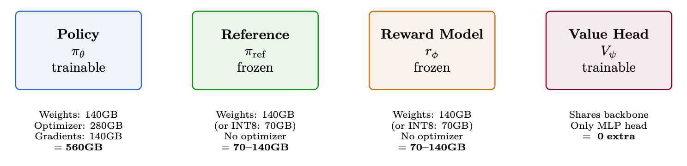<figcaption><span class="hh-tag">图 11.1：</span>70B PPO 显存预算：RLHF 所需的四个模型及其显存占用。合计 1470–1560GB。朴素方案最少需要 19–20 块 A100-80GB。使用 ZeRO-3 时：8 个节点即可装下。</figcaption></figure>

## 并行策略详解

训练大语言模型必须把计算分布到许多 GPU 上。可以沿多个本质不同的<em>维度</em>进行并行，每种都有各自的取舍。本节用数学公式、示意图和实践指引详细介绍每种策略。

<figure id="ch11.f2">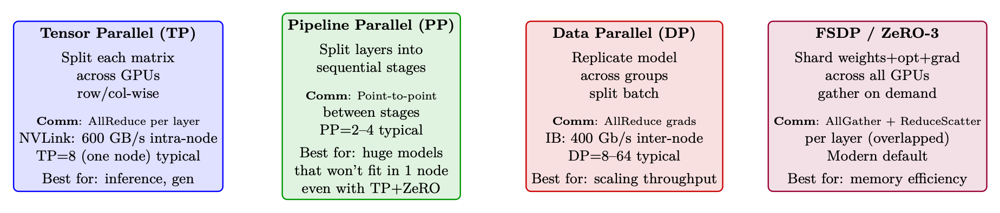<figcaption><span class="hh-tag">图 11.2：</span>四种并行策略概览。生产系统通常会同时组合其中 2–3 种。</figcaption></figure>

### 数据并行（Data Parallelism, DP）与分布式数据并行（Distributed Data Parallelism, DDP）

数据并行（Data Parallelism, DP）是最简单、也最常见的分布式训练形式 [210]。每块 GPU 持有模型的<em>完整副本</em>，处理不同的 mini-batch，并同步梯度。

单进程方案：一块“主”GPU 负责分发输入、汇集输出并广播梯度。受 GIL 以及到主 GPU 的 PCIe 带宽限制。

多进程方案：每块 GPU 各自运行一个进程。梯度在后台通过 ring-AllReduce [321] 同步，同时反向计算继续进行。

<figure id="ch11.f3">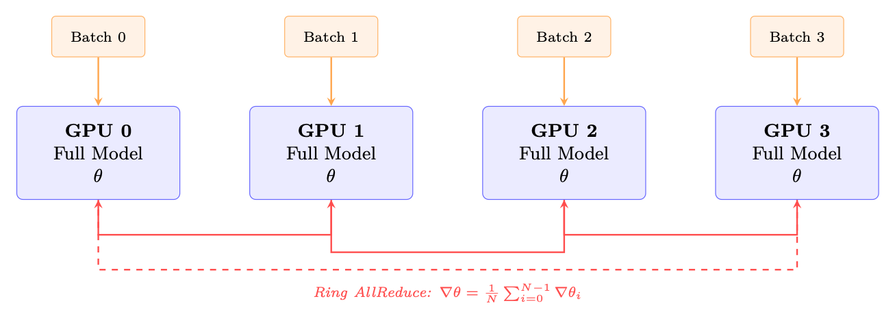<figcaption><span class="hh-tag">图 11.3：</span>DDP：每块 GPU 持有完整的模型副本并处理不同的 batch。梯度通过 ring AllReduce 取平均，并与反向计算重叠。</figcaption></figure>

DDP 的关键特性：

<ul><li>显存：每块 GPU 都要存储完整的模型 + 优化器 + 梯度。对于 70B BF16：<math alttext="\sim" display="inline"><semantics><mo>∼</mo></semantics></math>560 GB/GPU——如不做显存优化根本无法承受。</li><li>通信：每步对梯度张量做一次 AllReduce。大小 = 模型参数量 <math alttext="\times" display="inline"><semantics><mo>×</mo></semantics></math> 2 字节（BF16）。Ring AllReduce 开销：每 GPU 传输 <math alttext="2\cdot\frac{N-1}{N}\cdot M" display="inline"><semantics><mrow><mn>2</mn><mo lspace="0.222em" rspace="0.222em">⋅</mo><mfrac><mrow><mi>N</mi><mo>−</mo><mn>1</mn></mrow><mi>N</mi></mfrac><mo lspace="0.222em" rspace="0.222em">⋅</mo><mi>M</mi></mrow></semantics></math> 字节。</li><li>扩展性：在 <math alttext="\sim" display="inline"><semantics><mo>∼</mo></semantics></math>64 块 GPU 以内接近线性。超过之后通信开始占主导。</li><li>梯度分桶：DDP 把参数按桶分组（默认 25 MB），只要某个桶的梯度就绪就启动 AllReduce——让通信与反向计算重叠。</li></ul>

```python
import torch.distributed as dist
from torch.nn.parallel import DistributedDataParallel as DDP

dist.init_process_group(backend="nccl")  # NCCL for GPU communication
model = model.to(local_rank)
model = DDP(model, device_ids=[local_rank],
            gradient_as_bucket_view=True,    # Memory optimization
            static_graph=True)               # Enable comm optimizations
```

### 张量并行（Tensor Parallelism, TP）

张量并行（Tensor Parallelism, TP）沿用 Megatron-LM 风格 [327]，把<em>单个权重矩阵</em>切分到多块 GPU 上。每块 GPU 计算部分结果，再通过 AllReduce 合并。

权重矩阵 <math alttext="W\in\mathbb{R}^{d\times h}" display="inline"><semantics><mrow><mi>W</mi><mo>∈</mo><msup><mi>ℝ</mi><mrow><mi>d</mi><mo lspace="0.222em" rspace="0.222em">×</mo><mi>h</mi></mrow></msup></mrow></semantics></math> 按列切分到 <math alttext="T" display="inline"><semantics><mi>T</mi></semantics></math> 块 GPU 上：

<div class="hh-equation" id="ch11.e1"><math alttext="W=[W_{0}\;|\;W_{1}\;|\;\cdots\;|\;W_{T-1}],\quad W_{i}\in\mathbb{R}^{d\times h/T}" display="block"><semantics><mrow><mrow><mi>W</mi><mo>=</mo><mrow><mo stretchy="false">[</mo><mrow><msub><mi>W</mi><mn>0</mn></msub><mo fence="false" rspace="0.447em" stretchy="false">|</mo><mrow><msub><mi>W</mi><mn>1</mn></msub><mo lspace="0em" rspace="0em">​</mo><mrow><mo stretchy="false">|</mo><mo>⋯</mo><mo stretchy="false">|</mo></mrow><mo lspace="0.280em" rspace="0em">​</mo><msub><mi>W</mi><mrow><mi>T</mi><mo>−</mo><mn>1</mn></mrow></msub></mrow></mrow><mo stretchy="false">]</mo></mrow></mrow><mo rspace="1.167em">,</mo><mrow><msub><mi>W</mi><mi>i</mi></msub><mo>∈</mo><msup><mi>ℝ</mi><mrow><mrow><mi>d</mi><mo lspace="0.222em" rspace="0.222em">×</mo><mi>h</mi></mrow><mo>/</mo><mi>T</mi></mrow></msup></mrow></mrow></semantics></math><span class="hh-equation-number">(11.1)</span></div>

每块 GPU <math alttext="i" display="inline"><semantics><mi>i</mi></semantics></math> 独立计算 <math alttext="Y_{i}=XW_{i}" display="inline"><semantics><mrow><msub><mi>Y</mi><mi>i</mi></msub><mo>=</mo><mrow><mi>X</mi><mo lspace="0em" rspace="0em">​</mo><msub><mi>W</mi><mi>i</mi></msub></mrow></mrow></semantics></math>（无需通信）。输出沿 hidden 维度被切开。

权重矩阵按行切分：<math alttext="W=[W_{0};W_{1};\ldots;W_{T-1}]" display="inline"><semantics><mrow><mi>W</mi><mo>=</mo><mrow><mo stretchy="false">[</mo><mrow><msub><mi>W</mi><mn>0</mn></msub><mo>;</mo><msub><mi>W</mi><mn>1</mn></msub><mo>;</mo><mi mathvariant="normal">…</mi><mo>;</mo><msub><mi>W</mi><mrow><mi>T</mi><mo>−</mo><mn>1</mn></mrow></msub></mrow><mo stretchy="false">]</mo></mrow></mrow></semantics></math>，其中 <math alttext="W_{i}\in\mathbb{R}^{d/T\times h}" display="inline"><semantics><mrow><msub><mi>W</mi><mi>i</mi></msub><mo>∈</mo><msup><mi>ℝ</mi><mrow><mrow><mi>d</mi><mo>/</mo><mi>T</mi></mrow><mo lspace="0.222em" rspace="0.222em">×</mo><mi>h</mi></mrow></msup></mrow></semantics></math>。输入 <math alttext="X" display="inline"><semantics><mi>X</mi></semantics></math> 也必须切分。每块 GPU 计算一个部分和，再通过 AllReduce 得到最终输出。

<figure id="ch11.f4">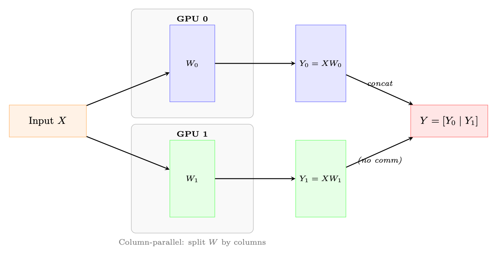<figcaption><span class="hh-tag">图 11.4：</span>列并行线性层（TP=2）。权重按列切开；每块 GPU 独立计算 <math alttext="XW_{i}" display="inline"><semantics><mrow><mi>X</mi><mo lspace="0em" rspace="0em">​</mo><msub><mi>W</mi><mi>i</mi></msub></mrow></semantics></math>。MLP 将其与行并行层配对，从而避免多余的 AllReduce。</figcaption></figure>

在 Transformer 层中，Megatron-LM 按以下方式应用 TP：

<ol><li>MLP：第一层线性（<math alttext="h\to 4h" display="inline"><semantics><mrow><mi>h</mi><mo stretchy="false">→</mo><mrow><mn>4</mn><mo lspace="0em" rspace="0em">​</mo><mi>h</mi></mrow></mrow></semantics></math>）列并行，第二层线性（<math alttext="4h\to h" display="inline"><semantics><mrow><mrow><mn>4</mn><mo lspace="0em" rspace="0em">​</mo><mi>h</mi></mrow><mo stretchy="false">→</mo><mi>h</mi></mrow></semantics></math>）行并行。行并行层之后做一次 AllReduce。</li><li>Attention：<math alttext="Q" display="inline"><semantics><mi>Q</mi></semantics></math>、<math alttext="K" display="inline"><semantics><mi>K</mi></semantics></math>、<math alttext="V" display="inline"><semantics><mi>V</mi></semantics></math> 投影做列并行（按 head 切到多块 GPU）。输出投影做行并行。输出投影之后做一次 AllReduce。</li><li>合计：每个 Transformer 层 2 次 AllReduce（attention 一次，MLP 一次）。</li></ol>

<figure id="ch11.f5">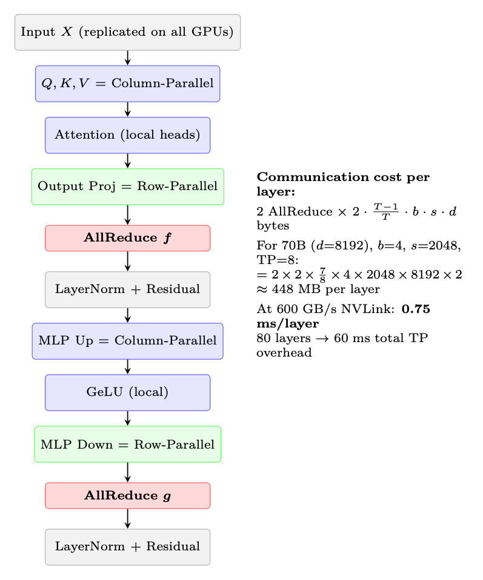<figcaption><span class="hh-tag">图 11.5：</span>单个 Transformer Block 中的张量并行通信模式。每个层需要两次 AllReduce 操作（图中标红）——attention 之后一次，MLP 之后一次。</figcaption></figure>

### 序列并行（Sequence Parallelism, SP）

序列并行（Sequence Parallelism, SP）[191] 解决了单靠张量并行无法处理的显存瓶颈：LayerNorm 与 Dropout 层中的激活显存。

在 TP 下，权重显存被切分到多块 GPU 上。但 LayerNorm 与 Dropout 作用于<em>完整</em>的 hidden 维度，并在每块 GPU 上复制。它们的激活值（反向传播需要）占用的显存与 <math alttext="b\times s\times d" display="inline"><semantics><mrow><mi>b</mi><mo lspace="0.222em" rspace="0.222em">×</mo><mi>s</mi><mo lspace="0.222em" rspace="0.222em">×</mo><mi>d</mi></mrow></semantics></math> 成正比——在每块 GPU 上都相同，不会因 TP 而减少。

对不需要跨 GPU 通信的操作（LayerNorm、Dropout、残差连接）按<em>序列维度</em>切分。对这些操作，每块 GPU 处理 <math alttext="s/T" display="inline"><semantics><mrow><mi>s</mi><mo>/</mo><mi>T</mi></mrow></semantics></math> 的序列切片，然后只在需要时（attention、线性层）才汇集完整序列。

<figure id="ch11.f6">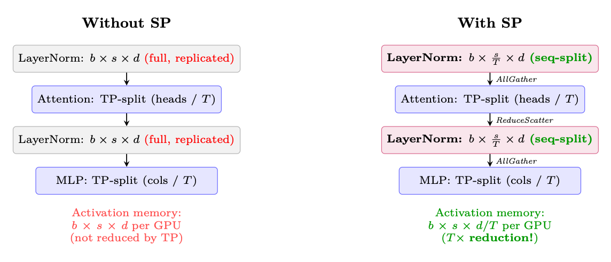<figcaption><span class="hh-tag">图 11.6：</span>序列并行沿序列维度切分，从而降低 LayerNorm/Dropout 的激活显存。通信（AllGather/ReduceScatter）取代了标准 TP 中使用的 AllReduce——传输的总字节数相同，但节省了显存。</figcaption></figure>

SP 带来的显存节省（70B 模型，TP=8，batch=4，seq=2048）：

<div class="hh-equation" id="ch11.e2"><math alttext="\text{Activation savings}=(T-1)\times b\times s\times d\times n_{\text{layers}}\times 2\text{ bytes}=7\times 4\times 2048\times 8192\times 80\times 2\approx\textbf{59 GB/GPU}" display="block"><semantics><mrow><mtext>Activation savings</mtext><mo>=</mo><mrow><mrow><mo stretchy="false">(</mo><mrow><mi>T</mi><mo>−</mo><mn>1</mn></mrow><mo rspace="0.055em" stretchy="false">)</mo></mrow><mo rspace="0.222em">×</mo><mi>b</mi><mo lspace="0.222em" rspace="0.222em">×</mo><mi>s</mi><mo lspace="0.222em" rspace="0.222em">×</mo><mi>d</mi><mo lspace="0.222em" rspace="0.222em">×</mo><msub><mi>n</mi><mtext>layers</mtext></msub><mo lspace="0.222em" rspace="0.222em">×</mo><mrow><mn>2</mn><mo lspace="0em" rspace="0em">​</mo><mtext> bytes</mtext></mrow></mrow><mo>=</mo><mrow><mn>7</mn><mo lspace="0.222em" rspace="0.222em">×</mo><mn>4</mn><mo lspace="0.222em" rspace="0.222em">×</mo><mn>2048</mn><mo lspace="0.222em" rspace="0.222em">×</mo><mn>8192</mn><mo lspace="0.222em" rspace="0.222em">×</mo><mn>80</mn><mo lspace="0.222em" rspace="0.222em">×</mo><mn>2</mn></mrow><mo>≈</mo><mtext>59 GB/GPU</mtext></mrow></semantics></math><span class="hh-equation-number">(11.2)</span></div>

### 流水线并行（Pipeline Parallelism, PP）

流水线并行（Pipeline Parallelism, PP）按层把模型<em>纵向</em>切开，把连续的若干层分配给不同的设备（stage）。激活值沿 stage 向前流动，梯度向后流动。

朴素的流水线执行会产生“气泡”——某个 stage 在等待上一 stage 的输入或下一 stage 的梯度时处于空闲：

<figure id="ch11.f7">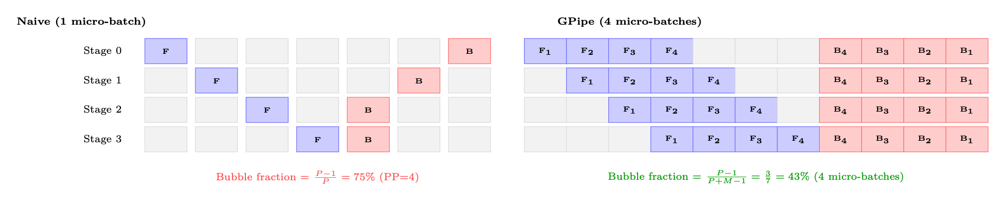<figcaption><span class="hh-tag">图 11.7：</span>流水线气泡对比。左：只有一个 micro-batch 的朴素流水线有 75% 的空闲时间。右：使用 <math alttext="M=4" display="inline"><semantics><mrow><mi>M</mi><mo>=</mo><mn>4</mn></mrow></semantics></math> 个 micro-batch 的 GPipe 显著减少了气泡。当 <math alttext="M\gg P" display="inline"><semantics><mrow><mi>M</mi><mo>≫</mo><mi>P</mi></mrow></semantics></math> 时，气泡占比趋近于零。</figcaption></figure>

对于 <math alttext="P" display="inline"><semantics><mi>P</mi></semantics></math> 个流水线 stage 和每步 <math alttext="M" display="inline"><semantics><mi>M</mi></semantics></math> 个 micro-batch：

<div class="hh-equation" id="ch11.e3"><math alttext="\text{Bubble fraction}=\frac{P-1}{P+M-1}\approx\frac{P-1}{M}\quad\text{(when }M\gg P\text{)}" display="block"><semantics><mrow><mrow><mtext>Bubble fraction</mtext><mo>=</mo><mfrac><mrow><mi>P</mi><mo>−</mo><mn>1</mn></mrow><mrow><mrow><mi>P</mi><mo>+</mo><mi>M</mi></mrow><mo>−</mo><mn>1</mn></mrow></mfrac><mo>≈</mo><mfrac><mrow><mi>P</mi><mo>−</mo><mn>1</mn></mrow><mi>M</mi></mfrac></mrow><mspace width="1em"></mspace><mrow><mrow><mtext>(when </mtext><mo lspace="0em" rspace="0em">​</mo><mi>M</mi></mrow><mo>≫</mo><mrow><mi>P</mi><mo lspace="0em" rspace="0em">​</mo><mtext>)</mtext></mrow></mrow></mrow></semantics></math><span class="hh-equation-number">(11.3)</span></div>

要让气泡开销 <math alttext="&lt;" display="inline"><semantics><mo>&lt;</mo></semantics></math>10%，需要 <math alttext="M\geq 10\cdot(P-1)" display="inline"><semantics><mrow><mi>M</mi><mo>≥</mo><mrow><mn>10</mn><mo lspace="0.222em" rspace="0.222em">⋅</mo><mrow><mo stretchy="false">(</mo><mrow><mi>P</mi><mo>−</mo><mn>1</mn></mrow><mo stretchy="false">)</mo></mrow></mrow></mrow></semantics></math>。对于 PP=4：至少 30 个 micro-batch。

<div class="hh-table" id="ch11.t1"><table class="ltx_tabular ltx_align_middle"><thead><tr><th class="ltx_align_left"><span>调度方案</span></th><th class="ltx_align_left ltx_align_top"><span class="ltx_align_top"><span><span>气泡</span></span></span></th><th class="ltx_align_left ltx_align_top"><span class="ltx_align_top"><span><span>显存</span></span></span></th><th class="ltx_align_left ltx_align_top"><span class="ltx_align_top"><span><span>特点</span></span></span></th></tr></thead><tbody><tr><th class="ltx_align_left">GPipe</th><td class="ltx_align_left ltx_align_top"><span class="ltx_align_top"><span><math alttext="\frac{P-1}{M+P-1}" display="inline"><semantics><mfrac><mrow><mi>P</mi><mo>−</mo><mn>1</mn></mrow><mrow><mrow><mi>M</mi><mo>+</mo><mi>P</mi></mrow><mo>−</mo><mn>1</mn></mrow></mfrac><span></span></semantics></math></span></span></td><td class="ltx_align_left ltx_align_top"><span class="ltx_align_top"><span><math alttext="M\times" display="inline"><semantics><mrow><mi>M</mi><mo lspace="0.222em">×</mo></mrow><span></span></semantics></math> 个激活值</span></span></td><td class="ltx_align_left ltx_align_top"><span class="ltx_align_top"><span>简单；先全部前向再全部反向 <span>[152]</span></span></span></td></tr><tr><th class="ltx_align_left">1F1B</th><td class="ltx_align_left ltx_align_top"><span class="ltx_align_top"><span><math alttext="\frac{P-1}{M+P-1}" display="inline"><semantics><mfrac><mrow><mi>P</mi><mo>−</mo><mn>1</mn></mrow><mrow><mrow><mi>M</mi><mo>+</mo><mi>P</mi></mrow><mo>−</mo><mn>1</mn></mrow></mfrac><span></span></semantics></math></span></span></td><td class="ltx_align_left ltx_align_top"><span class="ltx_align_top"><span><math alttext="P\times" display="inline"><semantics><mrow><mi>P</mi><mo lspace="0.222em">×</mo></mrow><span></span></semantics></math> 个激活值</span></span></td><td class="ltx_align_left ltx_align_top"><span class="ltx_align_top"><span>交错执行；稳态显存有界 <span>[263]</span></span></span></td></tr><tr><th class="ltx_align_left">交错式 1F1B</th><td class="ltx_align_left ltx_align_top"><span class="ltx_align_top"><span><math alttext="\frac{P-1}{M\cdot V+P-1}" display="inline"><semantics><mfrac><mrow><mi>P</mi><mo>−</mo><mn>1</mn></mrow><mrow><mrow><mrow><mi>M</mi><mo lspace="0.222em" rspace="0.222em">⋅</mo><mi>V</mi></mrow><mo>+</mo><mi>P</mi></mrow><mo>−</mo><mn>1</mn></mrow></mfrac><span></span></semantics></math></span></span></td><td class="ltx_align_left ltx_align_top"><span class="ltx_align_top"><span><math alttext="P\times" display="inline"><semantics><mrow><mi>P</mi><mo lspace="0.222em">×</mo></mrow><span></span></semantics></math> 个激活值</span></span></td><td class="ltx_align_left ltx_align_top"><span class="ltx_align_top"><span>虚拟 stage（<math alttext="V" display="inline"><semantics><mi>V</mi><span></span></semantics></math>）；进一步减少气泡 <span>[264]</span></span></span></td></tr><tr><th class="ltx_align_left">零气泡（Zero-Bubble, ZB-H1）</th><td class="ltx_align_left ltx_align_top"><span class="ltx_align_top"><span><math alttext="\approx 0" display="inline"><semantics><mrow><mphantom></mphantom><mo>≈</mo><mn>0</mn></mrow><span></span></semantics></math></span></span></td><td class="ltx_align_left ltx_align_top"><span class="ltx_align_top"><span><math alttext="P\times" display="inline"><semantics><mrow><mi>P</mi><mo lspace="0.222em">×</mo></mrow><span></span></semantics></math> 个激活值</span></span></td><td class="ltx_align_left ltx_align_top"><span class="ltx_align_top"><span>把反向拆分为 B 和 W 两个阶段 <span>[296]</span></span></span></td></tr></tbody></table><p class="hh-table-caption"><span class="hh-tag">表 11.1：</span>流水线调度策略</p></div>

与 TP（AllReduce）不同，PP 只需要相邻 stage 之间点对点地通信激活值：

<div class="hh-equation" id="ch11.e4"><math alttext="\text{Data per transfer}=b_{\text{micro}}\times s\times d\times 2\text{ bytes (BF16)}" display="block"><semantics><mrow><mtext>Data per transfer</mtext><mo>=</mo><mrow><msub><mi>b</mi><mtext>micro</mtext></msub><mo lspace="0.222em" rspace="0.222em">×</mo><mi>s</mi><mo lspace="0.222em" rspace="0.222em">×</mo><mi>d</mi><mo lspace="0.222em" rspace="0.222em">×</mo><mrow><mn>2</mn><mo lspace="0em" rspace="0em">​</mo><mtext> bytes (BF16)</mtext></mrow></mrow></mrow></semantics></math><span class="hh-equation-number">(11.4)</span></div>

对于 micro-batch=4、seq=2048、<math alttext="d" display="inline"><semantics><mi>d</mi></semantics></math>=8192：每次传输 <math alttext="4\times 2048\times 8192\times 2=128" display="inline"><semantics><mrow><mrow><mn>4</mn><mo lspace="0.222em" rspace="0.222em">×</mo><mn>2048</mn><mo lspace="0.222em" rspace="0.222em">×</mo><mn>8192</mn><mo lspace="0.222em" rspace="0.222em">×</mo><mn>2</mn></mrow><mo>=</mo><mn>128</mn></mrow></semantics></math> MB。在 InfiniBand 50 GB/s 下：每次传输 2.6 ms——相对于每个 stage 的计算量而言很小。

并非所有层的计算量都相同：

<ul><li>嵌入（Embedding）层：非常廉价（查表）。</li><li>Transformer Block：计算量均匀。</li><li>最后的 LM head：中等（词表投影需要大型矩阵乘法）。</li></ul>

为中间的 stage 分配更多 Transformer 层，为首尾 stage 分配更少，以平衡计算量。

### 完全分片数据并行（Fully Sharded Data Parallelism, FSDP / ZeRO-3）

完全分片数据并行（Fully Sharded Data Parallelism, FSDP）[431]（PyTorch）与 ZeRO-3 [304]（DeepSpeed）解决了 DDP 固有的显存重复问题：不再让每块 GPU 都持有参数、梯度和优化器状态的完整副本，而是每块 GPU 只持有 <math alttext="1/N" display="inline"><semantics><mrow><mn>1</mn><mo>/</mo><mi>N</mi></mrow></semantics></math> 的切片，并在需要时按需重建完整张量。

<figure id="ch11.f8">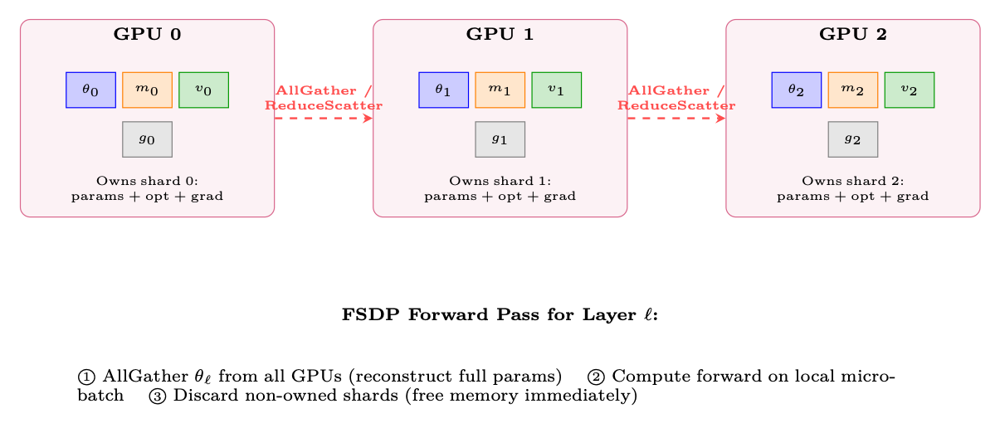<figcaption><span class="hh-tag">图 11.8：</span>FSDP 把全部模型状态分片到各 GPU 上。每块 GPU 持有参数、优化器状态和梯度的 <math alttext="1/N" display="inline"><semantics><mrow><mn>1</mn><mo>/</mo><mi>N</mi></mrow></semantics></math>。在每一层计算之前，完整参数通过 AllGather 按需重建。</figcaption></figure>

FSDP 每层的执行流程：

<ol><li>前向：AllGather 参数 <math alttext="\rightarrow" display="inline"><semantics><mo stretchy="false">→</mo></semantics></math> 计算 <math alttext="\rightarrow" display="inline"><semantics><mo stretchy="false">→</mo></semantics></math> 丢弃非本 GPU 拥有的分片。</li><li>反向：（再次）AllGather 参数 <math alttext="\rightarrow" display="inline"><semantics><mo stretchy="false">→</mo></semantics></math> 计算梯度 <math alttext="\rightarrow" display="inline"><semantics><mo stretchy="false">→</mo></semantics></math> ReduceScatter 梯度（每块 GPU 得到自己的梯度分片）<math alttext="\rightarrow" display="inline"><semantics><mo stretchy="false">→</mo></semantics></math> 丢弃非本 GPU 拥有的参数分片。</li><li>优化器步：每块 GPU 只用自己的梯度分片和优化器状态更新自己拥有的分片。</li></ol>

<div class="hh-table" id="ch11.t2"><table class="ltx_tabular ltx_align_middle"><thead><tr><th class="ltx_align_left"><span>策略</span></th><th class="ltx_align_left ltx_align_top"><span class="ltx_align_top"><span><span>分片对象</span></span></span></th><th class="ltx_align_left ltx_align_top"><span class="ltx_align_top"><span><span>每 GPU 显存</span></span></span></th><th class="ltx_align_left ltx_align_top"><span class="ltx_align_top"><span><span>通信</span></span></span></th></tr></thead><tbody><tr><th class="ltx_align_left">DDP（不分片）</th><td class="ltx_align_left ltx_align_top"><span class="ltx_align_top"><span>无</span></span></td><td class="ltx_align_left ltx_align_top"><span class="ltx_align_top"><span>1120 GB <math alttext="\times" display="inline"><semantics><mo>×</mo><span></span></semantics></math></span></span></td><td class="ltx_align_left ltx_align_top"><span class="ltx_align_top"><span>AllReduce（仅梯度）</span></span></td></tr><tr><th class="ltx_align_left">ZeRO-1</th><td class="ltx_align_left ltx_align_top"><span class="ltx_align_top"><span>优化器状态</span></span></td><td class="ltx_align_left ltx_align_top"><span class="ltx_align_top"><span>385 GB <math alttext="\times" display="inline"><semantics><mo>×</mo><span></span></semantics></math></span></span></td><td class="ltx_align_left ltx_align_top"><span class="ltx_align_top"><span>AllReduce（梯度）</span></span></td></tr><tr><th class="ltx_align_left">ZeRO-2</th><td class="ltx_align_left ltx_align_top"><span class="ltx_align_top"><span>优化器 + 梯度</span></span></td><td class="ltx_align_left ltx_align_top"><span class="ltx_align_top"><span>368 GB <math alttext="\times" display="inline"><semantics><mo>×</mo><span></span></semantics></math></span></span></td><td class="ltx_align_left ltx_align_top"><span class="ltx_align_top"><span>AllReduce（梯度）</span></span></td></tr><tr><th class="ltx_align_left">ZeRO-3 / FSDP</th><td class="ltx_align_left ltx_align_top"><span class="ltx_align_top"><span>全部</span></span></td><td class="ltx_align_left ltx_align_top"><span class="ltx_align_top"><span><span>140 GB</span> ✓</span></span></td><td class="ltx_align_left ltx_align_top"><span class="ltx_align_top"><span>AllGather + ReduceScatter（每层）</span></span></td></tr></tbody></table><p class="hh-table-caption"><span class="hh-tag">表 11.2：</span>显存对比：DDP 与 FSDP/ZeRO 各阶段（70B 模型，8 块 GPU）。基线：BF16 参数（140 GB）+ BF16 梯度（140 GB）+ FP32 主权重 + m + v（840 GB）= 每块 GPU 1120 GB。</p></div>

```python
from functools import partial
from torch.distributed.fsdp import FullyShardedDataParallel as FSDP
from torch.distributed.fsdp import ShardingStrategy, MixedPrecision, BackwardPrefetch
from torch.distributed.fsdp.wrap import transformer_auto_wrap_policy
from transformers.models.llama.modeling_llama import LlamaDecoderLayer

# Wrap model with FSDP
auto_wrap = partial(transformer_auto_wrap_policy,
                    transformer_layer_cls={LlamaDecoderLayer})
mp_policy = MixedPrecision(
    param_dtype=torch.bfloat16,
    reduce_dtype=torch.bfloat16,
    buffer_dtype=torch.bfloat16,
)

model = FSDP(
    model,
    sharding_strategy=ShardingStrategy.FULL_SHARD,  # ZeRO-3
    mixed_precision=mp_policy,
    auto_wrap_policy=auto_wrap,  # Wrap each transformer layer
    use_orig_params=True,        # Required for torch.compile compatibility
    limit_all_gathers=True,      # Bound peak memory (1 AllGather in flight at a time)
    forward_prefetch=True,       # Prefetch next layer's params during current layer
    backward_prefetch=BackwardPrefetch.BACKWARD_PRE,  # Prefetch during backward
)
```

### 3D 并行：组合多种策略

规模化生产系统（70B+）会同时组合 TP、PP 和 DP/FSDP：

<figure id="ch11.f9">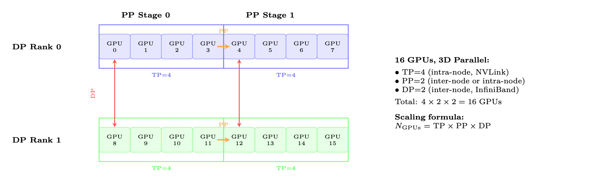<figcaption><span class="hh-tag">图 11.9：</span>16 块 GPU 的 3D 并行布局：TP=4（每个框内，使用 NVLink）、PP=2（橙色箭头，stage）、DP=2（红色箭头，梯度同步）。每个维度利用通信层级中的不同层次。</figcaption></figure>

<div class="hh-table" id="ch11.t3"><table class="ltx_tabular ltx_align_middle"><thead><tr><th class="ltx_align_left"><span>策略</span></th><th class="ltx_align_left"><span>切分对象</span></th><th class="ltx_align_left"><span>通信</span></th><th class="ltx_align_left"><span>扩展上限</span></th><th class="ltx_align_left"><span>开销</span></th><th class="ltx_align_left"><span>适用场景</span></th></tr></thead><tbody><tr><td class="ltx_align_left"><span>DP/DDP</span></td><td class="ltx_align_left"><span>Batch</span></td><td class="ltx_align_left"><span>AllReduce（梯度）</span></td><td class="ltx_align_left"><math alttext="\sim" display="inline"><semantics><mo mathsize="0.800em">∼</mo><span></span></semantics></math><span>64 块 GPU</span></td><td class="ltx_align_left"><span>5–10%</span></td><td class="ltx_align_left"><span>模型能放进 1 块 GPU</span></td></tr><tr><td class="ltx_align_left"><span>FSDP</span></td><td class="ltx_align_left"><span>参数+优化器+梯度</span></td><td class="ltx_align_left"><span>AllGather+RS</span></td><td class="ltx_align_left"><span>数百块 GPU</span></td><td class="ltx_align_left"><span>10–20%</span></td><td class="ltx_align_left"><span><math alttext="&gt;" display="inline"><semantics><mo>&gt;</mo><span></span></semantics></math>13B 的默认选择</span></td></tr><tr><td class="ltx_align_left"><span>TP</span></td><td class="ltx_align_left"><span>权重矩阵</span></td><td class="ltx_align_left"><span>AllReduce（每层 2 次）</span></td><td class="ltx_align_left"><span>8 块 GPU（1 个节点）</span></td><td class="ltx_align_left"><span>12–18%</span></td><td class="ltx_align_left"><span>大模型推理+训练</span></td></tr><tr><td class="ltx_align_left"><span>SP</span></td><td class="ltx_align_left"><span>激活值（序列）</span></td><td class="ltx_align_left"><span>复用 TP 的通信</span></td><td class="ltx_align_left"><span>与 TP 相同</span></td><td class="ltx_align_left"><math alttext="\approx" display="inline"><semantics><mo mathsize="0.800em">≈</mo><span></span></semantics></math><span>额外 0%</span></td><td class="ltx_align_left"><span>总是与 TP 一起使用</span></td></tr><tr><td class="ltx_align_left"><span>PP</span></td><td class="ltx_align_left"><span>层（stage）</span></td><td class="ltx_align_left"><span>点对点</span></td><td class="ltx_align_left"><math alttext="\sim" display="inline"><semantics><mo mathsize="0.800em">∼</mo><span></span></semantics></math><span>16 个 stage</span></td><td class="ltx_align_left"><span>15–30%</span></td><td class="ltx_align_left"><span>仅限 100B+ 模型</span></td></tr></tbody></table><p class="hh-table-caption"><span class="hh-tag">表 11.3：</span>并行策略对比汇总</p></div>

### 解耦 DiLoCo：跨数据中心训练

传统分布式训练假定存在高带宽互连——单一数据中心内 100+ Gbps 的 InfiniBand。这一要求使得用标准互联网链路跨地理分布的数据中心进行训练变得不可能。Decoupled DiLoCo[113]（Google DeepMind，2026 年 4 月）打破了这一假设，使利用商用带宽进行跨区域大规模训练成为可能。

Decoupled DiLoCo 在此基础上进一步解耦外层同步：工作节点不必同时同步。跨区域的更新改为异步进行，由协调者在更新到达时施加外层更新。这样就能容忍广域网时延的波动。

## 生成瓶颈：定量分析

<div class="hh-table" id="ch11.t4"><table class="ltx_tabular ltx_align_middle"><thead><tr><th class="ltx_align_left"><span>配置</span></th><th class="ltx_align_left"><span>Batch</span></th><th class="ltx_align_left"><span>每 batch 耗时</span></th><th class="ltx_align_left"><span>Tok/s/GPU</span></th><th class="ltx_align_left"><span>说明</span></th></tr></thead><tbody><tr><td class="ltx_align_left"><span>TP=1, batch=1</span></td><td class="ltx_align_left"><span>1</span></td><td class="ltx_align_left"><span>36s</span></td><td class="ltx_align_left"><span>14</span></td><td class="ltx_align_left"><span>基线，最差情况</span></td></tr><tr><td class="ltx_align_left"><span>TP=4, batch=1</span></td><td class="ltx_align_left"><span>1</span></td><td class="ltx_align_left"><span>9s</span></td><td class="ltx_align_left"><span>57</span></td><td class="ltx_align_left"><span>生成本身的线性 TP 扩展</span></td></tr><tr><td class="ltx_align_left"><span>TP=4, batch=32</span></td><td class="ltx_align_left"><span>32</span></td><td class="ltx_align_left"><span>15s</span></td><td class="ltx_align_left"><span>1092</span></td><td class="ltx_align_left"><span>接近最优的批处理</span></td></tr><tr><td class="ltx_align_left"><span>TP=4, batch=128, vLLM</span></td><td class="ltx_align_left"><span>128</span></td><td class="ltx_align_left"><span>45s</span></td><td class="ltx_align_left"><span>1456</span></td><td class="ltx_align_left"><span>连续批处理</span></td></tr><tr><td class="ltx_align_left"><span>TP=4, batch=128, INT8</span></td><td class="ltx_align_left"><span>128</span></td><td class="ltx_align_left"><span>25s</span></td><td class="ltx_align_left"><span>2621</span></td><td class="ltx_align_left"><span>带宽节省 2<math alttext="\times" display="inline"><semantics><mo>×</mo><span></span></semantics></math></span></td></tr></tbody></table><p class="hh-table-caption"><span class="hh-tag">表 11.4：</span>70B 模型的生成吞吐（512 个 token，各种配置）</p></div>

优化组合（累计加速比）：

<ol><li>vLLM + PagedAttention[196]（2–4<math alttext="\times" display="inline"><semantics><mo>×</mo></semantics></math>）：消除键值缓存的碎片，支持更大的 batch</li><li>连续批处理[412]（1.5–2<math alttext="\times" display="inline"><semantics><mo>×</mo></semantics></math>）：不必等待最长的序列，别的序列一完成就启动新序列</li><li>投机解码[206]（2–3<math alttext="\times" display="inline"><semantics><mo>×</mo></semantics></math>）：小的草稿模型先提出 5 个 token，大模型用一次前向传播进行验证。平均接受 3–4 个。</li><li>生成使用 INT8/FP8 权重（2<math alttext="\times" display="inline"><semantics><mo>×</mo></semantics></math>）：带宽需求减半。由于是在采样（而非为训练计算精确 logits），质量损失很小</li><li>CUDA graph（1.1–1.3<math alttext="\times" display="inline"><semantics><mo>×</mo></semantics></math>）：消除固定形状操作的 kernel 启动开销</li><li>前缀缓存（共享前缀的 prompt 为 1.5<math alttext="\times" display="inline"><semantics><mo>×</mo></semantics></math>）：不必重新计算 system prompt 的键值缓存</li></ol>

```python
# Production vLLM generation setup
from vllm import LLM, SamplingParams

engine = LLM(
    model="./policy_checkpoint",
    tensor_parallel_size=4,           # TP=4 per instance
    gpu_memory_utilization=0.92,      # Leave headroom for KV cache
    max_num_batched_tokens=16384,     # Max tokens in flight
    max_num_seqs=256,                 # Max concurrent sequences
    dtype="bfloat16",
    enable_prefix_caching=True,       # Cache system prompt KV
    speculative_model="./draft_1B",   # Speculative decoding
    num_speculative_tokens=5,
    block_size=16,                    # PagedAttention block size
    swap_space=4,                     # GB swap space for preemption
)

# Generate responses for RLHF batch
sampling_params = SamplingParams(
    temperature=0.7, top_p=0.9, max_tokens=512,
    logprobs=1,  # Need log-probs for PPO ratio calculation
)
outputs = engine.generate(prompts, sampling_params)
# Extract: responses, log_probs for each token (needed for PPO/GRPO)
```

## 解耦式架构：生产级设计

DeepSpeed-Chat [410] 和 OpenRLHF [148] 等生产级 RLHF 系统采用解耦式架构，把生成、打分和训练分离到可独立扩展的集群中。

<figure id="ch11.f10">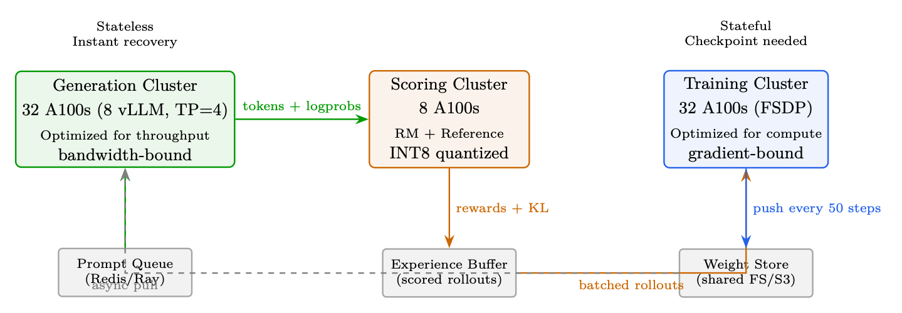<figcaption><span class="hh-tag">图 11.10：</span>解耦式 RLHF 架构。每个集群针对自身负载进行优化。打分后的 rollout 先累积在经验缓冲区中，再由训练消费。</figcaption></figure>

## 权重同步策略

策略过时率带宽质量影响同步（每一步）0 步140 GB/step理想但太慢周期性（每 50 步）平均 25 步摊销后 2.8 GB/step<math alttext="&lt;" display="inline"><semantics><mo mathsize="0.900em">&lt;</mo></semantics></math>2% 质量损失增量压缩（INT8）平均 25 步0.4 GB/step<math alttext="&lt;" display="inline"><semantics><mo mathsize="0.900em">&lt;</mo></semantics></math>3% 质量损失异步流式5–10 步14 GB/step（后台）<math alttext="&lt;" display="inline"><semantics><mo mathsize="0.900em">&lt;</mo></semantics></math>1% 质量损失

## 显存优化技术

ZeRO 阶段分片对象每 GPU 显存（70B，8 块 GPU）无（数据并行）无（完整副本）每 GPU 560GB（不可行）ZeRO-1仅优化器状态175GBZeRO-2优化器状态 + 梯度105GBZeRO-3（FSDP）优化器 + 梯度 + 参数70GB（能放进 A100-80GB！）

其他技术：

<ul><li>梯度检查点[49]：不必保存全部激活值，在反向传播时重新计算。可节省 <math alttext="\sim" display="inline"><semantics><mo>∼</mo></semantics></math>60% 的激活显存，代价是多出 <math alttext="\sim" display="inline"><semantics><mo>∼</mo></semantics></math>33% 的计算量。可选择性地只对 attention 层做检查点（显存占用大），保留 FFN 激活值（重新计算代价高）。</li><li>混合精度[255]：前向用 BF16（每参数 2 字节），优化器状态用 FP32（m、v 各 4 字节）。主权重用 FP32 做累加。</li><li>CPU 卸载（ZeRO-Infinity [305]）：把优化器状态移到 CPU 内存。可节省 50% 显存，但会慢 2–3<math alttext="\times" display="inline"><semantics><mo>×</mo></semantics></math>（PCIe 64GB/s 瓶颈）。</li><li>激活值卸载：前向时把激活值移到 CPU，反向时再取回。仅在显存真正吃紧时使用。</li><li>Flash Attention[64, 65]：attention 的显存为 O(<math alttext="n" display="inline"><semantics><mi>n</mi></semantics></math>) 而不是 O(<math alttext="n^{2}" display="inline"><semantics><msup><mi>n</mi><mn>2</mn></msup></semantics></math>)。速度快 2–4<math alttext="\times" display="inline"><semantics><mo>×</mo></semantics></math>，且对长序列能大幅节省显存。</li></ul>

### FlashAttention 对 RLHF 的影响

```python
# DeepSpeed ZeRO-3 configuration for 70B RLHF training
ds_config = {
    "bf16": {"enabled": True},
    "zero_optimization": {
        "stage": 3,
        "overlap_comm": True,                    # Overlap communication with compute
        "contiguous_gradients": True,            # Better memory layout
        "reduce_scatter": True,                  # More efficient than allreduce
        "reduce_bucket_size": 5e7,               # 50M params per bucket
        "prefetch_bucket_size": 5e7,             # Prefetch next bucket
        "param_persistence_threshold": 1e5,      # Keep small params on all GPUs
        "offload_optimizer": {"device": "cpu", "pin_memory": True},  # CPU offload
        "sub_group_size": 1e9,                   # Reduce fragmentation
    },
    "gradient_accumulation_steps": 4,
    "gradient_clipping": 1.0,
    "train_micro_batch_size_per_gpu": 2,
    "wall_clock_breakdown": True,
}
```

## 大规模容错

生产级容错栈：

<ol><li>探测：NCCL 超时（60s）、GPU 心跳（10s）、NVML 健康监控、ECC 错误计数。</li><li>Checkpoint：每 50–100 步异步保存。非阻塞（后台线程）。保存内容：模型权重、优化器状态（Adam m/v）、调度器状态、RNG 状态、KL 系数、replay buffer。保留最近 3 个 checkpoint。耗时：<math alttext="\sim" display="inline"><semantics><mo>∼</mo></semantics></math>70B 约 30s（并行写入 NVMe）。</li><li>恢复：(a) 生成集群无状态，直接重启并加载最新权重。(b) 训练集群：加载 checkpoint，剔除故障节点重建 NCCL 进程组，重新分配 FSDP 分片，从最近 checkpoint 续训。</li><li>弹性训练：Torch Elastic / Kubernetes 自动扩缩。几分钟内替换故障节点。训练以 <math alttext="N-1" display="inline"><semantics><mrow><mi>N</mi><mo>−</mo><mn>1</mn></mrow></semantics></math> 块 GPU 暂时继续。</li><li>预防：训练前做 GPU 健康预筛（跑 GEMM 压测）。热备机待命。冗余网络通路（双轨 InfiniBand）。</li></ol>

## 端到端延迟拆解

<figure id="ch11.f11">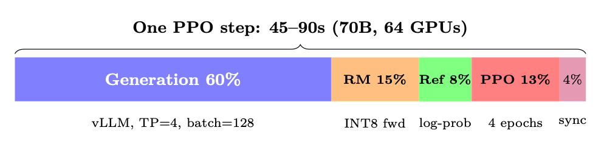<figcaption><span class="hh-tag">图 11.11：</span>不重叠（单体式）。解耦后：生成与训练重叠，实际加速 1.4<math alttext="\times" display="inline"><semantics><mo>×</mo></semantics></math>。</figcaption></figure>

阶段用时（70B）受限于优化手段生成（128<math alttext="\times" display="inline"><semantics><mo>×</mo></semantics></math>512 tok）30–45s显存带宽vLLM、推测解码、INT8Reward 打分5–8s算力（批量前向）INT8 RM、batch=128Reference log-prob4–6s算力（批量前向）INT8 ref，或 LoRA（免费）PPO 更新（4 个 epoch）8–12s算力（反向）FSDP、FlashAttention权重同步0–3s网络（异步）Delta 压缩、异步合计（单体式）50–75s合计（解耦 + 重叠）35–50s生成与上一步训练重叠

## 监控与可观测性

## 网络拓扑与通信模式

高效的分布式训练要求理解连接 GPU 的分层通信网络。现代集群采用两级架构：超高速的节点内链路，以及较慢但可扩展的节点间网络。

### 节点内：NVLink 与 NVSwitch

<div class="hh-table" id="ch11.t5"><table class="ltx_tabular ltx_align_middle"><thead><tr><th class="ltx_align_left"><span>代际</span></th><th class="ltx_align_left ltx_align_top"><span class="ltx_align_top"><span><span>每链路带宽</span></span></span></th><th class="ltx_align_left ltx_align_top"><span class="ltx_align_top"><span><span>每 GPU 链路数</span></span></span></th><th class="ltx_align_left ltx_align_top"><span class="ltx_align_top"><span><span>总带宽</span></span></span></th><th class="ltx_align_left ltx_align_top"><span class="ltx_align_top"><span><span>平台</span></span></span></th></tr></thead><tbody><tr><th class="ltx_align_left">NVLink 3.0</th><td class="ltx_align_left ltx_align_top"><span class="ltx_align_top"><span>50 GB/s</span></span></td><td class="ltx_align_left ltx_align_top"><span class="ltx_align_top"><span>12</span></span></td><td class="ltx_align_left ltx_align_top"><span class="ltx_align_top"><span>600 GB/s</span></span></td><td class="ltx_align_left ltx_align_top"><span class="ltx_align_top"><span>A100（DGX A100）</span></span></td></tr><tr><th class="ltx_align_left">NVLink 4.0</th><td class="ltx_align_left ltx_align_top"><span class="ltx_align_top"><span>50 GB/s</span></span></td><td class="ltx_align_left ltx_align_top"><span class="ltx_align_top"><span>18</span></span></td><td class="ltx_align_left ltx_align_top"><span class="ltx_align_top"><span>900 GB/s</span></span></td><td class="ltx_align_left ltx_align_top"><span class="ltx_align_top"><span>H100（DGX H100）</span></span></td></tr><tr><th class="ltx_align_left">NVLink 5.0</th><td class="ltx_align_left ltx_align_top"><span class="ltx_align_top"><span>100 GB/s</span></span></td><td class="ltx_align_left ltx_align_top"><span class="ltx_align_top"><span>18</span></span></td><td class="ltx_align_left ltx_align_top"><span class="ltx_align_top"><span>1800 GB/s</span></span></td><td class="ltx_align_left ltx_align_top"><span class="ltx_align_top"><span>B200（DGX B200）</span></span></td></tr></tbody></table><p class="hh-table-caption"><span class="hh-tag">表 11.5：</span>NVLink 各代及其对 LLM 训练的影响</p></div>

在单个节点内（通常 8 块 GPU），NVSwitch 在任意 GPU 对之间提供全二分带宽（full-bisection bandwidth）。这意味着任意 GPU 可以同时以全 NVLink 速率与任意其他 GPU 通信——这对张量并行（Tensor Parallelism）至关重要，因为每层都需要在 8 块 GPU 间做 AllReduce。

### 节点间：InfiniBand 与 RoCE

对于跨节点的 FSDP/ZeRO-3 AllGather 与 ReduceScatter 操作，节点间网络是主导因素。

<div class="hh-table" id="ch11.t6"><table class="ltx_tabular ltx_align_middle"><thead><tr><th class="ltx_align_left"><span>技术</span></th><th class="ltx_align_left"><span>带宽</span></th><th class="ltx_align_left"><span>延迟</span></th><th class="ltx_align_left"><span>备注</span></th></tr></thead><tbody><tr><td class="ltx_align_left"><span>InfiniBand NDR</span></td><td class="ltx_align_left"><span>400 Gb/s（50 GB/s）</span></td><td class="ltx_align_left"><span>1–2 <math alttext="\mu" display="inline"><semantics><mi>μ</mi><span></span></semantics></math>s</span></td><td class="ltx_align_left"><span>黄金标准，RDMA，无损</span></td></tr><tr><td class="ltx_align_left"><span>InfiniBand NDR（双轨）</span></td><td class="ltx_align_left"><span>800 Gb/s（100 GB/s）</span></td><td class="ltx_align_left"><span>1–2 <math alttext="\mu" display="inline"><semantics><mi>μ</mi><span></span></semantics></math>s</span></td><td class="ltx_align_left"><span>用于 H100 集群</span></td></tr><tr><td class="ltx_align_left"><span>RoCE v2</span></td><td class="ltx_align_left"><span>100–400 Gb/s</span></td><td class="ltx_align_left"><span>2–5 <math alttext="\mu" display="inline"><semantics><mi>μ</mi><span></span></semantics></math>s</span></td><td class="ltx_align_left"><span>更便宜，需要 PFC/ECN 调优</span></td></tr><tr><td class="ltx_align_left"><span>Ethernet（TCP）</span></td><td class="ltx_align_left"><span>100–400 Gb/s</span></td><td class="ltx_align_left"><span>10–50 <math alttext="\mu" display="inline"><semantics><mi>μ</mi><span></span></semantics></math>s</span></td><td class="ltx_align_left"><span>不适用于 <math alttext="&gt;" display="inline"><semantics><mo>&gt;</mo><span></span></semantics></math>16 GPU 的训练</span></td></tr></tbody></table><p class="hh-table-caption"><span class="hh-tag">表 11.6：</span>LLM 训练集群的节点间网络选项</p></div>

### 通信原语及其代价

理解每种集合通信在何时被使用，有助于诊断瓶颈：

<div class="hh-table" id="ch11.t7"><table class="ltx_tabular ltx_align_middle"><thead><tr><th class="ltx_align_left"><span>集合通信</span></th><th class="ltx_align_left ltx_align_top"><span class="ltx_align_top"><span><span>数据量</span></span></span></th><th class="ltx_align_left ltx_align_top"><span class="ltx_align_top"><span><span>使用方</span></span></span></th><th class="ltx_align_left ltx_align_top"><span class="ltx_align_top"><span><span>使用时机</span></span></span></th></tr></thead><tbody><tr><th class="ltx_align_left">AllReduce</th><td class="ltx_align_left ltx_align_top"><span class="ltx_align_top"><span><math alttext="2\cdot\frac{N-1}{N}\cdot M" display="inline"><semantics><mrow><mn>2</mn><mo lspace="0.222em" rspace="0.222em">⋅</mo><mfrac><mrow><mi>N</mi><mo>−</mo><mn>1</mn></mrow><mi>N</mi></mfrac><mo lspace="0.222em" rspace="0.222em">⋅</mo><mi>M</mi></mrow><span></span></semantics></math></span></span></td><td class="ltx_align_left ltx_align_top"><span class="ltx_align_top"><span>TP、DP</span></span></td><td class="ltx_align_left ltx_align_top"><span class="ltx_align_top"><span>在各 GPU 间对梯度或激活求和</span></span></td></tr><tr><th class="ltx_align_left">AllGather</th><td class="ltx_align_left ltx_align_top"><span class="ltx_align_top"><span><math alttext="\frac{N-1}{N}\cdot M" display="inline"><semantics><mrow><mfrac><mrow><mi>N</mi><mo>−</mo><mn>1</mn></mrow><mi>N</mi></mfrac><mo lspace="0.222em" rspace="0.222em">⋅</mo><mi>M</mi></mrow><span></span></semantics></math></span></span></td><td class="ltx_align_left ltx_align_top"><span class="ltx_align_top"><span>FSDP 前向</span></span></td><td class="ltx_align_left ltx_align_top"><span class="ltx_align_top"><span>在 matmul 之前重建完整参数张量</span></span></td></tr><tr><th class="ltx_align_left">ReduceScatter</th><td class="ltx_align_left ltx_align_top"><span class="ltx_align_top"><span><math alttext="\frac{N-1}{N}\cdot M" display="inline"><semantics><mrow><mfrac><mrow><mi>N</mi><mo>−</mo><mn>1</mn></mrow><mi>N</mi></mfrac><mo lspace="0.222em" rspace="0.222em">⋅</mo><mi>M</mi></mrow><span></span></semantics></math></span></span></td><td class="ltx_align_left ltx_align_top"><span class="ltx_align_top"><span>FSDP 反向</span></span></td><td class="ltx_align_left ltx_align_top"><span class="ltx_align_top"><span>反向传播后分发梯度分片</span></span></td></tr><tr><th class="ltx_align_left">广播（Broadcast）</th><td class="ltx_align_left ltx_align_top"><span class="ltx_align_top"><span><math alttext="M" display="inline"><semantics><mi>M</mi><span></span></semantics></math></span></span></td><td class="ltx_align_left ltx_align_top"><span class="ltx_align_top"><span>PP</span></span></td><td class="ltx_align_left ltx_align_top"><span class="ltx_align_top"><span>将激活发送到下一个流水线阶段</span></span></td></tr><tr><th class="ltx_align_left">Send/Recv</th><td class="ltx_align_left ltx_align_top"><span class="ltx_align_top"><span><math alttext="M" display="inline"><semantics><mi>M</mi><span></span></semantics></math></span></span></td><td class="ltx_align_left ltx_align_top"><span class="ltx_align_top"><span>PP</span></span></td><td class="ltx_align_left ltx_align_top"><span class="ltx_align_top"><span>相邻阶段之间的点对点通信</span></span></td></tr></tbody></table><p class="hh-table-caption"><span class="hh-tag">表 11.7：</span>分布式 LLM 训练中的 NCCL 集合通信操作</p></div>

其中 <math alttext="M" display="inline"><semantics><mi>M</mi></semantics></math> 是消息大小（字节），<math alttext="N" display="inline"><semantics><mi>N</mi></semantics></math> 是参与方数量。

### 网络拓扑设计

生产集群采用 胖树（fat-tree） 或 轨道优化（rail-optimized） 拓扑：

<ul><li>胖树（fat-tree）：每一层都具备全二分带宽。任意节点都能以全速与任意其他节点通信。成本高（交换机数量多），但灵活性最大。</li><li>轨道优化（rail-optimized）：每个节点上的 GPU <math alttext="i" display="inline"><semantics><mi>i</mi></semantics></math> 都连接到同一台叶子交换机（「轨道 <math alttext="i" display="inline"><semantics><mi>i</mi></semantics></math>」）。同一轨道内的 AllReduce 代价低，跨轨道流量代价高。Meta 的 RSC 与 Google 的 TPU pod 采用了这种设计。</li><li>3D torus / Dragonfly：用于 HPC 集群（Frontier、Aurora）。拓扑感知的任务放置至关重要。</li></ul>

## 训练吞吐与模型 FLOPs 利用率

### 衡量训练效率：MFU

模型 FLOPs 利用率（Model FLOPs Utilization, MFU）[55] 是衡量训练效率的标准指标：

<div class="hh-equation" id="ch11.e5"><math alttext="\text{MFU}=\frac{\text{Observed throughput (tokens/sec)}\times\text{FLOPs per token}}{\text{Peak hardware FLOPS}}" display="block"><semantics><mrow><mtext>MFU</mtext><mo>=</mo><mfrac><mrow><mtext>Observed throughput (tokens/sec)</mtext><mo lspace="0.222em" rspace="0.222em">×</mo><mtext>FLOPs per token</mtext></mrow><mtext>Peak hardware FLOPS</mtext></mfrac></mrow></semantics></math><span class="hh-equation-number">(11.5)</span></div>

对于一个有 <math alttext="P" display="inline"><semantics><mi>P</mi></semantics></math> 个参数、序列长度为 <math alttext="s" display="inline"><semantics><mi>s</mi></semantics></math>、batch size 为 <math alttext="b" display="inline"><semantics><mi>b</mi></semantics></math> 的 transformer：

<div class="hh-equation" id="ch11.e6"><math alttext="\text{FLOPs per token}\approx 6P+12\cdot n_{\text{layers}}\cdot d_{\text{model}}\cdot s" display="block"><semantics><mrow><mtext>FLOPs per token</mtext><mo>≈</mo><mrow><mrow><mn>6</mn><mo lspace="0em" rspace="0em">​</mo><mi>P</mi></mrow><mo>+</mo><mrow><mn>12</mn><mo lspace="0.222em" rspace="0.222em">⋅</mo><msub><mi>n</mi><mtext>layers</mtext></msub><mo lspace="0.222em" rspace="0.222em">⋅</mo><msub><mi>d</mi><mtext>model</mtext></msub><mo lspace="0.222em" rspace="0.222em">⋅</mo><mi>s</mi></mrow></mrow></mrow></semantics></math><span class="hh-equation-number">(11.6)</span></div>

系数 6 来自：2（乘加）<math alttext="\times" display="inline"><semantics><mo>×</mo></semantics></math> 3（前向 + 反向，其中反向 <math alttext="\approx 2\times" display="inline"><semantics><mrow><mo>≈</mo><mn>2</mn><mo lspace="0.222em">×</mo></mrow></semantics></math> 前向）。第二项对应 attention 的 <math alttext="O(s^{2})" display="inline"><semantics><mrow><mi>O</mi><mo>⁡</mo><mrow><mo stretchy="false">(</mo><msup><mi>s</mi><mn>2</mn></msup><mo stretchy="false">)</mo></mrow></mrow></semantics></math> 开销。

<div class="hh-table" id="ch11.t8"><table class="ltx_tabular ltx_align_middle"><thead><tr><th class="ltx_align_left"><span>模型</span></th><th class="ltx_align_left ltx_align_top"><span class="ltx_align_top"><span><span>硬件</span></span></span></th><th class="ltx_align_left ltx_align_top"><span class="ltx_align_top"><span><span>MFU</span></span></span></th><th class="ltx_align_left ltx_align_top"><span class="ltx_align_top"><span><span>Tokens/秒/GPU</span></span></span></th><th class="ltx_align_left ltx_align_top"><span class="ltx_align_top"><span><span>配置</span></span></span></th></tr></thead><tbody><tr><th class="ltx_align_left">LLaMA-7B</th><td class="ltx_align_left ltx_align_top"><span class="ltx_align_top"><span>8<math alttext="\times" display="inline"><semantics><mo>×</mo><span></span></semantics></math>A100</span></span></td><td class="ltx_align_left ltx_align_top"><span class="ltx_align_top"><span>57%</span></span></td><td class="ltx_align_left ltx_align_top"><span class="ltx_align_top"><span>3,200</span></span></td><td class="ltx_align_left ltx_align_top"><span class="ltx_align_top"><span>FSDP、FlashAttn、BF16</span></span></td></tr><tr><th class="ltx_align_left">LLaMA-13B</th><td class="ltx_align_left ltx_align_top"><span class="ltx_align_top"><span>16<math alttext="\times" display="inline"><semantics><mo>×</mo><span></span></semantics></math>A100</span></span></td><td class="ltx_align_left ltx_align_top"><span class="ltx_align_top"><span>52%</span></span></td><td class="ltx_align_left ltx_align_top"><span class="ltx_align_top"><span>1,750</span></span></td><td class="ltx_align_left ltx_align_top"><span class="ltx_align_top"><span>FSDP、FlashAttn、BF16</span></span></td></tr><tr><th class="ltx_align_left">LLaMA-70B</th><td class="ltx_align_left ltx_align_top"><span class="ltx_align_top"><span>64<math alttext="\times" display="inline"><semantics><mo>×</mo><span></span></semantics></math>A100</span></span></td><td class="ltx_align_left ltx_align_top"><span class="ltx_align_top"><span>45%</span></span></td><td class="ltx_align_left ltx_align_top"><span class="ltx_align_top"><span>380</span></span></td><td class="ltx_align_left ltx_align_top"><span class="ltx_align_top"><span>FSDP+TP=8、FlashAttn</span></span></td></tr><tr><th class="ltx_align_left">GPT-4（估计值）</th><td class="ltx_align_left ltx_align_top"><span class="ltx_align_top"><span>10,000+ H100</span></span></td><td class="ltx_align_left ltx_align_top"><span class="ltx_align_top"><span>40–50%</span></span></td><td class="ltx_align_left ltx_align_top"><span class="ltx_align_top"><span>—</span></span></td><td class="ltx_align_left ltx_align_top"><span class="ltx_align_top"><span>3D 并行</span></span></td></tr><tr><th class="ltx_align_left">PaLM-540B</th><td class="ltx_align_left ltx_align_top"><span class="ltx_align_top"><span>6144 TPUv4</span></span></td><td class="ltx_align_left ltx_align_top"><span class="ltx_align_top"><span>46%</span></span></td><td class="ltx_align_left ltx_align_top"><span class="ltx_align_top"><span>—</span></span></td><td class="ltx_align_left ltx_align_top"><span class="ltx_align_top"><span>DP+TP+PP</span></span></td></tr></tbody></table><p class="hh-table-caption"><span class="hh-tag">表 11.8：</span>不同规模与硬件下的 MFU 基准</p></div>

### 算力最优的 batch 设计

有效 batch size 与硬件利用率之间的相互作用并不直观：

<div class="hh-equation" id="ch11.e7"><math alttext="\text{Effective batch size}=\text{micro\_batch}\times\text{grad\_accum}\times\text{DP degree}" display="block"><semantics><mrow><mtext>Effective batch size</mtext><mo>=</mo><mrow><mtext>micro_batch</mtext><mo lspace="0.222em" rspace="0.222em">×</mo><mtext>grad_accum</mtext><mo lspace="0.222em" rspace="0.222em">×</mo><mtext>DP degree</mtext></mrow></mrow></semantics></math><span class="hh-equation-number">(11.7)</span></div>

<ul><li>过小：GPU 利用率不足（算术强度低），通信占主导。</li><li>过大：每个 Token 的学习收益递减（超过临界 batch size），浪费算力。</li><li>最佳区间：即 <em>临界 batch size（critical batch size）</em><math alttext="B_{\text{crit}}" display="inline"><semantics><msub><mi>B</mi><mtext>crit</mtext></msub></semantics></math>，此时梯度噪声与梯度信号相当。对 LLM 而言，为 <math alttext="B_{\text{crit}}\sim 1" display="inline"><semantics><mrow><msub><mi>B</mi><mtext>crit</mtext></msub><mo>∼</mo><mn>1</mn></mrow></semantics></math>–<math alttext="4" display="inline"><semantics><mn>4</mn></semantics></math>M Token [250]。</li></ul>

具体到 RLHF，batch 中包含的是 <em>rollout</em>（而不只是 Token）：

<div class="hh-equation" id="ch11.e8"><math alttext="\text{RLHF batch}=N_{\text{prompts}}\times K_{\text{generations}}\times L_{\text{avg response length}}" display="block"><semantics><mrow><mtext>RLHF batch</mtext><mo>=</mo><mrow><msub><mi>N</mi><mtext>prompts</mtext></msub><mo lspace="0.222em" rspace="0.222em">×</mo><msub><mi>K</mi><mtext>generations</mtext></msub><mo lspace="0.222em" rspace="0.222em">×</mo><msub><mi>L</mi><mtext>avg response length</mtext></msub></mrow></mrow></semantics></math><span class="hh-equation-number">(11.8)</span></div>

典型的生产取值：<math alttext="N=128" display="inline"><semantics><mrow><mi>N</mi><mo>=</mo><mn>128</mn></mrow></semantics></math> 个 prompt，<math alttext="K=1" display="inline"><semantics><mrow><mi>K</mi><mo>=</mo><mn>1</mn></mrow></semantics></math>–<math alttext="4" display="inline"><semantics><mn>4</mn></semantics></math> 条生成结果，<math alttext="L=256" display="inline"><semantics><mrow><mi>L</mi><mo>=</mo><mn>256</mn></mrow></semantics></math>–<math alttext="512" display="inline"><semantics><mn>512</mn></semantics></math> 个 Token，<math alttext="\rightarrow" display="inline"><semantics><mo stretchy="false">→</mo></semantics></math> 每步 32K–256K Token。

### Profiling 与瓶颈诊断

关键 profiling 工具及其能揭示的问题：

工具采集内容最适用场景<code>torch.profiler</code>kernel 耗时、显存定位慢算子与显存泄漏NVIDIA Nsight Systems完整 GPU 时间线可视化重叠情况与 kernel 间的空隙<code>nccl_debug=INFO</code>集合通信的大小/耗时诊断通信瓶颈<code>torch.cuda.memory_stats</code>内存分配模式定位碎片与峰值占用DeepSpeed Flops Profiler逐层 FLOPs识别负载不均衡<code>py-spy</code> / <code>scalene</code>CPU profiling数据加载、分词瓶颈

## 成本分析与云端部署

理解 RLHF 训练的经济性对规划至关重要。

### 硬件成本对比

<div class="hh-table" id="ch11.t9"><table class="ltx_tabular ltx_align_middle"><thead><tr><th class="ltx_align_left"><span>GPU</span></th><th class="ltx_align_left ltx_align_top"><span class="ltx_align_top"><span><span>按需/小时</span></span></span></th><th class="ltx_align_left ltx_align_top"><span class="ltx_align_top"><span><span>Spot/小时</span></span></span></th><th class="ltx_align_left ltx_align_top"><span class="ltx_align_top"><span><span>显存</span></span></span></th><th class="ltx_align_left ltx_align_top"><span class="ltx_align_top"><span><span>适用场景</span></span></span></th></tr></thead><tbody><tr><th class="ltx_align_left">A100 80GB</th><td class="ltx_align_left ltx_align_top"><span class="ltx_align_top"><span>$2.50–3.50</span></span></td><td class="ltx_align_left ltx_align_top"><span class="ltx_align_top"><span>$1.00–1.50</span></span></td><td class="ltx_align_left ltx_align_top"><span class="ltx_align_top"><span>80 GB HBM2e</span></span></td><td class="ltx_align_left ltx_align_top"><span class="ltx_align_top"><span>预算有限的训练、生成集群</span></span></td></tr><tr><th class="ltx_align_left">H100 80GB</th><td class="ltx_align_left ltx_align_top"><span class="ltx_align_top"><span>$4.00–6.00</span></span></td><td class="ltx_align_left ltx_align_top"><span class="ltx_align_top"><span>$2.00–3.00</span></span></td><td class="ltx_align_left ltx_align_top"><span class="ltx_align_top"><span>80 GB HBM3</span></span></td><td class="ltx_align_left ltx_align_top"><span class="ltx_align_top"><span>生产训练</span></span></td></tr><tr><th class="ltx_align_left">H200 141GB</th><td class="ltx_align_left ltx_align_top"><span class="ltx_align_top"><span>$6.00–8.00</span></span></td><td class="ltx_align_left ltx_align_top"><span class="ltx_align_top"><span>—</span></span></td><td class="ltx_align_left ltx_align_top"><span class="ltx_align_top"><span>141 GB HBM3e</span></span></td><td class="ltx_align_left ltx_align_top"><span class="ltx_align_top"><span>大上下文、少 GPU 的配置</span></span></td></tr><tr><th class="ltx_align_left">MI300X 192GB</th><td class="ltx_align_left ltx_align_top"><span class="ltx_align_top"><span>$3.50–5.00</span></span></td><td class="ltx_align_left ltx_align_top"><span class="ltx_align_top"><span>$1.50–2.50</span></span></td><td class="ltx_align_left ltx_align_top"><span class="ltx_align_top"><span>192 GB HBM3</span></span></td><td class="ltx_align_left ltx_align_top"><span class="ltx_align_top"><span>高性价比替代方案</span></span></td></tr></tbody></table><p class="hh-table-caption"><span class="hh-tag">表 11.9：</span>RLHF 训练的云 GPU 大致成本（2024–2025 年价格）</p></div>

### RLHF 训练成本估算

<div class="hh-equation" id="ch11.e9"><math alttext="\text{Cost}=\frac{N_{\text{steps}}\times T_{\text{step}}}{3600}\times N_{\text{GPUs}}\times C_{\text{GPU/hr}}" display="block"><semantics><mrow><mtext>Cost</mtext><mo>=</mo><mrow><mfrac><mrow><msub><mi>N</mi><mtext>steps</mtext></msub><mo lspace="0.222em" rspace="0.222em">×</mo><msub><mi>T</mi><mtext>step</mtext></msub></mrow><mn>3600</mn></mfrac><mo lspace="0.222em" rspace="0.222em">×</mo><msub><mi>N</mi><mtext>GPUs</mtext></msub><mo lspace="0.222em" rspace="0.222em">×</mo><msub><mi>C</mi><mtext>GPU/hr</mtext></msub></mrow></mrow></semantics></math><span class="hh-equation-number">(11.9)</span></div>

### 成本优化策略

<ul><li>Spot/可抢占实例：可节省 50–70%。需要健壮的 checkpoint 机制（每 5 分钟保存一次）。</li><li>规格匹配：生成（显存带宽受限）不要用 H100；推理场景下 A100 的每美元 Token 数与 H100 相近。</li><li>量化推理：生成与打分使用 INT8/FP8，可让这些集群的 GPU 数量减半。</li><li>渐进式训练：先用 8B 代理模型做 reward 工程与调试（<math alttext="\sim" display="inline"><semantics><mo>∼</mo></semantics></math>$200），再扩展到 70B。</li><li>用 LoRA 实现无 reference：完全省去 reference 模型（显存减少 50%）。</li><li>先短序列：按 256<math alttext="\rightarrow" display="inline"><semantics><mo stretchy="false">→</mo></semantics></math>512<math alttext="\rightarrow" display="inline"><semantics><mo stretchy="false">→</mo></semantics></math>1024 Token 的课程逐步加长，可节省 40% 算力。</li></ul>

## 分布式 Checkpointing

在大规模场景下，朴素的 checkpointing 会成为瓶颈。带优化器状态的 70B 模型每次 checkpoint 需要保存 <math alttext="\sim" display="inline"><semantics><mo>∼</mo></semantics></math>840 GB（FP32 主权重（master weights） + Adam m + v）。

### Checkpointing 策略

<div class="hh-table" id="ch11.t10"><table class="ltx_tabular ltx_align_middle"><thead><tr><th class="ltx_align_left"><span>策略</span></th><th class="ltx_align_left ltx_align_top"><span class="ltx_align_top"><span><span>保存耗时（70B）</span></span></span></th><th class="ltx_align_left ltx_align_top"><span class="ltx_align_top"><span><span>每个 ckpt 的存储</span></span></span></th><th class="ltx_align_left ltx_align_top"><span class="ltx_align_top"><span><span>特点</span></span></span></th></tr></thead><tbody><tr><th class="ltx_align_left">同步（所有 rank）</th><td class="ltx_align_left ltx_align_top"><span class="ltx_align_top"><span>30–60s（阻塞）</span></span></td><td class="ltx_align_left ltx_align_top"><span class="ltx_align_top"><span>420 GB</span></span></td><td class="ltx_align_left ltx_align_top"><span class="ltx_align_top"><span>简单，但会阻塞训练</span></span></td></tr><tr><th class="ltx_align_left">异步（后台拷贝）</th><td class="ltx_align_left ltx_align_top"><span class="ltx_align_top"><span><math alttext="&lt;" display="inline"><semantics><mo>&lt;</mo><span></span></semantics></math>1s（非阻塞）</span></span></td><td class="ltx_align_left ltx_align_top"><span class="ltx_align_top"><span>420 GB</span></span></td><td class="ltx_align_left ltx_align_top"><span class="ltx_align_top"><span>与下一步重叠</span></span></td></tr><tr><th class="ltx_align_left">增量（delta）</th><td class="ltx_align_left ltx_align_top"><span class="ltx_align_top"><span><math alttext="&lt;" display="inline"><semantics><mo>&lt;</mo><span></span></semantics></math>1s</span></span></td><td class="ltx_align_left ltx_align_top"><span class="ltx_align_top"><span>5–20 GB</span></span></td><td class="ltx_align_left ltx_align_top"><span class="ltx_align_top"><span>只保存发生变化的参数</span></span></td></tr><tr><th class="ltx_align_left">分片（FSDP 原生）</th><td class="ltx_align_left ltx_align_top"><span class="ltx_align_top"><span>5–10s</span></span></td><td class="ltx_align_left ltx_align_top"><span class="ltx_align_top"><span>420 GB 分片</span></span></td><td class="ltx_align_left ltx_align_top"><span class="ltx_align_top"><span>每个 rank 保存自己的分片</span></span></td></tr></tbody></table><p class="hh-table-caption"><span class="hh-tag">表 11.10：</span>大规模 RLHF 的 checkpoint 方案</p></div>

### 用 torch.distributed.checkpoint 做生产级 Checkpointing

```python
import torch.distributed.checkpoint as dcp
from torch.distributed.checkpoint.state_dict import get_state_dict, StateDictOptions

# Save: each rank writes its shard in parallel
state_dict = {"model": get_state_dict(model, options=StateDictOptions(full_state_dict=False))}
dcp.save(
    state_dict=state_dict,
    storage_writer=dcp.FileSystemWriter("/mnt/checkpoints/step_5000"),
    planner=dcp.DefaultSavePlanner(),  # Handles FSDP sharding automatically
)

# Async save: non-blocking, runs in background thread
future = dcp.async_save(
    state_dict=state_dict,
    storage_writer=dcp.FileSystemWriter("/mnt/checkpoints/step_5000"),
)
# Training continues immediately; future.result() blocks only if needed
```

## 硬件选型指南

选择合适的硬件取决于模型规模、预算与训练阶段。

<div class="hh-table" id="ch11.t11"><table class="ltx_tabular ltx_align_middle"><thead><tr><th class="ltx_align_left"><span>模型规模</span></th><th class="ltx_align_left ltx_align_top"><span class="ltx_align_top"><span><span>训练阶段</span></span></span></th><th class="ltx_align_left ltx_align_top"><span class="ltx_align_top"><span><span>推荐硬件</span></span></span></th><th class="ltx_align_left ltx_align_top"><span class="ltx_align_top"><span><span>配置</span></span></span></th></tr></thead><tbody><tr><th class="ltx_align_left"><math alttext="\leq" display="inline"><semantics><mo>≤</mo><span></span></semantics></math>7B</th><td class="ltx_align_left ltx_align_top"><span class="ltx_align_top"><span>SFT + RLHF</span></span></td><td class="ltx_align_left ltx_align_top"><span class="ltx_align_top"><span>1–2<math alttext="\times" display="inline"><semantics><mo>×</mo><span></span></semantics></math> A100</span></span></td><td class="ltx_align_left ltx_align_top"><span class="ltx_align_top"><span>单节点，无需并行</span></span></td></tr><tr><th class="ltx_align_left">7–13B</th><td class="ltx_align_left ltx_align_top"><span class="ltx_align_top"><span>SFT + RLHF</span></span></td><td class="ltx_align_left ltx_align_top"><span class="ltx_align_top"><span>4–8<math alttext="\times" display="inline"><semantics><mo>×</mo><span></span></semantics></math> A100</span></span></td><td class="ltx_align_left ltx_align_top"><span class="ltx_align_top"><span>FSDP，生成可选 TP=2</span></span></td></tr><tr><th class="ltx_align_left">13–34B</th><td class="ltx_align_left ltx_align_top"><span class="ltx_align_top"><span>SFT + RLHF</span></span></td><td class="ltx_align_left ltx_align_top"><span class="ltx_align_top"><span>8–16<math alttext="\times" display="inline"><semantics><mo>×</mo><span></span></semantics></math> A100/H100</span></span></td><td class="ltx_align_left ltx_align_top"><span class="ltx_align_top"><span>FSDP + 生成用 TP=4</span></span></td></tr><tr><th class="ltx_align_left">70B</th><td class="ltx_align_left ltx_align_top"><span class="ltx_align_top"><span>RLHF（完整）</span></span></td><td class="ltx_align_left ltx_align_top"><span class="ltx_align_top"><span>32–64<math alttext="\times" display="inline"><semantics><mo>×</mo><span></span></semantics></math> A100/H100</span></span></td><td class="ltx_align_left ltx_align_top"><span class="ltx_align_top"><span>解耦，FSDP + TP=8</span></span></td></tr><tr><th class="ltx_align_left">70B</th><td class="ltx_align_left ltx_align_top"><span class="ltx_align_top"><span>RLHF（LoRA）</span></span></td><td class="ltx_align_left ltx_align_top"><span class="ltx_align_top"><span>8–16<math alttext="\times" display="inline"><semantics><mo>×</mo><span></span></semantics></math> A100/H100</span></span></td><td class="ltx_align_left ltx_align_top"><span class="ltx_align_top"><span>无 ref 模型，LoRA adapter</span></span></td></tr><tr><th class="ltx_align_left"><math alttext="&gt;" display="inline"><semantics><mo>&gt;</mo><span></span></semantics></math>100B</th><td class="ltx_align_left ltx_align_top"><span class="ltx_align_top"><span>RLHF</span></span></td><td class="ltx_align_left ltx_align_top"><span class="ltx_align_top"><span>128+<math alttext="\times" display="inline"><semantics><mo>×</mo><span></span></semantics></math> H100</span></span></td><td class="ltx_align_left ltx_align_top"><span class="ltx_align_top"><span>3D 并行（TP+PP+DP）</span></span></td></tr></tbody></table><p class="hh-table-caption"><span class="hh-tag">表 11.11：</span>按模型规模与训练阶段给出的硬件建议</p></div>

## RL 训练的优化器配置

与预训练或监督微调（Supervised Fine-Tuning, SFT）相比，RL 训练（PPO、GRPO、DPO）对优化器提出了独特要求。Loss 曲面是非平稳的（策略会改变所生成的数据），梯度噪声更大（reward 信号方差），训练也更容易出现灾难性遗忘或奖励作弊（reward hacking）。本节汇总 RL 专用的优化器指导，默认优化器为 AdamW [239]。

### 为什么 RL 需要不同的优化器设置

### 各 RL 方法的推荐超参

<div class="hh-table" id="ch11.t12"><table class="ltx_tabular ltx_align_middle"><thead><tr><th class="ltx_align_left"><span>方法</span></th><th class="ltx_align_left"><span>优化器</span></th><th class="ltx_align_left"><span>LR</span></th><th class="ltx_align_left"><span>WD</span></th><th class="ltx_align_left"><span>预热</span></th><th class="ltx_align_left"><span>调度</span></th></tr></thead><tbody><tr><th class="ltx_align_left"><span>DPO</span></th><th class="ltx_align_left"><span>AdamW</span></th><th class="ltx_align_left"><math alttext="5\text{e-}7" display="inline"><semantics><mrow><mn mathsize="0.800em">5</mn><mo lspace="0em" rspace="0em">​</mo><mtext mathsize="0.800em">e-</mtext><mo lspace="0em" rspace="0em">​</mo><mn mathsize="0.800em">7</mn></mrow><span></span></semantics></math></th><td class="ltx_align_left"><span>0.0</span></td><td class="ltx_align_left"><span>50 步</span></td><td class="ltx_align_left"><span>恒定或线性</span></td></tr><tr><th class="ltx_align_left"><span>PPO（策略）</span></th><th class="ltx_align_left"><span>AdamW</span></th><th class="ltx_align_left"><math alttext="1\text{e-}6" display="inline"><semantics><mrow><mn mathsize="0.800em">1</mn><mo lspace="0em" rspace="0em">​</mo><mtext mathsize="0.800em">e-</mtext><mo lspace="0em" rspace="0em">​</mo><mn mathsize="0.800em">6</mn></mrow><span></span></semantics></math></th><td class="ltx_align_left"><span>0.0</span></td><td class="ltx_align_left"><span>20 步</span></td><td class="ltx_align_left"><span>恒定</span></td></tr><tr><th class="ltx_align_left"><span>PPO（评论家）</span></th><th class="ltx_align_left"><span>AdamW</span></th><th class="ltx_align_left"><math alttext="1\text{e-}6" display="inline"><semantics><mrow><mn mathsize="0.800em">1</mn><mo lspace="0em" rspace="0em">​</mo><mtext mathsize="0.800em">e-</mtext><mo lspace="0em" rspace="0em">​</mo><mn mathsize="0.800em">6</mn></mrow><span></span></semantics></math></th><td class="ltx_align_left"><span>0.0</span></td><td class="ltx_align_left"><span>20 步</span></td><td class="ltx_align_left"><span>恒定</span></td></tr><tr><th class="ltx_align_left"><span>GRPO</span></th><th class="ltx_align_left"><span>AdamW</span></th><th class="ltx_align_left"><math alttext="1\text{e-}6" display="inline"><semantics><mrow><mn mathsize="0.800em">1</mn><mo lspace="0em" rspace="0em">​</mo><mtext mathsize="0.800em">e-</mtext><mo lspace="0em" rspace="0em">​</mo><mn mathsize="0.800em">6</mn></mrow><span></span></semantics></math></th><td class="ltx_align_left"><span>0.0</span></td><td class="ltx_align_left"><span>20 步</span></td><td class="ltx_align_left"><span>恒定</span></td></tr></tbody></table><p class="hh-table-caption"><span class="hh-tag">表 11.12：</span>RL 训练各阶段的优化器设置。所有配置均使用 <math alttext="\beta_{1}=0.9" display="inline"><semantics><mrow><msub><mi>β</mi><mn>1</mn></msub><mo>=</mo><mn>0.9</mn></mrow></semantics></math>、<math alttext="\beta_{2}=0.95" display="inline"><semantics><mrow><msub><mi>β</mi><mn>2</mn></msub><mo>=</mo><mn>0.95</mn></mrow></semantics></math>、<math alttext="\epsilon=10^{-8}" display="inline"><semantics><mrow><mi>ϵ</mi><mo>=</mo><msup><mn>10</mn><mrow><mo>−</mo><mn>8</mn></mrow></msup></mrow></semantics></math>、<code>max_grad_norm</code>=1.0，BF16。</p></div>

### RL 用 Beta-2 = 0.95：更快的自适应

Adam 默认的 <math alttext="\beta_{2}=0.999" display="inline"><semantics><mrow><msub><mi>β</mi><mn>2</mn></msub><mo>=</mo><mn>0.999</mn></mrow></semantics></math> 对二阶矩有很长的记忆（有效窗口约 <math alttext="\sim" display="inline"><semantics><mo>∼</mo></semantics></math>1000 步）。在 RL 训练中，Loss 曲面随策略演化快速变化——1000 步之前的梯度方差已经无关紧要。使用 <math alttext="\beta_{2}=0.95" display="inline"><semantics><mrow><msub><mi>β</mi><mn>2</mn></msub><mo>=</mo><mn>0.95</mn></mrow></semantics></math> 可以把窗口缩短到约 <math alttext="\sim" display="inline"><semantics><mo>∼</mo></semantics></math>20 步，使自适应学习率能快速响应变化的梯度统计量。

### RL 的混合精度：FP32 Master 权重至关重要

RL 训练对数值精度尤为敏感：

<ul><li>梯度噪声更大——小的更新量必须在多步之间精确累积</li><li>学习率非常小（<math alttext="10^{-6}" display="inline"><semantics><msup><mn>10</mn><mrow><mo>−</mo><mn>6</mn></mrow></msup></semantics></math>–<math alttext="10^{-7}" display="inline"><semantics><msup><mn>10</mn><mrow><mo>−</mo><mn>7</mn></mrow></msup></semantics></math>），使得 <math alttext="\Delta\theta\ll\theta" display="inline"><semantics><mrow><mrow><mi mathvariant="normal">Δ</mi><mo lspace="0em" rspace="0em">​</mo><mi>θ</mi></mrow><mo>≪</mo><mi>θ</mi></mrow></semantics></math></li><li>BF16 的尾数（7 位 <math alttext="\approx" display="inline"><semantics><mo>≈</mo></semantics></math> 0.8% 的相对精度）无法表示相对于量级为 <math alttext="10^{0}" display="inline"><semantics><msup><mn>10</mn><mn>0</mn></msup></semantics></math> 的权重而言量级为 <math alttext="10^{-6}" display="inline"><semantics><msup><mn>10</mn><mrow><mo>−</mo><mn>6</mn></mrow></msup></semantics></math> 的更新</li></ul>

RL 训练务必使用 FP32 主权重（master weights）。 仅用 BF16 训练（不保留 FP32 副本）会让 PPO/GRPO 在 100–500 步后稳定地出现 reward 崩塌。

### 梯度裁剪对 RL 至关重要

在 PPO 与 GRPO 中，reward 信号可能波动很大，尤其是在训练早期。一个糟糕的 batch 就可能产生范数为 <math alttext="&gt;100" display="inline"><semantics><mrow><mphantom></mphantom><mo>&gt;</mo><mn>100</mn></mrow></semantics></math> 的梯度，足以彻底破坏模型权重。<code>max_grad_norm=1.0</code> 是标准设置。对 SFT 而言，裁剪不那么关键，但仍建议使用。

### 诊断 RL 训练的不稳定性

### HuggingFace TRL 的 RL 配置

TRL 库 [376] 提供了可直接用于生产的 PPO、DPO 等 LLM RL 方法实现。

```
from trl import PPOConfig, PPOTrainer, DPOConfig, DPOTrainer

# --- PPO Configuration ---
ppo_config = PPOConfig(
    # Optimizer (AdamW with RL-specific settings)
    learning_rate=1e-6,           # 10-100x smaller than SFT

    # PPO-specific
    ppo_epochs=4,                 # mini-batch updates per rollout
    mini_batch_size=16,
    batch_size=64,                # rollout batch size

    # Gradient control
    max_grad_norm=1.0,

    # KL penalty (replaces weight decay as regularizer)
    init_kl_coef=0.2,            # initial KL penalty coefficient
    adap_kl_ctrl=True,           # adaptive KL targeting
    target_kl=6.0,               # target KL divergence

    # Mixed precision
    bf16=True,                   # BF16 compute, FP32 master weights
)

ppo_trainer = PPOTrainer(
    model=model,
    ref_model=ref_model,
    config=ppo_config,
    tokenizer=tokenizer,
    dataset=dataset,
)

# --- DPO Configuration ---
dpo_config = DPOConfig(
    output_dir="./dpo_output",

    # Optimizer
    learning_rate=5e-7,           # even smaller than PPO
    optim="adamw_torch",
    adam_beta1=0.9,
    adam_beta2=0.95,              # shorter memory for RL
    weight_decay=0.0,            # no WD -- KL provides regularization

    # Schedule
    lr_scheduler_type="constant_with_warmup",
    warmup_steps=50,

    # Gradient control
    max_grad_norm=1.0,

    # DPO-specific
    beta=0.1,                    # KL constraint strength
    loss_type="sigmoid",         # standard DPO loss

    # Mixed precision
    bf16=True,

    # Training
    num_train_epochs=1,          # DPO typically 1 epoch
    per_device_train_batch_size=4,
    gradient_accumulation_steps=8,
)

dpo_trainer = DPOTrainer(
    model=model,
    ref_model=ref_model,
    args=dpo_config,
    train_dataset=dataset,
    tokenizer=tokenizer,
)
dpo_trainer.train()
```

<span class="hh-tag">代码清单 6：</span>使用 TRL 的完整 PPO 与 DPO 优化器配置。

### MoE 在 RL 训练中的考虑

Miles [295] 是 PyTorch 官方的大规模 LLM RL 技术栈，把 SGLang（用于高吞吐的 rollout 生成）与 Megatron-LM（用于分布式训练更新）连接起来。它同时支持分离式执行（rollout 与训练使用各自独立的 GPU 资源池，以最大化利用率）与同置执行（把两者放在同一批节点上，适合较小规模的实验）。Miles 代表了此前零散拼凑的基础设施走向标准化——正如十年前 PyTorch 本身对深度学习训练的标准化。

<aside class="hh-next">
<p class="hh-next-label">下一篇</p>
<p class="hh-next-title">第 12 章 LLM 智能体训练</p>
<p class="hh-next-hint">在「智能体 AI 漫游指南」分类下继续阅读。</p>
</aside>

</div>
