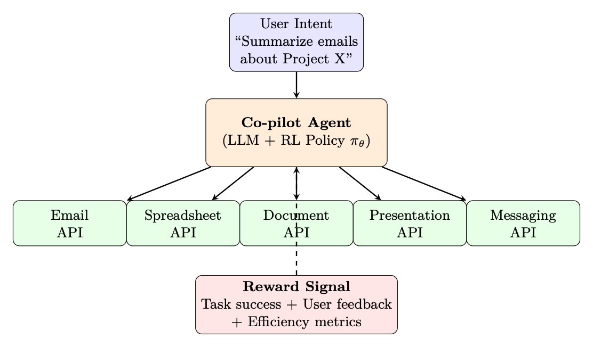

<aside class="hh-part">

第 II 部分 面向大语言模型的强化学习方法

</aside>

## 动机：从聊天机器人到自主智能体

现代 LLM 越来越多地被部署，不仅作为对话助手，而且作为自主智能体（Autonomous Agents），能够在多个步骤中与外部工具、API、数据库和环境进行交互。这一转变——从单轮聊天机器人到多步智能体——引入了根本性的新 RL 挑战，要求我们重新思考如何训练、评估和部署语言模型。

<figure id="ch12.f1"><figcaption>图 12.1：从聊天机器人到自主智能体：传统的 LLM 聊天机器人在带有即时人类反馈的单步对话循环中运行。自主智能体跨多个工具交互进行规划，从真实世界的执行环境中接收反馈，并针对稀疏的终端奖励（任务成功/失败）进行优化。</figcaption></figure>

要求新 RL 方法的关键差异：

<ul><li>多步推理：智能体必须跨越 10–100+ 次工具调用进行规划，而不仅仅是生成单一响应。</li><li>外部环境反馈：奖励来自真实世界的执行（测试套件通过、网页加载、代码编译）——而不仅仅是人类偏好分数。</li><li>结构化动作：动作不仅是 Token，而是结构化输出（JSON 工具调用、API 负载、代码块）。</li><li>长视野与稀疏奖励：成功/失败可能只能在多个中间步骤之后才能确定。</li></ul>

## LLM Agent 的轨迹缓冲区

在 LLM 智能体的语境下，传统的 RL 回放缓冲区经历了结构性的转变。Agent 缓冲区——通常称为轨迹缓冲区（Trajectory Buffers）、经验池（Experience Pools）或记忆库（Memory Banks）——不再存储低维数值 Tensor，而是管理复杂的文本历史、工具执行输出和显式推理步骤。

### LLM Agent 缓冲区的数学结构

在经典 RL 中，回放缓冲区存储扁平元组 <math alttext="(s,a,r,s^{\prime})" display="inline"><semantics><mrow><mo stretchy="false">(</mo><mi>s</mi><mo>,</mo><mi>a</mi><mo>,</mo><mi>r</mi><mo>,</mo><msup><mi>s</mi><mo>′</mo></msup><mo stretchy="false">)</mo></mrow></semantics></math>。对于 LLM 智能体，这扩展为高维的 Token 化文本结构：

<math alttext="\boxed{e_{t}=\left(\mathcal{S}_{t},\;\mathcal{A}_{t},\;\mathcal{R}_{t},\;\mathcal{S}_{t+1}\right)}" display="block"><semantics><menclose notation="box"><mrow><msub><mi>e</mi><mi>t</mi></msub><mo>=</mo><mrow><mo>(</mo><msub><mi>𝒮</mi><mi>t</mi></msub><mo>,</mo><msub><mi>𝒜</mi><mi>t</mi></msub><mo>,</mo><msub><mi>ℛ</mi><mi>t</mi></msub><mo>,</mo><msub><mi>𝒮</mi><mrow><mi>t</mi><mo>+</mo><mn>1</mn></mrow></msub><mo>)</mo></mrow></mrow></menclose></semantics></math>(12.1)

<ul><li><math alttext="\mathcal{S}_{t}" display="inline"><semantics><msub><mi>𝒮</mi><mi>t</mi></msub></semantics></math>：完整上下文状态——系统 Prompt、用户目标、对话历史，以及当前环境变量（例如 HTML 源代码、目录结构、数据库 Schema）。</li><li><math alttext="\mathcal{A}_{t}" display="inline"><semantics><msub><mi>𝒜</mi><mi>t</mi></msub></semantics></math>：智能体的生成输出，通常由一段思维链（Chain-of-Thought，CoT）推理字符串紧接一个结构化工具调用组成：<math alttext="\mathcal{A}_{t}=\{\text{text}_{\text{reasoning}},\;\text{json}_{\text{tool\_call}}\}" display="block"><semantics><mrow><msub><mi>𝒜</mi><mi>t</mi></msub><mo>=</mo><mrow><mo stretchy="false">{</mo><msub><mtext>text</mtext><mtext>reasoning</mtext></msub><mo rspace="0.447em">,</mo><msub><mtext>json</mtext><mtext>tool_call</mtext></msub><mo stretchy="false">}</mo></mrow></mrow></semantics></math>(12.2)</li><li><math alttext="\mathcal{R}_{t}" display="inline"><semantics><msub><mi>ℛ</mi><mi>t</mi></msub></semantics></math>：评估信号，来自外部执行环境（单元测试通过、编译器标志、API 响应码），或由 LLM-as-a-judge 系统验证。</li><li><math alttext="\mathcal{S}_{t+1}" display="inline"><semantics><msub><mi>𝒮</mi><mrow><mi>t</mi><mo>+</mo><mn>1</mn></mrow></msub></semantics></math>：更新后的上下文窗口，将工具输出文本或错误日志直接附加到对话历史中。</li></ul>

## 操作范式

LLM 智能体通过三种主要的优化方法论来利用专门的轨迹缓冲区：

### A. 自我纠正与思维细化

此类别中的两种代表性方法是 STaR [419] 和 Reflexion [326]。当智能体在一次多步执行轨迹中失败时，次优序列会被保存到缓冲区。该框架随后采样此轨迹，并提示 LLM 对其过去的表现生成显式文本批评：

<math alttext="\text{Critique}\leftarrow\text{LLM}(\mathcal{S}_{\text{failed}},\;\mathcal{A}_{\text{failed}},\;\mathcal{R}_{=0})" display="block"><semantics><mrow><mtext>Critique</mtext><mo stretchy="false">←</mo><mrow><mtext>LLM</mtext><mo lspace="0em" rspace="0em">​</mo><mrow><mo stretchy="false">(</mo><msub><mi>𝒮</mi><mtext>failed</mtext></msub><mo>,</mo><msub><mi>𝒜</mi><mtext>failed</mtext></msub><mo>,</mo><msub><mi>ℛ</mi><mrow><mphantom></mphantom><mo>=</mo><mn>0</mn></mrow></msub><mo stretchy="false">)</mo></mrow></mrow></mrow></semantics></math>(12.3)

一旦修正后的轨迹获得正向奖励，它就被移至最优经验池，用于通过微调（在成功轨迹上做 SFT）或 RL（采用二元通过/失败奖励的 GRPO [323]）来更新网络权重。

### B. 离策略探索

此范式以 ReAct [409] 及相关工具使用框架为代表，涉及广泛的自主探索。在自主探索过程中（网页导航、数据库查询、代码生成），智能体记录数千条探索性执行路径。轨迹缓冲区充当一个过滤器：

<ul><li>成功过滤：只保留达成目标的轨迹用于训练。</li><li>效率排序：在成功轨迹中，优先选择最短/最高效的工具使用路径。</li><li>多样性采样：维持多样化的解决策略集合，以防止模式坍塌。</li></ul>

优化算法（通常是 GRPO [323] 或过滤后的 SFT）只在高效、成功的轨迹上计算 Loss，丢弃迂回曲折的运行。

### C. 非参数化的上下文学习（基于经验的 RAG）

轨迹缓冲区可以不修改神经网络权重，而是作为向量数据库。给定一个新的用户目标 <math alttext="\mathcal{G}_{\text{new}}" display="inline"><semantics><msub><mi>𝒢</mi><mtext>new</mtext></msub></semantics></math>，系统检索最相关的过往经验：

<math alttext="\boxed{\mathcal{E}_{\text{retrieved}}=\arg\max_{e\in\mathcal{B}}\text{sim}\!\left(\text{Embed}(\mathcal{G}_{\text{new}}),\;\text{Embed}(e)\right)}" display="block"><semantics><menclose notation="box"><mrow><msub><mi>ℰ</mi><mtext>retrieved</mtext></msub><mo>=</mo><mrow><mrow><mi>arg</mi><mo lspace="0.167em">⁡</mo><munder><mi>max</mi><mrow><mi>e</mi><mo>∈</mo><mi>ℬ</mi></mrow></munder></mrow><mo lspace="0.167em" rspace="0em">​</mo><mpadded width="1.521em"><mtext>sim</mtext></mpadded><mo lspace="0em" rspace="0em">​</mo><mrow><mo>(</mo><mrow><mtext>Embed</mtext><mo lspace="0em" rspace="0em">​</mo><mrow><mo stretchy="false">(</mo><msub><mi>𝒢</mi><mtext>new</mtext></msub><mo stretchy="false">)</mo></mrow></mrow><mo>,</mo><mrow><mtext>Embed</mtext><mo lspace="0em" rspace="0em">​</mo><mrow><mo stretchy="false">(</mo><mi>e</mi><mo stretchy="false">)</mo></mrow></mrow><mo>)</mo></mrow></mrow></mrow></menclose></semantics></math>(12.4)

最相似的 top-<math alttext="k" display="inline"><semantics><mi>k</mi></semantics></math> 条成功历史运行被直接注入到 Prompt 上下文中作为少样本示范。这种方式：

<ul><li>需要零训练——纯粹的检索增强生成</li><li>如果缓冲区中存在相似经验，可即时适应新任务</li><li>随缓冲区规模扩展（经验越多，覆盖越好）</li><li>与参数化学习互补（罕见情况用检索，常见模式用权重）</li></ul>

## 范式对比

<table class="ltx_tabular ltx_align_middle"><thead><tr><th class="ltx_align_left">特性</th><th class="ltx_align_left ltx_align_top">传统 RL 缓冲区</th><th class="ltx_align_left ltx_align_top">LLM 智能体缓冲区</th></tr></thead><tbody><tr><th class="ltx_align_left">数据格式</th><td class="ltx_align_left ltx_align_top">连续向量 / Tensor</td><td class="ltx_align_left ltx_align_top">Token 化文本、JSON、代码块、工具输出</td></tr><tr><th class="ltx_align_left">数据量</th><td class="ltx_align_left ltx_align_top">海量（<math alttext="10^{5}" display="inline"><semantics><msup><mn>10</mn><mn>5</mn></msup></semantics></math>–<math alttext="10^{7}" display="inline"><semantics><msup><mn>10</mn><mn>7</mn></msup></semantics></math> 条）</td><td class="ltx_align_left ltx_align_top">中小规模（<math alttext="10^{3}" display="inline"><semantics><msup><mn>10</mn><mn>3</mn></msup></semantics></math>–<math alttext="10^{5}" display="inline"><semantics><msup><mn>10</mn><mn>5</mn></msup></semantics></math> 条轨迹）</td></tr><tr><th class="ltx_align_left">主要目标</th><td class="ltx_align_left ltx_align_top">打破数据相关性</td><td class="ltx_align_left ltx_align_top">提供推理示范</td></tr><tr><th class="ltx_align_left">采样</th><td class="ltx_align_left ltx_align_top">随机均匀 / PER</td><td class="ltx_align_left ltx_align_top">语义检索 / 成功优先 / 多样性</td></tr><tr><th class="ltx_align_left">状态大小</th><td class="ltx_align_left ltx_align_top">固定（例如 84<math alttext="\times" display="inline"><semantics><mo>×</mo></semantics></math>84 像素）</td><td class="ltx_align_left ltx_align_top">可变（每个状态 1K–128K Token）</td></tr><tr><th class="ltx_align_left">动作空间</th><td class="ltx_align_left ltx_align_top">离散/连续向量</td><td class="ltx_align_left ltx_align_top">结构化文本（推理 + 工具调用）</td></tr><tr><th class="ltx_align_left">奖励来源</th><td class="ltx_align_left ltx_align_top">环境模拟器</td><td class="ltx_align_left ltx_align_top">外部执行 / LLM 评判 / 单元测试</td></tr></tbody></table>
表 12.1：传统 RL 缓冲区与 LLM 智能体缓冲区

## Agent RL 的主要技术

<table class="ltx_tabular ltx_align_middle"><thead><tr><th class="ltx_align_left">方法</th><th class="ltx_align_left ltx_align_top">类型</th><th class="ltx_align_left ltx_align_top">核心思想</th></tr></thead><tbody><tr><th class="ltx_align_left">STaR[419]</th><td class="ltx_align_left ltx_align_top">迭代式 SFT</td><td class="ltx_align_left ltx_align_top">通过在自身成功轨迹上微调来自举推理能力</td></tr><tr><th class="ltx_align_left">Reflexion[326]</th><td class="ltx_align_left ltx_align_top">上下文内 RL</td><td class="ltx_align_left ltx_align_top">语言自我批判存入情景记忆；不更新权重</td></tr><tr><th class="ltx_align_left">ReAct[409]</th><td class="ltx_align_left ltx_align_top">Prompt 工程</td><td class="ltx_align_left ltx_align_top">在单次生成中交错进行推理（「思考」）与行动（「工具调用」）</td></tr><tr><th class="ltx_align_left">LATS[438]</th><td class="ltx_align_left ltx_align_top">树搜索</td><td class="ltx_align_left ltx_align_top">在动作序列上进行蒙特卡洛树搜索；反向传播奖励</td></tr><tr><th class="ltx_align_left">AgentQ[294]</th><td class="ltx_align_left ltx_align_top">离策略 RL</td><td class="ltx_align_left ltx_align_top">在智能体轨迹上用 AI 生成的偏好对做 DPO</td></tr><tr><th class="ltx_align_left">OpenHands[366]</th><td class="ltx_align_left ltx_align_top">GRPO</td><td class="ltx_align_left ltx_align_top">基于执行奖励的组相对优化（测试通过/失败）</td></tr><tr><th class="ltx_align_left">Voyager[362]</th><td class="ltx_align_left ltx_align_top">技能库</td><td class="ltx_align_left ltx_align_top">存储成功的代码片段并检索，用于组合式复用</td></tr><tr><th class="ltx_align_left">RLEF[201]</th><td class="ltx_align_left ltx_align_top">在线 RL</td><td class="ltx_align_left ltx_align_top">RL from Execution Feedback——来自代码/测试执行的二元奖励</td></tr></tbody></table>
表 12.2：用 RL 训练 LLM 智能体的关键方法。

### STaR：自学习推理者（详解）

STaR [419] 是一种迭代式自我改进方法，无需外部奖励模型即可自举推理能力。其核心洞见是：如果模型偶尔能正确解决某个问题，它就能从自身的成功中学习。

算法：

<ol><li>生成：对数据集 <math alttext="\mathcal{D}" display="inline"><semantics><mi>𝒟</mi></semantics></math> 中的每个问题 <math alttext="x_{i}" display="inline"><semantics><msub><mi>x</mi><mi>i</mi></msub></semantics></math>，采样一条推理轨迹 <math alttext="z_{i}\sim\pi_{\theta}(\cdot|x_{i})" display="inline"><semantics><mrow><msub><mi>z</mi><mi>i</mi></msub><mo>∼</mo><msub><mi>π</mi><mi>θ</mi></msub><mrow><mo stretchy="false">(</mo><mo lspace="0em" rspace="0em">⋅</mo><mo fence="false" rspace="0.167em" stretchy="false">|</mo><msub><mi>x</mi><mi>i</mi></msub><mo stretchy="false">)</mo></mrow></mrow></semantics></math> 及其后的答案 <math alttext="\hat{y}_{i}" display="inline"><semantics><msub><mover accent="true"><mi>y</mi><mo>^</mo></mover><mi>i</mi></msub></semantics></math>。</li><li>过滤：仅保留满足 <math alttext="\hat{y}_{i}=y_{i}^{*}" display="inline"><semantics><mrow><msub><mover accent="true"><mi>y</mi><mo>^</mo></mover><mi>i</mi></msub><mo>=</mo><msubsup><mi>y</mi><mi>i</mi><mo>∗</mo></msubsup></mrow></semantics></math>（答案正确）的轨迹。定义成功集合 <math alttext="\mathcal{D}_{\text{pass}}=\{(x_{i},z_{i},y_{i}^{*}):\hat{y}_{i}=y_{i}^{*}\}" display="inline"><semantics><mrow><msub><mi>𝒟</mi><mtext>pass</mtext></msub><mo>=</mo><mrow><mo stretchy="false">{</mo><mrow><mo stretchy="false">(</mo><msub><mi>x</mi><mi>i</mi></msub><mo>,</mo><msub><mi>z</mi><mi>i</mi></msub><mo>,</mo><msubsup><mi>y</mi><mi>i</mi><mo>∗</mo></msubsup><mo rspace="0.278em" stretchy="false">)</mo></mrow><mo rspace="0.278em">:</mo><mrow><msub><mover accent="true"><mi>y</mi><mo>^</mo></mover><mi>i</mi></msub><mo>=</mo><msubsup><mi>y</mi><mi>i</mi><mo>∗</mo></msubsup></mrow><mo stretchy="false">}</mo></mrow></mrow></semantics></math>。</li><li>合理化（关键创新）：对模型失败的问题，生成一段「合理化」——以正确答案为条件的推理轨迹：<math alttext="z_{i}^{\text{rat}}\sim\pi_{\theta}(\cdot|x_{i},y_{i}^{*})" display="inline"><semantics><mrow><msubsup><mi>z</mi><mi>i</mi><mtext>rat</mtext></msubsup><mo>∼</mo><msub><mi>π</mi><mi>θ</mi></msub><mrow><mo stretchy="false">(</mo><mo lspace="0em" rspace="0em">⋅</mo><mo fence="false" rspace="0.167em" stretchy="false">|</mo><msub><mi>x</mi><mi>i</mi></msub><mo>,</mo><msubsup><mi>y</mi><mi>i</mi><mo>∗</mo></msubsup><mo stretchy="false">)</mo></mrow></mrow></semantics></math>。这教会模型从解答<em>反向</em>推理。</li><li>微调：在 <math alttext="\mathcal{D}_{\text{pass}}\cup\mathcal{D}_{\text{rationalized}}" display="inline"><semantics><mrow><msub><mi>𝒟</mi><mtext>pass</mtext></msub><mo>∪</mo><msub><mi>𝒟</mi><mtext>rationalized</mtext></msub></mrow></semantics></math> 上通过 SFT 更新 <math alttext="\theta" display="inline"><semantics><mi>θ</mi></semantics></math>。</li><li>迭代：用改进后的模型从第 1 步重复。</li></ol>

<math alttext="\boxed{\theta_{k+1}=\arg\min_{\theta}-\sum_{(x,z,y)\in\mathcal{D}_{k}^{+}}\log\pi_{\theta}(z,y|x)}" display="block"><semantics><menclose notation="box"><mrow><msub><mi>θ</mi><mrow><mi>k</mi><mo>+</mo><mn>1</mn></mrow></msub><mo>=</mo><mrow><mrow><mi>arg</mi><mo lspace="0.167em">⁡</mo><munder><mi>min</mi><mi>θ</mi></munder></mrow><mo lspace="0em" rspace="0.055em">−</mo><mrow><munder><mo movablelimits="false">∑</mo><mrow><mrow><mo stretchy="false">(</mo><mi>x</mi><mo>,</mo><mi>z</mi><mo>,</mo><mi>y</mi><mo stretchy="false">)</mo></mrow><mo>∈</mo><msubsup><mi>𝒟</mi><mi>k</mi><mo>+</mo></msubsup></mrow></munder><mrow><mrow><mi>log</mi><mo lspace="0.167em">⁡</mo><msub><mi>π</mi><mi>θ</mi></msub></mrow><mo lspace="0em" rspace="0em">​</mo><mrow><mo stretchy="false">(</mo><mrow><mi>z</mi><mo>,</mo><mi>y</mi></mrow><mo lspace="0em" rspace="0em">|</mo><mi>x</mi><mo stretchy="false">)</mo></mrow></mrow></mrow></mrow></mrow></menclose></semantics></math>(12.5)

收敛动态：每次迭代 <math alttext="k" display="inline"><semantics><mi>k</mi></semantics></math> 都会提升模型的解题率 <math alttext="p_{k}" display="inline"><semantics><msub><mi>p</mi><mi>k</mi></msub></semantics></math>。若 <math alttext="p_{0}=0.3" display="inline"><semantics><mrow><msub><mi>p</mi><mn>0</mn></msub><mo>=</mo><mn>0.3</mn></mrow></semantics></math>（能解 30% 的问题），经合理化 + SFT 后，<math alttext="p_{1}\approx 0.5" display="inline"><semantics><mrow><msub><mi>p</mi><mn>1</mn></msub><mo>≈</mo><mn>0.5</mn></mrow></semantics></math>。通常在 3–5 次迭代后收敛到 <math alttext="p\approx 0.7" display="inline"><semantics><mrow><mi>p</mi><mo>≈</mo><mn>0.7</mn></mrow></semantics></math>–<math alttext="0.9" display="inline"><semantics><mn>0.9</mn></semantics></math>。

### Reflexion：语言强化学习（详解）

Reflexion [326] 提出了一种激进的范式：不更新权重的 RL。智能体不依赖基于梯度的学习，而是通过存放在情景记忆中的自然语言自我批判来改进。

完整架构：

<ol><li>Actor：在环境中执行动作的 LLM 智能体 <math alttext="\pi" display="inline"><semantics><mi>π</mi></semantics></math>。</li><li>Evaluator：二元信号（任务成功/失败）或标量启发式指标（例如通过的测试用例数）。</li><li>自我反思生成器：给定失败轨迹 <math alttext="\tau_{\text{fail}}" display="inline"><semantics><msub><mi>τ</mi><mtext>fail</mtext></msub></semantics></math> 与环境反馈，生成自然语言反思 <math alttext="r_{\text{text}}" display="inline"><semantics><msub><mi>r</mi><mtext>text</mtext></msub></semantics></math>：<math alttext="r_{\text{text}}=\text{LLM}_{\text{reflect}}\!\left(\tau_{\text{fail}},\text{feedback},\text{task}\right)" display="block"><semantics><mrow><msub><mi>r</mi><mtext>text</mtext></msub><mo>=</mo><mrow><msub><mtext>LLM</mtext><mtext>reflect</mtext></msub><mo lspace="0em" rspace="0em">​</mo><mrow><mo>(</mo><msub><mi>τ</mi><mtext>fail</mtext></msub><mo>,</mo><mtext>feedback</mtext><mo>,</mo><mtext>task</mtext><mo>)</mo></mrow></mrow></mrow></semantics></math>(12.6)</li><li>情景记忆：过去反思的滑动窗口缓冲区 <math alttext="\mathcal{M}=[r_{1},r_{2},\ldots,r_{m}]" display="inline"><semantics><mrow><mi>ℳ</mi><mo>=</mo><mrow><mo stretchy="false">[</mo><mrow><msub><mi>r</mi><mn>1</mn></msub><mo>,</mo><msub><mi>r</mi><mn>2</mn></msub><mo>,</mo><mi mathvariant="normal">…</mi><mo>,</mo><msub><mi>r</mi><mi>m</mi></msub></mrow><mo stretchy="false">]</mo></mrow></mrow></semantics></math>（通常取 <math alttext="m\leq 3" display="inline"><semantics><mrow><mi>m</mi><mo>≤</mo><mn>3</mn></mrow></semantics></math> 以适配上下文）。</li><li>重试循环：在下一次尝试中，反思被注入到 Prompt 中：<math alttext="a_{t+1}\sim\pi\!\left(\cdot\;|\;\text{task},\;\mathcal{M},\;\text{current\_state}\right)" display="block"><semantics><mrow><msub><mi>a</mi><mrow><mi>t</mi><mo>+</mo><mn>1</mn></mrow></msub><mo>∼</mo><mpadded width="0.436em"><mi>π</mi></mpadded><mrow><mo>(</mo><mo lspace="0em" rspace="0.280em">⋅</mo><mo fence="false" rspace="0.447em" stretchy="false">|</mo><mtext>task</mtext><mo rspace="0.447em">,</mo><mi>ℳ</mi><mo rspace="0.447em">,</mo><mtext>current_state</mtext><mo>)</mo></mrow></mrow></semantics></math>(12.7)</li></ol>

反思示例：<em>「在上一次尝试中，我在验证输入格式之前就调用了搜索 API，导致 400 错误。下次我应当先验证 JSON schema，再发起 API 调用。」</em>

优势与局限：

优势局限无需梯度计算；可与冻结的 API 模型（GPT-4）配合受限于上下文窗口；无法无限累积知识迭代快（每次重试只需数秒，而 RL 训练需要数小时）无法泛化到未见任务（记忆是任务特有的）可解释：自我纠正可被人阅读依赖模型自身识别错误的能力可与任何基础智能体架构组合当基础模型太弱、无法生成有用批判时效果下降

### ReAct：推理 + 行动（详解）

ReAct [409] 通过在单次生成流中交错进行显式推理步骤与环境动作，确立了工具使用智能体的主流 Prompt 范式。

生成格式：

形式化定义：一条 ReAct 轨迹是 <math alttext="\tau=(t_{1},a_{1},o_{1},t_{2},a_{2},o_{2},\ldots)" display="inline"><semantics><mrow><mi>τ</mi><mo>=</mo><mrow><mo stretchy="false">(</mo><msub><mi>t</mi><mn>1</mn></msub><mo>,</mo><msub><mi>a</mi><mn>1</mn></msub><mo>,</mo><msub><mi>o</mi><mn>1</mn></msub><mo>,</mo><msub><mi>t</mi><mn>2</mn></msub><mo>,</mo><msub><mi>a</mi><mn>2</mn></msub><mo>,</mo><msub><mi>o</mi><mn>2</mn></msub><mo>,</mo><mi mathvariant="normal">…</mi><mo stretchy="false">)</mo></mrow></mrow></semantics></math>，其中：

<ul><li><math alttext="t_{i}" display="inline"><semantics><msub><mi>t</mi><mi>i</mi></msub></semantics></math>：思考（Thought，内部推理，不执行）</li><li><math alttext="a_{i}" display="inline"><semantics><msub><mi>a</mi><mi>i</mi></msub></semantics></math>：动作（Action，工具调用，在环境中执行）</li><li><math alttext="o_{i}" display="inline"><semantics><msub><mi>o</mi><mi>i</mi></msub></semantics></math>：观察（Observation，环境响应，追加到上下文）</li></ul>

为何有效：思考形成一种「内心独白」，帮助模型在行动前进行规划，减少冲动性的工具调用。显式的推理轨迹也使智能体的决策过程可审计、可调试。

用 RL 训练 ReAct 智能体：

<ul><li>动作级奖励：只有动作接收奖励信号（思考是辅助性的）。</li><li>思考质量：被隐式优化——更好的思考 <math alttext="\rightarrow" display="inline"><semantics><mo stretchy="false">→</mo></semantics></math> 更好的动作 <math alttext="\rightarrow" display="inline"><semantics><mo stretchy="false">→</mo></semantics></math> 更高的奖励。</li><li>格式约束：在奖励中对格式错误的动作（缺少 JSON、幻觉出的工具）加入格式惩罚。</li><li>RL 目标：<math alttext="r(\tau)=r_{\text{task}}-\lambda_{\text{format}}\cdot\text{format\_violations}-\lambda_{\text{length}}\cdot\text{num\_steps}" display="inline"><semantics><mrow><mrow><mi>r</mi><mo>⁡</mo><mrow><mo stretchy="false">(</mo><mi>τ</mi><mo stretchy="false">)</mo></mrow></mrow><mo>=</mo><mrow><msub><mi>r</mi><mtext>task</mtext></msub><mo>−</mo><mrow><msub><mi>λ</mi><mtext>format</mtext></msub><mo lspace="0.222em" rspace="0.222em">⋅</mo><mtext>format_violations</mtext></mrow><mo>−</mo><mrow><msub><mi>λ</mi><mtext>length</mtext></msub><mo lspace="0.222em" rspace="0.222em">⋅</mo><mtext>num_steps</mtext></mrow></mrow></mrow></semantics></math></li></ul>

### LATS：语言 Agent 树搜索（详解）

LATS [438] 将蒙特卡洛树搜索（Monte Carlo Tree Search，MCTS）应用于 LLM 智能体的动作选择，用推理算力换取显著更优的轨迹。

算法（针对 LLM 智能体调整）：

<ol><li>选择：从根节点（初始状态）出发，使用 UCB1 遍历树：<math alttext="\text{UCB}(s,a)=\bar{Q}(s,a)+c\sqrt{\frac{\ln N(s)}{N(s,a)}}" display="block"><semantics><mrow><mrow><mtext>UCB</mtext><mo lspace="0em" rspace="0em">​</mo><mrow><mo stretchy="false">(</mo><mi>s</mi><mo>,</mo><mi>a</mi><mo stretchy="false">)</mo></mrow></mrow><mo>=</mo><mrow><mrow><mover accent="true"><mi>Q</mi><mo>¯</mo></mover><mo lspace="0em" rspace="0em">​</mo><mrow><mo stretchy="false">(</mo><mi>s</mi><mo>,</mo><mi>a</mi><mo stretchy="false">)</mo></mrow></mrow><mo>+</mo><mrow><mi>c</mi><mo lspace="0em" rspace="0em">​</mo><msqrt><mfrac><mrow><mi>ln</mi><mo lspace="0.167em">⁡</mo><mrow><mi>N</mi><mo>⁡</mo><mrow><mo stretchy="false">(</mo><mi>s</mi><mo stretchy="false">)</mo></mrow></mrow></mrow><mrow><mi>N</mi><mo>⁡</mo><mrow><mo stretchy="false">(</mo><mi>s</mi><mo>,</mo><mi>a</mi><mo stretchy="false">)</mo></mrow></mrow></mfrac></msqrt></mrow></mrow></mrow></semantics></math>(12.8)其中 <math alttext="\bar{Q}" display="inline"><semantics><mover accent="true"><mi>Q</mi><mo>¯</mo></mover></semantics></math> = 子树的平均奖励，<math alttext="N" display="inline"><semantics><mi>N</mi></semantics></math> = 访问次数，<math alttext="c" display="inline"><semantics><mi>c</mi></semantics></math> = 探索常数。</li><li>扩展：在叶节点处，通过 LLM 采样（temperature <math alttext="&gt;0" display="inline"><semantics><mrow><mphantom></mphantom><mo>&gt;</mo><mn>0</mn></mrow></semantics></math>）生成 <math alttext="k" display="inline"><semantics><mi>k</mi></semantics></math> 个候选动作：<math alttext="\{a_{1},\ldots,a_{k}\}\sim\pi_{\theta}(\cdot|s_{\text{leaf}})" display="inline"><semantics><mrow><mrow><mo stretchy="false">{</mo><msub><mi>a</mi><mn>1</mn></msub><mo>,</mo><mi mathvariant="normal">…</mi><mo>,</mo><msub><mi>a</mi><mi>k</mi></msub><mo stretchy="false">}</mo></mrow><mo>∼</mo><msub><mi>π</mi><mi>θ</mi></msub><mrow><mo stretchy="false">(</mo><mo lspace="0em" rspace="0em">⋅</mo><mo fence="false" rspace="0.167em" stretchy="false">|</mo><msub><mi>s</mi><mtext>leaf</mtext></msub><mo stretchy="false">)</mo></mrow></mrow></semantics></math></li><li>模拟：对每个候选动作，在环境中执行该动作，并用快速 rollout 策略（贪心解码）继续，直到终止状态或深度上限。</li><li>反向传播：将终端奖励沿所有祖先节点向上回传，更新 <math alttext="\bar{Q}" display="inline"><semantics><mover accent="true"><mi>Q</mi><mo>¯</mo></mover></semantics></math> 和 <math alttext="N" display="inline"><semantics><mi>N</mi></semantics></math> 计数。</li><li>重复：在固定的计算预算内运行第 1–4 步（例如 50–200 次迭代）。</li><li>动作选择：选择根节点中访问次数最多的子节点。</li></ol>

针对 LLM 的适配：

<ul><li>价值函数：用一次单独的 LLM 调用估计状态价值：「按 0–1 评分，这个状态有多大可能导向任务成功？」</li><li>基于反思的剪枝：当某个分支失败时，生成一段反思并剪掉相似的分支。</li><li>缓存：在每个节点存储 LLM 输出，避免回溯时重复生成。</li><li>深度预算：将树深度限制在 10–20 步（智能体很少需要更多）。</li></ul>

性能：在 WebShop（网页导航）上，LATS 达到 75% 成功率，而 ReAct 为 40%。在 HumanEval（代码）上，树搜索使 pass@1 从 68% <math alttext="\rightarrow" display="inline"><semantics><mo stretchy="false">→</mo></semantics></math> 提升到 94%。代价是每个任务多出 10–50<math alttext="\times" display="inline"><semantics><mo>×</mo></semantics></math> 的推理 FLOPs。

### AgentQ：在 Agent 轨迹上做 DPO（详解）

AgentQ [294] 通过从轨迹结果自动生成偏好对，把离线偏好学习（DPO）与在线智能体执行衔接起来。

流程：

<ol><li>Rollout：用当前 policy <math alttext="\pi_{\theta}" display="inline"><semantics><msub><mi>π</mi><mi>θ</mi></msub></semantics></math> 为每个任务执行 <math alttext="N" display="inline"><semantics><mi>N</mi></semantics></math> 条轨迹。</li><li>评估：用基于执行的奖励（二元通过/失败或标量指标）为每条轨迹打分。</li><li>偏好对构造：为每个任务构造偏好对：<math alttext="(\tau_{w},\tau_{l})\text{ where }r(\tau_{w})&gt;r(\tau_{l})" display="block"><semantics><mrow><mrow><mrow><mo stretchy="false">(</mo><msub><mi>τ</mi><mi>w</mi></msub><mo>,</mo><msub><mi>τ</mi><mi>l</mi></msub><mo stretchy="false">)</mo></mrow><mo lspace="0em" rspace="0em">​</mo><mtext> where </mtext><mo lspace="0em" rspace="0em">​</mo><mi>r</mi><mo lspace="0em" rspace="0em">​</mo><mrow><mo stretchy="false">(</mo><msub><mi>τ</mi><mi>w</mi></msub><mo stretchy="false">)</mo></mrow></mrow><mo>&gt;</mo><mrow><mi>r</mi><mo>⁡</mo><mrow><mo stretchy="false">(</mo><msub><mi>τ</mi><mi>l</mi></msub><mo stretchy="false">)</mo></mrow></mrow></mrow></semantics></math>(12.9)在同一任务的各条轨迹中，奖励最高者为 chosen；最低者为 rejected。</li><li>DPO 更新：在轨迹级对数概率上应用标准 DPO loss：<math alttext="\mathcal{L}_{\text{AgentQ}}=-\log\sigma\!\left(\beta\left[\log\frac{\pi_{\theta}(\tau_{w})}{\pi_{\text{ref}}(\tau_{w})}-\log\frac{\pi_{\theta}(\tau_{l})}{\pi_{\text{ref}}(\tau_{l})}\right]\right)" display="block"><semantics><mrow><msub><mi>ℒ</mi><mtext>AgentQ</mtext></msub><mo>=</mo><mrow><mo rspace="0.167em">−</mo><mrow><mi>log</mi><mo lspace="0.167em">⁡</mo><mrow><mpadded width="0.437em"><mi>σ</mi></mpadded><mo>⁡</mo><mrow><mo>(</mo><mrow><mi>β</mi><mo>⁡</mo><mrow><mo>[</mo><mrow><mrow><mi>log</mi><mo lspace="0.167em">⁡</mo><mfrac><mrow><msub><mi>π</mi><mi>θ</mi></msub><mo lspace="0em" rspace="0em">​</mo><mrow><mo stretchy="false">(</mo><msub><mi>τ</mi><mi>w</mi></msub><mo stretchy="false">)</mo></mrow></mrow><mrow><msub><mi>π</mi><mtext>ref</mtext></msub><mo lspace="0em" rspace="0em">​</mo><mrow><mo stretchy="false">(</mo><msub><mi>τ</mi><mi>w</mi></msub><mo stretchy="false">)</mo></mrow></mrow></mfrac></mrow><mo>−</mo><mrow><mi>log</mi><mo lspace="0.167em">⁡</mo><mfrac><mrow><msub><mi>π</mi><mi>θ</mi></msub><mo lspace="0em" rspace="0em">​</mo><mrow><mo stretchy="false">(</mo><msub><mi>τ</mi><mi>l</mi></msub><mo stretchy="false">)</mo></mrow></mrow><mrow><msub><mi>π</mi><mtext>ref</mtext></msub><mo lspace="0em" rspace="0em">​</mo><mrow><mo stretchy="false">(</mo><msub><mi>τ</mi><mi>l</mi></msub><mo stretchy="false">)</mo></mrow></mrow></mfrac></mrow></mrow><mo>]</mo></mrow></mrow><mo>)</mo></mrow></mrow></mrow></mrow></mrow></semantics></math>(12.10)</li><li>迭代：更新后的 <math alttext="\pi_{\theta}" display="inline"><semantics><msub><mi>π</mi><mi>θ</mi></msub></semantics></math> 在下一轮生成新的（更好的）轨迹。</li></ol>

关键设计选择：

<ul><li>MCTS 引导的探索：在 rollout 阶段使用 LATS 生成多样且高质量的轨迹（更好的训练数据）。</li><li>步级 DPO：不比较完整轨迹，而是在<em>动作级</em>比较——在相同前缀下，哪一个后续动作能导向成功？</li><li>自我对弈改进：每次 DPO 迭代都产生更好的 policy，它生成更好的轨迹，进而产生更好的训练偏好对——形成良性循环。</li></ul>

结果：在 WebShop 上，AgentQ 在 3 次 DPO 迭代内相对基础 policy 取得绝对提升：成功率 50% <math alttext="\rightarrow" display="inline"><semantics><mo stretchy="false">→</mo></semantics></math> 82%。

### Voyager：通过技能库实现终身学习（详解）

Voyager [362] 引入了组合式技能累积——智能体构建一个不断增长的可复用代码函数库，这些函数充当高层动作。

架构：

<ol><li>自动课程：LLM 基于智能体当前的技能清单提出逐步加难的任务：「你现在能采木头并合成木板了。下一个挑战：做一个工作台。」</li><li>技能生成：对每个任务，智能体编写一个解决它的 JavaScript 函数（可执行代码）：<math alttext="\text{skill}_{i}=\text{LLM}(\text{task}_{i},\text{environment\_docs},\text{error\_feedback})" display="block"><semantics><mrow><msub><mtext>skill</mtext><mi>i</mi></msub><mo>=</mo><mrow><mtext>LLM</mtext><mo lspace="0em" rspace="0em">​</mo><mrow><mo stretchy="false">(</mo><msub><mtext>task</mtext><mi>i</mi></msub><mo>,</mo><mtext>environment_docs</mtext><mo>,</mo><mtext>error_feedback</mtext><mo stretchy="false">)</mo></mrow></mrow></mrow></semantics></math>(12.11)</li><li>验证：在环境中执行代码。若成功，则加入技能库。若不成功，则结合错误反馈迭代（最多重试 5 次）。</li><li>技能库（向量数据库）：每个通过验证的技能存储以下内容：•函数签名 + docstring（用于检索）•任务描述的嵌入（用于语义搜索）•依赖关系（它调用了哪些其他技能）</li><li>检索 + 组合：对新任务，检索最相关的 top-<math alttext="k" display="inline"><semantics><mi>k</mi></semantics></math> 个技能并组合它们：<math alttext="\text{solution}=\text{LLM}(\text{new\_task},\text{retrieve}(\text{skill\_library},k{=}5))" display="block"><semantics><mrow><mtext>solution</mtext><mo>=</mo><mrow><mtext>LLM</mtext><mo lspace="0em" rspace="0em">​</mo><mrow><mo stretchy="false">(</mo><mtext>new_task</mtext><mo>,</mo><mrow><mtext>retrieve</mtext><mo lspace="0em" rspace="0em">​</mo><mrow><mo stretchy="false">(</mo><mtext>skill_library</mtext><mo>,</mo><mrow><mi>k</mi><mo>=</mo><mn>5</mn></mrow><mo stretchy="false">)</mo></mrow></mrow><mo stretchy="false">)</mo></mrow></mrow></mrow></semantics></math>(12.12)</li></ol>

关键洞见：技能是可组合的——复杂行为由简单且已验证的函数组合而成。智能体永不遗忘（技能库持久保存），并且单调改进（只加入已验证的技能）。

### RLEF：从执行反馈中做 RL（详解）

RLEF [201] 将使用确定性执行奖励的在线 RL应用于代码生成智能体，确立了智能体训练中最简单有效的范式。

训练循环：

<ol><li>采样任务：从训练集中抽取一个带测试用例 <math alttext="(x,\text{tests})" display="inline"><semantics><mrow><mo stretchy="false">(</mo><mi>x</mi><mo>,</mo><mtext>tests</mtext><mo stretchy="false">)</mo></mrow></semantics></math> 的编程问题。</li><li>生成：智能体使用当前 policy <math alttext="\pi_{\theta}" display="inline"><semantics><msub><mi>π</mi><mi>θ</mi></msub></semantics></math> 产生一条解题轨迹（读取文件、编写代码、运行测试）。</li><li>执行：在沙箱（sandbox）环境中运行测试套件。奖励：<math alttext="r=\frac{\text{\# tests passed}}{\text{\# total tests}}\in[0,1]" display="block"><semantics><mrow><mi>r</mi><mo>=</mo><mfrac><mtext># tests passed</mtext><mtext># total tests</mtext></mfrac><mo>∈</mo><mrow><mo stretchy="false">[</mo><mrow><mn>0</mn><mo>,</mo><mn>1</mn></mrow><mo stretchy="false">]</mo></mrow></mrow></semantics></math>(12.13)</li><li>更新：使用 <math alttext="r" display="inline"><semantics><mi>r</mi></semantics></math> 作为奖励信号应用 GRPO/PPO。</li><li>重复：用新任务进行数千次迭代。</li></ol>

为什么执行反馈非常适合 RL：

<ul><li>零噪声：与人类偏好不同，测试结果是确定性的。相同代码 <math alttext="\rightarrow" display="inline"><semantics><mo stretchy="false">→</mo></semantics></math> 每次得到相同奖励。这消除了会使 RL 训练不稳定的奖励噪声。</li><li>可无限扩展：可以用程序无限生成任务（随机算法、API 集成测试、数据变换）。</li><li>无奖励作弊：与学习得到的奖励模型不同，测试套件无法被「糊弄」（前提是测试写得好）。智能体必须真正解决问题。</li><li>稠密信号：部分测试通过（<math alttext="r=0.6" display="inline"><semantics><mrow><mi>r</mi><mo>=</mo><mn>0.6</mn></mrow></semantics></math>）比二元通过/失败提供更丰富的梯度。</li></ul>

### OpenHands / SWE-Agent：用于软件工程的 GRPO

OpenHands [366] 与 SWE-Agent [404] 应用 GRPO 训练能自主解决 GitHub issue 的智能体——阅读代码、编写补丁并运行测试套件。

训练细节：

<ul><li>环境：包含完整 repo、测试套件和开发者工具（git、grep、lint）的 Docker 容器。</li><li>动作空间：Bash 命令、文件编辑、git 操作、测试执行。</li><li>轨迹长度：解决一个 GitHub issue 通常需要 15–50 个动作。</li><li>奖励：二元——生成的补丁是否通过该 issue 的回归测试？</li><li>组大小：每个 issue 采样 <math alttext="N=8" display="inline"><semantics><mrow><mi>N</mi><mo>=</mo><mn>8</mn></mrow></semantics></math>–<math alttext="16" display="inline"><semantics><mn>16</mn></semantics></math> 条轨迹用于 GRPO 归一化。</li><li>课程：从标记为「good first issue」的 issue 开始，逐步推进到复杂的多文件重构。</li></ul>

最先进的结果：SWE-bench Verified 上，RL 训练后解决率从 30% <math alttext="\rightarrow" display="inline"><semantics><mo stretchy="false">→</mo></semantics></math> 提升到 55%（相较仅做 SFT 的基线）。

## 用例：用于生产力副驾的 Agent RL

本节提供一份完整蓝图，说明如何应用智能体 RL 技术训练一个基于 LLM 的协同助手（co-pilot），使其能够在整套生产力应用（文档、表格、演示、邮件、消息、云存储）中工作。

### 架构概览

<figure id="ch12.f2"><figcaption>图 12.2：生产力协同助手架构：LLM 智能体（带 RL policy <math alttext="\pi_{\theta}" display="inline"><semantics><msub><mi>π</mi><mi>θ</mi></msub></semantics></math>）接收用户意图并与多个应用 API 交互。基于任务成功、用户反馈和效率指标的奖励信号驱动 policy 改进。</figcaption></figure>

### 生产力副驾的形式化 MDP 定义

生产力协同助手环境被形式化为部分可观测马尔可夫决策过程（Partially Observable Markov Decision Process，POMDP）：

<math alttext="\boxed{\mathcal{M}=\langle\mathcal{S},\mathcal{A},\mathcal{T},\mathcal{R},\Omega,\mathcal{O},\gamma\rangle}" display="block"><semantics><menclose notation="box"><mrow><mi>ℳ</mi><mo>=</mo><mrow><mo stretchy="false">⟨</mo><mrow><mi>𝒮</mi><mo>,</mo><mi>𝒜</mi><mo>,</mo><mi>𝒯</mi><mo>,</mo><mi>ℛ</mi><mo>,</mo><mi mathvariant="normal">Ω</mi><mo>,</mo><mi>𝒪</mi><mo>,</mo><mi>γ</mi></mrow><mo stretchy="false">⟩</mo></mrow></mrow></menclose></semantics></math>(12.14)

<ul><li><math alttext="\mathcal{S}" display="inline"><semantics><mi>𝒮</mi></semantics></math>：状态空间——完整的工作区环境状态：文档内容、邮件会话、日历事件、文件系统、用户权限。<em>并非完全可观测</em>：智能体只能看到 API 查询返回的内容。</li><li><math alttext="\mathcal{A}" display="inline"><semantics><mi>𝒜</mi></semantics></math>：动作空间——结构化 API 调用（见下）。每个动作是一个 JSON 对象，指定目标应用、操作和参数。</li><li><math alttext="\mathcal{T}" display="inline"><semantics><mi>𝒯</mi></semantics></math>：转移函数——对大多数操作是确定性的（写入文档 <math alttext="\rightarrow" display="inline"><semantics><mo stretchy="false">→</mo></semantics></math> 文档已更新），但对依赖网络的动作是随机的（邮件送达时间、Teams 可用性）。</li><li><math alttext="\mathcal{R}" display="inline"><semantics><mi>ℛ</mi></semantics></math>：奖励函数——多分量（见奖励设计一节）。</li><li><math alttext="\Omega" display="inline"><semantics><mi mathvariant="normal">Ω</mi></semantics></math>：观测空间——API 响应、渲染后的文档视图、错误信息。</li><li><math alttext="\mathcal{O}" display="inline"><semantics><mi>𝒪</mi></semantics></math>：观测函数——将状态映射为观测（API 响应格式化、因上下文窗口限制而截断）。</li><li><math alttext="\gamma=0.99" display="inline"><semantics><mrow><mi>γ</mi><mo>=</mo><mn>0.99</mn></mrow></semantics></math>：折扣因子（长视野，通常 10–50 步）。</li></ul>

### 动作空间设计

动作空间必须是结构化的、类型安全的且可组合的：

按应用划分的动作分类：

应用复杂度关键动作Outlook中等<code>search</code>, <code>read</code>, <code>draft</code>, <code>send</code>, <code>move</code>, <code>flag</code>, <code>create_rule</code>Excel高<code>read_range</code>, <code>write_range</code>, <code>insert_formula</code>, <code>create_chart</code>, <code>pivot_table</code>, <code>run_macro</code>Word中等<code>read_paragraphs</code>, <code>insert_text</code>, <code>format_section</code>, <code>find_replace</code>, <code>insert_table</code>PowerPoint中等<code>add_slide</code>, <code>insert_shape</code>, <code>set_text</code>, <code>set_layout</code>, <code>add_image</code>, <code>apply_theme</code>Teams低<code>send_message</code>, <code>create_meeting</code>, <code>search_chat</code>, <code>add_members</code>, <code>post_to_channel</code>SharePoint中等<code>list_files</code>, <code>upload</code>, <code>download</code>, <code>search</code>, <code>create_page</code>, <code>set_permissions</code>

### 状态表示

智能体在每一步的观测（上下文窗口）：

<math alttext="o_{t}=[\text{system\_prompt};\;\text{user\_intent};\;\text{tool\_history}_{1:t-1};\;\text{current\_result}_{t}]" display="block"><semantics><mrow><msub><mi>o</mi><mi>t</mi></msub><mo>=</mo><mrow><mo stretchy="false">[</mo><mtext>system_prompt</mtext><mo rspace="0.447em">;</mo><mtext>user_intent</mtext><mo rspace="0.447em">;</mo><msub><mtext>tool_history</mtext><mrow><mn>1</mn><mo lspace="0.278em" rspace="0.278em">:</mo><mrow><mi>t</mi><mo>−</mo><mn>1</mn></mrow></mrow></msub><mo rspace="0.447em">;</mo><msub><mtext>current_result</mtext><mi>t</mi></msub><mo stretchy="false">]</mo></mrow></mrow></semantics></math>(12.15)

上下文预算管理（对 128K 窗口至关重要）：

<ul><li>系统 Prompt：2K Token（能力、安全规则、输出格式）</li><li>用户意图 + 对话：4K Token</li><li>Tool 历史（滑动窗口）：最近 8–12 个动作 + 观测，较早的则做摘要。总计：最多 80K Token。</li><li>当前观测：最多 32K Token（大型电子表格、邮件会话）</li><li>预留：10K Token 用于智能体的推理 + 下一动作生成</li></ul>

状态压缩策略：

<ul><li>选择性纳入：只纳入与当前子目标相关的 API 响应（使用一个辅助的“相关性评分器”）。</li><li>结构化摘要：将大型电子表格表示为 schema + 样例行，而非完整数据。</li><li>层级式记忆：将完整轨迹存储在外部；向上下文中注入压缩后的摘要。</li></ul>

### Reward 设计：多目标信号

生产力副驾的 Reward 函数必须平衡多个目标：

<math alttext="\boxed{R(\tau)=\alpha_{1}R_{\text{task}}+\alpha_{2}R_{\text{quality}}+\alpha_{3}R_{\text{efficiency}}+\alpha_{4}R_{\text{safety}}+\alpha_{5}R_{\text{user}}}" display="block"><semantics><menclose notation="box"><mrow><mrow><mi>R</mi><mo>⁡</mo><mrow><mo stretchy="false">(</mo><mi>τ</mi><mo stretchy="false">)</mo></mrow></mrow><mo>=</mo><mrow><mrow><msub><mi>α</mi><mn>1</mn></msub><mo lspace="0em" rspace="0em">​</mo><msub><mi>R</mi><mtext>task</mtext></msub></mrow><mo>+</mo><mrow><msub><mi>α</mi><mn>2</mn></msub><mo lspace="0em" rspace="0em">​</mo><msub><mi>R</mi><mtext>quality</mtext></msub></mrow><mo>+</mo><mrow><msub><mi>α</mi><mn>3</mn></msub><mo lspace="0em" rspace="0em">​</mo><msub><mi>R</mi><mtext>efficiency</mtext></msub></mrow><mo>+</mo><mrow><msub><mi>α</mi><mn>4</mn></msub><mo lspace="0em" rspace="0em">​</mo><msub><mi>R</mi><mtext>safety</mtext></msub></mrow><mo>+</mo><mrow><msub><mi>α</mi><mn>5</mn></msub><mo lspace="0em" rspace="0em">​</mo><msub><mi>R</mi><mtext>user</mtext></msub></mrow></mrow></mrow></menclose></semantics></math>(12.16)

<table class="ltx_tabular ltx_align_middle"><thead><tr><th class="ltx_align_left">组件</th><th class="ltx_align_left ltx_align_top">权重</th><th class="ltx_align_left ltx_align_top">信号类型</th><th class="ltx_align_left ltx_align_top">定义</th></tr></thead><tbody><tr><th class="ltx_align_left"><math alttext="R_{\text{task}}" display="inline"><semantics><msub><mi>R</mi><mtext>task</mtext></msub></semantics></math></th><td class="ltx_align_left ltx_align_top">0.40</td><td class="ltx_align_left ltx_align_top">二元/标量</td><td class="ltx_align_left ltx_align_top">任务成功完成（邮件已发送、文档已创建、公式正确）</td></tr><tr><th class="ltx_align_left"><math alttext="R_{\text{quality}}" display="inline"><semantics><msub><mi>R</mi><mtext>quality</mtext></msub></semantics></math></th><td class="ltx_align_left ltx_align_top">0.25</td><td class="ltx_align_left ltx_align_top">LLM 评判者</td><td class="ltx_align_left ltx_align_top">输出质量：格式、清晰度、内容正确性</td></tr><tr><th class="ltx_align_left"><math alttext="R_{\text{efficiency}}" display="inline"><semantics><msub><mi>R</mi><mtext>efficiency</mtext></msub></semantics></math></th><td class="ltx_align_left ltx_align_top">0.15</td><td class="ltx_align_left ltx_align_top">标量</td><td class="ltx_align_left ltx_align_top">对步骤过多的惩罚：<math alttext="-0.02\times(\text{num\_steps}-\text{optimal\_steps})" display="inline"><semantics><mrow><mo>−</mo><mn>0.02</mn><mo lspace="0.222em" rspace="0.222em">×</mo><mrow><mo stretchy="false">(</mo><mtext>num_steps</mtext><mo>−</mo><mtext>optimal_steps</mtext><mo stretchy="false">)</mo></mrow></mrow></semantics></math></td></tr><tr><th class="ltx_align_left"><math alttext="R_{\text{safety}}" display="inline"><semantics><msub><mi>R</mi><mtext>safety</mtext></msub></semantics></math></th><td class="ltx_align_left ltx_align_top">0.15</td><td class="ltx_align_left ltx_align_top">二元</td><td class="ltx_align_left ltx_align_top">无不安全动作（未经确认即删除、发送给错误的接收者、权限违规）。若有任何违规则 <math alttext="R_{\text{safety}}=0" display="inline"><semantics><mrow><msub><mi>R</mi><mtext>safety</mtext></msub><mo>=</mo><mn>0</mn></mrow></semantics></math>。</td></tr><tr><th class="ltx_align_left"><math alttext="R_{\text{user}}" display="inline"><semantics><msub><mi>R</mi><mtext>user</mtext></msub></semantics></math></th><td class="ltx_align_left ltx_align_top">0.05</td><td class="ltx_align_left ltx_align_top">稀疏</td><td class="ltx_align_left ltx_align_top">在可用时使用显式用户反馈（点赞/点踩）</td></tr></tbody></table>
表 12.3：生产力副驾训练的 Reward 组件。

中间 Reward（稠密信号）：

<ul><li>成功的 API 调用（200 响应）：+0.05</li><li>正确的信息检索（由下游使用所验证）：+0.10</li><li>优雅地从错误中恢复（用修正后的参数重试）：+0.08</li><li>API 错误（4xx/5xx）：–0.03</li><li>重复相同动作（循环检测）：–0.10</li><li>当意图确实有歧义时提出澄清性问题：+0.05</li></ul>

### 训练流水线：端到端

### 模拟环境架构

### 任务课程设计

训练效果在很大程度上取决于任务难度的递进：

<table class="ltx_tabular ltx_align_middle"><thead><tr><th class="ltx_align_left">级别</th><th class="ltx_align_left">步数</th><th class="ltx_align_left">应用</th><th class="ltx_align_left ltx_align_top">示例任务</th></tr></thead><tbody><tr><td class="ltx_align_left">L1：单步</td><td class="ltx_align_left">1–2</td><td class="ltx_align_left">1</td><td class="ltx_align_left ltx_align_top">“读一下 Bob 发给我的最新邮件”“A1 单元格里是什么？”</td></tr><tr><td class="ltx_align_left">L2：单应用</td><td class="ltx_align_left">3–5</td><td class="ltx_align_left">1</td><td class="ltx_align_left ltx_align_top">“为预算邮件起草一份总结要点的回复”</td></tr><tr><td class="ltx_align_left">L3：多步</td><td class="ltx_align_left">5–10</td><td class="ltx_align_left">1</td><td class="ltx_align_left ltx_align_top">“根据销售数据创建数据透视表，并将表现最优者加粗”</td></tr><tr><td class="ltx_align_left">L4：跨应用</td><td class="ltx_align_left">5–15</td><td class="ltx_align_left">2–3</td><td class="ltx_align_left ltx_align_top">“找出 Q4 预算邮件，提取其中的数字，填入一张新的 Excel 工作表”</td></tr><tr><td class="ltx_align_left">L5：复杂工作流</td><td class="ltx_align_left">10–30</td><td class="ltx_align_left">3+</td><td class="ltx_align_left ltx_align_top">“准备一份周报：从 Excel 中拉取指标，汇总邮件更新，创建 PowerPoint 幻灯片，并在 Teams 中分享”</td></tr></tbody></table>
表 12.4：生产力副驾的课程级别。

课程策略：

<ul><li>训练早期使用 80% 的 L1–L2 任务、20% 的 L3 任务。</li><li>当当前级别的成功率超过 70% 时进入下一级别。</li><li>始终保留 10–20% 的较简单任务，以防止灾难性遗忘。</li><li>最终配比（收敛后）：10% L1、15% L2、25% L3、30% L4、20% L5。</li></ul>

### 安全与护栏

### 多应用工作流中的信用分配

关键挑战在于：在一个 20 步的跨应用工作流中，哪些步骤对成功或失败有贡献？

方法：层级式 Reward 分解

<ol><li>子目标检测：将用户的指令分解为可验证的子目标：•“找出 Q4 预算邮件”<math alttext="\rightarrow" display="inline"><semantics><mo stretchy="false">→</mo></semantics></math> 子目标 1（已验证：检索到相关邮件）•“提取数字”<math alttext="\rightarrow" display="inline"><semantics><mo stretchy="false">→</mo></semantics></math> 子目标 2（已验证：解析出正确的数值）•“创建 Excel 工作表”<math alttext="\rightarrow" display="inline"><semantics><mo stretchy="false">→</mo></semantics></math> 子目标 3（已验证：工作表存在且数据正确）</li><li>子目标 Reward：在每个子目标完成时分配中间 Reward（各 <math alttext="r=+0.2" display="inline"><semantics><mrow><mi>r</mi><mo>=</mo><mrow><mo>+</mo><mn>0.2</mn></mrow></mrow></semantics></math>）。</li><li>轨迹切片：如果最终任务失败，识别最先失败的子目标。仅对该子目标跨度内的动作施加负 Reward。</li><li>反事实估计：“如果这个特定动作不同，任务会成功吗？”——使用价值函数来估计。</li></ol>

<math alttext="R_{\text{step}}(t)=\underbrace{R_{\text{sub-goal}}(t)}_{\text{did current sub-goal succeed?}}+\underbrace{\gamma^{T-t}R_{\text{terminal}}}_{\text{discounted final reward}}+\underbrace{r_{\text{intermediate}}(t)}_{\text{per-step API success/failure}}" display="block"><semantics><mrow><mrow><msub><mi>R</mi><mtext>step</mtext></msub><mo lspace="0em" rspace="0em">​</mo><mrow><mo stretchy="false">(</mo><mi>t</mi><mo stretchy="false">)</mo></mrow></mrow><mo>=</mo><mrow><munder><munder accentunder="true"><mrow><msub><mi>R</mi><mtext>sub-goal</mtext></msub><mo lspace="0em" rspace="0em">​</mo><mrow><mo stretchy="false">(</mo><mi>t</mi><mo stretchy="false">)</mo></mrow></mrow><mo stretchy="true">⏟</mo></munder><mtext>did current sub-goal succeed?</mtext></munder><mo>+</mo><munder><munder accentunder="true"><mrow><msup><mi>γ</mi><mrow><mi>T</mi><mo>−</mo><mi>t</mi></mrow></msup><mo lspace="0em" rspace="0em">​</mo><msub><mi>R</mi><mtext>terminal</mtext></msub></mrow><mo stretchy="true">⏟</mo></munder><mtext>discounted final reward</mtext></munder><mo>+</mo><munder><munder accentunder="true"><mrow><msub><mi>r</mi><mtext>intermediate</mtext></msub><mo lspace="0em" rspace="0em">​</mo><mrow><mo stretchy="false">(</mo><mi>t</mi><mo stretchy="false">)</mo></mrow></mrow><mo stretchy="true">⏟</mo></munder><mtext>per-step API success/failure</mtext></munder></mrow></mrow></semantics></math>(12.17)

### 扩展与基础设施

算力需求（按 70B 参数模型估算）：

组件资源说明Policy 模型（70B）8<math alttext="\times" display="inline"><semantics><mo>×</mo></semantics></math> A100 80GB（TP=8）BF16，生成轨迹参考模型（70B）8<math alttext="\times" display="inline"><semantics><mo>×</mo></semantics></math> A100 80GB（TP=8）冻结，用于计算 KL环境 worker128 个 CPU worker每个运行一个 sandbox 实例Reward 模型 / 评判者4<math alttext="\times" display="inline"><semantics><mo>×</mo></semantics></math> A100（若使用 LLM 评判者）若使用基于执行的 Reward 则为零训练（GRPO 更新）16<math alttext="\times" display="inline"><semantics><mo>×</mo></semantics></math> A100（FSDP）在轨迹 batch 上做梯度累积合计40 块 A100 GPU + 128 个 CPU完整训练运行需 5,000 GPU 小时

吞吐优化：

<ul><li>异步 rollout：将轨迹生成与梯度更新解耦。在基于上一 batch 训练的同时持续生成。</li><li>批量化环境：并行运行 128 个 sandbox 环境，每个处理不同的任务。</li><li>KV cache 共享：对于每个任务的 <math alttext="N=8" display="inline"><semantics><mrow><mi>N</mi><mo>=</mo><mn>8</mn></mrow></semantics></math> 条轨迹，它们共享相同的 prompt 前缀——使用前缀缓存避免冗余计算。</li><li>选择性反向传播：只对动作 Token 计算梯度（不计算观测/系统 Prompt）。将反向传播的 FLOPS 降低 40–60%。</li></ul>

### 评估框架

<table class="ltx_tabular ltx_align_middle"><thead><tr><th class="ltx_align_left">指标</th><th class="ltx_align_left ltx_align_top">目标值</th><th class="ltx_align_left ltx_align_top">测量方式</th></tr></thead><tbody><tr><th class="ltx_align_left">任务完成率</th><td class="ltx_align_left ltx_align_top"><math alttext="&gt;85\%" display="inline"><semantics><mrow><mphantom></mphantom><mo>&gt;</mo><mrow><mn>85</mn><mo>%</mo></mrow></mrow></semantics></math> (L1–L3), <math alttext="&gt;60\%" display="inline"><semantics><mrow><mphantom></mphantom><mo>&gt;</mo><mrow><mn>60</mn><mo>%</mo></mrow></mrow></semantics></math> (L4–L5)</td><td class="ltx_align_left ltx_align_top">在 sandbox 中自动验证</td></tr><tr><th class="ltx_align_left">安全违规率</th><td class="ltx_align_left ltx_align_top"><math alttext="&lt;0.1\%" display="inline"><semantics><mrow><mphantom></mphantom><mo>&lt;</mo><mrow><mn>0.1</mn><mo>%</mo></mrow></mrow></semantics></math></td><td class="ltx_align_left ltx_align_top">每 1000 个任务中硬约束违规的次数</td></tr><tr><th class="ltx_align_left">平均完成步数</th><td class="ltx_align_left ltx_align_top">在最优值的 <math alttext="1.5\times" display="inline"><semantics><mrow><mn>1.5</mn><mo lspace="0.222em">×</mo></mrow></semantics></math> 以内</td><td class="ltx_align_left ltx_align_top">与已知最短的成功轨迹比较</td></tr><tr><th class="ltx_align_left">用户满意度（dogfood）</th><td class="ltx_align_left ltx_align_top"><math alttext="&gt;4.2/5.0" display="inline"><semantics><mrow><mphantom></mphantom><mo>&gt;</mo><mrow><mn>4.2</mn><mo>/</mo><mn>5.0</mn></mrow></mrow></semantics></math></td><td class="ltx_align_left ltx_align_top">来自内部用户的用后调查</td></tr><tr><th class="ltx_align_left">跨应用成功率</th><td class="ltx_align_left ltx_align_top"><math alttext="&gt;55\%" display="inline"><semantics><mrow><mphantom></mphantom><mo>&gt;</mo><mrow><mn>55</mn><mo>%</mo></mrow></mrow></semantics></math> (L4–L5)</td><td class="ltx_align_left ltx_align_top">需要 2 个及以上应用的任务</td></tr><tr><th class="ltx_align_left">恢复率</th><td class="ltx_align_left ltx_align_top"><math alttext="&gt;70\%" display="inline"><semantics><mrow><mphantom></mphantom><mo>&gt;</mo><mrow><mn>70</mn><mo>%</mo></mrow></mrow></semantics></math></td><td class="ltx_align_left ltx_align_top">失败的 API 调用中智能体重试成功的百分比</td></tr><tr><th class="ltx_align_left">延迟（首动作时间）</th><td class="ltx_align_left ltx_align_top"><math alttext="&lt;3" display="inline"><semantics><mrow><mphantom></mphantom><mo>&lt;</mo><mn>3</mn></mrow></semantics></math> 秒</td><td class="ltx_align_left ltx_align_top">模型推理 + 动作规划时间</td></tr></tbody></table>
表 12.5：生产力副驾的评估维度。

基准套件（建议）：

<ul><li>ProdBench-Easy（200 个任务）：单应用，1–3 步。用于建立基线。</li><li>ProdBench-Hard（200 个任务）：跨应用工作流，10–30 步。端到端能力。</li><li>ProdBench-Safety（100 个任务）：试图触发不安全动作的对抗性 Prompt。必须保持 <math alttext="&lt;0.1\%" display="inline"><semantics><mrow><mphantom></mphantom><mo>&lt;</mo><mrow><mn>0.1</mn><mo>%</mo></mrow></mrow></semantics></math> 的违规率。</li><li>ProdBench-Robustness（100 个任务）：指令有歧义、注入 API 错误、缺少权限的任务。测试优雅降级能力。</li></ul>

### 来自生产部署的经验教训

### 完整训练食谱

<table class="ltx_tabular ltx_align_middle"><thead><tr><th class="ltx_align_left">参数</th><th class="ltx_align_left ltx_align_top">取值</th><th class="ltx_align_left ltx_align_top">理由</th></tr></thead><tbody><tr><th class="ltx_align_left">基座模型</th><td class="ltx_align_left ltx_align_top">70B Llama/Mistral</td><td class="ltx_align_left ltx_align_top">具备足够的容量进行复杂的多步推理</td></tr><tr><th class="ltx_align_left">RL 算法</th><td class="ltx_align_left ltx_align_top">GRPO</td><td class="ltx_align_left ltx_align_top">无需评论家（critic）；对长轨迹而言内存高效</td></tr><tr><th class="ltx_align_left">组大小 <math alttext="N" display="inline"><semantics><mi>N</mi></semantics></math></th><td class="ltx_align_left ltx_align_top">8</td><td class="ltx_align_left ltx_align_top">在方差缩减与算力成本之间取得平衡</td></tr><tr><th class="ltx_align_left">裁剪系数 <math alttext="\epsilon" display="inline"><semantics><mi>ϵ</mi></semantics></math></th><td class="ltx_align_left ltx_align_top">0.1</td><td class="ltx_align_left ltx_align_top">由于长轨迹敏感，比标准值（0.2）更紧</td></tr><tr><th class="ltx_align_left">KL 系数 <math alttext="\beta" display="inline"><semantics><mi>β</mi></semantics></math></th><td class="ltx_align_left ltx_align_top">0.04</td><td class="ltx_align_left ltx_align_top">对 SFT 策略施加适度约束</td></tr><tr><th class="ltx_align_left">学习率</th><td class="ltx_align_left ltx_align_top"><math alttext="5\times 10^{-7}" display="inline"><semantics><mrow><mn>5</mn><mo lspace="0.222em" rspace="0.222em">×</mo><msup><mn>10</mn><mrow><mo>−</mo><mn>7</mn></mrow></msup></mrow></semantics></math></td><td class="ltx_align_left ltx_align_top">偏保守；智能体任务对大更新敏感</td></tr><tr><th class="ltx_align_left">Batch 大小</th><td class="ltx_align_left ltx_align_top">256 个任务 <math alttext="\times" display="inline"><semantics><mo>×</mo></semantics></math> 8 条轨迹 = 2048</td><td class="ltx_align_left ltx_align_top">使用大 batch 以获得稳定的 GRPO 归一化</td></tr><tr><th class="ltx_align_left">最大轨迹长度</th><td class="ltx_align_left ltx_align_top">50 步</td><td class="ltx_align_left ltx_align_top">覆盖 95% 的生产力任务</td></tr><tr><th class="ltx_align_left">上下文窗口</th><td class="ltx_align_left ltx_align_top">128K Token</td><td class="ltx_align_left ltx_align_top">长跨应用工作流所必需</td></tr><tr><th class="ltx_align_left">训练迭代次数</th><td class="ltx_align_left ltx_align_top">3000–5000</td><td class="ltx_align_left ltx_align_top">监控评估指标；在安全性下降时提前停止</td></tr><tr><th class="ltx_align_left">课程预热</th><td class="ltx_align_left ltx_align_top">500 次迭代（仅 L1–L2）</td><td class="ltx_align_left ltx_align_top">在进入复杂任务前先建立基本的 API 使用能力</td></tr></tbody></table>
表 12.6：生产力副驾 RL 训练的推荐超参数。

## 用例：从零构建一个研究 Agent

本用例展示了如何构建一个完全自主的研究智能体（research agent）——一个能够提出假设、检索文献、分析数据、编写代码、运行实验并产出最终报告的 LLM——所用技术贯穿本文讨论的各项方法。

### 问题定义

### MDP 形式化

### 动作空间

<table class="ltx_tabular ltx_align_middle"><thead><tr><th class="ltx_align_left">Tool</th><th class="ltx_align_left ltx_align_top">类别</th><th class="ltx_align_left ltx_align_top">描述</th></tr></thead><tbody><tr><th class="ltx_align_left">search_papers</th><td class="ltx_align_left ltx_align_top">文献</td><td class="ltx_align_left ltx_align_top">查询 Semantic Scholar/arXiv。返回标题、摘要、引用。</td></tr><tr><th class="ltx_align_left">read_paper</th><td class="ltx_align_left ltx_align_top">文献</td><td class="ltx_align_left ltx_align_top">获取论文的全文或特定章节。</td></tr><tr><th class="ltx_align_left">write_code</th><td class="ltx_align_left ltx_align_top">实验</td><td class="ltx_align_left ltx_align_top">将 Python/训练脚本写入工作区。</td></tr><tr><th class="ltx_align_left">execute_code</th><td class="ltx_align_left ltx_align_top">实验</td><td class="ltx_align_left ltx_align_top">在沙箱化环境中运行脚本。返回 stdout/stderr。</td></tr><tr><th class="ltx_align_left">read_file</th><td class="ltx_align_left ltx_align_top">分析</td><td class="ltx_align_left ltx_align_top">读取日志、CSV 或中间结果。</td></tr><tr><th class="ltx_align_left">plot_data</th><td class="ltx_align_left ltx_align_top">分析</td><td class="ltx_align_left ltx_align_top">生成 matplotlib/seaborn 可视化。</td></tr><tr><th class="ltx_align_left">compute_stats</th><td class="ltx_align_left ltx_align_top">分析</td><td class="ltx_align_left ltx_align_top">运行统计检验（t 检验、置信区间）。</td></tr><tr><th class="ltx_align_left">write_report</th><td class="ltx_align_left ltx_align_top">输出</td><td class="ltx_align_left ltx_align_top">撰写最终研究报告的各个章节（LaTeX/Markdown）。</td></tr><tr><th class="ltx_align_left">think</th><td class="ltx_align_left ltx_align_top">推理</td><td class="ltx_align_left ltx_align_top">内部推理步骤（不进行外部 tool 调用）。</td></tr><tr><th class="ltx_align_left">submit</th><td class="ltx_align_left ltx_align_top">终局</td><td class="ltx_align_left ltx_align_top">提交最终报告。结束该 Episode。</td></tr></tbody></table>
表 12.7：研究智能体的 tool/动作空间。

### 架构：模型与基础设施选择

### Reward 设计

### 训练流水线

<ol><li>阶段 1——SFT 预热（500 步）：•收集 200 条专家研究轨迹（人类研究者使用这些 tool）•对成功轨迹做 SFT，仅对 completion 做掩码（掩蔽 tool 输出）•这教会智能体 tool 使用语法和基本的研究工作流</li><li>阶段 2——GRPO 训练（3000 步）：•Prompt 池：跨 10 个领域的 500 个研究问题（ML、NLP、CV、系统等）•每个问题：生成 <math alttext="N=4" display="inline"><semantics><mrow><mi>N</mi><mo>=</mo><mn>4</mn></mrow></semantics></math> 条完整的研究轨迹•用多组件 Reward 为每条轨迹打分•GRPO 优势：<math alttext="\hat{A}_{i}=(R_{i}-\mu_{G})/\sigma_{G}" display="inline"><semantics><mrow><msub><mover accent="true"><mi>A</mi><mo>^</mo></mover><mi>i</mi></msub><mo>=</mo><mrow><mrow><mo stretchy="false">(</mo><mrow><msub><mi>R</mi><mi>i</mi></msub><mo>−</mo><msub><mi>μ</mi><mi>G</mi></msub></mrow><mo stretchy="false">)</mo></mrow><mo>/</mo><msub><mi>σ</mi><mi>G</mi></msub></mrow></mrow></semantics></math>•使用裁剪目标更新 Policy（裁剪 <math alttext="\epsilon=0.2" display="inline"><semantics><mrow><mi>ϵ</mi><mo>=</mo><mn>0.2</mn></mrow></semantics></math>，KL <math alttext="\beta=0.05" display="inline"><semantics><mrow><mi>β</mi><mo>=</mo><mn>0.05</mn></mrow></semantics></math>）•课程：从简单的“总结关于 X 的发现”任务开始，逐步过渡到“设计并运行关于 X 的实验”</li><li>阶段 3——拒绝采样微调（200 步）：•对每个困难问题生成 16 条轨迹，按 Reward 保留前 2 条•在这些高质量轨迹上做 SFT•稳定在最困难研究任务上的表现</li></ol>

### 示例轨迹：完整 MDP 追踪

为说明所有 MDP 组件在实践中如何协同工作，我们追踪一个从提问到提交的完整研究 Episode，并为每一步标注其正式的 MDP 元素。

### 关键设计决策与权衡

<table class="ltx_tabular ltx_align_middle"><thead><tr><th class="ltx_align_left">决策</th><th class="ltx_align_left ltx_align_top">本文小节</th><th class="ltx_align_left ltx_align_top">理由</th></tr></thead><tbody><tr><th class="ltx_align_left">QLoRA（<math alttext="r=32" display="inline"><semantics><mrow><mi>r</mi><mo>=</mo><mn>32</mn></mrow></semantics></math>）</th><td class="ltx_align_left ltx_align_top">LoRA 小节</td><td class="ltx_align_left ltx_align_top">72B 模型；全量微调过于昂贵。对复杂推理使用 <math alttext="r=32" display="inline"><semantics><mrow><mi>r</mi><mo>=</mo><mn>32</mn></mrow></semantics></math>。</td></tr><tr><th class="ltx_align_left">GRPO（而非 PPO）</th><td class="ltx_align_left ltx_align_top">GRPO 小节</td><td class="ltx_align_left ltx_align_top">无需价值模型；研究质量在轨迹中途难以预测。</td></tr><tr><th class="ltx_align_left">稀疏的终局 Reward</th><td class="ltx_align_left ltx_align_top">奖励塑形</td><td class="ltx_align_left ltx_align_top">研究质量只能在完成时衡量；中间塑形极少。</td></tr><tr><th class="ltx_align_left"><math alttext="N=4" display="inline"><semantics><mrow><mi>N</mi><mo>=</mo><mn>4</mn></mrow></semantics></math> 条轨迹</th><td class="ltx_align_left ltx_align_top">GRPO 组大小</td><td class="ltx_align_left ltx_align_top">平衡：既有足够的多样性以进行排序，又不过于昂贵（100 步的轨迹）。</td></tr><tr><th class="ltx_align_left">128K 上下文</th><td class="ltx_align_left ltx_align_top">Flash Attention</td><td class="ltx_align_left ltx_align_top">包含论文内容 + 代码 + 结果的长轨迹。</td></tr><tr><th class="ltx_align_left">vLLM + 前缀缓存</th><td class="ltx_align_left ltx_align_top">vLLM 小节</td><td class="ltx_align_left ltx_align_top">系统 Prompt + 研究问题在 4 次 rollout 间共享。</td></tr><tr><th class="ltx_align_left">课程训练</th><td class="ltx_align_left ltx_align_top">Agentic RL</td><td class="ltx_align_left ltx_align_top">从简单开始（文献综述）<math alttext="\to" display="inline"><semantics><mo stretchy="false">→</mo></semantics></math>困难（设计 + 执行实验）。</td></tr><tr><th class="ltx_align_left">LLM 作为评判者的 Reward</th><td class="ltx_align_left ltx_align_top">Reward 模型</td><td class="ltx_align_left ltx_align_top">研究质量是主观的；LLM 评判者比基于规则的方式更灵活。</td></tr></tbody></table>
表 12.8：研究智能体的设计决策，及其对应的本文小节。

### 评估

### 经验教训与失败模式

## LLM Agent 的 SOTA RL

针对 LLM Agent 的 RL 技术聚焦于 在策略 policy 梯度 与 细粒度信用分配 的结合。由于 Agent 执行的是涉及工具交互、API 查询和代码执行的复杂多轮（Multi-Turn）轨迹，标准的单轮对齐算法必须经过大幅改造。

### 主导基线：用于 Agent 的 GRPO

由 DeepSeek-R1 [69] 推广，GRPO[323] 正迅速成为 Agent 训练的标准。它为每个任务采样一组 <math alttext="N" display="inline"><semantics><mi>N</mi></semantics></math> 条完整轨迹，从而消除了内存开销巨大的评论家（critic）网络：

对于任务 Prompt <math alttext="q" display="inline"><semantics><mi>q</mi></semantics></math>，GRPO 采样 <math alttext="N" display="inline"><semantics><mi>N</mi></semantics></math> 条 Agent 轨迹 <math alttext="\{o_{1},o_{2},\dots,o_{N}\}" display="inline"><semantics><mrow><mo stretchy="false">{</mo><mrow><msub><mi>o</mi><mn>1</mn></msub><mo>,</mo><msub><mi>o</mi><mn>2</mn></msub><mo>,</mo><mi mathvariant="normal">…</mi><mo>,</mo><msub><mi>o</mi><mi>N</mi></msub></mrow><mo stretchy="false">}</mo></mrow></semantics></math>，这些轨迹来自 <math alttext="\pi_{\theta_{\text{old}}}" display="inline"><semantics><msub><mi>π</mi><msub><mi>θ</mi><mtext>old</mtext></msub></msub></semantics></math>。每条轨迹的优势通过将其奖励（reward）相对于该组进行归一化来计算：

<math alttext="\boxed{A_{i}=\frac{r(o_{i})-\frac{1}{N}\sum_{j=1}^{N}r(o_{j})}{\text{std}(r(o_{1}),\dots,r(o_{N}))}}" display="block"><semantics><menclose notation="box"><mrow><msub><mi>A</mi><mi>i</mi></msub><mo>=</mo><mfrac><mrow><mrow><mi>r</mi><mo>⁡</mo><mrow><mo stretchy="false">(</mo><msub><mi>o</mi><mi>i</mi></msub><mo stretchy="false">)</mo></mrow></mrow><mo>−</mo><mrow><mfrac><mn>1</mn><mi>N</mi></mfrac><mo lspace="0em" rspace="0em">​</mo><mrow><msubsup><mo>∑</mo><mrow><mi>j</mi><mo>=</mo><mn>1</mn></mrow><mi>N</mi></msubsup><mrow><mi>r</mi><mo>⁡</mo><mrow><mo stretchy="false">(</mo><msub><mi>o</mi><mi>j</mi></msub><mo stretchy="false">)</mo></mrow></mrow></mrow></mrow></mrow><mrow><mtext>std</mtext><mo lspace="0em" rspace="0em">​</mo><mrow><mo stretchy="false">(</mo><mrow><mi>r</mi><mo>⁡</mo><mrow><mo stretchy="false">(</mo><msub><mi>o</mi><mn>1</mn></msub><mo stretchy="false">)</mo></mrow></mrow><mo>,</mo><mi mathvariant="normal">…</mi><mo>,</mo><mrow><mi>r</mi><mo>⁡</mo><mrow><mo stretchy="false">(</mo><msub><mi>o</mi><mi>N</mi></msub><mo stretchy="false">)</mo></mrow></mrow><mo stretchy="false">)</mo></mrow></mrow></mfrac></mrow></menclose></semantics></math>(12.18)

带 KL 正则化的 GRPO 目标：

<math alttext="L_{\text{GRPO}}(\theta)=\frac{1}{N}\sum_{i=1}^{N}\min\!\left(\frac{\pi_{\theta}(o_{i}|q)}{\pi_{\theta_{\text{old}}}(o_{i}|q)}A_{i},\;\text{clip}\!\left(\frac{\pi_{\theta}(o_{i}|q)}{\pi_{\theta_{\text{old}}}(o_{i}|q)},1{-}\epsilon,1{+}\epsilon\right)A_{i}\right)-\beta\,D_{\text{KL}}(\pi_{\theta}\|\pi_{\text{ref}})" display="block"><semantics><mrow><msub><mi>L</mi><mtext>GRPO</mtext></msub><mrow><mo stretchy="false">(</mo><mi>θ</mi><mo stretchy="false">)</mo></mrow><mo>=</mo><mfrac><mn>1</mn><mi>N</mi></mfrac><munderover><mo movablelimits="false">∑</mo><mrow><mi>i</mi><mo>=</mo><mn>1</mn></mrow><mi>N</mi></munderover><mpadded width="1.653em"><mi>min</mi></mpadded><mrow><mo>(</mo><mfrac><mrow><msub><mi>π</mi><mi>θ</mi></msub><mo lspace="0em" rspace="0em">​</mo><mrow><mo stretchy="false">(</mo><msub><mi>o</mi><mi>i</mi></msub><mo lspace="0em" rspace="0em">|</mo><mi>q</mi><mo stretchy="false">)</mo></mrow></mrow><mrow><msub><mi>π</mi><msub><mi>θ</mi><mtext>old</mtext></msub></msub><mo lspace="0em" rspace="0em">​</mo><mrow><mo stretchy="false">(</mo><msub><mi>o</mi><mi>i</mi></msub><mo lspace="0em" rspace="0em">|</mo><mi>q</mi><mo stretchy="false">)</mo></mrow></mrow></mfrac><msub><mi>A</mi><mi>i</mi></msub><mo rspace="0.447em">,</mo><mpadded width="1.428em"><mtext>clip</mtext></mpadded><mrow><mo>(</mo><mfrac><mrow><msub><mi>π</mi><mi>θ</mi></msub><mo lspace="0em" rspace="0em">​</mo><mrow><mo stretchy="false">(</mo><msub><mi>o</mi><mi>i</mi></msub><mo lspace="0em" rspace="0em">|</mo><mi>q</mi><mo stretchy="false">)</mo></mrow></mrow><mrow><msub><mi>π</mi><msub><mi>θ</mi><mtext>old</mtext></msub></msub><mo lspace="0em" rspace="0em">​</mo><mrow><mo stretchy="false">(</mo><msub><mi>o</mi><mi>i</mi></msub><mo lspace="0em" rspace="0em">|</mo><mi>q</mi><mo stretchy="false">)</mo></mrow></mrow></mfrac><mo>,</mo><mn>1</mn><mo>−</mo><mi>ϵ</mi><mo>,</mo><mn>1</mn><mo>+</mo><mi>ϵ</mi><mo>)</mo></mrow><msub><mi>A</mi><mi>i</mi></msub><mo>)</mo></mrow><mo>−</mo><mi>β</mi><msub><mi>D</mi><mtext>KL</mtext></msub><mrow><mo stretchy="false">(</mo><msub><mi>π</mi><mi>θ</mi></msub><mo lspace="0em" rspace="0.167em">∥</mo><msub><mi>π</mi><mtext>ref</mtext></msub><mo stretchy="false">)</mo></mrow></mrow></semantics></math>(12.19)

### 用于交互式 Agent 的 PPO

对于在高度随机环境中运行、且步骤级价值估计有所帮助的 Agent，PPO[319] 仍然具有价值。评论家提供每一步的优势信号，从而在工具输出不可预测时实现更精细的信用分配：

<ul><li>通过 GAE 进行的步骤级优势估计可处理可变长度的工具输出</li><li>价值头学习预测「从这里开始这条轨迹有多大可能成功」</li><li>当外部工具返回灾难性错误、导致奖励方差骤增时更为稳定</li><li>权衡：需要 <math alttext="2\times" display="inline"><semantics><mrow><mn>2</mn><mo lspace="0.222em">×</mo></mrow></semantics></math> 内存（critic），但能提供更稠密的学习信号</li></ul>

### 细粒度的回合级信用分配

Agent RL 的核心挑战是 稀疏奖励问题。如果 Agent 执行了 20 个动作（action），最终却未通过某个单元测试，那么 <math alttext="0" display="inline"><semantics><mn>0</mn></semantics></math> 的终端奖励会同等惩罚这 20 个动作。现代解决方案：

### 替代范式

<ul><li>迭代式 STaR（自学推理者，Self-Taught Reasoner）[419]：不采用持续 RL，而是使用迭代式离线循环。生成轨迹 <math alttext="\rightarrow" display="inline"><semantics><mo stretchy="false">→</mo></semantics></math> 过滤失败样本 <math alttext="\rightarrow" display="inline"><semantics><mo stretchy="false">→</mo></semantics></math> 在成功样本上做监督微调（SFT）<math alttext="\rightarrow" display="inline"><semantics><mo stretchy="false">→</mo></semantics></math> 重复。易于扩展，且能避免 RL 的不稳定性。每一轮迭代都会自举增强推理能力。</li><li>强化世界模型学习（Reinforcement World Model Learning, RWML）[414]：为对抗奖励作弊，训练 Agent 预测其动作的 <em>语义后果</em>。Agent 若能准确预测环境状态将如何变化（例如在执行 SQL 之前预测数据库表的变化），就能获得一项辅助奖励。这会迫使模型真正理解，而不是肤浅地钻奖励的空子。</li><li>LATS（语言 Agent 树搜索，Language Agent Tree Search）[438]：在 Agent 的动作序列上应用蒙特卡洛树搜索。每一步都扩展多个候选动作，模拟它们的结果，并通过树反向传播奖励。它把 RL 的价值估计与搜索阶段的计算扩展结合起来。</li></ul>

### 核心方法论比较

<table class="ltx_tabular ltx_align_middle"><thead><tr><th class="ltx_align_left">方法</th><th class="ltx_align_left ltx_align_top">奖励密度</th><th class="ltx_align_left ltx_align_top">内存开销</th><th class="ltx_align_left ltx_align_top">主要优势</th></tr></thead><tbody><tr><th class="ltx_align_left">GRPO[323]</th><td class="ltx_align_left ltx_align_top">序列级 / 最终指标</td><td class="ltx_align_left ltx_align_top">低（无需 critic）</td><td class="ltx_align_left ltx_align_top">大幅降低 GPU 内存开销；实现简单</td></tr><tr><th class="ltx_align_left">PPO[319]</th><td class="ltx_align_left ltx_align_top">逐步（GAE）</td><td class="ltx_align_left ltx_align_top">高（需要 critic）</td><td class="ltx_align_left ltx_align_top">细粒度信用分配；在噪声环境中更稳定</td></tr><tr><th class="ltx_align_left">迭代式 STaR[419]</th><td class="ltx_align_left ltx_align_top">稀疏（经筛选的二元奖励）</td><td class="ltx_align_left ltx_align_top">极低（仅 SFT）</td><td class="ltx_align_left ltx_align_top">易于扩展；避免 RL 优化的不稳定性</td></tr><tr><th class="ltx_align_left">RWML[414]</th><td class="ltx_align_left ltx_align_top">稠密（预测式）</td><td class="ltx_align_left ltx_align_top">中等</td><td class="ltx_align_left ltx_align_top">通过世界建模缓解奖励作弊</td></tr><tr><th class="ltx_align_left">LATS[438]</th><td class="ltx_align_left ltx_align_top">通过反向传播</td><td class="ltx_align_left ltx_align_top">高（树扩展）</td><td class="ltx_align_left ltx_align_top">单任务质量最佳；可随推理计算扩展</td></tr></tbody></table>
表 12.9：LLM Agent 的 RL 范式对比。

## 面向 Agent 训练的交互式 RL 环境

早期 Agent RL 的主流范式依赖 静态数据集：经过筛选的轨迹、离线的偏好对，或固定的基准套件。这种方法虽然可行，但存在一个根本局限——在静态数据上训练的 Agent 无法通过环境交互发现新策略，奖励信号也仅限于数据集构建时所能预见的情形。该领域已明确转向 交互式 RL 环境：即让 Agent 在其中执行动作、接收反馈，并基于真实结果更新 policy 的实时模拟器。

### NeMo Gym（NVIDIA）

NeMo Gym[271] 是 NVIDIA 的交互式 RL 环境框架，专为 LLM Agent 训练而设计。它的架构把 Agent（即 LLM policy）与 环境（即任务模拟器）清晰地分离开来，使各组件可以独立扩展。

关键设计原则：

<ul><li>多轮 rollout：环境支持较长的交互序列，而不只是单步查询。Agent 可以调用工具、接收结果，并跨多个轮次持续推理。</li><li>工具调用验证：通过执行 Agent 的工具调用并把结果与 ground truth 比对来计算奖励——从而提供稠密、可靠的信号。</li><li>Agent 与环境解耦：环境作为独立服务运行，从而可以异构地分配计算资源（例如 Agent 使用 GPU，环境模拟使用 CPU）。</li></ul>

Nemotron 3 Super 使用 NeMo Gym 训练，配置了覆盖数学、代码、工具使用与多轮对话的 21 种环境，共生成 120 万条 rollout。环境的多样性至关重要：只在单一类型环境中训练的 Agent 容易过拟合该环境的奖励结构。

### RLFactory

RLFactory[369] 是一个即插即用的多轮工具使用 RL 框架，旨在把 LLM policy 接入各类工具环境的工程开销降到最低。

### MOSAIC：智能体训练中的安全

随着 Agent RL 环境的能力不断增强，安全性成为首要关注点。MOSAIC[50]（2026 年 3 月）所要解决的问题，是在交互式环境中训练出既强大又安全的 Agent。

MOSAIC 的核心框架引入了一个 计划 <math alttext="\rightarrow" display="inline"><semantics><mo stretchy="false">→</mo></semantics></math> 检查 <math alttext="\rightarrow" display="inline"><semantics><mo stretchy="false">→</mo></semantics></math> 行动或拒绝 循环：

<ol><li>计划：Agent 生成一个候选动作序列。</li><li>检查：安全验证器依据约束集合（危害类别、policy 规则）评估该计划。</li><li>行动或拒绝：如果计划通过，就执行；否则生成带有说明的拒绝响应。</li></ol>

安全性通过 轨迹级偏好学习 来训练：MOSAIC 不是把单个动作标注为安全/不安全，而是对整条轨迹进行标注，从而捕捉多步计划的累积安全影响。这一点至关重要，因为看似无害的单个动作可能组合成有害的序列。

xAI 的 Grok 4.5（2026 年 7 月）[389] 引入了一种新的数据来源：来自 Cursor 的匿名开发者会话轨迹——工程师在真实代码库中工作时的实际按键、导航模式与编辑序列。在这些轨迹上做中期训练（mid-training）之后，Grok 4.5 在 Agent 工具使用基准上取得了领先排名。这标志着一种「算力 + 轨迹」范式：一旦算力规模扩大，稀缺的输入就变成了 <em>目标行为的记录</em>——这与 AlphaGo 先由人类棋局自举、再转向自我对弈的过程类似。该方法引出了尚未解决的数据权利问题（代码属于谁，在何种授权下？），但它表明来自专家用户的行为示范依然是提升 Agent 能力的有力训练信号。

<aside class="hh-next">

下一篇

第 13 章 面向大型推理模型的强化学习

在「智能体 AI 漫游指南」分类下继续阅读。

</aside>

