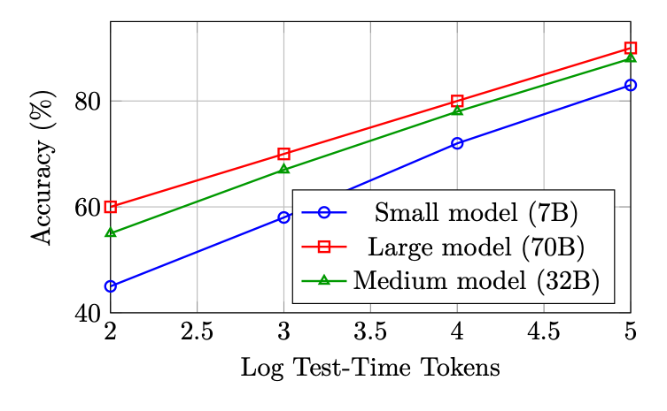
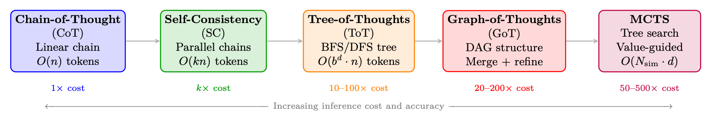
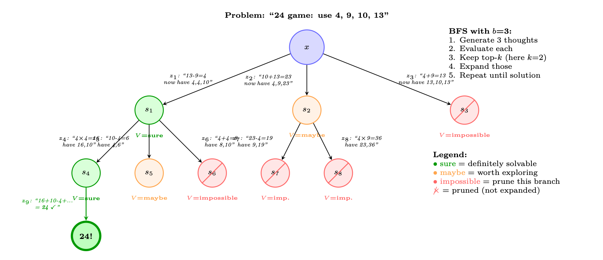
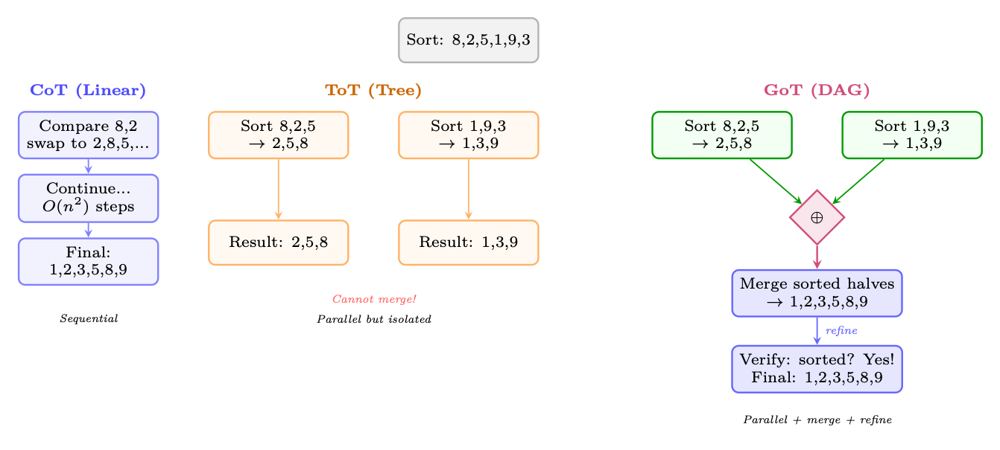
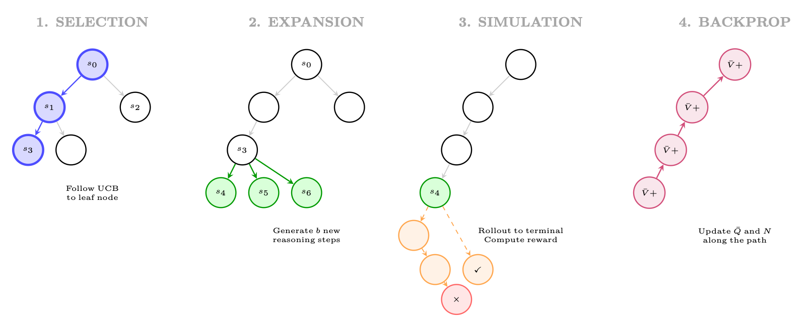

<div class="hh-guide">

<aside class="hh-part">
<p class="hh-part-title">第 III 部分 推理</p>
</aside>

大型推理模型的出现是现代 AI 最重要的进展之一。与优化下一个 Token 预测的标准语言模型训练不同，面向推理的强化学习教会模型<em>在回答之前先思考</em>——在推理时分配额外算力以探索、验证并精炼中间步骤。本节系统地介绍支撑这一范式的方法、架构与扩展律。

## 动机与背景

### 为什么推理需要不同的强化学习方法

标准的基于人类反馈的强化学习（Reinforcement Learning from Human Feedback, RLHF）（见第 4.3 RLHF 流水线 节）针对一段完整回答优化一个标量奖励。对于需要多步推理的任务——数学、形式化验证、竞赛编程、科学推导——这种表述在以下几个方面不够充分：

<ul><li>稀疏奖励：一道数学题可能需要 20 个中间步骤；单一的结果奖励无法为导致错误的中间步骤提供梯度信号。</li><li>长时序：推理链可能跨越数百到数千个 Token，造成严重的信用分配问题。</li><li>组合搜索：有效推理路径的空间呈指数级膨胀；模型必须学会高效搜索这一空间。</li><li>可验证性：与主观的文本质量不同，数学与逻辑的正确性是可客观验证的，从而无需人工标注即可自动计算奖励。</li></ul>

### 思维链：涌现行为 vs. 训练得到的能力

思维链（Chain-of-Thought，CoT）推理最初是在足够大的语言模型中被观察到的一种<em>涌现</em>能力 [374]：当用逐步示例进行 Prompt 时，大型模型（通常 <math alttext="\geq" display="inline"><semantics><mo>≥</mo></semantics></math>100B 参数）会自发地产生中间推理步骤，并由此提升准确率。这引出了一个基本问题：CoT 是规模带来的涌现性质，还是可以被显式训练？

正如 DeepSeek-R1 及相关工作所表明的，答案是两者皆是——但有若干重要的微妙之处：

<ul><li>涌现的 CoT 源于上下文学习并需要大型基础模型。它脆弱、对 Prompt 敏感，且泛化不稳定。</li><li>通过 RL 训练得到的 CoT 让模型能够<em>内在地</em>把推理链作为生成过程的一部分来生成，而不受提示风格影响。这些链条更长、更具探索性，并表现出质上不同的行为（自我纠正、回溯、验证）。</li></ul>

### 测试时计算的扩展律

推动推理模型研究的一个核心经验发现是：测试时算力与性能之间存在可预测的扩展关系。记 <math alttext="C_{\text{train}}" display="inline"><semantics><msub><mi>C</mi><mtext>train</mtext></msub></semantics></math> 为训练算力（FLOPs），<math alttext="C_{\text{test}}" display="inline"><semantics><msub><mi>C</mi><mtext>test</mtext></msub></semantics></math> 为推理算力（生成的 Token 数）。关键观察是：

<div class="hh-equation" id="ch13.e1"><math alttext="\text{Accuracy}(C_{\text{train}},C_{\text{test}})\approx f\!\left(\alpha\log C_{\text{train}}+\beta\log C_{\text{test}}\right)" display="block"><semantics><mrow><mrow><mtext>Accuracy</mtext><mo lspace="0em" rspace="0em">​</mo><mrow><mo stretchy="false">(</mo><msub><mi>C</mi><mtext>train</mtext></msub><mo>,</mo><msub><mi>C</mi><mtext>test</mtext></msub><mo stretchy="false">)</mo></mrow></mrow><mo>≈</mo><mrow><mpadded width="0.427em"><mi>f</mi></mpadded><mo>⁡</mo><mrow><mo>(</mo><mrow><mrow><mi>α</mi><mo lspace="0.167em" rspace="0em">​</mo><mrow><mi>log</mi><mo lspace="0.167em">⁡</mo><msub><mi>C</mi><mtext>train</mtext></msub></mrow></mrow><mo>+</mo><mrow><mi>β</mi><mo lspace="0.167em" rspace="0em">​</mo><mrow><mi>log</mi><mo lspace="0.167em">⁡</mo><msub><mi>C</mi><mtext>test</mtext></msub></mrow></mrow></mrow><mo>)</mo></mrow></mrow></mrow></semantics></math><span class="hh-equation-number">(13.1)</span></div>

其中 <math alttext="f" display="inline"><semantics><mi>f</mi></semantics></math> 是某个单调函数，<math alttext="\alpha,\beta&gt;0" display="inline"><semantics><mrow><mrow><mi>α</mi><mo>,</mo><mi>β</mi></mrow><mo>&gt;</mo><mn>0</mn></mrow></semantics></math> 为常数。这意味着：使用更多推理算力的较小模型可以匹敌使用较少推理算力的较大模型——这是算力与性能权衡的根本性转变。

<figure id="ch13.f1"><figcaption><span class="hh-tag">图 13.1：</span>测试时算力扩展曲线示意图。在各种模型规模下，性能随推理 Token 数对数线性提升；较小模型在更多算力下可以逼近较大模型在更少算力下的表现。</figcaption></figure>

其实践含义深远：推理模型用推理算力换取训练算力。不必总是部署尽可能大的模型，而是可以部署一个具备推理能力的较小模型，并在难题上分配更多 Token 用于“思考”。

## 测试时扩展方法

上述扩展律表明，在推理阶段投入更多算力可以显著提升推理性能。本节系统介绍将测试时扩展（Test-Time Scaling）落地的各类方法——从简单的思维链到复杂的树与图搜索算法。这些方法构成了一个用推理成本换取准确率的连续谱，理解其结构对于设计现代推理系统至关重要。

<figure id="ch13.f2"><figcaption><span class="hh-tag">图 13.2：</span>测试时扩展方法的连续谱。每种方法都以额外的推理算力换取更高的推理准确率。各方法在概念上层层递进：CoT 引入显式推理，Self-Consistency 加入采样，ToT 引入结构化搜索，GoT 加入合并操作，而 MCTS 加入学习到的价值引导。</figcaption></figure>

### 思维链（CoT）

思维链 Prompt [374] 是所有测试时扩展方法的基础。模型不再直接输出答案，而是生成中间推理步骤，将复杂问题分解为可处理的子问题。

Kojima 等 [189] 证明，仅在 Prompt 末尾追加“Let’s think step by step”就能在没有任何示例的情况下激发推理行为。这一简单触发器可以激活足够大模型（<math alttext="\geq" display="inline"><semantics><mo>≥</mo></semantics></math>100B 参数）中的潜在推理能力。

Wei 等 [374] 表明，提供少量带有显式推理轨迹的示例能够让较小的模型也有效地进行推理：

<div class="hh-equation" id="ch13.e2"><math alttext="\text{Prompt}=[(x_{1},z_{1},y_{1}),(x_{2},z_{2},y_{2}),\ldots,(x_{k},z_{k},y_{k}),(x_{\text{test}},\texttt{?})]" display="block"><semantics><mrow><mtext>Prompt</mtext><mo>=</mo><mrow><mo stretchy="false">[</mo><mrow><mrow><mo stretchy="false">(</mo><msub><mi>x</mi><mn>1</mn></msub><mo>,</mo><msub><mi>z</mi><mn>1</mn></msub><mo>,</mo><msub><mi>y</mi><mn>1</mn></msub><mo stretchy="false">)</mo></mrow><mo>,</mo><mrow><mo stretchy="false">(</mo><msub><mi>x</mi><mn>2</mn></msub><mo>,</mo><msub><mi>z</mi><mn>2</mn></msub><mo>,</mo><msub><mi>y</mi><mn>2</mn></msub><mo stretchy="false">)</mo></mrow><mo>,</mo><mi mathvariant="normal">…</mi><mo>,</mo><mrow><mo stretchy="false">(</mo><msub><mi>x</mi><mi>k</mi></msub><mo>,</mo><msub><mi>z</mi><mi>k</mi></msub><mo>,</mo><msub><mi>y</mi><mi>k</mi></msub><mo stretchy="false">)</mo></mrow><mo>,</mo><mrow><mo stretchy="false">(</mo><msub><mi>x</mi><mtext>test</mtext></msub><mo>,</mo><mtext>?</mtext><mo stretchy="false">)</mo></mrow></mrow><mo stretchy="false">]</mo></mrow></mrow></semantics></math><span class="hh-equation-number">(13.2)</span></div>

其中 <math alttext="z_{i}" display="inline"><semantics><msub><mi>z</mi><mi>i</mi></msub></semantics></math> 是为示例 <math alttext="(x_{i},y_{i})" display="inline"><semantics><mrow><mo stretchy="false">(</mo><msub><mi>x</mi><mi>i</mi></msub><mo>,</mo><msub><mi>y</mi><mi>i</mi></msub><mo stretchy="false">)</mo></mrow></semantics></math> 手工编写的推理轨迹。

CoT 将单步预测 <math alttext="p(y|x)" display="inline"><semantics><mrow><mi>p</mi><mo>⁡</mo><mrow><mo stretchy="false">(</mo><mi>y</mi><mo lspace="0em" rspace="0em">|</mo><mi>x</mi><mo stretchy="false">)</mo></mrow></mrow></semantics></math> 转化为多步序列生成：

<div class="hh-equation" id="ch13.e3"><math alttext="p(y|x)=\sum_{z}p(y|x,z)\cdot p(z|x)\approx p(y|x,z^{*})\cdot p(z^{*}|x)" display="block"><semantics><mrow><mrow><mi>p</mi><mo>⁡</mo><mrow><mo stretchy="false">(</mo><mi>y</mi><mo lspace="0em" rspace="0em">|</mo><mi>x</mi><mo stretchy="false">)</mo></mrow></mrow><mo rspace="0.111em">=</mo><mrow><mrow><munder><mo movablelimits="false">∑</mo><mi>z</mi></munder><mrow><mi>p</mi><mo>⁡</mo><mrow><mo stretchy="false">(</mo><mi>y</mi><mo lspace="0em" rspace="0em">|</mo><mrow><mi>x</mi><mo>,</mo><mi>z</mi></mrow><mo rspace="0.055em" stretchy="false">)</mo></mrow></mrow></mrow><mo rspace="0.222em">⋅</mo><mrow><mi>p</mi><mo>⁡</mo><mrow><mo stretchy="false">(</mo><mi>z</mi><mo lspace="0em" rspace="0em">|</mo><mi>x</mi><mo stretchy="false">)</mo></mrow></mrow></mrow><mo>≈</mo><mrow><mrow><mi>p</mi><mo>⁡</mo><mrow><mo stretchy="false">(</mo><mi>y</mi><mo lspace="0em" rspace="0em">|</mo><mrow><mi>x</mi><mo>,</mo><msup><mi>z</mi><mo>∗</mo></msup></mrow><mo rspace="0.055em" stretchy="false">)</mo></mrow></mrow><mo rspace="0.222em">⋅</mo><mrow><mi>p</mi><mo>⁡</mo><mrow><mo stretchy="false">(</mo><msup><mi>z</mi><mo>∗</mo></msup><mo lspace="0em" rspace="0em">|</mo><mi>x</mi><mo stretchy="false">)</mo></mrow></mrow></mrow></mrow></semantics></math><span class="hh-equation-number">(13.3)</span></div>

其中 <math alttext="z^{*}=(z_{1},z_{2},\ldots,z_{T})" display="inline"><semantics><mrow><msup><mi>z</mi><mo>∗</mo></msup><mo>=</mo><mrow><mo stretchy="false">(</mo><msub><mi>z</mi><mn>1</mn></msub><mo>,</mo><msub><mi>z</mi><mn>2</mn></msub><mo>,</mo><mi mathvariant="normal">…</mi><mo>,</mo><msub><mi>z</mi><mi>T</mi></msub><mo stretchy="false">)</mo></mrow></mrow></semantics></math> 是贪心推理链。对所有可能链条求和是不可计算的；标准 CoT 仅采用单一样本（贪心或温度采样）。

单链 CoT 是脆弱的：一旦早期推理步骤出错，后续所有步骤都会建立在错误基础上，且没有任何恢复机制。

### 自洽性（多数投票）

自洽性（Self-Consistency）[367] 通过采样多条独立的推理链并对最终答案取多数投票，来缓解 CoT 单链脆弱的问题：

<div class="hh-equation" id="ch13.e4"><math alttext="\hat{y}=\arg\max_{y}\sum_{i=1}^{N}\mathbf{1}[y_{i}=y],\quad\text{where }(z_{i},y_{i})\sim p(\cdot|x),\;T&gt;0" display="block"><semantics><mrow><mover accent="true"><mi>y</mi><mo>^</mo></mover><mo>=</mo><mi>arg</mi><munder><mi>max</mi><mi>y</mi></munder><munderover><mo movablelimits="false">∑</mo><mrow><mi>i</mi><mo>=</mo><mn>1</mn></mrow><mi>N</mi></munderover><mn>𝟏</mn><mrow><mo stretchy="false">[</mo><msub><mi>y</mi><mi>i</mi></msub><mo>=</mo><mi>y</mi><mo stretchy="false">]</mo></mrow><mo rspace="1.167em">,</mo><mtext>where </mtext><mrow><mo stretchy="false">(</mo><msub><mi>z</mi><mi>i</mi></msub><mo>,</mo><msub><mi>y</mi><mi>i</mi></msub><mo stretchy="false">)</mo></mrow><mo>∼</mo><mi>p</mi><mrow><mo stretchy="false">(</mo><mo lspace="0em" rspace="0em">⋅</mo><mo fence="false" rspace="0.167em" stretchy="false">|</mo><mi>x</mi><mo stretchy="false">)</mo></mrow><mo rspace="0.447em">,</mo><mi>T</mi><mo>&gt;</mo><mn>0</mn></mrow></semantics></math><span class="hh-equation-number">(13.4)</span></div>

关键性质：

<ul><li>使用 temperature <math alttext="T&gt;0" display="inline"><semantics><mrow><mi>T</mi><mo>&gt;</mo><mn>0</mn></mrow></semantics></math> 采样生成多样化的推理链（通常为 <math alttext="T=0.7" display="inline"><semantics><mrow><mi>T</mi><mo>=</mo><mn>0.7</mn></mrow></semantics></math>–<math alttext="1.0" display="inline"><semantics><mn>1.0</mn></semantics></math>）</li><li>链与链之间没有交互——完全可并行</li><li>准确率随 <math alttext="N" display="inline"><semantics><mi>N</mi></semantics></math> 单调提升（超过 <math alttext="N\approx 40" display="inline"><semantics><mrow><mi>N</mi><mo>≈</mo><mn>40</mn></mrow></semantics></math> 后收益递减）</li><li>在 GSM8K 上：CoT = 56.5%，Self-Consistency（<math alttext="N" display="inline"><semantics><mi>N</mi></semantics></math>=40）= 74.4%（使用 PaLM-540B [55]）</li><li>等价于以结果奖励做 Best-of-N（多数投票充当隐式的 ORM）</li></ul>

### 思维树（ToT）

思维树（Tree-of-Thoughts，ToT）[408] 将 CoT 从线性链条推广为树结构，使模型能够探索多条推理路径、评估中间状态，并从没有前途的分支回溯。这为推理过程引入了审慎的规划。

一个推理问题被分解为在一棵树上的搜索，其中：

<ul><li>根节点：初始问题陈述 <math alttext="x" display="inline"><semantics><mi>x</mi></semantics></math></li><li>节点：部分推理状态 <math alttext="s=(x,z_{1},\ldots,z_{k})" display="inline"><semantics><mrow><mi>s</mi><mo>=</mo><mrow><mo stretchy="false">(</mo><mi>x</mi><mo>,</mo><msub><mi>z</mi><mn>1</mn></msub><mo>,</mo><mi mathvariant="normal">…</mi><mo>,</mo><msub><mi>z</mi><mi>k</mi></msub><mo stretchy="false">)</mo></mrow></mrow></semantics></math></li><li>边：单个推理步骤（“thoughts”）<math alttext="z_{k+1}" display="inline"><semantics><msub><mi>z</mi><mrow><mi>k</mi><mo>+</mo><mn>1</mn></mrow></msub></semantics></math></li><li>叶节点：带最终答案的完整解</li><li>价值函数：<math alttext="V(s)" display="inline"><semantics><mrow><mi>V</mi><mo>⁡</mo><mrow><mo stretchy="false">(</mo><mi>s</mi><mo stretchy="false">)</mo></mrow></mrow></semantics></math> 估计某个部分解有多大的希望</li></ul>

<div class="hh-equation" id="ch13.e5"><math alttext="\text{ToT}=(\mathcal{G},\mathcal{E},V,\pi_{\theta},\text{Search})" display="block"><semantics><mrow><mtext>ToT</mtext><mo>=</mo><mrow><mo stretchy="false">(</mo><mi>𝒢</mi><mo>,</mo><mi>ℰ</mi><mo>,</mo><mi>V</mi><mo>,</mo><msub><mi>π</mi><mi>θ</mi></msub><mo>,</mo><mtext>Search</mtext><mo stretchy="false">)</mo></mrow></mrow></semantics></math><span class="hh-equation-number">(13.5)</span></div>

其中：

<ul><li><math alttext="\mathcal{G}" display="inline"><semantics><mi>𝒢</mi></semantics></math>：思考生成器——生成 <math alttext="b" display="inline"><semantics><mi>b</mi></semantics></math> 个候选的下一步思考：<math alttext="\{z^{(1)},\ldots,z^{(b)}\}\sim\pi_{\theta}(\cdot|s)" display="inline"><semantics><mrow><mrow><mo stretchy="false">{</mo><msup><mi>z</mi><mrow><mo stretchy="false">(</mo><mn>1</mn><mo stretchy="false">)</mo></mrow></msup><mo>,</mo><mi mathvariant="normal">…</mi><mo>,</mo><msup><mi>z</mi><mrow><mo stretchy="false">(</mo><mi>b</mi><mo stretchy="false">)</mo></mrow></msup><mo stretchy="false">}</mo></mrow><mo>∼</mo><msub><mi>π</mi><mi>θ</mi></msub><mrow><mo stretchy="false">(</mo><mo lspace="0em" rspace="0em">⋅</mo><mo fence="false" rspace="0.167em" stretchy="false">|</mo><mi>s</mi><mo stretchy="false">)</mo></mrow></mrow></semantics></math></li><li><math alttext="\mathcal{E}" display="inline"><semantics><mi>ℰ</mi></semantics></math>：状态评估器——为部分解打分：<math alttext="V(s)\in\{" display="inline"><semantics><mrow><mi>V</mi><mrow><mo stretchy="false">(</mo><mi>s</mi><mo stretchy="false">)</mo></mrow><mo>∈</mo><mo stretchy="false">{</mo></mrow></semantics></math><em>sure</em>、<em>maybe</em>、<em>impossible</em><math alttext="\}" display="inline"><semantics><mo stretchy="false">}</mo></semantics></math> 或 <math alttext="V(s)\in[0,1]" display="inline"><semantics><mrow><mrow><mi>V</mi><mo>⁡</mo><mrow><mo stretchy="false">(</mo><mi>s</mi><mo stretchy="false">)</mo></mrow></mrow><mo>∈</mo><mrow><mo stretchy="false">[</mo><mrow><mn>0</mn><mo>,</mo><mn>1</mn></mrow><mo stretchy="false">]</mo></mrow></mrow></semantics></math></li><li><math alttext="\pi_{\theta}" display="inline"><semantics><msub><mi>π</mi><mi>θ</mi></msub></semantics></math>：生成思考的语言模型</li><li>搜索：搜索算法（BFS 或 DFS）</li></ul>

<figure id="ch13.f3"><figcaption><span class="hh-tag">图 13.3：</span>“Game of 24”任务上的思维树：用 4、9、10、13 上的运算凑出 24。在每一层，模型生成 <math alttext="b=3" display="inline"><semantics><mrow><mi>b</mi><mo>=</mo><mn>3</mn></mrow></semantics></math> 个候选思考，对每个思考进行评估（sure/maybe/impossible），剪掉没有前途的分支，并扩展最有希望的几个。绿色路径通向解；红色路径被提前剪掉。</figcaption></figure>

BFS（广度优先搜索）：

<ol><li>在当前深度的每个节点上生成 <math alttext="b" display="inline"><semantics><mi>b</mi></semantics></math> 个候选思考</li><li>用 <math alttext="V(\cdot)" display="inline"><semantics><mrow><mi>V</mi><mo>⁡</mo><mrow><mo stretchy="false">(</mo><mo lspace="0em" rspace="0em">⋅</mo><mo stretchy="false">)</mo></mrow></mrow></semantics></math> 评估所有候选</li><li>保留 top-<math alttext="k" display="inline"><semantics><mi>k</mi></semantics></math> 最有希望的状态（束搜索）</li><li>把所有 <math alttext="k" display="inline"><semantics><mi>k</mi></semantics></math> 个状态推进到下一层</li><li>重复直到找到解或达到深度上限</li></ol>

DFS（深度优先搜索）：

<ol><li>为当前状态生成 <math alttext="b" display="inline"><semantics><mi>b</mi></semantics></math> 个候选思考</li><li>评估：如果 <math alttext="V(s)=" display="inline"><semantics><mrow><mrow><mi>V</mi><mo>⁡</mo><mrow><mo stretchy="false">(</mo><mi>s</mi><mo stretchy="false">)</mo></mrow></mrow><mo>=</mo><mphantom></mphantom></mrow></semantics></math> 为 <em>impossible</em>，立即回溯</li><li>如果 <math alttext="V(s)=" display="inline"><semantics><mrow><mrow><mi>V</mi><mo>⁡</mo><mrow><mo stretchy="false">(</mo><mi>s</mi><mo stretchy="false">)</mo></mrow></mrow><mo>=</mo><mphantom></mphantom></mrow></semantics></math> 为 <em>sure/maybe</em>，则递归深入（选最有希望的那个）</li><li>若达到深度上限仍未找到解，则回溯</li><li>继续直到找到解或所有分支都被探索</li></ol>

对于分支因子为 <math alttext="b" display="inline"><semantics><mi>b</mi></semantics></math>、深度为 <math alttext="d" display="inline"><semantics><mi>d</mi></semantics></math>、束宽为 <math alttext="k" display="inline"><semantics><mi>k</mi></semantics></math> 的 ToT：

<div class="hh-equation" id="ch13.e6"><math alttext="\text{LLM calls (BFS)}=\underbrace{k\cdot b}_{\text{generation}}+\underbrace{k\cdot b}_{\text{evaluation}}=2kb\text{ per level}\implies\text{Total}=2kbd" display="block"><semantics><mrow><mtext>LLM calls (BFS)</mtext><mo>=</mo><mrow><munder><munder accentunder="true"><mrow><mi>k</mi><mo lspace="0.222em" rspace="0.222em">⋅</mo><mi>b</mi></mrow><mo stretchy="true">⏟</mo></munder><mtext>generation</mtext></munder><mo>+</mo><munder><munder accentunder="true"><mrow><mi>k</mi><mo lspace="0.222em" rspace="0.222em">⋅</mo><mi>b</mi></mrow><mo stretchy="true">⏟</mo></munder><mtext>evaluation</mtext></munder></mrow><mo>=</mo><mrow><mn>2</mn><mo lspace="0em" rspace="0em">​</mo><mi>k</mi><mo lspace="0em" rspace="0em">​</mo><mi>b</mi><mo lspace="0em" rspace="0em">​</mo><mtext> per level</mtext></mrow><mo stretchy="false">⟹</mo><mtext>Total</mtext><mo>=</mo><mrow><mn>2</mn><mo lspace="0em" rspace="0em">​</mo><mi>k</mi><mo lspace="0em" rspace="0em">​</mo><mi>b</mi><mo lspace="0em" rspace="0em">​</mo><mi>d</mi></mrow></mrow></semantics></math><span class="hh-equation-number">(13.6)</span></div>

对于 24 点游戏：<math alttext="b=3,k=2,d=3\implies 36" display="inline"><semantics><mrow><mrow><mi>b</mi><mo>=</mo><mn>3</mn></mrow><mo>,</mo><mrow><mi>k</mi><mo>=</mo><mn>2</mn></mrow><mo>,</mo><mrow><mi>d</mi><mo>=</mo><mn>3</mn><mo stretchy="false">⟹</mo><mn>36</mn></mrow></mrow></semantics></math> 次 LLM 调用，而标准 CoT 只需 1 次。

在 Game of 24（一项有挑战性的算术推理任务）上，ToT 达到 74% 的成功率，而 CoT 仅为 4%——在同一个 base 模型（GPT-4）上，结构化搜索带来了巨大的提升。

### 思维图（GoT）

思维图（Graph-of-Thoughts，GoT）[25] 将 ToT 从树扩展为有向无环图（DAG），并引入了一项关键能力：合并来自不同分支的部分解。这使模型能够把多条推理路径上的洞见综合成一个精炼后的解。

GoT 在 ToT 之外引入了三种操作：

<ul><li>生成：从某个状态产生新的思考（与 ToT 相同）</li><li>聚合/合并：把多个思考组合成一个精炼后的思考——这在树结构中是不可能做到的</li><li>精炼：根据反馈迭代地改进某个思考</li><li>打分：评估思考的质量（等同于 ToT 的价值函数）</li></ul>

<figure id="ch13.f4"><figcaption><span class="hh-tag">图 13.4：</span>CoT（线性链条）、ToT（树——有分支但不合并）与 GoT（DAG——分支可以合并）的对比。对于排序任务，GoT 可以把数组拆分成子问题、独立（并行）求解，然后合并结果——这在纯树结构中是不可能的。这使分治式推理成为可能。</figcaption></figure>

设 <math alttext="\mathcal{V}=\{v_{1},\ldots,v_{n}\}" display="inline"><semantics><mrow><mi>𝒱</mi><mo>=</mo><mrow><mo stretchy="false">{</mo><msub><mi>v</mi><mn>1</mn></msub><mo>,</mo><mi mathvariant="normal">…</mi><mo>,</mo><msub><mi>v</mi><mi>n</mi></msub><mo stretchy="false">}</mo></mrow></mrow></semantics></math> 为思考顶点、<math alttext="\mathcal{E}\subseteq\mathcal{V}\times\mathcal{V}" display="inline"><semantics><mrow><mi>ℰ</mi><mo>⊆</mo><mrow><mi>𝒱</mi><mo lspace="0.222em" rspace="0.222em">×</mo><mi>𝒱</mi></mrow></mrow></semantics></math> 为有向边。GoT 支持：


聚合操作是关键的区分点：它从多个父节点连边到一个子节点，形成 DAG 而不是树。这使以下能力成为可能：

<ul><li>分治：拆分问题 <math alttext="\to" display="inline"><semantics><mo stretchy="false">→</mo></semantics></math> 并行求解子问题 <math alttext="\to" display="inline"><semantics><mo stretchy="false">→</mo></semantics></math> 合并解</li><li>集成推理：生成多个视角，然后综合出最好的想法</li><li>迭代精炼：把评估结果反馈回去，以改进此前的思考</li></ul>

在排序（一项需要合并的任务）上，GoT 在同等质量下比 ToT 降低 62% 的成本。在集合求交和关键词计数上，由于合并操作带来了更高效的分解，GoT 以少 30–40% 的 LLM 调用次数达到与 ToT 相当的质量。

### 结合奖励模型的 Best-of-N

Best-of-N（BoN）[262, 339] 是最简单的扩展方法，它使用学习到的奖励模型在候选之间进行选择：

<div class="hh-equation" id="ch13.e11"><math alttext="y^{*}=\arg\max_{y\in\{y_{1},\ldots,y_{N}\}}R_{\phi}(x,y),\quad y_{i}\sim\pi_{\theta}(\cdot|x)" display="block"><semantics><mrow><msup><mi>y</mi><mo>∗</mo></msup><mo>=</mo><mi>arg</mi><munder><mi>max</mi><mrow><mi>y</mi><mo>∈</mo><mrow><mo stretchy="false">{</mo><msub><mi>y</mi><mn>1</mn></msub><mo>,</mo><mi mathvariant="normal">…</mi><mo>,</mo><msub><mi>y</mi><mi>N</mi></msub><mo stretchy="false">}</mo></mrow></mrow></munder><msub><mi>R</mi><mi>ϕ</mi></msub><mrow><mo stretchy="false">(</mo><mi>x</mi><mo>,</mo><mi>y</mi><mo stretchy="false">)</mo></mrow><mo rspace="1.167em">,</mo><msub><mi>y</mi><mi>i</mi></msub><mo>∼</mo><msub><mi>π</mi><mi>θ</mi></msub><mrow><mo stretchy="false">(</mo><mo lspace="0em" rspace="0em">⋅</mo><mo fence="false" rspace="0.167em" stretchy="false">|</mo><mi>x</mi><mo stretchy="false">)</mo></mrow></mrow></semantics></math><span class="hh-equation-number">(13.11)</span></div>

按奖励模型类型划分的变体：

<ul><li>使用结果奖励模型（ORM）的 BoN：对完整解打分；选出得分最高的一个。当 ORM <math alttext="\approx" display="inline"><semantics><mo>≈</mo></semantics></math> 正确性检查时，它等价于自洽性。</li><li>使用过程奖励模型（PRM）的 BoN：在每个推理步骤上打分；选出最小步骤得分最高的解（最不可能在任何步骤上出错）。</li><li>加权 BoN：按奖励对候选加权：<math alttext="y^{*}\sim\text{softmax}(R(y_{1})/\tau,\ldots,R(y_{N})/\tau)" display="inline"><semantics><mrow><msup><mi>y</mi><mo>∗</mo></msup><mo>∼</mo><mrow><mtext>softmax</mtext><mo lspace="0em" rspace="0em">​</mo><mrow><mo stretchy="false">(</mo><mrow><mrow><mi>R</mi><mo>⁡</mo><mrow><mo stretchy="false">(</mo><msub><mi>y</mi><mn>1</mn></msub><mo stretchy="false">)</mo></mrow></mrow><mo>/</mo><mi>τ</mi></mrow><mo>,</mo><mi mathvariant="normal">…</mi><mo>,</mo><mrow><mrow><mi>R</mi><mo>⁡</mo><mrow><mo stretchy="false">(</mo><msub><mi>y</mi><mi>N</mi></msub><mo stretchy="false">)</mo></mrow></mrow><mo>/</mo><mi>τ</mi></mrow><mo stretchy="false">)</mo></mrow></mrow></mrow></semantics></math>。</li></ul>

### 面向推理的蒙特卡洛树搜索（MCTS）

蒙特卡洛树搜索（Monte Carlo Tree Search，MCTS）[187, 331] 把 ToT 的结构化探索与学习到的价值估计和访问次数统计结合起来，从而最优地分配推理算力。MCTS 最初为博弈（AlphaGo [331]）而提出，后来被 AlphaProof [68] 和 rStar [297] 等系统改造用于 LLM 推理。

每次 MCTS 迭代包含四个阶段：

<figure id="ch13.f5"><figcaption><span class="hh-tag">图 13.5：</span>面向推理的 MCTS 的四个阶段：(1) 选择：用 UCB 遍历树，找到一个有希望的叶子；(2) 扩展：从该叶子生成新的推理步骤；(3) 模拟：把推理补完到终止状态并评估；(4) 反向传播：沿路径更新价值估计。</figcaption></figure>

节点选择使用 PUCT（Predictor + UCB applied to Trees）：

<div class="hh-equation" id="ch13.e13"><math alttext="a^{*}=\arg\max_{a}\left[Q(s,a)+c_{\text{puct}}\cdot P(s,a)\cdot\frac{\sqrt{\sum_{b}N(s,b)}}{1+N(s,a)}\right]" display="block"><semantics><mrow><msup><mi>a</mi><mo>∗</mo></msup><mo>=</mo><mrow><mi>arg</mi><mo lspace="0.167em">⁡</mo><mrow><munder><mi>max</mi><mi>a</mi></munder><mo>⁡</mo><mrow><mo>[</mo><mrow><mrow><mi>Q</mi><mo>⁡</mo><mrow><mo stretchy="false">(</mo><mi>s</mi><mo>,</mo><mi>a</mi><mo stretchy="false">)</mo></mrow></mrow><mo>+</mo><mrow><msub><mi>c</mi><mtext>puct</mtext></msub><mo lspace="0.222em" rspace="0.222em">⋅</mo><mrow><mi>P</mi><mo>⁡</mo><mrow><mo stretchy="false">(</mo><mi>s</mi><mo>,</mo><mi>a</mi><mo rspace="0.055em" stretchy="false">)</mo></mrow></mrow><mo rspace="0.222em">⋅</mo><mfrac><msqrt><mrow><msub><mo>∑</mo><mi>b</mi></msub><mrow><mi>N</mi><mo>⁡</mo><mrow><mo stretchy="false">(</mo><mi>s</mi><mo>,</mo><mi>b</mi><mo stretchy="false">)</mo></mrow></mrow></mrow></msqrt><mrow><mn>1</mn><mo>+</mo><mrow><mi>N</mi><mo>⁡</mo><mrow><mo stretchy="false">(</mo><mi>s</mi><mo>,</mo><mi>a</mi><mo stretchy="false">)</mo></mrow></mrow></mrow></mfrac></mrow></mrow><mo>]</mo></mrow></mrow></mrow></mrow></semantics></math><span class="hh-equation-number">(13.13)</span></div>

其中 <math alttext="P(s,a)=\pi_{\theta}(a|s)" display="inline"><semantics><mrow><mrow><mi>P</mi><mo>⁡</mo><mrow><mo stretchy="false">(</mo><mi>s</mi><mo>,</mo><mi>a</mi><mo stretchy="false">)</mo></mrow></mrow><mo>=</mo><mrow><msub><mi>π</mi><mi>θ</mi></msub><mo lspace="0em" rspace="0em">​</mo><mrow><mo stretchy="false">(</mo><mi>a</mi><mo lspace="0em" rspace="0em">|</mo><mi>s</mi><mo stretchy="false">)</mo></mrow></mrow></mrow></semantics></math> 是 LLM 从状态 <math alttext="s" display="inline"><semantics><mi>s</mi></semantics></math> 生成步骤 <math alttext="a" display="inline"><semantics><mi>a</mi></semantics></math> 的先验概率。这会把探索偏向 LLM 认为更可能的步骤，而 UCB 项则鼓励尝试探索不足的替代方案。

<div class="hh-table" id="ch13.t1"><table class="ltx_tabular ltx_align_middle"><thead><tr><th class="ltx_align_left"><span>维度</span></th><th class="ltx_align_left ltx_align_top"><span class="ltx_align_top"><span><span>ToT</span></span></span></th><th class="ltx_align_left ltx_align_top"><span class="ltx_align_top"><span><span>MCTS</span></span></span></th></tr></thead><tbody><tr><th class="ltx_align_left">价值估计</th><td class="ltx_align_left ltx_align_top"><span class="ltx_align_top"><span>LLM Prompt（“sure/maybe/impossible”）</span></span></td><td class="ltx_align_left ltx_align_top"><span class="ltx_align_top"><span>学习到的价值网络 + rollout 统计</span></span></td></tr><tr><th class="ltx_align_left">探索</th><td class="ltx_align_left ltx_align_top"><span class="ltx_align_top"><span>固定的束宽；不重访</span></span></td><td class="ltx_align_left ltx_align_top"><span class="ltx_align_top"><span>UCB 自适应地把预算分配给有希望的节点</span></span></td></tr><tr><th class="ltx_align_left">算力分配</th><td class="ltx_align_left ltx_align_top"><span class="ltx_align_top"><span>在各深度层上均匀分配</span></span></td><td class="ltx_align_left ltx_align_top"><span class="ltx_align_top"><span>聚焦：把更多模拟用在更难的子问题上</span></span></td></tr><tr><th class="ltx_align_left">与训练的集成</th><td class="ltx_align_left ltx_align_top"><span class="ltx_align_top"><span>无需训练；纯 Prompt</span></span></td><td class="ltx_align_left ltx_align_top"><span class="ltx_align_top"><span>可以把 MCTS 策略蒸馏进 base 模型 <span>[331]</span></span></span></td></tr><tr><th class="ltx_align_left">最适合</th><td class="ltx_align_left ltx_align_top"><span class="ltx_align_top"><span>简单的分支问题（24 点游戏）</span></span></td><td class="ltx_align_left ltx_align_top"><span class="ltx_align_top"><span>需要深度探索的复杂问题（证明、代码）</span></span></td></tr></tbody></table><p class="hh-table-caption"><span class="hh-tag">表 13.1：</span>面向推理的思维树与蒙特卡洛树搜索对比。</p></div>

### 推理步级的束搜索

束搜索——长期以来是 NMT 和文本生成中的标准方法——可以应用在<em>推理步骤</em>层面而不是 Token 层面。我们不再跟踪 top-<math alttext="k" display="inline"><semantics><mi>k</mi></semantics></math> 个 Token 序列，而是跟踪 top-<math alttext="k" display="inline"><semantics><mi>k</mi></semantics></math> 个推理前缀：

<div class="hh-equation" id="ch13.e14"><math alttext="\mathcal{B}_{d}=\text{top-}k\left\{(s_{1},\ldots,s_{d}):\sum_{i=1}^{d}\log\pi_{\theta}(s_{i}|s_{&lt;i})+\lambda\cdot V_{\phi}(s_{1},\ldots,s_{d})\right\}" display="block"><semantics><mrow><msub><mi>ℬ</mi><mi>d</mi></msub><mo>=</mo><mrow><mtext>top-</mtext><mo lspace="0em" rspace="0em">​</mo><mi>k</mi><mo lspace="0em" rspace="0em">​</mo><mrow><mo>{</mo><mrow><mo stretchy="false">(</mo><msub><mi>s</mi><mn>1</mn></msub><mo>,</mo><mi mathvariant="normal">…</mi><mo>,</mo><msub><mi>s</mi><mi>d</mi></msub><mo rspace="0.278em" stretchy="false">)</mo></mrow><mo rspace="0.111em">:</mo><mrow><mrow><munderover><mo movablelimits="false">∑</mo><mrow><mi>i</mi><mo>=</mo><mn>1</mn></mrow><mi>d</mi></munderover><mrow><mrow><mi>log</mi><mo lspace="0.167em">⁡</mo><msub><mi>π</mi><mi>θ</mi></msub></mrow><mo lspace="0em" rspace="0em">​</mo><mrow><mo stretchy="false">(</mo><msub><mi>s</mi><mi>i</mi></msub><mo lspace="0em" rspace="0em">|</mo><msub><mi>s</mi><mrow><mphantom></mphantom><mo>&lt;</mo><mi>i</mi></mrow></msub><mo stretchy="false">)</mo></mrow></mrow></mrow><mo>+</mo><mrow><mrow><mi>λ</mi><mo lspace="0.222em" rspace="0.222em">⋅</mo><msub><mi>V</mi><mi>ϕ</mi></msub></mrow><mo lspace="0em" rspace="0em">​</mo><mrow><mo stretchy="false">(</mo><msub><mi>s</mi><mn>1</mn></msub><mo>,</mo><mi mathvariant="normal">…</mi><mo>,</mo><msub><mi>s</mi><mi>d</mi></msub><mo stretchy="false">)</mo></mrow></mrow></mrow><mo>}</mo></mrow></mrow></mrow></semantics></math><span class="hh-equation-number">(13.14)</span></div>

其中打分把 LLM 的对数概率（流畅性）与价值模型的估计（正确性）结合起来。这实际上就是用学习到的价值函数代替 Prompt 出来的价值函数的 ToT-BFS。

### 迭代精炼与自我纠正

与探索<em>广度</em>（多条并行链）不同，迭代精炼把算力投入到<em>深度</em>上——反复改进同一个解：

<div class="hh-equation" id="ch13.e15"><math alttext="y^{(t+1)}=\text{LLM}\!\left(\text{``Improve this solution:''},y^{(t)},\text{``Errors found:''},e^{(t)}\right)" display="block"><semantics><mrow><msup><mi>y</mi><mrow><mo stretchy="false">(</mo><mrow><mi>t</mi><mo>+</mo><mn>1</mn></mrow><mo stretchy="false">)</mo></mrow></msup><mo>=</mo><mpadded width="2.270em"><mtext>LLM</mtext></mpadded><mrow><mo>(</mo><mtext>“Improve this solution:”</mtext><mo>,</mo><msup><mi>y</mi><mrow><mo stretchy="false">(</mo><mi>t</mi><mo stretchy="false">)</mo></mrow></msup><mo>,</mo><mtext>“Errors found:”</mtext><mo>,</mo><msup><mi>e</mi><mrow><mo stretchy="false">(</mo><mi>t</mi><mo stretchy="false">)</mo></mrow></msup><mo>)</mo></mrow></mrow></semantics></math><span class="hh-equation-number">(13.15)</span></div>

其中 <math alttext="e^{(t)}" display="inline"><semantics><msup><mi>e</mi><mrow><mo stretchy="false">(</mo><mi>t</mi><mo stretchy="false">)</mo></mrow></msup></semantics></math> 可以来自：

<ul><li>自我验证：让模型检查自己的答案</li><li>外部验证：运行代码、用符号方式检查数学</li><li>评判模型：用一个单独的模型来识别错误</li></ul>

值得注意的方法包括：Self-Refine[246]（迭代式自我反馈）、Reflexion[326]（通过在记忆中存储的反思实现的语言化 RL），以及 LATS[438]（树搜索 + 基于反思的剪枝）。

### 方法对比与选型指南

<div class="hh-table" id="ch13.t2"><table class="ltx_tabular ltx_align_middle"><thead><tr><th class="ltx_align_left"><span>方法</span></th><th class="ltx_align_left"><span>结构</span></th><th class="ltx_align_left"><span>LLM 调用次数</span></th><th class="ltx_align_left"><span>可并行</span></th><th class="ltx_align_left"><span>需要 RM？</span></th><th class="ltx_align_left"><span>最适合</span></th></tr></thead><tbody><tr><th class="ltx_align_left"><span>CoT <span>[374]</span></span></th><th class="ltx_align_left"><span>链条</span></th><th class="ltx_align_left"><span>1</span></th><td class="ltx_align_left"><span>N/A</span></td><td class="ltx_align_left"><span>否</span></td><td class="ltx_align_left"><span>简单到中等难度的问题</span></td></tr><tr><th class="ltx_align_left"><span>Self-Consistency <span>[367]</span></span></th><th class="ltx_align_left"><span>并行链</span></th><th class="ltx_align_left"><math alttext="N" display="inline"><semantics><mi mathsize="0.800em">N</mi><span></span></semantics></math></th><td class="ltx_align_left"><span>✓ 完全并行</span></td><td class="ltx_align_left"><span>否（多数投票）</span></td><td class="ltx_align_left"><span>答案离散的数学题</span></td></tr><tr><th class="ltx_align_left"><span>Best-of-N + ORM</span></th><th class="ltx_align_left"><span>并行链</span></th><th class="ltx_align_left"><math alttext="N" display="inline"><semantics><mi mathsize="0.800em">N</mi><span></span></semantics></math><span> + 1</span></th><td class="ltx_align_left"><span>✓ 完全并行</span></td><td class="ltx_align_left"><span>是（ORM）</span></td><td class="ltx_align_left"><span>有良好 RM 的通用任务</span></td></tr><tr><th class="ltx_align_left"><span>Best-of-N + PRM</span></th><th class="ltx_align_left"><span>并行链</span></th><th class="ltx_align_left"><math alttext="N" display="inline"><semantics><mi mathsize="0.800em">N</mi><span></span></semantics></math><span> + <math alttext="N{\cdot}K" display="inline"><semantics><mrow><mi>N</mi><mo lspace="0.222em" rspace="0.222em">⋅</mo><mi>K</mi></mrow><span></span></semantics></math></span></th><td class="ltx_align_left"><span>✓ 完全并行</span></td><td class="ltx_align_left"><span>是（PRM）</span></td><td class="ltx_align_left"><span>复杂的多步推理</span></td></tr><tr><th class="ltx_align_left"><span>ToT <span>[408]</span></span></th><th class="ltx_align_left"><span>树（BFS/DFS）</span></th><th class="ltx_align_left"><math alttext="O(kbd)" display="inline"><semantics><mrow><mi mathsize="0.800em">O</mi><mo>⁡</mo><mrow><mo maxsize="0.800em" minsize="0.800em">(</mo><mrow><mi mathsize="0.800em">k</mi><mo lspace="0em" rspace="0em">​</mo><mi mathsize="0.800em">b</mi><mo lspace="0em" rspace="0em">​</mo><mi mathsize="0.800em">d</mi></mrow><mo maxsize="0.800em" minsize="0.800em">)</mo></mrow></mrow><span></span></semantics></math></th><td class="ltx_align_left"><span>部分并行</span></td><td class="ltx_align_left"><span>LLM 作为评判者</span></td><td class="ltx_align_left"><span>结构化搜索问题</span></td></tr><tr><th class="ltx_align_left"><span>GoT <span>[25]</span></span></th><th class="ltx_align_left"><span>DAG</span></th><th class="ltx_align_left"><math alttext="O(kbd)" display="inline"><semantics><mrow><mi mathsize="0.800em">O</mi><mo>⁡</mo><mrow><mo maxsize="0.800em" minsize="0.800em">(</mo><mrow><mi mathsize="0.800em">k</mi><mo lspace="0em" rspace="0em">​</mo><mi mathsize="0.800em">b</mi><mo lspace="0em" rspace="0em">​</mo><mi mathsize="0.800em">d</mi></mrow><mo maxsize="0.800em" minsize="0.800em">)</mo></mrow></mrow><span></span></semantics></math></th><td class="ltx_align_left"><span>部分并行</span></td><td class="ltx_align_left"><span>LLM 作为评判者</span></td><td class="ltx_align_left"><span>可分解的问题</span></td></tr><tr><th class="ltx_align_left"><span>MCTS <span>[187]</span></span></th><th class="ltx_align_left"><span>树 + 价值</span></th><th class="ltx_align_left"><math alttext="O(N_{\text{sim}}\cdot d)" display="inline"><semantics><mrow><mi mathsize="0.800em">O</mi><mo>⁡</mo><mrow><mo maxsize="0.800em" minsize="0.800em">(</mo><mrow><msub><mi mathsize="0.800em">N</mi><mtext mathsize="0.800em">sim</mtext></msub><mo lspace="0.222em" mathsize="0.800em" rspace="0.222em">⋅</mo><mi mathsize="0.800em">d</mi></mrow><mo maxsize="0.800em" minsize="0.800em">)</mo></mrow></mrow><span></span></semantics></math></th><td class="ltx_align_left"><span>部分并行</span></td><td class="ltx_align_left"><span>是（价值网络）</span></td><td class="ltx_align_left"><span>困难的证明、编程</span></td></tr><tr><th class="ltx_align_left"><span>Self-Refine <span>[246]</span></span></th><th class="ltx_align_left"><span>线性（迭代）</span></th><th class="ltx_align_left"><math alttext="2T" display="inline"><semantics><mrow><mn mathsize="0.800em">2</mn><mo lspace="0em" rspace="0em">​</mo><mi mathsize="0.800em">T</mi></mrow><span></span></semantics></math></th><td class="ltx_align_left"><span>否</span></td><td class="ltx_align_left"><span>自我评判</span></td><td class="ltx_align_left"><span>开放式生成</span></td></tr><tr><th class="ltx_align_left"><span>LATS <span>[438]</span></span></th><th class="ltx_align_left"><span>树 + 反思</span></th><th class="ltx_align_left"><math alttext="O(N\cdot d)" display="inline"><semantics><mrow><mi mathsize="0.800em">O</mi><mo>⁡</mo><mrow><mo maxsize="0.800em" minsize="0.800em">(</mo><mrow><mi mathsize="0.800em">N</mi><mo lspace="0.222em" mathsize="0.800em" rspace="0.222em">⋅</mo><mi mathsize="0.800em">d</mi></mrow><mo maxsize="0.800em" minsize="0.800em">)</mo></mrow></mrow><span></span></semantics></math></th><td class="ltx_align_left"><span>部分并行</span></td><td class="ltx_align_left"><span>LLM 作为评判者</span></td><td class="ltx_align_left"><span>智能体任务</span></td></tr></tbody></table><p class="hh-table-caption"><span class="hh-tag">表 13.2：</span>测试时扩展方法的全面对比。</p></div>

## DeepSeek-R1

DeepSeek-R1 [69] 是首个在主要基准上追平或超越 OpenAI o1 的完全开源的大型推理模型。其训练流水线在技术上是透明的，已成为基于 RL 的推理的事实参考实现。

### 两阶段训练流程

base 模型（DeepSeek-V3）首先在一个小而精心构建的长思维链示例数据集上进行微调。这个“冷启动”阶段有两个目的：

<ol><li>格式初始化：模型学会在给出最终答案之前以 <code>&lt;think&gt;...&lt;/think&gt;</code> 格式产出推理。</li><li>稳定性：如果没有冷启动 SFT，直接在 base 模型上从零开始做纯 RL 会产生不稳定的训练动力学和退化的输出（例如语言混杂、重复循环）。</li></ol>

冷启动数据集只包含 <math alttext="\sim" display="inline"><semantics><mo>∼</mo></semantics></math>数千条示例，刻意保持很小，以避免把 RL 之后将要发现的推理风格过度约束住。

冷启动 SFT 之后，模型使用组相对策略优化（Group Relative Policy Optimization，GRPO）进行大规模 RL。R1 中使用的完整 GRPO 目标见第 13.3.3 R1 中的 GRPO 公式 节。

### 奖励设计：准确率奖励与格式奖励

R1 的一个关键设计选择是不使用过程奖励模型。相反，R1 使用两种简单、可自动计算的奖励：

对于答案可验证的数学问题：

<div class="hh-equation" id="ch13.e16"><math alttext="r_{\text{acc}}(y,y^{*})=\begin{cases}1&amp;\text{if }\texttt{verify}(y,y^{*})=\texttt{True}\\
0&amp;\text{otherwise}\end{cases}" display="block"><semantics><mrow><mrow><msub><mi>r</mi><mtext>acc</mtext></msub><mo lspace="0em" rspace="0em">​</mo><mrow><mo stretchy="false">(</mo><mi>y</mi><mo>,</mo><msup><mi>y</mi><mo>∗</mo></msup><mo stretchy="false">)</mo></mrow></mrow><mo>=</mo><mrow><mo>{</mo><mtable columnspacing="5pt" displaystyle="true" rowspacing="0pt"><mtr><mtd columnalign="left"><mn>1</mn></mtd><mtd columnalign="left"><mrow><mrow><mrow><mtext>if </mtext><mtext>verify</mtext></mrow><mo lspace="0em" rspace="0em">​</mo><mrow><mo stretchy="false">(</mo><mi>y</mi><mo>,</mo><msup><mi>y</mi><mo>∗</mo></msup><mo stretchy="false">)</mo></mrow></mrow><mo>=</mo><mtext>True</mtext></mrow></mtd></mtr><mtr><mtd columnalign="left"><mn>0</mn></mtd><mtd columnalign="left"><mtext>otherwise</mtext></mtd></mtr></mtable></mrow></mrow></semantics></math><span class="hh-equation-number">(13.16)</span></div>

其中 <math alttext="y" display="inline"><semantics><mi>y</mi></semantics></math> 是模型的最终答案（从 <code>⟨answer⟩</code> 标签中提取），<math alttext="y^{*}" display="inline"><semantics><msup><mi>y</mi><mo>∗</mo></msup></semantics></math> 是标准答案。<code>verify</code> 函数使用符号数学比较（例如 SymPy）来处理等价形式。

对于代码问题，准确率奖励由是否通过测试用例决定：

<div class="hh-equation" id="ch13.e17"><math alttext="r_{\text{acc}}^{\text{code}}(y,\mathcal{T})=\frac{1}{|\mathcal{T}|}\sum_{t\in\mathcal{T}}\mathbf{1}[\texttt{execute}(y,t)=\texttt{expected}(t)]" display="block"><semantics><mrow><msubsup><mi>r</mi><mtext>acc</mtext><mtext>code</mtext></msubsup><mrow><mo stretchy="false">(</mo><mi>y</mi><mo>,</mo><mi>𝒯</mi><mo stretchy="false">)</mo></mrow><mo>=</mo><mfrac><mn>1</mn><mrow><mo stretchy="false">|</mo><mi>𝒯</mi><mo stretchy="false">|</mo></mrow></mfrac><munder><mo movablelimits="false">∑</mo><mrow><mi>t</mi><mo>∈</mo><mi>𝒯</mi></mrow></munder><mn>𝟏</mn><mrow><mo stretchy="false">[</mo><mtext>execute</mtext><mrow><mo stretchy="false">(</mo><mi>y</mi><mo>,</mo><mi>t</mi><mo stretchy="false">)</mo></mrow><mo>=</mo><mtext>expected</mtext><mrow><mo stretchy="false">(</mo><mi>t</mi><mo stretchy="false">)</mo></mrow><mo stretchy="false">]</mo></mrow></mrow></semantics></math><span class="hh-equation-number">(13.17)</span></div>

为了强制 <code>&lt;think&gt;...&lt;/think&gt;</code> 结构：

<div class="hh-equation" id="ch13.e18"><math alttext="r_{\text{fmt}}(y)=\begin{cases}1&amp;y\text{ has valid \textlangle think\textrangle and \textlangle answer\textrangle tags}\\
0&amp;\text{otherwise}\end{cases}" display="block"><semantics><mrow><mrow><msub><mi>r</mi><mtext>fmt</mtext></msub><mo lspace="0em" rspace="0em">​</mo><mrow><mo stretchy="false">(</mo><mi>y</mi><mo stretchy="false">)</mo></mrow></mrow><mo>=</mo><mrow><mo>{</mo><mtable columnspacing="5pt" displaystyle="true" rowspacing="0pt"><mtr><mtd columnalign="left"><mn>1</mn></mtd><mtd columnalign="left"><mrow><mi>y</mi><mo lspace="0em" rspace="0em">​</mo><mtext> has valid ⟨think⟩ and ⟨answer⟩ tags</mtext></mrow></mtd></mtr><mtr><mtd columnalign="left"><mn>0</mn></mtd><mtd columnalign="left"><mtext>otherwise</mtext></mtd></mtr></mtable></mrow></mrow></semantics></math><span class="hh-equation-number">(13.18)</span></div>

<div class="hh-equation" id="ch13.e19"><math alttext="r(y,y^{*})=r_{\text{acc}}(y,y^{*})+\lambda_{\text{fmt}}\cdot r_{\text{fmt}}(y)" display="block"><semantics><mrow><mrow><mi>r</mi><mo>⁡</mo><mrow><mo stretchy="false">(</mo><mi>y</mi><mo>,</mo><msup><mi>y</mi><mo>∗</mo></msup><mo stretchy="false">)</mo></mrow></mrow><mo>=</mo><mrow><mrow><msub><mi>r</mi><mtext>acc</mtext></msub><mo lspace="0em" rspace="0em">​</mo><mrow><mo stretchy="false">(</mo><mi>y</mi><mo>,</mo><msup><mi>y</mi><mo>∗</mo></msup><mo stretchy="false">)</mo></mrow></mrow><mo>+</mo><mrow><mrow><msub><mi>λ</mi><mtext>fmt</mtext></msub><mo lspace="0.222em" rspace="0.222em">⋅</mo><msub><mi>r</mi><mtext>fmt</mtext></msub></mrow><mo lspace="0em" rspace="0em">​</mo><mrow><mo stretchy="false">(</mo><mi>y</mi><mo stretchy="false">)</mo></mrow></mrow></mrow></mrow></semantics></math><span class="hh-equation-number">(13.19)</span></div>

其中在原始实现中 <math alttext="\lambda_{\text{fmt}}=0.1" display="inline"><semantics><mrow><msub><mi>λ</mi><mtext>fmt</mtext></msub><mo>=</mo><mn>0.1</mn></mrow></semantics></math>（足够小以免占据主导，又足够大以防止格式崩塌）。

### R1 中的 GRPO 公式

GRPO [323] 是一种策略梯度方法，它通过从采样的<em>组</em>回复中估计优势，避免了训练单独的价值网络。对于问题 <math alttext="q" display="inline"><semantics><mi>q</mi></semantics></math>，GRPO 从当前策略 <math alttext="\pi_{\theta}" display="inline"><semantics><msub><mi>π</mi><mi>θ</mi></msub></semantics></math> 中采样 <math alttext="G" display="inline"><semantics><mi>G</mi></semantics></math> 个回复 <math alttext="\{y_{1},y_{2},\ldots,y_{G}\}" display="inline"><semantics><mrow><mo stretchy="false">{</mo><mrow><msub><mi>y</mi><mn>1</mn></msub><mo>,</mo><msub><mi>y</mi><mn>2</mn></msub><mo>,</mo><mi mathvariant="normal">…</mi><mo>,</mo><msub><mi>y</mi><mi>G</mi></msub></mrow><mo stretchy="false">}</mo></mrow></semantics></math>，并计算相对于组均值的优势。

给定问题 <math alttext="q" display="inline"><semantics><mi>q</mi></semantics></math>，采样 <math alttext="G" display="inline"><semantics><mi>G</mi></semantics></math> 个输出：

<div class="hh-equation" id="ch13.e20"><math alttext="\{y_{i}\}_{i=1}^{G}\sim\pi_{\theta}(\cdot\mid q)" display="block"><semantics><mrow><msubsup><mrow><mo stretchy="false">{</mo><msub><mi>y</mi><mi>i</mi></msub><mo stretchy="false">}</mo></mrow><mrow><mi>i</mi><mo>=</mo><mn>1</mn></mrow><mi>G</mi></msubsup><mo>∼</mo><msub><mi>π</mi><mi>θ</mi></msub><mrow><mo stretchy="false">(</mo><mo lspace="0em" rspace="0em">⋅</mo><mo lspace="0em" rspace="0.167em">∣</mo><mi>q</mi><mo stretchy="false">)</mo></mrow></mrow></semantics></math><span class="hh-equation-number">(13.20)</span></div>

使用式 [eq:r1_combined_reward] 的奖励函数计算 Reward <math alttext="\{r_{i}\}_{i=1}^{G}" display="inline"><semantics><msubsup><mrow><mo stretchy="false">{</mo><msub><mi>r</mi><mi>i</mi></msub><mo stretchy="false">}</mo></mrow><mrow><mi>i</mi><mo>=</mo><mn>1</mn></mrow><mi>G</mi></msubsup></semantics></math>。第 <math alttext="i" display="inline"><semantics><mi>i</mi></semantics></math> 个回答的归一化优势为：

<div class="hh-equation" id="ch13.e21"><math alttext="\hat{A}_{i}=\frac{r_{i}-\mu_{r}}{\sigma_{r}+\epsilon}" display="block"><semantics><mrow><msub><mover accent="true"><mi>A</mi><mo>^</mo></mover><mi>i</mi></msub><mo>=</mo><mfrac><mrow><msub><mi>r</mi><mi>i</mi></msub><mo>−</mo><msub><mi>μ</mi><mi>r</mi></msub></mrow><mrow><msub><mi>σ</mi><mi>r</mi></msub><mo>+</mo><mi>ϵ</mi></mrow></mfrac></mrow></semantics></math><span class="hh-equation-number">(13.21)</span></div>

其中 <math alttext="\mu_{r}=\frac{1}{G}\sum_{i=1}^{G}r_{i}" display="inline"><semantics><mrow><msub><mi>μ</mi><mi>r</mi></msub><mo>=</mo><mrow><mfrac><mn>1</mn><mi>G</mi></mfrac><mo lspace="0em" rspace="0em">​</mo><mrow><msubsup><mo>∑</mo><mrow><mi>i</mi><mo>=</mo><mn>1</mn></mrow><mi>G</mi></msubsup><msub><mi>r</mi><mi>i</mi></msub></mrow></mrow></mrow></semantics></math>，<math alttext="\sigma_{r}=\sqrt{\frac{1}{G}\sum_{i=1}^{G}(r_{i}-\mu_{r})^{2}}" display="inline"><semantics><mrow><msub><mi>σ</mi><mi>r</mi></msub><mo>=</mo><msqrt><mrow><mfrac><mn>1</mn><mi>G</mi></mfrac><mo lspace="0em" rspace="0em">​</mo><mrow><msubsup><mo rspace="0em">∑</mo><mrow><mi>i</mi><mo>=</mo><mn>1</mn></mrow><mi>G</mi></msubsup><msup><mrow><mo stretchy="false">(</mo><mrow><msub><mi>r</mi><mi>i</mi></msub><mo>−</mo><msub><mi>μ</mi><mi>r</mi></msub></mrow><mo stretchy="false">)</mo></mrow><mn>2</mn></msup></mrow></mrow></msqrt></mrow></semantics></math>，<math alttext="\epsilon=10^{-8}" display="inline"><semantics><mrow><mi>ϵ</mi><mo>=</mo><msup><mn>10</mn><mrow><mo>−</mo><mn>8</mn></mrow></msup></mrow></semantics></math> 用于数值稳定。

GRPO 目标对概率比做截断（与 PPO 相同），并对参考 Policy <math alttext="\pi_{\text{ref}}" display="inline"><semantics><msub><mi>π</mi><mtext>ref</mtext></msub></semantics></math> 加上 KL 惩罚：

<div class="hh-equation" id="ch13.e22"><math alttext="\mathcal{L}_{\text{GRPO}}(\theta)=-\mathbb{E}_{q\sim\mathcal{D},\,\{y_{i}\}\sim\pi_{\theta}(\cdot|q)}\Bigg[\frac{1}{G}\sum_{i=1}^{G}\frac{1}{|y_{i}|}\sum_{t=1}^{|y_{i}|}\\
\min\!\left(\rho_{i,t}\,\hat{A}_{i},\;\text{clip}(\rho_{i,t},1{-}\varepsilon,1{+}\varepsilon)\,\hat{A}_{i}\right)-\beta\,\mathbb{D}_{\mathrm{KL}}\!\left[\pi_{\theta}\,\|\,\pi_{\text{ref}}\right]\Bigg]" display="block"><semantics><mtable displaystyle="true" rowspacing="0pt"><mtr><mtd columnalign="left"><mrow><mi>ℒ</mi><msub><mrow></mrow><mtext>GRPO</mtext></msub><mo stretchy="false">(</mo><mi>θ</mi><mo stretchy="false">)</mo><mo rspace="0em">=</mo><mo lspace="0em">−</mo><mi>𝔼</mi><msub><mrow></mrow><mrow><mi>q</mi><mo>∼</mo><mi>𝒟</mi><mo rspace="0.337em">,</mo><mo stretchy="false">{</mo><mi>y</mi><msub><mrow></mrow><mi>i</mi></msub><mo stretchy="false">}</mo><mo>∼</mo><mi>π</mi><msub><mrow></mrow><mi>θ</mi></msub><mo stretchy="false">(</mo><mo lspace="0em" rspace="0em">⋅</mo><mo fence="false" rspace="0.167em" stretchy="false">|</mo><mi>q</mi><mo stretchy="false">)</mo></mrow></msub><mo maxsize="2.600em" minsize="2.600em">[</mo><mfrac><mn>1</mn><mi>G</mi></mfrac><mo movablelimits="false">∑</mo><msub><mrow></mrow><mrow><mi>i</mi><mo>=</mo><mn>1</mn></mrow></msub><msup><mrow></mrow><mi>G</mi></msup><mfrac><mn>1</mn><mrow><mo stretchy="false">|</mo><msub><mi>y</mi><mi>i</mi></msub><mo stretchy="false">|</mo></mrow></mfrac><mo movablelimits="false">∑</mo><msub><mrow></mrow><mrow><mi>t</mi><mo>=</mo><mn>1</mn></mrow></msub><msup><mrow></mrow><mrow><mo stretchy="false">|</mo><msub><mi>y</mi><mi>i</mi></msub><mo stretchy="false">|</mo></mrow></msup></mrow></mtd></mtr><mtr><mtd columnalign="right"><mrow><mpadded width="1.483em"><mi>min</mi></mpadded><mo>(</mo><mi>ρ</mi><msub><mrow></mrow><mrow><mi>i</mi><mo>,</mo><mi>t</mi></mrow></msub><mover accent="true"><mi>A</mi><mo>^</mo></mover><msub><mrow></mrow><mi>i</mi></msub><mo rspace="0.727em">,</mo><mtext>clip</mtext><mo stretchy="false">(</mo><mi>ρ</mi><msub><mrow></mrow><mrow><mi>i</mi><mo>,</mo><mi>t</mi></mrow></msub><mo>,</mo><mn>1</mn><mo>−</mo><mi>ε</mi><mo>,</mo><mn>1</mn><mo>+</mo><mi>ε</mi><mo rspace="0.170em" stretchy="false">)</mo><mover accent="true"><mi>A</mi><mo>^</mo></mover><msub><mrow></mrow><mi>i</mi></msub><mo>)</mo><mo>−</mo><mi>β</mi><mpadded width="0.552em"><mi>𝔻</mi></mpadded><msub><mrow></mrow><mi>KL</mi></msub><mo>[</mo><mi>π</mi><msub><mrow></mrow><mi>θ</mi></msub><mo lspace="0.170em" rspace="0.507em">∥</mo><mi>π</mi><msub><mrow></mrow><mtext>ref</mtext></msub><mo>]</mo><mo maxsize="2.600em" minsize="2.600em">]</mo></mrow></mtd></mtr></mtable></semantics></math><span class="hh-equation-number">(13.22)</span></div>

其中：

<ul><li><math alttext="\rho_{i,t}=\dfrac{\pi_{\theta}(y_{i,t}\mid q,y_{i,&lt;t})}{\pi_{\theta_{\text{old}}}(y_{i,t}\mid q,y_{i,&lt;t})}" display="inline"><semantics><mrow><msub><mi>ρ</mi><mrow><mi>i</mi><mo>,</mo><mi>t</mi></mrow></msub><mo>=</mo><mstyle displaystyle="true"><mfrac><mrow><msub><mi>π</mi><mi>θ</mi></msub><mo lspace="0em" rspace="0em">​</mo><mrow><mo stretchy="false">(</mo><msub><mi>y</mi><mrow><mi>i</mi><mo>,</mo><mi>t</mi></mrow></msub><mo fence="true" lspace="0em" rspace="0em">∣</mo><mrow><mi>q</mi><mo>,</mo><msub><mi>y</mi><mrow><mrow><mi>i</mi><mo>,</mo><mphantom></mphantom></mrow><mo>&lt;</mo><mi>t</mi></mrow></msub></mrow><mo stretchy="false">)</mo></mrow></mrow><mrow><msub><mi>π</mi><msub><mi>θ</mi><mtext>old</mtext></msub></msub><mo lspace="0em" rspace="0em">​</mo><mrow><mo stretchy="false">(</mo><msub><mi>y</mi><mrow><mi>i</mi><mo>,</mo><mi>t</mi></mrow></msub><mo fence="true" lspace="0em" rspace="0em">∣</mo><mrow><mi>q</mi><mo>,</mo><msub><mi>y</mi><mrow><mrow><mi>i</mi><mo>,</mo><mphantom></mphantom></mrow><mo>&lt;</mo><mi>t</mi></mrow></msub></mrow><mo stretchy="false">)</mo></mrow></mrow></mfrac></mstyle></mrow></semantics></math> 是逐 Token 的概率比</li><li><math alttext="\varepsilon\in\{0.1,0.2\}" display="inline"><semantics><mrow><mi>ε</mi><mo>∈</mo><mrow><mo stretchy="false">{</mo><mrow><mn>0.1</mn><mo>,</mo><mn>0.2</mn></mrow><mo stretchy="false">}</mo></mrow></mrow></semantics></math> 是 PPO 的截断参数</li><li><math alttext="\beta&gt;0" display="inline"><semantics><mrow><mi>β</mi><mo>&gt;</mo><mn>0</mn></mrow></semantics></math> 控制 KL 惩罚的强度</li><li><math alttext="|y_{i}|" display="inline"><semantics><mrow><mo stretchy="false">|</mo><msub><mi>y</mi><mi>i</mi></msub><mo stretchy="false">|</mo></mrow></semantics></math> 是第 <math alttext="i" display="inline"><semantics><mi>i</mi></semantics></math> 个回答的长度（长度归一化可防止偏向较短回答）</li></ul>

KL 散度项逐 Token 计算：

<div class="hh-equation" id="ch13.e23"><math alttext="\mathbb{D}_{\mathrm{KL}}\!\left[\pi_{\theta}\,\|\,\pi_{\text{ref}}\right]=\mathbb{E}_{y\sim\pi_{\theta}(\cdot|q)}\left[\sum_{t=1}^{|y|}\log\frac{\pi_{\theta}(y_{t}\mid q,y_{&lt;t})}{\pi_{\text{ref}}(y_{t}\mid q,y_{&lt;t})}\right]" display="block"><semantics><mrow><msub><mi>𝔻</mi><mi>KL</mi></msub><mrow><mo>[</mo><msub><mi>π</mi><mi>θ</mi></msub><mo lspace="0em" rspace="0.337em">∥</mo><msub><mi>π</mi><mtext>ref</mtext></msub><mo>]</mo></mrow><mo>=</mo><msub><mi>𝔼</mi><mrow><mi>y</mi><mo>∼</mo><mi>π</mi><msub><mrow></mrow><mi>θ</mi></msub><mo stretchy="false">(</mo><mo lspace="0em" rspace="0em">⋅</mo><mo fence="false" rspace="0.167em" stretchy="false">|</mo><mi>q</mi><mo stretchy="false">)</mo></mrow></msub><mrow><mo>[</mo><munderover><mo lspace="0em" movablelimits="false">∑</mo><mrow><mi>t</mi><mo>=</mo><mn>1</mn></mrow><mrow><mo stretchy="false">|</mo><mi>y</mi><mo stretchy="false">|</mo></mrow></munderover><mi>log</mi><mfrac><mrow><msub><mi>π</mi><mi>θ</mi></msub><mo lspace="0em" rspace="0em">​</mo><mrow><mo stretchy="false">(</mo><msub><mi>y</mi><mi>t</mi></msub><mo fence="true" lspace="0em" rspace="0em">∣</mo><mrow><mi>q</mi><mo>,</mo><msub><mi>y</mi><mrow><mphantom></mphantom><mo>&lt;</mo><mi>t</mi></mrow></msub></mrow><mo stretchy="false">)</mo></mrow></mrow><mrow><msub><mi>π</mi><mtext>ref</mtext></msub><mo lspace="0em" rspace="0em">​</mo><mrow><mo stretchy="false">(</mo><msub><mi>y</mi><mi>t</mi></msub><mo fence="true" lspace="0em" rspace="0em">∣</mo><mrow><mi>q</mi><mo>,</mo><msub><mi>y</mi><mrow><mphantom></mphantom><mo>&lt;</mo><mi>t</mi></mrow></msub></mrow><mo stretchy="false">)</mo></mrow></mrow></mfrac><mo>]</mo></mrow></mrow></semantics></math><span class="hh-equation-number">(13.23)</span></div>

在实践中，R1 使用一种 KL 的无偏估计器，通过下列近似避免在每一步都计算 <math alttext="\pi_{\text{ref}}" display="inline"><semantics><msub><mi>π</mi><mtext>ref</mtext></msub></semantics></math>：

<div class="hh-equation" id="ch13.e24"><math alttext="\mathbb{D}_{\mathrm{KL}}\!\left[\pi_{\theta}\,\|\,\pi_{\text{ref}}\right]\approx\frac{\pi_{\text{ref}}(y_{t}\mid q,y_{&lt;t})}{\pi_{\theta}(y_{t}\mid q,y_{&lt;t})}-\log\frac{\pi_{\text{ref}}(y_{t}\mid q,y_{&lt;t})}{\pi_{\theta}(y_{t}\mid q,y_{&lt;t})}-1" display="block"><semantics><mrow><msub><mi>𝔻</mi><mi>KL</mi></msub><mrow><mo>[</mo><msub><mi>π</mi><mi>θ</mi></msub><mo lspace="0em" rspace="0.337em">∥</mo><msub><mi>π</mi><mtext>ref</mtext></msub><mo>]</mo></mrow><mo>≈</mo><mfrac><mrow><msub><mi>π</mi><mtext>ref</mtext></msub><mo lspace="0em" rspace="0em">​</mo><mrow><mo stretchy="false">(</mo><msub><mi>y</mi><mi>t</mi></msub><mo fence="true" lspace="0em" rspace="0em">∣</mo><mrow><mi>q</mi><mo>,</mo><msub><mi>y</mi><mrow><mphantom></mphantom><mo>&lt;</mo><mi>t</mi></mrow></msub></mrow><mo stretchy="false">)</mo></mrow></mrow><mrow><msub><mi>π</mi><mi>θ</mi></msub><mo lspace="0em" rspace="0em">​</mo><mrow><mo stretchy="false">(</mo><msub><mi>y</mi><mi>t</mi></msub><mo fence="true" lspace="0em" rspace="0em">∣</mo><mrow><mi>q</mi><mo>,</mo><msub><mi>y</mi><mrow><mphantom></mphantom><mo>&lt;</mo><mi>t</mi></mrow></msub></mrow><mo stretchy="false">)</mo></mrow></mrow></mfrac><mo>−</mo><mi>log</mi><mfrac><mrow><msub><mi>π</mi><mtext>ref</mtext></msub><mo lspace="0em" rspace="0em">​</mo><mrow><mo stretchy="false">(</mo><msub><mi>y</mi><mi>t</mi></msub><mo fence="true" lspace="0em" rspace="0em">∣</mo><mrow><mi>q</mi><mo>,</mo><msub><mi>y</mi><mrow><mphantom></mphantom><mo>&lt;</mo><mi>t</mi></mrow></msub></mrow><mo stretchy="false">)</mo></mrow></mrow><mrow><msub><mi>π</mi><mi>θ</mi></msub><mo lspace="0em" rspace="0em">​</mo><mrow><mo stretchy="false">(</mo><msub><mi>y</mi><mi>t</mi></msub><mo fence="true" lspace="0em" rspace="0em">∣</mo><mrow><mi>q</mi><mo>,</mo><msub><mi>y</mi><mrow><mphantom></mphantom><mo>&lt;</mo><mi>t</mi></mrow></msub></mrow><mo stretchy="false">)</mo></mrow></mrow></mfrac><mo>−</mo><mn>1</mn></mrow></semantics></math><span class="hh-equation-number">(13.24)</span></div>

该估计器恒为非负，且当 <math alttext="\pi_{\theta}=\pi_{\text{ref}}" display="inline"><semantics><mrow><msub><mi>π</mi><mi>θ</mi></msub><mo>=</mo><msub><mi>π</mi><mtext>ref</mtext></msub></mrow></semantics></math> 时为零。

### 蒸馏：R1-Distill 系列

R1 的一项重要实践贡献在于证明：推理能力可以通过在 R1 生成链上进行监督微调蒸馏到小得多的模型中。R1-Distill 系列（1.5B、7B、8B、14B、32B、70B 参数）的训练方式为：

<ol><li>使用 R1（671B）为一个大规模问题集生成长 CoT 解答</li><li>过滤，仅保留正确的解答</li><li>在这些解答上对较小的基础模型（Qwen2.5、Llama-3）进行微调</li></ol>

蒸馏路径引出了一个关于推理本质的重要问题：小模型究竟是真的在「推理」，还是只是在对推理链的表面形式进行模式匹配？经验上，蒸馏模型对新颖问题类型表现出一定的泛化能力，提示其确实在某种程度上内化了推理策略，而非纯粹的记忆。

## OpenAI o1/o3 系列

OpenAI 的 o1 [275]（2024 年 9 月发布）以及随后的 o3/o4-mini [278] 模型代表了推理模型开发的商业前沿。尽管完整技术细节仍未公开，但已发布的系统卡、技术报告与经验观察为理解其方法论提供了大量洞见。

### 带隐藏推理 Token 的思维链 RL

o1 的决定性架构选择是使用隐藏推理 Token：模型生成一条不向用户展示的内部思维链（称为「推理轨迹」或「思考 Token」）。只返回最终答案。这一设计带来若干影响：

<ul><li>无格式约束：隐藏推理可以使用任意格式，包括草稿本记法、伪代码，甚至非英语推理。</li><li>不存在风格上的奖励作弊：由于用户永远看不到推理过程，模型没有压力去让它显得「好看」，而不是真正有用。</li><li>专有保护：推理过程不被暴露，从而防止直接模仿。</li></ul>

训练过程被描述为「用 RL 训练模型进行推理」，RL 目标作用于完整的（隐藏推理 + 最终答案）序列，并且只根据最终答案的质量给予奖励。

### 过程奖励模型与结果奖励模型

据信，OpenAI 的方法在结果奖励之外还使用了过程奖励模型（Process Reward Models, PRMs）[216]，这与 DeepSeek-R1 仅使用结果奖励的做法形成对比。该推断基于 OpenAI 已发表的 PRM 研究（PRM800K 数据集、「Let's Verify Step by Step」）以及 o1 系统卡对推理链上 RL 训练的表述，尽管 o1/o3 的确切训练方案尚未公开披露。

ORM 对完整回答 <math alttext="(q,y)" display="inline"><semantics><mrow><mo stretchy="false">(</mo><mi>q</mi><mo>,</mo><mi>y</mi><mo stretchy="false">)</mo></mrow></semantics></math> 打分：

<div class="hh-equation" id="ch13.e25"><math alttext="R_{\text{ORM}}(q,y)\in[0,1]" display="block"><semantics><mrow><mrow><msub><mi>R</mi><mtext>ORM</mtext></msub><mo lspace="0em" rspace="0em">​</mo><mrow><mo stretchy="false">(</mo><mi>q</mi><mo>,</mo><mi>y</mi><mo stretchy="false">)</mo></mrow></mrow><mo>∈</mo><mrow><mo stretchy="false">[</mo><mrow><mn>0</mn><mo>,</mo><mn>1</mn></mrow><mo stretchy="false">]</mo></mrow></mrow></semantics></math><span class="hh-equation-number">(13.25)</span></div>

对于可验证的任务（数学、代码），这退化为精确匹配验证。对于开放式任务，则使用学习得到的奖励模型。

PRM 为链 <math alttext="y=(s_{1},s_{2},\ldots,s_{K})" display="inline"><semantics><mrow><mi>y</mi><mo>=</mo><mrow><mo stretchy="false">(</mo><msub><mi>s</mi><mn>1</mn></msub><mo>,</mo><msub><mi>s</mi><mn>2</mn></msub><mo>,</mo><mi mathvariant="normal">…</mi><mo>,</mo><msub><mi>s</mi><mi>K</mi></msub><mo stretchy="false">)</mo></mrow></mrow></semantics></math> 中的每个推理步骤 <math alttext="s_{k}" display="inline"><semantics><msub><mi>s</mi><mi>k</mi></msub></semantics></math> 分配奖励：

<div class="hh-equation" id="ch13.e26"><math alttext="R_{\text{PRM}}(q,y)=\sum_{k=1}^{K}\gamma^{K-k}\cdot r_{k}(q,s_{1},\ldots,s_{k})" display="block"><semantics><mrow><mrow><msub><mi>R</mi><mtext>PRM</mtext></msub><mo lspace="0em" rspace="0em">​</mo><mrow><mo stretchy="false">(</mo><mi>q</mi><mo>,</mo><mi>y</mi><mo stretchy="false">)</mo></mrow></mrow><mo rspace="0.111em">=</mo><mrow><mrow><mrow><munderover><mo movablelimits="false">∑</mo><mrow><mi>k</mi><mo>=</mo><mn>1</mn></mrow><mi>K</mi></munderover><msup><mi>γ</mi><mrow><mi>K</mi><mo>−</mo><mi>k</mi></mrow></msup></mrow><mo lspace="0.222em" rspace="0.222em">⋅</mo><msub><mi>r</mi><mi>k</mi></msub></mrow><mo lspace="0em" rspace="0em">​</mo><mrow><mo stretchy="false">(</mo><mi>q</mi><mo>,</mo><msub><mi>s</mi><mn>1</mn></msub><mo>,</mo><mi mathvariant="normal">…</mi><mo>,</mo><msub><mi>s</mi><mi>k</mi></msub><mo stretchy="false">)</mo></mrow></mrow></mrow></semantics></math><span class="hh-equation-number">(13.26)</span></div>

其中 <math alttext="r_{k}\in[0,1]" display="inline"><semantics><mrow><msub><mi>r</mi><mi>k</mi></msub><mo>∈</mo><mrow><mo stretchy="false">[</mo><mrow><mn>0</mn><mo>,</mo><mn>1</mn></mrow><mo stretchy="false">]</mo></mrow></mrow></semantics></math> 是步级别的奖励，<math alttext="\gamma\in(0,1]" display="inline"><semantics><mrow><mi>γ</mi><mo>∈</mo><mrow><mo stretchy="false">(</mo><mn>0</mn><mo>,</mo><mn>1</mn><mo stretchy="false">]</mo></mrow></mrow></semantics></math> 是折扣因子。步级别的奖励 <math alttext="r_{k}" display="inline"><semantics><msub><mi>r</mi><mi>k</mi></msub></semantics></math> 估计部分解 <math alttext="(s_{1},\ldots,s_{k})" display="inline"><semantics><mrow><mo stretchy="false">(</mo><msub><mi>s</mi><mn>1</mn></msub><mo>,</mo><mi mathvariant="normal">…</mi><mo>,</mo><msub><mi>s</mi><mi>k</mi></msub><mo stretchy="false">)</mo></mrow></semantics></math> 导向正确最终答案的概率：

<div class="hh-equation" id="ch13.e27"><math alttext="r_{k}(q,s_{1},\ldots,s_{k})=P(\text{correct final answer}\mid q,s_{1},\ldots,s_{k})" display="block"><semantics><mrow><mrow><msub><mi>r</mi><mi>k</mi></msub><mo lspace="0em" rspace="0em">​</mo><mrow><mo stretchy="false">(</mo><mi>q</mi><mo>,</mo><msub><mi>s</mi><mn>1</mn></msub><mo>,</mo><mi mathvariant="normal">…</mi><mo>,</mo><msub><mi>s</mi><mi>k</mi></msub><mo stretchy="false">)</mo></mrow></mrow><mo>=</mo><mrow><mi>P</mi><mo>⁡</mo><mrow><mo stretchy="false">(</mo><mtext>correct final answer</mtext><mo fence="true" lspace="0em" rspace="0em">∣</mo><mrow><mi>q</mi><mo>,</mo><msub><mi>s</mi><mn>1</mn></msub><mo>,</mo><mi mathvariant="normal">…</mi><mo>,</mo><msub><mi>s</mi><mi>k</mi></msub></mrow><mo stretchy="false">)</mo></mrow></mrow></mrow></semantics></math><span class="hh-equation-number">(13.27)</span></div>

### 推理时计算扩展

o1 技术报告展示了一条清晰的扩展律：在困难推理任务上，更多的思考 Token 会单调地提升性能。这通过一个「思考预算」参数来落实，该参数控制隐藏推理 Token 的最大数量。

设 <math alttext="T" display="inline"><semantics><mi>T</mi></semantics></math> 为思考 Token 预算。观察到的经验扩展律近似为：

<div class="hh-equation" id="ch13.e28"><math alttext="\text{Pass@1}(T)\approx a-b\cdot T^{-c}" display="block"><semantics><mrow><mrow><mtext>Pass@1</mtext><mo lspace="0em" rspace="0em">​</mo><mrow><mo stretchy="false">(</mo><mi>T</mi><mo stretchy="false">)</mo></mrow></mrow><mo>≈</mo><mrow><mi>a</mi><mo>−</mo><mrow><mi>b</mi><mo lspace="0.222em" rspace="0.222em">⋅</mo><msup><mi>T</mi><mrow><mo>−</mo><mi>c</mi></mrow></msup></mrow></mrow></mrow></semantics></math><span class="hh-equation-number">(13.28)</span></div>

其中 <math alttext="a,b,c&gt;0" display="inline"><semantics><mrow><mi>a</mi><mo>,</mo><mi>b</mi><mo>,</mo><mrow><mi>c</mi><mo>&gt;</mo><mn>0</mn></mrow></mrow></semantics></math> 为常数，<math alttext="a" display="inline"><semantics><mi>a</mi></semantics></math> 表示渐近准确率上限，<math alttext="c" display="inline"><semantics><mi>c</mi></semantics></math> 刻画改进速率。在 AIME 2024 上，使用完整思考预算的 o1 达到 <math alttext="\sim" display="inline"><semantics><mo>∼</mo></semantics></math>83% 的准确率，而 GPT-4o（不使用扩展思考）为 <math alttext="\sim" display="inline"><semantics><mo>∼</mo></semantics></math>13%。

### 训练计算量与测试时计算量

o1/o3 系列的一个根本性洞见是计算等价原理：训练计算量 <math alttext="C_{\text{train}}" display="inline"><semantics><msub><mi>C</mi><mtext>train</mtext></msub></semantics></math> 与测试时计算量 <math alttext="C_{\text{test}}" display="inline"><semantics><msub><mi>C</mi><mtext>test</mtext></msub></semantics></math> 之间存在一条权衡曲线，曲线上的点能达到相近的性能：

<div class="hh-equation" id="ch13.e29"><math alttext="\text{Performance}(C_{\text{train}},C_{\text{test}})=g\!\left(\alpha C_{\text{train}}^{p}+\beta C_{\text{test}}^{q}\right)" display="block"><semantics><mrow><mrow><mtext>Performance</mtext><mo lspace="0em" rspace="0em">​</mo><mrow><mo stretchy="false">(</mo><msub><mi>C</mi><mtext>train</mtext></msub><mo>,</mo><msub><mi>C</mi><mtext>test</mtext></msub><mo stretchy="false">)</mo></mrow></mrow><mo>=</mo><mrow><mpadded width="0.343em"><mi>g</mi></mpadded><mo>⁡</mo><mrow><mo>(</mo><mrow><mrow><mi>α</mi><mo lspace="0em" rspace="0em">​</mo><msubsup><mi>C</mi><mtext>train</mtext><mi>p</mi></msubsup></mrow><mo>+</mo><mrow><mi>β</mi><mo lspace="0em" rspace="0em">​</mo><msubsup><mi>C</mi><mtext>test</mtext><mi>q</mi></msubsup></mrow></mrow><mo>)</mo></mrow></mrow></mrow></semantics></math><span class="hh-equation-number">(13.29)</span></div>

经验上，对于推理任务 <math alttext="p\approx q" display="inline"><semantics><mrow><mi>p</mi><mo>≈</mo><mi>q</mi></mrow></semantics></math>，这表明训练计算量与测试时计算量大致可以相互替代。这对部署有深远影响：一个更小、更便宜的模型配合扩展思考，可以在困难问题上匹敌更大的模型，代价是更高的延迟。

### o3 与 o4-mini 的架构洞察

尽管 o3 与 o4-mini 的细节大多仍未公开，但已经出现了一些观察：

<ul><li>o3：思考预算显著大于 o1；在 ARC-AGI 上达到接近人类的表现（高计算量下为 87.5%）。据信在推理时使用了更复杂的搜索策略。</li><li>o4-mini：证明了经过 RL 训练推理的<em>更小</em>模型也可以极具竞争力。在 AIME 2025 上配合扩展思考达到 93%，表明对于数学而言，模型规模不如推理能力重要。</li><li>工具使用：o3/o4-mini 将工具使用（代码执行、网络搜索）集成到推理过程中，使模型能够以编程方式验证中间步骤。</li></ul>

## QwQ 与 Qwen 推理模型

阿里巴巴的 Qwen 团队开发了一系列推理模型（QwQ-32B [351]、Qwen3 [352]），与 DeepSeek-R1 一同代表了开源前沿。他们的方法在几个关键方面有所不同。

### 多阶段 RL 流水线

Qwen 的推理流水线采用更为精细的多阶段方法：

<ol><li>基础预训练：具有强大数学与编码能力的 Qwen2.5 基础模型</li><li>在多样化推理数据上做 SFT：在广泛的推理任务混合数据（数学、代码、科学、逻辑）上微调</li><li>拒绝采样微调（Rejection Sampling Fine-Tuning, RFT）：为每个问题生成 <math alttext="N" display="inline"><semantics><mi>N</mi></semantics></math> 个解答，保留正确的，再进行微调</li><li>RL 阶段 1：在数学与代码上使用带可验证奖励的 GRPO</li><li>RL 阶段 2：更广泛的 RL，包括指令跟随与安全性</li></ol>

### 拒绝采样与 RL 的结合

Qwen 方法中的一个关键创新是拒绝采样与 RL 的迭代组合：

<ol><li>初始化：从 SFT 模型得到 Policy <math alttext="\pi_{0}" display="inline"><semantics><msub><mi>π</mi><mn>0</mn></msub></semantics></math>。</li><li>拒绝采样：采样 <math alttext="N" display="inline"><semantics><mi>N</mi></semantics></math> 个解答：<math alttext="\{y_{i}\}_{i=1}^{N}\sim\pi_{k-1}(\cdot\mid q)" display="inline"><semantics><mrow><msubsup><mrow><mo stretchy="false">{</mo><msub><mi>y</mi><mi>i</mi></msub><mo stretchy="false">}</mo></mrow><mrow><mi>i</mi><mo>=</mo><mn>1</mn></mrow><mi>N</mi></msubsup><mo>∼</mo><msub><mi>π</mi><mrow><mi>k</mi><mo>−</mo><mn>1</mn></mrow></msub><mrow><mo stretchy="false">(</mo><mo lspace="0em" rspace="0em">⋅</mo><mo lspace="0em" rspace="0.167em">∣</mo><mi>q</mi><mo stretchy="false">)</mo></mrow></mrow></semantics></math>。保留正确的解答：<math alttext="\mathcal{Y}^{+}(q)=\{y_{i}:r(y_{i},y^{*})=1\}" display="inline"><semantics><mrow><mrow><msup><mi>𝒴</mi><mo>+</mo></msup><mo lspace="0em" rspace="0em">​</mo><mrow><mo stretchy="false">(</mo><mi>q</mi><mo stretchy="false">)</mo></mrow></mrow><mo>=</mo><mrow><mo stretchy="false">{</mo><msub><mi>y</mi><mi>i</mi></msub><mo lspace="0.278em" rspace="0.278em">:</mo><mrow><mrow><mi>r</mi><mo>⁡</mo><mrow><mo stretchy="false">(</mo><msub><mi>y</mi><mi>i</mi></msub><mo>,</mo><msup><mi>y</mi><mo>∗</mo></msup><mo stretchy="false">)</mo></mrow></mrow><mo>=</mo><mn>1</mn></mrow><mo stretchy="false">}</mo></mrow></mrow></semantics></math>。</li><li>SFT 更新：<math alttext="\pi_{k}^{\text{SFT}}\leftarrow\text{SFT}(\pi_{k-1},\bigcup_{q}\mathcal{Y}^{+}(q))" display="inline"><semantics><mrow><msubsup><mi>π</mi><mi>k</mi><mtext>SFT</mtext></msubsup><mo stretchy="false">←</mo><mrow><mtext>SFT</mtext><mo lspace="0em" rspace="0em">​</mo><mrow><mo stretchy="false">(</mo><msub><mi>π</mi><mrow><mi>k</mi><mo>−</mo><mn>1</mn></mrow></msub><mo rspace="0em">,</mo><mrow><msub><mo>⋃</mo><mi>q</mi></msub><mrow><msup><mi>𝒴</mi><mo>+</mo></msup><mo lspace="0em" rspace="0em">​</mo><mrow><mo stretchy="false">(</mo><mi>q</mi><mo stretchy="false">)</mo></mrow></mrow></mrow><mo stretchy="false">)</mo></mrow></mrow></mrow></semantics></math></li><li>RL 更新：<math alttext="\pi_{k}\leftarrow\text{GRPO}(\pi_{k}^{\text{SFT}},\mathcal{D})" display="inline"><semantics><mrow><msub><mi>π</mi><mi>k</mi></msub><mo stretchy="false">←</mo><mrow><mtext>GRPO</mtext><mo lspace="0em" rspace="0em">​</mo><mrow><mo stretchy="false">(</mo><msubsup><mi>π</mi><mi>k</mi><mtext>SFT</mtext></msubsup><mo>,</mo><mi>𝒟</mi><mo stretchy="false">)</mo></mrow></mrow></mrow></semantics></math></li><li>重复第 2–4 步 <math alttext="K" display="inline"><semantics><mi>K</mi></semantics></math> 次迭代，得到最终 Policy <math alttext="\pi_{K}" display="inline"><semantics><msub><mi>π</mi><mi>K</mi></msub></semantics></math>。</li></ol>

拒绝采样步骤提供高质量的正样本以锚定 Policy，而 RL 则探索当前分布之外的空间。这种组合比纯 RL 更稳定，也比纯 SFT 能力更强。

### 工具集成推理

QwQ-32B 与 Qwen3 模型支持工具集成推理：模型可以在推理链中调用外部工具（Python 解释器、搜索引擎、计算器）。这通过特殊 Token 实现：

```
<think>
Let me solve this step by step.
First, I'll compute the eigenvalues of the matrix.

<tool_call>
{"name": "python", "arguments": {"code": "import numpy as np\nA = np.array([[2,1],[1,3]])\neigenvalues = np.linalg.eigvals(A)\nprint(eigenvalues)"}}
</tool_call>

<tool_response>
[1.38196601 3.61803399]
</tool_response>

The eigenvalues are approximately 1.382 and 3.618.
These are (5 +/- sqrt(5))/2, which are the golden ratio and its conjugate...
</think>
<answer>The eigenvalues are (5 +/- sqrt(5))/2</answer>
```

<span class="hh-tag">代码清单 7：</span>QwQ 中的工具集成推理格式

RL 训练的奖励基于最终答案计算，但模型会学会策略性地使用工具，因为使用工具能提高得到正确答案的概率。

## 关键方法及其数学基础

### 用于推理的蒙特卡洛树搜索

蒙特卡洛树搜索（Monte Carlo Tree Search, MCTS）为把推理视为树搜索提供了有原则的框架。在 AlphaProof [68] 及相关系统中，MCTS 作用于推理步骤而非棋步。

<ul><li>状态<math alttext="s_{k}" display="inline"><semantics><msub><mi>s</mi><mi>k</mi></msub></semantics></math>：部分推理链 <math alttext="(q,r_{1},r_{2},\ldots,r_{k})" display="inline"><semantics><mrow><mo stretchy="false">(</mo><mi>q</mi><mo>,</mo><msub><mi>r</mi><mn>1</mn></msub><mo>,</mo><msub><mi>r</mi><mn>2</mn></msub><mo>,</mo><mi mathvariant="normal">…</mi><mo>,</mo><msub><mi>r</mi><mi>k</mi></msub><mo stretchy="false">)</mo></mrow></semantics></math>，其中 <math alttext="r_{i}" display="inline"><semantics><msub><mi>r</mi><mi>i</mi></msub></semantics></math> 是推理步骤</li><li>动作<math alttext="a" display="inline"><semantics><mi>a</mi></semantics></math>：下一个推理步骤（一句话或一段话）</li><li>终止状态：包含最终答案的状态</li><li>奖励：<math alttext="R(s_{\text{terminal}})=r_{\text{acc}}" display="inline"><semantics><mrow><mrow><mi>R</mi><mo>⁡</mo><mrow><mo stretchy="false">(</mo><msub><mi>s</mi><mtext>terminal</mtext></msub><mo stretchy="false">)</mo></mrow></mrow><mo>=</mo><msub><mi>r</mi><mtext>acc</mtext></msub></mrow></semantics></math>（式 [eq:r1_accuracy_reward]）</li></ul>

价值函数 <math alttext="V(s_{k})" display="inline"><semantics><mrow><mi>V</mi><mo>⁡</mo><mrow><mo stretchy="false">(</mo><msub><mi>s</mi><mi>k</mi></msub><mo stretchy="false">)</mo></mrow></mrow></semantics></math> 估计从部分状态 <math alttext="s_{k}" display="inline"><semantics><msub><mi>s</mi><mi>k</mi></msub></semantics></math> 到达正确答案的概率：

<div class="hh-equation" id="ch13.e30"><math alttext="V(s_{k})=P(\text{correct answer}\mid s_{k})\approx\frac{1}{M}\sum_{m=1}^{M}R(\text{rollout}_{m}(s_{k}))" display="block"><semantics><mrow><mrow><mi>V</mi><mo>⁡</mo><mrow><mo stretchy="false">(</mo><msub><mi>s</mi><mi>k</mi></msub><mo stretchy="false">)</mo></mrow></mrow><mo>=</mo><mrow><mi>P</mi><mo>⁡</mo><mrow><mo stretchy="false">(</mo><mtext>correct answer</mtext><mo fence="true" lspace="0em" rspace="0em">∣</mo><msub><mi>s</mi><mi>k</mi></msub><mo stretchy="false">)</mo></mrow></mrow><mo>≈</mo><mrow><mfrac><mn>1</mn><mi>M</mi></mfrac><mo lspace="0em" rspace="0em">​</mo><mrow><munderover><mo movablelimits="false">∑</mo><mrow><mi>m</mi><mo>=</mo><mn>1</mn></mrow><mi>M</mi></munderover><mrow><mi>R</mi><mo>⁡</mo><mrow><mo stretchy="false">(</mo><mrow><msub><mtext>rollout</mtext><mi>m</mi></msub><mo lspace="0em" rspace="0em">​</mo><mrow><mo stretchy="false">(</mo><msub><mi>s</mi><mi>k</mi></msub><mo stretchy="false">)</mo></mrow></mrow><mo stretchy="false">)</mo></mrow></mrow></mrow></mrow></mrow></semantics></math><span class="hh-equation-number">(13.30)</span></div>

其中 <math alttext="\text{rollout}_{m}(s_{k})" display="inline"><semantics><mrow><msub><mtext>rollout</mtext><mi>m</mi></msub><mo lspace="0em" rspace="0em">​</mo><mrow><mo stretchy="false">(</mo><msub><mi>s</mi><mi>k</mi></msub><mo stretchy="false">)</mo></mrow></mrow></semantics></math> 是使用当前 Policy 从 <math alttext="s_{k}" display="inline"><semantics><msub><mi>s</mi><mi>k</mi></msub></semantics></math> 到终止状态的蒙特卡洛 rollout。

节点选择使用为推理改造过的上置信界（Upper Confidence Bound, UCB）公式：

<div class="hh-equation" id="ch13.e31"><math alttext="\text{UCB}(s_{k},a)=Q(s_{k},a)+c_{\text{puct}}\cdot\pi_{\theta}(a\mid s_{k})\cdot\frac{\sqrt{N(s_{k})}}{1+N(s_{k},a)}" display="block"><semantics><mrow><mrow><mtext>UCB</mtext><mo lspace="0em" rspace="0em">​</mo><mrow><mo stretchy="false">(</mo><msub><mi>s</mi><mi>k</mi></msub><mo>,</mo><mi>a</mi><mo stretchy="false">)</mo></mrow></mrow><mo>=</mo><mrow><mrow><mi>Q</mi><mo>⁡</mo><mrow><mo stretchy="false">(</mo><msub><mi>s</mi><mi>k</mi></msub><mo>,</mo><mi>a</mi><mo stretchy="false">)</mo></mrow></mrow><mo>+</mo><mrow><mrow><mrow><msub><mi>c</mi><mtext>puct</mtext></msub><mo lspace="0.222em" rspace="0.222em">⋅</mo><msub><mi>π</mi><mi>θ</mi></msub></mrow><mo lspace="0em" rspace="0em">​</mo><mrow><mo stretchy="false">(</mo><mi>a</mi><mo fence="true" lspace="0em" rspace="0em">∣</mo><msub><mi>s</mi><mi>k</mi></msub><mo rspace="0.055em" stretchy="false">)</mo></mrow></mrow><mo rspace="0.222em">⋅</mo><mfrac><msqrt><mrow><mi>N</mi><mo>⁡</mo><mrow><mo stretchy="false">(</mo><msub><mi>s</mi><mi>k</mi></msub><mo stretchy="false">)</mo></mrow></mrow></msqrt><mrow><mn>1</mn><mo>+</mo><mrow><mi>N</mi><mo>⁡</mo><mrow><mo stretchy="false">(</mo><msub><mi>s</mi><mi>k</mi></msub><mo>,</mo><mi>a</mi><mo stretchy="false">)</mo></mrow></mrow></mrow></mfrac></mrow></mrow></mrow></semantics></math><span class="hh-equation-number">(13.31)</span></div>

其中：

<ul><li><math alttext="Q(s_{k},a)=\frac{1}{N(s_{k},a)}\sum_{\text{visits}}V(s_{k+1})" display="inline"><semantics><mrow><mrow><mi>Q</mi><mo>⁡</mo><mrow><mo stretchy="false">(</mo><msub><mi>s</mi><mi>k</mi></msub><mo>,</mo><mi>a</mi><mo stretchy="false">)</mo></mrow></mrow><mo>=</mo><mrow><mfrac><mn>1</mn><mrow><mi>N</mi><mo>⁡</mo><mrow><mo stretchy="false">(</mo><msub><mi>s</mi><mi>k</mi></msub><mo>,</mo><mi>a</mi><mo stretchy="false">)</mo></mrow></mrow></mfrac><mo lspace="0em" rspace="0em">​</mo><mrow><msub><mo>∑</mo><mtext>visits</mtext></msub><mrow><mi>V</mi><mo>⁡</mo><mrow><mo stretchy="false">(</mo><msub><mi>s</mi><mrow><mi>k</mi><mo>+</mo><mn>1</mn></mrow></msub><mo stretchy="false">)</mo></mrow></mrow></mrow></mrow></mrow></semantics></math> 是子状态的平均价值</li><li><math alttext="\pi_{\theta}(a\mid s_{k})" display="inline"><semantics><mrow><msub><mi>π</mi><mi>θ</mi></msub><mo lspace="0em" rspace="0em">​</mo><mrow><mo stretchy="false">(</mo><mi>a</mi><mo fence="true" lspace="0em" rspace="0em">∣</mo><msub><mi>s</mi><mi>k</mi></msub><mo stretchy="false">)</mo></mrow></mrow></semantics></math> 是 Policy 先验（步骤 <math alttext="a" display="inline"><semantics><mi>a</mi></semantics></math> 的语言模型概率）</li><li><math alttext="N(s_{k})" display="inline"><semantics><mrow><mi>N</mi><mo>⁡</mo><mrow><mo stretchy="false">(</mo><msub><mi>s</mi><mi>k</mi></msub><mo stretchy="false">)</mo></mrow></mrow></semantics></math> 是状态 <math alttext="s_{k}" display="inline"><semantics><msub><mi>s</mi><mi>k</mi></msub></semantics></math> 的访问计数</li><li><math alttext="N(s_{k},a)" display="inline"><semantics><mrow><mi>N</mi><mo>⁡</mo><mrow><mo stretchy="false">(</mo><msub><mi>s</mi><mi>k</mi></msub><mo>,</mo><mi>a</mi><mo stretchy="false">)</mo></mrow></mrow></semantics></math> 是 <math alttext="(s_{k},a)" display="inline"><semantics><mrow><mo stretchy="false">(</mo><msub><mi>s</mi><mi>k</mi></msub><mo>,</mo><mi>a</mi><mo stretchy="false">)</mo></mrow></semantics></math> 边的访问计数</li><li><math alttext="c_{\text{puct}}" display="inline"><semantics><msub><mi>c</mi><mtext>puct</mtext></msub></semantics></math> 是探索常数</li></ul>

MCTS 可用于生成高质量的训练数据：

<div class="hh-equation" id="ch13.e32"><math alttext="\mathcal{L}_{\text{MCTS}}(\theta)=-\sum_{k}\sum_{a}\pi_{\text{MCTS}}(a\mid s_{k})\log\pi_{\theta}(a\mid s_{k})" display="block"><semantics><mrow><msub><mi>ℒ</mi><mtext>MCTS</mtext></msub><mrow><mo stretchy="false">(</mo><mi>θ</mi><mo stretchy="false">)</mo></mrow><mo rspace="0em">=</mo><mo lspace="0em" rspace="0.055em">−</mo><munder><mo movablelimits="false" rspace="0em">∑</mo><mi>k</mi></munder><munder><mo movablelimits="false">∑</mo><mi>a</mi></munder><msub><mi>π</mi><mtext>MCTS</mtext></msub><mrow><mo stretchy="false">(</mo><mi>a</mi><mo lspace="0em" rspace="0.167em">∣</mo><msub><mi>s</mi><mi>k</mi></msub><mo rspace="0.167em" stretchy="false">)</mo></mrow><mi>log</mi><msub><mi>π</mi><mi>θ</mi></msub><mrow><mo stretchy="false">(</mo><mi>a</mi><mo lspace="0em" rspace="0.167em">∣</mo><msub><mi>s</mi><mi>k</mi></msub><mo stretchy="false">)</mo></mrow></mrow></semantics></math><span class="hh-equation-number">(13.32)</span></div>

其中 <math alttext="\pi_{\text{MCTS}}(a\mid s_{k})\propto N(s_{k},a)^{1/\tau}" display="inline"><semantics><mrow><mrow><msub><mi>π</mi><mtext>MCTS</mtext></msub><mo lspace="0em" rspace="0em">​</mo><mrow><mo stretchy="false">(</mo><mi>a</mi><mo fence="true" lspace="0em" rspace="0em">∣</mo><msub><mi>s</mi><mi>k</mi></msub><mo stretchy="false">)</mo></mrow></mrow><mo>∝</mo><mrow><mi>N</mi><mo lspace="0em" rspace="0em">​</mo><msup><mrow><mo stretchy="false">(</mo><msub><mi>s</mi><mi>k</mi></msub><mo>,</mo><mi>a</mi><mo stretchy="false">)</mo></mrow><mrow><mn>1</mn><mo>/</mo><mi>τ</mi></mrow></msup></mrow></mrow></semantics></math> 是 MCTS Policy（带 temperature <math alttext="\tau" display="inline"><semantics><mi>τ</mi></semantics></math> 的访问计数分布）。

### 过程奖励模型

Math-Shepherd [365] 提出了一种无需人工步级别标注即可训练 PRM 的自动化方法。关键洞见是使用基于结果的估计：如果从 <math alttext="s_{k}" display="inline"><semantics><msub><mi>s</mi><mi>k</mi></msub></semantics></math> 出发存在一个补全能到达正确答案，则步骤 <math alttext="s_{k}" display="inline"><semantics><msub><mi>s</mi><mi>k</mi></msub></semantics></math> 被标记为正确。

形式上，对于部分解 <math alttext="(s_{1},\ldots,s_{k})" display="inline"><semantics><mrow><mo stretchy="false">(</mo><msub><mi>s</mi><mn>1</mn></msub><mo>,</mo><mi mathvariant="normal">…</mi><mo>,</mo><msub><mi>s</mi><mi>k</mi></msub><mo stretchy="false">)</mo></mrow></semantics></math>：

<div class="hh-equation" id="ch13.e33"><math alttext="\hat{r}_{k}=\mathbf{1}\!\left[\exists\,(s_{k+1},\ldots,s_{K}):\text{verify}(s_{K},y^{*})=1\right]" display="block"><semantics><mrow><msub><mover accent="true"><mi>r</mi><mo>^</mo></mover><mi>k</mi></msub><mo rspace="0.108em">=</mo><mrow><mo>[</mo><mo rspace="0.170em">∃</mo><mrow><mo stretchy="false">(</mo><msub><mi>s</mi><mrow><mi>k</mi><mo>+</mo><mn>1</mn></mrow></msub><mo>,</mo><mi mathvariant="normal">…</mi><mo>,</mo><msub><mi>s</mi><mi>K</mi></msub><mo rspace="0.278em" stretchy="false">)</mo></mrow><mo rspace="0.278em">:</mo><mtext>verify</mtext><mrow><mo stretchy="false">(</mo><msub><mi>s</mi><mi>K</mi></msub><mo>,</mo><msup><mi>y</mi><mo>∗</mo></msup><mo stretchy="false">)</mo></mrow><mo>=</mo><mn>1</mn><mo>]</mo></mrow></mrow></semantics></math><span class="hh-equation-number">(13.33)</span></div>

在实践中，这通过从 <math alttext="s_{k}" display="inline"><semantics><msub><mi>s</mi><mi>k</mi></msub></semantics></math> 采样 <math alttext="M" display="inline"><semantics><mi>M</mi></semantics></math> 个补全并检查其中是否有正确的来估计：

<div class="hh-equation" id="ch13.e34"><math alttext="\hat{r}_{k}\approx\mathbf{1}\!\left[\sum_{m=1}^{M}\text{verify}(\text{complete}_{m}(s_{k}),y^{*})&gt;0\right]" display="block"><semantics><mrow><msub><mover accent="true"><mi>r</mi><mo>^</mo></mover><mi>k</mi></msub><mo rspace="0.108em">≈</mo><mrow><mo>[</mo><munderover><mo lspace="0em" movablelimits="false">∑</mo><mrow><mi>m</mi><mo>=</mo><mn>1</mn></mrow><mi>M</mi></munderover><mtext>verify</mtext><mrow><mo stretchy="false">(</mo><msub><mtext>complete</mtext><mi>m</mi></msub><mrow><mo stretchy="false">(</mo><msub><mi>s</mi><mi>k</mi></msub><mo stretchy="false">)</mo></mrow><mo>,</mo><msup><mi>y</mi><mo>∗</mo></msup><mo stretchy="false">)</mo></mrow><mo>&gt;</mo><mn>0</mn><mo>]</mo></mrow></mrow></semantics></math><span class="hh-equation-number">(13.34)</span></div>

随后用二元交叉熵训练 PRM：

<div class="hh-equation" id="ch13.e35"><math alttext="\mathcal{L}_{\text{PRM}}(\phi)=-\sum_{k=1}^{K}\left[\hat{r}_{k}\log r_{\phi}(s_{k})+(1-\hat{r}_{k})\log(1-r_{\phi}(s_{k}))\right]" display="block"><semantics><mrow><msub><mi>ℒ</mi><mtext>PRM</mtext></msub><mrow><mo stretchy="false">(</mo><mi>ϕ</mi><mo stretchy="false">)</mo></mrow><mo rspace="0em">=</mo><mo lspace="0em" rspace="0.055em">−</mo><munderover><mo movablelimits="false" rspace="0em">∑</mo><mrow><mi>k</mi><mo>=</mo><mn>1</mn></mrow><mi>K</mi></munderover><mrow><mo>[</mo><msub><mover accent="true"><mi>r</mi><mo>^</mo></mover><mi>k</mi></msub><mi>log</mi><msub><mi>r</mi><mi>ϕ</mi></msub><mrow><mo stretchy="false">(</mo><msub><mi>s</mi><mi>k</mi></msub><mo stretchy="false">)</mo></mrow><mo>+</mo><mrow><mo stretchy="false">(</mo><mn>1</mn><mo>−</mo><msub><mover accent="true"><mi>r</mi><mo>^</mo></mover><mi>k</mi></msub><mo rspace="0.167em" stretchy="false">)</mo></mrow><mi>log</mi><mrow><mo stretchy="false">(</mo><mn>1</mn><mo>−</mo><msub><mi>r</mi><mi>ϕ</mi></msub><mrow><mo stretchy="false">(</mo><msub><mi>s</mi><mi>k</mi></msub><mo stretchy="false">)</mo></mrow><mo stretchy="false">)</mo></mrow><mo>]</mo></mrow></mrow></semantics></math><span class="hh-equation-number">(13.35)</span></div>

PRM 的一个主要应用是 best-of-N 选择：生成 <math alttext="N" display="inline"><semantics><mi>N</mi></semantics></math> 个候选解，并选出 PRM 得分最高的那个：

<div class="hh-equation" id="ch13.e36"><math alttext="y^{*}=\arg\max_{y\in\{y_{1},\ldots,y_{N}\}}R_{\text{PRM}}(q,y)" display="block"><semantics><mrow><msup><mi>y</mi><mo>∗</mo></msup><mo>=</mo><mrow><mrow><mi>arg</mi><mo lspace="0.167em">⁡</mo><munder><mi>max</mi><mrow><mi>y</mi><mo>∈</mo><mrow><mo stretchy="false">{</mo><msub><mi>y</mi><mn>1</mn></msub><mo>,</mo><mi mathvariant="normal">…</mi><mo>,</mo><msub><mi>y</mi><mi>N</mi></msub><mo stretchy="false">}</mo></mrow></mrow></munder></mrow><mo lspace="0.167em" rspace="0em">​</mo><msub><mi>R</mi><mtext>PRM</mtext></msub><mo lspace="0em" rspace="0em">​</mo><mrow><mo stretchy="false">(</mo><mi>q</mi><mo>,</mo><mi>y</mi><mo stretchy="false">)</mo></mrow></mrow></mrow></semantics></math><span class="hh-equation-number">(13.36)</span></div>

这比多数投票（使用 ORM）更有效，因为 PRM 能区分那些通过不同质量推理路径得到同一答案的解。

### 结果奖励模型与多数投票

测试时计算扩展的最简单形式是多数投票 [367]：生成 <math alttext="N" display="inline"><semantics><mi>N</mi></semantics></math> 个解答并返回最常见的答案：

<div class="hh-equation" id="ch13.e37"><math alttext="y^{*}=\arg\max_{a}\sum_{i=1}^{N}\mathbf{1}[y_{i}=a]" display="block"><semantics><mrow><msup><mi>y</mi><mo>∗</mo></msup><mo>=</mo><mi>arg</mi><munder><mi>max</mi><mi>a</mi></munder><munderover><mo movablelimits="false">∑</mo><mrow><mi>i</mi><mo>=</mo><mn>1</mn></mrow><mi>N</mi></munderover><mn>𝟏</mn><mrow><mo stretchy="false">[</mo><msub><mi>y</mi><mi>i</mi></msub><mo>=</mo><mi>a</mi><mo stretchy="false">]</mo></mrow></mrow></semantics></math><span class="hh-equation-number">(13.37)</span></div>

在假设每个解答都独立地以概率 <math alttext="p&gt;0.5" display="inline"><semantics><mrow><mi>p</mi><mo>&gt;</mo><mn>0.5</mn></mrow></semantics></math> 正确的前提下，多数投票正确的概率为：

<div class="hh-equation" id="ch13.e38"><math alttext="P(\text{majority correct})=\sum_{k=\lceil N/2\rceil}^{N}\binom{N}{k}p^{k}(1-p)^{N-k}\xrightarrow{N\to\infty}1" display="block"><semantics><mrow><mrow><mi>P</mi><mo>⁡</mo><mrow><mo stretchy="false">(</mo><mtext>majority correct</mtext><mo stretchy="false">)</mo></mrow></mrow><mo rspace="0.111em">=</mo><mrow><munderover><mo movablelimits="false" rspace="0em">∑</mo><mrow><mi>k</mi><mo>=</mo><mrow><mo stretchy="false">⌈</mo><mrow><mi>N</mi><mo>/</mo><mn>2</mn></mrow><mo stretchy="false">⌉</mo></mrow></mrow><mi>N</mi></munderover><mrow><mrow><mo>(</mo><mfrac linethickness="0pt"><mi>N</mi><mi>k</mi></mfrac><mo>)</mo></mrow><mo lspace="0em" rspace="0em">​</mo><msup><mi>p</mi><mi>k</mi></msup><mo lspace="0em" rspace="0em">​</mo><msup><mrow><mo stretchy="false">(</mo><mrow><mn>1</mn><mo>−</mo><mi>p</mi></mrow><mo stretchy="false">)</mo></mrow><mrow><mi>N</mi><mo>−</mo><mi>k</mi></mrow></msup></mrow></mrow><mover accent="true"><mo>→</mo><mrow><mi mathsize="0.700em">N</mi><mo mathsize="0.700em" stretchy="false">→</mo><mi mathsize="0.700em" mathvariant="normal">∞</mi></mrow></mover><mn>1</mn></mrow></semantics></math><span class="hh-equation-number">(13.38)</span></div>

ORM 可以通过按置信度对投票加权来改进多数投票：

<div class="hh-equation" id="ch13.e39"><math alttext="y^{*}=\arg\max_{a}\sum_{i=1}^{N}R_{\text{ORM}}(q,y_{i})\cdot\mathbf{1}[y_{i}=a]" display="block"><semantics><mrow><msup><mi>y</mi><mo>∗</mo></msup><mo>=</mo><mi>arg</mi><munder><mi>max</mi><mi>a</mi></munder><munderover><mo movablelimits="false">∑</mo><mrow><mi>i</mi><mo>=</mo><mn>1</mn></mrow><mi>N</mi></munderover><msub><mi>R</mi><mtext>ORM</mtext></msub><mrow><mo stretchy="false">(</mo><mi>q</mi><mo>,</mo><msub><mi>y</mi><mi>i</mi></msub><mo rspace="0.055em" stretchy="false">)</mo></mrow><mo rspace="0.222em">⋅</mo><mn>𝟏</mn><mrow><mo stretchy="false">[</mo><msub><mi>y</mi><mi>i</mi></msub><mo>=</mo><mi>a</mi><mo stretchy="false">]</mo></mrow></mrow></semantics></math><span class="hh-equation-number">(13.39)</span></div>

### 用于推理的自博弈

自我对弈方法让模型同时扮演<em>生成器</em>与<em>验证器</em>两种角色来生成训练数据。

STaR [419] 迭代地自举推理能力：

<ol><li>为一个问题集生成推理链</li><li>保留能得到正确答案的推理链（拒绝采样）</li><li>在保留的推理链上微调</li><li>用改进后的模型重复上述过程</li></ol>

关键洞见是模型可以<em>合理化</em>正确答案：即使它无法从零开始解决一个问题，也能在给定答案的情况下生成一条看似合理的推理链，这些推理链随后可用作训练数据。

在用于推理的自我对弈 RL 中，模型同时生成问题与解答：

<div class="hh-equation" id="ch13.e40"><math alttext="\mathcal{L}_{\text{self-play}}(\theta)=\mathbb{E}_{q\sim\pi_{\theta}^{\text{gen}}}\mathbb{E}_{y\sim\pi_{\theta}^{\text{solve}}(\cdot|q)}\left[r(y,y^{*})\right]" display="block"><semantics><mrow><msub><mi>ℒ</mi><mtext>self-play</mtext></msub><mrow><mo stretchy="false">(</mo><mi>θ</mi><mo stretchy="false">)</mo></mrow><mo>=</mo><msub><mi>𝔼</mi><mrow><mi>q</mi><mo>∼</mo><msubsup><mi>π</mi><mi>θ</mi><mtext>gen</mtext></msubsup></mrow></msub><msub><mi>𝔼</mi><mrow><mi>y</mi><mo>∼</mo><mi>π</mi><msub><mrow></mrow><mi>θ</mi></msub><msup><mrow></mrow><mtext>solve</mtext></msup><mo stretchy="false">(</mo><mo lspace="0em" rspace="0em">⋅</mo><mo fence="false" rspace="0.167em" stretchy="false">|</mo><mi>q</mi><mo stretchy="false">)</mo></mrow></msub><mrow><mo>[</mo><mi>r</mi><mrow><mo stretchy="false">(</mo><mi>y</mi><mo>,</mo><msup><mi>y</mi><mo>∗</mo></msup><mo stretchy="false">)</mo></mrow><mo>]</mo></mrow></mrow></semantics></math><span class="hh-equation-number">(13.40)</span></div>

其中 <math alttext="\pi_{\theta}^{\text{gen}}" display="inline"><semantics><msubsup><mi>π</mi><mi>θ</mi><mtext>gen</mtext></msubsup></semantics></math> 生成问题，<math alttext="\pi_{\theta}^{\text{solve}}" display="inline"><semantics><msubsup><mi>π</mi><mi>θ</mi><mtext>solve</mtext></msubsup></semantics></math> 解决它们。生成器因产生既有挑战性又可解的问题而获得奖励。

### 可验证奖励的强化学习（RLVR）

RLVR [199] 是一个使用真值验证作为奖励信号的框架，适用于任何可以自动检查正确性的领域。

<ul><li>数学：通过 SymPy、Lean 或 Isabelle 进行符号验证</li><li>代码：单元测试执行</li><li>形式逻辑：证明检查</li><li>事实问答：数据库查询</li><li>博弈：胜负结果</li></ul>

<div class="hh-equation" id="ch13.e41"><math alttext="\mathcal{L}_{\text{RLVR}}(\theta)=-\mathbb{E}_{(q,y^{*})\sim\mathcal{D}}\mathbb{E}_{y\sim\pi_{\theta}(\cdot|q)}\left[\text{verify}(y,y^{*})\right]+\beta\mathbb{D}_{\mathrm{KL}}\!\left[\pi_{\theta}\,\|\,\pi_{\text{ref}}\right]" display="block"><semantics><mrow><msub><mi>ℒ</mi><mtext>RLVR</mtext></msub><mrow><mo stretchy="false">(</mo><mi>θ</mi><mo stretchy="false">)</mo></mrow><mo rspace="0em">=</mo><mo lspace="0em">−</mo><msub><mi>𝔼</mi><mrow><mrow><mo stretchy="false">(</mo><mi>q</mi><mo>,</mo><msup><mi>y</mi><mo>∗</mo></msup><mo stretchy="false">)</mo></mrow><mo>∼</mo><mi>𝒟</mi></mrow></msub><msub><mi>𝔼</mi><mrow><mi>y</mi><mo>∼</mo><mi>π</mi><msub><mrow></mrow><mi>θ</mi></msub><mo stretchy="false">(</mo><mo lspace="0em" rspace="0em">⋅</mo><mo fence="false" rspace="0.167em" stretchy="false">|</mo><mi>q</mi><mo stretchy="false">)</mo></mrow></msub><mrow><mo>[</mo><mtext>verify</mtext><mrow><mo stretchy="false">(</mo><mi>y</mi><mo>,</mo><msup><mi>y</mi><mo>∗</mo></msup><mo stretchy="false">)</mo></mrow><mo>]</mo></mrow><mo>+</mo><mi>β</mi><msub><mi>𝔻</mi><mi>KL</mi></msub><mrow><mo>[</mo><msub><mi>π</mi><mi>θ</mi></msub><mo lspace="0em" rspace="0.337em">∥</mo><msub><mi>π</mi><mtext>ref</mtext></msub><mo>]</mo></mrow></mrow></semantics></math><span class="hh-equation-number">(13.41)</span></div>

RLVR 相对 RLHF 的关键优势在于不存在奖励模型误差：由于奖励由确定性的验证器而非学习得到的模型计算，因此不会针对有缺陷的奖励模型发生奖励作弊。唯一的失效模式是模型找到能通过验证但并非真正正确的解（例如利用代码评测中测试用例的弱点）。

### 旅程学习（Journey Learning）

旅程学习（Journey Learning） [298] 提出在完整推理轨迹上训练，包括失败的尝试与修正，而不仅仅是成功的最终解。

标准的拒绝采样会丢弃失败的尝试。但失败的尝试包含有价值的信息：

<ul><li>哪些方法行不通（负样本）</li><li>如何识别错误并从中恢复（修正模式）</li><li>问题空间的结构（探索数据）</li></ul>

给定一条可能包含回溯的轨迹 <math alttext="\tau=(s_{0},a_{0},s_{1},a_{1},\ldots,s_{T})" display="inline"><semantics><mrow><mi>τ</mi><mo>=</mo><mrow><mo stretchy="false">(</mo><msub><mi>s</mi><mn>0</mn></msub><mo>,</mo><msub><mi>a</mi><mn>0</mn></msub><mo>,</mo><msub><mi>s</mi><mn>1</mn></msub><mo>,</mo><msub><mi>a</mi><mn>1</mn></msub><mo>,</mo><mi mathvariant="normal">…</mi><mo>,</mo><msub><mi>s</mi><mi>T</mi></msub><mo stretchy="false">)</mo></mrow></mrow></semantics></math>：

<div class="hh-equation" id="ch13.e42"><math alttext="\mathcal{L}_{\text{journey}}(\theta)=-\sum_{t=0}^{T}w_{t}\log\pi_{\theta}(a_{t}\mid s_{t})" display="block"><semantics><mrow><msub><mi>ℒ</mi><mtext>journey</mtext></msub><mrow><mo stretchy="false">(</mo><mi>θ</mi><mo stretchy="false">)</mo></mrow><mo rspace="0em">=</mo><mo lspace="0em" rspace="0.055em">−</mo><munderover><mo movablelimits="false">∑</mo><mrow><mi>t</mi><mo>=</mo><mn>0</mn></mrow><mi>T</mi></munderover><msub><mi>w</mi><mi>t</mi></msub><mi>log</mi><msub><mi>π</mi><mi>θ</mi></msub><mrow><mo stretchy="false">(</mo><msub><mi>a</mi><mi>t</mi></msub><mo lspace="0em" rspace="0.167em">∣</mo><msub><mi>s</mi><mi>t</mi></msub><mo stretchy="false">)</mo></mrow></mrow></semantics></math><span class="hh-equation-number">(13.42)</span></div>

其中权重 <math alttext="w_{t}" display="inline"><semantics><msub><mi>w</mi><mi>t</mi></msub></semantics></math> 被设计为强调：

<ul><li>最终导向成功的步骤（<math alttext="w_{t}&gt;1" display="inline"><semantics><mrow><msub><mi>w</mi><mi>t</mi></msub><mo>&gt;</mo><mn>1</mn></mrow></semantics></math>）</li><li>错误之后的修正步骤（<math alttext="w_{t}&gt;1" display="inline"><semantics><mrow><msub><mi>w</mi><mi>t</mi></msub><mo>&gt;</mo><mn>1</mn></mrow></semantics></math>）</li><li>失败分支中的步骤（<math alttext="w_{t}&lt;1" display="inline"><semantics><mrow><msub><mi>w</mi><mi>t</mi></msub><mo>&lt;</mo><mn>1</mn></mrow></semantics></math>，但 <math alttext="&gt;0" display="inline"><semantics><mrow><mphantom></mphantom><mo>&gt;</mo><mn>0</mn></mrow></semantics></math>）</li></ul>

### Quiet-STaR：在每个 Token 上推理

Quiet-STaR [418] 将推理范式扩展到每一个 Token 位置：模型不再只在最终答案之前生成推理链，而是在每个 Token 位置都生成一个「思考」。

对于每个 Token 位置 <math alttext="t" display="inline"><semantics><mi>t</mi></semantics></math>，模型在预测下一个 Token <math alttext="x_{t+1}" display="inline"><semantics><msub><mi>x</mi><mrow><mi>t</mi><mo>+</mo><mn>1</mn></mrow></msub></semantics></math> 之前生成一个隐藏思考 <math alttext="z_{t}" display="inline"><semantics><msub><mi>z</mi><mi>t</mi></msub></semantics></math>：

<div class="hh-equation" id="ch13.e43"><math alttext="P(x_{t+1}\mid x_{\leq t})=\mathbb{E}_{z_{t}\sim\pi_{\theta}(\cdot|x_{\leq t})}\left[\pi_{\theta}(x_{t+1}\mid x_{\leq t},z_{t})\right]" display="block"><semantics><mrow><mi>P</mi><mrow><mo stretchy="false">(</mo><msub><mi>x</mi><mrow><mi>t</mi><mo>+</mo><mn>1</mn></mrow></msub><mo lspace="0em" rspace="0.167em">∣</mo><msub><mi>x</mi><mrow><mphantom></mphantom><mo>≤</mo><mi>t</mi></mrow></msub><mo stretchy="false">)</mo></mrow><mo>=</mo><msub><mi>𝔼</mi><mrow><mi>z</mi><msub><mrow></mrow><mi>t</mi></msub><mo>∼</mo><mi>π</mi><msub><mrow></mrow><mi>θ</mi></msub><mo stretchy="false">(</mo><mo lspace="0em" rspace="0em">⋅</mo><mo fence="false" rspace="0.167em" stretchy="false">|</mo><mi>x</mi><msub><mrow></mrow><mrow><mphantom></mphantom><mo>≤</mo><mi>t</mi></mrow></msub><mo stretchy="false">)</mo></mrow></msub><mrow><mo>[</mo><msub><mi>π</mi><mi>θ</mi></msub><mrow><mo stretchy="false">(</mo><msub><mi>x</mi><mrow><mi>t</mi><mo>+</mo><mn>1</mn></mrow></msub><mo lspace="0em" rspace="0.167em">∣</mo><msub><mi>x</mi><mrow><mphantom></mphantom><mo>≤</mo><mi>t</mi></mrow></msub><mo>,</mo><msub><mi>z</mi><mi>t</mi></msub><mo stretchy="false">)</mo></mrow><mo>]</mo></mrow></mrow></semantics></math><span class="hh-equation-number">(13.43)</span></div>

在实践中，通过混合有思考与无思考时的预测来近似：

<div class="hh-equation" id="ch13.e44"><math alttext="P(x_{t+1}\mid x_{\leq t})=\alpha\cdot\pi_{\theta}(x_{t+1}\mid x_{\leq t},z_{t})+(1-\alpha)\cdot\pi_{\theta}(x_{t+1}\mid x_{\leq t})" display="block"><semantics><mrow><mrow><mi>P</mi><mo>⁡</mo><mrow><mo stretchy="false">(</mo><msub><mi>x</mi><mrow><mi>t</mi><mo>+</mo><mn>1</mn></mrow></msub><mo fence="true" lspace="0em" rspace="0em">∣</mo><msub><mi>x</mi><mrow><mphantom></mphantom><mo>≤</mo><mi>t</mi></mrow></msub><mo stretchy="false">)</mo></mrow></mrow><mo>=</mo><mrow><mrow><mrow><mi>α</mi><mo lspace="0.222em" rspace="0.222em">⋅</mo><msub><mi>π</mi><mi>θ</mi></msub></mrow><mo lspace="0em" rspace="0em">​</mo><mrow><mo stretchy="false">(</mo><msub><mi>x</mi><mrow><mi>t</mi><mo>+</mo><mn>1</mn></mrow></msub><mo fence="true" lspace="0em" rspace="0em">∣</mo><mrow><msub><mi>x</mi><mrow><mphantom></mphantom><mo>≤</mo><mi>t</mi></mrow></msub><mo>,</mo><msub><mi>z</mi><mi>t</mi></msub></mrow><mo stretchy="false">)</mo></mrow></mrow><mo>+</mo><mrow><mrow><mrow><mo stretchy="false">(</mo><mrow><mn>1</mn><mo>−</mo><mi>α</mi></mrow><mo rspace="0.055em" stretchy="false">)</mo></mrow><mo rspace="0.222em">⋅</mo><msub><mi>π</mi><mi>θ</mi></msub></mrow><mo lspace="0em" rspace="0em">​</mo><mrow><mo stretchy="false">(</mo><msub><mi>x</mi><mrow><mi>t</mi><mo>+</mo><mn>1</mn></mrow></msub><mo fence="true" lspace="0em" rspace="0em">∣</mo><msub><mi>x</mi><mrow><mphantom></mphantom><mo>≤</mo><mi>t</mi></mrow></msub><mo stretchy="false">)</mo></mrow></mrow></mrow></mrow></semantics></math><span class="hh-equation-number">(13.44)</span></div>

由于思考 <math alttext="z_{t}" display="inline"><semantics><msub><mi>z</mi><mi>t</mi></msub></semantics></math> 是离散隐变量，梯度使用 REINFORCE 估计：

<div class="hh-equation" id="ch13.e45"><math alttext="\nabla_{\theta}\mathcal{L}_{\text{QS}}=\mathbb{E}_{z_{t}}\left[\nabla_{\theta}\log\pi_{\theta}(z_{t}\mid x_{\leq t})\cdot\left(\log P(x_{t+1}\mid x_{\leq t},z_{t})-b_{t}\right)\right]" display="block"><semantics><mrow><mrow><msub><mo>∇</mo><mi>θ</mi></msub><msub><mi>ℒ</mi><mtext>QS</mtext></msub></mrow><mo>=</mo><mrow><msub><mi>𝔼</mi><msub><mi>z</mi><mi>t</mi></msub></msub><mo lspace="0em" rspace="0em">​</mo><mrow><mo>[</mo><mrow><mrow><msub><mo>∇</mo><mi>θ</mi></msub><mo lspace="0.167em" rspace="0em">​</mo><mi>log</mi><mo lspace="0.167em" rspace="0em">​</mo><msub><mi>π</mi><mi>θ</mi></msub><mo lspace="0em" rspace="0em">​</mo><mrow><mo stretchy="false">(</mo><msub><mi>z</mi><mi>t</mi></msub><mo fence="true" lspace="0em" rspace="0em">∣</mo><msub><mi>x</mi><mrow><mphantom></mphantom><mo>≤</mo><mi>t</mi></mrow></msub><mo rspace="0.055em" stretchy="false">)</mo></mrow></mrow><mo rspace="0.222em">⋅</mo><mrow><mo>(</mo><mrow><mrow><mi>log</mi><mo lspace="0.167em">⁡</mo><mrow><mi>P</mi><mo>⁡</mo><mrow><mo stretchy="false">(</mo><msub><mi>x</mi><mrow><mi>t</mi><mo>+</mo><mn>1</mn></mrow></msub><mo fence="true" lspace="0em" rspace="0em">∣</mo><mrow><msub><mi>x</mi><mrow><mphantom></mphantom><mo>≤</mo><mi>t</mi></mrow></msub><mo>,</mo><msub><mi>z</mi><mi>t</mi></msub></mrow><mo stretchy="false">)</mo></mrow></mrow></mrow><mo>−</mo><msub><mi>b</mi><mi>t</mi></msub></mrow><mo>)</mo></mrow></mrow><mo>]</mo></mrow></mrow></mrow></semantics></math><span class="hh-equation-number">(13.45)</span></div>

其中 <math alttext="b_{t}" display="inline"><semantics><msub><mi>b</mi><mi>t</mi></msub></semantics></math> 是基线（例如无思考时的预测 <math alttext="\log\pi_{\theta}(x_{t+1}\mid x_{\leq t})" display="inline"><semantics><mrow><mrow><mi>log</mi><mo lspace="0.167em">⁡</mo><msub><mi>π</mi><mi>θ</mi></msub></mrow><mo lspace="0em" rspace="0em">​</mo><mrow><mo stretchy="false">(</mo><msub><mi>x</mi><mrow><mi>t</mi><mo>+</mo><mn>1</mn></mrow></msub><mo fence="true" lspace="0em" rspace="0em">∣</mo><msub><mi>x</mi><mrow><mphantom></mphantom><mo>≤</mo><mi>t</mi></mrow></msub><mo stretchy="false">)</mo></mrow></mrow></semantics></math>）。

## 推理的扩展律

近期工作 [335, 388] 确立了测试时计算量随推理性能可预测地扩展，将经典扩展律 [177] 延伸到了推理阶段。

### 训练计算量与测试时计算量的权衡

推理模型的根本扩展问题是：在给定固定总计算预算 <math alttext="C_{\text{total}}=C_{\text{train}}+N\cdot C_{\text{test}}" display="inline"><semantics><mrow><msub><mi>C</mi><mtext>total</mtext></msub><mo>=</mo><mrow><msub><mi>C</mi><mtext>train</mtext></msub><mo>+</mo><mrow><mi>N</mi><mo lspace="0.222em" rspace="0.222em">⋅</mo><msub><mi>C</mi><mtext>test</mtext></msub></mrow></mrow></mrow></semantics></math>（其中 <math alttext="N" display="inline"><semantics><mi>N</mi></semantics></math> 是查询数量）的情况下，应如何分配计算量？

设 <math alttext="\mathcal{A}(C_{\text{train}},C_{\text{test}})" display="inline"><semantics><mrow><mi>𝒜</mi><mo>⁡</mo><mrow><mo stretchy="false">(</mo><msub><mi>C</mi><mtext>train</mtext></msub><mo>,</mo><msub><mi>C</mi><mtext>test</mtext></msub><mo stretchy="false">)</mo></mrow></mrow></semantics></math> 表示用 <math alttext="C_{\text{train}}" display="inline"><semantics><msub><mi>C</mi><mtext>train</mtext></msub></semantics></math> FLOPs 训练、且每个查询获得 <math alttext="C_{\text{test}}" display="inline"><semantics><msub><mi>C</mi><mtext>test</mtext></msub></semantics></math> 推理 FLOPs 的模型的准确率。经验上：

<div class="hh-equation" id="ch13.e46"><math alttext="\mathcal{A}(C_{\text{train}},C_{\text{test}})\approx 1-\exp\!\left(-a\cdot C_{\text{train}}^{\alpha}\cdot C_{\text{test}}^{\beta}\right)" display="block"><semantics><mrow><mi>𝒜</mi><mrow><mo stretchy="false">(</mo><msub><mi>C</mi><mtext>train</mtext></msub><mo>,</mo><msub><mi>C</mi><mtext>test</mtext></msub><mo stretchy="false">)</mo></mrow><mo>≈</mo><mn>1</mn><mo>−</mo><mpadded width="1.370em"><mi>exp</mi></mpadded><mrow><mo>(</mo><mo lspace="0em">−</mo><mi>a</mi><mo lspace="0.222em" rspace="0.222em">⋅</mo><msubsup><mi>C</mi><mtext>train</mtext><mi>α</mi></msubsup><mo lspace="0.222em" rspace="0.222em">⋅</mo><msubsup><mi>C</mi><mtext>test</mtext><mi>β</mi></msubsup><mo>)</mo></mrow></mrow></semantics></math><span class="hh-equation-number">(13.46)</span></div>

其中 <math alttext="a,\alpha,\beta&gt;0" display="inline"><semantics><mrow><mi>a</mi><mo>,</mo><mi>α</mi><mo>,</mo><mrow><mi>β</mi><mo>&gt;</mo><mn>0</mn></mrow></mrow></semantics></math> 为常数。固定总预算 <math alttext="C_{\text{total}}" display="inline"><semantics><msub><mi>C</mi><mtext>total</mtext></msub></semantics></math> 下的最优分配满足每 FLOP 的边际收益在训练与推理之间相等的条件：

<div class="hh-equation" id="ch13.e47"><math alttext="\frac{\partial\mathcal{A}}{\partial C_{\text{train}}}=\frac{1}{N}\cdot\frac{\partial\mathcal{A}}{\partial C_{\text{test}}}" display="block"><semantics><mrow><mfrac><mrow><mo>∂</mo><mi>𝒜</mi></mrow><mrow><mo>∂</mo><msub><mi>C</mi><mtext>train</mtext></msub></mrow></mfrac><mo>=</mo><mrow><mfrac><mn>1</mn><mi>N</mi></mfrac><mo lspace="0.222em" rspace="0.222em">⋅</mo><mfrac><mrow><mo>∂</mo><mi>𝒜</mi></mrow><mrow><mo>∂</mo><msub><mi>C</mi><mtext>test</mtext></msub></mrow></mfrac></mrow></mrow></semantics></math><span class="hh-equation-number">(13.47)</span></div>

直观地看：一个 FLOP 的训练有益于全部 <math alttext="N" display="inline"><semantics><mi>N</mi></semantics></math> 个查询，而一个 FLOP 的测试时计算只益于一个查询。在最优处，测试时计算的每查询边际价值是训练计算的 <math alttext="N" display="inline"><semantics><mi>N</mi></semantics></math> 倍（因为训练是被摊销的）。将其代入式 [eq:reasoning_scaling_law]，得到最优训练计算占比：

<div class="hh-equation" id="ch13.e48"><math alttext="\frac{C_{\text{train}}^{*}}{C_{\text{total}}}=\frac{\alpha}{\alpha+\beta}" display="block"><semantics><mrow><mfrac><msubsup><mi>C</mi><mtext>train</mtext><mo>∗</mo></msubsup><msub><mi>C</mi><mtext>total</mtext></msub></mfrac><mo>=</mo><mfrac><mi>α</mi><mrow><mi>α</mi><mo>+</mo><mi>β</mi></mrow></mfrac></mrow></semantics></math><span class="hh-equation-number">(13.48)</span></div>

对于特定的预算结构 <math alttext="C_{\text{total}}=C_{\text{train}}+N\cdot C_{\text{test}}" display="inline"><semantics><mrow><msub><mi>C</mi><mtext>total</mtext></msub><mo>=</mo><mrow><msub><mi>C</mi><mtext>train</mtext></msub><mo>+</mo><mrow><mi>N</mi><mo lspace="0.222em" rspace="0.222em">⋅</mo><msub><mi>C</mi><mtext>test</mtext></msub></mrow></mrow></mrow></semantics></math>，在乘法式准确率模型下该占比与 <math alttext="N" display="inline"><semantics><mi>N</mi></semantics></math> 无关。然而在实践中，<math alttext="\alpha" display="inline"><semantics><mi>α</mi></semantics></math> 与 <math alttext="\beta" display="inline"><semantics><mi>β</mi></semantics></math> 依赖于具体问题：对于查询量很大的部署（<math alttext="N" display="inline"><semantics><mi>N</mi></semantics></math> 很大），基座模型哪怕很小的改进也会占主导，因而更倾向于投入训练；对于查询量小且高风险的场景（<math alttext="N" display="inline"><semantics><mi>N</mi></semantics></math> 很小），测试时计算则更具成本效益。

### 何时投资于更长推理链 vs. 更好的基础模型

「过度思考」现象——推理链极长的模型表现反而<em>差于</em>链长适中的模型——已被经验观察到，其原因被归结为：

<ul><li>长链中错误的累积（误差传播）</li><li>偏离主要求解路径</li><li>对错误的中间结论过度自信</li></ul>

### 最优 Token 预算分配

对于 Token 预算 <math alttext="B" display="inline"><semantics><mi>B</mi></semantics></math> 固定的模型，「思考」Token <math alttext="T_{\text{think}}" display="inline"><semantics><msub><mi>T</mi><mtext>think</mtext></msub></semantics></math> 与「作答」Token <math alttext="T_{\text{answer}}" display="inline"><semantics><msub><mi>T</mi><mtext>answer</mtext></msub></semantics></math> 之间的分配应满足：

<div class="hh-equation" id="ch13.e50"><math alttext="T_{\text{think}}^{*}=\arg\max_{T}\mathcal{A}(T,B-T)" display="block"><semantics><mrow><msubsup><mi>T</mi><mtext>think</mtext><mo>∗</mo></msubsup><mo>=</mo><mrow><mi>arg</mi><mo lspace="0.167em">⁡</mo><mrow><munder><mi>max</mi><mi>T</mi></munder><mo lspace="0.167em">⁡</mo><mrow><mi>𝒜</mi><mo>⁡</mo><mrow><mo stretchy="false">(</mo><mi>T</mi><mo>,</mo><mrow><mi>B</mi><mo>−</mo><mi>T</mi></mrow><mo stretchy="false">)</mo></mrow></mrow></mrow></mrow></mrow></semantics></math><span class="hh-equation-number">(13.50)</span></div>

经验上，最优划分取决于具体问题：

<ul><li>简单问题：<math alttext="T_{\text{think}}^{*}/B\approx 0.3" display="inline"><semantics><mrow><mrow><msubsup><mi>T</mi><mtext>think</mtext><mo>∗</mo></msubsup><mo>/</mo><mi>B</mi></mrow><mo>≈</mo><mn>0.3</mn></mrow></semantics></math>（30% 思考）</li><li>困难问题：<math alttext="T_{\text{think}}^{*}/B\approx 0.8" display="inline"><semantics><mrow><mrow><msubsup><mi>T</mi><mtext>think</mtext><mo>∗</mo></msubsup><mo>/</mo><mi>B</mi></mrow><mo>≈</mo><mn>0.8</mn></mrow></semantics></math>（80% 思考）</li><li>极难问题：<math alttext="T_{\text{think}}^{*}/B\approx 0.95" display="inline"><semantics><mrow><mrow><msubsup><mi>T</mi><mtext>think</mtext><mo>∗</mo></msubsup><mo>/</mo><mi>B</mi></mrow><mo>≈</mo><mn>0.95</mn></mrow></semantics></math>（95% 思考，答案极简）</li></ul>

这促成了 自适应思考预算：为更难的问题分配更多 Token，而难度可以通过模型在初次求解尝试中的不确定性来估计。

## 推理模型比较

<div class="hh-table" id="ch13.t3"><table class="ltx_tabular ltx_align_middle"><thead><tr><th class="ltx_align_left"><span>方法</span></th><th class="ltx_align_left ltx_align_top"><span class="ltx_align_top"><span><span>PRM</span></span></span></th><th class="ltx_align_left ltx_align_top"><span class="ltx_align_top"><span><span>ORM</span></span></span></th><th class="ltx_align_left ltx_align_top"><span class="ltx_align_top"><span><span>MCTS</span></span></span></th><th class="ltx_align_left ltx_align_top"><span class="ltx_align_top"><span><span>蒸馏</span></span></span></th><th class="ltx_align_left ltx_align_top"><span class="ltx_align_top"><span><span>工具</span></span></span></th><th class="ltx_align_left ltx_align_top"><span class="ltx_align_top"><span><span>开源</span></span></span></th></tr></thead><tbody><tr><td class="ltx_align_left">OpenAI o1/o3</td><td class="ltx_align_left ltx_align_top"><span class="ltx_align_top"><span>✓</span></span></td><td class="ltx_align_left ltx_align_top"><span class="ltx_align_top"><span>✓</span></span></td><td class="ltx_align_left ltx_align_top"><span class="ltx_align_top"><span>未知</span></span></td><td class="ltx_align_left ltx_align_top"><span class="ltx_align_top"><span>–</span></span></td><td class="ltx_align_left ltx_align_top"><span class="ltx_align_top"><span>✓</span></span></td><td class="ltx_align_left ltx_align_top"><span class="ltx_align_top"><span><math alttext="\times" display="inline"><semantics><mo>×</mo><span></span></semantics></math></span></span></td></tr><tr><td class="ltx_align_left">DeepSeek-R1</td><td class="ltx_align_left ltx_align_top"><span class="ltx_align_top"><span><math alttext="\times" display="inline"><semantics><mo>×</mo><span></span></semantics></math></span></span></td><td class="ltx_align_left ltx_align_top"><span class="ltx_align_top"><span>✓</span></span></td><td class="ltx_align_left ltx_align_top"><span class="ltx_align_top"><span><math alttext="\times" display="inline"><semantics><mo>×</mo><span></span></semantics></math></span></span></td><td class="ltx_align_left ltx_align_top"><span class="ltx_align_top"><span>✓</span></span></td><td class="ltx_align_left ltx_align_top"><span class="ltx_align_top"><span><math alttext="\times" display="inline"><semantics><mo>×</mo><span></span></semantics></math></span></span></td><td class="ltx_align_left ltx_align_top"><span class="ltx_align_top"><span>✓</span></span></td></tr><tr><td class="ltx_align_left">QwQ / Qwen3</td><td class="ltx_align_left ltx_align_top"><span class="ltx_align_top"><span>部分</span></span></td><td class="ltx_align_left ltx_align_top"><span class="ltx_align_top"><span>✓</span></span></td><td class="ltx_align_left ltx_align_top"><span class="ltx_align_top"><span><math alttext="\times" display="inline"><semantics><mo>×</mo><span></span></semantics></math></span></span></td><td class="ltx_align_left ltx_align_top"><span class="ltx_align_top"><span><math alttext="\times" display="inline"><semantics><mo>×</mo><span></span></semantics></math></span></span></td><td class="ltx_align_left ltx_align_top"><span class="ltx_align_top"><span>✓</span></span></td><td class="ltx_align_left ltx_align_top"><span class="ltx_align_top"><span>✓</span></span></td></tr><tr><td class="ltx_align_left">AlphaProof</td><td class="ltx_align_left ltx_align_top"><span class="ltx_align_top"><span>✓</span></span></td><td class="ltx_align_left ltx_align_top"><span class="ltx_align_top"><span>✓</span></span></td><td class="ltx_align_left ltx_align_top"><span class="ltx_align_top"><span>✓</span></span></td><td class="ltx_align_left ltx_align_top"><span class="ltx_align_top"><span>–</span></span></td><td class="ltx_align_left ltx_align_top"><span class="ltx_align_top"><span>✓</span></span></td><td class="ltx_align_left ltx_align_top"><span class="ltx_align_top"><span><math alttext="\times" display="inline"><semantics><mo>×</mo><span></span></semantics></math></span></span></td></tr><tr><td class="ltx_align_left">Math-Shepherd</td><td class="ltx_align_left ltx_align_top"><span class="ltx_align_top"><span>✓</span></span></td><td class="ltx_align_left ltx_align_top"><span class="ltx_align_top"><span>✓</span></span></td><td class="ltx_align_left ltx_align_top"><span class="ltx_align_top"><span><math alttext="\times" display="inline"><semantics><mo>×</mo><span></span></semantics></math></span></span></td><td class="ltx_align_left ltx_align_top"><span class="ltx_align_top"><span>–</span></span></td><td class="ltx_align_left ltx_align_top"><span class="ltx_align_top"><span><math alttext="\times" display="inline"><semantics><mo>×</mo><span></span></semantics></math></span></span></td><td class="ltx_align_left ltx_align_top"><span class="ltx_align_top"><span>✓</span></span></td></tr><tr><td class="ltx_align_left">STaR / Quiet-STaR</td><td class="ltx_align_left ltx_align_top"><span class="ltx_align_top"><span><math alttext="\times" display="inline"><semantics><mo>×</mo><span></span></semantics></math></span></span></td><td class="ltx_align_left ltx_align_top"><span class="ltx_align_top"><span>✓</span></span></td><td class="ltx_align_left ltx_align_top"><span class="ltx_align_top"><span><math alttext="\times" display="inline"><semantics><mo>×</mo><span></span></semantics></math></span></span></td><td class="ltx_align_left ltx_align_top"><span class="ltx_align_top"><span>–</span></span></td><td class="ltx_align_left ltx_align_top"><span class="ltx_align_top"><span><math alttext="\times" display="inline"><semantics><mo>×</mo><span></span></semantics></math></span></span></td><td class="ltx_align_left ltx_align_top"><span class="ltx_align_top"><span>✓</span></span></td></tr></tbody></table><p class="hh-table-caption"><span class="hh-tag">表 13.3：</span>推理模型训练方法比较。</p></div>

## 推理时算力扩展定律

训练时扩展律（Chinchilla [140]）已被充分理解：模型性能随计算量、数据与参数可预测地提升。推理时计算扩展 是新的前沿——即这样一个经验发现：在<em>测试时</em>分配更多计算（更长的推理链、更多搜索、迭代精炼）可以解决更大的基座模型无法解决的问题。

### 过度思考问题

推理时扩展引入了一个关键失效模式：过度思考。被训练生成长思维链的推理模型，即使在答案显而易见时也会继续生成 Token，浪费计算量，并且有时会因为引入虚假的推理步骤而降低准确率。

### 高效推理技术

有若干方法可用于处理推理时扩展中计算量与质量之间的权衡：

<ul><li>思维草图：在完整链之前生成一个压缩的推理草图。通过在推理轨迹中把规划与执行分离，实现了 84% 的 Token 削减，而准确率损失极小。</li><li>预算感知 Prompt：用 Token 预算显式指示模型（「在 200 个 Token 以内解决这个问题」）。在问题难度已知的基准上可将推理成本减半。</li><li>更短的链反而提升准确率：在某些任务上，强制使用更短的推理链可带来 34.5% 的准确率提升——模型被迫更直接，从而避免了过度思考的螺旋。</li><li>自适应深度：OpenAI 的 <code>reasoning_effort</code> 参数（low/medium/high）根据估计难度把查询路由到不同的 token 预算，为算力—质量权衡提供了实用的 API。</li></ul>

### 与 RL 的联系：把推理算力视为 MDP 的时域

### 潜空间推理：思维链就是计算本身吗？

越来越多的证据挑战思维链 <em>就是</em> 推理本身这一假设：

<ul><li>超越思维链的推理[168]：这项工作使用稀疏自编码器（Sparse Autoencoder）探查内部表征，识别出在相应 token 生成 <em>之前</em> 就被激活的推理专用特征——暗示模型在写下思维链之前就已经「知道答案」。</li><li>思考以回忆[114]（Google，COLM 2026）：证明生成推理轨迹能够解锁那些直接提示几乎无法触及的参数化知识——但轨迹本身可能只是 <em>脚手架</em>，而非计算本身。</li></ul>

## 面向推理的同策略自蒸馏

本章的方法——GRPO、过程奖励、MCTS——共享一个根本局限：稀疏反馈。无论序列多长，强化学习每回合只提供固定比特数的信息。一条 2000 token、最终得出错误答案的思维链只收到一个标量惩罚；模型学不到 <em>哪些 token</em> 导致了失败。同策略自蒸馏（On-Policy Self-Distillation, OPSD）[430] 通过提供 密集的 token 级监督 来解决这一问题，同时保留让 RL 有效的 on-policy 性质。

### 训练目标

令 <math alttext="\pi_{\theta}" display="inline"><semantics><msub><mi>π</mi><mi>θ</mi></msub></semantics></math> 表示学生策略（只给定问题的模型），<math alttext="\pi_{\theta}^{+}" display="inline"><semantics><msubsup><mi>π</mi><mi>θ</mi><mo>+</mo></msubsup></semantics></math> 表示教师策略（以已验证答案等特权上下文为条件的同一个模型）。对于从学生中采样的轨迹 <math alttext="x=(x_{1},\ldots,x_{T})" display="inline"><semantics><mrow><mi>x</mi><mo>=</mo><mrow><mo stretchy="false">(</mo><msub><mi>x</mi><mn>1</mn></msub><mo>,</mo><mi mathvariant="normal">…</mi><mo>,</mo><msub><mi>x</mi><mi>T</mi></msub><mo stretchy="false">)</mo></mrow></mrow></semantics></math>，OPSD 损失最小化逐 token 的反向 KL 散度：

<div class="hh-equation" id="ch13.ex1"><math alttext="\mathcal{L}_{\text{OPSD}}(\theta)=\mathbb{E}_{x\sim\pi_{\theta}}\left[\sum_{t=1}^{T}\text{KL}\!\left(\pi_{\theta}(\cdot\mid x_{&lt;t})\;\|\;\pi_{\theta}^{+}(\cdot\mid x_{&lt;t})\right)\right]" display="block"><semantics><mrow><msub><mi>ℒ</mi><mtext>OPSD</mtext></msub><mrow><mo stretchy="false">(</mo><mi>θ</mi><mo stretchy="false">)</mo></mrow><mo>=</mo><msub><mi>𝔼</mi><mrow><mi>x</mi><mo>∼</mo><msub><mi>π</mi><mi>θ</mi></msub></mrow></msub><mrow><mo>[</mo><munderover><mo lspace="0em" movablelimits="false">∑</mo><mrow><mi>t</mi><mo>=</mo><mn>1</mn></mrow><mi>T</mi></munderover><mpadded width="1.431em"><mtext>KL</mtext></mpadded><mrow><mo>(</mo><msub><mi>π</mi><mi>θ</mi></msub><mrow><mo stretchy="false">(</mo><mo lspace="0em" rspace="0em">⋅</mo><mo lspace="0em" rspace="0.167em">∣</mo><msub><mi>x</mi><mrow><mphantom></mphantom><mo>&lt;</mo><mi>t</mi></mrow></msub><mo stretchy="false">)</mo></mrow><mo rspace="0.447em">∥</mo><msubsup><mi>π</mi><mi>θ</mi><mo>+</mo></msubsup><mrow><mo stretchy="false">(</mo><mo lspace="0em" rspace="0em">⋅</mo><mo lspace="0em" rspace="0.167em">∣</mo><msub><mi>x</mi><mrow><mphantom></mphantom><mo>&lt;</mo><mi>t</mi></mrow></msub><mo stretchy="false">)</mo></mrow><mo>)</mo></mrow><mo>]</mo></mrow></mrow></semantics></math></div>

在实践中，这简化为在采样 token 上评估的对数概率之差：

<div class="hh-equation" id="ch13.ex2"><math alttext="\mathcal{L}_{\text{OPSD}}(\theta)\approx\mathbb{E}_{x\sim\pi_{\theta}}\left[\sum_{t=1}^{T}\log\pi_{\theta}(x_{t}\mid x_{&lt;t})-\log\pi_{\theta}^{+}(x_{t}\mid x_{&lt;t})\right]" display="block"><semantics><mrow><mrow><msub><mi>ℒ</mi><mtext>OPSD</mtext></msub><mo lspace="0em" rspace="0em">​</mo><mrow><mo stretchy="false">(</mo><mi>θ</mi><mo stretchy="false">)</mo></mrow></mrow><mo>≈</mo><mrow><msub><mi>𝔼</mi><mrow><mi>x</mi><mo>∼</mo><msub><mi>π</mi><mi>θ</mi></msub></mrow></msub><mo lspace="0em" rspace="0em">​</mo><mrow><mo>[</mo><mrow><mrow><munderover><mo lspace="0em" movablelimits="false">∑</mo><mrow><mi>t</mi><mo>=</mo><mn>1</mn></mrow><mi>T</mi></munderover><mrow><mrow><mi>log</mi><mo lspace="0.167em">⁡</mo><msub><mi>π</mi><mi>θ</mi></msub></mrow><mo lspace="0em" rspace="0em">​</mo><mrow><mo stretchy="false">(</mo><msub><mi>x</mi><mi>t</mi></msub><mo fence="true" lspace="0em" rspace="0em">∣</mo><msub><mi>x</mi><mrow><mphantom></mphantom><mo>&lt;</mo><mi>t</mi></mrow></msub><mo stretchy="false">)</mo></mrow></mrow></mrow><mo>−</mo><mrow><mrow><mi>log</mi><mo lspace="0.167em">⁡</mo><msubsup><mi>π</mi><mi>θ</mi><mo>+</mo></msubsup></mrow><mo lspace="0em" rspace="0em">​</mo><mrow><mo stretchy="false">(</mo><msub><mi>x</mi><mi>t</mi></msub><mo fence="true" lspace="0em" rspace="0em">∣</mo><msub><mi>x</mi><mrow><mphantom></mphantom><mo>&lt;</mo><mi>t</mi></mrow></msub><mo stretchy="false">)</mo></mrow></mrow></mrow><mo>]</mo></mrow></mrow></mrow></semantics></math></div>

教师的对数概率只需一次前向传播（无需计算梯度），使得该方法比运行独立的奖励模型或执行带延迟奖励的完整 RL rollout 便宜得多。

### 为什么密集监督很重要

信息论上的论证很有说服力：RL 每回合只教 <math alttext="O(1)" display="inline"><semantics><mrow><mi>O</mi><mo>⁡</mo><mrow><mo stretchy="false">(</mo><mn>1</mn><mo stretchy="false">)</mo></mrow></mrow></semantics></math> 比特（标量奖励），而 token 级蒸馏每回合教 <math alttext="O(T)" display="inline"><semantics><mrow><mi>O</mi><mo>⁡</mo><mrow><mo stretchy="false">(</mo><mi>T</mi><mo stretchy="false">)</mo></mrow></mrow></semantics></math> 比特。这直接转化为训练效率：

<ul><li>Qwen3 的结果：Qwen3 技术报告指出，on-policy 蒸馏在 AIME’24 上达到 74.4%，所用 GPU 小时数仅为 其 RL 流水线的十分之一（1,800 对 17,920 GPU 小时），同时超过了 RL 的 67.6%。</li><li>步骤效率：实证比较显示，OPSD 达到同等推理性能所需的梯度步数比 GRPO 少 7–10<math alttext="\times" display="inline"><semantics><mo>×</mo></semantics></math>，在计入所需上下文长度更短、batch 规模更小之后，相当于节省 50–100<math alttext="\times" display="inline"><semantics><mo>×</mo></semantics></math> 的算力。</li><li>数据复用：与在重复 prompt 上训练时会记住最终答案的 RL 不同，OPSD 通过反向 KL 学习逼近教师的完整分布，从而能够在小规模 prompt 集合上进行有效的多轮训练。</li></ul>

### 失败模式与缓解措施

RLCSD [282] 通过 对比式 形式化来解决这一问题：它在正确提示与错误提示两种条件下分别计算教师—学生差距，再减去后者，以抵消只要以 <em>任意</em> 提示为条件就会引入的风格成分。剩余信号集中在与任务相关的 token 上。

EGRSD [181] 采取互补的做法：它引入一个 熵引导的置信度门控，降低教师预测分布为高熵（不确定）的 token 位置的权重，把梯度集中在教师确信而学生出现分歧的位置上。

### 与 RL 的联系及训练流水线

OPSD 在后训练流水线中占据一个特定的生态位：

<figure id="ch13.f6"><figcaption><span class="hh-tag">图 13.6：</span>OPSD 在监督微调（SFT）与 RL 之间架起桥梁：它把 on-policy 采样（避免分布不匹配）与密集的 token 级监督（避免奖励稀疏）结合起来。</figcaption></figure>

前沿实验室正在形成的实践流水线是：（1）在教师生成的推理轨迹上做监督微调，把策略初始化到正确的分布内；（2）用 OPSD 以密集监督低成本地恢复或精炼推理能力；（3）对 OPSD 的教师信号变得不可靠（教师本身也解不出）的困难问题，用 RL 做最后冲刺。

## 总结与开放问题

面向推理模型的 RL 领域进展极快，已经浮现出若干关键经验：

<ol><li>可验证奖励已经足够：对于具备真值验证的领域（数学、代码），仅用结果奖励就足以让 RL 发现精妙的推理策略，而不需要过程奖励模型。</li><li>测试时算力是一条新的扩展轴：推理模型引入了新的扩展维度——推理算力——对于困难的推理任务，它与训练算力大致可以相互替代。</li><li>蒸馏极为有效：大型推理模型可以通过在生成的思维链上做监督微调，把能力迁移到小得多的模型中，其效果往往优于直接对小模型做 RL 训练。同策略自蒸馏进一步在只花一小部分算力的前提下，缩小了蒸馏与 RL 之间的差距。</li><li>涌现的元认知：在推理任务上做 RL 训练会涌现出未被显式训练的自我纠正与验证行为。</li><li>密集监督优于稀疏奖励：同策略自蒸馏通过提供 token 级而非回合级反馈，以低 10–100<math alttext="\times" display="inline"><semantics><mo>×</mo></semantics></math> 的算力达到 RL 级别的推理能力。</li></ol>

推理模型的发展代表了一次范式转变：从 <em>知道</em> 事情的语言模型，转向能够 <em>把事情想明白</em> 的语言模型。本章描述的方法——从带可验证奖励的 RL，到推理时算力扩展，再到同策略自蒸馏——构成了一个快速扩张的工具箱，其持续发展很可能成为未来数年 AI 研究的核心焦点。

<aside class="hh-next">
<p class="hh-next-label">下一篇</p>
<p class="hh-next-title">第 14 章 LLM 评估</p>
<p class="hh-next-hint">在「智能体 AI 漫游指南」分类下继续阅读。</p>
</aside>

</div>
