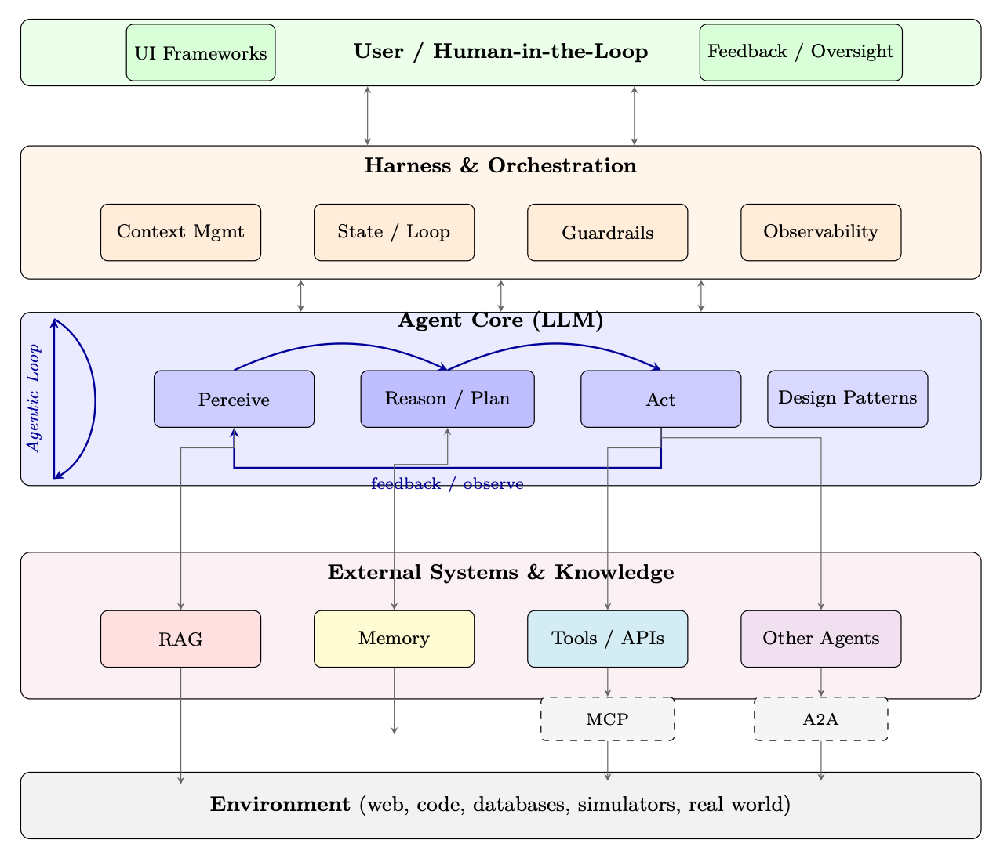

<aside class="hh-part">

第 V 部分 智能体 AI（Agentic AI）

</aside>

之前的部分为我们配备了算法工具箱——如何训练、对齐 LLM 并使其具备推理能力。我们覆盖了 Transformer 架构与 GPU 系统（第一部分）、使模型与人类意图对齐的强化学习方法（第二部分）、由 RL 训练涌现出的推理能力（第三部分）以及评测方法（第四部分）。本部分转向现代 AI 工程的核心问题：我们该如何<em>部署</em>这些模型，使其成为能够在开放环境中感知、规划、行动并学习的自主智能体（Agent）？

智能体 AI 系统（agentic AI system）指的是 LLM 在一个循环中运行的系统：它从环境中接收观测（用户消息、工具输出、传感器数据），对接下来该做什么进行推理，执行动作（工具调用、代码执行、API 请求），并不断迭代，直到达成目标或显式请求人类介入。这与“单轮聊天机器人”范式形成对比——后者只生成一次回复然后等待。

从聊天机器人到智能体的转变带来了若干根本性挑战，这些挑战是单次模型调用无法解决的：

<ul><li>持久性：智能体必须记住它做过什么、哪些尝试失败了、建立了哪些上下文——跨越多轮对话、多个会话，甚至数天。</li><li>接地（Grounding）：智能体必须访问其训练数据中不存在的最新、特定领域的知识。</li><li>动作：智能体必须通过定义良好的接口与外部系统交互——数据库、API、文件系统、浏览器。</li><li>协作：复杂任务往往超出单个智能体的能力范围；多个专门化的智能体必须协作、委派和协商。</li><li>安全性：自主行动需要护栏、人类监督，并在智能体不确定时优雅降级。</li></ul>

为应对这些挑战，生产级智能体系统被构建为分层架构。每一层解决一个特定问题，后续章节自底向上覆盖整个技术栈：

<ul><li>第 16 章：RAG（检索增强生成，Retrieval-Augmented Generation） —— 知识层。RAG 通过在查询时检索相关文档，赋予智能体访问动态外部知识的能力。这解决了接地问题：智能体可以回答关于专有数据、近期事件或模型训练时从未见过的特定领域内容的问题。我们涵盖 Embedding 模型、向量数据库、分块策略、混合检索，以及由智能体决定<em>何时</em>检索与检索<em>什么</em>的智能体 RAG 等高级模式。</li><li>第 17 章：记忆 —— 持久化层。记忆使智能体能够跨交互回忆信息——从单个任务内的短期工作记忆，到跨越数月的长期情景记忆（Episodic Memory）。我们涵盖记忆架构（缓冲区、摘要、向量索引、知识图谱）、记忆固化（Memory Consolidation），以及如何设计能够扩展而不会淹没上下文窗口的记忆系统。</li><li>第 18 章：执行框架与编排（Harness &amp; Orchestration） —— 运行时层。编排框架是智能体的“操作系统”：它管理智能体循环、上下文窗口预算、工具分发、错误恢复、状态持久化和可观测性。我们涵盖上下文管理策略（摘要、滑动窗口、分层）、执行控制（顺序、并行、分支）、护栏以及人机协同（Human-in-the-Loop）模式。</li><li>第 19 章：循环工程（Loop Engineering） —— 推理时 RL 层。循环工程把智能体的运行时循环视为一个优化过程：生成—验证—重试的循环在结构上等价于不做权重更新的策略优化。我们涵盖五个结构性原语（生成器、验证器、终止器、状态管理器、升级器）、验证层级、自适应预算分配，以及现代循环如何从早期 AutoGPT 式系统演化为有纪律的收敛过程。</li><li>第 20 章：设计模式 —— 架构层。构建智能体的经典模式：ReAct（推理与行动交错）、先规划后执行、反思循环、工具增强生成与多步工作流。我们分析每种模式的适用场景、失败模式，以及如何组合它们以应对真实世界的复杂任务。</li><li>第 21 章：环境与基准 —— 评测层。在哪里、如何评测智能体行为。我们涵盖网页导航基准、编程环境、工具使用评测套件，以及评测多步自主系统所特有的挑战（部分得分、轨迹质量、安全违规）。</li><li>第 22 章：MCP（模型上下文协议，Model Context Protocol） —— 工具集成标准。MCP 标准化了智能体如何发现并调用工具——类似于硬件世界的 USB。我们涵盖协议规范、服务端/客户端架构、资源管理，以及 MCP 如何消除智能体与工具之间的 N<math alttext="\times" display="inline"><semantics><mo>×</mo></semantics></math>M 集成问题。</li><li>第 23 章：智能体技能（Skills） —— 能力层。智能体如何获取并组合超越基本工具使用的专门化能力，包括技能库、技能选择与可组合的任务求解。</li><li>第 24 章：A2A（智能体到智能体通信，Agent-to-Agent Communication） —— 智能体间协议。当任务需要多名专家时，A2A 提供了用于智能体发现、任务委派、进度流式传输与结果聚合的标准化协议，使来自不同供应商、框架或组织的异构智能体能够协作。</li><li>第 25 章：多智能体系统 —— 协调层。多智能体协作的架构：层级委派、对等协商、辩论与共识、群体智能（Swarm Intelligence）与涌现行为。我们讨论何时使用单智能体与多智能体设计，以及如何调试协调失败。</li><li>第 26 章：框架 —— 实现层。实现上述概念的生产级工具集：LangGraph（有状态、基于图的编排）、CrewAI（基于角色的多智能体）、OpenAI Agents SDK、AutoGen 等。我们比较它们的权衡、架构决策与在不同场景下的适用性。</li><li>第 27 章：Agentic UI —— 交互层。用户如何与智能体交互并对其进行监督：流式接口、渐进式披露、审批工作流、状态仪表盘，以及构建对自主系统适当信任的 UX 模式。</li></ul>

这些层并非孤立运作——它们构成一个紧密集成的系统，每个组件都依赖并强化其他组件：

<ul><li>智能体核心（具备第二部分至第三部分所述推理能力的 LLM）位于中心，执行感知—推理—行动的循环。</li><li>RAG在每一步推理之前向智能体提供相关知识，而记忆则提供跨步骤、跨会话的连续性。</li><li>编排框架协调一切：它决定何时检索、何时调用工具、何时委派给子智能体，以及何时向人类寻求指导。循环工程（Loop Engineering）把编排框架的重试与验证循环形式化为推理时优化，确保收敛与成本可控。</li><li>MCP为智能体访问所有外部工具提供标准化接口，而A2A为智能体间通信提供对等接口。</li><li>设计模式定义高层策略（ReAct、规划与执行、反思），而框架提供这些模式的具体实现。</li><li>UI 层通过将智能体连接回人类来闭合循环——用于监督、纠正与协作式问题求解。</li></ul>

贯穿全篇，我们始终保持系统视角：智能体 AI 不仅仅是 Prompt 编写——它需要在每一层对上下文管理、错误处理、安全护栏和可观测性进行细致的工程化。下图展示了这些组件在架构上如何组合在一起。

<figure id="ch15.f1"><figcaption>图 15.1：智能体 AI 架构栈。智能体核心执行感知—推理—行动的循环，由执行框架与编排层协调，该层负责管理上下文、状态、护栏与可观测性。智能体向下与外部系统交互——用于知识检索的 RAG、用于持久化的记忆、经由 MCP 的工具以及经由 A2A 的其他智能体——这一切都立足于环境。用户从上方提供目标、反馈与监督。箭头表示双向数据流；蓝色的循环箭头表示迭代的智能体循环。</figcaption></figure>

<aside class="hh-next">

下一篇

第 16 章 检索增强生成（RAG）

在「智能体 AI 漫游指南」分类下继续阅读。

</aside>

