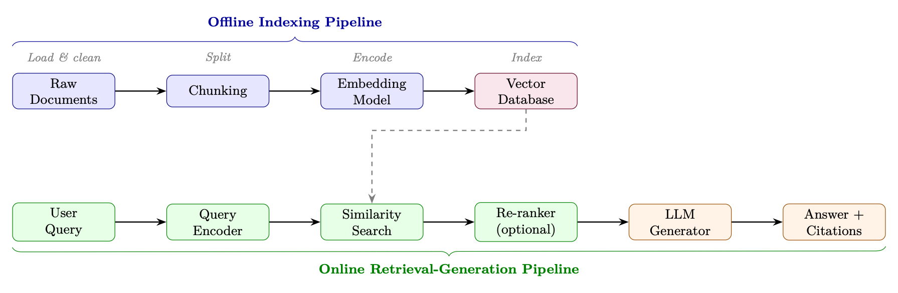
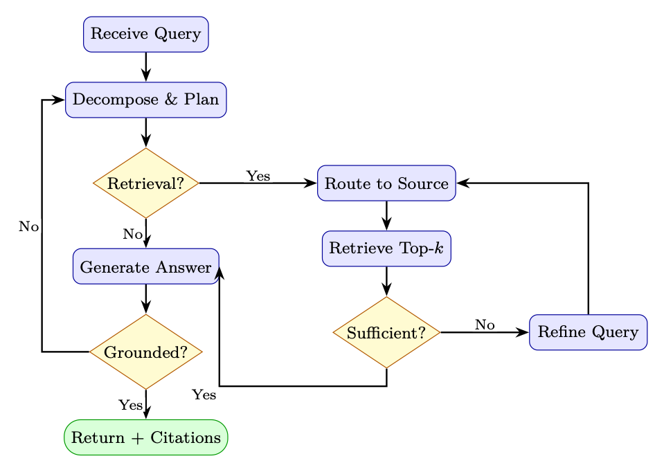

<div class="hh-guide">

<aside class="hh-part">
<p class="hh-part-title">Part V Agentic AI</p>
</aside>

Retrieval-Augmented Generation (RAG) [209] has emerged as one of the most practically impactful techniques for deploying large language models in production. Rather than relying solely on knowledge encoded in model weights during training, RAG equips LLMs with a dynamic, updatable external memory—enabling accurate, grounded, and verifiable responses across a wide range of knowledge-intensive tasks.

## Motivation and Problem Statement

### Parametric vs. Non-Parametric Knowledge

We can formalize the distinction between the two knowledge sources. Let <math alttext="\mathcal{M}_{\theta}" display="inline"><semantics><msub><mi>ℳ</mi><mi>θ</mi></msub></semantics></math> denote a language model with parameters <math alttext="\theta" display="inline"><semantics><mi>θ</mi></semantics></math>, and let <math alttext="\mathcal{D}=\{d_{1},d_{2},\ldots,d_{N}\}" display="inline"><semantics><mrow><mi>𝒟</mi><mo>=</mo><mrow><mo stretchy="false">{</mo><mrow><msub><mi>d</mi><mn>1</mn></msub><mo>,</mo><msub><mi>d</mi><mn>2</mn></msub><mo>,</mo><mi mathvariant="normal">…</mi><mo>,</mo><msub><mi>d</mi><mi>N</mi></msub></mrow><mo stretchy="false">}</mo></mrow></mrow></semantics></math> be an external document corpus. The probability of generating answer <math alttext="a" display="inline"><semantics><mi>a</mi></semantics></math> given query <math alttext="q" display="inline"><semantics><mi>q</mi></semantics></math> under each paradigm is:


where <math alttext="P_{\text{ret}}(d\mid q,\mathcal{D})" display="inline"><semantics><mrow><msub><mi>P</mi><mtext>ret</mtext></msub><mo lspace="0em" rspace="0em">​</mo><mrow><mo stretchy="false">(</mo><mi>d</mi><mo fence="true" lspace="0em" rspace="0em">∣</mo><mrow><mi>q</mi><mo>,</mo><mi>𝒟</mi></mrow><mo stretchy="false">)</mo></mrow></mrow></semantics></math> is the retrieval distribution over documents. RAG marginalizes over retrieved evidence, grounding generation in non-parametric knowledge.

### When to Use RAG vs. Fine-Tuning vs. Long Context

<div class="hh-table" id="ch16.t1"><table class="ltx_tabular ltx_align_middle"><thead><tr><th class="ltx_align_left"><span>Criterion</span></th><th class="ltx_align_left ltx_align_top"><span class="ltx_align_top"><span><span>RAG</span></span></span></th><th class="ltx_align_left ltx_align_top"><span class="ltx_align_top"><span><span>Fine-Tuning</span></span></span></th><th class="ltx_align_left ltx_align_top"><span class="ltx_align_top"><span><span>Long Context</span></span></span></th><th class="ltx_align_left ltx_align_top"><span class="ltx_align_top"><span><span>RAG + FT</span></span></span></th></tr></thead><tbody><tr><td class="ltx_align_left">Knowledge updates frequently</td><td class="ltx_align_left ltx_align_top"><span class="ltx_align_top"><span>✓</span></span></td><td class="ltx_align_left ltx_align_top"><span class="ltx_align_top"><span><math alttext="\times" display="inline"><semantics><mo>×</mo><span></span></semantics></math></span></span></td><td class="ltx_align_left ltx_align_top"><span class="ltx_align_top"><span><math alttext="\times" display="inline"><semantics><mo>×</mo><span></span></semantics></math></span></span></td><td class="ltx_align_left ltx_align_top"><span class="ltx_align_top"><span>✓</span></span></td></tr><tr><td class="ltx_align_left">Need citations / grounding</td><td class="ltx_align_left ltx_align_top"><span class="ltx_align_top"><span>✓</span></span></td><td class="ltx_align_left ltx_align_top"><span class="ltx_align_top"><span><math alttext="\times" display="inline"><semantics><mo>×</mo><span></span></semantics></math></span></span></td><td class="ltx_align_left ltx_align_top"><span class="ltx_align_top"><span>✓</span></span></td><td class="ltx_align_left ltx_align_top"><span class="ltx_align_top"><span>✓</span></span></td></tr><tr><td class="ltx_align_left">Proprietary large corpus</td><td class="ltx_align_left ltx_align_top"><span class="ltx_align_top"><span>✓</span></span></td><td class="ltx_align_left ltx_align_top"><span class="ltx_align_top"><span><math alttext="\times" display="inline"><semantics><mo>×</mo><span></span></semantics></math></span></span></td><td class="ltx_align_left ltx_align_top"><span class="ltx_align_top"><span><math alttext="\times" display="inline"><semantics><mo>×</mo><span></span></semantics></math></span></span></td><td class="ltx_align_left ltx_align_top"><span class="ltx_align_top"><span>✓</span></span></td></tr><tr><td class="ltx_align_left">Adapt style / format</td><td class="ltx_align_left ltx_align_top"><span class="ltx_align_top"><span><math alttext="\times" display="inline"><semantics><mo>×</mo><span></span></semantics></math></span></span></td><td class="ltx_align_left ltx_align_top"><span class="ltx_align_top"><span>✓</span></span></td><td class="ltx_align_left ltx_align_top"><span class="ltx_align_top"><span><math alttext="\times" display="inline"><semantics><mo>×</mo><span></span></semantics></math></span></span></td><td class="ltx_align_left ltx_align_top"><span class="ltx_align_top"><span>✓</span></span></td></tr><tr><td class="ltx_align_left">Teach new reasoning skills</td><td class="ltx_align_left ltx_align_top"><span class="ltx_align_top"><span><math alttext="\times" display="inline"><semantics><mo>×</mo><span></span></semantics></math></span></span></td><td class="ltx_align_left ltx_align_top"><span class="ltx_align_top"><span>✓</span></span></td><td class="ltx_align_left ltx_align_top"><span class="ltx_align_top"><span><math alttext="\times" display="inline"><semantics><mo>×</mo><span></span></semantics></math></span></span></td><td class="ltx_align_left ltx_align_top"><span class="ltx_align_top"><span>✓</span></span></td></tr><tr><td class="ltx_align_left">Corpus fits in context window</td><td class="ltx_align_left ltx_align_top"><span class="ltx_align_top"><span><math alttext="\times" display="inline"><semantics><mo>×</mo><span></span></semantics></math></span></span></td><td class="ltx_align_left ltx_align_top"><span class="ltx_align_top"><span><math alttext="\times" display="inline"><semantics><mo>×</mo><span></span></semantics></math></span></span></td><td class="ltx_align_left ltx_align_top"><span class="ltx_align_top"><span>✓</span></span></td><td class="ltx_align_left ltx_align_top"><span class="ltx_align_top"><span><math alttext="\times" display="inline"><semantics><mo>×</mo><span></span></semantics></math></span></span></td></tr><tr><td class="ltx_align_left">Low latency required</td><td class="ltx_align_left ltx_align_top"><span class="ltx_align_top"><span><math alttext="\times" display="inline"><semantics><mo>×</mo><span></span></semantics></math></span></span></td><td class="ltx_align_left ltx_align_top"><span class="ltx_align_top"><span>✓</span></span></td><td class="ltx_align_left ltx_align_top"><span class="ltx_align_top"><span><math alttext="\times" display="inline"><semantics><mo>×</mo><span></span></semantics></math></span></span></td><td class="ltx_align_left ltx_align_top"><span class="ltx_align_top"><span><math alttext="\times" display="inline"><semantics><mo>×</mo><span></span></semantics></math></span></span></td></tr></tbody></table><p class="hh-table-caption"><span class="hh-tag">Table 16.1:</span>Decision guide: RAG vs. Fine-Tuning vs. Long Context</p></div>

## Core RAG Architecture

A standard RAG system consists of two phases: an offline indexing pipeline that processes and stores documents, and an online retrieval-generation pipeline that serves queries.

### Full Pipeline Diagram

<figure id="ch16.f1"><figcaption><span class="hh-tag">Figure 16.1:</span>End-to-end RAG architecture. The offline pipeline (blue) indexes documents once; the online pipeline (green/orange) serves each query at inference time.</figcaption></figure>

### Indexing Pipeline

Documents arrive in heterogeneous formats (PDF, HTML, Markdown, DOCX, code). Loaders extract clean text and preserve metadata (source URL, page number, section title, timestamp) that will be stored alongside embeddings for filtering and citation.

Long documents must be split into chunks that fit within the embedding model’s context window (typically 512 tokens) and are semantically coherent. Chunking strategy is one of the highest-impact decisions in RAG system design (see Section 16.4 Chunking Strategies).

Each chunk <math alttext="c_{i}" display="inline"><semantics><msub><mi>c</mi><mi>i</mi></msub></semantics></math> is encoded into a dense vector <math alttext="\mathbf{e}_{i}=f_{\phi}(c_{i})\in\mathbb{R}^{d}" display="inline"><semantics><mrow><msub><mi>𝐞</mi><mi>i</mi></msub><mo>=</mo><mrow><msub><mi>f</mi><mi>ϕ</mi></msub><mo lspace="0em" rspace="0em">​</mo><mrow><mo stretchy="false">(</mo><msub><mi>c</mi><mi>i</mi></msub><mo stretchy="false">)</mo></mrow></mrow><mo>∈</mo><msup><mi>ℝ</mi><mi>d</mi></msup></mrow></semantics></math> using an embedding model <math alttext="f_{\phi}" display="inline"><semantics><msub><mi>f</mi><mi>ϕ</mi></msub></semantics></math>. These vectors are stored in a vector database alongside the original text and metadata.

### Retrieval

Given a query <math alttext="q" display="inline"><semantics><mi>q</mi></semantics></math>, the retrieval step encodes it as <math alttext="\mathbf{q}=f_{\phi}(q)" display="inline"><semantics><mrow><mi>𝐪</mi><mo>=</mo><mrow><msub><mi>f</mi><mi>ϕ</mi></msub><mo lspace="0em" rspace="0em">​</mo><mrow><mo stretchy="false">(</mo><mi>q</mi><mo stretchy="false">)</mo></mrow></mrow></mrow></semantics></math> and finds the <math alttext="k" display="inline"><semantics><mi>k</mi></semantics></math> most similar chunks by cosine similarity:

<div class="hh-equation" id="ch16.e3"><math alttext="\text{sim}(\mathbf{q},\mathbf{e}_{i})=\frac{\mathbf{q}\cdot\mathbf{e}_{i}}{\|\mathbf{q}\|\,\|\mathbf{e}_{i}\|}" display="block"><semantics><mrow><mrow><mtext>sim</mtext><mo lspace="0em" rspace="0em">​</mo><mrow><mo stretchy="false">(</mo><mi>𝐪</mi><mo>,</mo><msub><mi>𝐞</mi><mi>i</mi></msub><mo stretchy="false">)</mo></mrow></mrow><mo>=</mo><mfrac><mrow><mi>𝐪</mi><mo lspace="0.222em" rspace="0.222em">⋅</mo><msub><mi>𝐞</mi><mi>i</mi></msub></mrow><mrow><mrow><mo stretchy="false">‖</mo><mi>𝐪</mi><mo stretchy="false">‖</mo></mrow><mo lspace="0.170em" rspace="0em">​</mo><mrow><mo stretchy="false">‖</mo><msub><mi>𝐞</mi><mi>i</mi></msub><mo stretchy="false">‖</mo></mrow></mrow></mfrac></mrow></semantics></math><span class="hh-equation-number">(16.3)</span></div>

The top-<math alttext="k" display="inline"><semantics><mi>k</mi></semantics></math> chunks <math alttext="\mathcal{C}_{k}=\{c_{(1)},\ldots,c_{(k)}\}" display="inline"><semantics><mrow><msub><mi>𝒞</mi><mi>k</mi></msub><mo>=</mo><mrow><mo stretchy="false">{</mo><msub><mi>c</mi><mrow><mo stretchy="false">(</mo><mn>1</mn><mo stretchy="false">)</mo></mrow></msub><mo>,</mo><mi mathvariant="normal">…</mi><mo>,</mo><msub><mi>c</mi><mrow><mo stretchy="false">(</mo><mi>k</mi><mo stretchy="false">)</mo></mrow></msub><mo stretchy="false">}</mo></mrow></mrow></semantics></math> are returned as context.

### Generation

Retrieved chunks are injected into a prompt template:

```
SYSTEM_PROMPT = """You are a helpful assistant. Answer the question using ONLY
the provided context. If the context does not contain enough information,
say so explicitly. Cite your sources using [Doc N] notation."""

def build_rag_prompt(query: str, chunks: list[dict]) -> str:
    context_str = "\n\n".join(
        f"[Doc {i+1}] (Source: {c['source']}, Page: {c.get('page','N/A')})\n{c['text']}"
        for i, c in enumerate(chunks)
    )
    return f"""{SYSTEM_PROMPT}

Context:
{context_str}

Question: {query}

Answer:"""
```

<span class="hh-tag">Listing 8:</span>Standard RAG prompt template

## Retrieval Methods

### Sparse Retrieval: BM25 and TF-IDF

Sparse retrieval methods represent documents and queries as high-dimensional sparse vectors over the vocabulary. The classic BM25 scoring function [309] for document <math alttext="d" display="inline"><semantics><mi>d</mi></semantics></math> given query <math alttext="q" display="inline"><semantics><mi>q</mi></semantics></math> with terms <math alttext="t_{1},\ldots,t_{n}" display="inline"><semantics><mrow><msub><mi>t</mi><mn>1</mn></msub><mo>,</mo><mi mathvariant="normal">…</mi><mo>,</mo><msub><mi>t</mi><mi>n</mi></msub></mrow></semantics></math> is:

<div class="hh-equation" id="ch16.e4"><math alttext="\text{BM25}(d,q)=\sum_{i=1}^{n}\text{IDF}(t_{i})\cdot\frac{f(t_{i},d)\cdot(k_{1}+1)}{f(t_{i},d)+k_{1}\cdot\left(1-b+b\cdot\frac{|d|}{\text{avgdl}}\right)}" display="block"><semantics><mrow><mrow><mtext>BM25</mtext><mo lspace="0em" rspace="0em">​</mo><mrow><mo stretchy="false">(</mo><mi>d</mi><mo>,</mo><mi>q</mi><mo stretchy="false">)</mo></mrow></mrow><mo rspace="0.111em">=</mo><mrow><mrow><munderover><mo movablelimits="false">∑</mo><mrow><mi>i</mi><mo>=</mo><mn>1</mn></mrow><mi>n</mi></munderover><mrow><mtext>IDF</mtext><mo lspace="0em" rspace="0em">​</mo><mrow><mo stretchy="false">(</mo><msub><mi>t</mi><mi>i</mi></msub><mo rspace="0.055em" stretchy="false">)</mo></mrow></mrow></mrow><mo rspace="0.222em">⋅</mo><mfrac><mrow><mrow><mi>f</mi><mo>⁡</mo><mrow><mo stretchy="false">(</mo><msub><mi>t</mi><mi>i</mi></msub><mo>,</mo><mi>d</mi><mo rspace="0.055em" stretchy="false">)</mo></mrow></mrow><mo rspace="0.222em">⋅</mo><mrow><mo stretchy="false">(</mo><mrow><msub><mi>k</mi><mn>1</mn></msub><mo>+</mo><mn>1</mn></mrow><mo stretchy="false">)</mo></mrow></mrow><mrow><mrow><mi>f</mi><mo>⁡</mo><mrow><mo stretchy="false">(</mo><msub><mi>t</mi><mi>i</mi></msub><mo>,</mo><mi>d</mi><mo stretchy="false">)</mo></mrow></mrow><mo>+</mo><mrow><msub><mi>k</mi><mn>1</mn></msub><mo lspace="0.222em" rspace="0.222em">⋅</mo><mrow><mo>(</mo><mrow><mrow><mn>1</mn><mo>−</mo><mi>b</mi></mrow><mo>+</mo><mrow><mi>b</mi><mo lspace="0.222em" rspace="0.222em">⋅</mo><mfrac><mrow><mo stretchy="false">|</mo><mi>d</mi><mo stretchy="false">|</mo></mrow><mtext>avgdl</mtext></mfrac></mrow></mrow><mo>)</mo></mrow></mrow></mrow></mfrac></mrow></mrow></semantics></math><span class="hh-equation-number">(16.4)</span></div>

where <math alttext="f(t_{i},d)" display="inline"><semantics><mrow><mi>f</mi><mo>⁡</mo><mrow><mo stretchy="false">(</mo><msub><mi>t</mi><mi>i</mi></msub><mo>,</mo><mi>d</mi><mo stretchy="false">)</mo></mrow></mrow></semantics></math> is term frequency, <math alttext="|d|" display="inline"><semantics><mrow><mo stretchy="false">|</mo><mi>d</mi><mo stretchy="false">|</mo></mrow></semantics></math> is document length, avgdl is average document length, and <math alttext="k_{1}\in[1.2,2.0]" display="inline"><semantics><mrow><msub><mi>k</mi><mn>1</mn></msub><mo>∈</mo><mrow><mo stretchy="false">[</mo><mrow><mn>1.2</mn><mo>,</mo><mn>2.0</mn></mrow><mo stretchy="false">]</mo></mrow></mrow></semantics></math>, <math alttext="b=0.75" display="inline"><semantics><mrow><mi>b</mi><mo>=</mo><mn>0.75</mn></mrow></semantics></math> are tuning parameters.

### Dense Retrieval: DPR

Dense Passage Retrieval (DPR) [180] uses two separate BERT-based encoders—a <em>query encoder</em><math alttext="E_{Q}" display="inline"><semantics><msub><mi>E</mi><mi>Q</mi></msub></semantics></math> and a <em>passage encoder</em><math alttext="E_{P}" display="inline"><semantics><msub><mi>E</mi><mi>P</mi></msub></semantics></math>—trained with contrastive loss to place relevant query-passage pairs close together in embedding space.

<div class="hh-equation" id="ch16.e5"><math alttext="\text{sim}(q,p)=E_{Q}(q)^{\top}E_{P}(p)" display="block"><semantics><mrow><mrow><mtext>sim</mtext><mo lspace="0em" rspace="0em">​</mo><mrow><mo stretchy="false">(</mo><mi>q</mi><mo>,</mo><mi>p</mi><mo stretchy="false">)</mo></mrow></mrow><mo>=</mo><mrow><msub><mi>E</mi><mi>Q</mi></msub><mo lspace="0em" rspace="0em">​</mo><msup><mrow><mo stretchy="false">(</mo><mi>q</mi><mo stretchy="false">)</mo></mrow><mo>⊤</mo></msup><mo lspace="0em" rspace="0em">​</mo><msub><mi>E</mi><mi>P</mi></msub><mo lspace="0em" rspace="0em">​</mo><mrow><mo stretchy="false">(</mo><mi>p</mi><mo stretchy="false">)</mo></mrow></mrow></mrow></semantics></math><span class="hh-equation-number">(16.5)</span></div>

Given a batch of <math alttext="B" display="inline"><semantics><mi>B</mi></semantics></math> query-passage pairs <math alttext="\{(q_{i},p_{i}^{+})\}_{i=1}^{B}" display="inline"><semantics><msubsup><mrow><mo stretchy="false">{</mo><mrow><mo stretchy="false">(</mo><msub><mi>q</mi><mi>i</mi></msub><mo>,</mo><msubsup><mi>p</mi><mi>i</mi><mo>+</mo></msubsup><mo stretchy="false">)</mo></mrow><mo stretchy="false">}</mo></mrow><mrow><mi>i</mi><mo>=</mo><mn>1</mn></mrow><mi>B</mi></msubsup></semantics></math>, the contrastive loss treats all other passages in the batch as negatives:

<div class="hh-equation" id="ch16.e6"><math alttext="\mathcal{L}_{\text{DPR}}=-\frac{1}{B}\sum_{i=1}^{B}\log\frac{\exp\!\left(E_{Q}(q_{i})^{\top}E_{P}(p_{i}^{+})/\tau\right)}{\sum_{j=1}^{B}\exp\!\left(E_{Q}(q_{i})^{\top}E_{P}(p_{j})/\tau\right)}" display="block"><semantics><mrow><mi>ℒ</mi><msub><mrow></mrow><mtext>DPR</mtext></msub><mo rspace="0em">=</mo><mo lspace="0em">−</mo><mfrac><mn>1</mn><mi>B</mi></mfrac><mo movablelimits="false">∑</mo><msub><mrow></mrow><mrow><mi>i</mi><mo>=</mo><mn>1</mn></mrow></msub><msup><mrow></mrow><mi>B</mi></msup><mi>log</mi><mfrac><mrow><mpadded width="1.370em"><mi>exp</mi></mpadded><mo>⁡</mo><mrow><mo>(</mo><mrow><mrow><msub><mi>E</mi><mi>Q</mi></msub><mo lspace="0em" rspace="0em">​</mo><msup><mrow><mo stretchy="false">(</mo><msub><mi>q</mi><mi>i</mi></msub><mo stretchy="false">)</mo></mrow><mo>⊤</mo></msup><mo lspace="0em" rspace="0em">​</mo><msub><mi>E</mi><mi>P</mi></msub><mo lspace="0em" rspace="0em">​</mo><mrow><mo stretchy="false">(</mo><msubsup><mi>p</mi><mi>i</mi><mo>+</mo></msubsup><mo stretchy="false">)</mo></mrow></mrow><mo>/</mo><mi>τ</mi></mrow><mo>)</mo></mrow></mrow><mrow><msubsup><mo>∑</mo><mrow><mi>j</mi><mo>=</mo><mn>1</mn></mrow><mi>B</mi></msubsup><mrow><mpadded width="1.370em"><mi>exp</mi></mpadded><mo>⁡</mo><mrow><mo>(</mo><mrow><mrow><msub><mi>E</mi><mi>Q</mi></msub><mo lspace="0em" rspace="0em">​</mo><msup><mrow><mo stretchy="false">(</mo><msub><mi>q</mi><mi>i</mi></msub><mo stretchy="false">)</mo></mrow><mo>⊤</mo></msup><mo lspace="0em" rspace="0em">​</mo><msub><mi>E</mi><mi>P</mi></msub><mo lspace="0em" rspace="0em">​</mo><mrow><mo stretchy="false">(</mo><msub><mi>p</mi><mi>j</mi></msub><mo stretchy="false">)</mo></mrow></mrow><mo>/</mo><mi>τ</mi></mrow><mo>)</mo></mrow></mrow></mrow></mfrac></mrow></semantics></math><span class="hh-equation-number">(16.6)</span></div>

where <math alttext="\tau" display="inline"><semantics><mi>τ</mi></semantics></math> is a temperature hyperparameter. Hard negatives (passages that are lexically similar but semantically irrelevant) are crucial for training strong retrievers.

At scale, exhaustive search over millions of embeddings is infeasible. FAISS [171] (Facebook AI Similarity Search) provides efficient approximate nearest neighbor (ANN) search using:

<ul><li>IVF (Inverted File Index): cluster vectors into Voronoi cells; search only nearby cells</li><li>HNSW (Hierarchical Navigable Small World)[248]: graph-based index with <math alttext="O(\log N)" display="inline"><semantics><mrow><mi>O</mi><mo>⁡</mo><mrow><mo stretchy="false">(</mo><mrow><mi>log</mi><mo lspace="0.167em">⁡</mo><mi>N</mi></mrow><mo stretchy="false">)</mo></mrow></mrow></semantics></math> search</li><li>PQ (Product Quantization): compress vectors to reduce memory footprint</li></ul>

### Hybrid Retrieval with Reciprocal Rank Fusion

Hybrid retrieval combines sparse and dense scores. A simple linear combination is:

<div class="hh-equation" id="ch16.e7"><math alttext="s_{\text{hybrid}}(d,q)=\alpha\cdot s_{\text{dense}}(d,q)+(1-\alpha)\cdot s_{\text{sparse}}(d,q)" display="block"><semantics><mrow><mrow><msub><mi>s</mi><mtext>hybrid</mtext></msub><mo lspace="0em" rspace="0em">​</mo><mrow><mo stretchy="false">(</mo><mi>d</mi><mo>,</mo><mi>q</mi><mo stretchy="false">)</mo></mrow></mrow><mo>=</mo><mrow><mrow><mrow><mi>α</mi><mo lspace="0.222em" rspace="0.222em">⋅</mo><msub><mi>s</mi><mtext>dense</mtext></msub></mrow><mo lspace="0em" rspace="0em">​</mo><mrow><mo stretchy="false">(</mo><mi>d</mi><mo>,</mo><mi>q</mi><mo stretchy="false">)</mo></mrow></mrow><mo>+</mo><mrow><mrow><mrow><mo stretchy="false">(</mo><mrow><mn>1</mn><mo>−</mo><mi>α</mi></mrow><mo rspace="0.055em" stretchy="false">)</mo></mrow><mo rspace="0.222em">⋅</mo><msub><mi>s</mi><mtext>sparse</mtext></msub></mrow><mo lspace="0em" rspace="0em">​</mo><mrow><mo stretchy="false">(</mo><mi>d</mi><mo>,</mo><mi>q</mi><mo stretchy="false">)</mo></mrow></mrow></mrow></mrow></semantics></math><span class="hh-equation-number">(16.7)</span></div>

However, scores from different systems are not directly comparable. Reciprocal Rank Fusion (RRF)[62] avoids this by operating on ranks rather than scores:

<div class="hh-equation" id="ch16.e8"><math alttext="\text{RRF}(d)=\sum_{r\in\mathcal{R}}\frac{1}{k+\text{rank}_{r}(d)}" display="block"><semantics><mrow><mrow><mtext>RRF</mtext><mo lspace="0em" rspace="0em">​</mo><mrow><mo stretchy="false">(</mo><mi>d</mi><mo stretchy="false">)</mo></mrow></mrow><mo rspace="0.111em">=</mo><mrow><munder><mo movablelimits="false">∑</mo><mrow><mi>r</mi><mo>∈</mo><mi>ℛ</mi></mrow></munder><mfrac><mn>1</mn><mrow><mi>k</mi><mo>+</mo><mrow><msub><mtext>rank</mtext><mi>r</mi></msub><mo lspace="0em" rspace="0em">​</mo><mrow><mo stretchy="false">(</mo><mi>d</mi><mo stretchy="false">)</mo></mrow></mrow></mrow></mfrac></mrow></mrow></semantics></math><span class="hh-equation-number">(16.8)</span></div>

where <math alttext="\mathcal{R}" display="inline"><semantics><mi>ℛ</mi></semantics></math> is the set of ranked lists (e.g., BM25 ranking and dense ranking), <math alttext="\text{rank}_{r}(d)" display="inline"><semantics><mrow><msub><mtext>rank</mtext><mi>r</mi></msub><mo lspace="0em" rspace="0em">​</mo><mrow><mo stretchy="false">(</mo><mi>d</mi><mo stretchy="false">)</mo></mrow></mrow></semantics></math> is the rank of document <math alttext="d" display="inline"><semantics><mi>d</mi></semantics></math> in list <math alttext="r" display="inline"><semantics><mi>r</mi></semantics></math>, and <math alttext="k=60" display="inline"><semantics><mrow><mi>k</mi><mo>=</mo><mn>60</mn></mrow></semantics></math> is a smoothing constant that reduces the impact of very high-ranked documents.

### Learned Sparse Retrieval: SPLADE and SPLADEv2

SPLADE (Sparse Lexical and Expansion Model) [95] uses a pre-trained masked language model (e.g., BERT/DistilBERT) to produce a sparse vector over the <em>entire vocabulary</em> for each document or query. The key insight: the MLM head already knows which words are semantically related to each position in a text — SPLADE repurposes this knowledge as term importance weights.

Given input text <math alttext="x=[x_{1},\ldots,x_{n}]" display="inline"><semantics><mrow><mi>x</mi><mo>=</mo><mrow><mo stretchy="false">[</mo><mrow><msub><mi>x</mi><mn>1</mn></msub><mo>,</mo><mi mathvariant="normal">…</mi><mo>,</mo><msub><mi>x</mi><mi>n</mi></msub></mrow><mo stretchy="false">]</mo></mrow></mrow></semantics></math>:

<ol><li>Pass through a transformer encoder to get contextual representations <math alttext="\mathbf{H}\in\mathbb{R}^{n\times|\mathcal{V}|}" display="inline"><semantics><mrow><mi>𝐇</mi><mo>∈</mo><msup><mi>ℝ</mi><mrow><mi>n</mi><mo lspace="0.222em" rspace="0.222em">×</mo><mrow><mo stretchy="false">|</mo><mi>𝒱</mi><mo stretchy="false">|</mo></mrow></mrow></msup></mrow></semantics></math> via the MLM head</li><li>Aggregate across positions and apply a saturating activation:</li></ol>

<div class="hh-equation" id="ch16.e9"><math alttext="w_{t}(x)=\log\!\left(1+\text{ReLU}\!\left(\max_{i\in[1,n]}\mathbf{H}_{i}[t]\right)\right)" display="block"><semantics><mrow><mrow><msub><mi>w</mi><mi>t</mi></msub><mo lspace="0em" rspace="0em">​</mo><mrow><mo stretchy="false">(</mo><mi>x</mi><mo stretchy="false">)</mo></mrow></mrow><mo>=</mo><mrow><mpadded width="1.146em"><mi>log</mi></mpadded><mo>⁡</mo><mrow><mo>(</mo><mrow><mn>1</mn><mo>+</mo><mrow><mpadded width="2.535em"><mtext>ReLU</mtext></mpadded><mo lspace="0em" rspace="0em">​</mo><mrow><mo>(</mo><mrow><mrow><munder><mi>max</mi><mrow><mi>i</mi><mo>∈</mo><mrow><mo stretchy="false">[</mo><mrow><mn>1</mn><mo>,</mo><mi>n</mi></mrow><mo stretchy="false">]</mo></mrow></mrow></munder><mo lspace="0.167em">⁡</mo><msub><mi>𝐇</mi><mi>i</mi></msub></mrow><mo lspace="0em" rspace="0em">​</mo><mrow><mo stretchy="false">[</mo><mi>t</mi><mo stretchy="false">]</mo></mrow></mrow><mo>)</mo></mrow></mrow></mrow><mo>)</mo></mrow></mrow></mrow></semantics></math><span class="hh-equation-number">(16.9)</span></div>

where <math alttext="\mathbf{H}_{i}[t]" display="inline"><semantics><mrow><msub><mi>𝐇</mi><mi>i</mi></msub><mo lspace="0em" rspace="0em">​</mo><mrow><mo stretchy="false">[</mo><mi>t</mi><mo stretchy="false">]</mo></mrow></mrow></semantics></math> is the MLM logit for vocabulary token <math alttext="t" display="inline"><semantics><mi>t</mi></semantics></math> at input position <math alttext="i" display="inline"><semantics><mi>i</mi></semantics></math>.

<ul><li>The <math alttext="\log(1+\cdot)" display="inline"><semantics><mrow><mi>log</mi><mrow><mo stretchy="false">(</mo><mn>1</mn><mo rspace="0em">+</mo><mo lspace="0em" rspace="0em">⋅</mo><mo stretchy="false">)</mo></mrow></mrow></semantics></math> saturation prevents any single term from dominating (similar to TF saturation in BM25)</li><li>The ReLU ensures sparsity — most vocabulary terms get weight zero</li><li>The <math alttext="\max" display="inline"><semantics><mi>max</mi></semantics></math> pooling across positions captures the strongest signal for each term from any position in the text</li><li>Expansion: Even tokens <em>not present</em> in the original text can get non-zero weight (e.g., a document about “neural networks” may get weight for “deep learning,” “AI,” “backpropagation”)</li></ul>

Query and document are each mapped to sparse vectors <math alttext="\mathbf{w}^{q},\mathbf{w}^{d}\in\mathbb{R}^{|\mathcal{V}|}" display="inline"><semantics><mrow><msup><mi>𝐰</mi><mi>q</mi></msup><mo>,</mo><mrow><msup><mi>𝐰</mi><mi>d</mi></msup><mo>∈</mo><msup><mi>ℝ</mi><mrow><mo stretchy="false">|</mo><mi>𝒱</mi><mo stretchy="false">|</mo></mrow></msup></mrow></mrow></semantics></math>. The relevance score is a simple dot product:

<div class="hh-equation" id="ch16.e10"><math alttext="s(q,d)=\sum_{t\in\mathcal{V}}w_{t}^{q}\cdot w_{t}^{d}" display="block"><semantics><mrow><mrow><mi>s</mi><mo>⁡</mo><mrow><mo stretchy="false">(</mo><mi>q</mi><mo>,</mo><mi>d</mi><mo stretchy="false">)</mo></mrow></mrow><mo rspace="0.111em">=</mo><mrow><mrow><munder><mo movablelimits="false">∑</mo><mrow><mi>t</mi><mo>∈</mo><mi>𝒱</mi></mrow></munder><msubsup><mi>w</mi><mi>t</mi><mi>q</mi></msubsup></mrow><mo lspace="0.222em" rspace="0.222em">⋅</mo><msubsup><mi>w</mi><mi>t</mi><mi>d</mi></msubsup></mrow></mrow></semantics></math><span class="hh-equation-number">(16.10)</span></div>

Because both vectors are sparse (typically 20–200 non-zero entries out of 30K vocabulary), this can be computed efficiently using standard inverted indexes (Lucene, Anserini) — no GPU needed at query time.

SPLADE is trained with contrastive learning (in-batch negatives + hard negatives) plus two regularization terms:

<div class="hh-equation" id="ch16.e11"><math alttext="\mathcal{L}=\mathcal{L}_{\text{contrastive}}+\lambda_{q}\|\mathbf{w}^{q}\|_{1}+\lambda_{d}\|\mathbf{w}^{d}\|_{1}" display="block"><semantics><mrow><mi>ℒ</mi><mo>=</mo><mrow><msub><mi>ℒ</mi><mtext>contrastive</mtext></msub><mo>+</mo><mrow><msub><mi>λ</mi><mi>q</mi></msub><mo lspace="0em" rspace="0em">​</mo><msub><mrow><mo stretchy="false">‖</mo><msup><mi>𝐰</mi><mi>q</mi></msup><mo stretchy="false">‖</mo></mrow><mn>1</mn></msub></mrow><mo>+</mo><mrow><msub><mi>λ</mi><mi>d</mi></msub><mo lspace="0em" rspace="0em">​</mo><msub><mrow><mo stretchy="false">‖</mo><msup><mi>𝐰</mi><mi>d</mi></msup><mo stretchy="false">‖</mo></mrow><mn>1</mn></msub></mrow></mrow></mrow></semantics></math><span class="hh-equation-number">(16.11)</span></div>

The <math alttext="L_{1}" display="inline"><semantics><msub><mi>L</mi><mn>1</mn></msub></semantics></math> penalties on query and document representations encourage sparsity — without them, the model would learn dense representations that defeat the purpose.

SPLADEv2 [94] introduces several refinements that significantly improve efficiency and effectiveness:

<ol><li>Distillation from cross-encoder: Instead of training only on binary relevance labels, SPLADEv2 uses a cross-encoder teacher (e.g., MonoT5 [269]) to provide soft relevance scores. This gives richer training signal:<math alttext="\mathcal{L}_{\text{distill}}=\text{KL}\!\left(\sigma(s_{\text{student}})\,\|\,\sigma(s_{\text{teacher}})\right)" display="block"><semantics><mrow><msub><mi>ℒ</mi><mtext>distill</mtext></msub><mo>=</mo><mpadded width="1.431em"><mtext>KL</mtext></mpadded><mrow><mo>(</mo><mi>σ</mi><mrow><mo stretchy="false">(</mo><msub><mi>s</mi><mtext>student</mtext></msub><mo stretchy="false">)</mo></mrow><mo lspace="0.170em" rspace="0.337em">∥</mo><mi>σ</mi><mrow><mo stretchy="false">(</mo><msub><mi>s</mi><mtext>teacher</mtext></msub><mo stretchy="false">)</mo></mrow><mo>)</mo></mrow></mrow></semantics></math><span class="hh-tag">(16.12)</span></li><li>Separate query/document encoders: SPLADEv2 uses different sparsity targets for queries vs. documents. Queries are encouraged to be <em>more sparse</em> (faster lookup) while documents can be slightly denser (pre-computed offline):<math alttext="\lambda_{q}&gt;\lambda_{d}\quad\text{(e.g., }\lambda_{q}=3\times 10^{-4},\;\lambda_{d}=1\times 10^{-4}\text{)}" display="block"><semantics><mrow><mrow><msub><mi>λ</mi><mi>q</mi></msub><mo>&gt;</mo><msub><mi>λ</mi><mi>d</mi></msub></mrow><mspace width="1em"></mspace><mrow><mrow><mtext>(e.g., </mtext><mo lspace="0em" rspace="0em">​</mo><msub><mi>λ</mi><mi>q</mi></msub></mrow><mo>=</mo><mrow><mn>3</mn><mo lspace="0.222em" rspace="0.222em">×</mo><msup><mn>10</mn><mrow><mo>−</mo><mn>4</mn></mrow></msup></mrow></mrow><mo rspace="0.447em">,</mo><mrow><msub><mi>λ</mi><mi>d</mi></msub><mo>=</mo><mrow><mrow><mn>1</mn><mo lspace="0.222em" rspace="0.222em">×</mo><msup><mn>10</mn><mrow><mo>−</mo><mn>4</mn></mrow></msup></mrow><mo lspace="0em" rspace="0em">​</mo><mtext>)</mtext></mrow></mrow></mrow></semantics></math><span class="hh-tag">(16.13)</span></li><li>FLOPS regularization: Instead of simple <math alttext="L_{1}" display="inline"><semantics><msub><mi>L</mi><mn>1</mn></msub></semantics></math>, SPLADEv2 introduces a FLOPS-aware regularizer that directly penalizes the expected retrieval cost:<math alttext="\mathcal{L}_{\text{FLOPS}}=\sum_{t\in\mathcal{V}}\left(\overline{a}_{t}^{q}\right)^{2}+\sum_{t\in\mathcal{V}}\left(\overline{a}_{t}^{d}\right)^{2}" display="block"><semantics><mrow><msub><mi>ℒ</mi><mtext>FLOPS</mtext></msub><mo rspace="0.111em">=</mo><mrow><mrow><munder><mo movablelimits="false" rspace="0em">∑</mo><mrow><mi>t</mi><mo>∈</mo><mi>𝒱</mi></mrow></munder><msup><mrow><mo>(</mo><msubsup><mover accent="true"><mi>a</mi><mo stretchy="true">¯</mo></mover><mi>t</mi><mi>q</mi></msubsup><mo>)</mo></mrow><mn>2</mn></msup></mrow><mo rspace="0.055em">+</mo><mrow><munder><mo movablelimits="false" rspace="0em">∑</mo><mrow><mi>t</mi><mo>∈</mo><mi>𝒱</mi></mrow></munder><msup><mrow><mo>(</mo><msubsup><mover accent="true"><mi>a</mi><mo stretchy="true">¯</mo></mover><mi>t</mi><mi>d</mi></msubsup><mo>)</mo></mrow><mn>2</mn></msup></mrow></mrow></mrow></semantics></math><span class="hh-tag">(16.14)</span>where <math alttext="\overline{a}_{t}" display="inline"><semantics><msub><mover accent="true"><mi>a</mi><mo stretchy="true">¯</mo></mover><mi>t</mi></msub></semantics></math> is the mean activation for term <math alttext="t" display="inline"><semantics><mi>t</mi></semantics></math> across the batch. This penalizes terms that are non-zero for many documents (high posting list length = slow retrieval).</li><li>Efficient backbone: Uses DistilBERT (66M params) instead of BERT-base (110M), halving encoding time with minimal quality loss.</li></ol>

### ColBERT: Late Interaction

ColBERT [183] encodes queries and documents into <em>sets</em> of token-level embeddings and uses a <em>MaxSim</em> operator for scoring:

<div class="hh-equation" id="ch16.e15"><math alttext="s(q,d)=\sum_{i\in|\mathbf{q}|}\max_{j\in|\mathbf{d}|}\mathbf{q}_{i}^{\top}\mathbf{d}_{j}" display="block"><semantics><mrow><mrow><mi>s</mi><mo>⁡</mo><mrow><mo stretchy="false">(</mo><mi>q</mi><mo>,</mo><mi>d</mi><mo stretchy="false">)</mo></mrow></mrow><mo rspace="0.111em">=</mo><mrow><munder><mo movablelimits="false">∑</mo><mrow><mi>i</mi><mo>∈</mo><mrow><mo stretchy="false">|</mo><mi>𝐪</mi><mo stretchy="false">|</mo></mrow></mrow></munder><mrow><mrow><munder><mi>max</mi><mrow><mi>j</mi><mo>∈</mo><mrow><mo stretchy="false">|</mo><mi>𝐝</mi><mo stretchy="false">|</mo></mrow></mrow></munder><mo lspace="0.167em">⁡</mo><msubsup><mi>𝐪</mi><mi>i</mi><mo>⊤</mo></msubsup></mrow><mo lspace="0em" rspace="0em">​</mo><msub><mi>𝐝</mi><mi>j</mi></msub></mrow></mrow></mrow></semantics></math><span class="hh-equation-number">(16.15)</span></div>

This late interaction mechanism is more expressive than single-vector bi-encoders while being far faster than cross-encoders, since document embeddings are pre-computed offline.

Both the query encoder <math alttext="E_{Q}" display="inline"><semantics><msub><mi>E</mi><mi>Q</mi></msub></semantics></math> and document encoder <math alttext="E_{D}" display="inline"><semantics><msub><mi>E</mi><mi>D</mi></msub></semantics></math> are BERT-based models that produce <em>per-token</em> embeddings (not a single [CLS] vector). Each token embedding is projected to a lower dimension (typically 128) via a linear layer:


ColBERT is trained with a pairwise softmax cross-entropy loss over positive and negative passages. Given a query <math alttext="q" display="inline"><semantics><mi>q</mi></semantics></math>, a positive passage <math alttext="d^{+}" display="inline"><semantics><msup><mi>d</mi><mo>+</mo></msup></semantics></math>, and a set of negative passages <math alttext="\{d^{-}_{1},\ldots,d^{-}_{N}\}" display="inline"><semantics><mrow><mo stretchy="false">{</mo><msubsup><mi>d</mi><mn>1</mn><mo>−</mo></msubsup><mo>,</mo><mi mathvariant="normal">…</mi><mo>,</mo><msubsup><mi>d</mi><mi>N</mi><mo>−</mo></msubsup><mo stretchy="false">}</mo></mrow></semantics></math>:

<div class="hh-equation" id="ch16.e18"><math alttext="\mathcal{L}_{\text{ColBERT}}=-\log\frac{\exp(s(q,d^{+}))}{\exp(s(q,d^{+}))+\sum_{k=1}^{N}\exp(s(q,d^{-}_{k}))}" display="block"><semantics><mrow><msub><mi>ℒ</mi><mtext>ColBERT</mtext></msub><mo>=</mo><mrow><mo rspace="0.167em">−</mo><mrow><mi>log</mi><mo lspace="0.167em">⁡</mo><mfrac><mrow><mi>exp</mi><mo>⁡</mo><mrow><mo stretchy="false">(</mo><mrow><mi>s</mi><mo>⁡</mo><mrow><mo stretchy="false">(</mo><mi>q</mi><mo>,</mo><msup><mi>d</mi><mo>+</mo></msup><mo stretchy="false">)</mo></mrow></mrow><mo stretchy="false">)</mo></mrow></mrow><mrow><mrow><mi>exp</mi><mo>⁡</mo><mrow><mo stretchy="false">(</mo><mrow><mi>s</mi><mo>⁡</mo><mrow><mo stretchy="false">(</mo><mi>q</mi><mo>,</mo><msup><mi>d</mi><mo>+</mo></msup><mo stretchy="false">)</mo></mrow></mrow><mo stretchy="false">)</mo></mrow></mrow><mo rspace="0.055em">+</mo><mrow><msubsup><mo>∑</mo><mrow><mi>k</mi><mo>=</mo><mn>1</mn></mrow><mi>N</mi></msubsup><mrow><mi>exp</mi><mo>⁡</mo><mrow><mo stretchy="false">(</mo><mrow><mi>s</mi><mo>⁡</mo><mrow><mo stretchy="false">(</mo><mi>q</mi><mo>,</mo><msubsup><mi>d</mi><mi>k</mi><mo>−</mo></msubsup><mo stretchy="false">)</mo></mrow></mrow><mo stretchy="false">)</mo></mrow></mrow></mrow></mrow></mfrac></mrow></mrow></mrow></semantics></math><span class="hh-equation-number">(16.18)</span></div>

where <math alttext="s(q,d)" display="inline"><semantics><mrow><mi>s</mi><mo>⁡</mo><mrow><mo stretchy="false">(</mo><mi>q</mi><mo>,</mo><mi>d</mi><mo stretchy="false">)</mo></mrow></mrow></semantics></math> is the MaxSim score from Equation 16.15. Negatives are sourced from:

<ul><li>In-batch negatives: Other passages in the same training batch (free, abundant)</li><li>Hard negatives: Passages retrieved by BM25 that are lexically similar but semantically irrelevant (most impactful for quality)</li><li>Distillation negatives (ColBERTv2 [313]): Use a cross-encoder teacher to mine the hardest negatives and distill its scores into ColBERT</li></ul>

At index time, all document token embeddings are pre-computed and stored (with optional compression via residual quantization in ColBERTv2). At query time, only the query tokens are encoded live, and MaxSim is computed against the stored document embeddings. This separation enables:

<ul><li>Offline document encoding: Encode once, serve many queries</li><li>PLAID indexing[313]: Cluster document embeddings, use centroids for initial candidate retrieval, then compute exact MaxSim only on candidates—reducing latency by 5–10<math alttext="\times" display="inline"><semantics><mo>×</mo></semantics></math></li><li>Index size: <math alttext="|d|\times 128" display="inline"><semantics><mrow><mrow><mo stretchy="false">|</mo><mi>d</mi><mo rspace="0.055em" stretchy="false">|</mo></mrow><mo rspace="0.222em">×</mo><mn>128</mn></mrow></semantics></math> floats per document (larger than single-vector methods but compressible to <math alttext="\sim" display="inline"><semantics><mo>∼</mo></semantics></math>2 bytes/dimension with quantization)</li></ul>

### Retrieval Method Comparison

<div class="hh-table" id="ch16.t2"><table class="ltx_tabular ltx_align_middle"><thead><tr><th class="ltx_align_left"><span>Method</span></th><th class="ltx_align_left"><span>Latency</span></th><th class="ltx_align_left"><span>Accuracy</span></th><th class="ltx_align_left"><span>Index Size</span></th><th class="ltx_align_left"><span>GPU</span></th><th class="ltx_align_left"><span>Best For</span></th></tr></thead><tbody><tr><td class="ltx_align_left"><span>TF-IDF <span>[336]</span></span></td><td class="ltx_align_left"><span>Very Low</span></td><td class="ltx_align_left"><span>Low</span></td><td class="ltx_align_left"><span>Small</span></td><td class="ltx_align_left"><span>No</span></td><td class="ltx_align_left"><span>Baseline, exact match</span></td></tr><tr><td class="ltx_align_left"><span>BM25 <span>[309]</span></span></td><td class="ltx_align_left"><span>Very Low</span></td><td class="ltx_align_left"><span>Medium</span></td><td class="ltx_align_left"><span>Small</span></td><td class="ltx_align_left"><span>No</span></td><td class="ltx_align_left"><span>Keyword search, rare terms</span></td></tr><tr><td class="ltx_align_left"><span>DPR / bi-encoder <span>[180]</span></span></td><td class="ltx_align_left"><span>Low</span></td><td class="ltx_align_left"><span>High</span></td><td class="ltx_align_left"><span>Large</span></td><td class="ltx_align_left"><span>Yes</span></td><td class="ltx_align_left"><span>Semantic similarity</span></td></tr><tr><td class="ltx_align_left"><span>SPLADE <span>[95]</span></span></td><td class="ltx_align_left"><span>Low</span></td><td class="ltx_align_left"><span>High</span></td><td class="ltx_align_left"><span>Medium</span></td><td class="ltx_align_left"><span>Yes</span></td><td class="ltx_align_left"><span>Hybrid accuracy + speed</span></td></tr><tr><td class="ltx_align_left"><span>ColBERT <span>[183]</span></span></td><td class="ltx_align_left"><span>Medium</span></td><td class="ltx_align_left"><span>Very High</span></td><td class="ltx_align_left"><span>Very Large</span></td><td class="ltx_align_left"><span>Yes</span></td><td class="ltx_align_left"><span>High-accuracy retrieval</span></td></tr><tr><td class="ltx_align_left"><span>Cross-encoder <span>[268]</span></span></td><td class="ltx_align_left"><span>High</span></td><td class="ltx_align_left"><span>Highest</span></td><td class="ltx_align_left"><span>N/A</span></td><td class="ltx_align_left"><span>Yes</span></td><td class="ltx_align_left"><span>Re-ranking top-<math alttext="k" display="inline"><semantics><mi>k</mi><span></span></semantics></math></span></td></tr><tr><td class="ltx_align_left"><span>Hybrid (RRF) <span>[62]</span></span></td><td class="ltx_align_left"><span>Low</span></td><td class="ltx_align_left"><span>Very High</span></td><td class="ltx_align_left"><span>Large</span></td><td class="ltx_align_left"><span>Yes</span></td><td class="ltx_align_left"><span>Production systems</span></td></tr></tbody></table><p class="hh-table-caption"><span class="hh-tag">Table 16.2:</span>Comparison of retrieval methods across key dimensions</p></div>

## Chunking Strategies

Chunking is the process of splitting documents into segments that are (1) small enough to fit in an embedding model’s context window, (2) semantically coherent, and (3) contain enough context to be useful when retrieved in isolation.

### Fixed-Size Chunking with Overlap

The simplest strategy: split every <math alttext="W" display="inline"><semantics><mi>W</mi></semantics></math> tokens with an overlap of <math alttext="O" display="inline"><semantics><mi>O</mi></semantics></math> tokens between consecutive chunks.

```
from langchain.text_splitter import RecursiveCharacterTextSplitter

splitter = RecursiveCharacterTextSplitter(
    chunk_size=512,       # tokens per chunk
    chunk_overlap=64,     # overlap to preserve context across boundaries
    length_function=len,
    separators=["\n\n", "\n", ". ", " ", ""]
)
chunks = splitter.split_documents(documents)
```

<span class="hh-tag">Listing 9:</span>Fixed-size chunking with overlap

Overlap formula: For a document of length <math alttext="L" display="inline"><semantics><mi>L</mi></semantics></math> tokens, the number of chunks is:

<div class="hh-equation" id="ch16.e19"><math alttext="N_{\text{chunks}}=\left\lceil\frac{L-O}{W-O}\right\rceil" display="block"><semantics><mrow><msub><mi>N</mi><mtext>chunks</mtext></msub><mo>=</mo><mrow><mo>⌈</mo><mfrac><mrow><mi>L</mi><mo>−</mo><mi>O</mi></mrow><mrow><mi>W</mi><mo>−</mo><mi>O</mi></mrow></mfrac><mo>⌉</mo></mrow></mrow></semantics></math><span class="hh-equation-number">(16.19)</span></div>

### Semantic Chunking

Rather than splitting at fixed intervals, semantic chunking splits at <em>topic boundaries</em> detected by measuring embedding similarity between consecutive sentences:

```
from langchain_experimental.text_splitter import SemanticChunker
from langchain_openai import OpenAIEmbeddings

chunker = SemanticChunker(
    embeddings=OpenAIEmbeddings(),
    breakpoint_threshold_type="percentile",  # or "standard_deviation"
    breakpoint_threshold_amount=95,          # split at top 5% dissimilarity
)
chunks = chunker.split_documents(documents)
```

<span class="hh-tag">Listing 10:</span>Semantic chunking via embedding similarity

### Document-Structure-Aware Chunking

For structured documents (Markdown, HTML, code), split at natural boundaries:

<ul><li>Markdown: split at <code>##</code> headers, preserving section context</li><li>HTML: split at <code>⟨section⟩</code>, <code>⟨article⟩</code>, <code>⟨p⟩</code> tags</li><li>Code: split at function/class definitions, preserving imports in each chunk</li><li>Tables: keep entire tables as single chunks; never split mid-row</li></ul>

### Parent-Child Chunking

A powerful pattern that decouples retrieval granularity from generation context:

<ol><li>Index small child chunks (e.g., 128 tokens) for precise retrieval</li><li>Return large parent chunks (e.g., 512 tokens) to the LLM for richer context</li></ol>

```
from langchain.retrievers import ParentDocumentRetriever
from langchain.storage import InMemoryStore
from langchain.text_splitter import RecursiveCharacterTextSplitter

parent_splitter = RecursiveCharacterTextSplitter(chunk_size=2000)
child_splitter  = RecursiveCharacterTextSplitter(chunk_size=400)

retriever = ParentDocumentRetriever(
    vectorstore=vectorstore,
    docstore=InMemoryStore(),
    child_splitter=child_splitter,
    parent_splitter=parent_splitter,
)
retriever.add_documents(documents)
```

<span class="hh-tag">Listing 11:</span>Parent-child chunking with LangChain

### Empirical Guidelines for Chunk Size

<div class="hh-table" id="ch16.t3"><table class="ltx_tabular ltx_align_middle"><thead><tr><th class="ltx_align_left"><span>Use Case</span></th><th class="ltx_align_left"><span>Recommended Chunk Size</span></th><th class="ltx_align_left"><span>Overlap</span></th></tr></thead><tbody><tr><td class="ltx_align_left">Factoid QA (precise facts)</td><td class="ltx_align_left">128–256 tokens</td><td class="ltx_align_left">20–32 tokens</td></tr><tr><td class="ltx_align_left">Summarization / synthesis</td><td class="ltx_align_left">512–1024 tokens</td><td class="ltx_align_left">64–128 tokens</td></tr><tr><td class="ltx_align_left">Code retrieval</td><td class="ltx_align_left">Full function</td><td class="ltx_align_left">None</td></tr><tr><td class="ltx_align_left">Legal / regulatory documents</td><td class="ltx_align_left">Paragraph-level</td><td class="ltx_align_left">1 sentence</td></tr><tr><td class="ltx_align_left">Conversational / chat</td><td class="ltx_align_left">256–512 tokens</td><td class="ltx_align_left">32–64 tokens</td></tr></tbody></table><p class="hh-table-caption"><span class="hh-tag">Table 16.3:</span>Chunk size recommendations by use case</p></div>

## Advanced RAG Patterns

### Query Transformation

Raw user queries are often ambiguous, too short, or poorly matched to document language. Query transformation techniques improve retrieval before the search step.

Instead of embedding the query directly, generate a <em>hypothetical answer</em> and embed that:

<div class="hh-equation" id="ch16.e20"><math alttext="\hat{d}=\text{LLM}(q),\quad\mathbf{e}_{\text{query}}=f_{\phi}(\hat{d})" display="block"><semantics><mrow><mrow><mover accent="true"><mi>d</mi><mo>^</mo></mover><mo>=</mo><mrow><mtext>LLM</mtext><mo lspace="0em" rspace="0em">​</mo><mrow><mo stretchy="false">(</mo><mi>q</mi><mo stretchy="false">)</mo></mrow></mrow></mrow><mo rspace="1.167em">,</mo><mrow><msub><mi>𝐞</mi><mtext>query</mtext></msub><mo>=</mo><mrow><msub><mi>f</mi><mi>ϕ</mi></msub><mo lspace="0em" rspace="0em">​</mo><mrow><mo stretchy="false">(</mo><mover accent="true"><mi>d</mi><mo>^</mo></mover><mo stretchy="false">)</mo></mrow></mrow></mrow></mrow></semantics></math><span class="hh-equation-number">(16.20)</span></div>

The intuition: a hypothetical answer is in the same linguistic register as real documents, reducing the query-document distribution gap.

For specific questions, first generate a more general “step-back” question, retrieve for both, and combine the contexts. Example: “What is the boiling point of ethanol at 2 atm?” <math alttext="\to" display="inline"><semantics><mo stretchy="false">→</mo></semantics></math> step-back: “What factors affect the boiling point of liquids?”

Generate <math alttext="M" display="inline"><semantics><mi>M</mi></semantics></math> diverse reformulations of the query, retrieve for each, and union the results:

```
from langchain.retrievers.multi_query import MultiQueryRetriever
from langchain_openai import ChatOpenAI

retriever = MultiQueryRetriever.from_llm(
    retriever=vectorstore.as_retriever(search_kwargs={"k": 5}),
    llm=ChatOpenAI(temperature=0.7),
    include_original=True,   # also retrieve for original query
)
# Internally generates 3 query variants, retrieves for each, deduplicates
docs = retriever.get_relevant_documents(query)
```

<span class="hh-tag">Listing 12:</span>Multi-query retrieval

### Re-Ranking

After initial retrieval of top-<math alttext="k" display="inline"><semantics><mi>k</mi></semantics></math> candidates, a <em>cross-encoder</em> re-ranker scores each query-document pair jointly (attending to both simultaneously), producing much more accurate relevance scores at the cost of higher latency:

<div class="hh-equation" id="ch16.e21"><math alttext="s_{\text{cross}}(q,d)=\text{CrossEncoder}([q;d])" display="block"><semantics><mrow><mrow><msub><mi>s</mi><mtext>cross</mtext></msub><mo lspace="0em" rspace="0em">​</mo><mrow><mo stretchy="false">(</mo><mi>q</mi><mo>,</mo><mi>d</mi><mo stretchy="false">)</mo></mrow></mrow><mo>=</mo><mrow><mtext>CrossEncoder</mtext><mo lspace="0em" rspace="0em">​</mo><mrow><mo stretchy="false">(</mo><mrow><mo stretchy="false">[</mo><mrow><mi>q</mi><mo>;</mo><mi>d</mi></mrow><mo stretchy="false">]</mo></mrow><mo stretchy="false">)</mo></mrow></mrow></mrow></semantics></math><span class="hh-equation-number">(16.21)</span></div>

Cross-encoders cannot be used for first-stage retrieval (no pre-computed document embeddings), but are ideal for re-ranking a small candidate set (typically <math alttext="k=20" display="inline"><semantics><mrow><mi>k</mi><mo>=</mo><mn>20</mn></mrow></semantics></math>–<math alttext="100" display="inline"><semantics><mn>100</mn></semantics></math>).

```
from sentence_transformers import CrossEncoder

reranker = CrossEncoder("BAAI/bge-reranker-large")

def rerank(query: str, docs: list[str], top_n: int = 5) -> list[str]:
    pairs = [(query, doc) for doc in docs]
    scores = reranker.predict(pairs)
    ranked = sorted(zip(scores, docs), reverse=True)
    return [doc for _, doc in ranked[:top_n]]
```

<span class="hh-tag">Listing 13:</span>Cross-encoder re-ranking with BGE

### Contextual Compression

Retrieved chunks often contain irrelevant sentences surrounding the relevant passage. Contextual compression uses an LLM to extract only the relevant portions:

```
from langchain.retrievers import ContextualCompressionRetriever
from langchain.retrievers.document_compressors import LLMChainExtractor

compressor = LLMChainExtractor.from_llm(llm)
compression_retriever = ContextualCompressionRetriever(
    base_compressor=compressor,
    base_retriever=vectorstore.as_retriever()
)
compressed_docs = compression_retriever.get_relevant_documents(query)
```

<span class="hh-tag">Listing 14:</span>LLM-based contextual compression

### Self-RAG

Self-RAG [13] trains a single model to (1) decide <em>whether</em> to retrieve, (2) generate with or without retrieval, and (3) <em>critique</em> its own output using special reflection tokens:

<ul><li><code>[Retrieve]</code>: should the model retrieve additional passages?</li><li><code>[IsRel]</code>: is the retrieved passage relevant to the query?</li><li><code>[IsSup]</code>: does the generated statement follow from the retrieved passage?</li><li><code>[IsUse]</code>: is the overall response useful?</li></ul>

The model is trained end-to-end to predict these tokens alongside the response, enabling fine-grained control over retrieval and self-grading.

### CRAG: Corrective RAG

CRAG [401] adds a <em>retrieval evaluator</em> that grades retrieved documents and triggers corrective actions:

<ol><li>Retrieve top-<math alttext="k" display="inline"><semantics><mi>k</mi></semantics></math> documents</li><li>Grade each document: Correct / Ambiguous / Incorrect</li><li>If all documents are incorrect or ambiguous <math alttext="\to" display="inline"><semantics><mo stretchy="false">→</mo></semantics></math> fall back to web search</li><li>If some documents are correct <math alttext="\to" display="inline"><semantics><mo stretchy="false">→</mo></semantics></math> use knowledge refinement (strip irrelevant sentences)</li><li>Generate answer from refined context</li></ol>

### Adaptive RAG

Adaptive RAG [162] routes queries to different retrieval strategies based on predicted complexity:

<ul><li>No retrieval: simple factual queries the model can answer from parameters</li><li>Single-step RAG: standard retrieve-then-generate for moderate queries</li><li>Multi-step RAG: iterative retrieval for complex multi-hop questions</li></ul>

A lightweight classifier trained on query complexity labels routes each incoming query.

### Graph RAG

Microsoft’s Graph RAG [82] constructs a <em>knowledge graph</em> from the document corpus and uses community detection to generate hierarchical summaries:

<ol><li>Entity extraction: LLM extracts entities and relationships from each chunk</li><li>Graph construction: build a graph <math alttext="G=(V,E)" display="inline"><semantics><mrow><mi>G</mi><mo>=</mo><mrow><mo stretchy="false">(</mo><mi>V</mi><mo>,</mo><mi>E</mi><mo stretchy="false">)</mo></mrow></mrow></semantics></math> where nodes are entities and edges are relationships</li><li>Community detection: apply Leiden algorithm to find communities at multiple resolutions</li><li>Community summaries: LLM generates a summary for each community</li><li>Query: for global queries, map-reduce over community summaries; for local queries, use standard vector search</li></ol>

### RAG-Fusion

RAG-Fusion [300] generates multiple search queries from the original, retrieves for each, and fuses the ranked lists using RRF (Equation 16.8):

```
def reciprocal_rank_fusion(ranked_lists: list[list[str]], k: int = 60) -> list[str]:
    """Fuse multiple ranked document lists using RRF."""
    scores: dict[str, float] = {}
    for ranked in ranked_lists:
        for rank, doc_id in enumerate(ranked, start=1):
            scores[doc_id] = scores.get(doc_id, 0.0) + 1.0 / (k + rank)
    return sorted(scores, key=scores.get, reverse=True)

def rag_fusion(query: str, retriever, llm, n_queries: int = 4) -> str:
    # Step 1: Generate query variants
    variants = generate_query_variants(query, llm, n=n_queries)
    # Step 2: Retrieve for each variant
    all_ranked = [retriever.retrieve(q) for q in [query] + variants]
    # Step 3: Fuse with RRF
    fused_docs = reciprocal_rank_fusion(all_ranked)
    # Step 4: Generate answer
    return generate_answer(query, fused_docs[:5], llm)
```

<span class="hh-tag">Listing 15:</span>RAG-Fusion with RRF

## Efficient RAG Decoding: REFRAG

A practical bottleneck of RAG is <em>decoding latency</em>: the retrieved passages concatenated into the LLM context are often long yet sparsely relevant, inflating time-to-first-token (TTFT) and KV-cache memory. REFRAG [221] observes that because retrieved passages are independently sourced (via diversity or deduplication during re-ranking), their attention patterns are <em>block-diagonal</em>—most cross-passage attention is near zero. This sparsity means that the majority of computations over the RAG context during decoding are unnecessary.

REFRAG exploits this structure via a three-phase decoding strategy:

<ol><li>Compress: Replace full KV representations of retrieved passages with compact summaries (e.g., mean-pooled keys/values per passage block), drastically reducing memory.</li><li>Sense: At each decoding step, use lightweight attention over the compressed representations to identify which passage blocks are relevant to the current token.</li><li>Expand: Reconstruct full KV entries only for the selected blocks, performing exact attention over the sparse active set.</li></ol>

On LLaMA-based models, REFRAG achieves up to <math alttext="30.85\times" display="inline"><semantics><mrow><mn>30.85</mn><mo lspace="0.222em">×</mo></mrow></semantics></math> TTFT speedup (a <math alttext="3.75\times" display="inline"><semantics><mrow><mn>3.75</mn><mo lspace="0.222em">×</mo></mrow></semantics></math> improvement over prior sparse-attention baselines) with no loss in perplexity. It also extends effective context length by <math alttext="16\times" display="inline"><semantics><mrow><mn>16</mn><mo lspace="0.222em">×</mo></mrow></semantics></math> under fixed memory budgets. These gains hold across RAG, multi-turn conversation, and long-document summarization tasks.

## Agentic RAG

### Motivation: Limits of Static RAG

Standard RAG follows a fixed retrieve-then-generate pattern. This fails on:

<ul><li>Multi-hop questions: “Who founded the company that acquired OpenAI’s main competitor in 2023?” requires chaining multiple retrievals</li><li>Ambiguous queries: the right retrieval strategy depends on what is found</li><li>Heterogeneous sources: different sub-questions require different knowledge bases</li><li>Iterative refinement: initial retrieval may reveal that a different query is needed</li></ul>

### Agentic RAG Architecture

<figure id="ch16.f2"><figcaption><span class="hh-tag">Figure 16.2:</span>Agentic RAG control flow. The agent iteratively plans, retrieves, evaluates sufficiency, and self-checks grounding before returning an answer.</figcaption></figure>

### Multi-Source Routing

An agentic RAG system can route sub-queries to specialized knowledge sources. The core insight is that different question types demand different retrieval backends—no single index excels at everything.

Consider a financial analyst’s assistant handling four queries:

<ul><li>“What is our company’s PTO policy?” <math alttext="\rightarrow" display="inline"><semantics><mo stretchy="false">→</mo></semantics></math>Vector DB (internal documents)</li><li>“What did the Fed announce yesterday?” <math alttext="\rightarrow" display="inline"><semantics><mo stretchy="false">→</mo></semantics></math>Web search (real-time)</li><li>“Show Q3 revenue by region” <math alttext="\rightarrow" display="inline"><semantics><mo stretchy="false">→</mo></semantics></math>SQL database (structured data)</li><li>“How does our auth middleware validate tokens?” <math alttext="\rightarrow" display="inline"><semantics><mo stretchy="false">→</mo></semantics></math>Code index (codebase)</li></ul>

A flat retrieve-from-one-index approach either misses the answer or returns irrelevant passages. Routing selects the <em>right tool for the right sub-question</em> before retrieval begins.

Three main approaches, in increasing sophistication:

<ol><li>Rule-based routing. Keyword triggers (e.g., SQL keywords <math alttext="\rightarrow" display="inline"><semantics><mo stretchy="false">→</mo></semantics></math> database, URL patterns <math alttext="\rightarrow" display="inline"><semantics><mo stretchy="false">→</mo></semantics></math> web). Fast and interpretable but brittle for ambiguous queries.</li><li>Classifier-based routing. A lightweight model (e.g., a fine-tuned BERT classifier or logistic regression over query embeddings) predicts the best source. Low latency (<math alttext="&lt;" display="inline"><semantics><mo>&lt;</mo></semantics></math>10 ms) and trainable on routing logs, but requires labeled data.</li><li>LLM-based routing. The LLM itself decides the source in a structured-output call (see Listing below). Most flexible—handles novel query types and can explain its reasoning—but adds one LLM call of latency.</li></ol>

<ul><li>Fallback chains: If the primary source returns low-confidence results, try the next-best source.</li><li>Parallel fan-out: For ambiguous queries, retrieve from multiple sources simultaneously and fuse results via Reciprocal Rank Fusion (Table 表 16.2).</li><li>Cost awareness: Web search and API calls may have monetary cost or rate limits; the router should factor these in.</li><li>Observability: Log every routing decision with its reasoning—essential for debugging and retraining.</li></ul>

```
from enum import Enum
from pydantic import BaseModel

class KnowledgeSource(str, Enum):
    VECTOR_DB   = "vector_db"    # internal documents
    WEB_SEARCH  = "web_search"   # real-time web
    SQL_DB      = "sql_db"       # structured data
    CODE_INDEX  = "code_index"   # codebase
    API         = "api"          # external APIs

class RouteDecision(BaseModel):
    source: KnowledgeSource
    refined_query: str
    reasoning: str

def route_query(query: str, llm) -> RouteDecision:
    """Use LLM to decide which knowledge source to query."""
    prompt = f"""Given the query: "{query}"

Decide which knowledge source to use:
- vector_db: for internal documents, policies, past reports
- web_search: for current events, recent information
- sql_db: for numerical data, statistics, structured records
- code_index: for code examples, API documentation
- api: for real-time data (weather, stock prices, etc.)

Return a JSON with: source, refined_query, reasoning."""

    return llm.with_structured_output(RouteDecision).invoke(prompt)
```

<span class="hh-tag">Listing 16:</span>Multi-source agentic RAG router

### Full Agentic RAG Implementation

The previous sections introduced individual components—routing, retrieval, evaluation. A full agentic RAG system orchestrates these as a <em>graph of stateful nodes</em>, where control flow depends on intermediate results. The implementation below uses LangGraph to wire four nodes into a loop:

<ol><li>Plan: Decompose the user query into sub-queries (one per information need).</li><li>Retrieve: Route each sub-query to the appropriate source and fetch documents.</li><li>Evaluate: Judge whether the accumulated context is sufficient to answer the original query.</li><li>Generate: Synthesize a final answer with citations from the retrieved documents.</li></ol>

The key design pattern is the <em>conditional loop</em>: after evaluation, the agent either proceeds to generation (if context is sufficient or the iteration budget is exhausted) or loops back to retrieval with refined sub-queries. This mirrors the sense–act–evaluate cycle of an RL agent operating over information-gathering actions.

```
from typing import TypedDict, Annotated
from langgraph.graph import StateGraph, END
from langgraph.prebuilt import ToolNode
import operator

class AgentState(TypedDict):
    query: str
    sub_queries: list[str]
    retrieved_docs: Annotated[list[dict], operator.add]
    context_sufficient: bool
    answer: str
    iterations: int
    max_iterations: int

def plan_node(state: AgentState) -> AgentState:
    """Decompose query into sub-queries."""
    sub_queries = decompose_query(state["query"])
    return {**state, "sub_queries": sub_queries, "iterations": 0}

def retrieve_node(state: AgentState) -> AgentState:
    """Retrieve documents for current sub-queries."""
    new_docs = []
    for sq in state["sub_queries"]:
        source = route_query(sq)
        docs = retrieve_from_source(sq, source)
        new_docs.extend(docs)
    return {**state, "retrieved_docs": new_docs,
            "iterations": state["iterations"] + 1}

def evaluate_node(state: AgentState) -> AgentState:
    """Evaluate whether retrieved context is sufficient."""
    sufficient = evaluate_context_sufficiency(
        query=state["query"],
        docs=state["retrieved_docs"]
    )
    return {**state, "context_sufficient": sufficient}

def generate_node(state: AgentState) -> AgentState:
    """Generate answer from retrieved context."""
    answer = generate_with_citations(
        query=state["query"],
        docs=state["retrieved_docs"]
    )
    return {**state, "answer": answer}

def should_retrieve(state: AgentState) -> str:
    if state["context_sufficient"]:
        return "generate"
    if state["iterations"] >= state["max_iterations"]:
        return "generate"  # give up and generate with what we have
    return "retrieve"

# Build the graph
workflow = StateGraph(AgentState)
workflow.add_node("plan",     plan_node)
workflow.add_node("retrieve", retrieve_node)
workflow.add_node("evaluate", evaluate_node)
workflow.add_node("generate", generate_node)

workflow.set_entry_point("plan")
workflow.add_edge("plan",     "retrieve")
workflow.add_edge("retrieve", "evaluate")
workflow.add_conditional_edges("evaluate", should_retrieve,
    {"retrieve": "retrieve", "generate": "generate"})
workflow.add_edge("generate", END)

agent = workflow.compile()

# Run
result = agent.invoke({
    "query": "What were the main causes of the 2023 banking crisis?",
    "max_iterations": 3,
    "retrieved_docs": [],
    "iterations": 0,
})
```

<span class="hh-tag">Listing 17:</span>LangGraph-based agentic RAG

### Tool-Augmented RAG

Agentic RAG can combine retrieval with computation tools:

```
from langchain.agents import create_tool_calling_agent, AgentExecutor
from langchain.tools import tool

@tool
def search_documents(query: str) -> str:
    """Search internal document knowledge base."""
    docs = vectorstore.similarity_search(query, k=5)
    return "\n\n".join(d.page_content for d in docs)

@tool
def query_database(sql: str) -> str:
    """Execute SQL query on the analytics database."""
    return db.run(sql)

@tool
def web_search(query: str) -> str:
    """Search the web for current information."""
    return tavily_client.search(query)

@tool
def execute_python(code: str) -> str:
    """Execute Python code for calculations."""
    return python_repl.run(code)

tools = [search_documents, query_database, web_search, execute_python]
agent = create_tool_calling_agent(llm, tools, prompt)
executor = AgentExecutor(agent=agent, tools=tools, verbose=True)
```

<span class="hh-tag">Listing 18:</span>Tool-augmented RAG with SQL and retrieval

### Search-R1: RL-Trained Agentic RAG

The agentic RAG approaches above rely on <em>prompt-engineered</em> orchestration — the agent’s search behavior is controlled by instructions, not learned through training. Search-R1[170] takes a fundamentally different approach: it trains the LLM via reinforcement learning to <em>learn when, what, and how many times to search</em> as part of its reasoning process.

Search-R1 extends the DeepSeek-R1 [69] reasoning framework by treating search engine queries as actions within the RL training loop. During chain-of-thought generation, the model can emit special tokens <code>&lt;search&gt;query&lt;/search&gt;</code> that trigger real-time retrieval from a search engine. The retrieved results are injected back into the reasoning context, and the model continues generating.

The model generates a reasoning trace interleaved with search actions:

<div class="hh-equation" id="ch16.ex2"><math alttext="\underbrace{\text{think}_{1}}_{\text{reasoning}}\to\underbrace{\texttt{\textlangle search\textrangle}q_{1}\texttt{\textlangle/search\textrangle}}_{\text{action}}\to\underbrace{[\text{results}_{1}]}_{\text{observation}}\to\text{think}_{2}\to\texttt{\textlangle search\textrangle}q_{2}\texttt{\textlangle/search\textrangle}\to\cdots\to\text{answer}" display="block"><semantics><mrow><munder><munder accentunder="true"><msub><mtext>think</mtext><mn>1</mn></msub><mo stretchy="true">⏟</mo></munder><mtext>reasoning</mtext></munder><mo stretchy="false">→</mo><munder><munder accentunder="true"><mrow><mtext>⟨search⟩</mtext><mo lspace="0em" rspace="0em">​</mo><msub><mi>q</mi><mn>1</mn></msub><mo lspace="0em" rspace="0em">​</mo><mtext>⟨/search⟩</mtext></mrow><mo stretchy="true">⏟</mo></munder><mtext>action</mtext></munder><mo stretchy="false">→</mo><munder><munder accentunder="true"><mrow><mo stretchy="false">[</mo><msub><mtext>results</mtext><mn>1</mn></msub><mo stretchy="false">]</mo></mrow><mo stretchy="true">⏟</mo></munder><mtext>observation</mtext></munder><mo stretchy="false">→</mo><msub><mtext>think</mtext><mn>2</mn></msub><mo stretchy="false">→</mo><mrow><mtext>⟨search⟩</mtext><mo lspace="0em" rspace="0em">​</mo><msub><mi>q</mi><mn>2</mn></msub><mo lspace="0em" rspace="0em">​</mo><mtext>⟨/search⟩</mtext></mrow><mo rspace="0.1389em" stretchy="false">→</mo><mo lspace="0.1389em" rspace="0.1389em">⋯</mo><mo lspace="0.1389em" stretchy="false">→</mo><mtext>answer</mtext></mrow></semantics></math></div>

The entire trajectory (reasoning + searches + final answer) is scored by a terminal reward: correctness of the final answer against a ground-truth label.

Search-R1 uses GRPO (Group Relative Policy Optimization):

<ol><li>Sample <math alttext="N" display="inline"><semantics><mi>N</mi></semantics></math> trajectories per question, each potentially containing 0–5 search calls</li><li>Execute searches in real-time — the environment returns actual search engine results</li><li>Score terminal answer correctness (exact match or F1 against ground truth)</li><li>Compute group-relative advantage: <math alttext="\hat{A}_{i}=(R_{i}-\mu_{G})/\sigma_{G}" display="inline"><semantics><mrow><msub><mover accent="true"><mi>A</mi><mo>^</mo></mover><mi>i</mi></msub><mo>=</mo><mrow><mrow><mo stretchy="false">(</mo><mrow><msub><mi>R</mi><mi>i</mi></msub><mo>−</mo><msub><mi>μ</mi><mi>G</mi></msub></mrow><mo stretchy="false">)</mo></mrow><mo>/</mo><msub><mi>σ</mi><mi>G</mi></msub></mrow></mrow></semantics></math></li><li>Update policy with GRPO clipped objective — reinforcing trajectories that searched effectively</li></ol>

The model learns to:

<ul><li>Search when uncertain — avoid unnecessary searches for knowledge it already has</li><li>Formulate effective queries — learn query phrasing that returns relevant results</li><li>Search multiple times — iteratively refine queries based on initial results</li><li>Integrate retrieved context — use search results to support or correct its reasoning</li></ul>

<div class="hh-table" id="ch16.t4"><table class="ltx_tabular ltx_align_middle"><thead><tr><th class="ltx_align_left"><span>Dimension</span></th><th class="ltx_align_left ltx_align_top"><span class="ltx_align_top"><span><span>Prompt-Based Agentic RAG</span></span></span></th><th class="ltx_align_left ltx_align_top"><span class="ltx_align_top"><span><span>Search-R1</span></span></span></th></tr></thead><tbody><tr><th class="ltx_align_left">Search decision</th><td class="ltx_align_left ltx_align_top"><span class="ltx_align_top"><span>Prompt/heuristic</span></span></td><td class="ltx_align_left ltx_align_top"><span class="ltx_align_top"><span>Learned via RL</span></span></td></tr><tr><th class="ltx_align_left">Query formulation</th><td class="ltx_align_left ltx_align_top"><span class="ltx_align_top"><span>Prompted (“rewrite query”)</span></span></td><td class="ltx_align_left ltx_align_top"><span class="ltx_align_top"><span>Trained end-to-end</span></span></td></tr><tr><th class="ltx_align_left"># searches</th><td class="ltx_align_left ltx_align_top"><span class="ltx_align_top"><span>Fixed or LLM-decided at inference</span></span></td><td class="ltx_align_left ltx_align_top"><span class="ltx_align_top"><span>Learned optimal count</span></span></td></tr><tr><th class="ltx_align_left">Training signal</th><td class="ltx_align_left ltx_align_top"><span class="ltx_align_top"><span>None (frozen model)</span></span></td><td class="ltx_align_left ltx_align_top"><span class="ltx_align_top"><span>Correctness reward</span></span></td></tr><tr><th class="ltx_align_left">Search integration</th><td class="ltx_align_left ltx_align_top"><span class="ltx_align_top"><span>Append to context</span></span></td><td class="ltx_align_left ltx_align_top"><span class="ltx_align_top"><span>Interleaved in CoT</span></span></td></tr><tr><th class="ltx_align_left">Failure recovery</th><td class="ltx_align_left ltx_align_top"><span class="ltx_align_top"><span>Retry heuristics</span></span></td><td class="ltx_align_left ltx_align_top"><span class="ltx_align_top"><span>Learned backoff/reformulation</span></span></td></tr><tr><th class="ltx_align_left">Overhead at inference</th><td class="ltx_align_left ltx_align_top"><span class="ltx_align_top"><span>Framework overhead (LangGraph)</span></span></td><td class="ltx_align_left ltx_align_top"><span class="ltx_align_top"><span>Native model behavior</span></span></td></tr></tbody></table><p class="hh-table-caption"><span class="hh-tag">Table 16.4:</span>Search-R1 (RL-trained) vs. prompt-based Agentic RAG.</p></div>

On open-domain QA benchmarks (NQ [195], TriviaQA [173], HotpotQA [406]), Search-R1 with a 7B model outperforms:

<ul><li>Standard RAG (single retrieval) by 15–20% accuracy</li><li>Prompted agentic RAG (ReAct-style) by 8–12% accuracy</li><li>Approaches the performance of much larger models (70B) with standard RAG</li></ul>

The key insight: learning when and how to search is more valuable than having a larger model that knows more. A small model that searches well beats a large model that doesn’t search.

## Evaluation

Evaluating a RAG system is harder than evaluating retrieval or generation in isolation, because errors can originate at <em>any stage</em> of the pipeline—and they compound. A perfect generator cannot compensate for irrelevant retrievals, and a perfect retriever is wasted if the generator hallucinates or ignores the context.

Effective RAG evaluation therefore operates at three levels:

<ol><li>Retrieval quality: Did the retriever surface the right passages? (Recall, Precision, MRR, NDCG)</li><li>Generation quality: Is the answer correct, faithful to the retrieved context, and complete? (Correctness, Faithfulness, Answer Relevance)</li><li>End-to-end quality: Does the full system satisfy the user? (Human preference, task success rate, latency-adjusted utility)</li></ol>

A common failure mode is optimizing only one level—for example, maximizing Recall@<math alttext="K" display="inline"><semantics><mi>K</mi></semantics></math> with large <math alttext="K" display="inline"><semantics><mi>K</mi></semantics></math> fills the context with marginally relevant passages that actually <em>degrade</em> generation quality. The metrics below cover both retrieval and generation, enabling practitioners to diagnose which stage is the bottleneck.

### Retrieval Metrics

Let <math alttext="\mathcal{R}_{k}" display="inline"><semantics><msub><mi>ℛ</mi><mi>k</mi></msub></semantics></math> be the set of retrieved documents at rank <math alttext="k" display="inline"><semantics><mi>k</mi></semantics></math>, and <math alttext="\mathcal{R}^{*}" display="inline"><semantics><msup><mi>ℛ</mi><mo>∗</mo></msup></semantics></math> be the set of relevant documents.

<div class="hh-equation" id="ch16.e22"><math alttext="\text{Recall@}K=\frac{|\mathcal{R}_{K}\cap\mathcal{R}^{*}|}{|\mathcal{R}^{*}|}" display="block"><semantics><mrow><mrow><mtext>Recall@</mtext><mo lspace="0em" rspace="0em">​</mo><mi>K</mi></mrow><mo>=</mo><mfrac><mrow><mo stretchy="false">|</mo><mrow><msub><mi>ℛ</mi><mi>K</mi></msub><mo>∩</mo><msup><mi>ℛ</mi><mo>∗</mo></msup></mrow><mo stretchy="false">|</mo></mrow><mrow><mo stretchy="false">|</mo><msup><mi>ℛ</mi><mo>∗</mo></msup><mo stretchy="false">|</mo></mrow></mfrac></mrow></semantics></math><span class="hh-equation-number">(16.22)</span></div>

<div class="hh-equation" id="ch16.e23"><math alttext="\text{Precision@}K=\frac{|\mathcal{R}_{K}\cap\mathcal{R}^{*}|}{K}" display="block"><semantics><mrow><mrow><mtext>Precision@</mtext><mo lspace="0em" rspace="0em">​</mo><mi>K</mi></mrow><mo>=</mo><mfrac><mrow><mo stretchy="false">|</mo><mrow><msub><mi>ℛ</mi><mi>K</mi></msub><mo>∩</mo><msup><mi>ℛ</mi><mo>∗</mo></msup></mrow><mo stretchy="false">|</mo></mrow><mi>K</mi></mfrac></mrow></semantics></math><span class="hh-equation-number">(16.23)</span></div>

<div class="hh-equation" id="ch16.e24"><math alttext="\text{MRR}=\frac{1}{|Q|}\sum_{i=1}^{|Q|}\frac{1}{\text{rank}_{i}}" display="block"><semantics><mrow><mtext>MRR</mtext><mo>=</mo><mrow><mfrac><mn>1</mn><mrow><mo stretchy="false">|</mo><mi>Q</mi><mo stretchy="false">|</mo></mrow></mfrac><mo lspace="0em" rspace="0em">​</mo><mrow><munderover><mo movablelimits="false">∑</mo><mrow><mi>i</mi><mo>=</mo><mn>1</mn></mrow><mrow><mo stretchy="false">|</mo><mi>Q</mi><mo stretchy="false">|</mo></mrow></munderover><mfrac><mn>1</mn><msub><mtext>rank</mtext><mi>i</mi></msub></mfrac></mrow></mrow></mrow></semantics></math><span class="hh-equation-number">(16.24)</span></div>

where <math alttext="\text{rank}_{i}" display="inline"><semantics><msub><mtext>rank</mtext><mi>i</mi></msub></semantics></math> is the rank of the first relevant document for query <math alttext="i" display="inline"><semantics><mi>i</mi></semantics></math>.

<div class="hh-equation" id="ch16.e25"><math alttext="\text{NDCG@}K=\frac{\text{DCG@}K}{\text{IDCG@}K},\quad\text{DCG@}K=\sum_{i=1}^{K}\frac{\text{rel}_{i}}{\log_{2}(i+1)}" display="block"><semantics><mrow><mrow><mrow><mtext>NDCG@</mtext><mo lspace="0em" rspace="0em">​</mo><mi>K</mi></mrow><mo>=</mo><mfrac><mrow><mtext>DCG@</mtext><mo lspace="0em" rspace="0em">​</mo><mi>K</mi></mrow><mrow><mtext>IDCG@</mtext><mo lspace="0em" rspace="0em">​</mo><mi>K</mi></mrow></mfrac></mrow><mo rspace="1.167em">,</mo><mrow><mrow><mtext>DCG@</mtext><mo lspace="0em" rspace="0em">​</mo><mi>K</mi></mrow><mo rspace="0.111em">=</mo><mrow><munderover><mo movablelimits="false">∑</mo><mrow><mi>i</mi><mo>=</mo><mn>1</mn></mrow><mi>K</mi></munderover><mfrac><msub><mtext>rel</mtext><mi>i</mi></msub><mrow><msub><mi>log</mi><mn>2</mn></msub><mo>⁡</mo><mrow><mo stretchy="false">(</mo><mrow><mi>i</mi><mo>+</mo><mn>1</mn></mrow><mo stretchy="false">)</mo></mrow></mrow></mfrac></mrow></mrow></mrow></semantics></math><span class="hh-equation-number">(16.25)</span></div>

where <math alttext="\text{rel}_{i}\in\{0,1,2,\ldots\}" display="inline"><semantics><mrow><msub><mtext>rel</mtext><mi>i</mi></msub><mo>∈</mo><mrow><mo stretchy="false">{</mo><mrow><mn>0</mn><mo>,</mo><mn>1</mn><mo>,</mo><mn>2</mn><mo>,</mo><mi mathvariant="normal">…</mi></mrow><mo stretchy="false">}</mo></mrow></mrow></semantics></math> is the graded relevance of the <math alttext="i" display="inline"><semantics><mi>i</mi></semantics></math>-th result and IDCG is the ideal (perfect) DCG.

### Generation Metrics

Measures whether the generated answer is <em>grounded</em> in the retrieved context—i.e., every claim in the answer can be attributed to a retrieved document. Evaluated by an LLM judge:

<div class="hh-equation" id="ch16.e26"><math alttext="\text{Faithfulness}=\frac{\text{\# claims supported by context}}{\text{\# total claims in answer}}" display="block"><semantics><mrow><mtext>Faithfulness</mtext><mo>=</mo><mfrac><mtext># claims supported by context</mtext><mtext># total claims in answer</mtext></mfrac></mrow></semantics></math><span class="hh-equation-number">(16.26)</span></div>

Measures whether the answer addresses the question. Computed by generating questions from the answer and measuring similarity to the original query:

<div class="hh-equation" id="ch16.e27"><math alttext="\text{AnswerRelevance}=\frac{1}{N}\sum_{i=1}^{N}\cos\!\left(E(q),E(\hat{q}_{i})\right)" display="block"><semantics><mrow><mtext>AnswerRelevance</mtext><mo>=</mo><mrow><mfrac><mn>1</mn><mi>N</mi></mfrac><mo lspace="0em" rspace="0em">​</mo><mrow><munderover><mo movablelimits="false">∑</mo><mrow><mi>i</mi><mo>=</mo><mn>1</mn></mrow><mi>N</mi></munderover><mrow><mpadded width="1.216em"><mi>cos</mi></mpadded><mo>⁡</mo><mrow><mo>(</mo><mrow><mi>E</mi><mo>⁡</mo><mrow><mo stretchy="false">(</mo><mi>q</mi><mo stretchy="false">)</mo></mrow></mrow><mo>,</mo><mrow><mi>E</mi><mo>⁡</mo><mrow><mo stretchy="false">(</mo><msub><mover accent="true"><mi>q</mi><mo>^</mo></mover><mi>i</mi></msub><mo stretchy="false">)</mo></mrow></mrow><mo>)</mo></mrow></mrow></mrow></mrow></mrow></semantics></math><span class="hh-equation-number">(16.27)</span></div>

where <math alttext="\hat{q}_{i}" display="inline"><semantics><msub><mover accent="true"><mi>q</mi><mo>^</mo></mover><mi>i</mi></msub></semantics></math> are questions generated from the answer.


### RAGAs Framework

RAGAs (Retrieval Augmented Generation Assessment) [85] provides a reference-free evaluation framework using LLM judges:

```
from ragas import evaluate
from ragas.metrics import (
    faithfulness,
    answer_relevancy,
    context_precision,
    context_recall,
    answer_correctness,
)
from datasets import Dataset

eval_dataset = Dataset.from_dict({
    "question":  questions,
    "answer":    generated_answers,
    "contexts":  retrieved_contexts,   # list of lists
    "ground_truth": reference_answers,
})

results = evaluate(
    dataset=eval_dataset,
    metrics=[
        faithfulness,
        answer_relevancy,
        context_precision,
        context_recall,
        answer_correctness,
    ],
)
print(results.to_pandas())
```

<span class="hh-tag">Listing 19:</span>RAGAs evaluation (v0.1 API; v0.2+ uses <code>user_input</code>, <code>response</code>, <code>retrieved_contexts</code>, <code>reference</code>)

### Common Failure Modes

## Production Considerations

### Embedding Model Selection

The embedding model is the single most impactful component choice in a RAG system—it determines the quality ceiling for retrieval. The field has advanced rapidly; Table 表 16.5 summarizes current options across the cost–quality spectrum.

<div class="hh-table" id="ch16.t5"><table class="ltx_tabular ltx_align_middle"><thead><tr><th class="ltx_align_left"><span>Model</span></th><th class="ltx_align_left"><span>Dims</span></th><th class="ltx_align_left"><span>Max Tokens</span></th><th class="ltx_align_left"><span>MTEB Avg</span></th><th class="ltx_align_left"><span>Access</span></th><th class="ltx_align_left"><span>Notes</span></th></tr></thead><tbody><tr><td class="ltx_align_left"><em>API-based (managed)</em></td><td></td><td></td><td></td><td></td><td></td></tr><tr><td class="ltx_align_left"><span>Voyage <span>voyage-4-large</span></span></td><td class="ltx_align_left"><span>1024*</span></td><td class="ltx_align_left"><span>32K</span></td><td class="ltx_align_left"><span>—</span></td><td class="ltx_align_left"><span>API</span></td><td class="ltx_align_left"><span>Best retrieval quality</span></td></tr><tr><td class="ltx_align_left"><span>OpenAI <span>text-embedding-3-large</span></span></td><td class="ltx_align_left"><span>3072</span></td><td class="ltx_align_left"><span>8191</span></td><td class="ltx_align_left"><span>64.6</span></td><td class="ltx_align_left"><span>API</span></td><td class="ltx_align_left"><span>Matryoshka dims</span></td></tr><tr><td class="ltx_align_left"><span>Cohere <span>embed-english-v3.0</span></span></td><td class="ltx_align_left"><span>1024</span></td><td class="ltx_align_left"><span>512</span></td><td class="ltx_align_left"><span>64.5</span></td><td class="ltx_align_left"><span>API</span></td><td class="ltx_align_left"><span>int8/binary support</span></td></tr><tr><td class="ltx_align_left"><span>Google <span>text-embedding-005</span></span></td><td class="ltx_align_left"><span>768</span></td><td class="ltx_align_left"><span>2048</span></td><td class="ltx_align_left"><span>—</span></td><td class="ltx_align_left"><span>API</span></td><td class="ltx_align_left"><span>Vertex AI integration</span></td></tr><tr><td class="ltx_align_left"><em>Open-weight (self-hosted)</em></td><td></td><td></td><td></td><td></td><td></td></tr><tr><td class="ltx_align_left"><span>nvidia/NV-Embed-v2<span><span>[203]</span></span></span></td><td class="ltx_align_left"><span>4096</span></td><td class="ltx_align_left"><span>32K</span></td><td class="ltx_align_left"><span>72.3</span></td><td class="ltx_align_left"><span>Free</span></td><td class="ltx_align_left"><span>#1 MTEB (Sep 2024)</span></td></tr><tr><td class="ltx_align_left"><span>Alibaba-NLP/gte-Qwen2-7B<span><span>[214]</span></span></span></td><td class="ltx_align_left"><span>3584</span></td><td class="ltx_align_left"><span>32K</span></td><td class="ltx_align_left"><span>70.2</span></td><td class="ltx_align_left"><span>Free</span></td><td class="ltx_align_left"><span>Apache-2.0, multilingual</span></td></tr><tr><td class="ltx_align_left"><span>BAAI/bge-m3<span><span>[45]</span></span></span></td><td class="ltx_align_left"><span>1024</span></td><td class="ltx_align_left"><span>8192</span></td><td class="ltx_align_left"><span>65.0</span></td><td class="ltx_align_left"><span>Free</span></td><td class="ltx_align_left"><span>Dense + sparse + multi-vec</span></td></tr><tr><td class="ltx_align_left"><span>jinaai/jina-embeddings-v3</span></td><td class="ltx_align_left"><span>1024</span></td><td class="ltx_align_left"><span>8192</span></td><td class="ltx_align_left"><span>66.0</span></td><td class="ltx_align_left"><span>Free</span></td><td class="ltx_align_left"><span>Multilingual, LoRA adapters</span></td></tr><tr><td class="ltx_align_left"><span>BAAI/bge-large-en-v1.5<span><span>[395]</span></span></span></td><td class="ltx_align_left"><span>1024</span></td><td class="ltx_align_left"><span>512</span></td><td class="ltx_align_left"><span>64.2</span></td><td class="ltx_align_left"><span>Free</span></td><td class="ltx_align_left"><span>Mature, well-supported</span></td></tr></tbody></table><p class="hh-table-caption"><span class="hh-tag">Table 16.5:</span>Embedding models for production RAG (as of 2026). MTEB scores are overall averages across retrieval, classification, clustering, and STS tasks.</p></div>

<ul><li>Domain match: Specialized models (e.g., <code>voyage-code-3</code> for code, <code>voyage-finance-2</code> for finance) can outperform general models by 5–15% on domain tasks.</li><li>Context length: Models with 32K token context (Voyage-4, NV-Embed-v2) can embed entire documents without chunking, simplifying the pipeline.</li><li>Matryoshka embeddings: Models supporting flexible output dimensions (256–4096) let you trade quality for storage/latency at serving time without re-encoding.</li><li>Quantization support: int8 or binary quantization at the model level (Cohere, Voyage) reduces index size by 4–32<math alttext="\times" display="inline"><semantics><mo>×</mo></semantics></math> with minimal recall loss.</li><li>Multilingual: For non-English or cross-lingual RAG, prefer models explicitly trained multilingual (BGE-M3, Jina-v3, Voyage-4).</li></ul>

### Vector Database Comparison

<div class="hh-table" id="ch16.t6"><table class="ltx_tabular ltx_align_middle"><thead><tr><th class="ltx_align_left"><span>Database</span></th><th class="ltx_align_left"><span>Hosting</span></th><th class="ltx_align_left"><span>Scale</span></th><th class="ltx_align_left"><span>Filtering</span></th><th class="ltx_align_left"><span>Hybrid</span></th><th class="ltx_align_left"><span>Best For</span></th></tr></thead><tbody><tr><td class="ltx_align_left"><span>FAISS1</span></td><td class="ltx_align_left"><span>Self-hosted</span></td><td class="ltx_align_left"><span>Billions</span></td><td class="ltx_align_left"><span>Limited</span></td><td class="ltx_align_left"><span>No</span></td><td class="ltx_align_left"><span>Research, offline</span></td></tr><tr><td class="ltx_align_left"><span>Pinecone2</span></td><td class="ltx_align_left"><span>Managed</span></td><td class="ltx_align_left"><span>Billions</span></td><td class="ltx_align_left"><span>Yes</span></td><td class="ltx_align_left"><span>Yes</span></td><td class="ltx_align_left"><span>Serverless, easy setup</span></td></tr><tr><td class="ltx_align_left"><span>Weaviate3</span></td><td class="ltx_align_left"><span>Both</span></td><td class="ltx_align_left"><span>Billions</span></td><td class="ltx_align_left"><span>Yes</span></td><td class="ltx_align_left"><span>Yes</span></td><td class="ltx_align_left"><span>GraphQL, multi-modal</span></td></tr><tr><td class="ltx_align_left"><span>Chroma4</span></td><td class="ltx_align_left"><span>Self-hosted</span></td><td class="ltx_align_left"><span>Millions</span></td><td class="ltx_align_left"><span>Yes</span></td><td class="ltx_align_left"><span>No</span></td><td class="ltx_align_left"><span>Local dev, prototyping</span></td></tr><tr><td class="ltx_align_left"><span>Qdrant5</span></td><td class="ltx_align_left"><span>Both</span></td><td class="ltx_align_left"><span>Billions</span></td><td class="ltx_align_left"><span>Yes</span></td><td class="ltx_align_left"><span>Yes</span></td><td class="ltx_align_left"><span>High performance</span></td></tr><tr><td class="ltx_align_left"><span>Milvus6</span></td><td class="ltx_align_left"><span>Both</span></td><td class="ltx_align_left"><span>Billions</span></td><td class="ltx_align_left"><span>Yes</span></td><td class="ltx_align_left"><span>Yes</span></td><td class="ltx_align_left"><span>Enterprise, GPU accel.</span></td></tr><tr><td class="ltx_align_left"><span>pgvector7</span></td><td class="ltx_align_left"><span>Self-hosted</span></td><td class="ltx_align_left"><span>Millions</span></td><td class="ltx_align_left"><span>Yes</span></td><td class="ltx_align_left"><span>Yes</span></td><td class="ltx_align_left"><span>Existing Postgres users</span></td></tr></tbody></table><p class="hh-table-caption"><span class="hh-tag">Table 16.6:</span>Vector database comparison for production RAG systems</p></div>

5<a href="https://qdrant.tech" target="_blank" rel="noopener noreferrer">https://qdrant.tech</a> 6<a href="https://milvus.io" target="_blank" rel="noopener noreferrer">https://milvus.io</a> 7<a href="https://github.com/pgvector/pgvector" target="_blank" rel="noopener noreferrer">https://github.com/pgvector/pgvector</a>

### Latency Optimization

<ol><li>Pre-filtering: Use metadata filters (date range, category, source) to reduce the search space before ANN search</li><li>Approximate NN: Use HNSW or IVF indices instead of exact search; accept <math alttext="\sim" display="inline"><semantics><mo>∼</mo></semantics></math>1% recall loss for <math alttext="10\times" display="inline"><semantics><mrow><mn>10</mn><mo lspace="0.222em">×</mo></mrow></semantics></math> speedup</li><li>Embedding caching: Cache embeddings for frequently repeated queries</li><li>Async retrieval: Retrieve from multiple sources in parallel</li><li>Streaming generation: Stream LLM output while retrieval completes</li><li>Quantization: Use int8 or binary quantization for embeddings to reduce memory and increase throughput</li></ol>

Techniques (3) and (4) above compose naturally: cache the query embedding, then fan out retrieval requests to multiple backends concurrently. In a multi-source RAG system (Section 16.7 Agentic RAG), the user query may need results from a vector database, a keyword index, and a web API. Sequential retrieval adds latencies; parallel retrieval pays only the cost of the <em>slowest</em> source. Listing  demonstrates this pattern using Python’s <code>asyncio</code>—the <code>lru_cache</code> decorator ensures repeated queries skip the embedding model entirely, while <code>asyncio.gather</code> dispatches all source queries simultaneously.

```
import asyncio
from functools import lru_cache

@lru_cache(maxsize=1024)
def get_cached_embedding(text: str) -> list[float]:
    return embedding_model.embed_query(text)

async def parallel_retrieve(
    query: str,
    sources: list[str],
    k: int = 5
) -> list[dict]:
    """Retrieve from multiple sources in parallel."""
    tasks = [
        asyncio.create_task(retrieve_from_source_async(query, src, k))
        for src in sources
    ]
    results = await asyncio.gather(*tasks, return_exceptions=True)
    # Flatten and deduplicate
    all_docs = []
    for r in results:
        if not isinstance(r, Exception):
            all_docs.extend(r)
    return deduplicate_by_content(all_docs)
```

<span class="hh-tag">Listing 20:</span>Async parallel retrieval for low latency

### Incremental Indexing and Versioning

In production, the document corpus is never static—policies get revised, new reports land daily, deprecated content must be removed. A full re-index (re-chunk, re-embed, re-upload) is expensive and causes downtime. Incremental indexing solves this by applying changes at the document level.

<ul><li>Upsert: When a document is created or updated, delete all existing chunks for that <code>doc_id</code>, re-chunk the new content, embed, and insert. This guarantees no stale fragments linger.</li><li>Delete/Expire: Remove chunks by document ID (explicit deletion) or by TTL (automatic garbage collection for time-sensitive sources like news or market data).</li><li>Version tracking: Store a <code>version</code> and <code>indexed_at</code> timestamp in chunk metadata. This enables rollback (restore previous version from source) and auditability (“which version did the model see?”).</li></ul>

<ul><li>Embedding model drift: If you upgrade the embedding model, old and new vectors are incompatible. Solutions: (a) maintain separate indices per model version and migrate in the background, or (b) use Matryoshka-compatible models where dimension truncation preserves compatibility.</li><li>Chunk boundary shifts: Changing the chunking strategy invalidates all existing chunks. Version metadata lets you identify and selectively re-index affected documents.</li><li>Eventual consistency: In distributed vector databases, newly upserted vectors may not be immediately searchable. Design your pipeline to tolerate a brief indexing lag (typically seconds to minutes).</li></ul>

Listing 21 shows a minimal <code>RAGIndexManager</code> class that encapsulates upsert and expiration logic, suitable for wrapping any vector store with metadata filtering support.

```
class RAGIndexManager:
    def __init__(self, vectorstore, metadata_store, chunker, embedder):
        self.vs = vectorstore
        self.meta = metadata_store
        self.chunker = chunker
        self.embedder = embedder

    def upsert_document(self, doc_id: str, content: str,
                        metadata: dict) -> None:
        """Add or update a document, replacing old chunks."""
        # Delete existing chunks for this document
        self.vs.delete(filter={"doc_id": doc_id})
        # Chunk new version (vectorstore embeds internally)
        chunks = self.chunker.split_text(content)
        self.vs.add_texts(
            texts=chunks,
            metadatas=[{**metadata, "doc_id": doc_id,
                        "version": metadata.get("version", 1),
                        "indexed_at": datetime.utcnow().isoformat()}
                       for _ in chunks],
        )

    def expire_old_documents(self, ttl_days: int = 365) -> int:
        """Remove documents older than TTL."""
        cutoff = (datetime.utcnow() - timedelta(days=ttl_days)).isoformat()
        return self.vs.delete(filter={"indexed_at": {"$lt": cutoff}})
```

<span class="hh-tag">Listing 21:</span>Incremental index updates with versioning

## RAG + Fine-Tuning Synergy

### When to Combine RAG with Fine-Tuning

Fine-tuning and RAG address complementary weaknesses:

<ul><li>Fine-tuning alone: model learns style and format but may hallucinate facts</li><li>RAG alone: model has access to facts but may not know how to use them optimally</li><li>Combined: fine-tune the model to <em>use retrieved context well</em>—cite sources, acknowledge uncertainty, and ignore irrelevant context</li></ul>

### RAFT: Retrieval-Augmented Fine-Tuning

RAFT [425] trains models to answer questions given a mix of relevant and <em>distractor</em> documents, teaching the model to identify and use only the relevant context:

<ol><li>For each training example <math alttext="(q,a,d^{*})" display="inline"><semantics><mrow><mo stretchy="false">(</mo><mi>q</mi><mo>,</mo><mi>a</mi><mo>,</mo><msup><mi>d</mi><mo>∗</mo></msup><mo stretchy="false">)</mo></mrow></semantics></math>, sample <math alttext="k-1" display="inline"><semantics><mrow><mi>k</mi><mo>−</mo><mn>1</mn></mrow></semantics></math> distractor documents <math alttext="\{d_{i}^{-}\}" display="inline"><semantics><mrow><mo stretchy="false">{</mo><msubsup><mi>d</mi><mi>i</mi><mo>−</mo></msubsup><mo stretchy="false">}</mo></mrow></semantics></math></li><li>Fine-tune on: <code>[q, <math alttext="d^{*}" display="inline"><semantics><msup><mi>d</mi><mo>∗</mo></msup></semantics></math>, <math alttext="d_{1}^{-}" display="inline"><semantics><msubsup><mi>d</mi><mn>1</mn><mo>−</mo></msubsup></semantics></math>, …, <math alttext="d_{k-1}^{-}" display="inline"><semantics><msubsup><mi>d</mi><mrow><mi>k</mi><mo>−</mo><mn>1</mn></mrow><mo>−</mo></msubsup></semantics></math>]</code><math alttext="\to" display="inline"><semantics><mo stretchy="false">→</mo></semantics></math><code>[chain-of-thought + a]</code></li><li>The chain-of-thought explicitly quotes from <math alttext="d^{*}" display="inline"><semantics><msup><mi>d</mi><mo>∗</mo></msup></semantics></math>, teaching the model to ground answers</li></ol>

<div class="hh-equation" id="ch16.e30"><math alttext="\mathcal{L}_{\text{RAFT}}=-\mathbb{E}_{(q,a,d^{*},\{d_{i}^{-}\})}\left[\log P_{\theta}\!\left(\text{CoT}(d^{*})\oplus a\;\middle|\;q,d^{*},\{d_{i}^{-}\}\right)\right]" display="block"><semantics><mrow><msub><mi>ℒ</mi><mtext>RAFT</mtext></msub><mo rspace="0em">=</mo><mo lspace="0em">−</mo><msub><mi>𝔼</mi><mrow><mo stretchy="false">(</mo><mi>q</mi><mo>,</mo><mi>a</mi><mo>,</mo><msup><mi>d</mi><mo>∗</mo></msup><mo>,</mo><mrow><mo stretchy="false">{</mo><msubsup><mi>d</mi><mi>i</mi><mo>−</mo></msubsup><mo stretchy="false">}</mo></mrow><mo stretchy="false">)</mo></mrow></msub><mrow><mo>[</mo><mi>log</mi><msub><mi>P</mi><mi>θ</mi></msub><mrow><mo>(</mo><mtext>CoT</mtext><mrow><mo stretchy="false">(</mo><msup><mi>d</mi><mo>∗</mo></msup><mo stretchy="false">)</mo></mrow><mo>⊕</mo><mi>a</mi><mo stretchy="true">|</mo><mi>q</mi><mo>,</mo><msup><mi>d</mi><mo>∗</mo></msup><mo>,</mo><mrow><mo stretchy="false">{</mo><msubsup><mi>d</mi><mi>i</mi><mo>−</mo></msubsup><mo stretchy="false">}</mo></mrow><mo>)</mo></mrow><mo>]</mo></mrow></mrow></semantics></math><span class="hh-equation-number">(16.30)</span></div>

### Joint Retriever-Generator Training

For maximum performance, the retriever and generator can be trained jointly. The REALM [128] and RAG [209] papers propose end-to-end training where gradients flow through the retrieval step:

<div class="hh-equation" id="ch16.e31"><math alttext="\nabla_{\theta}\mathcal{L}=\nabla_{\theta}\left[-\log\sum_{d\in\mathcal{D}}P_{\theta}(a\mid q,d)\cdot P_{\phi}(d\mid q)\right]" display="block"><semantics><mrow><msub><mo>∇</mo><mi>θ</mi></msub><mi>ℒ</mi><mo>=</mo><msub><mo>∇</mo><mi>θ</mi></msub><mrow><mo>[</mo><mo lspace="0em">−</mo><mi>log</mi><munder><mo movablelimits="false">∑</mo><mrow><mi>d</mi><mo>∈</mo><mi>𝒟</mi></mrow></munder><msub><mi>P</mi><mi>θ</mi></msub><mrow><mo stretchy="false">(</mo><mi>a</mi><mo lspace="0em" rspace="0.167em">∣</mo><mi>q</mi><mo>,</mo><mi>d</mi><mo rspace="0.055em" stretchy="false">)</mo></mrow><mo rspace="0.222em">⋅</mo><msub><mi>P</mi><mi>ϕ</mi></msub><mrow><mo stretchy="false">(</mo><mi>d</mi><mo lspace="0em" rspace="0.167em">∣</mo><mi>q</mi><mo stretchy="false">)</mo></mrow><mo>]</mo></mrow></mrow></semantics></math><span class="hh-equation-number">(16.31)</span></div>

The retriever parameters <math alttext="\phi" display="inline"><semantics><mi>ϕ</mi></semantics></math> are updated using the REINFORCE estimator or by treating <math alttext="P_{\phi}(d\mid q)" display="inline"><semantics><mrow><msub><mi>P</mi><mi>ϕ</mi></msub><mo lspace="0em" rspace="0em">​</mo><mrow><mo stretchy="false">(</mo><mi>d</mi><mo fence="true" lspace="0em" rspace="0em">∣</mo><mi>q</mi><mo stretchy="false">)</mo></mrow></mrow></semantics></math> as a differentiable attention over documents.

## Comprehensive RAG Approach Comparison

<div class="hh-table" id="ch16.t7"><table class="ltx_tabular ltx_align_middle"><thead><tr><th class="ltx_align_left"><span>Approach</span></th><th class="ltx_align_left"><span>Accuracy</span></th><th class="ltx_align_left"><span>Latency</span></th><th class="ltx_align_left"><span>Complexity</span></th><th class="ltx_align_left"><span>Cost</span></th><th class="ltx_align_left"><span>Best For</span></th></tr></thead><tbody><tr><td class="ltx_align_left"><span>Naive RAG <span>[209]</span></span></td><td class="ltx_align_left"><span>Medium</span></td><td class="ltx_align_left"><span>Low</span></td><td class="ltx_align_left"><span>Low</span></td><td class="ltx_align_left"><span>Low</span></td><td class="ltx_align_left"><span>Prototyping, simple QA</span></td></tr><tr><td class="ltx_align_left"><span>RAG + Re-ranking <span>[268]</span></span></td><td class="ltx_align_left"><span>High</span></td><td class="ltx_align_left"><span>Medium</span></td><td class="ltx_align_left"><span>Medium</span></td><td class="ltx_align_left"><span>Medium</span></td><td class="ltx_align_left"><span>Production QA systems</span></td></tr><tr><td class="ltx_align_left"><span>HyDE <span>[106]</span></span></td><td class="ltx_align_left"><span>High</span></td><td class="ltx_align_left"><span>Medium</span></td><td class="ltx_align_left"><span>Low</span></td><td class="ltx_align_left"><span>Medium</span></td><td class="ltx_align_left"><span>Semantic mismatch domains</span></td></tr><tr><td class="ltx_align_left"><span>Multi-Query RAG</span></td><td class="ltx_align_left"><span>High</span></td><td class="ltx_align_left"><span>Medium</span></td><td class="ltx_align_left"><span>Medium</span></td><td class="ltx_align_left"><span>Medium</span></td><td class="ltx_align_left"><span>Ambiguous queries</span></td></tr><tr><td class="ltx_align_left"><span>RAG-Fusion <span>[300]</span></span></td><td class="ltx_align_left"><span>High</span></td><td class="ltx_align_left"><span>Medium</span></td><td class="ltx_align_left"><span>Medium</span></td><td class="ltx_align_left"><span>Medium</span></td><td class="ltx_align_left"><span>Diverse query types</span></td></tr><tr><td class="ltx_align_left"><span>Self-RAG <span>[13]</span></span></td><td class="ltx_align_left"><span>High</span></td><td class="ltx_align_left"><span>Medium</span></td><td class="ltx_align_left"><span>High</span></td><td class="ltx_align_left"><span>Medium</span></td><td class="ltx_align_left"><span>Selective retrieval</span></td></tr><tr><td class="ltx_align_left"><span>CRAG <span>[401]</span></span></td><td class="ltx_align_left"><span>High</span></td><td class="ltx_align_left"><span>Medium</span></td><td class="ltx_align_left"><span>High</span></td><td class="ltx_align_left"><span>High</span></td><td class="ltx_align_left"><span>Unreliable corpora</span></td></tr><tr><td class="ltx_align_left"><span>Adaptive RAG <span>[162]</span></span></td><td class="ltx_align_left"><span>High</span></td><td class="ltx_align_left"><span>Low–High</span></td><td class="ltx_align_left"><span>High</span></td><td class="ltx_align_left"><span>Medium</span></td><td class="ltx_align_left"><span>Mixed query complexity</span></td></tr><tr><td class="ltx_align_left"><span>Graph RAG <span>[82]</span></span></td><td class="ltx_align_left"><span>V. High</span></td><td class="ltx_align_left"><span>High</span></td><td class="ltx_align_left"><span>V. High</span></td><td class="ltx_align_left"><span>High</span></td><td class="ltx_align_left"><span>Global synthesis queries</span></td></tr><tr><td class="ltx_align_left"><span>Agentic RAG</span></td><td class="ltx_align_left"><span>V. High</span></td><td class="ltx_align_left"><span>High</span></td><td class="ltx_align_left"><span>V. High</span></td><td class="ltx_align_left"><span>High</span></td><td class="ltx_align_left"><span>Multi-hop reasoning</span></td></tr><tr><td class="ltx_align_left"><span>RAFT <span>[425]</span></span></td><td class="ltx_align_left"><span>V. High</span></td><td class="ltx_align_left"><span>Low</span></td><td class="ltx_align_left"><span>V. High</span></td><td class="ltx_align_left"><span>V. High</span></td><td class="ltx_align_left"><span>Domain-specific deployment</span></td></tr></tbody></table><p class="hh-table-caption"><span class="hh-tag">Table 16.7:</span>RAG approaches across key dimensions</p></div>

<aside class="hh-next">
<p class="hh-next-label">下一篇</p>
<p class="hh-next-title">Chapter 17 Agentic Memory Systems</p>
<p class="hh-next-hint">在「智能体 AI 漫游指南」分类下继续阅读。</p>
</aside>

</div>
