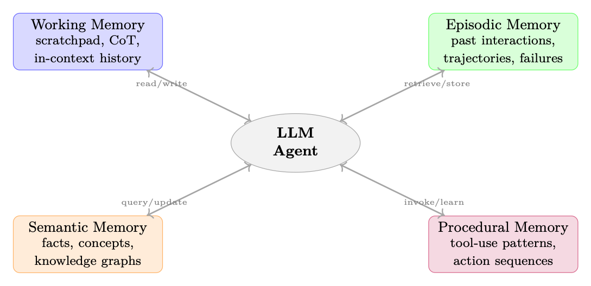

<div class="hh-guide">

<aside class="hh-part">
<p class="hh-part-title">第 V 部分 智能体 AI（Agentic AI）</p>
</aside>

## 动机：为什么 Agent 需要记忆

大语言模型本质上是无状态的函数近似器：给定 Prompt <math alttext="x" display="inline"><semantics><mi>x</mi></semantics></math>，它们会产生续写分布 <math alttext="p_{\theta}(y\mid x)" display="inline"><semantics><mrow><msub><mi>p</mi><mi>θ</mi></msub><mo lspace="0em" rspace="0em">​</mo><mrow><mo stretchy="false">(</mo><mi>y</mi><mo fence="true" lspace="0em" rspace="0em">∣</mo><mi>x</mi><mo stretchy="false">)</mo></mrow></mrow></semantics></math>。每一次推理调用都从零开始。<em>上下文窗口（context window）</em>——模型能够关注的有限 Token 序列——是生成时唯一可用的信息。对于简短、自包含的任务而言这已足够；但对于长周期的智能体任务，它是一个根本性瓶颈。

当 Agent 缺乏持久化记忆时，会出现三种截然不同的失败模式：

<ol><li>上下文的灾难性遗忘（Catastrophic Forgetting）。一旦事件滚出上下文窗口，便不可挽回地丢失。Agent 无法回溯一万个 Token 之前所做的决策。</li><li>无法从经验中学习。没有情景式（episodic）存储，每个 Episode 对 Agent 而言都像是第一次。成功的策略无法复用，错误则反复发生。</li><li>缺乏个性化。用户偏好、领域事实与关系历史必须在每次会话中重新建立，导致用户体验与效率双双下降。</li></ol>

形式化地，我们把 Agent 建模为一个元组 <math alttext="\mathcal{A}=(\pi_{\theta},\mathcal{M},\mathcal{R},\mathcal{W})" display="inline"><semantics><mrow><mi>𝒜</mi><mo>=</mo><mrow><mo stretchy="false">(</mo><msub><mi>π</mi><mi>θ</mi></msub><mo>,</mo><mi>ℳ</mi><mo>,</mo><mi>ℛ</mi><mo>,</mo><mi>𝒲</mi><mo stretchy="false">)</mo></mrow></mrow></semantics></math>，其中 <math alttext="\pi_{\theta}" display="inline"><semantics><msub><mi>π</mi><mi>θ</mi></msub></semantics></math> 是 Policy（LLM），<math alttext="\mathcal{M}" display="inline"><semantics><mi>ℳ</mi></semantics></math> 是记忆存储，<math alttext="\mathcal{R}:\mathcal{Q}\times\mathcal{M}\to\mathcal{D}" display="inline"><semantics><mrow><mi>ℛ</mi><mo lspace="0.278em" rspace="0.278em">:</mo><mrow><mrow><mi>𝒬</mi><mo lspace="0.222em" rspace="0.222em">×</mo><mi>ℳ</mi></mrow><mo stretchy="false">→</mo><mi>𝒟</mi></mrow></mrow></semantics></math> 是把查询映射到检索结果的检索函数，<math alttext="\mathcal{W}:\mathcal{M}\times\mathcal{E}\to\mathcal{M}" display="inline"><semantics><mrow><mi>𝒲</mi><mo lspace="0.278em" rspace="0.278em">:</mo><mrow><mrow><mi>ℳ</mi><mo lspace="0.222em" rspace="0.222em">×</mo><mi>ℰ</mi></mrow><mo stretchy="false">→</mo><mi>ℳ</mi></mrow></mrow></semantics></math> 是用新经验 <math alttext="\mathcal{E}" display="inline"><semantics><mi>ℰ</mi></semantics></math> 更新记忆的写入函数。在每一步 <math alttext="t" display="inline"><semantics><mi>t</mi></semantics></math>，Agent 观察到 <math alttext="o_{t}" display="inline"><semantics><msub><mi>o</mi><mi>t</mi></msub></semantics></math>，检索相关上下文 <math alttext="c_{t}=\mathcal{R}(o_{t},\mathcal{M})" display="inline"><semantics><mrow><msub><mi>c</mi><mi>t</mi></msub><mo>=</mo><mrow><mi>ℛ</mi><mo>⁡</mo><mrow><mo stretchy="false">(</mo><msub><mi>o</mi><mi>t</mi></msub><mo>,</mo><mi>ℳ</mi><mo stretchy="false">)</mo></mrow></mrow></mrow></semantics></math>，并采取行动：

<div class="hh-equation" id="ch17.ex1"><math alttext="a_{t}\sim\pi_{\theta}\!\left(\cdot\;\middle|\;[s_{t};\,c_{t};\,h_{t}]\right)," display="block"><semantics><mrow><msub><mi>a</mi><mi>t</mi></msub><mo>∼</mo><msub><mi>π</mi><mi>θ</mi></msub><mrow><mo>(</mo><mo lspace="0em" rspace="0.224em">⋅</mo><mo stretchy="true">|</mo><mrow><mo stretchy="false">[</mo><msub><mi>s</mi><mi>t</mi></msub><mo rspace="0.337em">;</mo><msub><mi>c</mi><mi>t</mi></msub><mo rspace="0.337em">;</mo><msub><mi>h</mi><mi>t</mi></msub><mo stretchy="false">]</mo></mrow><mo>)</mo></mrow><mo>,</mo></mrow></semantics></math></div>

其中 <math alttext="s_{t}" display="inline"><semantics><msub><mi>s</mi><mi>t</mi></msub></semantics></math> 是当前的系统 Prompt，<math alttext="c_{t}" display="inline"><semantics><msub><mi>c</mi><mi>t</mi></msub></semantics></math> 是检索到的记忆，<math alttext="h_{t}" display="inline"><semantics><msub><mi>h</mi><mi>t</mi></msub></semantics></math> 是近期的上下文历史。行动之后，Agent 可以写入新信息：<math alttext="\mathcal{M}\leftarrow\mathcal{W}(\mathcal{M},\,(o_{t},a_{t},r_{t}))" display="inline"><semantics><mrow><mi>ℳ</mi><mo stretchy="false">←</mo><mrow><mi>𝒲</mi><mo>⁡</mo><mrow><mo stretchy="false">(</mo><mi>ℳ</mi><mo>,</mo><mrow><mo stretchy="false">(</mo><msub><mi>o</mi><mi>t</mi></msub><mo>,</mo><msub><mi>a</mi><mi>t</mi></msub><mo>,</mo><msub><mi>r</mi><mi>t</mi></msub><mo stretchy="false">)</mo></mrow><mo stretchy="false">)</mo></mrow></mrow></mrow></semantics></math>。

## 记忆类型分类

<figure id="ch17.f1"><figcaption><span class="hh-tag">图 17.1：</span>智能体记忆系统的四分类法，与认知科学的划分相对应。每种记忆类型具有截然不同的访问模式、更新频率与检索机制。</figcaption></figure>

### 工作记忆（短期）

工作记忆是 Agent 的 <em>活动工作空间</em>：当前正在被操控的信息。在 LLM Agent 中，它对应于：

<ul><li>草稿板（Scratchpads）。在产出最终答案之前写入专用缓冲区的中间推理步骤（例如思维链 Chain-of-Thought [374]、scratchpad [272]）。</li><li>思维链缓冲区。在答案 Token <math alttext="a" display="inline"><semantics><mi>a</mi></semantics></math> 之前生成的推理 Token 序列 <math alttext="z_{1},z_{2},\ldots,z_{k}" display="inline"><semantics><mrow><msub><mi>z</mi><mn>1</mn></msub><mo>,</mo><msub><mi>z</mi><mn>2</mn></msub><mo>,</mo><mi mathvariant="normal">…</mi><mo>,</mo><msub><mi>z</mi><mi>k</mi></msub></mrow></semantics></math>，建模为 <math alttext="p(a\mid x)=\sum_{z}p(a\mid x,z)\,p(z\mid x)" display="inline"><semantics><mrow><mrow><mi>p</mi><mo>⁡</mo><mrow><mo stretchy="false">(</mo><mi>a</mi><mo fence="true" lspace="0em" rspace="0em">∣</mo><mi>x</mi><mo stretchy="false">)</mo></mrow></mrow><mo rspace="0.111em">=</mo><mrow><msub><mo>∑</mo><mi>z</mi></msub><mrow><mrow><mi>p</mi><mo>⁡</mo><mrow><mo stretchy="false">(</mo><mi>a</mi><mo fence="true" lspace="0em" rspace="0em">∣</mo><mrow><mi>x</mi><mo>,</mo><mi>z</mi></mrow><mo stretchy="false">)</mo></mrow></mrow><mo lspace="0.170em" rspace="0em">​</mo><mi>p</mi><mo lspace="0em" rspace="0em">​</mo><mrow><mo stretchy="false">(</mo><mi>z</mi><mo fence="true" lspace="0em" rspace="0em">∣</mo><mi>x</mi><mo stretchy="false">)</mo></mrow></mrow></mrow></mrow></semantics></math>。</li><li>对话上下文。保留在上下文窗口中的近期轮次历史 <math alttext="[(u_{1},a_{1}),\ldots,(u_{t},a_{t})]" display="inline"><semantics><mrow><mo stretchy="false">[</mo><mrow><mrow><mo stretchy="false">(</mo><msub><mi>u</mi><mn>1</mn></msub><mo>,</mo><msub><mi>a</mi><mn>1</mn></msub><mo stretchy="false">)</mo></mrow><mo>,</mo><mi mathvariant="normal">…</mi><mo>,</mo><mrow><mo stretchy="false">(</mo><msub><mi>u</mi><mi>t</mi></msub><mo>,</mo><msub><mi>a</mi><mi>t</mi></msub><mo stretchy="false">)</mo></mrow></mrow><mo stretchy="false">]</mo></mrow></semantics></math>。</li></ul>

工作记忆是 <em>快速的</em>（零检索延迟——它已经在上下文中）、<em>易失的</em>（上下文清空时即丢失），且 <em>容量受限的</em>（受 <math alttext="L" display="inline"><semantics><mi>L</mi></semantics></math> 约束）。

### 情景记忆（基于经验）

情景记忆存储按上下文与时间索引的 <em>具体过往事件</em>。对 Agent 而言：

<ul><li>过往交互。先前对话、任务尝试及其结果的完整或摘要记录。</li><li>成功轨迹。可作为少样本范例被检索、以服务于未来相似任务的高 Reward 动作序列。</li><li>失败案例。带有根因标注的错误记录，使 Agent 能够避免重复犯错。</li><li>检索增强的情景回忆。给定新任务 <math alttext="q" display="inline"><semantics><mi>q</mi></semantics></math>，检索最相似的 <math alttext="k" display="inline"><semantics><mi>k</mi></semantics></math> 个过去 Episode <math alttext="\{e_{i}\}_{i=1}^{k}" display="inline"><semantics><msubsup><mrow><mo stretchy="false">{</mo><msub><mi>e</mi><mi>i</mi></msub><mo stretchy="false">}</mo></mrow><mrow><mi>i</mi><mo>=</mo><mn>1</mn></mrow><mi>k</mi></msubsup></semantics></math> 并加入上下文。</li></ul>

情景记忆通常实现为基于 Episode 摘要 Embedding 的向量存储（见第 17.3.1 基于 RAG 的记忆 节）。

### 语义记忆（世界知识）

语义记忆编码与具体 Episode 解耦的 <em>一般性事实与概念</em>：

<ul><li>事实性知识。实体、属性与关系（例如“Paris 是 France 的首都”）。</li><li>领域概念。与 Agent 任务领域相关的定义、分类法与本体。</li><li>知识图谱。结构化表示 <math alttext="\mathcal{G}=(\mathcal{V},\mathcal{E})" display="inline"><semantics><mrow><mi>𝒢</mi><mo>=</mo><mrow><mo stretchy="false">(</mo><mi>𝒱</mi><mo>,</mo><mi>ℰ</mi><mo stretchy="false">)</mo></mrow></mrow></semantics></math>，其中节点 <math alttext="v\in\mathcal{V}" display="inline"><semantics><mrow><mi>v</mi><mo>∈</mo><mi>𝒱</mi></mrow></semantics></math> 为实体，边 <math alttext="e\in\mathcal{E}" display="inline"><semantics><mrow><mi>e</mi><mo>∈</mo><mi>ℰ</mi></mrow></semantics></math> 为带类型的关系。</li></ul>

与情景记忆不同，语义记忆是 <em>上下文无关的</em>：水在 <math alttext="100^{\circ}" display="inline"><semantics><msup><mn>100</mn><mo>∘</mo></msup></semantics></math>C 沸腾这一事实，无论何时何地学到都成立。

### 程序记忆（技能）

程序记忆编码 <em>如何做事</em>——已被自动化的技能与动作模式：

<ul><li>习得的工具使用模式。对哪种任务调用哪个 API、如何格式化输入、如何处理错误。</li><li>动作序列。多步过程（例如“部署代码：跑测试 <math alttext="\to" display="inline"><semantics><mo stretchy="false">→</mo></semantics></math> 构建镜像 <math alttext="\to" display="inline"><semantics><mo stretchy="false">→</mo></semantics></math> 推送 <math alttext="\to" display="inline"><semantics><mo stretchy="false">→</mo></semantics></math> 更新 manifest”）。</li><li>作为记忆的 Policy。模型权重 <math alttext="\theta" display="inline"><semantics><mi>θ</mi></semantics></math> 本身即编码了程序性知识；在成功轨迹上微调是程序记忆巩固的一种形式。</li></ul>

## 记忆架构

### 基于 RAG 的记忆

检索增强生成（Retrieval-Augmented Generation, RAG）[209] 是 LLM Agent 外部记忆的主流范式。记忆存储 <math alttext="\mathcal{M}" display="inline"><semantics><mi>ℳ</mi></semantics></math> 是文档集合 <math alttext="\{d_{i}\}_{i=1}^{N}" display="inline"><semantics><msubsup><mrow><mo stretchy="false">{</mo><msub><mi>d</mi><mi>i</mi></msub><mo stretchy="false">}</mo></mrow><mrow><mi>i</mi><mo>=</mo><mn>1</mn></mrow><mi>N</mi></msubsup></semantics></math>；检索把查询 <math alttext="q" display="inline"><semantics><mi>q</mi></semantics></math> 映射到一个有序子集。

每个文档 <math alttext="d_{i}" display="inline"><semantics><msub><mi>d</mi><mi>i</mi></msub></semantics></math> 由 Embedding 模型 <math alttext="\phi" display="inline"><semantics><mi>ϕ</mi></semantics></math> 编码：<math alttext="\mathbf{v}_{i}=\phi(d_{i})\in\mathbb{R}^{D}" display="inline"><semantics><mrow><msub><mi>𝐯</mi><mi>i</mi></msub><mo>=</mo><mrow><mi>ϕ</mi><mo>⁡</mo><mrow><mo stretchy="false">(</mo><msub><mi>d</mi><mi>i</mi></msub><mo stretchy="false">)</mo></mrow></mrow><mo>∈</mo><msup><mi>ℝ</mi><mi>D</mi></msup></mrow></semantics></math>。查询同样被编码：<math alttext="\mathbf{q}=\phi(q)" display="inline"><semantics><mrow><mi>𝐪</mi><mo>=</mo><mrow><mi>ϕ</mi><mo>⁡</mo><mrow><mo stretchy="false">(</mo><mi>q</mi><mo stretchy="false">)</mo></mrow></mrow></mrow></semantics></math>。检索按相似度返回 top-<math alttext="k" display="inline"><semantics><mi>k</mi></semantics></math> 文档：

<div class="hh-equation" id="ch17.ex2"><math alttext="\text{Retrieve}(q,\mathcal{M},k)=\underset{S\subseteq[N],\,|S|=k}{\arg\max}\sum_{i\in S}\text{sim}(\mathbf{q},\mathbf{v}_{i})," display="block"><semantics><mrow><mrow><mrow><mtext>Retrieve</mtext><mo lspace="0em" rspace="0em">​</mo><mrow><mo stretchy="false">(</mo><mi>q</mi><mo>,</mo><mi>ℳ</mi><mo>,</mo><mi>k</mi><mo stretchy="false">)</mo></mrow></mrow><mo>=</mo><mrow><munder accentunder="true"><mrow><mi>arg</mi><mo lspace="0.167em">⁡</mo><mi>max</mi></mrow><mrow><mrow><mi mathsize="0.700em">S</mi><mo mathsize="0.700em">⊆</mo><mrow><mo maxsize="0.700em" minsize="0.700em">[</mo><mi mathsize="0.700em">N</mi><mo maxsize="0.700em" minsize="0.700em">]</mo></mrow></mrow><mo mathsize="0.700em" rspace="0.337em">,</mo><mrow><mrow><mo maxsize="0.700em" minsize="0.700em" stretchy="true">|</mo><mi mathsize="0.700em">S</mi><mo maxsize="0.700em" minsize="0.700em" stretchy="true">|</mo></mrow><mo mathsize="0.700em">=</mo><mi mathsize="0.700em">k</mi></mrow></mrow></munder><mo lspace="0em" rspace="0em">​</mo><mrow><munder><mo movablelimits="false">∑</mo><mrow><mi>i</mi><mo>∈</mo><mi>S</mi></mrow></munder><mrow><mtext>sim</mtext><mo lspace="0em" rspace="0em">​</mo><mrow><mo stretchy="false">(</mo><mi>𝐪</mi><mo>,</mo><msub><mi>𝐯</mi><mi>i</mi></msub><mo stretchy="false">)</mo></mrow></mrow></mrow></mrow></mrow><mo>,</mo></mrow></semantics></math></div>

其中 <math alttext="\text{sim}(\cdot,\cdot)" display="inline"><semantics><mrow><mtext>sim</mtext><mo lspace="0em" rspace="0em">​</mo><mrow><mo stretchy="false">(</mo><mo lspace="0em" rspace="0em">⋅</mo><mo rspace="0em">,</mo><mo lspace="0em" rspace="0em">⋅</mo><mo stretchy="false">)</mo></mrow></mrow></semantics></math> 通常是余弦相似度。近似最近邻（ANN）索引（FAISS [171]、HNSW [248]、ScaNN [126]）使这一点在 <math alttext="N\sim 10^{7}" display="inline"><semantics><mrow><mi>N</mi><mo>∼</mo><msup><mn>10</mn><mn>7</mn></msup></mrow></semantics></math> 规模下变得可行。

<ul><li>稠密检索。查询与文档均由神经编码器（例如 DPR [180]、<code>text-embedding-3-large</code>）编码。它能捕获语义相似度，但需要 GPU 推理。</li><li>稀疏检索。基于 Token 重叠的 BM25 或 TF-IDF。速度快、可解释，对精确关键词匹配效果强。</li><li>混合检索。通过倒数排序融合（RRF）组合稠密与稀疏分数：<math alttext="\text{RRF}(d,k)=\sum_{r\in\text{rankers}}\frac{1}{k+\text{rank}_{r}(d)}," display="block"><semantics><mrow><mrow><mrow><mtext>RRF</mtext><mo lspace="0em" rspace="0em">​</mo><mrow><mo stretchy="false">(</mo><mi>d</mi><mo>,</mo><mi>k</mi><mo stretchy="false">)</mo></mrow></mrow><mo rspace="0.111em">=</mo><mrow><munder><mo movablelimits="false">∑</mo><mrow><mi>r</mi><mo>∈</mo><mtext>rankers</mtext></mrow></munder><mfrac><mn>1</mn><mrow><mi>k</mi><mo>+</mo><mrow><msub><mtext>rank</mtext><mi>r</mi></msub><mo lspace="0em" rspace="0em">​</mo><mrow><mo stretchy="false">(</mo><mi>d</mi><mo stretchy="false">)</mo></mrow></mrow></mrow></mfrac></mrow></mrow><mo>,</mo></mrow></semantics></math>其中 <math alttext="k=60" display="inline"><semantics><mrow><mi>k</mi><mo>=</mo><mn>60</mn></mrow></semantics></math> 是平滑常数。混合检索在 [44] 中始终优于任一单独方法。</li></ul>

交叉编码器（cross-encoder）重排序器 <math alttext="f_{\psi}(q,d)\in[0,1]" display="inline"><semantics><mrow><mrow><msub><mi>f</mi><mi>ψ</mi></msub><mo lspace="0em" rspace="0em">​</mo><mrow><mo stretchy="false">(</mo><mi>q</mi><mo>,</mo><mi>d</mi><mo stretchy="false">)</mo></mrow></mrow><mo>∈</mo><mrow><mo stretchy="false">[</mo><mrow><mn>0</mn><mo>,</mo><mn>1</mn></mrow><mo stretchy="false">]</mo></mrow></mrow></semantics></math> 将每个检索到的文档与查询联合打分，以 <math alttext="O(k)" display="inline"><semantics><mrow><mi>O</mi><mo>⁡</mo><mrow><mo stretchy="false">(</mo><mi>k</mi><mo stretchy="false">)</mo></mrow></mrow></semantics></math> 次前向传播为代价换取更高的准确率。整个流程为：用 ANN 检索 <math alttext="k^{\prime}\gg k" display="inline"><semantics><mrow><msup><mi>k</mi><mo>′</mo></msup><mo>≫</mo><mi>k</mi></mrow></semantics></math> 个候选，用交叉编码器重排序，返回 top <math alttext="k" display="inline"><semantics><mi>k</mi></semantics></math>。

### 基于摘要的记忆

当逐字存储过于昂贵或噪声过多时，<em>摘要化</em> 会在存储前对信息进行压缩。

在每一步 <math alttext="t" display="inline"><semantics><mi>t</mi></semantics></math>，Agent 维护一个滚动摘要 <math alttext="S_{t}" display="inline"><semantics><msub><mi>S</mi><mi>t</mi></msub></semantics></math>。当新信息 <math alttext="e_{t}" display="inline"><semantics><msub><mi>e</mi><mi>t</mi></msub></semantics></math> 到来时：

<div class="hh-equation" id="ch17.ex4"><math alttext="S_{t+1}=\text{LLM}\!\left(\texttt{``Summarize: [}S_{t}\texttt{] + [}e_{t}\texttt{]''}\right)." display="block"><semantics><mrow><msub><mi>S</mi><mrow><mi>t</mi><mo>+</mo><mn>1</mn></mrow></msub><mo>=</mo><mpadded width="2.270em"><mtext>LLM</mtext></mpadded><mrow><mo>(</mo><mtext>‘‘Summarize: [</mtext><msub><mi>S</mi><mi>t</mi></msub><mtext>] + [</mtext><msub><mi>e</mi><mi>t</mi></msub><mtext>]’’</mtext><mo>)</mo></mrow><mo lspace="0em">.</mo></mrow></semantics></math></div>

这使记忆大小保持 <math alttext="O(1)" display="inline"><semantics><mrow><mi>O</mi><mo>⁡</mo><mrow><mo stretchy="false">(</mo><mn>1</mn><mo stretchy="false">)</mo></mrow></mrow></semantics></math>，但有丢失细节的风险。

把记忆组织为若干层级 <math alttext="L_{0}\supset L_{1}\supset\cdots\supset L_{K}" display="inline"><semantics><mrow><msub><mi>L</mi><mn>0</mn></msub><mo>⊃</mo><msub><mi>L</mi><mn>1</mn></msub><mo rspace="0.1389em">⊃</mo><mo lspace="0.1389em" rspace="0.1389em">⋯</mo><mo lspace="0.1389em">⊃</mo><msub><mi>L</mi><mi>K</mi></msub></mrow></semantics></math>，其中 <math alttext="L_{0}" display="inline"><semantics><msub><mi>L</mi><mn>0</mn></msub></semantics></math> 是逐字原文，每个 <math alttext="L_{i+1}" display="inline"><semantics><msub><mi>L</mi><mrow><mi>i</mi><mo>+</mo><mn>1</mn></mrow></msub></semantics></math> 是 <math alttext="L_{i}" display="inline"><semantics><msub><mi>L</mi><mi>i</mi></msub></semantics></math> 的摘要。检索首先检查 <math alttext="L_{K}" display="inline"><semantics><msub><mi>L</mi><mi>K</mi></msub></semantics></math>（压缩程度最高、速度最快），再按需向下钻取。这与 Forte [96] 提出的 <em>渐进式摘要</em> 技术如出一辙。

<ul><li>逐字存储：精确事实、代码片段、数值结果、用户原话。</li><li>摘要化：叙事性上下文、推理链、冗余观察。</li><li>丢弃：噪声、不含信息量的失败工具调用。</li></ul>

### 基于图的记忆

知识图谱 <math alttext="\mathcal{G}=(\mathcal{V},\mathcal{E},\mathcal{R})" display="inline"><semantics><mrow><mi>𝒢</mi><mo>=</mo><mrow><mo stretchy="false">(</mo><mi>𝒱</mi><mo>,</mo><mi>ℰ</mi><mo>,</mo><mi>ℛ</mi><mo stretchy="false">)</mo></mrow></mrow></semantics></math> 以三元组 <math alttext="(h,r,t)" display="inline"><semantics><mrow><mo stretchy="false">(</mo><mi>h</mi><mo>,</mo><mi>r</mi><mo>,</mo><mi>t</mi><mo stretchy="false">)</mo></mrow></semantics></math> 的形式存储事实，其中 <math alttext="h,t\in\mathcal{V}" display="inline"><semantics><mrow><mrow><mi>h</mi><mo>,</mo><mi>t</mi></mrow><mo>∈</mo><mi>𝒱</mi></mrow></semantics></math> 是实体，<math alttext="r\in\mathcal{R}" display="inline"><semantics><mrow><mi>r</mi><mo>∈</mo><mi>ℛ</mi></mrow></semantics></math> 是关系。Agent 可通过 SPARQL [134]、Cypher [97] 或自然语言到图的转换来查询。

新的观察由抽取模型 <math alttext="\text{IE}:\text{text}\to\{(h_{i},r_{i},t_{i})\}" display="inline"><semantics><mrow><mtext>IE</mtext><mo lspace="0.278em" rspace="0.278em">:</mo><mrow><mtext>text</mtext><mo stretchy="false">→</mo><mrow><mo stretchy="false">{</mo><mrow><mo stretchy="false">(</mo><msub><mi>h</mi><mi>i</mi></msub><mo>,</mo><msub><mi>r</mi><mi>i</mi></msub><mo>,</mo><msub><mi>t</mi><mi>i</mi></msub><mo stretchy="false">)</mo></mrow><mo stretchy="false">}</mo></mrow></mrow></mrow></semantics></math> 解析，并合并进 <math alttext="\mathcal{G}" display="inline"><semantics><mi>𝒢</mi></semantics></math>。指代消解与实体链接确保一致性。

GraphRAG [82] 用图遍历增强 RAG：给定一个查询，先检索种子实体，再通过 <math alttext="k" display="inline"><semantics><mi>k</mi></semantics></math> 跳邻域遍历进行扩展，以发掘那些未被 Embedding 相似度直接匹配到的相关事实。这对多跳推理尤为强大：

<div class="hh-equation" id="ch17.ex5"><math alttext="\text{GraphRetrieve}(q,\mathcal{G},k)=\bigcup_{v\in\text{seeds}(q)}\mathcal{N}_{k}(v,\mathcal{G})," display="block"><semantics><mrow><mrow><mrow><mtext>GraphRetrieve</mtext><mo lspace="0em" rspace="0em">​</mo><mrow><mo stretchy="false">(</mo><mi>q</mi><mo>,</mo><mi>𝒢</mi><mo>,</mo><mi>k</mi><mo stretchy="false">)</mo></mrow></mrow><mo rspace="0.111em">=</mo><mrow><munder><mo movablelimits="false">⋃</mo><mrow><mi>v</mi><mo>∈</mo><mrow><mtext>seeds</mtext><mo lspace="0em" rspace="0em">​</mo><mrow><mo stretchy="false">(</mo><mi>q</mi><mo stretchy="false">)</mo></mrow></mrow></mrow></munder><mrow><msub><mi>𝒩</mi><mi>k</mi></msub><mo lspace="0em" rspace="0em">​</mo><mrow><mo stretchy="false">(</mo><mi>v</mi><mo>,</mo><mi>𝒢</mi><mo stretchy="false">)</mo></mrow></mrow></mrow></mrow><mo>,</mo></mrow></semantics></math></div>

其中 <math alttext="\mathcal{N}_{k}(v,\mathcal{G})" display="inline"><semantics><mrow><msub><mi>𝒩</mi><mi>k</mi></msub><mo lspace="0em" rspace="0em">​</mo><mrow><mo stretchy="false">(</mo><mi>v</mi><mo>,</mo><mi>𝒢</mi><mo stretchy="false">)</mo></mrow></mrow></semantics></math> 是 <math alttext="v" display="inline"><semantics><mi>v</mi></semantics></math> 的 <math alttext="k" display="inline"><semantics><mi>k</mi></semantics></math> 跳邻域。

事实具有有效区间：<math alttext="(h,r,t,[t_{\text{start}},t_{\text{end}}])" display="inline"><semantics><mrow><mo stretchy="false">(</mo><mi>h</mi><mo>,</mo><mi>r</mi><mo>,</mo><mi>t</mi><mo>,</mo><mrow><mo stretchy="false">[</mo><mrow><msub><mi>t</mi><mtext>start</mtext></msub><mo>,</mo><msub><mi>t</mi><mtext>end</mtext></msub></mrow><mo stretchy="false">]</mo></mrow><mo stretchy="false">)</mo></mrow></semantics></math>。时序知识图谱 [197] 支持诸如“2023 年 OpenAI 的 CEO 是谁？”这类查询，而不会混淆过去与现在的状态。

### 键值记忆网络（Key-Value Memory Networks）

可微记忆网络 [377, 343] 把记忆表示为一组键值对 <math alttext="\{(\mathbf{k}_{i},\mathbf{v}_{i})\}_{i=1}^{M}" display="inline"><semantics><msubsup><mrow><mo stretchy="false">{</mo><mrow><mo stretchy="false">(</mo><msub><mi>𝐤</mi><mi>i</mi></msub><mo>,</mo><msub><mi>𝐯</mi><mi>i</mi></msub><mo stretchy="false">)</mo></mrow><mo stretchy="false">}</mo></mrow><mrow><mi>i</mi><mo>=</mo><mn>1</mn></mrow><mi>M</mi></msubsup></semantics></math>，并通过基于软注意力的检索进行访问：

<div class="hh-equation" id="ch17.ex6"><math alttext="\alpha_{i}=\text{softmax}\!\left(\frac{\mathbf{q}^{\top}\mathbf{k}_{i}}{\sqrt{D}}\right),\qquad\mathbf{c}=\sum_{i=1}^{M}\alpha_{i}\mathbf{v}_{i}." display="block"><semantics><mrow><mrow><mrow><msub><mi>α</mi><mi>i</mi></msub><mo>=</mo><mrow><mpadded width="3.720em"><mtext>softmax</mtext></mpadded><mo lspace="0em" rspace="0em">​</mo><mrow><mo>(</mo><mfrac><mrow><msup><mi>𝐪</mi><mo>⊤</mo></msup><mo lspace="0em" rspace="0em">​</mo><msub><mi>𝐤</mi><mi>i</mi></msub></mrow><msqrt><mi>D</mi></msqrt></mfrac><mo>)</mo></mrow></mrow></mrow><mo rspace="2.167em">,</mo><mrow><mi>𝐜</mi><mo rspace="0.111em">=</mo><mrow><munderover><mo movablelimits="false">∑</mo><mrow><mi>i</mi><mo>=</mo><mn>1</mn></mrow><mi>M</mi></munderover><mrow><msub><mi>α</mi><mi>i</mi></msub><mo lspace="0em" rspace="0em">​</mo><msub><mi>𝐯</mi><mi>i</mi></msub></mrow></mrow></mrow></mrow><mo lspace="0em">.</mo></mrow></semantics></math></div>

检索到的上下文 <math alttext="\mathbf{c}" display="inline"><semantics><mi>𝐜</mi></semantics></math> 是查询的可微函数，从而支持端到端训练。现代 Transformer 注意力机制是这一机制的特例。在智能体场景下，记忆槽既可通过梯度下降更新，也可通过显式写操作更新。

### MemGPT 与虚拟上下文管理

MemGPT [281] 引入了 <em>虚拟上下文</em> 抽象，类比操作系统中的虚拟内存。记忆按层级组织：

Agent 决定把 <em>哪些</em> 记忆提升到热上下文（页入）、把 <em>哪些</em> 逐出（页出），其依据是：

<ul><li>近期性：最近访问过的条目更有可能被需要。</li><li>相关性：与当前查询相似度高的条目。</li><li>重要性：在写入时被标记为高重要性的条目。</li></ul>

在 MemGPT 中，LLM 本身会发出记忆管理函数调用（<code>memory_search</code>、<code>memory_insert</code>、<code>memory_delete</code>），作为其动作空间的一部分。这使记忆管理成为一种 <em>习得行为</em>，而非硬编码的策略——也是 RL 训练的天然目标（见第 17.7 用强化学习训练记忆系统 节）。

## 记忆操作

### 写入：把信息提交到记忆

并非每个观察都应该被存储。写入决策本质上是一个过滤问题：

<div class="hh-equation" id="ch17.ex7"><math alttext="\text{Write}(e)=\mathbf{1}\!\left[\text{importance}(e)&gt;\tau\right]," display="block"><semantics><mrow><mtext>Write</mtext><mrow><mo stretchy="false">(</mo><mi>e</mi><mo stretchy="false">)</mo></mrow><mo rspace="0.108em">=</mo><mrow><mo>[</mo><mtext>importance</mtext><mrow><mo stretchy="false">(</mo><mi>e</mi><mo stretchy="false">)</mo></mrow><mo>&gt;</mo><mi>τ</mi><mo>]</mo></mrow><mo>,</mo></mrow></semantics></math></div>

其中 <math alttext="\tau" display="inline"><semantics><mi>τ</mi></semantics></math> 是阈值，<math alttext="\text{importance}(e)" display="inline"><semantics><mrow><mtext>importance</mtext><mo lspace="0em" rspace="0em">​</mo><mrow><mo stretchy="false">(</mo><mi>e</mi><mo stretchy="false">)</mo></mrow></mrow></semantics></math> 可以是：

<ul><li>惊讶度：<math alttext="-\log p_{\theta}(e\mid\text{context})" display="inline"><semantics><mrow><mo rspace="0.167em">−</mo><mrow><mrow><mi>log</mi><mo lspace="0.167em">⁡</mo><msub><mi>p</mi><mi>θ</mi></msub></mrow><mo lspace="0em" rspace="0em">​</mo><mrow><mo stretchy="false">(</mo><mi>e</mi><mo fence="true" lspace="0em" rspace="0em">∣</mo><mtext>context</mtext><mo stretchy="false">)</mo></mrow></mrow></mrow></semantics></math>——意外事件的信息量更大。</li><li>奖励信号：与高 <math alttext="|r_{t}|" display="inline"><semantics><mrow><mo stretchy="false">|</mo><msub><mi>r</mi><mi>t</mi></msub><mo stretchy="false">|</mo></mrow></semantics></math> 相关联的事件（无论正负）都值得记住。</li><li>LLM 自我评估：让模型按 1–10 分对重要性打分。</li></ul>

在写入新事实 <math alttext="f_{\text{new}}" display="inline"><semantics><msub><mi>f</mi><mtext>new</mtext></msub></semantics></math> 之前，先检查它与既有记忆是否冲突：

<div class="hh-equation" id="ch17.ex8"><math alttext="\text{Conflict}(f_{\text{new}},\mathcal{M})=\exists\,f\in\mathcal{M}:\text{Contradicts}(f_{\text{new}},f)." display="block"><semantics><mrow><mrow><mrow><mtext>Conflict</mtext><mo lspace="0em" rspace="0em">​</mo><mrow><mo stretchy="false">(</mo><msub><mi>f</mi><mtext>new</mtext></msub><mo>,</mo><mi>ℳ</mi><mo stretchy="false">)</mo></mrow></mrow><mo>=</mo><mrow><mo rspace="0.337em">∃</mo><mi>f</mi></mrow><mo>∈</mo><mi>ℳ</mi><mo lspace="0.278em" rspace="0.278em">:</mo><mrow><mtext>Contradicts</mtext><mo lspace="0em" rspace="0em">​</mo><mrow><mo stretchy="false">(</mo><msub><mi>f</mi><mtext>new</mtext></msub><mo>,</mo><mi>f</mi><mo stretchy="false">)</mo></mrow></mrow></mrow><mo lspace="0em">.</mo></mrow></semantics></math></div>

矛盾检测可通过 NLI 模型实现，也可通过提示 LLM 来完成。发生冲突时，Agent 必须决定：覆盖、带时间戳地同时保留两者，还是标记出来交由人工审查。

除了 <em>存什么</em>，<em>怎么存</em> 同样至关重要。记忆条目从原子事实到冗长的逐字记录不等，各有不同的取舍：

<div class="hh-table" id="ch17.t1"><table class="ltx_tabular ltx_align_middle"><thead><tr><th class="ltx_align_left"><span>格式</span></th><th class="ltx_align_left ltx_align_top"><span class="ltx_align_top"><span><span>优点</span></span></span></th><th class="ltx_align_left ltx_align_top"><span class="ltx_align_top"><span><span>缺点</span></span></span></th></tr></thead><tbody><tr><th class="ltx_align_left"><span>原子事实</span></th><td class="ltx_align_top"></td><td class="ltx_align_top"></td></tr><tr><th class="ltx_align_left">“用户偏好 Python。”</th><td class="ltx_align_left ltx_align_top"><span class="ltx_align_top"><span>检索精确；可组合；易于去重与矛盾检测</span></span></td><td class="ltx_align_left ltx_align_top"><span class="ltx_align_top"><span>丢失上下文；存在抽取错误；对细微信息较为脆弱</span></span></td></tr><tr><th class="ltx_align_left"><span>结构化笔记</span></th><td class="ltx_align_top"></td><td class="ltx_align_top"></td></tr><tr><th class="ltx_align_left">(A-MEM <span>[400]</span>)</th><td class="ltx_align_left ltx_align_top"><span class="ltx_align_top"><span>丰富的元数据（标签、链接）；支持图遍历；兼顾精确性与上下文</span></span></td><td class="ltx_align_left ltx_align_top"><span class="ltx_align_top"><span>写入成本更高；需要设计 schema</span></span></td></tr><tr><th class="ltx_align_left"><span>摘要化 Episode</span></th><td class="ltx_align_top"></td><td class="ltx_align_top"></td></tr><tr><th class="ltx_align_left">(MemGPT <span>[281]</span>)</th><td class="ltx_align_left ltx_align_top"><span class="ltx_align_top"><span>保持叙事连贯性；紧凑；适合多轮推理</span></span></td><td class="ltx_align_left ltx_align_top"><span class="ltx_align_top"><span>摘要化有损；难以局部更新</span></span></td></tr><tr><th class="ltx_align_left"><span>逐字记录</span></th><td class="ltx_align_left ltx_align_top"><span class="ltx_align_top"><span>无损；无抽取错误；支持精确引用</span></span></td><td class="ltx_align_left ltx_align_top"><span class="ltx_align_top"><span>存储量大；检索噪声多；扫描成本高</span></span></td></tr></tbody></table><p class="hh-table-caption"><span class="hh-tag">表 17.1：</span>记忆粒度的取舍。</p></div>

在实践中，生产系统通常组合多种粒度 [53]：抽取原子事实以支持精确召回，维护摘要化 Episode 以保留叙事上下文，并把逐字记录归档到冷存储以便审计。Generative Agents 架构 [285] 将观察存储为原子化的“记忆对象”，附带自然语言描述、重要性分数与时间戳——从而同时支持精确检索与时间推理。

<ul><li>让粒度匹配查询类型。如果用户问的是事实型问题（“我的 API key 是什么？”），原子事实胜出。如果问的是上下文型问题（“我们当初为什么决定用 Redis？”），则需要 Episode 摘要。</li><li>在可承受的范围内按最细粒度存储，再在其上构建更粗的视图。把原子事实摘要化很容易；但从有损摘要中恢复原子事实是不可能的。</li><li>包含来源信息。每条记忆条目都应链接回其来源（对话轮次、文档、工具输出），以便 Agent 验证、用户审计。</li></ul>

### 读取 / 检索

检索查询 <math alttext="q" display="inline"><semantics><mi>q</mi></semantics></math> 不必就是原始观察。更好的策略：

<ul><li>HyDE（Hypothetical Document Embeddings）[106]：生成一个假设性答案，将其 Embedding，并用该 Embedding 作为查询。</li><li>查询扩展：生成查询的多个改写版本，并取检索结果的并集。</li><li>后退式提示：在检索之前把具体查询抽象为一个更一般化的问题。</li></ul>

较早的记忆可能相关性更低。一个时间加权分数：

<div class="hh-equation" id="ch17.ex9"><math alttext="\text{score}(d,q,t)=\lambda\cdot\text{sim}(\mathbf{q},\mathbf{v}_{d})+(1-\lambda)\cdot\exp\!\left(-\frac{t-t_{d}}{\tau_{\text{decay}}}\right)," display="block"><semantics><mrow><mrow><mrow><mtext>score</mtext><mo lspace="0em" rspace="0em">​</mo><mrow><mo stretchy="false">(</mo><mi>d</mi><mo>,</mo><mi>q</mi><mo>,</mo><mi>t</mi><mo stretchy="false">)</mo></mrow></mrow><mo>=</mo><mrow><mrow><mrow><mi>λ</mi><mo lspace="0.222em" rspace="0.222em">⋅</mo><mtext>sim</mtext></mrow><mo lspace="0em" rspace="0em">​</mo><mrow><mo stretchy="false">(</mo><mi>𝐪</mi><mo>,</mo><msub><mi>𝐯</mi><mi>d</mi></msub><mo stretchy="false">)</mo></mrow></mrow><mo>+</mo><mrow><mrow><mo stretchy="false">(</mo><mrow><mn>1</mn><mo>−</mo><mi>λ</mi></mrow><mo rspace="0.055em" stretchy="false">)</mo></mrow><mo rspace="0.222em">⋅</mo><mrow><mpadded width="1.370em"><mi>exp</mi></mpadded><mo>⁡</mo><mrow><mo>(</mo><mrow><mo>−</mo><mfrac><mrow><mi>t</mi><mo>−</mo><msub><mi>t</mi><mi>d</mi></msub></mrow><msub><mi>τ</mi><mtext>decay</mtext></msub></mfrac></mrow><mo>)</mo></mrow></mrow></mrow></mrow></mrow><mo>,</mo></mrow></semantics></math></div>

其中 <math alttext="t_{d}" display="inline"><semantics><msub><mi>t</mi><mi>d</mi></msub></semantics></math> 是记忆的创建时间，<math alttext="\tau_{\text{decay}}" display="inline"><semantics><msub><mi>τ</mi><mtext>decay</mtext></msub></semantics></math> 控制衰减速率。Generative Agents 论文 [285] 使用了类似的近期性加权检索。

### 更新：冲突解决与巩固

记忆固化会合并相关记忆，以减少冗余并显露更高层次的模式：

<div class="hh-equation" id="ch17.ex10"><math alttext="\mathcal{M}^{\prime}=\text{Consolidate}(\mathcal{M})=\text{Cluster}(\mathcal{M})\cup\text{Summarize}(\text{Cluster}(\mathcal{M}))." display="block"><semantics><mrow><mrow><msup><mi>ℳ</mi><mo>′</mo></msup><mo>=</mo><mrow><mtext>Consolidate</mtext><mo lspace="0em" rspace="0em">​</mo><mrow><mo stretchy="false">(</mo><mi>ℳ</mi><mo stretchy="false">)</mo></mrow></mrow><mo>=</mo><mrow><mrow><mtext>Cluster</mtext><mo lspace="0em" rspace="0em">​</mo><mrow><mo stretchy="false">(</mo><mi>ℳ</mi><mo stretchy="false">)</mo></mrow></mrow><mo>∪</mo><mrow><mtext>Summarize</mtext><mo lspace="0em" rspace="0em">​</mo><mrow><mo stretchy="false">(</mo><mrow><mtext>Cluster</mtext><mo lspace="0em" rspace="0em">​</mo><mrow><mo stretchy="false">(</mo><mi>ℳ</mi><mo stretchy="false">)</mo></mrow></mrow><mo stretchy="false">)</mo></mrow></mrow></mrow></mrow><mo lspace="0em">.</mo></mrow></semantics></math></div>

生物记忆会遗忘；人工记忆也应如此。策略包括：

<ul><li>LRU 逐出：当容量超出时，移除最久未使用的条目。</li><li>重要性加权遗忘：<math alttext="p(\text{forget}\,|\,d)\propto\exp(-\text{importance}(d))" display="inline"><semantics><mrow><mrow><mi>p</mi><mo>⁡</mo><mrow><mo stretchy="false">(</mo><mtext>forget</mtext><mo lspace="0.170em" rspace="0.170em">|</mo><mi>d</mi><mo stretchy="false">)</mo></mrow></mrow><mo>∝</mo><mrow><mi>exp</mi><mo>⁡</mo><mrow><mo stretchy="false">(</mo><mrow><mo>−</mo><mrow><mtext>importance</mtext><mo lspace="0em" rspace="0em">​</mo><mrow><mo stretchy="false">(</mo><mi>d</mi><mo stretchy="false">)</mo></mrow></mrow></mrow><mo stretchy="false">)</mo></mrow></mrow></mrow></semantics></math>。</li><li>间隔重复：被反复访问的记忆会保留更久，遵循指数遗忘曲线 [81]。</li></ul>

### 反思：元认知操作

反思 [285, 326] 是一种更高阶的记忆操作：Agent 读取自身的记忆并生成 <em>洞见</em>：

<div class="hh-equation" id="ch17.ex11"><math alttext="\text{Reflect}(\mathcal{M})\to\{i_{1},i_{2},\ldots\}\subset\mathcal{M}_{\text{semantic}}," display="block"><semantics><mrow><mrow><mrow><mtext>Reflect</mtext><mo lspace="0em" rspace="0em">​</mo><mrow><mo stretchy="false">(</mo><mi>ℳ</mi><mo stretchy="false">)</mo></mrow></mrow><mo stretchy="false">→</mo><mrow><mo stretchy="false">{</mo><msub><mi>i</mi><mn>1</mn></msub><mo>,</mo><msub><mi>i</mi><mn>2</mn></msub><mo>,</mo><mi mathvariant="normal">…</mi><mo stretchy="false">}</mo></mrow><mo>⊂</mo><msub><mi>ℳ</mi><mtext>semantic</mtext></msub></mrow><mo>,</mo></mrow></semantics></math></div>

其中每条洞见 <math alttext="i_{j}" display="inline"><semantics><msub><mi>i</mi><mi>j</mi></msub></semantics></math> 都是由多条情景记忆导出的更高层抽象。

反思 <em>读取</em> 情景记忆，却 <em>写入</em> 语义记忆。由此产生的洞见是与上下文无关的概括（“始终检查输入是否为空”），而非针对具体 Episode 的记录——因此它们属于语义记忆 <math alttext="\mathcal{M}_{\text{semantic}}" display="inline"><semantics><msub><mi>ℳ</mi><mtext>semantic</mtext></msub></semantics></math>。不过，在反思过程本身中，中间推理（检索到的 Episode + 综合 Prompt + 生成的洞见）占用的是 <em>工作记忆</em>（上下文窗口）。简言之：

<ul><li>输入：情景记忆（具体的过往事件）</li><li>计算：工作记忆（上下文中的主动推理）</li><li>输出：语义记忆（持久、概括化的洞见）</li></ul>

这与生物记忆的固化过程相呼应：在睡眠与反思中，情景经验被逐步转化为语义知识。

## 多轮对话中的记忆

### 用户建模与偏好追踪

持久化的用户模型 <math alttext="\mathcal{U}" display="inline"><semantics><mi>𝒰</mi></semantics></math> 存储：

<ul><li>显式偏好：明确表达的喜好与厌恶、沟通风格偏好。</li><li>隐式偏好：从行为中推断得出（例如用户总是要求用 Python 写代码、偏好简洁的回答）。</li><li>专业水平：从用词与提问复杂度推断出的领域知识水平。</li><li>目标与上下文：正在进行的项目、当前任务、组织角色。</li></ul>

用户模型在每次交互之后更新：

<div class="hh-equation" id="ch17.ex12"><math alttext="\mathcal{U}_{t+1}=\text{Update}(\mathcal{U}_{t},\,(u_{t},a_{t},\text{feedback}_{t}))." display="block"><semantics><mrow><mrow><msub><mi>𝒰</mi><mrow><mi>t</mi><mo>+</mo><mn>1</mn></mrow></msub><mo>=</mo><mrow><mtext>Update</mtext><mo lspace="0em" rspace="0em">​</mo><mrow><mo stretchy="false">(</mo><msub><mi>𝒰</mi><mi>t</mi></msub><mo>,</mo><mrow><mo stretchy="false">(</mo><msub><mi>u</mi><mi>t</mi></msub><mo>,</mo><msub><mi>a</mi><mi>t</mi></msub><mo>,</mo><msub><mtext>feedback</mtext><mi>t</mi></msub><mo stretchy="false">)</mo></mrow><mo stretchy="false">)</mo></mrow></mrow></mrow><mo lspace="0em">.</mo></mrow></semantics></math></div>

### 会话连续性

没有记忆时，每次对话都从冷启动开始。有了会话记忆之后：

<ol><li>在会话开始时，检索用户模型 <math alttext="\mathcal{U}" display="inline"><semantics><mi>𝒰</mi></semantics></math> 与近期的会话摘要。</li><li>注入个性化的系统 Prompt：“你正在协助 Alice，她是一位资深 ML 工程师，正在做分布式训练项目。上一次会话中，你帮助她排查了一个梯度同步问题。”</li><li>在会话结束时，总结本次会话并更新 <math alttext="\mathcal{U}" display="inline"><semantics><mi>𝒰</mi></semantics></math>。</li></ol>

### 通过记忆实现个性化

个性化既能提升 <em>效率</em>（减少澄清性提问），也能提升 <em>质量</em>（让回答与用户专业水平相匹配）。关键技术：

<ul><li>自适应详略度：根据用户的历史互动情况调整回答长度。</li><li>领域引导：在开头附加来自语义记忆的相关领域上下文。</li><li>主动召回：在未被询问的情况下主动呈现相关的过往交互（“你上个月问过这个主题；这是我们当时的发现”）。</li></ul>

## 多智能体系统中的记忆

当多个 Agent 协作完成一项共享任务时，记忆便成为一种 <em>协调机制</em>——而不只是个人的知识存储。负责任务分解的规划 Agent 必须把子目标传达给执行 Agent；评论家（critic）Agent 必须能访问它所评估的 Agent 所使用的同一上下文；由 Agent 组成的研究团队必须避免重复劳动。没有共享记忆，Agent 之间就只能通过直接消息传递一切，这会造成带宽瓶颈，并在对话滑出上下文时丢失信息。共享记忆通过提供一个持久、可查询的基底来解决这一问题，所有 Agent 都可以从中读取和写入——把隐式协调（“我希望另一个 Agent 还记得”）转变为显式状态（“答案就在黑板上”）。

### 共享记忆池

在多 Agent 系统中，Agent 可以在各自的私有存储 <math alttext="\mathcal{M}_{i}" display="inline"><semantics><msub><mi>ℳ</mi><mi>i</mi></msub></semantics></math> 之外，共享一个公共记忆存储 <math alttext="\mathcal{M}_{\text{shared}}" display="inline"><semantics><msub><mi>ℳ</mi><mtext>shared</mtext></msub></semantics></math>：

<div class="hh-equation" id="ch17.ex13"><math alttext="\text{context}_{i}(t)=\mathcal{R}(\mathcal{M}_{i},q_{i})\cup\mathcal{R}(\mathcal{M}_{\text{shared}},q_{i})." display="block"><semantics><mrow><mrow><mrow><msub><mtext>context</mtext><mi>i</mi></msub><mo lspace="0em" rspace="0em">​</mo><mrow><mo stretchy="false">(</mo><mi>t</mi><mo stretchy="false">)</mo></mrow></mrow><mo>=</mo><mrow><mrow><mi>ℛ</mi><mo>⁡</mo><mrow><mo stretchy="false">(</mo><msub><mi>ℳ</mi><mi>i</mi></msub><mo>,</mo><msub><mi>q</mi><mi>i</mi></msub><mo stretchy="false">)</mo></mrow></mrow><mo>∪</mo><mrow><mi>ℛ</mi><mo>⁡</mo><mrow><mo stretchy="false">(</mo><msub><mi>ℳ</mi><mtext>shared</mtext></msub><mo>,</mo><msub><mi>q</mi><mi>i</mi></msub><mo stretchy="false">)</mo></mrow></mrow></mrow></mrow><mo lspace="0em">.</mo></mrow></semantics></math></div>

共享记忆支持 <em>隐式协调</em>：Agent <math alttext="A" display="inline"><semantics><mi>A</mi></semantics></math> 写入一项发现；Agent <math alttext="B" display="inline"><semantics><mi>B</mi></semantics></math> 无需显式通信即可检索到它。

### Blackboard 架构

<em>黑板</em>模式 [135] 是一种经典的多 Agent 协调机制：

每个 Agent 都从黑板读取并向黑板写入。<em>控制器</em>监视黑板，并在某个 Agent 的前置条件满足时激活它。这使 Agent 之间解耦：它们通过共享状态而非直接消息进行通信。

### 共享知识中的共识与冲突

当多个 Agent 同时写入共享记忆时，就会产生冲突。解决策略：

<ul><li>最后写入者胜出：简单，但会丢失信息。</li><li>版本化记忆：保留所有写入的历史；Agent 可以查询任意版本。</li><li>投票／共识：要求事实被提交之前，有 <math alttext="n" display="inline"><semantics><mi>n</mi></semantics></math> 个 Agent 中的 <math alttext="k" display="inline"><semantics><mi>k</mi></semantics></math> 个达成一致。</li><li>置信度加权合并：<math alttext="f_{\text{merged}}=\sum_{i}w_{i}f_{i}" display="inline"><semantics><mrow><msub><mi>f</mi><mtext>merged</mtext></msub><mo rspace="0.111em">=</mo><mrow><msub><mo>∑</mo><mi>i</mi></msub><mrow><msub><mi>w</mi><mi>i</mi></msub><mo lspace="0em" rspace="0em">​</mo><msub><mi>f</mi><mi>i</mi></msub></mrow></mrow></mrow></semantics></math>，其中 <math alttext="w_{i}" display="inline"><semantics><msub><mi>w</mi><mi>i</mi></msub></semantics></math> 是 Agent <math alttext="i" display="inline"><semantics><mi>i</mi></semantics></math> 的置信度。</li><li>指定权威：把记忆区域的所有权分配给特定的 Agent。</li></ul>

## 用强化学习训练记忆系统

### 记忆操作的奖励信号

记忆操作（读、写、更新、反思）可以被视为 RL 框架中的动作。挑战在于设计奖励信号，以激励 <em>有用的</em> 记忆行为：

<ul><li>任务奖励传播。如果某次记忆检索导向了正确答案，就把功劳归于该检索动作。奖励稀疏，但含义明确。</li><li>检索精确率奖励。<math alttext="r_{\text{retrieve}}=\text{Relevance}(d_{\text{retrieved}},\text{task})" display="inline"><semantics><mrow><msub><mi>r</mi><mtext>retrieve</mtext></msub><mo>=</mo><mrow><mtext>Relevance</mtext><mo lspace="0em" rspace="0em">​</mo><mrow><mo stretchy="false">(</mo><msub><mi>d</mi><mtext>retrieved</mtext></msub><mo>,</mo><mtext>task</mtext><mo stretchy="false">)</mo></mrow></mrow></mrow></semantics></math>，由学习得到的相关性模型估计。</li><li>记忆效率奖励。对不必要的写入施加惩罚：<math alttext="r_{\text{write}}=-\lambda\cdot\mathbf{1}[\text{write}]" display="inline"><semantics><mrow><msub><mi>r</mi><mtext>write</mtext></msub><mo rspace="0em">=</mo><mo lspace="0em">−</mo><mi>λ</mi><mo lspace="0.222em" rspace="0.222em">⋅</mo><mn>𝟏</mn><mrow><mo stretchy="false">[</mo><mtext>write</mtext><mo stretchy="false">]</mo></mrow></mrow></semantics></math>，以鼓励有选择地存储。</li><li>一致性奖励。奖励内部一致的记忆状态（无矛盾）。</li></ul>

在第 <math alttext="t" display="inline"><semantics><mi>t</mi></semantics></math> 步对记忆操作 <math alttext="m_{t}" display="inline"><semantics><msub><mi>m</mi><mi>t</mi></msub></semantics></math> 的合成奖励：

<div class="hh-equation" id="ch17.ex14"><math alttext="r_{t}^{\text{mem}}=r_{t}^{\text{task}}+\alpha\cdot r_{t}^{\text{retrieve}}+\beta\cdot r_{t}^{\text{write}}+\gamma\cdot r_{t}^{\text{consistency}}." display="block"><semantics><mrow><mrow><msubsup><mi>r</mi><mi>t</mi><mtext>mem</mtext></msubsup><mo>=</mo><mrow><msubsup><mi>r</mi><mi>t</mi><mtext>task</mtext></msubsup><mo>+</mo><mrow><mi>α</mi><mo lspace="0.222em" rspace="0.222em">⋅</mo><msubsup><mi>r</mi><mi>t</mi><mtext>retrieve</mtext></msubsup></mrow><mo>+</mo><mrow><mi>β</mi><mo lspace="0.222em" rspace="0.222em">⋅</mo><msubsup><mi>r</mi><mi>t</mi><mtext>write</mtext></msubsup></mrow><mo>+</mo><mrow><mi>γ</mi><mo lspace="0.222em" rspace="0.222em">⋅</mo><msubsup><mi>r</mi><mi>t</mi><mtext>consistency</mtext></msubsup></mrow></mrow></mrow><mo lspace="0em">.</mo></mrow></semantics></math></div>

### 学习“记什么”

<em>该记住什么</em> 这一问题是一个元学习挑战：Agent 必须学习一个写入策略 <math alttext="\pi_{\text{write}}(e)" display="inline"><semantics><mrow><msub><mi>π</mi><mtext>write</mtext></msub><mo lspace="0em" rspace="0em">​</mo><mrow><mo stretchy="false">(</mo><mi>e</mi><mo stretchy="false">)</mo></mrow></mrow></semantics></math>，以最大化未来的任务表现。这之所以困难，原因在于：

<ol><li>一条记忆的价值只有在未来才会显现（延迟奖励）。</li><li>未来可能的查询空间在写入时是未知的。</li><li>记忆之间存在相互作用：存储 <math alttext="e" display="inline"><semantics><mi>e</mi></semantics></math> 的价值取决于 <math alttext="\mathcal{M}" display="inline"><semantics><mi>ℳ</mi></semantics></math> 中还有什么。</li></ol>

可行方法：

<ul><li>事后重标记[8]。在一个成功的 Episode 结束后，回溯性地把当时被检索到的记忆标记为“重要”，并训练写入策略存储类似条目。</li><li>元强化学习（Meta-RL）[79]。在一批任务分布上训练写入策略；该策略学会存储能跨任务泛化的信息。</li><li>好奇心驱动的存储[286]。存储令人意外的观察（预测误差高），因为这些观察往往信息量更大。</li></ul>

### 记忆增强的 Policy 优化

联合优化策略与其记忆系统的想法可追溯到可微记忆网络 [119]，并由 REALM [128] 推广到检索增强的 LLM。记忆增强 Agent 的完整策略梯度目标为：

<div class="hh-equation" id="ch17.ex15"><math alttext="\mathcal{L}(\theta,\phi)=\mathbb{E}_{\tau\sim\pi_{\theta}}\!\left[\sum_{t=0}^{T}\gamma^{t}r_{t}\right]-\lambda\cdot\mathcal{L}_{\text{mem}}(\phi)," display="block"><semantics><mrow><mrow><mrow><mi>ℒ</mi><mo>⁡</mo><mrow><mo stretchy="false">(</mo><mi>θ</mi><mo>,</mo><mi>ϕ</mi><mo stretchy="false">)</mo></mrow></mrow><mo>=</mo><mrow><mrow><msub><mi>𝔼</mi><mrow><mi>τ</mi><mo>∼</mo><msub><mi>π</mi><mi>θ</mi></msub></mrow></msub><mo lspace="0em" rspace="0em">​</mo><mrow><mo>[</mo><mrow><munderover><mo lspace="0em" movablelimits="false">∑</mo><mrow><mi>t</mi><mo>=</mo><mn>0</mn></mrow><mi>T</mi></munderover><mrow><msup><mi>γ</mi><mi>t</mi></msup><mo lspace="0em" rspace="0em">​</mo><msub><mi>r</mi><mi>t</mi></msub></mrow></mrow><mo>]</mo></mrow></mrow><mo>−</mo><mrow><mrow><mi>λ</mi><mo lspace="0.222em" rspace="0.222em">⋅</mo><msub><mi>ℒ</mi><mtext>mem</mtext></msub></mrow><mo lspace="0em" rspace="0em">​</mo><mrow><mo stretchy="false">(</mo><mi>ϕ</mi><mo stretchy="false">)</mo></mrow></mrow></mrow></mrow><mo>,</mo></mrow></semantics></math></div>

其中 <math alttext="\theta" display="inline"><semantics><mi>θ</mi></semantics></math> 是 LLM 参数，<math alttext="\phi" display="inline"><semantics><mi>ϕ</mi></semantics></math> 是记忆系统参数（例如检索模型权重），<math alttext="\mathcal{L}_{\text{mem}}" display="inline"><semantics><msub><mi>ℒ</mi><mtext>mem</mtext></msub></semantics></math> 是对记忆复杂度的正则项。

## 记忆方案的对比

<div class="hh-table" id="ch17.t2"><table class="ltx_tabular ltx_align_middle"><thead><tr><th class="ltx_align_left"><span>架构</span></th><th class="ltx_align_left"><span>容量</span></th><th class="ltx_align_left"><span>检索</span></th><th class="ltx_align_left"><span>更新成本</span></th><th class="ltx_align_left"><span>可训练性</span></th><th class="ltx_align_left"><span>最适用场景</span></th></tr></thead><tbody><tr><td class="ltx_align_left">上下文内（工作记忆）</td><td class="ltx_align_left"><math alttext="O(L)" display="inline"><semantics><mrow><mi>O</mi><mo>⁡</mo><mrow><mo stretchy="false">(</mo><mi>L</mi><mo stretchy="false">)</mo></mrow></mrow><span></span></semantics></math> Token</td><td class="ltx_align_left">0 ms</td><td class="ltx_align_left">免费</td><td class="ltx_align_left">经由微调</td><td class="ltx_align_left">短任务、主动推理</td></tr><tr><td class="ltx_align_left">稠密 RAG <span>[209]</span></td><td class="ltx_align_left"><math alttext="O(10^{7})" display="inline"><semantics><mrow><mi>O</mi><mo>⁡</mo><mrow><mo stretchy="false">(</mo><msup><mn>10</mn><mn>7</mn></msup><mo stretchy="false">)</mo></mrow></mrow><span></span></semantics></math> 篇文档</td><td class="ltx_align_left">10–50 ms</td><td class="ltx_align_left"><math alttext="O(1)" display="inline"><semantics><mrow><mi>O</mi><mo>⁡</mo><mrow><mo stretchy="false">(</mo><mn>1</mn><mo stretchy="false">)</mo></mrow></mrow><span></span></semantics></math> 次 Embedding</td><td class="ltx_align_left">仅编码器</td><td class="ltx_align_left">语义搜索、QA</td></tr><tr><td class="ltx_align_left">稀疏检索（BM25）<span>[309]</span></td><td class="ltx_align_left"><math alttext="O(10^{8})" display="inline"><semantics><mrow><mi>O</mi><mo>⁡</mo><mrow><mo stretchy="false">(</mo><msup><mn>10</mn><mn>8</mn></msup><mo stretchy="false">)</mo></mrow></mrow><span></span></semantics></math> 个文档</td><td class="ltx_align_left">1–5 ms</td><td class="ltx_align_left"><math alttext="O(|d|)" display="inline"><semantics><mrow><mi>O</mi><mo>⁡</mo><mrow><mo stretchy="false">(</mo><mrow><mo stretchy="false">|</mo><mi>d</mi><mo stretchy="false">|</mo></mrow><mo stretchy="false">)</mo></mrow></mrow><span></span></semantics></math> 索引</td><td class="ltx_align_left">否</td><td class="ltx_align_left">关键词搜索、法律/医疗</td></tr><tr><td class="ltx_align_left">混合检索增强生成（Hybrid RAG）<span>[44]</span></td><td class="ltx_align_left"><math alttext="O(10^{7})" display="inline"><semantics><mrow><mi>O</mi><mo>⁡</mo><mrow><mo stretchy="false">(</mo><msup><mn>10</mn><mn>7</mn></msup><mo stretchy="false">)</mo></mrow></mrow><span></span></semantics></math> 个文档</td><td class="ltx_align_left">15–60 ms</td><td class="ltx_align_left"><math alttext="O(1)" display="inline"><semantics><mrow><mi>O</mi><mo>⁡</mo><mrow><mo stretchy="false">(</mo><mn>1</mn><mo stretchy="false">)</mo></mrow></mrow><span></span></semantics></math> 次嵌入</td><td class="ltx_align_left">仅编码器</td><td class="ltx_align_left">通用检索</td></tr><tr><td class="ltx_align_left">摘要</td><td class="ltx_align_left">无上限</td><td class="ltx_align_left">0 ms（上下文内）</td><td class="ltx_align_left"><math alttext="O(|e|)" display="inline"><semantics><mrow><mi>O</mi><mo>⁡</mo><mrow><mo stretchy="false">(</mo><mrow><mo stretchy="false">|</mo><mi>e</mi><mo stretchy="false">|</mo></mrow><mo stretchy="false">)</mo></mrow></mrow><span></span></semantics></math> 次 LLM 调用</td><td class="ltx_align_left">通过微调</td><td class="ltx_align_left">长对话、叙事</td></tr><tr><td class="ltx_align_left">知识图谱 <span>[197]</span></td><td class="ltx_align_left"><math alttext="O(10^{9})" display="inline"><semantics><mrow><mi>O</mi><mo>⁡</mo><mrow><mo stretchy="false">(</mo><msup><mn>10</mn><mn>9</mn></msup><mo stretchy="false">)</mo></mrow></mrow><span></span></semantics></math> 个三元组</td><td class="ltx_align_left">5–100 ms</td><td class="ltx_align_left"><math alttext="O(1)" display="inline"><semantics><mrow><mi>O</mi><mo>⁡</mo><mrow><mo stretchy="false">(</mo><mn>1</mn><mo stretchy="false">)</mo></mrow></mrow><span></span></semantics></math> 次插入</td><td class="ltx_align_left">嵌入层</td><td class="ltx_align_left">结构化事实、多跳</td></tr><tr><td class="ltx_align_left">KV 记忆网络 <span>[343]</span></td><td class="ltx_align_left"><math alttext="O(M)" display="inline"><semantics><mrow><mi>O</mi><mo>⁡</mo><mrow><mo stretchy="false">(</mo><mi>M</mi><mo stretchy="false">)</mo></mrow></mrow><span></span></semantics></math> 个槽位</td><td class="ltx_align_left"><math alttext="O(M)" display="inline"><semantics><mrow><mi>O</mi><mo>⁡</mo><mrow><mo stretchy="false">(</mo><mi>M</mi><mo stretchy="false">)</mo></mrow></mrow><span></span></semantics></math> 注意力</td><td class="ltx_align_left">梯度步</td><td class="ltx_align_left">完全</td><td class="ltx_align_left">端到端可微任务</td></tr><tr><td class="ltx_align_left">MemGPT 分层 <span>[281]</span></td><td class="ltx_align_left">无上限</td><td class="ltx_align_left">0–100 ms</td><td class="ltx_align_left">混合</td><td class="ltx_align_left">通过 RL</td><td class="ltx_align_left">长时程智能体、助手</td></tr><tr><td class="ltx_align_left">图检索增强生成（Graph RAG）<span>[82]</span></td><td class="ltx_align_left"><math alttext="O(10^{7})" display="inline"><semantics><mrow><mi>O</mi><mo>⁡</mo><mrow><mo stretchy="false">(</mo><msup><mn>10</mn><mn>7</mn></msup><mo stretchy="false">)</mo></mrow></mrow><span></span></semantics></math> 个节点</td><td class="ltx_align_left">20–200 ms</td><td class="ltx_align_left"><math alttext="O(1)" display="inline"><semantics><mrow><mi>O</mi><mo>⁡</mo><mrow><mo stretchy="false">(</mo><mn>1</mn><mo stretchy="false">)</mo></mrow></mrow><span></span></semantics></math> 次插入</td><td class="ltx_align_left">仅编码器</td><td class="ltx_align_left">复杂推理、社区</td></tr></tbody></table><p class="hh-table-caption"><span class="hh-tag">表 17.2：</span>智能体记忆架构在若干关键维度上的比较。</p></div>

## 评估记忆系统

评估智能体记忆颇具挑战，因为记忆操作的质量只能<em>间接</em>地体现——通过长时程上的下游任务表现。一个能完美召回已存储事实的记忆系统，若检索到不相关的上下文，或淹没 LLM 的上下文窗口，仍可能失败。

### 评估维度

LongMemEval [384] 指出了长期记忆系统必须展现的五项核心能力：

<ol><li>信息抽取。系统能否从对话轮次中识别并存储显著事实？用事实召回率衡量：真值事实中有多大比例可以从记忆中恢复？</li><li>多会话推理。系统能否综合分散在多个过往会话中的信息？例如，“基于我们上周和昨天的对话，项目范围发生了哪些变化？”</li><li>时间推理。系统能否正确回答依赖时间的查询？例如，“我在重组<em>之前</em>说过自己的优先事项是什么？”这需要区分不同的时间状态。</li><li>知识更新。当事实发生变化时（用户搬迁城市、偏好改变），记忆能否反映最新状态，同时保留历史？</li><li>弃答。当系统没有相关记忆时，它能否正确地说“我不知道”，而不是编造一段看似合理却属虚构的回忆？</li></ol>

### 基准（Benchmarks）

<div class="hh-table" id="ch17.t3"><table class="ltx_tabular ltx_align_middle"><thead><tr><th class="ltx_align_left"><span>基准</span></th><th class="ltx_align_left ltx_align_top"><span class="ltx_align_top"><span><span>发表会议</span></span></span></th><th class="ltx_align_left ltx_align_top"><span class="ltx_align_top"><span><span>规模</span></span></span></th><th class="ltx_align_left ltx_align_top"><span class="ltx_align_top"><span><span>侧重</span></span></span></th></tr></thead><tbody><tr><th class="ltx_align_left">LongMemEval <span>[384]</span></th><td class="ltx_align_left ltx_align_top"><span class="ltx_align_top"><span>ICLR 2025</span></span></td><td class="ltx_align_left ltx_align_top"><span class="ltx_align_top"><span>500 个问题，历史规模可扩展</span></span></td><td class="ltx_align_left ltx_align_top"><span class="ltx_align_top"><span>五项记忆能力；多会话聊天</span></span></td></tr><tr><th class="ltx_align_left">LOCOMO <span>[247]</span></th><td class="ltx_align_left ltx_align_top"><span class="ltx_align_top"><span>EMNLP 2024</span></span></td><td class="ltx_align_left ltx_align_top"><span class="ltx_align_top"><span>多会话对话</span></span></td><td class="ltx_align_left ltx_align_top"><span class="ltx_align_top"><span>对话上的单跳、时序、多跳与开放域问答</span></span></td></tr><tr><th class="ltx_align_left">InfiniteBench <span>[428]</span></th><td class="ltx_align_left ltx_align_top"><span class="ltx_align_top"><span>ACL 2024</span></span></td><td class="ltx_align_left ltx_align_top"><span class="ltx_align_top"><span>100K 以上 Token 的上下文</span></span></td><td class="ltx_align_left ltx_align_top"><span class="ltx_align_top"><span>长上下文召回，并非专门针对记忆，但可测试其极限</span></span></td></tr></tbody></table><p class="hh-table-caption"><span class="hh-tag">表 17.3：</span>用于评估智能体记忆系统的基准。</p></div>

### 度量指标

<ul><li>记忆召回率：<math alttext="\frac{\text{\# ground-truth facts retrievable from memory}}{\text{\# total ground-truth facts}}" display="inline"><semantics><mfrac><mtext># ground-truth facts retrievable from memory</mtext><mtext># total ground-truth facts</mtext></mfrac></semantics></math>。衡量存储的完整性。</li><li>记忆精确率：<math alttext="\frac{\text{\# relevant items in top-}k\text{ retrieval}}{k}" display="inline"><semantics><mfrac><mrow><mtext># relevant items in top-</mtext><mo lspace="0em" rspace="0em">​</mo><mi>k</mi><mo lspace="0em" rspace="0em">​</mo><mtext> retrieval</mtext></mrow><mi>k</mi></mfrac></semantics></math>。衡量检索中的噪声。</li><li>延迟：从查询到检索出上下文的耗时（p50 与 p95）。</li><li>Token 效率：每次查询注入上下文的 Token 总数。越低越好——不必要的上下文会降低 LLM 准确率并增加成本。</li></ul>

<ul><li>答案准确率：在记忆条件下最终回答的正确性（EM、F1 或 LLM 作为评判者）。</li><li>忠实性：回答是否准确反映记忆中的内容，而没有捏造？</li><li>个性化质量：用户满意度，通过偏好评分，或在有记忆增强与无记忆的系统之间做 A/B 测试来衡量。</li><li>矛盾率：系统产生与先前陈述事实不一致的回答的频率。</li></ul>

<ul><li>写入选择性：触发记忆写入的轮次占比。过高 <math alttext="\to" display="inline"><semantics><mo stretchy="false">→</mo></semantics></math> 噪声；过低 <math alttext="\to" display="inline"><semantics><mo stretchy="false">→</mo></semantics></math> 缺口。</li><li>过时率：在更新已存在的情况下，检索到过时事实的频率。</li><li>存储增长率：每交互小时存储的 Token 数。无界增长不可持续。</li></ul>

## 实现模式

### 基于 Embedding 的向量存储记忆

最常见的记忆模式是把条目录为嵌入向量，并与元数据（时间戳、重要性分数、标签）一同存储。检索把余弦相似度与时间衰减结合起来，使近期且重要的记忆优先浮现。重复检测与 LRU 淘汰使存储保持有界。

```
import numpy as np
from dataclasses import dataclass, field
from datetime import datetime
from typing import Optional
import json

@dataclass
class MemoryEntry:
    """A single memory entry with metadata."""
    content: str
    embedding: np.ndarray
    timestamp: datetime = field(default_factory=datetime.now)
    importance: float = 0.5
    access_count: int = 0
    last_accessed: Optional[datetime] = None
    tags: list[str] = field(default_factory=list)
    source: str = "agent"

class VectorMemoryStore:
    """
    Hybrid dense+sparse memory store with temporal decay.
    Supports importance-weighted retrieval and LRU eviction.
    """

    def __init__(
        self,
        embed_fn,           # callable: str -> np.ndarray
        max_entries: int = 10_000,
        decay_rate: float = 0.01,   # per hour
        recency_weight: float = 0.3,
    ):
        self.embed_fn = embed_fn
        self.max_entries = max_entries
        self.decay_rate = decay_rate
        self.recency_weight = recency_weight
        self.entries: list[MemoryEntry] = []

    # -- Write --------------------------------------------------------------

    def write(
        self,
        content: str,
        importance: float = 0.5,
        tags: list[str] | None = None,
        check_duplicates: bool = True,
    ) -> MemoryEntry:
        """Commit a new memory, evicting if at capacity."""
        if check_duplicates and self._is_duplicate(content):
            return None  # Skip near-duplicate entries

        embedding = self.embed_fn(content)
        entry = MemoryEntry(
            content=content,
            embedding=embedding,
            importance=importance,
            tags=tags or [],
        )

        if len(self.entries) >= self.max_entries:
            self._evict()

        self.entries.append(entry)
        return entry

    def _is_duplicate(self, content: str, threshold: float = 0.95) -> bool:
        """Check if a near-duplicate already exists."""
        if not self.entries:
            return False
        emb = self.embed_fn(content)
        sims = self._cosine_similarities(emb)
        return float(np.max(sims)) > threshold

    def _evict(self):
        """Remove the least important + least recent entry."""
        now = datetime.now()
        scores = []
        for e in self.entries:
            age_hours = (now - e.timestamp).total_seconds() / 3600
            recency = np.exp(-self.decay_rate * age_hours)
            score = e.importance * (1 - self.recency_weight) \
                  + recency * self.recency_weight
            scores.append(score)
        worst_idx = int(np.argmin(scores))
        self.entries.pop(worst_idx)

    # -- Retrieve -----------------------------------------------------------

    def retrieve(
        self,
        query: str,
        k: int = 5,
        recency_boost: bool = True,
    ) -> list[MemoryEntry]:
        """
        Hybrid retrieval: dense similarity + temporal recency.
        Returns top-k entries sorted by combined score.
        """
        if not self.entries:
            return []

        q_emb = self.embed_fn(query)
        dense_scores = self._cosine_similarities(q_emb)

        now = datetime.now()
        combined = []
        for i, (entry, d_score) in enumerate(
            zip(self.entries, dense_scores)
        ):
            if recency_boost:
                age_h = (now - entry.timestamp).total_seconds() / 3600
                recency = np.exp(-self.decay_rate * age_h)
                score = (1 - self.recency_weight) * d_score \
                      + self.recency_weight * recency
            else:
                score = d_score
            combined.append((score, i))

        combined.sort(reverse=True)
        top_k = [self.entries[i] for _, i in combined[:k]]

        # Update access metadata
        for entry in top_k:
            entry.access_count += 1
            entry.last_accessed = now

        return top_k

    def _cosine_similarities(self, query_emb: np.ndarray) -> np.ndarray:
        """Vectorized cosine similarity against all stored embeddings."""
        matrix = np.stack([e.embedding for e in self.entries])
        norms = np.linalg.norm(matrix, axis=1, keepdims=True)
        matrix_norm = matrix / (norms + 1e-8)
        q_norm = query_emb / (np.linalg.norm(query_emb) + 1e-8)
        return matrix_norm @ q_norm

    # -- Reflect ------------------------------------------------------------

    def reflect(self, llm_fn, k: int = 10) -> list[str]:
        """
        Meta-cognitive reflection: retrieve recent memories,
        synthesize higher-level insights, and store them back.
        """
        if len(self.entries) < 3:
            return []

        # Retrieve recent high-importance memories
        recent = sorted(
            self.entries, key=lambda e: e.timestamp, reverse=True
        )[:k]
        context = "\n".join(f"- {e.content}" for e in recent)

        # Ask LLM to generate insights
        prompt = (
            "Given these recent memories, extract 2-3 high-level "
            "insights or patterns:\n" + context
        )
        raw_insights = llm_fn(prompt)

        # Store each insight as a high-importance memory
        insights = []
        for line in raw_insights.strip().split("\n"):
            line = line.strip().lstrip("-*").strip()
            if len(line) > 20:
                self.write(
                    f"[INSIGHT] {line}",
                    importance=0.9,
                    check_duplicates=True,
                )
                insights.append(line)
        return insights

    def get_stats(self) -> dict:
        """Return memory statistics for monitoring."""
        return {
            "total_entries": len(self.entries),
            "avg_importance": float(
                np.mean([e.importance for e in self.entries])
            ) if self.entries else 0.0,
            "oldest_entry": min(
                (e.timestamp for e in self.entries), default=None
            ),
        }
```

<span class="hh-tag">代码清单 22：</span>带嵌入、重要性评分与混合检索的向量存储记忆。

### 分层记忆管理器

受 MemGPT [281] 启发，该模式把记忆组织为三个层级：<em>热层</em>（在上下文中，可立即访问）、<em>温层</em>（向量存储，可快速检索）和<em>冷层</em>（归档存储，容量无上限）。条目会根据访问频率与重要性自动提升或降级——类似于 CPU 缓存层级。

```
from enum import Enum
from collections import OrderedDict

class MemoryTier(Enum):
    HOT  = "hot"    # In-context: immediate access
    WARM = "warm"   # Vector store: fast retrieval
    COLD = "cold"   # Archival: slow but unlimited

class HierarchicalMemoryManager:
    """
    Three-tier memory manager inspired by MemGPT.
    Hot tier is an LRU cache; warm is a vector store;
    cold is append-only archival storage.
    """

    def __init__(
        self,
        vector_store: VectorMemoryStore,
        hot_capacity: int = 20,     # max entries in hot tier
        warm_capacity: int = 5_000,
        llm_summarize_fn=None,      # callable for summarization
    ):
        self.vector_store = vector_store
        self.hot_capacity = hot_capacity
        self.warm_capacity = warm_capacity
        self.summarize = llm_summarize_fn

        # Hot tier: ordered dict for LRU semantics
        self.hot: OrderedDict[str, MemoryEntry] = OrderedDict()
        # Cold tier: append-only list (would be a DB in production)
        self.cold: list[MemoryEntry] = []

    # -- Page-in: promote warm -> hot ---------------------------------------

    def page_in(self, query: str, k: int = 3) -> list[MemoryEntry]:
        """
        Retrieve from warm store and promote to hot tier.
        Evicts least-recently-used hot entries if needed.
        """
        candidates = self.vector_store.retrieve(query, k=k)
        promoted = []
        for entry in candidates:
            key = entry.content[:64]  # use prefix as key
            if key not in self.hot:
                if len(self.hot) >= self.hot_capacity:
                    self._evict_hot()
                self.hot[key] = entry
                self.hot.move_to_end(key)
            promoted.append(entry)
        return promoted

    def _evict_hot(self):
        """Evict LRU entry from hot tier back to warm."""
        # OrderedDict: first item is LRU
        key, entry = self.hot.popitem(last=False)
        # Re-insert into warm store (already there, just update access)
        # In a real system, we'd update the warm store's metadata

    # -- Write with tier assignment ------------------------------------------

    def write(
        self,
        content: str,
        importance: float = 0.5,
        tier: MemoryTier = MemoryTier.WARM,
    ) -> MemoryEntry:
        """Write to the appropriate tier."""
        if tier == MemoryTier.HOT:
            entry = MemoryEntry(
                content=content,
                embedding=self.vector_store.embed_fn(content),
                importance=importance,
            )
            key = content[:64]
            if len(self.hot) >= self.hot_capacity:
                self._evict_hot()
            self.hot[key] = entry
            return entry

        elif tier == MemoryTier.WARM:
            return self.vector_store.write(content, importance=importance)

        else:  # COLD
            entry = MemoryEntry(
                content=content,
                embedding=np.array([]),  # no embedding for cold
                importance=importance,
            )
            self.cold.append(entry)
            return entry

    # -- Summarize and compress ---------------------------------------------

    def compress_hot_to_warm(self) -> Optional[str]:
        """
        Summarize hot tier contents and write summary to warm.
        Called when hot tier is full and new important content arrives.
        """
        if not self.hot or not self.summarize:
            return None

        hot_contents = "\n".join(
            f"- {e.content}" for e in self.hot.values()
        )
        summary = self.summarize(
            f"Summarize these memory entries concisely:\n{hot_contents}"
        )
        self.vector_store.write(summary, importance=0.7)
        return summary

    # -- Unified retrieval --------------------------------------------------

    def retrieve(self, query: str, k: int = 5) -> list[MemoryEntry]:
        """
        Retrieve from all tiers, prioritizing hot.
        Returns up to k entries sorted by relevance.
        """
        results = []

        # 1. Check hot tier (exact + semantic)
        q_emb = self.vector_store.embed_fn(query)
        for entry in self.hot.values():
            if entry.embedding.size > 0:
                sim = float(
                    np.dot(q_emb, entry.embedding)
                    / (np.linalg.norm(q_emb) * np.linalg.norm(entry.embedding) + 1e-8)
                )
                if sim > 0.7:
                    results.append((sim + 1.0, entry))  # +1 hot bonus

        # 2. Retrieve from warm store
        warm_results = self.vector_store.retrieve(query, k=k)
        for entry in warm_results:
            results.append((0.5, entry))

        # 3. Deduplicate and sort
        seen = set()
        final = []
        for score, entry in sorted(results, reverse=True):
            key = entry.content[:64]
            if key not in seen:
                seen.add(key)
                final.append(entry)
            if len(final) >= k:
                break

        return final

    def get_hot_context(self) -> str:
        """Return hot tier as a formatted context string."""
        if not self.hot:
            return ""
        lines = ["[Memory Context]"]
        for entry in list(self.hot.values())[-10:]:  # last 10
            lines.append(f"  - {entry.content}")
        return "\n".join(lines)
```

<span class="hh-tag">代码清单 23：</span>实现热/温/冷三层、支持自动提升与降级的分层记忆管理器。

### 记忆增强的 Agent 循环

该模式由 MemGPT [281] 提出，并在 CoALA 框架 [344] 中形式化：它通过<em>读取–行动–反思–写入</em>循环把记忆系统接入智能体的推理回路——在回答之前检索相关记忆，在回答之后决定要存储什么。LLM 输出中的特殊 Token 会触发记忆操作，使模型能够自主控制自身的持久化。

```
import re
from typing import Any

class MemoryAugmentedAgent:
    """
    An LLM agent with a full read-act-reflect-write memory cycle.
    Implements the MemGPT-style self-directed memory management.
    """

    SYSTEM_PROMPT = """You are a memory-augmented AI assistant.
You have access to persistent memory across conversations.
At each turn you may issue memory commands:
  [MEMORY_SEARCH: <query>]  - retrieve relevant memories
  [MEMORY_WRITE: <content>] - store important information
  [MEMORY_REFLECT]          - synthesize insights from memory

Always think step by step. Use memory to avoid repeating mistakes
and to personalize your responses."""

    def __init__(
        self,
        llm_fn,                         # callable: messages -> str
        memory_manager: HierarchicalMemoryManager,
        importance_threshold: float = 0.6,
        max_memory_tokens: int = 1500,
    ):
        self.llm = llm_fn
        self.memory = memory_manager
        self.importance_threshold = importance_threshold
        self.max_memory_tokens = max_memory_tokens
        self.conversation_history: list[dict] = []

    # -- Main agent step ----------------------------------------------------

    def step(self, user_message: str) -> str:
        """
        Full agent step:
        1. Retrieve relevant memories
        2. Construct augmented prompt
        3. Generate response (possibly with memory commands)
        4. Execute memory commands
        5. Reflect and consolidate
        6. Return response to user
        """

        # Step 1: Retrieve relevant memories
        memories = self.memory.retrieve(user_message, k=5)
        memory_context = self._format_memories(memories)

        # Step 2: Construct augmented prompt
        messages = self._build_messages(user_message, memory_context)

        # Step 3: Generate response
        raw_response = self.llm(messages)

        # Step 4: Execute any memory commands in the response
        clean_response, memory_ops = self._parse_memory_commands(
            raw_response
        )
        self._execute_memory_ops(memory_ops, user_message, clean_response)

        # Step 5: Auto-write important information
        self._auto_write(user_message, clean_response)

        # Step 6: Update conversation history
        self.conversation_history.append(
            {"role": "user", "content": user_message}
        )
        self.conversation_history.append(
            {"role": "assistant", "content": clean_response}
        )

        return clean_response

    # -- Memory retrieval and formatting -----------------------------------

    def _format_memories(self, memories: list[MemoryEntry]) -> str:
        if not memories:
            return ""
        lines = ["Relevant memories:"]
        for i, m in enumerate(memories, 1):
            age = (datetime.now() - m.timestamp).days
            lines.append(
                f"  [{i}] (importance={m.importance:.1f}, "
                f"{age}d ago) {m.content}"
            )
        return "\n".join(lines)

    def _build_messages(
        self, user_message: str, memory_context: str
    ) -> list[dict]:
        system = self.SYSTEM_PROMPT
        if memory_context:
            system += f"\n\n{memory_context}"
        system += f"\n\n{self.memory.get_hot_context()}"

        messages = [{"role": "system", "content": system}]
        # Include recent conversation history (last 6 turns)
        messages.extend(self.conversation_history[-6:])
        messages.append({"role": "user", "content": user_message})
        return messages

    # -- Memory command parsing ---------------------------------------------

    def _parse_memory_commands(
        self, response: str
    ) -> tuple[str, list[dict]]:
        """Extract and remove memory commands from response."""
        ops = []
        patterns = {
            "search":  r"\[MEMORY_SEARCH:\s*(.+?)\]",
            "write":   r"\[MEMORY_WRITE:\s*(.+?)\]",
            "reflect": r"\[MEMORY_REFLECT\]",
        }
        clean = response
        for op_type, pattern in patterns.items():
            for match in re.finditer(pattern, response, re.DOTALL):
                content = match.group(1) if op_type != "reflect" else None
                ops.append({"type": op_type, "content": content})
                clean = clean.replace(match.group(0), "").strip()
        return clean, ops

    def _execute_memory_ops(
        self,
        ops: list[dict],
        user_msg: str,
        response: str,
    ):
        """Execute memory commands issued by the LLM."""
        for op in ops:
            if op["type"] == "search":
                results = self.memory.retrieve(op["content"], k=3)
                # Page results into hot tier for immediate use
                self.memory.page_in(op["content"], k=3)

            elif op["type"] == "write":
                self.memory.write(
                    op["content"],
                    importance=0.8,  # explicitly written = important
                    tier=MemoryTier.WARM,
                )

            elif op["type"] == "reflect":
                self._reflect()

    # -- Auto-write heuristic -----------------------------------------------

    def _auto_write(self, user_msg: str, response: str):
        """
        Automatically store important information without explicit command.
        Uses a simple heuristic: write if response contains facts,
        decisions, or user preferences.
        """
        importance_keywords = [
            "remember", "important", "note that", "you prefer",
            "your name is", "decided to", "the answer is",
            "key insight", "learned that",
        ]
        combined = (user_msg + " " + response).lower()
        if any(kw in combined for kw in importance_keywords):
            summary = f"User: {user_msg[:100]} | Agent: {response[:200]}"
            self.memory.write(
                summary,
                importance=self.importance_threshold,
                tier=MemoryTier.WARM,
            )

    # -- Reflection --------------------------------------------------------

    def _reflect(self):
        """
        Meta-cognitive reflection: synthesize insights from recent memory.
        Stores high-level insights back into semantic memory.
        """
        recent = self.memory.retrieve("recent important events", k=10)
        if len(recent) < 3:
            return  # Not enough to reflect on

        recent_text = "\n".join(f"- {m.content}" for m in recent)
        insight_prompt = [
            {"role": "system", "content": "You extract high-level insights."},
            {"role": "user", "content":
                f"Based on these memories, what are 2-3 key insights?\n"
                f"{recent_text}\nRespond with bullet points only."},
        ]
        insights = self.llm(insight_prompt)
        # Store each insight as a high-importance semantic memory
        for line in insights.split("\n"):
            line = line.strip().lstrip("*-").strip()
            if len(line) > 20:
                self.memory.write(
                    f"[INSIGHT] {line}",
                    importance=0.9,
                    tier=MemoryTier.WARM,
                )
```

<span class="hh-tag">代码清单 24：</span>带读取-行动-反思-写入循环的完整记忆增强智能体回路。

## 智能体记忆的最新进展

上文描述的记忆系统确立了基础模式。若干近期工作进一步拓展了边界：

### CoALA：面向语言 Agent 的认知架构

Sumers 等人 [344] 提出了<em>语言智能体的认知架构</em>（Cognitive Architectures for Language Agents，CoALA）——一个统一框架，它运用认知科学与符号 AI 的原理来梳理不断壮大的 LLM 智能体家族。CoALA 把语言智能体分解为：

<ul><li>模块化记忆：工作记忆（上下文窗口）、情景记忆（过往经历）、语义记忆（世界知识）与程序性记忆（动作模式）——与我们在第 17.2 记忆类型分类 节给出的分类体系相呼应。</li><li>结构化动作空间：内部动作（推理、检索、记忆写入）与外部动作（工具使用、环境交互）。</li><li>决策循环：一个广义的感知–规划–行动循环，包含显式的检索与写入步骤。</li></ul>

CoALA 的贡献与其说是一个新系统，不如说是一种<em>设计语言</em>：它提供了系统化地分析现有智能体、识别缺失能力的方法，因此对实践者而言是一个有用的参考架构。

### Mem0：生产级记忆层

Mem0 [53] 弥合了研究型记忆系统与生产部署之间的差距。关键思路：

<ul><li>自动抽取：Mem0 不依赖 LLM 显式发出记忆写入指令，而是自动从对话轮次中抽取显著事实，并将它们固化到持久化存储中。</li><li>基于图的记忆：除了扁平的向量存储，Mem0 还在抽取出的实体与事实之上维护一张<em>关系图</em>，从而支持多跳记忆查询（“在项目 Y 的语境下，用户对主题 X 说了什么？”）。</li><li>记忆压缩：冗余或已被取代的事实会被自动合并，使记忆存储保持紧凑且最新。</li></ul>

在 LOCOMO 基准上，Mem0 相比 OpenAI 的基线记忆取得 26% 的相对提升，p95 延迟降低 91%，并且与全上下文方法相比 <math alttext="&gt;" display="inline"><semantics><mo>&gt;</mo></semantics></math>Token 成本降低 90%。

### 睡眠时计算（Sleep-Time Compute）：离线记忆处理

Lin 等人 [219] 提出了<em>睡眠时间计算（sleep-time compute）</em>：一种让智能体在用户交互<em>之间</em>处理和固化记忆的范式，而不仅仅在查询时处理。这类似于生物睡眠——在此期间，大脑固化记忆并预先计算有用的关联。

在空闲时段（“睡眠”），智能体会：

<ol><li>根据当前上下文预判未来可能出现的查询。</li><li>预先计算推理链、摘要与结构化表示。</li><li>存储这些预先计算的产物，以便测试时推理能够检索并复用它们。</li></ol>

在推理基准上，睡眠时间计算把达到同等准确率所需的测试时计算量降低了 <math alttext="\sim" display="inline"><semantics><mo>∼</mo></semantics></math><math alttext="5\times" display="inline"><semantics><mrow><mn>5</mn><mo lspace="0.222em">×</mo></mrow></semantics></math>。当把开销摊销到关于同一上下文的多个相关查询上时，每次查询的平均成本下降 <math alttext="2.5\times" display="inline"><semantics><mrow><mn>2.5</mn><mo lspace="0.222em">×</mo></mrow></semantics></math>。当用户查询<em>可预测</em>时——即上下文强烈约束了会被提出的问题——该方法最为有效。

### A-MEM：受 Zettelkasten 启发的智能体记忆

A-MEM [400] 提出了一种记忆系统，它借鉴<em>卡片盒笔记法（Zettelkasten）</em>——一种基于原子笔记之间密集互联的记笔记方法——为 LLM 智能体实现动态、自组织的记忆。

<ul><li>结构化笔记。每条记忆条目都不是原始文本块，而是一条带有多种结构化属性的<em>笔记</em>：语境描述、关键词、标签，以及指向相关笔记的显式链接。相比仅依赖嵌入相似度，这些元数据能支持更丰富的检索。</li><li>动态链接。当加入一条新记忆时，系统会分析已有记忆，找出语义上有意义的关联，并建立双向链接。其结果是一张<em>知识网络</em>，而不是一个扁平列表。</li><li>记忆演化。关键在于，加入一条新笔记会<em>触发对已有笔记的更新</em>——随着智能体理解的加深，不断精炼它们的语境表示与属性。这使记忆成为一个随时间改进的活性结构，而不是静态档案。</li><li>智能体驱动的组织方式。与固定模式的记忆系统不同，A-MEM 让 LLM 自行决定如何组织、链接和更新记忆——使组织结构能够适应任务领域。</li></ul>

在多会话推理任务上，A-MEM 在六个基础模型上均持续优于扁平向量存储、基于摘要的记忆和图数据库方法，表明记忆<em>如何</em>组织与存储了<em>什么</em>同样重要。

## 主动记忆架构

长时程智能体任务的一个根本挑战是行为状态衰减：在数十次工具调用之后，执行智能体会失去对原始目标、约束和已积累上下文的把握。标准记忆系统以被动方式应对这一问题——智能体在需要信息时才查询记忆。主动记忆架构[253]（Meta AI，2026 年 7 月，“Remember When It Matters”）采取了不同做法：一个专门的记忆智能体<em>监控</em>执行智能体，并赶在执行智能体漂移<em>之前</em>注入约束。

## 小结

智能体记忆系统是强大 AI 智能体的基础组件，它应对了有限上下文窗口这一根本限制。我们梳理了：

<ul><li>一套四路分类体系（工作记忆、情景记忆、语义记忆、程序性记忆），它呼应认知科学，并映射出各不相同的工程需求。</li><li>五个架构族系：基于检索增强生成（RAG）、基于摘要、基于图、键值网络，以及分层虚拟上下文（MemGPT）。</li><li>四项核心操作：写入（含重要性评分与矛盾检测）、读取/检索（含时间衰减与查询扩展）、更新（含冲突消解与固化）以及反思（元认知洞见的生成）。</li><li>多轮与多智能体扩展：用户建模、会话连续性、共享记忆池与黑板架构。</li><li>记忆系统的 RL 训练：面向记忆操作的奖励信号、学习该记住什么，以及记忆增强的策略优化。</li><li>主动记忆：解耦的记忆智能体监控执行智能体的行为，并在漂移累积之前注入提醒——从被动检索转向预判式干预。</li></ul>

这一领域正在快速演进。关键的开放挑战包括：（1）<em>记忆接地</em>——确保检索到的记忆被忠实纳入，而不是被忽略或被凭空编造覆盖；（2）<em>可扩展一致性</em>——在大型多智能体系统中维护连贯的共享记忆；（3）<em>隐私保护记忆</em>——在不损害用户数据的前提下实现个性化；（4）<em>主动注入策略</em>——学习何时提醒执行智能体、提醒什么，同时不让其上下文过载。随着上下文窗口不断增大，上下文内记忆与外部记忆之间的边界会随之移动，但对<em>有选择性、结构化、可检索</em>的信息存储的根本需求仍将存在。

<aside class="hh-next">
<p class="hh-next-label">下一篇</p>
<p class="hh-next-title">第 18 章 Agent Harness ——上下文管理与编排</p>
<p class="hh-next-hint">在「智能体 AI 漫游指南」分类下继续阅读。</p>
</aside>

</div>
