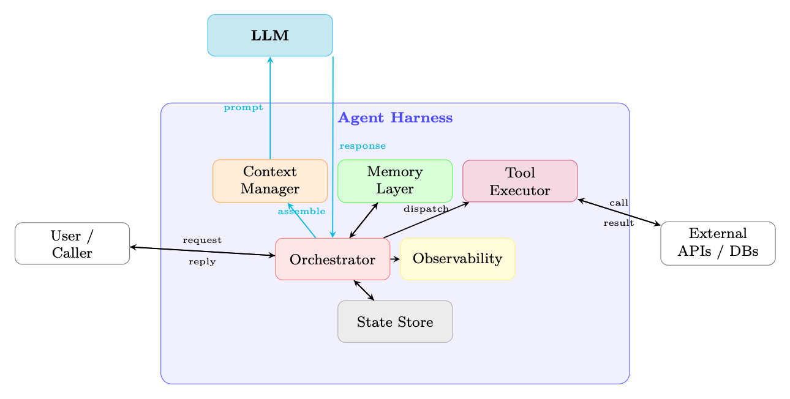
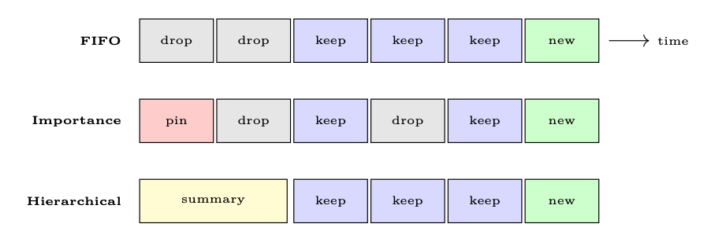
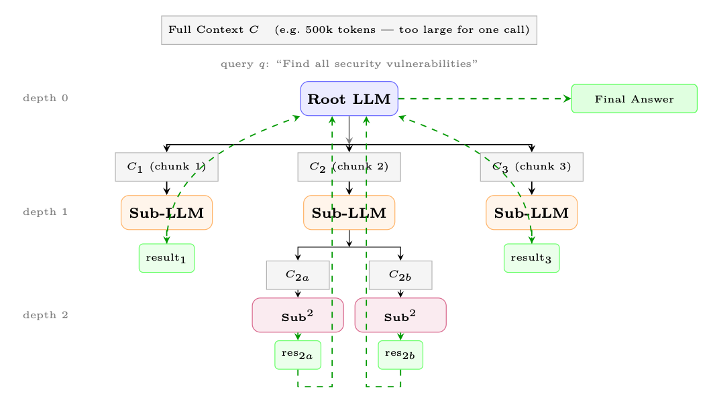
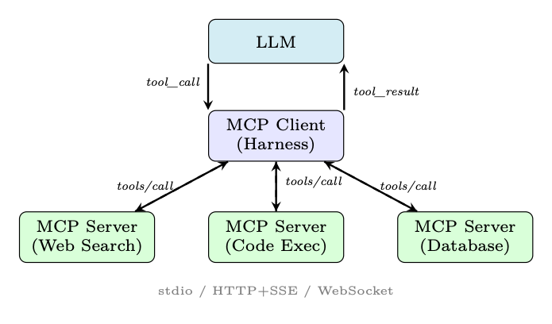
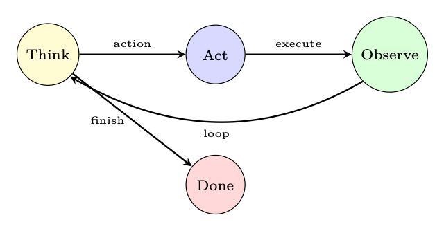
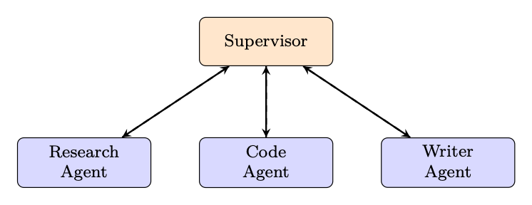
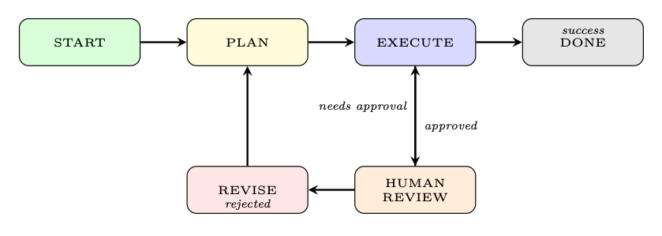

<div class="hh-guide">

<aside class="hh-part">
<p class="hh-part-title">第 V 部分 智能体 AI（Agentic AI）</p>
</aside>

现代基于 LLM 的智能体（Agent）并非孤立运行。在原始语言模型与其必须完成的现实任务之间，存在一层基础设施，负责管理记忆、路由工具调用、跟踪状态并强制实施安全约束。这层基础设施被称为 agent harness（智能体脚手架）。理解如何设计和实现一个健壮的脚手架与理解模型本身同等重要——设计糟糕的脚手架可以抵消最强大 LLM 的能力，而设计良好的脚手架则能极大放大一个中等模型所能达到的水平。

本节涵盖智能体脚手架设计的完整技术栈：上下文窗口（context window）管理、Prompt 架构、工具集成、编排模式、状态管理、错误处理与生产环境关注点。最后给出框架对比和一个完整的实现示例。

## 什么是 Agent Harness？

脚手架强制实施清晰的 关注点分离（separation of concerns）：

<ul><li>推理（Reasoning）——完全委托给 LLM；脚手架不对模型输出进行二次猜测。</li><li>执行（Execution）——脚手架负责派发工具调用、管理 I/O 并强制实施沙箱隔离（sandboxing）。</li><li>记忆（Memory）——脚手架维护短期（上下文窗口）、工作（草稿本 scratchpad）以及长期（向量库 vector store / 数据库）记忆。</li><li>通信——脚手架处理智能体、用户与外部服务之间的消息路由。</li><li>可观测性——脚手架对每一步进行埋点，用于日志、追踪与调试。</li></ul>

<figure id="ch18.f1"><figcaption><span class="hh-tag">图 18.1：</span>agent harness 的高层架构。LLM 只负责推理；所有执行、记忆、路由与可观测性都由脚手架管理。</figcaption></figure>

## Context Window 管理

上下文窗口是智能体的工作记忆。窗口中的每一个 Token 都意味着金钱与延迟的开销；每一个<em>不</em>在窗口中的 Token 对模型而言都是不可见的。管理这一有限资源是智能体设计中最具影响力的工程决策之一。

### Context 预算问题

设 <math alttext="C" display="inline"><semantics><mi>C</mi></semantics></math> 为模型支持的最大上下文长度（以 Token 计）。上下文被划分为若干相互竞争的部分：

<div class="hh-equation" id="ch18.e1"><math alttext="C\geq\underbrace{S}_{\text{system prompt}}+\underbrace{M}_{\text{memory/RAG}}+\underbrace{T}_{\text{tool defs}}+\underbrace{H}_{\text{history}}+\underbrace{R}_{\text{reserved output}}" display="block"><semantics><mrow><mi>C</mi><mo>≥</mo><mrow><munder><munder accentunder="true"><mi>S</mi><mo stretchy="true">⏟</mo></munder><mtext>system prompt</mtext></munder><mo>+</mo><munder><munder accentunder="true"><mi>M</mi><mo stretchy="true">⏟</mo></munder><mtext>memory/RAG</mtext></munder><mo>+</mo><munder><munder accentunder="true"><mi>T</mi><mo stretchy="true">⏟</mo></munder><mtext>tool defs</mtext></munder><mo>+</mo><munder><munder accentunder="true"><mi>H</mi><mo stretchy="true">⏟</mo></munder><mtext>history</mtext></munder><mo>+</mo><munder><munder accentunder="true"><mi>R</mi><mo stretchy="true">⏟</mo></munder><mtext>reserved output</mtext></munder></mrow></mrow></semantics></math><span class="hh-equation-number">(18.1)</span></div>

随着对话增长，<math alttext="H" display="inline"><semantics><mi>H</mi></semantics></math> 会无限扩张，而 <math alttext="C" display="inline"><semantics><mi>C</mi></semantics></math> 保持不变。工具输出可能非常大（例如一个网页、一次代码执行结果），导致 <math alttext="T+H" display="inline"><semantics><mrow><mi>T</mi><mo>+</mo><mi>H</mi></mrow></semantics></math> 出现突然的峰值。脚手架必须持续强制执行式 18.1。

### Context 分配策略

为每个组件分配硬性 Token 上限：


固定分配简单且可预测，但当某些组件较小时会浪费容量。

在每一轮求解一个带约束的优化问题：

<div class="hh-equation" id="ch18.e3"><math alttext="\max_{S,M,T,H,R}\;\text{Utility}(S,M,T,H,R)\quad\text{s.t.}\quad S+M+T+H+R\leq C" display="block"><semantics><mrow><mrow><mrow><munder><mi>max</mi><mrow><mi>S</mi><mo>,</mo><mi>M</mi><mo>,</mo><mi>T</mi><mo>,</mo><mi>H</mi><mo>,</mo><mi>R</mi></mrow></munder><mo lspace="0.447em">⁡</mo><mtext>Utility</mtext></mrow><mo lspace="0em" rspace="0em">​</mo><mrow><mo stretchy="false">(</mo><mi>S</mi><mo>,</mo><mi>M</mi><mo>,</mo><mi>T</mi><mo>,</mo><mi>H</mi><mo>,</mo><mi>R</mi><mo stretchy="false">)</mo></mrow></mrow><mspace width="1em"></mspace><mtext>s.t.</mtext><mspace width="1em"></mspace><mrow><mrow><mi>S</mi><mo>+</mo><mi>M</mi><mo>+</mo><mi>T</mi><mo>+</mo><mi>H</mi><mo>+</mo><mi>R</mi></mrow><mo>≤</mo><mi>C</mi></mrow></mrow></semantics></math><span class="hh-equation-number">(18.3)</span></div>

其中 Utility 是一个任务相关的评分函数（例如相关性分数的加权和）。在实践中，动态分配通常用贪心方式近似：先填充最高优先级的组件，再对低优先级的组件进行压缩或截断。

### Context 压缩

当 <math alttext="H" display="inline"><semantics><mi>H</mi></semantics></math> 超出预算时，脚手架必须在不丢失关键信息的前提下压缩历史。

用 LLM 生成的摘要 [281] 替换最旧的 <math alttext="k" display="inline"><semantics><mi>k</mi></semantics></math> 轮：

<div class="hh-equation" id="ch18.e4"><math alttext="H^{\prime}=\text{Summarize}(H_{1:k})\;\|\;H_{k+1:n}" display="block"><semantics><mrow><msup><mi>H</mi><mo>′</mo></msup><mo>=</mo><mtext>Summarize</mtext><mrow><mo stretchy="false">(</mo><msub><mi>H</mi><mrow><mn>1</mn><mo lspace="0.278em" rspace="0.278em">:</mo><mi>k</mi></mrow></msub><mo stretchy="false">)</mo></mrow><mo rspace="0.447em">∥</mo><msub><mi>H</mi><mrow><mrow><mi>k</mi><mo>+</mo><mn>1</mn></mrow><mo lspace="0.278em" rspace="0.278em">:</mo><mi>n</mi></mrow></msub></mrow></semantics></math><span class="hh-equation-number">(18.4)</span></div>

摘要通常比原文短 5–10<math alttext="\times" display="inline"><semantics><mo>×</mo></semantics></math>。可以使用一个专用的 “summarizer” 模型（更小、更便宜）来执行这一步骤。

根据每条消息与当前查询 <math alttext="q" display="inline"><semantics><mi>q</mi></semantics></math> 的相关性打分：

<div class="hh-equation" id="ch18.e5"><math alttext="\text{score}(m_{i})=\text{sim}(e(m_{i}),\,e(q))+\lambda\cdot\text{recency}(i)" display="block"><semantics><mrow><mrow><mtext>score</mtext><mo lspace="0em" rspace="0em">​</mo><mrow><mo stretchy="false">(</mo><msub><mi>m</mi><mi>i</mi></msub><mo stretchy="false">)</mo></mrow></mrow><mo>=</mo><mrow><mrow><mtext>sim</mtext><mo lspace="0em" rspace="0em">​</mo><mrow><mo stretchy="false">(</mo><mrow><mi>e</mi><mo>⁡</mo><mrow><mo stretchy="false">(</mo><msub><mi>m</mi><mi>i</mi></msub><mo stretchy="false">)</mo></mrow></mrow><mo>,</mo><mrow><mi>e</mi><mo>⁡</mo><mrow><mo stretchy="false">(</mo><mi>q</mi><mo stretchy="false">)</mo></mrow></mrow><mo stretchy="false">)</mo></mrow></mrow><mo>+</mo><mrow><mrow><mi>λ</mi><mo lspace="0.222em" rspace="0.222em">⋅</mo><mtext>recency</mtext></mrow><mo lspace="0em" rspace="0em">​</mo><mrow><mo stretchy="false">(</mo><mi>i</mi><mo stretchy="false">)</mo></mrow></mrow></mrow></mrow></semantics></math><span class="hh-equation-number">(18.5)</span></div>

其中 <math alttext="e(\cdot)" display="inline"><semantics><mrow><mi>e</mi><mo>⁡</mo><mrow><mo stretchy="false">(</mo><mo lspace="0em" rspace="0em">⋅</mo><mo stretchy="false">)</mo></mrow></mrow></semantics></math> 是嵌入（Embedding）函数，<math alttext="\text{recency}(i)=i/n" display="inline"><semantics><mrow><mrow><mtext>recency</mtext><mo lspace="0em" rspace="0em">​</mo><mrow><mo stretchy="false">(</mo><mi>i</mi><mo stretchy="false">)</mo></mrow></mrow><mo>=</mo><mrow><mi>i</mi><mo>/</mo><mi>n</mi></mrow></mrow></semantics></math>。按分数保留 top-<math alttext="k" display="inline"><semantics><mi>k</mi></semantics></math> 条消息。

为每一轮分配重要性权重 <math alttext="w_{i}" display="inline"><semantics><msub><mi>w</mi><mi>i</mi></msub></semantics></math>（例如包含工具结果或用户更正的轮次权重更高）。优先截断权重最低的轮次：

<div class="hh-equation" id="ch18.e6"><math alttext="\min_{S\subseteq[n]}\sum_{i\notin S}w_{i}\quad\text{s.t.}\quad\sum_{i\in S}|m_{i}|\leq B_{H}" display="block"><semantics><mrow><mrow><mi>min</mi><mo>⁡</mo><mrow><mmultiscripts><munder><mo movablelimits="false">∑</mo><mrow><mi>i</mi><mo>∉</mo><mi>S</mi></mrow></munder><mprescripts></mprescripts><mrow><mi>S</mi><mo>⊆</mo><mrow><mo stretchy="false">[</mo><mi>n</mi><mo stretchy="false">]</mo></mrow></mrow><mrow></mrow></mmultiscripts><mo>⁡</mo><msub><mi>w</mi><mi>i</mi></msub></mrow></mrow><mspace width="1em"></mspace><mtext>s.t.</mtext><mspace width="1em"></mspace><mrow><mrow><munder><mo movablelimits="false" rspace="0em">∑</mo><mrow><mi>i</mi><mo>∈</mo><mi>S</mi></mrow></munder><mrow><mo stretchy="false">|</mo><msub><mi>m</mi><mi>i</mi></msub><mo stretchy="false">|</mo></mrow></mrow><mo>≤</mo><msub><mi>B</mi><mi>H</mi></msub></mrow></mrow></semantics></math><span class="hh-equation-number">(18.6)</span></div>

这是 0/1 背包问题的一个变体，可以通过按 <math alttext="w_{i}/|m_{i}|" display="inline"><semantics><mrow><msub><mi>w</mi><mi>i</mi></msub><mo>/</mo><mrow><mo stretchy="false">|</mo><msub><mi>m</mi><mi>i</mi></msub><mo stretchy="false">|</mo></mrow></mrow></semantics></math> 排序进行贪心求解。

### 滑动窗口方法

<ul><li>FIFO（先进先出）：当窗口填满时丢弃最旧的消息。简单，但会丢失早期上下文（例如最初的任务描述）。</li><li>按重要性排序保留：将 system prompt 和首条用户消息固定（pinned），对其余消息应用重要性评分。</li><li>分层摘要（Hierarchical Summarization）：维护一个多层摘要金字塔——最近的轮次保留原文，较旧的轮次以段落摘要保留，最旧的轮次合并为一个抽象摘要。</li></ul>

<figure id="ch18.f2"><figcaption><span class="hh-tag">图 18.2：</span>三种滑动窗口策略。红色 = 固定保留，灰色 = 丢弃，蓝色 = 原文保留，黄色 = 摘要，绿色 = 新消息。</figcaption></figure>

### 递归 Context 分解

上述策略——摘要、选择性保留、滑动窗口——都接受一个根本约束：<em>所有内容都必须放进一个上下文窗口</em>。一种更激进的方法则完全拒绝这一约束：让模型对上下文的分区 递归调用自身（或子模型），跨多次调用聚合结果 [420]。

上下文腐烂（context rot）——即模型准确率随上下文长度增长而出现的经验性退化——意味着即便拥有大上下文窗口（128k+）的模型，在长输入上表现也会变差。通过让每次单独调用保持简短且聚焦，递归分解可以完全避免这种退化。Zhang 等人 [420] 证明，在困难的长上下文基准上，递归的 GPT-5-mini <em>优于</em>非递归的 GPT-5，同时每次查询的成本更低。

一个实用的 RLM 脚手架会让模型获得一个 REPL 环境，其中上下文作为一个变量存在。模型可以：

<ol><li>检查上下文（以编程方式：正则、切片、长度检查）。</li><li>划分它，基于结构或相关性拆成可管理的若干块。</li><li>子查询：对每个块派生递归 LLM 调用。</li><li>聚合子结果，形成最终答案。</li></ol>

这一模式可以推广到摘要之外：递归搜索（在数百万 Token 中寻找针）、递归分析（审计大型代码库）以及递归抽取（解析一个文档语料库）都遵循相同的分解—递归—聚合结构。

<figure id="ch18.f3"><figcaption><span class="hh-tag">图 18.3：</span>递归语言模型（RLM）。根模型将上下文划分为若干块，在深度 1 派生 sub-LLM 调用，这些调用可能进一步递归（深度 2）。结果向上回流（绿色虚线箭头），并聚合为最终答案。没有任何单次调用会处理完整上下文。</figcaption></figure>

### Token 计数与预算监控

Token 计数应使用模型 <em>精确</em> 的 tokenizer（例如 OpenAI 模型使用 <code>tiktoken</code>，开源模型使用 <code>transformers</code> tokenizer）。经验法则式的近似（“每 Token 4 个字符”）对代码、JSON 或非英文文本可能偏差 20–40%。

## Prompt 架构

Prompt 是脚手架与模型之间的主要接口。结构良好的 Prompt 是模块化的、可组合的，并且受版本控制。

### System Prompt 设计

生产环境的 system prompt 通常包含四个部分：

<ol><li>人格（Persona）：智能体是谁，它的名称、角色与沟通风格。</li><li>能力：智能体能做什么（可用的工具、知识截止时间、支持的语言）。</li><li>约束（Constraints）：智能体<em>不得</em>做什么（安全规则、范围限制、保密要求）。</li><li>输出格式（Output Format）：期望的响应结构（JSON schema、markdown、逐步推理）。</li></ol>

### 动态 Prompt 组装

生产级脚手架并不使用单个单体字符串，而是在运行时用 组件 组装 Prompt：

<div class="hh-equation" id="ch18.e8"><math alttext="\text{Prompt}=\text{Concat}\bigl(\text{SystemBlock},\;\text{MemoryBlock},\;\text{ToolBlock},\;\text{HistoryBlock},\;\text{QueryBlock}\bigr)" display="block"><semantics><mrow><mtext>Prompt</mtext><mo>=</mo><mrow><mtext>Concat</mtext><mo lspace="0em" rspace="0em">​</mo><mrow><mo maxsize="1.200em" minsize="1.200em">(</mo><mtext>SystemBlock</mtext><mo>,</mo><mtext>MemoryBlock</mtext><mo>,</mo><mtext>ToolBlock</mtext><mo>,</mo><mtext>HistoryBlock</mtext><mo>,</mo><mtext>QueryBlock</mtext><mo maxsize="1.200em" minsize="1.200em">)</mo></mrow></mrow></mrow></semantics></math><span class="hh-equation-number">(18.8)</span></div>

每个块都可以独立进行版本控制、测试，并且可以在不影响其他块的情况下被替换。一个 Prompt 注册表 以语义化版本（例如 <code>system/v2.3.1</code>）存储具名模板。

### Few-Shot 管理

少样本（Few-shot）示例可以提升可靠性，但会消耗 Token。脚手架应当 [224]：

<ul><li>选择相关示例：使用与当前查询的嵌入相似度。</li><li>轮换示例，避免对固定集合过拟合。</li><li>将示例纳入预算：限制在 <math alttext="M" display="inline"><semantics><mi>M</mi></semantics></math> 配额之内（式 18.2）。</li><li>缓存嵌入：缓存示例库的嵌入以避免重复计算。</li></ul>

形式化地说，少样本选择是一个带约束的优化问题——在 Token 预算约束下最大化总相关性：

<div class="hh-equation" id="ch18.e9"><math alttext="\text{examples}^{*}=\underset{E\subseteq\mathcal{E},\;|E|\leq k}{\arg\max}\sum_{e\in E}\text{sim}(e(e_{\text{input}}),\,e(q))\quad\text{s.t.}\quad\sum_{e\in E}|e|\leq B_{M}" display="block"><semantics><mrow><mrow><msup><mtext>examples</mtext><mo>∗</mo></msup><mo>=</mo><mrow><munder accentunder="true"><mrow><mi>arg</mi><mo lspace="0.167em">⁡</mo><mi>max</mi></mrow><mrow><mrow><mi mathsize="0.700em">E</mi><mo mathsize="0.700em">⊆</mo><mi mathsize="0.700em">ℰ</mi></mrow><mo mathsize="0.700em" rspace="0.447em">,</mo><mrow><mrow><mo maxsize="0.700em" minsize="0.700em" stretchy="true">|</mo><mi mathsize="0.700em">E</mi><mo maxsize="0.700em" minsize="0.700em" stretchy="true">|</mo></mrow><mo mathsize="0.700em">≤</mo><mi mathsize="0.700em">k</mi></mrow></mrow></munder><mo lspace="0em" rspace="0em">​</mo><mrow><munder><mo movablelimits="false">∑</mo><mrow><mi>e</mi><mo>∈</mo><mi>E</mi></mrow></munder><mrow><mtext>sim</mtext><mo lspace="0em" rspace="0em">​</mo><mrow><mo stretchy="false">(</mo><mrow><mi>e</mi><mo>⁡</mo><mrow><mo stretchy="false">(</mo><msub><mi>e</mi><mtext>input</mtext></msub><mo stretchy="false">)</mo></mrow></mrow><mo>,</mo><mrow><mi>e</mi><mo>⁡</mo><mrow><mo stretchy="false">(</mo><mi>q</mi><mo stretchy="false">)</mo></mrow></mrow><mo stretchy="false">)</mo></mrow></mrow></mrow></mrow></mrow><mspace width="1em"></mspace><mtext>s.t.</mtext><mspace width="1em"></mspace><mrow><mrow><munder><mo movablelimits="false" rspace="0em">∑</mo><mrow><mi>e</mi><mo>∈</mo><mi>E</mi></mrow></munder><mrow><mo stretchy="false">|</mo><mi>e</mi><mo stretchy="false">|</mo></mrow></mrow><mo>≤</mo><msub><mi>B</mi><mi>M</mi></msub></mrow></mrow></semantics></math><span class="hh-equation-number">(18.9)</span></div>

### 工具描述

工具描述是 Prompt 的一部分，直接影响工具选择的质量。一个设计良好的工具签名包含五个组成部分：

<ol><li>名称（Name）：使用动词—名词模式（<code>search_web</code>、<code>read_file</code>、<code>send_email</code>）。避免 <code>do_action</code> 这样的泛化名称或 <code>process</code> 这样有歧义的名称。</li><li>描述：用一到两句话说明该工具<em>做什么</em>、<em>何时</em>使用，以及<em>何时不</em>使用。这是模型用于选择的主要信号。</li><li>输入参数：每个参数都需要类型、人类可读的描述，以及它是必需还是可选（并给出合理的默认值）。</li><li>输出规范：说明返回格式——结构化 JSON、纯文本还是错误码——以便模型能正确解析结果。</li><li>约束（Constraints）：速率限制、最大输入规模、所需权限或副作用（例如“该工具会发送真实邮件——仅在用户确认后使用”）。</li></ol>

关于 Prompt 中工具描述的其他最佳实践：

<ul><li>具体明确：“搜索网络以获取最新信息”比“搜索”更好。</li><li>写明何时使用：“当用户询问超出你知识截止时间的事件时使用此工具。”</li><li>写明何时不使用：可减少误报。</li><li>排除无关工具：动态地只纳入与当前任务相关的工具，以节省 Token 并减少混淆。</li><li>优化描述：对描述做 A/B 测试；措辞上的微小改动就能让工具选择准确率变化 10–20%。</li></ul>

## 工具集成与执行

工具使用是现代 LLM 智能体 [315] 的一项标志性能力。脚手架负责管理工具的定义、选择、执行与输出处理。

### 工具定义 Schema

不同的供应商对工具定义使用不同的 schema：

Anthropic 使用类似的 JSON schema，但用 <code>input_schema</code> 键代替 <code>parameters</code>，并且工具通过一个顶层的 <code>tools</code> 数组传入：

MCP（第 18.4.5 模型上下文协议（MCP） 节）为跨供应商的工具发现与调用提供了标准化协议，使工具定义与任何单一 API 格式解耦。

### 工具选择与路由

模型基于对工具描述和当前任务的理解来选择工具。脚手架可以对此施加影响：

<ul><li>自动使用工具：由模型决定是否调用以及调用哪个工具。</li><li>强制使用工具：脚手架指定 <code>tool\_choice: {type: "function", function: {name: "X"}}</code> 以强制调用某个特定工具（对结构化抽取很有用）。</li><li>并行工具调用：现代 API 允许模型在单轮中请求多个工具调用，脚手架会并发执行它们。</li></ul>

当一个智能体可以访问数百甚至数千个工具时，把所有定义都放进 Prompt 既不可行（Token 成本），也会适得其反（选择混乱）。有两种关键方法可以解决这一问题：

<ul><li>检索增强的工具选择：在每一轮，利用用户查询与工具描述之间的嵌入相似度，只检索最相关的 top-<math alttext="k" display="inline"><semantics><mi>k</mi></semantics></math> 个工具。这与面向文档的 RAG（检索增强生成）相对应——只有上下文相关的工具才会被注入 Prompt。Gorilla[287] 证明，将检索与检索器感知训练（RAT）结合，能让 LLM 从数千个相互重叠的 API 中准确选择，并在测试时适应版本变化。</li><li>微调的工具选择：ToolLLM[299] 在大量工具使用轨迹语料（16,000+ 个 API）上训练模型，使用基于深度优先搜索的决策树（DFSDT）生成求解路径。由此得到的模型能学到可泛化的工具选择策略，并迁移到未见过的 API，其准确率显著优于仅依赖 Prompt 的方法。</li></ul>

在实践中，生产级脚手架会组合这些策略：一个检索层预先筛选工具集合，Prompt 中包含筛选后的工具，模型的 native 函数调用能力负责最终选择。

### 工具输出处理

原始工具输出很少能直接插入上下文：

<ol><li>解析与校验：检查输出是否符合预期的 schema。</li><li>截断大型输出：网页、代码输出和数据库结果可能非常庞大。在插入上下文之前先做摘要或分块。</li><li>错误归一化：把供应商特定的错误转换成模型可以推理的标准格式。</li><li>重试逻辑：对于瞬时失败（网络超时、速率限制），先以指数退避重试，再把失败报告给模型。</li></ol>

### 沙箱与安全

工具执行是一个主要的攻击面。脚手架必须强制实施：

<ul><li>执行隔离：在容器（Docker、gVisor）或虚拟机中运行代码类工具，默认不提供网络访问。</li><li>权限模型：为每个工具声明所需权限（只读文件系统、网络访问等），并在操作系统层面强制执行。</li><li>资源限制：CPU 时间、内存与墙钟（wall-clock）超时可防止失控的执行。</li><li>输入净化：在执行前校验并净化所有由模型生成工具参数（防止通过工具输出进行 Prompt 注入）。</li><li>审计日志：记录每一次工具调用及其参数、输出和时间戳，以便事后审查。</li></ul>

### 模型上下文协议（MCP）

模型上下文协议（MCP）[10] 是一个开放标准，用于把 LLM 应用连接到外部工具和数据源。它把工具的 <em>提供方</em> 与工具 <em>消费方</em> 解耦。我们将在第 第 22 章 模型上下文协议（Model Context Protocol, MCP） 章深入讨论 MCP；此处只总结与脚手架设计相关的关键思想。

MCP 采用客户端—服务器模型：

<ul><li>MCP 服务器：通过标准化协议暴露工具、资源与 Prompt。既可以是本地进程，也可以是远程服务。</li><li>MCP 客户端：智能体脚手架连接到一个或多个 MCP 服务器，发现可用的工具，并路由工具调用。</li><li>传输层：支持 <code>stdio</code>（本地子进程）、HTTP+SSE（远程）和 WebSocket 传输。</li></ul>

启动时，脚手架会对每个已连接的 MCP 服务器调用 <code>tools/list</code>，以发现可用的工具及其 schema。这实现了动态工具注册——新工具无需重新部署脚手架即可使用。

<ol><li>模型输出一个工具调用（例如 <code>mcp_server_name::tool_name(args)</code>）。</li><li>脚手架通过 <code>tools/call</code> 把调用路由到相应的 MCP 服务器。</li><li>MCP 服务器执行工具并返回结构化结果。</li><li>脚手架把结果作为一条 <code>tool</code> 消息插入上下文。</li></ol>

<figure id="ch18.f4"><figcaption><span class="hh-tag">图 18.4：</span>MCP 架构。脚手架充当 MCP 客户端，通过标准化传输把工具调用路由到专用的 MCP 服务器。</figcaption></figure>

## 编排模式

编排定义了智能体<em>如何</em>决定下一步做什么。不同的模式适用于不同的任务结构。

### ReAct 循环（Reason + Act）

ReAct 模式 [409] 在紧密循环中交替进行推理（“Thought”）、行动（“Act”）与观察（“Observe”）：

<div class="hh-equation" id="ch18.e10"><math alttext="\text{Thought}_{t}\to\text{Action}_{t}\to\text{Observation}_{t}\to\text{Thought}_{t+1}\to\cdots" display="block"><semantics><mrow><msub><mtext>Thought</mtext><mi>t</mi></msub><mo stretchy="false">→</mo><msub><mtext>Action</mtext><mi>t</mi></msub><mo stretchy="false">→</mo><msub><mtext>Observation</mtext><mi>t</mi></msub><mo stretchy="false">→</mo><msub><mtext>Thought</mtext><mrow><mi>t</mi><mo>+</mo><mn>1</mn></mrow></msub><mo rspace="0.1389em" stretchy="false">→</mo><mo lspace="0.1389em">⋯</mo></mrow></semantics></math><span class="hh-equation-number">(18.10)</span></div>

<figure id="ch18.f5"><figcaption><span class="hh-tag">图 18.5：</span>ReAct 循环：智能体在推理与行动之间交替，直到满足终止条件。</figcaption></figure>

<ul><li>“Thought”步骤通常是一个草稿本——一段思维链推理轨迹 [374]，<em>不</em>展示给用户。</li><li>脚手架解析模型的输出，提取动作（工具名 + 参数）。</li><li>最大迭代次数 守卫可防止无限循环。</li><li>当模型输出“Final Answer”动作或停止 token 时，循环终止。</li></ul>

### Plan-and-Execute

智能体不是一次决定一步，而是先生成一个完整的计划，然后执行每一步 [364]：

<ol><li>规划阶段：给定任务，生成结构化的计划（带依赖关系的子任务列表）。</li><li>执行阶段：执行每个子任务，可以使用另一个（更便宜的）模型。</li><li>计划修订：如果某一步失败或产生意外结果，就从当前状态重新规划。</li></ol>

<div class="hh-equation" id="ch18.e11"><math alttext="\text{Plan}=\text{Planner}(q),\quad\text{Result}=\prod_{i=1}^{|\text{Plan}|}\text{Executor}(\text{Plan}[i],\,\text{context}_{i})" display="block"><semantics><mrow><mrow><mtext>Plan</mtext><mo>=</mo><mrow><mtext>Planner</mtext><mo lspace="0em" rspace="0em">​</mo><mrow><mo stretchy="false">(</mo><mi>q</mi><mo stretchy="false">)</mo></mrow></mrow></mrow><mo rspace="1.167em">,</mo><mrow><mtext>Result</mtext><mo rspace="0.111em">=</mo><mrow><munderover><mo movablelimits="false">∏</mo><mrow><mi>i</mi><mo>=</mo><mn>1</mn></mrow><mrow><mo stretchy="false">|</mo><mtext>Plan</mtext><mo stretchy="false">|</mo></mrow></munderover><mrow><mtext>Executor</mtext><mo lspace="0em" rspace="0em">​</mo><mrow><mo stretchy="false">(</mo><mrow><mtext>Plan</mtext><mo lspace="0em" rspace="0em">​</mo><mrow><mo stretchy="false">[</mo><mi>i</mi><mo stretchy="false">]</mo></mrow></mrow><mo>,</mo><msub><mtext>context</mtext><mi>i</mi></msub><mo stretchy="false">)</mo></mrow></mrow></mrow></mrow></mrow></semantics></math><span class="hh-equation-number">(18.11)</span></div>

对于长时程任务，计划—执行更高效（更少的 LLM 调用），但对意外观察的适应性较差。

### 多 Agent 编排

复杂任务受益于多个专业化智能体协同工作。有四种典型模式：

一个中心的“主管”LLM 接收用户请求，将其分解，并把子任务路由给专家智能体。结果由主管聚合。

<figure id="ch18.f6"><figcaption><span class="hh-tag">图 18.6：</span>主管模式：一个编排器向专家智能体路由。</figcaption></figure>

智能体之间直接通信，没有中心协调者。每个智能体都可以把任意其他智能体当作工具来调用。灵活，但更难调试，且容易出现循环依赖。

一种树状结构，高层智能体委派给中层智能体，中层再委派给叶子智能体。可实现递归的任务分解。AutoGen 的嵌套对话（nested chat）等系统就采用了这种结构。

这一模式因 OpenAI 的 Swarm 库 [276] 而流行，它使用移交（handoff）：一个智能体可以把控制权连同完整的对话上下文转移给另一个智能体。关键概念：

<ul><li>智能体 拥有指令和工具。</li><li>移交 是转移控制权的特殊工具。</li><li>上下文变量 是智能体之间传递的共享状态。</li><li>活动智能体会根据任务需要动态变化。</li></ul>

### 人机协同（Human-in-the-Loop）

生产环境的智能体必须知道何时暂停并请求人类输入：

<ul><li>审批门：在执行不可撤销的操作（发送邮件、删除文件、进行购买）之前，要求显式的人工确认。</li><li>升级标准：当置信度低于阈值、任务超出既定范围，或触发安全规则时，进行升级。</li><li>反馈整合：把人工更正插入上下文，并可更新智能体的计划。</li><li>异步审批：对于长时间运行的任务，智能体可以暂停，通过邮件/Slack 通知人类，并在获批后恢复。</li></ul>

### 工作流图

对于复杂、结构化的工作流，编排逻辑被表达为一张 有向无环图（DAG）或状态机：

<ul><li>LangGraph[155]：用基于图的执行模型扩展 LangChain。节点是智能体的步骤，边是条件转移。支持循环（用于 ReAct 循环）和并行分支。</li><li>AutoGen[385]：微软用于多智能体对话图的框架。支持嵌套对话、群组对话以及人在回路模式。</li><li>状态机：显式状态（例如 <code>PLANNING</code>、<code>EXECUTING</code>、<code>WAITING_FOR_HUMAN</code>、<code>DONE</code>）以及定义的转移。比隐式的循环逻辑更容易推理和测试。</li></ul>

<div class="hh-equation" id="ch18.e13"><math alttext="G=(V,E,\sigma_{0}),\quad v\in V:\text{agent step},\quad e\in E:\text{conditional transition},\quad\sigma_{0}:\text{initial state}" display="block"><semantics><mrow><mrow><mi>G</mi><mo>=</mo><mrow><mo stretchy="false">(</mo><mi>V</mi><mo>,</mo><mi>E</mi><mo>,</mo><msub><mi>σ</mi><mn>0</mn></msub><mo stretchy="false">)</mo></mrow></mrow><mo rspace="1.167em">,</mo><mrow><mi>v</mi><mo>∈</mo><mi>V</mi><mo lspace="0.278em" rspace="0.278em">:</mo><mtext>agent step</mtext></mrow><mo rspace="1.167em">,</mo><mrow><mi>e</mi><mo>∈</mo><mi>E</mi><mo lspace="0.278em" rspace="0.278em">:</mo><mtext>conditional transition</mtext></mrow><mo rspace="1.167em">,</mo><mrow><msub><mi>σ</mi><mn>0</mn></msub><mo lspace="0.278em" rspace="0.278em">:</mo><mtext>initial state</mtext></mrow></mrow></semantics></math><span class="hh-equation-number">(18.13)</span></div>

<figure id="ch18.f7"><figcaption><span class="hh-tag">图 18.7：</span>人在回路的智能体的工作流图示例。状态和条件转移都是显式的，使控制流可审计。</figcaption></figure>

## 状态管理

智能体天生是有状态的。脚手架必须管理多个层次的状态：

### 对话状态

消息历史是主要的状态产物。每条消息都有：

<ul><li>角色（Role）：<code>system</code>、<code>user</code>、<code>assistant</code>、<code>tool</code>。</li><li>内容：文本、工具调用或工具结果。</li><li>元数据：时间戳、Token 计数、重要性分数、压缩状态。</li></ul>

### 任务状态

对于长时间运行的任务，脚手架会跟踪：

<ul><li>进度：哪些子任务已完成、进行中或待处理。</li><li>检查点：序列化的状态快照，支持在失败后恢复（resumption）。</li><li>回滚（Rollback）：在检测到错误时撤销最近 <math alttext="k" display="inline"><semantics><mi>k</mi></semantics></math> 个动作的能力。</li></ul>

### Agent 状态

智能体的内部状态包括：

<ul><li>当前计划：智能体打算执行的步骤序列。</li><li>待处理动作：已发出但尚未返回的工具调用。</li><li>信念（Beliefs）：智能体已确定的事实（例如“用户的时区是 UTC+9”）。</li></ul>

### 持久化状态

为了实现跨会话的延续性 [281, 362]：

<ul><li>用户画像：偏好、过往交互、关于用户学到的事实。</li><li>长期记忆：过往对话的向量数据库，可按语义相似度检索。</li><li>任务历史：已完成任务及其结果，用于少样本检索。</li></ul>

## 错误处理与恢复

智能体运行在充满对抗性、不可预测的环境中。健壮的错误处理不容妥协。

### 重试策略

<ul><li>指数退避：对于瞬时故障（速率限制、网络错误），在 <math alttext="\min(2^{k}\cdot t_{0}+\epsilon,t_{\max})" display="inline"><semantics><mrow><mi>min</mi><mo>⁡</mo><mrow><mo stretchy="false">(</mo><mrow><mrow><msup><mn>2</mn><mi>k</mi></msup><mo lspace="0.222em" rspace="0.222em">⋅</mo><msub><mi>t</mi><mn>0</mn></msub></mrow><mo>+</mo><mi>ϵ</mi></mrow><mo>,</mo><msub><mi>t</mi><mi>max</mi></msub><mo stretchy="false">)</mo></mrow></mrow></semantics></math> 秒后重试，其中 <math alttext="k" display="inline"><semantics><mi>k</mi></semantics></math> 是重试次数，<math alttext="\epsilon" display="inline"><semantics><mi>ϵ</mi></semantics></math> 是随机抖动。</li><li>备用模型：如果主模型不可用或返回错误，就回退到备用模型（可能能力较弱但可用）。</li><li>优雅降级：如果某个 tool 不可用，就告知模型，让它尝试在没有该 tool 的情况下完成任务。</li></ul>

第 <math alttext="k" display="inline"><semantics><mi>k</mi></semantics></math> 次重试的退避延迟为：

<div class="hh-equation" id="ch18.e14"><math alttext="t_{k}=\min\!\left(2^{k}\cdot t_{0}+\mathcal{U}(0,t_{0}),\;t_{\max}\right),\quad k=0,1,2,\ldots" display="block"><semantics><mrow><msub><mi>t</mi><mi>k</mi></msub><mo>=</mo><mpadded width="1.653em"><mi>min</mi></mpadded><mrow><mo>(</mo><msup><mn>2</mn><mi>k</mi></msup><mo lspace="0.222em" rspace="0.222em">⋅</mo><msub><mi>t</mi><mn>0</mn></msub><mo>+</mo><mi>𝒰</mi><mrow><mo stretchy="false">(</mo><mn>0</mn><mo>,</mo><msub><mi>t</mi><mn>0</mn></msub><mo stretchy="false">)</mo></mrow><mo rspace="0.447em">,</mo><msub><mi>t</mi><mi>max</mi></msub><mo>)</mo></mrow><mo rspace="1.167em">,</mo><mi>k</mi><mo>=</mo><mn>0</mn><mo>,</mo><mn>1</mn><mo>,</mo><mn>2</mn><mo>,</mo><mi mathvariant="normal">…</mi></mrow></semantics></math><span class="hh-equation-number">(18.14)</span></div>

### 循环检测

智能体可能陷入无限循环——反复用相同的参数调用同一个 tool，或者在两个状态之间来回振荡。检测与自我纠正策略 [326]：

<ul><li>最大迭代保护：对每个任务的步数设置硬性上限（例如 50 步）。</li><li>动作去重：对每个 (tool, args) 对做哈希；如果同一个调用出现 <math alttext="k" display="inline"><semantics><mi>k</mi></semantics></math> 次，就中断循环。</li><li>进展检测：如果智能体的状态在 <math alttext="k" display="inline"><semantics><mi>k</mi></semantics></math> 步内没有发生变化，就触发“卡住”处理器。</li></ul>

形式化地说，当同一个动作哈希出现在大小为 <math alttext="W" display="inline"><semantics><mi>W</mi></semantics></math> 的滑动窗口内时，就判定为检测到循环：

<div class="hh-equation" id="ch18.e15"><math alttext="\text{loop\_detected}\iff\exists\,i&lt;j\leq t:\text{hash}(\text{action}_{i})=\text{hash}(\text{action}_{j})\;\land\;j-i\leq W" display="block"><semantics><mrow><mtext>loop_detected</mtext><mo stretchy="false">⇔</mo><mrow><mrow><mo rspace="0.337em">∃</mo><mi>i</mi></mrow><mo>&lt;</mo><mi>j</mi><mo>≤</mo><mi>t</mi></mrow><mo lspace="0.278em" rspace="0.278em">:</mo><mrow><mrow><mtext>hash</mtext><mo lspace="0em" rspace="0em">​</mo><mrow><mo stretchy="false">(</mo><msub><mtext>action</mtext><mi>i</mi></msub><mo stretchy="false">)</mo></mrow></mrow><mo>=</mo><mrow><mrow><mrow><mtext>hash</mtext><mo lspace="0em" rspace="0em">​</mo><mrow><mo stretchy="false">(</mo><msub><mtext>action</mtext><mi>j</mi></msub><mo rspace="0.280em" stretchy="false">)</mo></mrow></mrow><mo rspace="0.502em">∧</mo><mi>j</mi></mrow><mo>−</mo><mi>i</mi></mrow><mo>≤</mo><mi>W</mi></mrow></mrow></semantics></math><span class="hh-equation-number">(18.15)</span></div>

### 优雅失败

当智能体无法完成任务时：

<ol><li>说明已经完成了什么（部分结果）。</li><li>说明任务为什么无法完成。</li><li>建议恢复动作（例如“请提供你的 API key 以启用网页搜索”）。</li><li>保留状态，以便任务能够被恢复。</li></ol>

### 可观测性

## 扩展与生产环境关注点

### 延迟优化

<ul><li>并行 tool 调用：使用 <code>asyncio</code> 或线程池并发执行相互独立的 tool 调用。对于 <math alttext="N" display="inline"><semantics><mi>N</mi></semantics></math> 个并行调用，可将多 tool 延迟降低 <math alttext="N\times" display="inline"><semantics><mrow><mi>N</mi><mo lspace="0.222em">×</mo></mrow></semantics></math>。</li><li>流式传输（Streaming）：使用 streaming API 在模型响应尚未完成时就开始处理。可缩短用户的首 token 时间。</li><li>Prompt 缓存：许多提供商（Anthropic、OpenAI）为重复出现的前缀（例如 system prompt + tool 定义）提供 prompt 缓存。对于被缓存的部分，可将延迟与成本降低 50–90%。</li><li>推测执行：在模型完成生成之前就开始执行最可能的下一个 tool 调用，如果预测错误则取消。</li></ul>

### 成本管理

<ul><li>Token 预算：强制执行每任务与每用户的 token 预算。接近限额时告警。</li><li>模型路由：对简单步骤（tool 选择、格式化）使用便宜而快速的模型（例如 GPT-4o-mini、Claude Haiku），只在复杂推理时使用昂贵的模型（GPT-4o、Claude Opus）[46]。</li><li>缓存：缓存具有确定性的 tool 输出（例如数据库查询、静态网页），以避免冗余的 API 调用。</li></ul>

一个包含 <math alttext="T" display="inline"><semantics><mi>T</mi></semantics></math> 个 LLM 步骤和 <math alttext="K" display="inline"><semantics><mi>K</mi></semantics></math> 次 tool 调用的智能体任务，其总成本为：

<div class="hh-equation" id="ch18.e16"><math alttext="\text{Cost}_{\text{task}}=\sum_{i=1}^{T}\underbrace{p_{\text{in}}\cdot n_{\text{in},i}+p_{\text{out}}\cdot n_{\text{out},i}}_{\text{LLM cost}}+\sum_{j=1}^{K}\underbrace{c_{j}}_{\text{tool cost}}" display="block"><semantics><mrow><msub><mtext>Cost</mtext><mtext>task</mtext></msub><mo rspace="0.111em">=</mo><mrow><mrow><munderover><mo movablelimits="false">∑</mo><mrow><mi>i</mi><mo>=</mo><mn>1</mn></mrow><mi>T</mi></munderover><munder><munder accentunder="true"><mrow><mrow><msub><mi>p</mi><mtext>in</mtext></msub><mo lspace="0.222em" rspace="0.222em">⋅</mo><msub><mi>n</mi><mrow><mtext>in</mtext><mo>,</mo><mi>i</mi></mrow></msub></mrow><mo>+</mo><mrow><msub><mi>p</mi><mtext>out</mtext></msub><mo lspace="0.222em" rspace="0.222em">⋅</mo><msub><mi>n</mi><mrow><mtext>out</mtext><mo>,</mo><mi>i</mi></mrow></msub></mrow></mrow><mo stretchy="true">⏟</mo></munder><mtext>LLM cost</mtext></munder></mrow><mo rspace="0.055em">+</mo><mrow><munderover><mo movablelimits="false">∑</mo><mrow><mi>j</mi><mo>=</mo><mn>1</mn></mrow><mi>K</mi></munderover><munder><munder accentunder="true"><msub><mi>c</mi><mi>j</mi></msub><mo stretchy="true">⏟</mo></munder><mtext>tool cost</mtext></munder></mrow></mrow></mrow></semantics></math><span class="hh-equation-number">(18.16)</span></div>

其中 <math alttext="p_{\text{in}},p_{\text{out}}" display="inline"><semantics><mrow><msub><mi>p</mi><mtext>in</mtext></msub><mo>,</mo><msub><mi>p</mi><mtext>out</mtext></msub></mrow></semantics></math> 是每 token 价格，<math alttext="n_{\text{in},i},n_{\text{out},i}" display="inline"><semantics><mrow><msub><mi>n</mi><mrow><mtext>in</mtext><mo>,</mo><mi>i</mi></mrow></msub><mo>,</mo><msub><mi>n</mi><mrow><mtext>out</mtext><mo>,</mo><mi>i</mi></mrow></msub></mrow></semantics></math> 是第 <math alttext="i" display="inline"><semantics><mi>i</mi></semantics></math> 步的输入/输出 token 数，<math alttext="c_{j}" display="inline"><semantics><msub><mi>c</mi><mi>j</mi></msub></semantics></math> 是第 <math alttext="j" display="inline"><semantics><mi>j</mi></semantics></math> 次 tool 调用的成本。

### 速率限制与排队

当并发运行大量智能体时：

<ul><li>令牌桶限流器：对共享同一个 API key 的所有智能体强制执行每分钟 token 限额。</li><li>优先级队列：高优先级任务（交互式用户请求）可以抢占低优先级任务（batch 处理）。</li><li>反压（Backpressure）：当队列已满时，用 <code>503 Service Unavailable</code> 拒绝新任务，而不是无限期地静默排队。</li></ul>

### 生产环境评测

<ul><li>A/B 测试：把一部分流量路由到新的智能体版本，并比较成功率、成本与延迟。</li><li>灰度部署：逐步增加流向新版本的流量，同时监控是否出现性能退化。</li><li>影子模式：让新智能体与生产环境中的智能体并行运行，比较输出，但只把生产环境的输出返回给用户。</li><li>LLM 作为评判者（LLM-as-judge）：使用另一个 LLM，从有用性、准确性、安全性等维度评估智能体的输出 [433]。</li></ul>

## 框架对比

<div class="hh-table" id="ch18.t1"><table class="ltx_tabular ltx_align_middle"><thead><tr><th class="ltx_align_left"><span>框架</span></th><th class="ltx_align_left"><span>灵活性</span></th><th class="ltx_align_left"><span>复杂度</span></th><th class="ltx_align_left"><span>生产就绪度</span></th><th class="ltx_align_left"><span>多智能体</span></th><th class="ltx_align_left"><span>适用场景</span></th></tr></thead><tbody><tr><td class="ltx_align_left"><span>LangChain</span></td><td class="ltx_align_left"><span>H</span></td><td class="ltx_align_left"><span>H</span></td><td class="ltx_align_left"><span>M</span></td><td class="ltx_align_left"><span>M</span></td><td class="ltx_align_left"><span>快速原型、链式流程</span></td></tr><tr><td class="ltx_align_left"><span>LangGraph</span></td><td class="ltx_align_left"><span>H</span></td><td class="ltx_align_left"><span>H</span></td><td class="ltx_align_left"><span>H</span></td><td class="ltx_align_left"><span>H</span></td><td class="ltx_align_left"><span>复杂的有状态工作流</span></td></tr><tr><td class="ltx_align_left"><span>AutoGen</span></td><td class="ltx_align_left"><span>M</span></td><td class="ltx_align_left"><span>M</span></td><td class="ltx_align_left"><span>M</span></td><td class="ltx_align_left"><span>H</span></td><td class="ltx_align_left"><span>多智能体对话</span></td></tr><tr><td class="ltx_align_left"><span>CrewAI</span></td><td class="ltx_align_left"><span>M</span></td><td class="ltx_align_left"><span>L</span></td><td class="ltx_align_left"><span>M</span></td><td class="ltx_align_left"><span>H</span></td><td class="ltx_align_left"><span>基于角色的团队</span></td></tr><tr><td class="ltx_align_left"><span>OAI Assistants</span></td><td class="ltx_align_left"><span>L</span></td><td class="ltx_align_left"><span>L</span></td><td class="ltx_align_left"><span>H</span></td><td class="ltx_align_left"><span>L</span></td><td class="ltx_align_left"><span>简单的托管智能体</span></td></tr><tr><td class="ltx_align_left"><span>OpenAI Swarm</span></td><td class="ltx_align_left"><span>M</span></td><td class="ltx_align_left"><span>L</span></td><td class="ltx_align_left"><span>L</span></td><td class="ltx_align_left"><span>H</span></td><td class="ltx_align_left"><span>交接模式</span></td></tr><tr><td class="ltx_align_left"><span>自建</span></td><td class="ltx_align_left"><span>H</span></td><td class="ltx_align_left"><span>H</span></td><td class="ltx_align_left"><span>H</span></td><td class="ltx_align_left"><span>H</span></td><td class="ltx_align_left"><span>完全可控、无厂商锁定</span></td></tr></tbody></table><p class="hh-table-caption"><span class="hh-tag">表 18.1：</span>主要智能体编排框架对比。</p></div>

图例：H = High（高），M = Medium（中），L = Low（低）。Flex. = Flexibility（灵活性），Complex. = Complexity（复杂度），Prod. = Production-readiness（生产就绪度）。

<ul><li>LangChain[41]1 提供了丰富的集成生态，但学习曲线陡峭，而且它的抽象可能掩盖实际发生的事情。</li><li>LangGraph[155]2 为 LangChain 增加了显式的基于图的控制流，使复杂的多步智能体变得容易管理得多。</li><li>AutoGen[385]3 擅长多智能体对话与嵌套聊天，对 human-in-the-loop 模式有良好的支持。</li><li>CrewAI[261]4 提供了高层次的、基于角色的抽象（“智能体团队”），易于上手，但在自定义模式方面灵活性较差。</li><li>OpenAI Assistants API5 完全托管（无需运行任何基础设施），但可定制性有限，且存在厂商锁定。</li><li>OpenAI Swarm[276]6 是一个轻量级、教学性质的框架，演示了交接（handoff）模式；尚不具备生产可用性。</li><li>自建脚手架（harness）提供最大程度的控制，对于有特定需求的生产系统是正确的选择，但需要投入大量工程资源。</li></ul>

## 实现：生产级 Agent Harness

下面是一个完整、达到生产质量的智能体脚手架实现，演示了上下文管理、tool 集成、ReAct 编排循环以及错误处理。

```
"""
production_harness.py -- A production-quality agent harness.
Demonstrates: context management, tool integration,
ReAct loop, error handling, and observability.
"""

from __future__ import annotations
import asyncio
import hashlib
import json
import logging
import time
from dataclasses import dataclass, field
from enum import Enum
from typing import Any, Callable, Optional

import tiktoken
from openai import AsyncOpenAI

# -- Logging / Observability ----------------------------------
logger = logging.getLogger("agent_harness")

# -- Data Models ----------------------------------------------

class Role(str, Enum):
    SYSTEM    = "system"
    USER      = "user"
    ASSISTANT = "assistant"
    TOOL      = "tool"

@dataclass
class Message:
    role:        Role
    content:     str
    tool_calls:  Optional[list[dict]] = None
    tool_call_id: Optional[str]       = None
    metadata:    dict                 = field(default_factory=dict)

    def to_api_dict(self) -> dict:
        d: dict = {"role": self.role.value,
                   "content": self.content or None}
        if self.tool_calls:
            d["tool_calls"] = self.tool_calls
        if self.tool_call_id:
            d["tool_call_id"] = self.tool_call_id
        return d

@dataclass
class ToolDefinition:
    name:        str
    description: str
    parameters:  dict
    handler:     Callable
    requires_approval: bool = False

    def to_api_dict(self) -> dict:
        return {
            "type": "function",
            "function": {
                "name":        self.name,
                "description": self.description,
                "parameters":  self.parameters,
            }
        }

# -- Context Manager ------------------------------------------

class ContextManager:
    """
    Manages the context window with budget enforcement,
    compression, and token counting.
    """
    BUDGET_FRACTIONS = {
        "system":   0.10,
        "memory":   0.20,
        "tools":    0.10,
        "history":  0.50,
        "reserved": 0.10,
    }

    def __init__(self, model: str, max_tokens: int):
        self.model      = model
        self.max_tokens = max_tokens
        self.enc        = tiktoken.encoding_for_model(model)
        self.history:   list[Message] = []
        self.system_msg: Optional[Message] = None

    def count_tokens(self, text: str) -> int:
        return len(self.enc.encode(text))

    def count_message_tokens(self, msg: Message) -> int:
        # OpenAI overhead: 4 tokens per message + role
        return self.count_tokens(msg.content or "") + 4

    def total_history_tokens(self) -> int:
        return sum(self.count_message_tokens(m)
                   for m in self.history)

    def history_budget(self) -> int:
        return int(self.max_tokens
                   * self.BUDGET_FRACTIONS["history"])

    def add_message(self, msg: Message) -> None:
        self.history.append(msg)
        self._enforce_budget()

    def _enforce_budget(self) -> None:
        budget = self.history_budget()
        while (self.total_history_tokens() > budget
               and len(self.history) > 2):
            # Drop oldest non-pinned message (index 1).
            # If it has tool_calls, also drop the tool results
            # that follow it to keep the conversation valid.
            dropped = self.history.pop(1)
            if dropped.tool_calls:
                while (len(self.history) > 1
                       and self.history[1].role == Role.TOOL):
                    self.history.pop(1)
        logger.debug(
            "Context: %d/%d tokens used",
            self.total_history_tokens(), budget
        )

    def preflight_check(self, tool_tokens: int) -> bool:
        """Returns True if we are within budget."""
        sys_tokens = (self.count_message_tokens(self.system_msg)
                      if self.system_msg else 0)
        total = (sys_tokens
                 + tool_tokens
                 + self.total_history_tokens())
        reserved = int(self.max_tokens
                       * self.BUDGET_FRACTIONS["reserved"])
        ok = total <= (self.max_tokens - reserved)
        if not ok:
            logger.warning(
                "Context overflow: %d > %d",
                total, self.max_tokens - reserved
            )
        return ok

    def build_messages(self) -> list[dict]:
        msgs = []
        if self.system_msg:
            msgs.append(self.system_msg.to_api_dict())
        msgs.extend(m.to_api_dict() for m in self.history)
        return msgs

# -- Tool Executor --------------------------------------------

class ToolExecutor:
    """
    Executes tool calls with sandboxing, retry logic,
    and output truncation.
    """
    MAX_OUTPUT_TOKENS = 2000
    MAX_RETRIES       = 3

    def __init__(self, tools: list[ToolDefinition],
                 approval_callback: Optional[Callable] = None,
                 encoding: str = "cl100k_base"):
        self.tools    = {t.name: t for t in tools}
        self.approval = approval_callback
        self.enc      = tiktoken.get_encoding(encoding)

    async def execute(self, tool_name: str,
                      args: dict) -> str:
        tool = self.tools.get(tool_name)
        if not tool:
            return f"Error: unknown tool '{tool_name}'"

        # Human-in-the-loop approval gate
        if tool.requires_approval and self.approval:
            approved = await self.approval(tool_name, args)
            if not approved:
                return "Action rejected by human reviewer."

        for attempt in range(self.MAX_RETRIES):
            try:
                result = await asyncio.wait_for(
                    self._call(tool, args), timeout=30.0
                )
                return self._truncate(result)
            except asyncio.TimeoutError:
                logger.warning("Tool %s timed out (attempt %d)",
                               tool_name, attempt + 1)
                if attempt == self.MAX_RETRIES - 1:
                    return f"Error: tool '{tool_name}' timed out"
                await asyncio.sleep(2 ** attempt)  # backoff
            except Exception as exc:
                logger.error("Tool %s error: %s", tool_name, exc)
                if attempt == self.MAX_RETRIES - 1:
                    return f"Error: {exc}"
                await asyncio.sleep(2 ** attempt)
        return "Error: max retries exceeded"

    async def _call(self, tool: ToolDefinition,
                    args: dict) -> str:
        if asyncio.iscoroutinefunction(tool.handler):
            result = await tool.handler(**args)
        else:
            result = await asyncio.get_running_loop().run_in_executor(
                None, lambda: tool.handler(**args)
            )
        return str(result)

    def _truncate(self, text: str) -> str:
        tokens = self.enc.encode(text)
        if len(tokens) <= self.MAX_OUTPUT_TOKENS:
            return text
        truncated = self.enc.decode(
            tokens[:self.MAX_OUTPUT_TOKENS]
        )
        return truncated + "\n[... output truncated ...]"

# -- Loop Detector --------------------------------------------

class LoopDetector:
    """Detects repeated actions within a sliding window."""
    def __init__(self, window: int = 5, max_repeats: int = 2):
        self.window      = window
        self.max_repeats = max_repeats
        self.action_hashes: list[str] = []

    def record(self, tool_name: str, args: dict) -> bool:
        """Returns True if a loop is detected."""
        h = hashlib.md5(
            f"{tool_name}:{json.dumps(args, sort_keys=True)}"
            .encode()
        ).hexdigest()
        self.action_hashes.append(h)
        recent = self.action_hashes[-self.window:]
        if recent.count(h) >= self.max_repeats:
            logger.warning("Loop detected: %s called %d times",
                           tool_name, recent.count(h))
            return True
        return False

# -- Agent Harness --------------------------------------------

class AgentHarness:
    """
    Production agent harness implementing the ReAct loop
    with full context management, tool integration,
    error handling, and observability.
    """
    MAX_ITERATIONS = 50

    def __init__(
        self,
        model:        str,
        system_prompt: str,
        tools:        list[ToolDefinition],
        max_tokens:   int = 128_000,
        approval_cb:  Optional[Callable] = None,
        client:       Optional[AsyncOpenAI] = None,
    ):
        self.model   = model
        self.client  = client or AsyncOpenAI()
        self.ctx_mgr = ContextManager(model, max_tokens)
        self.executor = ToolExecutor(tools, approval_cb)
        self.loop_det = LoopDetector()
        self.tools    = tools

        # Set system message
        sys_msg = Message(Role.SYSTEM, system_prompt)
        self.ctx_mgr.system_msg = sys_msg

    async def run(self, user_input: str) -> str:
        """
        Execute the ReAct loop for a user request.
        Returns the final response string.
        """
        run_id   = hashlib.md5(
            f"{time.time()}:{user_input}".encode()
        ).hexdigest()[:8]
        start_ts = time.monotonic()
        logger.info("[%s] Starting run: %s", run_id,
                    user_input[:80])

        # Add user message to context
        self.ctx_mgr.add_message(
            Message(Role.USER, user_input)
        )

        tool_defs = [t.to_api_dict() for t in self.tools]
        tool_tokens = sum(
            self.ctx_mgr.count_tokens(json.dumps(t))
            for t in tool_defs
        )

        for iteration in range(self.MAX_ITERATIONS):
            # Pre-flight context check
            if not self.ctx_mgr.preflight_check(tool_tokens):
                logger.error("[%s] Context overflow at iter %d",
                             run_id, iteration)
                return ("I've run out of context space. "
                        "Please start a new conversation.")

            # -- LLM Call ----------------------------------
            messages = self.ctx_mgr.build_messages()
            try:
                response = await self.client.chat.completions.create(
                    model=self.model,
                    messages=messages,
                    tools=tool_defs if self.tools else None,
                    tool_choice="auto",
                    temperature=0.0,
                )
            except Exception as exc:
                logger.error("[%s] LLM call failed: %s",
                             run_id, exc)
                return f"I encountered an error: {exc}"

            choice  = response.choices[0]
            msg     = choice.message
            finish  = choice.finish_reason

            # Store assistant message
            assistant_msg = Message(
                role=Role.ASSISTANT,
                content=msg.content or "",
                tool_calls=([tc.model_dump()
                             for tc in msg.tool_calls]
                            if msg.tool_calls else None),
            )
            self.ctx_mgr.add_message(assistant_msg)

            # -- Terminal condition -------------------------
            if finish == "stop" or not msg.tool_calls:
                elapsed = time.monotonic() - start_ts
                logger.info(
                    "[%s] Done in %d iters, %.2fs",
                    run_id, iteration + 1, elapsed
                )
                return msg.content or "Task complete."

            # -- Tool Execution -----------------------------
            tool_results = await self._execute_tool_calls(
                msg.tool_calls, run_id
            )

            # Check for loops
            for tc in msg.tool_calls:
                args = json.loads(tc.function.arguments)
                if self.loop_det.record(tc.function.name, args):
                    return ("I seem to be stuck in a loop. "
                            "Please clarify your request.")

            # Add tool results to context
            for tool_call_id, result in tool_results.items():
                self.ctx_mgr.add_message(Message(
                    role=Role.TOOL,
                    content=result,
                    tool_call_id=tool_call_id,
                ))

        # Max iterations reached
        logger.warning("[%s] Max iterations reached", run_id)
        return ("I reached the maximum number of steps "
                "without completing the task. "
                "Here is what I found so far: "
                + (msg.content or ""))

    async def _execute_tool_calls(
        self,
        tool_calls: list,
        run_id: str,
    ) -> dict[str, str]:
        """Execute tool calls in parallel."""
        tasks = {}
        for tc in tool_calls:
            name = tc.function.name
            try:
                args = json.loads(tc.function.arguments)
            except json.JSONDecodeError:
                args = {}
            logger.info("[%s] Tool call: %s(%s)",
                        run_id, name, args)
            tasks[tc.id] = self.executor.execute(name, args)

        results = await asyncio.gather(
            *tasks.values(), return_exceptions=True
        )
        output = {}
        for tool_id, result in zip(tasks.keys(), results):
            if isinstance(result, Exception):
                output[tool_id] = f"Error: {result}"
            else:
                output[tool_id] = result
        return output

# -- Example Usage --------------------------------------------

async def main():
    # Define tools
    async def search_web(query: str,
                         num_results: int = 5) -> str:
        # In production: call a real search API
        return f"[Search results for '{query}': ...]"

    async def run_python(code: str) -> str:
        # In production: execute in a sandbox container
        return f"[Execution result of code: ...]"

    tools = [
        ToolDefinition(
            name="search_web",
            description=(
                "Search the web for current information. "
                "Use when the user asks about recent events "
                "or facts beyond your knowledge cutoff."
            ),
            parameters={
                "type": "object",
                "properties": {
                    "query": {
                        "type": "string",
                        "description": "Search query"
                    },
                    "num_results": {
                        "type": "integer",
                        "default": 5
                    },
                },
                "required": ["query"],
            },
            handler=search_web,
        ),
        ToolDefinition(
            name="run_python",
            description=(
                "Execute Python code in a sandbox. "
                "Use for calculations, data processing, "
                "or generating visualizations."
            ),
            parameters={
                "type": "object",
                "properties": {
                    "code": {
                        "type": "string",
                        "description": "Python code to execute"
                    },
                },
                "required": ["code"],
            },
            handler=run_python,
            requires_approval=True,  # Requires human sign-off
        ),
    ]

    harness = AgentHarness(
        model="gpt-4o",
        system_prompt=(
            "You are a helpful research assistant. "
            "Think step by step before acting. "
            "Always cite your sources."
        ),
        tools=tools,
        max_tokens=128_000,
    )

    response = await harness.run(
        "What were the key AI research breakthroughs "
        "in the first half of 2025?"
    )
    print(response)

if __name__ == "__main__":
    asyncio.run(main())
```

<span class="hh-tag">代码清单 25：</span>生产级智能体脚手架——核心实现

### 小结

智能体脚手架是把语言模型转变为有能力、可靠的智能体的工程基础。本节的要点如下：

<ul><li>上下文是一种有限而宝贵的资源。要显式强制预算，用模型自身精确的 tokenizer 计数 token，并主动压缩历史。</li><li>Prompt 就是代码。要对它们做版本管理、测试，并从组件模块化地组装它们。</li><li>Tool 是智能体的执行器。要精确定义它们，对它们的执行做 sandbox 隔离，并防御性地处理它们的输出。</li><li>编排模式并非一刀切。探索性任务用 ReAct，结构化任务用 Plan-and-Execute，复杂的可分解任务用多智能体。</li><li>状态管理是一等关注点。要一开始就设计好状态 schema；事后改造会很痛苦。</li><li>错误不可避免；优雅恢复是一项特性。要实现重试逻辑、循环检测和有信息量的失败消息。</li><li>可观测性不是可选项。看不见的东西就无法调试。要从第一天起把一切都埋点。</li><li>生产阶段的关注点会相互叠加。延迟、成本、速率限制与评估彼此影响。要系统性地处理它们，而不是事后补救。</li></ul>

<aside class="hh-next">
<p class="hh-next-label">下一篇</p>
<p class="hh-next-title">智能体 AI 漫游指南 · 第 19 章 循环工程（Loop Engineering）</p>
<p class="hh-next-hint">在「智能体 AI 漫游指南」分类下继续阅读。</p>
</aside>

</div>
