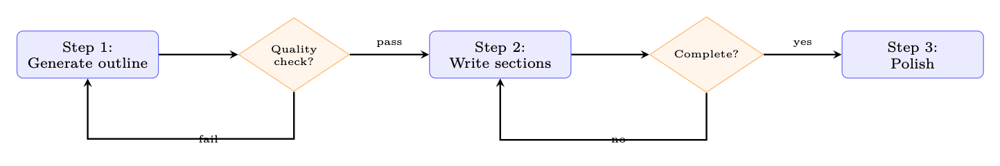
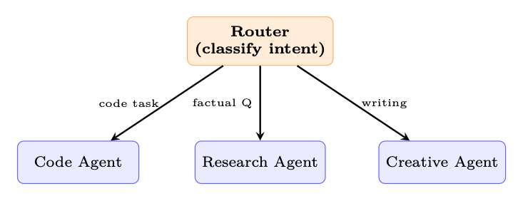
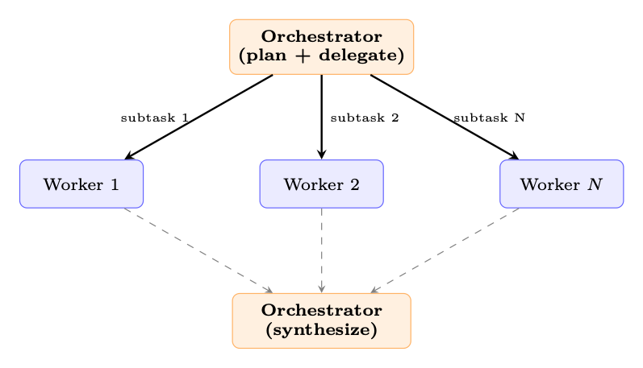
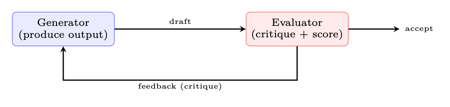

<aside class="hh-part">

Part V Agentic AI

</aside>

Building effective agents requires more than a powerful model and a set of tools. The <em>architecture</em>—how the LLM is orchestrated, how tasks are decomposed, and how control flows between components—determines whether an agent is reliable, debuggable, and cost-effective. This chapter presents the canonical design patterns that have emerged from production deployments at Anthropic, OpenAI, Google, and the open-source community.

## Workflow Patterns

These patterns—adapted from Anthropic’s taxonomy of agentic building blocks [9]—use LLMs within a <em>predefined</em> control flow. The system (not the model) decides the execution order.

### Prompt Chaining

The simplest pattern: break a complex task into a fixed sequence of LLM calls, piping the result of one call as context into the next. Validation gates between steps catch errors early before they propagate downstream.

<figure id="ch20.f1"><figcaption>Figure 20.1:Prompt chaining with quality gates. Each step is a separate LLM call. Gates can be LLM-based or programmatic.</figcaption></figure>

When to use: Tasks that are naturally sequential—content generation, data transformation, multi-stage analysis.

Key advantage: Each step can use a different prompt, model, or temperature. Intermediate results are inspectable and debuggable.

### Routing

A classifier (LLM or traditional) examines the input and dispatches to a specialized handler.

<figure id="ch20.f2"><figcaption>Figure 20.2:Routing pattern: input is classified once, then handled by a specialist.</figcaption></figure>

When to use: Distinct task types with different optimal prompts, tools, or models. Customer support triage, multi-modal input handling.

### Parallelization

Multiple LLM calls run concurrently, with a programmatic layer combining their outputs. Two sub-patterns emerge:

<ul><li>Sectioning (fan-out): Partition the input into disjoint chunks and process each independently—e.g., run security, performance, and style checks on a codebase simultaneously.</li><li>Voting (redundancy): Issue the same prompt <math alttext="N" display="inline"><semantics><mi>N</mi></semantics></math> times with different seeds or temperatures, then select the best result via majority vote [368], reward-model scoring, or LLM-as-judge.</li></ul>

### Orchestrator-Workers

Here the LLM itself decides how to split the work. An orchestrator model analyzes the task, produces a plan of subtasks, dispatches each subtask to a worker LLM (potentially with different prompts or tools), and finally merges their outputs into a coherent result. The key difference from parallelization is that the decomposition logic is model-generated, not hard-coded.

<figure id="ch20.f3"><figcaption>Figure 20.3:Orchestrator-workers: the LLM decides how to decompose the task and synthesizes worker results.</figcaption></figure>

When to use: Open-ended problems where the number and nature of subtasks cannot be enumerated at design time—e.g., “refactor this codebase” requires first understanding the dependency graph before deciding which files to modify.

### Evaluator-Optimizer

A two-model feedback loop [246]: a generator produces candidate outputs while a separate evaluator scores them against explicit criteria. If the score falls below a threshold, the evaluator’s critique is appended to the generator’s context and the cycle repeats until the quality bar is met or a retry budget is exhausted.

<figure id="ch20.f4"><figcaption>Figure 20.4:Evaluator-optimizer: iterative refinement without training.</figcaption></figure>

When to use: Tasks with clear quality criteria—code that must pass tests, translations that must preserve meaning, writing that must match a style guide.

## Autonomous Agent Patterns

These patterns give the LLM control over the execution flow itself.

### ReAct (Reason + Act)

The foundational agent pattern [409]. The LLM alternates between thinking (internal reasoning), acting (tool calls), and observing (processing results) in a loop until it produces a final answer.

### Planning Agents

The agent generates an explicit plan before executing, and can revise the plan mid-execution [364].

<table class="ltx_tabular ltx_align_middle"><thead><tr><th class="ltx_align_left">Strategy</th><th class="ltx_align_left ltx_align_top">Replanning</th><th class="ltx_align_left ltx_align_top">Characteristics</th></tr></thead><tbody><tr><th class="ltx_align_left">Plan-then-Execute</th><td class="ltx_align_left ltx_align_top">Never</td><td class="ltx_align_left ltx_align_top">Simple; fragile to unexpected results</td></tr><tr><th class="ltx_align_left">Adaptive</th><td class="ltx_align_left ltx_align_top">On failure</td><td class="ltx_align_left ltx_align_top">Replans only when a step fails; moderate cost</td></tr><tr><th class="ltx_align_left">Continuous</th><td class="ltx_align_left ltx_align_top">Every step</td><td class="ltx_align_left ltx_align_top">Full re-evaluation after each observation; expensive but robust</td></tr><tr><th class="ltx_align_left">Hierarchical</th><td class="ltx_align_left ltx_align_top">On sub-plan done</td><td class="ltx_align_left ltx_align_top">High-level plan fixed; sub-plans generated dynamically</td></tr></tbody></table>
Table 20.1:Planning strategies compared

### Reflection and Self-Critique

The agent pauses to evaluate its own trajectory and correct course:

<ol><li>Output validation: “Is this correct? Did I miss anything?”</li><li>Trajectory review: Review last <math alttext="k" display="inline"><semantics><mi>k</mi></semantics></math> steps, identify mistakes or inefficiencies.</li><li>Strategy revision: Reconsider the overall approach (“Am I solving the right problem?”).</li></ol>

### Tool-Use Patterns

How an agent invokes tools significantly affects its reliability, latency, and cost. Five canonical patterns have emerged [315]:

<table class="ltx_tabular ltx_align_middle"><thead><tr><th class="ltx_align_left">Pattern</th><th class="ltx_align_left ltx_align_top">Description</th><th class="ltx_align_left ltx_align_top">Example</th></tr></thead><tbody><tr><th class="ltx_align_left">Single-turn</th><td class="ltx_align_left ltx_align_top">One tool call per LLM response</td><td class="ltx_align_left ltx_align_top">Simple Q&amp;A with search</td></tr><tr><th class="ltx_align_left">Multi-tool</th><td class="ltx_align_left ltx_align_top">Multiple parallel tool calls in one response</td><td class="ltx_align_left ltx_align_top">Search + calculate + format</td></tr><tr><th class="ltx_align_left">Sequential</th><td class="ltx_align_left ltx_align_top">Tool output feeds into next tool call</td><td class="ltx_align_left ltx_align_top">Search <math alttext="\to" display="inline"><semantics><mo stretchy="false">→</mo></semantics></math> read <math alttext="\to" display="inline"><semantics><mo stretchy="false">→</mo></semantics></math> extract</td></tr><tr><th class="ltx_align_left">Nested</th><td class="ltx_align_left ltx_align_top">Tool call triggers another agent</td><td class="ltx_align_left ltx_align_top">Code agent calls test-runner</td></tr><tr><th class="ltx_align_left">Fallback</th><td class="ltx_align_left ltx_align_top">Preferred tool fails; try alternative</td><td class="ltx_align_left ltx_align_top">API <math alttext="\to" display="inline"><semantics><mo stretchy="false">→</mo></semantics></math> scrape <math alttext="\to" display="inline"><semantics><mo stretchy="false">→</mo></semantics></math> cache</td></tr></tbody></table>
Table 20.2:Tool invocation patterns

The simplest pattern: the model issues one tool call, receives the result, and produces a final answer. Sufficient for factual lookups, unit conversions, or single API queries. The harness makes exactly two LLM calls (one to decide on the tool, one to synthesize the result).

Modern APIs (OpenAI, Anthropic) allow the model to request multiple tool calls in a single response. The harness executes them concurrently and returns all results together. This dramatically reduces latency for tasks requiring independent information from multiple sources—e.g., fetching stock price, weather, and calendar simultaneously. The key constraint: the tools must be <em>independent</em> (no tool’s output is needed as input to another).

Each tool’s output feeds into the next tool’s input, forming a data pipeline. The model decides the next tool based on the previous result. Common in research workflows: <code>search</code><math alttext="\to" display="inline"><semantics><mo stretchy="false">→</mo></semantics></math><code>fetch_page</code><math alttext="\to" display="inline"><semantics><mo stretchy="false">→</mo></semantics></math><code>extract_data</code><math alttext="\to" display="inline"><semantics><mo stretchy="false">→</mo></semantics></math><code>analyze</code>. The harness must track the growing context and may need to summarize intermediate results to stay within budget.

A tool call invokes an entirely separate agent—with its own prompt, tools, and context. The parent agent treats the sub-agent as a black-box function. This enables specialization: a research agent delegates code execution to a coding agent, which has access to a sandbox and test runner. The Swarm pattern [276] generalizes this via handoffs between specialized agents.

The harness tries tools in priority order: if the preferred tool fails (timeout, rate limit, API error), it automatically falls back to an alternative. The model need not be aware of the fallback logic—the harness handles it transparently. Example: primary search API <math alttext="\to" display="inline"><semantics><mo stretchy="false">→</mo></semantics></math> backup search <math alttext="\to" display="inline"><semantics><mo stretchy="false">→</mo></semantics></math> cached results <math alttext="\to" display="inline"><semantics><mo stretchy="false">→</mo></semantics></math> inform model that search is unavailable.

## Design Principles

The following principles, distilled from Anthropic’s guide to building effective agents [9], apply across all patterns:

<ol><li>Keep it simple. Use the simplest architecture that works. Add complexity only when demonstrated necessary. A prompt chain that solves the problem is always preferable to a multi-agent system that might.</li><li>Transparency over cleverness. Every step should be inspectable. Avoid hidden state or implicit reasoning. When an agent fails, you need to understand <em>why</em>—opaque architectures make debugging impossible.</li><li>Provide good tools. Well-documented, well-typed tools with clear error messages are force multipliers. A tool with a vague description will be misused; a tool with a precise schema and usage guidance will be selected correctly.</li><li>Plan for failure. Every tool call can fail. Build retry logic, fallbacks, and graceful degradation at the harness level so the model does not need to reason about infrastructure failures.</li><li>Use structured outputs. Constrained generation (JSON schema, function calling) prevents parse failures. An agent that produces free-form text requiring regex parsing is fragile; one that produces validated JSON is robust.</li><li>Test with diverse inputs. Agent behaviour is more variable than single-turn chat. The same prompt can produce different tool-call sequences on different runs. Test adversarially, with edge cases, ambiguous requests, and malformed inputs.</li></ol>

## Pattern Selection Guide

Choosing the right pattern depends on three factors: (1) how predictable the task structure is, (2) how many LLM calls you can afford in latency and cost, and (3) whether quality requires iteration. Use the table below as a decision matrix—start from the top (simplest) and move down only when the simpler pattern demonstrably fails.

<table class="ltx_tabular ltx_align_middle"><thead><tr><th class="ltx_align_left">Pattern</th><th class="ltx_align_left ltx_align_top">Complexity</th><th class="ltx_align_left ltx_align_top">LLM Calls</th><th class="ltx_align_left ltx_align_top">Best For</th></tr></thead><tbody><tr><th class="ltx_align_left">Prompt chaining</th><td class="ltx_align_left ltx_align_top">Low</td><td class="ltx_align_left ltx_align_top"><math alttext="N" display="inline"><semantics><mi>N</mi></semantics></math> (fixed)</td><td class="ltx_align_left ltx_align_top">Sequential tasks, content pipelines</td></tr><tr><th class="ltx_align_left">Routing</th><td class="ltx_align_left ltx_align_top">Low</td><td class="ltx_align_left ltx_align_top">1 + 1</td><td class="ltx_align_left ltx_align_top">Multi-type inputs, triage</td></tr><tr><th class="ltx_align_left">Parallelization</th><td class="ltx_align_left ltx_align_top">Low</td><td class="ltx_align_left ltx_align_top"><math alttext="N" display="inline"><semantics><mi>N</mi></semantics></math> (parallel)</td><td class="ltx_align_left ltx_align_top">Independent subtasks, voting</td></tr><tr><th class="ltx_align_left">Orchestrator-workers</th><td class="ltx_align_left ltx_align_top">Medium</td><td class="ltx_align_left ltx_align_top">Variable</td><td class="ltx_align_left ltx_align_top">Unknown decomposition</td></tr><tr><th class="ltx_align_left">Evaluator-optimizer</th><td class="ltx_align_left ltx_align_top">Medium</td><td class="ltx_align_left ltx_align_top">2–10 (loop)</td><td class="ltx_align_left ltx_align_top">Quality-critical outputs</td></tr><tr><th class="ltx_align_left">ReAct</th><td class="ltx_align_left ltx_align_top">Medium</td><td class="ltx_align_left ltx_align_top">3–25 (loop)</td><td class="ltx_align_left ltx_align_top">General tool-use, exploration</td></tr><tr><th class="ltx_align_left">Planning agent</th><td class="ltx_align_left ltx_align_top">High</td><td class="ltx_align_left ltx_align_top">5–50+</td><td class="ltx_align_left ltx_align_top">Long-horizon, multi-step tasks</td></tr><tr><th class="ltx_align_left">Reflection</th><td class="ltx_align_left ltx_align_top">High</td><td class="ltx_align_left ltx_align_top">+50% overhead</td><td class="ltx_align_left ltx_align_top">Tasks where first attempt often fails</td></tr><tr><th class="ltx_align_left">Multi-agent</th><td class="ltx_align_left ltx_align_top">High</td><td class="ltx_align_left ltx_align_top">Many</td><td class="ltx_align_left ltx_align_top">Complex domains, specialization</td></tr></tbody></table>
Table 20.3:When to use each agent design pattern

Patterns are composable: a planning agent may use prompt chaining for individual steps, an evaluator-optimizer within its review phase, and routing to dispatch subtasks to specialists. The art is knowing when to stop adding layers.

<aside class="hh-next">

下一篇

Chapter 21 Agentic Environments and Benchmarks

在「智能体 AI 漫游指南」分类下继续阅读。

</aside>

