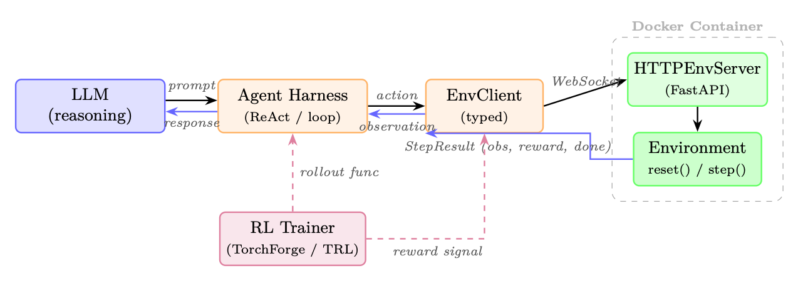
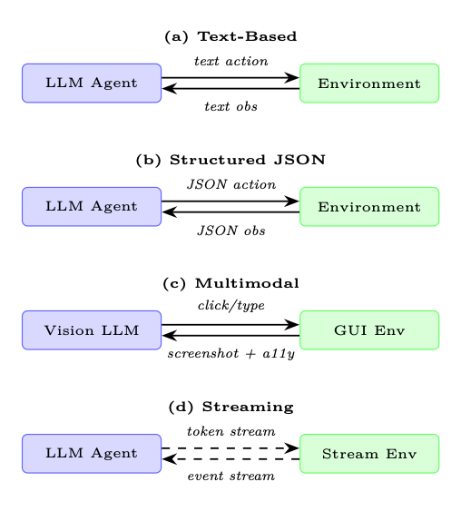

<div class="hh-guide">

<aside class="hh-part">
<p class="hh-part-title">Part V Agentic AI</p>
</aside>

## Motivation: Why Agents Need Environments

The evaluation of a conversational language model is, in principle, straightforward: present a prompt, collect a response, and score it against a reference or via human judgment. Agent evaluation is fundamentally different. An agent must <em>act</em> in a world, observe consequences, and adapt its behavior over a sequence of steps. No single response captures this; only a structured <em>environment</em> can.

Scope. We use <em>environment</em> in the reinforcement-learning sense: a world the agent interacts with for training or evaluation—not the production infrastructure (harness, orchestrator) that hosts the agent at serving time. Execution sandboxes appear here because they <em>enable</em> such environments, but the agent harness itself is covered in Chapter 18.

Three forces drive the need for dedicated agentic environments:

Real-world systems—production databases, live websites, financial APIs—cannot absorb the exploratory behavior of an agent under training. A sandboxed environment provides a faithful replica in which the agent can fail, recover, and learn without causing irreversible harm. Security isolation (e.g., Docker containers, network-restricted VMs) is not optional; it is a first-class design requirement.

Benchmarking requires that every agent faces the same task under the same conditions. Environments must be deterministic on demand, version-controlled, and distributable so that results reported in one lab can be reproduced in another. The absence of this property has historically made agent benchmarks difficult to compare.

Training an agent from scratch on hard tasks is sample-inefficient. Environments that expose a <em>difficulty curriculum</em>—gradually increasing task complexity as the agent improves—dramatically reduce the number of environment interactions required to reach a target performance level. This mirrors how humans learn: mastery of sub-skills precedes mastery of the whole.

## Environment Design Principles

A well-designed agentic environment exposes four orthogonal design axes: the <em>observation space</em>, the <em>action space</em>, the <em>reward signal</em>, and the <em>episode structure</em>. Getting each right is necessary; getting all four right simultaneously is the craft of environment engineering.

### Observation Space Design

The observation is what the agent <em>sees</em> at each step. For LLM-based agents the observation is almost always rendered as text, but the source material varies widely:

<ul><li>Pure text: terminal output, file contents, API responses, error messages. Maximally compatible with any LLM but loses spatial and visual structure.</li><li>Structured (JSON/XML): machine-readable state representations. Enables precise grounding but requires the agent to parse structure rather than read prose.</li><li>Multimodal: screenshots, accessibility trees, rendered HTML. Necessary for GUI and web tasks; requires a vision-capable model or a separate perception module.</li><li>Hybrid: a screenshot paired with an accessibility tree (used in OSWorld and VisualWebArena) gives both visual context and structured element identifiers, combining the strengths of both modalities.</li></ul>

### Action Space Design

The action space defines what the agent can <em>do</em>. For LLM agents the action is typically a text string that is parsed and executed by the environment. Common action types include:

<ul><li>Tool calls: structured invocations of external functions (search, calculator, calendar). Often formatted as JSON or XML function-call syntax.</li><li>Code execution: the agent writes code that is run in a sandbox; the stdout/stderr is returned as the next observation. This is the most expressive action type.</li><li>API interactions: HTTP requests to web services, database queries, shell commands.</li><li>GUI actions: <code>click(x,y)</code>, <code>type("text")</code>, <code>scroll(direction)</code>, <code>key("Enter")</code>. Used in computer-use environments.</li><li>Natural language: free-form text directed at another agent, a human, or a sub-task planner.</li></ul>

### Reward Signal Design

Reward design is the hardest part of environment engineering. The reward must be:

<ol><li>Aligned: high reward should correspond to genuine task completion, not to superficial proxies.</li><li>Learnable: the signal must be dense enough that the agent can make progress; pure sparse rewards on long-horizon tasks are often unlearnable without additional shaping.</li><li>Tamper-proof: the agent must not be able to achieve high reward without actually completing the task (reward hacking).</li></ol>

<div class="hh-table" id="ch21.t1"><table class="ltx_tabular ltx_align_middle"><thead><tr><th class="ltx_align_left"><span>Reward Type</span></th><th class="ltx_align_left ltx_align_top"><span class="ltx_align_top"><span><span>Pros</span></span></span></th><th class="ltx_align_left ltx_align_top"><span class="ltx_align_top"><span><span>Cons</span></span></span></th></tr></thead><tbody><tr><th class="ltx_align_left">Sparse (0/1 at end)</th><td class="ltx_align_left ltx_align_top"><span class="ltx_align_top"><span>Aligned, hard to hack</span></span></td><td class="ltx_align_left ltx_align_top"><span class="ltx_align_top"><span>Hard to learn</span></span></td></tr><tr><th class="ltx_align_left">Dense (step-level)</th><td class="ltx_align_left ltx_align_top"><span class="ltx_align_top"><span>Easy to learn</span></span></td><td class="ltx_align_left ltx_align_top"><span class="ltx_align_top"><span>Prone to shaping artifacts</span></span></td></tr><tr><th class="ltx_align_left">Intrinsic (curiosity)</th><td class="ltx_align_left ltx_align_top"><span class="ltx_align_top"><span>Drives exploration</span></span></td><td class="ltx_align_left ltx_align_top"><span class="ltx_align_top"><span>May diverge from task</span></span></td></tr><tr><th class="ltx_align_left">LLM-as-judge</th><td class="ltx_align_left ltx_align_top"><span class="ltx_align_top"><span>Flexible, nuanced</span></span></td><td class="ltx_align_left ltx_align_top"><span class="ltx_align_top"><span>Expensive, inconsistent</span></span></td></tr><tr><th class="ltx_align_left">Execution-based</th><td class="ltx_align_left ltx_align_top"><span class="ltx_align_top"><span>Ground truth</span></span></td><td class="ltx_align_left ltx_align_top"><span class="ltx_align_top"><span>Only for verifiable tasks</span></span></td></tr></tbody></table><p class="hh-table-caption"><span class="hh-tag">Table 21.1:</span>Reward signal types for agentic environments with trade-offs.</p></div>

### Episode Structure

Episodes can be structured in several ways:

<ul><li>Fixed-length: the agent takes exactly <math alttext="T" display="inline"><semantics><mi>T</mi></semantics></math> steps. Simple to implement; wastes compute on already-solved tasks.</li><li>Early termination: the episode ends when the agent signals completion or a terminal state is reached. More efficient but requires a reliable termination detector.</li><li>Open-ended: no fixed horizon; the agent operates until a resource budget (tokens, API calls, wall time) is exhausted. Closest to real deployment but hardest to evaluate.</li></ul>

Recent work challenges the assumption that episode length must be fixed before training begins:

<ul><li>Curriculum over horizon. AELA [411] starts with short episodes and gradually extends the horizon as agent competence grows, measured by policy-entropy convergence. Short early episodes expose more diverse initial states per training sample.</li><li>Truncation as RL penalty. DLER [236] shows that the simplest length control—hard truncation—works well for reasoning models when paired with batch-wise reward normalization and dynamic sampling to avoid losing the reward signal from cut-off rollouts.</li><li>Learned stopping. Rather than a fixed budget, the model itself can learn when to stop reasoning. [228] propose three strategies: stop when successive reasoning steps converge to the same answer, boost the end-of-thinking token probability, or train a lightweight classifier on hidden-state activations to predict the optimal stopping point.</li><li>Partial-rollout recycling. APRIL [251] over-provisions rollout requests and terminates once the target batch count is reached; incomplete responses are recycled as warm-start prefixes in future steps, eliminating the long-tail stall where a few slow samples block the entire batch (20–35% throughput gain). TLT [149] addresses the same bottleneck by training an adaptive draft model on-the-fly for speculative decoding of stragglers (1.7<math alttext="\times" display="inline"><semantics><mo>×</mo></semantics></math> end-to-end speedup, lossless).</li></ul>

### Difficulty Curriculum and Adaptive Environments

Static benchmarks measure a fixed snapshot of agent capability. Adaptive environments go further: they monitor agent performance online and adjust task difficulty to keep the agent in the “zone of proximal development”—hard enough to learn from, easy enough to succeed occasionally. Techniques include:

<ul><li>Procedural generation: tasks are sampled from a parameterized distribution; difficulty parameters are tuned based on recent success rate. Prioritized Level Replay [167] scores each generated level by its estimated learning potential (e.g. GAE magnitude) and replays high-value levels more often.</li><li>Self-play / adversarial environment design: PAIRED [74] trains an adversary to propose environments that maximize the <em>regret</em> between a protagonist and antagonist agent, producing a natural curriculum of increasing complexity without hand-designed difficulty schedules.</li><li>Hindsight relabeling: failed trajectories are relabeled with the goal the agent <em>did</em> achieve, providing a learning signal even from failures (Hindsight Experience Replay, HER) [8].</li><li>Difficulty-targeted data selection for LLMs: in RLVR training, not all problems provide equal signal. Recent work prioritizes moderate-difficulty questions—those the model solves roughly 30–70% of the time—which yield the highest gradient information [370]. ADCL [231] periodically re-estimates difficulty as the model improves, avoiding stale curricula.</li></ul>

## Types of Agentic Environments

### Code Execution Sandboxes

The most fundamental agentic environment for LLMs is a code execution sandbox: the agent writes code, the sandbox runs it, and the output is returned. This simple loop underlies a surprising fraction of real-world agent deployments.

Docker-based isolation is the most common approach. Each episode spawns a fresh container from a known image, executes the agent’s code inside it, and destroys the container at episode end. Network access, filesystem writes, and process spawning can all be controlled at the container level.1

E2B (Environments to Benchmarks)2 provides a managed cloud sandbox API: the agent sends code over HTTP, E2B executes it in an isolated Firecracker microVM that boots in under 200 ms, and returns stdout/stderr. E2B handles the infrastructure complexity of container lifecycle management, making it easy to integrate into agent training loops.

Modal3 offers a similar managed execution model with stronger GPU support, making it suitable for agents that need to run ML workloads as part of their task.

### Web Environments

Web environments present the agent with a browser and ask it to complete tasks on real or simulated websites.

WebArena[440] provides a self-hosted testbed of four functional web applications—an e-commerce store, a social forum, a GitLab instance, and a CMS—plus a map service, totalling 812 long-horizon tasks. The agent interacts via a browser automation API; tasks require multi-step navigation, form filling, and information retrieval. Human performance is approximately 78%; state-of-the-art LLM agents achieve around 35–45%.

VisualWebArena[188] extends WebArena with visually grounded tasks that require interpreting images on web pages. The observation is a screenshot paired with an accessibility tree; the agent must ground its actions in both modalities.

Mind2Web[73] is a large-scale dataset of 2,000 tasks across 137 real websites, collected via human demonstrations. Unlike WebArena, Mind2Web focuses on generalization to unseen websites, making it a harder out-of-distribution test.

### Computer Use Environments

Computer use environments give the agent control of a full desktop operating system, observed through screenshots and/or accessibility APIs.

OSWorld[397] tests desktop automation across three operating systems (Ubuntu, Windows, macOS) with 369 tasks spanning productivity apps (LibreOffice, VS Code, Chrome, GIMP, etc.). The agent observes screenshots and acts via <code>pyautogui</code>-style mouse and keyboard commands. The human–agent gap is stark: annotators succeed on roughly 72% of tasks while the strongest LLM agent manages only <math alttext="\sim" display="inline"><semantics><mo>∼</mo></semantics></math>18%, underscoring the difficulty of pixel-level GUI control.

WindowsAgentArena[27] focuses specifically on Windows 11, with 154 tasks across 19 applications. It emphasizes enterprise workflows: Excel formulas, PowerPoint editing, Outlook email management.

### Software Engineering Environments

Software engineering (SWE) environments ask the agent to solve real-world programming tasks: fixing bugs, implementing features, writing tests.

SWE-bench[169] draws on 2,294 real pull requests from 12 widely-used Python projects (Django, Flask, scikit-learn, among others). Each instance pairs an issue description with a held-out test suite that passes only after the correct patch is applied. The agent must understand the repository structure, locate the relevant code, implement a fix, and verify it with the test suite. The SWE-bench Verified subset (500 issues) has been human-validated for correctness and is the standard evaluation target.

SWE-agent[404] is both a benchmark environment and an agent framework. It introduces the <em>Agent-Computer Interface</em> (ACI): a set of shell commands optimized for LLM agents (e.g., <code>search_file</code>, <code>open</code>, <code>edit</code>) that reduce the action space complexity compared to raw bash.

### Scientific Research Environments

Scientific research environments push agents toward autonomous knowledge generation: reading papers, forming hypotheses, designing experiments, and interpreting results.

PaperQA2[198] is a retrieval-augmented agent that answers scientific questions by searching a corpus of PDFs, extracting relevant passages, and synthesizing an answer with citations. It serves as both a tool and a benchmark for literature-grounded reasoning.

AI Scientist[241] is an end-to-end research automation system: given a research direction, the agent generates hypotheses, writes and runs experiments, interprets results, and produces a draft paper. The environment includes a Python execution sandbox, a literature search API, and a LaTeX compiler.

MLAgentBench[151] evaluates agents on machine learning engineering tasks: improving model accuracy on a given dataset within a compute budget. The agent can read data, write training scripts, run experiments, and iterate.

### Game and Simulation Environments

Games provide rich, long-horizon environments with well-defined reward signals and no real-world consequences.

NetHack[194] is a procedurally generated roguelike with an enormous state space, requiring long-term planning, inventory management, and adaptation to unexpected events. The NetHack Learning Environment (NLE) provides a Gym-compatible interface.

Voyager / Minecraft[362] uses the Minecraft game engine as an open-ended environment. Voyager introduces a curriculum of progressively harder tasks (collect wood <math alttext="\to" display="inline"><semantics><mo stretchy="false">→</mo></semantics></math> craft tools <math alttext="\to" display="inline"><semantics><mo stretchy="false">→</mo></semantics></math> build shelter <math alttext="\to" display="inline"><semantics><mo stretchy="false">→</mo></semantics></math> explore the Nether) and a skill library that accumulates reusable code snippets across episodes.

GAIA[254] poses 466 questions that demand chained tool use—web search, code execution, file parsing—graded into three difficulty levels by the number of reasoning steps involved. The benchmark starkly exposes the gap between human capability (<math alttext="\sim" display="inline"><semantics><mo>∼</mo></semantics></math>92% accuracy) and current LLM agents (GPT-4 with plugins scored <math alttext="\sim" display="inline"><semantics><mo>∼</mo></semantics></math>15% at launch; later systems reach <math alttext="\sim" display="inline"><semantics><mo>∼</mo></semantics></math>30%).

### Multi-Agent Environments

Multi-agent environments involve two or more LLM agents interacting with each other and/or a shared world.

<ul><li>Negotiation: agents with private utility functions must reach a deal through dialogue. Classic environments include DealOrNoDeal [208] and CaSiNo [42].</li><li>Debate: two agents argue opposing positions; a judge agent (or human) evaluates the quality of arguments. Used to elicit truthful reasoning via adversarial pressure.</li><li>Collaborative task completion: agents with complementary capabilities (planner, executor, critic) must coordinate to complete a task neither could solve alone. Frameworks include AutoGen [385], CrewAI [261], and MetaGPT [142].</li><li>Competitive games: agents play zero-sum games (chess, Go, poker) where the opponent is itself an LLM agent. Self-play in these environments has produced superhuman performance in narrow domains.</li></ul>

## OpenEnv: Standardized Agentic Environment Interfaces

The proliferation of agentic environments has created a fragmentation problem: each environment exposes a different API, uses different observation formats, and requires different scaffolding. OpenEnv[88] is a recent open-source framework by Hugging Face that addresses this directly: it provides a Gymnasium-style [355] interface (<code>step()</code>, <code>reset()</code>, <code>state()</code>) for agentic execution environments, with isolated Docker-based deployments communicating over WebSocket. OpenEnv complements broader standardization efforts such as AgentGym [390], which offers a uni-format platform for LLM agents across diverse environments, and BrowserGym [202], which standardizes observation and action spaces for web-agent benchmarks. The design principles below capture the converging best practices from these projects.

<figure id="ch21.f1"><figcaption><span class="hh-tag">Figure 21.1:</span>OpenEnv architecture with an LLM agent. The agent reasons via a harness loop, which calls the typed <code>EnvClient</code>. The client communicates over WebSocket to an <code>HTTPEnvServer</code> running inside a Docker container. An RL trainer (dashed) optionally wraps the loop to collect rollouts and reward signals for policy optimization.</figcaption></figure>

### Standardized Agent–Environment Interface

OpenEnv defines a typed interface for agentic execution environments. The design mirrors Gymnasium’s simplicity but targets LLM agents interacting with tools over HTTP/WebSocket:

<ul><li><code>env.reset()</code><math alttext="\to" display="inline"><semantics><mo stretchy="false">→</mo></semantics></math><code>StepResult</code>: start a new episode; returns the initial observation.</li><li><code>env.step(action)</code><math alttext="\to" display="inline"><semantics><mo stretchy="false">→</mo></semantics></math><code>StepResult(observation, reward, done)</code>: execute one action and return the resulting observation, scalar reward, and termination flag.</li><li><code>env.state()</code><math alttext="\to" display="inline"><semantics><mo stretchy="false">→</mo></semantics></math> current environment state (episode ID, step count, environment-specific fields).</li><li><code>env.close()</code>: release resources (stop containers, close connections).</li></ul>

Actions and observations are strongly typed Python dataclasses, specific to each environment. For example, a coding environment defines <code>CodeAction(code=...)</code> and returns an observation with <code>stdout</code>, <code>stderr</code>, and <code>exit_code</code>; a game environment defines its own action/observation types. This per-environment typing gives agents structured, predictable interfaces while keeping the three core methods (<code>reset</code>, <code>step</code>, <code>state</code>) universal.

Each environment is a Python class inheriting from <code>Environment</code> (implementing <code>reset()</code> and <code>step()</code>). It is served inside a Docker container via <code>HTTPEnvServer</code>, which exposes a FastAPI/WebSocket endpoint. Clients use environment-specific subclasses of <code>EnvClient</code> that handle serialization and connection lifecycle. Containers can be launched locally via <code>from_docker_image()</code> or connected to remotely via a base URL:

```python
from coding_env import CodeAction, CodingEnv

# Option 1: Launch a local Docker container
client = CodingEnv.from_docker_image("coding-env:latest")

# Option 2: Connect to a remote deployment
# client = CodingEnv(base_url="http://localhost:8000")

# Interact with the environment
result = client.reset()
print(result.observation.stdout)
print(result.observation.stderr)
print(result.observation.exit_code)

result = client.step(CodeAction(code="print(2 + 2)"))
print(result.observation.stdout)       # "4\n"
print(result.observation.exit_code)    # 0
print(result.reward, result.done)

# Check state
state = client.state()
print(state.episode_id, state.step_count)

client.close()
```

Creating a new environment requires only implementing the <code>Environment</code> base class:

```python
from openenv.core.env_server import Environment, create_app
from dataclasses import dataclass

@dataclass
class MyAction:
    text: str

@dataclass
class MyObservation:
    response: str
    reward: float = 0.0
    done: bool = False

class MyEnvironment(Environment):
    def reset(self) -> MyObservation:
        return MyObservation(response="Ready")

    def step(self, action: MyAction) -> MyObservation:
        return MyObservation(response=f"Echo: {action.text}",
                             reward=1.0, done=False)

app = create_app(MyEnvironment(), MyAction, MyObservation)
# Run: uvicorn module:app --host 0.0.0.0 --port 8000
```

RFC 0054 introduces a harness-facing layer where RL training frameworks interact with environments through MCP-style tool calls. A <code>build_harness_rollout_func()</code> helper produces a TRL-compatible rollout function, bridging OpenEnv directly into existing training pipelines like TorchForge [348].

OpenEnv is openly governed by a technical committee including Meta-PyTorch, NVIDIA, Unsloth, Modal, Prime Intellect, Reflection, and Hugging Face—ensuring that the standard evolves with broad industry input rather than a single vendor’s agenda.

### Environment Registries and Discovery

OpenEnv environments can be deployed as Hugging Face Spaces or local Docker images, enabling discovery and use without manual installation. The same client interface works regardless of deployment target:

```python
from echo_env import EchoAction, EchoEnv

# Connect to a remote HF Space deployment
client = EchoEnv(base_url="https://openenv-echo-env.hf.space")
result = client.reset()
print(result.observation.echoed_message)  # "Echo environment ready!"

result = client.step(EchoAction(message="Hello!"))
print(result.observation.echoed_message)  # "Hello!"
print(result.reward)
client.close()
```

The OpenEnv ecosystem already spans 70+ environments (OpenSpiel games, Atari, BrowserGym, coding sandboxes, financial RL, traffic simulation, and more). RFC 0025 proposes a formal <em>tool discovery</em> protocol so agents can query which actions an unfamiliar environment accepts at runtime.

### Compositional Environments

Real agent deployments rarely use a single tool. OpenEnv supports rich environments that expose multiple capabilities through typed actions. For example, a coding environment supports code execution, file I/O, and shell commands within a single sandboxed session:

```python
from coding_env import CodeAction, CodingEnv

client = CodingEnv.from_docker_image("coding-env:latest")
result = client.reset()

# Execute code
result = client.step(CodeAction(code="x = 42\nprint(x)"))
print(result.observation.stdout)   # "42"
print(result.observation.exit_code)  # 0

# State persists across steps within an episode
result = client.step(CodeAction(code="print(x + 1)"))
print(result.observation.stdout)   # "43"

state = client.state()
print(state.step_count)  # 2

client.close()
```

For agents requiring diverse tool access (code + web + files), OpenEnv’s RFC 0036 proposes MCP integration, allowing any MCP-compatible tool server to be wrapped as an OpenEnv environment. Additionally, the <code>openenv</code> CLI can scaffold, build, and deploy new environments to Hugging Face Spaces with a single command.

### Environment Versioning and Reproducibility

Benchmark integrity requires that environment behavior is frozen at evaluation time. Best practices include:

<ul><li>Semantic versioning: <code>WebArena-v1.2.0</code> guarantees backward compatibility within a minor version.</li><li>Docker image pinning: the environment runtime is packaged as a Docker image with a content-addressed hash.</li><li>Seed-based determinism: all stochastic elements (procedural generation, network responses) are seeded and logged so that any trajectory can be exactly replayed.</li><li>Leaderboard snapshots: public leaderboards record the environment version alongside the score, preventing silent benchmark drift.</li></ul>

## Building Custom Environments

### Gymnasium-Style API for LLM Agents

The Gymnasium API [355]7 (successor to OpenAI Gym) is the de facto standard for RL environments. Adapting it for LLM agents requires two modifications: (1) observations and actions are strings (or dicts containing strings) rather than numeric arrays, and (2) the <code>step</code> method must handle asynchronous tool execution.

### Reward Function Engineering

Reward functions for LLM agent environments are typically <em>execution-based</em>: the environment runs a verifier after each episode and returns 1 if the task is solved, 0 otherwise. For tasks without a clear verifier, options include:

<ul><li>LLM-as-judge: a separate LLM scores the agent’s final state against the task description.</li><li>Rubric-based scoring: a structured rubric decomposes the task into sub-criteria, each scored independently.</li><li>Human annotation: a human evaluator scores a random sample of trajectories; the scores are used to calibrate an automated proxy.</li></ul>

### State Management and Checkpointing

Long-horizon tasks may require hours of wall time. Environments should support:

<ul><li>State serialization: the full environment state (filesystem, browser cookies, database contents) can be serialized to disk and restored.</li><li>Mid-episode checkpointing: the agent can save a checkpoint at any step and resume from it, enabling tree-search-style exploration.</li><li>Trajectory logging: every observation, action, and reward is logged to a structured file for offline analysis and reward model training.</li></ul>

### Parallelization for Training Data Collection

Training LLM agents via RL requires millions of environment interactions. Parallelization strategies include:

<ul><li>Process-level parallelism: spawn <math alttext="N" display="inline"><semantics><mi>N</mi></semantics></math> independent environment processes; collect trajectories in parallel.</li><li>Async rollout workers: use an async event loop (e.g., <code>asyncio</code>) to overlap LLM inference latency with environment execution.</li><li>Vectorized environments: batch multiple environments into a single <code>step</code> call, amortizing Python overhead.</li><li>Cloud-native scaling: use a job scheduler (Ray, SLURM) to distribute environment workers across a cluster, with a central replay buffer aggregating trajectories.</li></ul>

## Environment–Agent Interface Patterns

Figure 图 21.2 illustrates the four main interface patterns used in practice.

<figure id="ch21.f2"><figcaption><span class="hh-tag">Figure 21.2:</span>Four agent–environment interface patterns. (a) Text-based is the most common for LLMs. (b) Structured JSON enables precise parsing. (c) Multimodal combines screenshots with accessibility trees for GUI tasks. (d) Streaming supports real-time interaction without discrete turn boundaries.</figcaption></figure>

The agent receives a string observation and produces a string action. The environment parses the action (e.g., extracts a tool call from a <code>&lt;tool&gt;...&lt;/tool&gt;</code> block) and returns the result as a string. This is the most compatible pattern: any LLM can participate without special architecture.

Observations and actions are JSON objects with a defined schema. This enables strict validation (reject malformed actions before execution), structured logging, and easier programmatic analysis of trajectories. The tradeoff is that the agent must reliably produce valid JSON, which requires either fine-tuning or constrained decoding.

Used in computer-use and web environments. The observation is a tuple <code>(screenshot: PIL.Image, a11y_tree: dict)</code>. The screenshot provides visual context; the accessibility tree provides element identifiers that can be used in actions without pixel-level coordinate specification. This hybrid approach is more robust than pure screenshot-based control.

Most current environments use a turn-based model: the agent produces a complete action, the environment executes it, and the next observation is returned. Streaming environments allow the agent to receive partial observations as they arrive (e.g., the output of a long-running command) and to interrupt or redirect execution mid-stream. This is closer to how humans interact with computers but requires more complex agent architectures.

## Evaluation Harness Design

An evaluation harness is the infrastructure that runs an agent across a benchmark suite, collects results, and produces summary statistics. Good harness design is as important as good environment design.

### Deterministic vs. Stochastic Environments

<ul><li>Deterministic environments produce the same observation sequence for the same action sequence. They are easy to debug and reproduce but may not reflect real-world variability.</li><li>Stochastic environments introduce randomness (procedural generation, network latency, user simulation). They require multiple runs per task to estimate mean performance and confidence intervals.</li></ul>

### Held-Out Test Environments

Benchmark integrity requires a strict train/test split at the <em>environment</em> level, not just the task level. An agent that has been trained on WebArena tasks should be evaluated on a held-out set of tasks that were not used during training. Ideally, the held-out set covers different websites, task types, and difficulty levels than the training set.

### Cross-Environment Generalization

The ultimate test of an agent is whether skills learned in one environment transfer to another. Cross-environment evaluation protocols measure:

<ul><li>Zero-shot transfer: train on environment A, test on environment B with no fine-tuning.</li><li>Few-shot adaptation: provide <math alttext="k" display="inline"><semantics><mi>k</mi></semantics></math> demonstrations from environment B before evaluation.</li><li>Continual learning: train sequentially on environments A, B, C; measure performance on all three after training on C.</li></ul>

### Human Baseline Collection

Every benchmark should include human performance as a reference point. Human baselines serve three purposes:

<ol><li>They establish an upper bound on task difficulty.</li><li>They reveal whether a task is solvable at all (some benchmark tasks turn out to be ambiguous or impossible).</li><li>They provide a calibration point for interpreting agent scores (“the agent achieves 40% of human performance”).</li></ol>

Human baselines should be collected from workers with domain expertise (e.g., software engineers for SWE-bench, not crowdworkers) and should include time-on-task measurements to enable efficiency comparisons.

## Code Example: Minimal Custom LLM Agent Environment

```
"""
minimal_env.py  --  A minimal file-editing environment for LLM agents.

The agent receives a Python file with a bug and a failing test.
It must edit the file until the test passes.
Reward: 1.0 if all tests pass, 0.0 otherwise.
"""

from __future__ import annotations
import subprocess, shutil, tempfile, textwrap
from pathlib import Path
from dataclasses import dataclass, field
from typing import Any

# ---------------------------------------------------------------------------
# Data structures
# ---------------------------------------------------------------------------

@dataclass
class StepResult:
    observation: str          # Text fed to the LLM
    reward: float             # 0.0 or 1.0
    terminated: bool          # Episode over (task solved or max steps)
    truncated: bool           # Episode cut short (budget exceeded)
    info: dict[str, Any] = field(default_factory=dict)

# ---------------------------------------------------------------------------
# Environment
# ---------------------------------------------------------------------------

class FileEditEnv:
    """
    A Gymnasium-style environment for LLM-based code repair.

    Observation space : str  (file contents + test output)
    Action space      : str  (one of: view, edit, run_tests, submit)
    Reward            : 1.0 on passing all tests, 0.0 otherwise
    """

    MAX_STEPS = 20          # Hard episode limit
    TIMEOUT   = 30          # Seconds per test run

    def __init__(self, buggy_code: str, test_code: str,
                 task_description: str):
        self.buggy_code       = buggy_code
        self.test_code        = test_code
        self.task_description = task_description
        self._workdir: Path | None = None
        self._step_count = 0

    # ------------------------------------------------------------------
    # Core API
    # ------------------------------------------------------------------

    def reset(self, seed: int | None = None) -> tuple[str, dict]:
        """Initialise a fresh episode; return (observation, info)."""
        if self._workdir and self._workdir.exists():
            shutil.rmtree(self._workdir)

        self._workdir    = Path(tempfile.mkdtemp(prefix="fileenv_"))
        self._step_count = 0

        # Write initial files
        (self._workdir / "solution.py").write_text(self.buggy_code)
        (self._workdir / "test_solution.py").write_text(self.test_code)

        obs = self._build_observation(
            action_taken="[Episode start]",
            test_output=self._run_tests()
        )
        return obs, {"step": 0}

    def step(self, action: str) -> StepResult:
        """Execute one agent action; return StepResult."""
        self._step_count += 1
        action = action.strip()

        # --- Parse and dispatch action ---
        if action.startswith("view"):
            result_text = self._action_view()
        elif action.startswith("edit"):
            result_text = self._action_edit(action)
        elif action.startswith("run_tests"):
            result_text = self._run_tests()
        elif action.startswith("submit"):
            result_text = self._run_tests()
        else:
            result_text = (
                f"Unknown action: {action!r}\n"
                "Valid actions: view | edit <new_content> | "
                "run_tests | submit"
            )

        test_output = self._run_tests()
        passed      = "passed" in test_output and "failed" not in test_output
        reward      = 1.0 if passed else 0.0
        terminated  = passed or action.startswith("submit")
        truncated   = self._step_count >= self.MAX_STEPS

        obs = self._build_observation(action, test_output)
        return StepResult(obs, reward, terminated, truncated,
                          {"step": self._step_count,
                           "passed": passed})

    def render(self) -> str:
        """Return a human-readable summary of the current state."""
        if self._workdir is None:
            return "[Environment not initialised]"
        code = (self._workdir / "solution.py").read_text()
        return f"=== solution.py ===\n{code}\n"

    def close(self) -> None:
        """Release resources."""
        if self._workdir and self._workdir.exists():
            shutil.rmtree(self._workdir)
            self._workdir = None

    # ------------------------------------------------------------------
    # Private helpers
    # ------------------------------------------------------------------

    def _action_view(self) -> str:
        code = (self._workdir / "solution.py").read_text()
        return f"Current solution.py:\n```python\n{code}\n```"

    def _action_edit(self, action: str) -> str:
        # Expect: edit\n```python\n<code>\n```
        try:
            new_code = action.split("```python")[1].split("```")[0]
            (self._workdir / "solution.py").write_text(new_code)
            return "File updated successfully."
        except IndexError:
            return "Edit failed: wrap new code in ```python ... ```"

    def _run_tests(self) -> str:
        result = subprocess.run(
            ["python", "-m", "pytest", "test_solution.py",
             "-v", "--tb=short", "--no-header"],
            cwd=self._workdir,
            capture_output=True, text=True,
            timeout=self.TIMEOUT
        )
        return result.stdout + result.stderr

    def _build_observation(self, action_taken: str,
                           test_output: str) -> str:
        code = (self._workdir / "solution.py").read_text()
        return textwrap.dedent(f"""
            TASK: {self.task_description}
            STEP: {self._step_count}/{self.MAX_STEPS}

            --- Last action ---
            {action_taken}

            --- Current solution.py ---
            {code}

            --- Test output ---
            {test_output}

            --- Available actions ---
            view                          # show current file
            edit\n```python\n<code>\n```  # replace file contents
            run_tests                     # run pytest
            submit                        # finalise and end episode
        """).strip()

# ---------------------------------------------------------------------------
# Example usage
# ---------------------------------------------------------------------------

if __name__ == "__main__":
    BUGGY = "def add(a, b):\n    return a - b\n"   # bug: minus not plus
    TESTS = (
        "from solution import add\n"
        "def test_add(): assert add(2, 3) == 5\n"
    )

    env = FileEditEnv(BUGGY, TESTS, "Fix the add() function.")
    obs, _ = env.reset(seed=0)
    print(obs)

    # Simulate one correct edit
    fix = "edit\n```python\ndef add(a, b):\n    return a + b\n```"
    result = env.step(fix)
    print(f"\nReward: {result.reward}  |  Terminated: {result.terminated}")
    env.close()
```

<span class="hh-tag">Listing 26:</span>Minimal LLM agent environment following the Gymnasium API.

## Comparison of Major Agentic Environments

Table 表 21.2 summarizes the key properties of the major agentic environments discussed in this section.

<div class="hh-table" id="ch21.t2"><table class="ltx_tabular ltx_align_middle"><thead><tr><th class="ltx_align_left"><span>Environment</span></th><th class="ltx_align_left ltx_align_top"><span class="ltx_align_top"><span><span>Obs. Type</span></span></span></th><th class="ltx_align_left ltx_align_top"><span class="ltx_align_top"><span><span>Action Space</span></span></span></th><th class="ltx_align_left ltx_align_top"><span class="ltx_align_top"><span><span>Domain</span></span></span></th><th class="ltx_align_left ltx_align_top"><span class="ltx_align_top"><span><span># Tasks</span></span></span></th><th class="ltx_align_left ltx_align_top"><span class="ltx_align_top"><span><span>Human</span></span></span></th><th class="ltx_align_left ltx_align_top"><span class="ltx_align_top"><span><span>SoTA LLM</span></span></span></th></tr></thead><tbody><tr><th class="ltx_align_left">WebArena</th><td class="ltx_align_left ltx_align_top"><span class="ltx_align_top"><span>Text + DOM</span></span></td><td class="ltx_align_left ltx_align_top"><span class="ltx_align_top"><span>Browser API</span></span></td><td class="ltx_align_left ltx_align_top"><span class="ltx_align_top"><span>Web navigation</span></span></td><td class="ltx_align_left ltx_align_top"><span class="ltx_align_top"><span>812</span></span></td><td class="ltx_align_left ltx_align_top"><span class="ltx_align_top"><span>78%</span></span></td><td class="ltx_align_left ltx_align_top"><span class="ltx_align_top"><span><math alttext="\sim" display="inline"><semantics><mo>∼</mo><span></span></semantics></math>45%</span></span></td></tr><tr><th class="ltx_align_left">VisualWebArena</th><td class="ltx_align_left ltx_align_top"><span class="ltx_align_top"><span>Screenshot + DOM</span></span></td><td class="ltx_align_left ltx_align_top"><span class="ltx_align_top"><span>Browser API</span></span></td><td class="ltx_align_left ltx_align_top"><span class="ltx_align_top"><span>Visual web</span></span></td><td class="ltx_align_left ltx_align_top"><span class="ltx_align_top"><span>910</span></span></td><td class="ltx_align_left ltx_align_top"><span class="ltx_align_top"><span>88%</span></span></td><td class="ltx_align_left ltx_align_top"><span class="ltx_align_top"><span><math alttext="\sim" display="inline"><semantics><mo>∼</mo><span></span></semantics></math>35%</span></span></td></tr><tr><th class="ltx_align_left">Mind2Web</th><td class="ltx_align_left ltx_align_top"><span class="ltx_align_top"><span>Screenshot + DOM</span></span></td><td class="ltx_align_left ltx_align_top"><span class="ltx_align_top"><span>Browser API</span></span></td><td class="ltx_align_left ltx_align_top"><span class="ltx_align_top"><span>Real websites</span></span></td><td class="ltx_align_left ltx_align_top"><span class="ltx_align_top"><span>2,000</span></span></td><td class="ltx_align_left ltx_align_top"><span class="ltx_align_top"><span>—</span></span></td><td class="ltx_align_left ltx_align_top"><span class="ltx_align_top"><span><math alttext="\sim" display="inline"><semantics><mo>∼</mo><span></span></semantics></math>30%</span></span></td></tr><tr><th class="ltx_align_left">OSWorld</th><td class="ltx_align_left ltx_align_top"><span class="ltx_align_top"><span>Screenshot</span></span></td><td class="ltx_align_left ltx_align_top"><span class="ltx_align_top"><span>Mouse + keyboard</span></span></td><td class="ltx_align_left ltx_align_top"><span class="ltx_align_top"><span>Desktop OS</span></span></td><td class="ltx_align_left ltx_align_top"><span class="ltx_align_top"><span>369</span></span></td><td class="ltx_align_left ltx_align_top"><span class="ltx_align_top"><span>72%</span></span></td><td class="ltx_align_left ltx_align_top"><span class="ltx_align_top"><span><math alttext="\sim" display="inline"><semantics><mo>∼</mo><span></span></semantics></math>18%</span></span></td></tr><tr><th class="ltx_align_left">WindowsAgentArena</th><td class="ltx_align_left ltx_align_top"><span class="ltx_align_top"><span>Screenshot</span></span></td><td class="ltx_align_left ltx_align_top"><span class="ltx_align_top"><span>Mouse + keyboard</span></span></td><td class="ltx_align_left ltx_align_top"><span class="ltx_align_top"><span>Windows apps</span></span></td><td class="ltx_align_left ltx_align_top"><span class="ltx_align_top"><span>154</span></span></td><td class="ltx_align_left ltx_align_top"><span class="ltx_align_top"><span>75%</span></span></td><td class="ltx_align_left ltx_align_top"><span class="ltx_align_top"><span><math alttext="\sim" display="inline"><semantics><mo>∼</mo><span></span></semantics></math>20%</span></span></td></tr><tr><th class="ltx_align_left">SWE-bench Verified</th><td class="ltx_align_left ltx_align_top"><span class="ltx_align_top"><span>Text (repo)</span></span></td><td class="ltx_align_left ltx_align_top"><span class="ltx_align_top"><span>Shell + editor</span></span></td><td class="ltx_align_left ltx_align_top"><span class="ltx_align_top"><span>Code repair</span></span></td><td class="ltx_align_left ltx_align_top"><span class="ltx_align_top"><span>500</span></span></td><td class="ltx_align_left ltx_align_top"><span class="ltx_align_top"><span>100%</span></span></td><td class="ltx_align_left ltx_align_top"><span class="ltx_align_top"><span><math alttext="\sim" display="inline"><semantics><mo>∼</mo><span></span></semantics></math>50%</span></span></td></tr><tr><th class="ltx_align_left">GAIA (Level 1)</th><td class="ltx_align_left ltx_align_top"><span class="ltx_align_top"><span>Text + files</span></span></td><td class="ltx_align_left ltx_align_top"><span class="ltx_align_top"><span>Tool calls</span></span></td><td class="ltx_align_left ltx_align_top"><span class="ltx_align_top"><span>General QA</span></span></td><td class="ltx_align_left ltx_align_top"><span class="ltx_align_top"><span>165</span></span></td><td class="ltx_align_left ltx_align_top"><span class="ltx_align_top"><span>92%</span></span></td><td class="ltx_align_left ltx_align_top"><span class="ltx_align_top"><span><math alttext="\sim" display="inline"><semantics><mo>∼</mo><span></span></semantics></math>55%</span></span></td></tr><tr><th class="ltx_align_left">GAIA (Level 3)</th><td class="ltx_align_left ltx_align_top"><span class="ltx_align_top"><span>Text + files</span></span></td><td class="ltx_align_left ltx_align_top"><span class="ltx_align_top"><span>Tool calls</span></span></td><td class="ltx_align_left ltx_align_top"><span class="ltx_align_top"><span>Hard QA</span></span></td><td class="ltx_align_left ltx_align_top"><span class="ltx_align_top"><span>42</span></span></td><td class="ltx_align_left ltx_align_top"><span class="ltx_align_top"><span>92%</span></span></td><td class="ltx_align_left ltx_align_top"><span class="ltx_align_top"><span><math alttext="\sim" display="inline"><semantics><mo>∼</mo><span></span></semantics></math>10%</span></span></td></tr><tr><th class="ltx_align_left">NetHack (NLE)</th><td class="ltx_align_left ltx_align_top"><span class="ltx_align_top"><span>Text + glyphs</span></span></td><td class="ltx_align_left ltx_align_top"><span class="ltx_align_top"><span>Discrete actions</span></span></td><td class="ltx_align_left ltx_align_top"><span class="ltx_align_top"><span>Roguelike game</span></span></td><td class="ltx_align_left ltx_align_top"><span class="ltx_align_top"><span>—</span></span></td><td class="ltx_align_left ltx_align_top"><span class="ltx_align_top"><span><math alttext="&gt;" display="inline"><semantics><mo>&gt;</mo><span></span></semantics></math>10k score</span></span></td><td class="ltx_align_left ltx_align_top"><span class="ltx_align_top"><span><math alttext="\sim" display="inline"><semantics><mo>∼</mo><span></span></semantics></math>5k score</span></span></td></tr><tr><th class="ltx_align_left">Voyager (Minecraft)</th><td class="ltx_align_left ltx_align_top"><span class="ltx_align_top"><span>Text + code</span></span></td><td class="ltx_align_left ltx_align_top"><span class="ltx_align_top"><span>Code execution</span></span></td><td class="ltx_align_left ltx_align_top"><span class="ltx_align_top"><span>Open-world game</span></span></td><td class="ltx_align_left ltx_align_top"><span class="ltx_align_top"><span>Curriculum</span></span></td><td class="ltx_align_left ltx_align_top"><span class="ltx_align_top"><span>—</span></span></td><td class="ltx_align_left ltx_align_top"><span class="ltx_align_top"><span>15+ tech tree</span></span></td></tr><tr><th class="ltx_align_left">MLAgentBench</th><td class="ltx_align_left ltx_align_top"><span class="ltx_align_top"><span>Text + code</span></span></td><td class="ltx_align_left ltx_align_top"><span class="ltx_align_top"><span>Shell + editor</span></span></td><td class="ltx_align_left ltx_align_top"><span class="ltx_align_top"><span>ML engineering</span></span></td><td class="ltx_align_left ltx_align_top"><span class="ltx_align_top"><span>13</span></span></td><td class="ltx_align_left ltx_align_top"><span class="ltx_align_top"><span>—</span></span></td><td class="ltx_align_left ltx_align_top"><span class="ltx_align_top"><span><math alttext="\sim" display="inline"><semantics><mo>∼</mo><span></span></semantics></math>40%</span></span></td></tr></tbody></table><p class="hh-table-caption"><span class="hh-tag">Table 21.2:</span>Comparison of major agentic environments for LLM agents. “SoTA” refers to the best published LLM agent result at the time of writing. Human performance is shown where available.</p></div>

## Summary

Agentic environments are the substrate on which LLM agents are trained and evaluated. The key takeaways from this section are:

<ol><li>Environments are not optional. Safe exploration, reproducible evaluation, and curriculum learning all require a structured environment. The gap between chatbot and agent evaluation cannot be bridged without one.</li><li>Design all four axes carefully. Observation space, action space, reward signal, and episode structure each have failure modes that can invalidate an entire benchmark.</li><li>The landscape is rich but fragmented. Code sandboxes, web environments, computer-use environments, SWE environments, scientific environments, games, and multi-agent arenas each test different capabilities. No single environment is sufficient.</li><li>Standardization matters. OpenEnv [88] provides a Gymnasium-style API with Docker isolation and Hugging Face Spaces as a registry—reducing the cost of building new environments and comparing agents across them.</li><li>The human gap is real and closing. Current LLM agents achieve 20–50% of human performance on most benchmarks. The fastest progress is in domains with abundant training data (code) and the slowest in domains requiring fine-grained perception (GUI control).</li></ol>

### Emerging Benchmarks (2026)

UniClawBench [215] runs 400 bilingual real-world tasks inside live, isolated Docker containers—testing agents across five functional areas including cross-platform coordination. Its distinguishing feature is a multi-agent feedback loop: a hidden supervisor and a simulated user inject real-world friction (ambiguous requests, changing requirements, partial failures), measuring <em>interactive resilience</em> rather than one-shot task completion. As of mid-2026, it represents the most rigorous benchmark for evaluating production-ready agents.

Long-Horizon-Terminal-Bench [386] spans 46 complex tasks across 21 domains, testing whether agents can navigate command-line operations that take hours rather than minutes. Its key innovation is dense reward-based grading: scoring intermediate progress at each step rather than relying on binary success at the finish line. This exposes a brutal reality: even the strongest frontier models fail to execute more than <math alttext="\sim" display="inline"><semantics><mo>∼</mo></semantics></math>15 consecutive terminal commands without derailing—revealing that long-horizon sequential execution remains a fundamental unsolved challenge.

<aside class="hh-next">
<p class="hh-next-label">下一篇</p>
<p class="hh-next-title">The Hitchhiker's Guide to Agentic AI · Chapter 22 Model Context Protocol (MCP)</p>
<p class="hh-next-hint">在「智能体 AI 漫游指南」分类下继续阅读。</p>
</aside>

</div>
