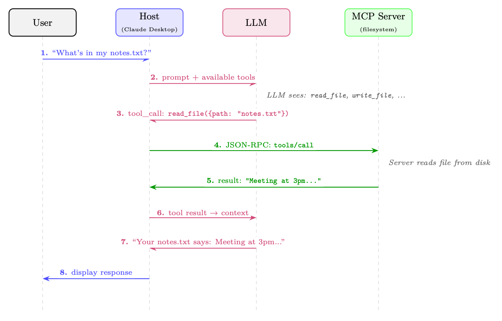
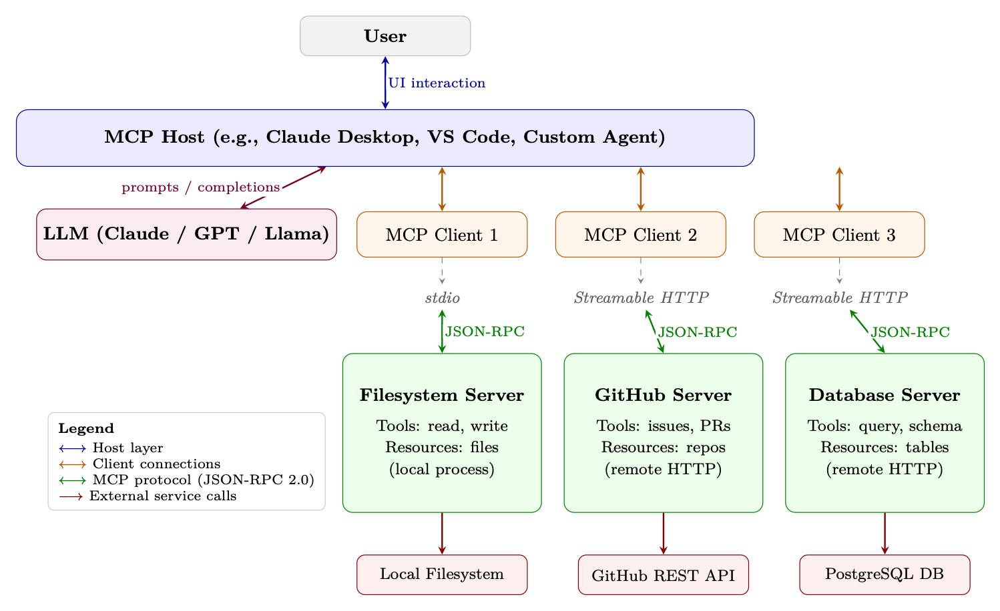

<div class="hh-guide">

<aside class="hh-part">
<p class="hh-part-title">第 V 部分 智能体 AI（Agentic AI）</p>
</aside>

工具增强型语言模型的兴起带来了一个碎片化问题：每一个 Agent 框架、每一个 LLM 提供商、每一次企业部署都在发明自己的一套机制，用来把模型与外部工具和数据源连接起来。模型上下文协议（Model Context Protocol, MCP）[10] 由 Anthropic 于 2024 年末提出，是一个旨在彻底解决这一问题的开放标准——为 AI 应用与它们所需工具之间提供一个通用的、与厂商无关的接口。

## 动机：工具集成问题

考虑任何想把 AI Agent 接入自身基础设施的组织所面临的组合爆炸。假设有 <math alttext="N" display="inline"><semantics><mi>N</mi></semantics></math> 种不同的 Agent 框架（LangChain、AutoGen、CrewAI、自研 Agent、…）和 <math alttext="M" display="inline"><semantics><mi>M</mi></semantics></math> 个不同的工具提供方（GitHub、Slack、PostgreSQL、Jira、…）。在没有标准协议的情况下，每一种组合都需要一份定制集成：

<div class="hh-equation" id="ch22.e1"><math alttext="\text{Integrations without standard}=N\times M" display="block"><semantics><mrow><mtext>Integrations without standard</mtext><mo>=</mo><mrow><mi>N</mi><mo lspace="0.222em" rspace="0.222em">×</mo><mi>M</mi></mrow></mrow></semantics></math><span class="hh-equation-number">(22.1)</span></div>

有了通用协议，每一方都只需实现一次该协议：

<div class="hh-equation" id="ch22.e2"><math alttext="\text{Integrations with standard}=N+M" display="block"><semantics><mrow><mtext>Integrations with standard</mtext><mo>=</mo><mrow><mi>N</mi><mo>+</mo><mi>M</mi></mrow></mrow></semantics></math><span class="hh-equation-number">(22.2)</span></div>

对于 <math alttext="N=20" display="inline"><semantics><mrow><mi>N</mi><mo>=</mo><mn>20</mn></mrow></semantics></math> 个 Agent 框架和 <math alttext="M=50" display="inline"><semantics><mrow><mi>M</mi><mo>=</mo><mn>50</mn></mrow></semantics></math> 个工具提供方而言，这把集成负担从 1,000 个定制连接器降低到仅 70 个协议实现——减少了 14<math alttext="\times" display="inline"><semantics><mo>×</mo></semantics></math> 倍。这正是 USB（通用设备连接）、HTTP（通用 Web 通信）和 LSP（语言服务器协议，用于 IDE 工具链）等协议背后的思想。MCP 把同样的理念应用到了 AI 工具使用上。

与语言服务器协议（Language Server Protocol, LSP）1 的类比尤为贴切。在 LSP 出现之前，每一个 IDE 都必须为每一种编程语言单独实现语言支持（自动补全、跳转定义、错误高亮）。在 LSP 之后，语言服务器与编辑器只需说一种共同的协议。MCP 之于 AI 工具使用，正如 LSP 之于开发者工具链。

<figure id="ch22.f1"><figcaption><span class="hh-tag">图 22.1：</span>MCP 的工作方式：一次用户请求依次流经 Host、LLM 与 MCP Server。LLM 决定调用哪一个工具（第 3 步）；Host 通过 JSON-RPC 将该调用路由到对应的 server（第 4 步）；结果再回传给 LLM 进行自然语言整理（第 5–7 步）。用户看不到任何协议层的细节。</figcaption></figure>

## 架构概览

MCP 采用一种客户端-服务器架构，包含三种不同的角色，由一层定义明确的协议层加以连接。

### 三角色模型

MCP Host

终端用户直接与之交互的 LLM 应用。例如 Claude Desktop、VS Code 扩展、自研聊天机器人或自主 Agent。Host 负责管理整体用户体验，决定连接哪些 MCP server，并执行安全策略。一个 Host 内部包含一个或多个 MCP client。

MCP Client

嵌入在 Host 应用内部的协议层组件。每个 client 与单个 MCP server 维持一条<em>有状态的一对一连接</em>。Client 负责协议协商、消息序列化以及连接的生命周期管理。一个 Host 可同时运行多个 client，每个 client 连接到不同的 server。

MCP Server

一个轻量级的进程或服务，向 client 暴露能力（tools、resources、prompts）。Server 通常是对既有 API、数据库或系统接口的薄包装。它们被设计得易于实现——协议的复杂性由 client/host 层承担。

### 传输层

MCP 在协议层与传输层无关，但定义了两种标准的传输机制：

stdio（标准输入输出）

Client 将 server 作为子进程启动，通过标准输入/输出流通信。这是本地工具最简单、最常见的传输方式。它提供了较强的隔离性（server 运行在独立的进程中），且无需任何网络配置。非常适合文件系统访问、本地代码执行和开发者工具。

Streamable HTTP

Server 作为 HTTP 服务运行。Client 通过 HTTP POST 发送 JSON-RPC 请求；server 可以返回单个 JSON 响应，也可以升级为 Server-Sent Events（SSE）流以增量返回结果。这种传输方式支持远程 server，可启用服务端推送通知，并能穿越标准的 Web 基础设施（代理、负载均衡器、防火墙）。适用于云端托管工具与企业部署。（该传输在 2025-03-26 的协议修订版中取代了早先仅 HTTP+SSE 的传输方式。）

### 协议生命周期

每一条 MCP 连接都遵循一个四阶段的生命周期：

<ol><li>初始化：Client 发送一个 <code>initialize</code> 请求，其中包含其协议版本与所支持的能力。Server 返回自己的版本与能力。这一步确立了本次会话可用的特性集合。</li><li>能力协商：双方各自声明所支持的能力（例如 server 是否提供 tools、resources 或 prompts；client 是否支持 sampling）。双方均未声明的能力不会被使用。</li><li>运行：主阶段。Client 发送请求（工具调用、资源读取、prompt 获取），server 进行响应。Server 也可以在不被请求的情况下发送通知（例如资源变更事件）。</li><li>关闭：任一方都可以发起优雅关闭。Client 发送一个 <code>shutdown</code> 通知；Server 清理资源并终止。</li></ol>

### 有状态会话 vs. 无状态请求

MCP 的一个关键设计决策是：连接是有状态会话，而不是无状态的 HTTP 请求。这一点在几个方面都很重要：

<ul><li>效率：能力协商只在建立连接时进行一次，而不是在每个请求上都做一次。</li><li>上下文：Server 可以维护会话状态（例如一个打开中的数据库事务、一个已检出的文件锁）。</li><li>订阅：当资源发生变化时，Server 可以向 client 推送通知。</li><li>长时间运行的操作：在有状态会话中，进度上报是很自然的。</li></ul>

代价是，有状态会话需要连接管理（重连逻辑、会话恢复），而无状态 API 则不必处理这些。

### 完整架构图

图 图 22.2 展示了完整的 MCP 技术栈，从用户界面一直到外部服务。

<figure id="ch22.f2"><figcaption><span class="hh-tag">图 22.2：</span>完整的 MCP 架构栈。Host 管理一个或多个 Client，每个 Client 通过传输层（stdio 或 Streamable HTTP）与一个 MCP Server 维持一条有状态会话。client 与 server 之间的所有通信都使用 JSON-RPC 2.0。Server 包装外部服务，并把它们以标准化的 Tools、Resources 和 Prompts 形式暴露出来。</figcaption></figure>

## 核心原语

MCP 定义了四项核心原语，供 server 向 client 暴露。每项原语都有各自不同的用途、控制方向和用例。

### Tools

Tools 是最重要的原语——它们是 server 暴露出来供 LLM 调用的类函数操作。一个 tool 包含：

<ul><li>一个 name（在 server 内的唯一标识）</li><li>一个 description（面向 LLM 的自然语言说明）</li><li>一个 inputSchema（定义参数的 JSON Schema）</li><li>一个可选的 outputSchema（返回值对应的 JSON Schema）</li></ul>

Tools 代表<em>带有副作用的动作</em>：创建文件、发送消息、执行代码、查询数据库。LLM 决定何时以及如何调用 tool；server 负责执行它们。

### Resources

Resources 是 server 可以向 client 提供的数据。与 tools 不同（tools 由 LLM 调用），resources 通常由 <em>host 应用读取</em>，用以填充 LLM 的上下文窗口。Resources 具有 URI（例如 <code>file:///home/user/notes.txt</code>、<code>db://customers/42</code>），可以是静态的，也可以是动态的。

Resources 支持订阅：client 可以订阅某个 resource URI，并在底层数据发生变化时收到通知。这使得 Agent 能够对真实世界的事件作出响应。

### Prompts

Prompts 是 server 提供的可复用 prompt 模板。它们让 server 作者能够把领域专业知识编码进结构化的 prompt，供 host 呈现给用户或注入对话。例如，一个 GitHub MCP server 可能提供一个“代码审查”prompt 模板，它以 PR 编号为输入，生成一份结构化的审查请求。

### Sampling

Sampling 是最不寻常的原语——它运行在<em>相反的方向</em>上。不是 client 要求 server 去做某件事，而是<em>server 要求 client 执行 LLM 推理</em>。这种反向流程让工具 server 能够引入由模型驱动的推理步骤（例如在返回检索到的数据之前先做摘要），而无需自己部署 LLM。Host 完全掌控是否响应 sampling 请求，从而维持安全边界。

## 协议规范

MCP 构建在 JSON-RPC 2.0[121] 之上，这是一种轻量级的远程过程调用协议，使用 JSON 进行消息编码。这一选择提供了一个被广泛理解、与语言无关且库支持广泛的基础。

### JSON-RPC 2.0 消息格式

JSON-RPC 2.0 中有三种消息类型：

Request（client <math alttext="\to" display="inline"><semantics><mo stretchy="false">→</mo></semantics></math> server，期望得到响应）：

```python
{
  "jsonrpc": "2.0",
  "id": 42,
  "method": "tools/call",
  "params": {
    "name": "read_file",
    "arguments": { "path": "/home/user/notes.txt" }
  }
}
```

Response（server <math alttext="\to" display="inline"><semantics><mo stretchy="false">→</mo></semantics></math> client，作为对某个请求的应答）：

```python
{
  "jsonrpc": "2.0",
  "id": 42,
  "result": {
    "content": [
      { "type": "text", "text": "Meeting notes: ..." }
    ],
    "isError": false
  }
}
```

Notification（任一方向，不期望响应）：

```python
{
  "jsonrpc": "2.0",
  "method": "notifications/resources/updated",
  "params": { "uri": "file:///home/user/notes.txt" }
}
```

### 能力协商握手

初始化握手确立双方各自能做什么：

```python
// Client sends:
{
  "jsonrpc": "2.0", "id": 1,
  "method": "initialize",
  "params": {
    "protocolVersion": "2024-11-05",
    "capabilities": {
      "sampling": {},          // client supports sampling requests
      "roots": { "listChanged": true }
    },
    "clientInfo": { "name": "MyAgent", "version": "1.0.0" }
  }
}

// Server responds:
{
  "jsonrpc": "2.0", "id": 1,
  "result": {
    "protocolVersion": "2024-11-05",
    "capabilities": {
      "tools": { "listChanged": true },   // server has tools
      "resources": { "subscribe": true }, // server supports subscriptions
      "prompts": {}
    },
    "serverInfo": { "name": "filesystem", "version": "0.6.2" }
  }
}
```

### 错误处理

JSON-RPC 错误遵循一种带数字错误码的标准格式。MCP 还定义了超出 JSON-RPC 标准的额外错误码：

```python
{
  "jsonrpc": "2.0", "id": 42,
  "error": {
    "code": -32602,          // Invalid params (JSON-RPC standard)
    "message": "Invalid file path: path must be absolute",
    "data": { "path": "relative/path.txt" }
  }
}
```

### 进度上报

对于长时间运行的操作，MCP 支持进度通知。Client 在请求中包含一个 <code>progressToken</code>；server 会定期发送 <code>notifications/progress</code> 消息：

```python
// Request with progress token
{
  "jsonrpc": "2.0", "id": 10,
  "method": "tools/call",
  "params": {
    "name": "index_codebase",
    "arguments": { "path": "/repo" },
    "_meta": { "progressToken": "index-op-1" }
  }
}

// Server sends progress notifications (no id = notification)
{
  "jsonrpc": "2.0",
  "method": "notifications/progress",
  "params": {
    "progressToken": "index-op-1",
    "progress": 45,
    "total": 100,
    "message": "Indexed 450/1000 files..."
  }
}
```

## Tool 定义与发现

Tools 是 MCP 的核心。把 tool 定义写对至关重要，因为 LLM 依赖 name 和 description 来决定<em>该调用哪个 tool、以及何时调用</em>。

### Tool 模式格式

一个完整的 tool 定义：

```python
{
  "name": "search_codebase",
  "description": "Search for a pattern across all files in the repository.
    Returns matching file paths and line numbers. Use this when you need
    to find where a function is defined, where a variable is used, or
    where a specific string appears. Supports regex patterns.",
  "inputSchema": {
    "type": "object",
    "properties": {
      "pattern": {
        "type": "string",
        "description": "Regex pattern to search for"
      },
      "path": {
        "type": "string",
        "description": "Directory to search in (default: repo root)",
        "default": "."
      },
      "case_sensitive": {
        "type": "boolean",
        "description": "Whether the search is case-sensitive",
        "default": false
      }
    },
    "required": ["pattern"]
  }
}
```

### 动态工具注册

Server 可以在会话期间通过发送 <code>notifications/tools/list_changed</code> 通知来新增、移除或修改 tools。Client 随后用 <code>tools/list</code> 请求重新获取 tool 列表。这支持：

<ul><li>上下文相关的 tools：代码编辑器 server 可能根据当前打开的文件类型暴露不同的 tools。</li><li>需要权限的 tools：只有在用户授予特定权限之后才可用的 tools。</li><li>动态插件系统：在运行时从外部注册中心加载的 tools。</li></ul>

### Tool 标注

MCP 引入了 tool 注解——这类元数据提示帮助 Host 在 tool 执行方面做出更好的决策（在 2025-03-26 的协议修订版中加入）：

```python
{
  "name": "delete_file",
  "description": "Permanently delete a file from the filesystem.",
  "inputSchema": { ... },
  "annotations": {
    "readOnlyHint": false,      // This tool modifies state
    "destructiveHint": true,    // Changes are irreversible
    "idempotentHint": false,    // Calling twice has different effects
    "openWorldHint": false      // Does not interact with external services
  }
}
```

<code>readOnlyHint</code>

如果 <code>true</code>，则该 tool 只读取数据、没有副作用。Host 可以对只读 tool 自动放行，无需用户确认。

<code>destructiveHint</code>

如果 <code>true</code>，则该 tool 会执行不可逆的操作。Host 应当要求用户明确确认。

<code>idempotentHint</code>

如果 <code>true</code>，则用相同参数多次调用该 tool 与调用一次的效果相同。失败时可以安全重试。

<code>openWorldHint</code>

如果 <code>true</code>，则该 tool 会与 server 无法直接控制的外部服务交互（例如发送邮件、发布到社交媒体）。

## 安全模型

MCP 跨越多重信任边界运行。理解这些边界对于安全部署至关重要。

### 信任层级

Host（信任度最高）

Host 应用受用户信任。它执行安全策略、管理用户授权，并控制 client 连接到哪些 server。Host 是允许哪些操作的最终裁决者。

Client（受 Host 信任）

Client 忠实地实现协议，并执行 Host 的策略。它会校验 server 的响应，并在把数据传给 LLM 之前做净化处理。

Server（有条件信任）

Server 被信任会诚实地实现其声明的能力，但 Host 不应盲目信任 server 提供的数据。一个被攻陷或恶意的 server 可能通过在 resource 内容中嵌入指令来实施 prompt 注入攻击。

外部服务（不受信任）

MCP server 与之交互的服务（Web API、数据库、文件系统）从协议的角度看都是不受信任的。Server 必须校验并净化所有外部数据。

### 用户同意

MCP 要求用户必须明确同意 tool 的执行，对于带有副作用的 tool 尤其如此。Host 负责：

<ul><li>在执行之前清晰说明该 tool 将要做什么</li><li>区分只读操作与破坏性操作（借助注解）</li><li>提供所有代表用户发起的 tool 调用的审计日志</li><li>允许用户随时撤回权限</li></ul>

### 输入校验与清洗

Server 必须在执行之前依据其声明的 JSON Schema 校验所有输入。需要防范的常见漏洞：

<ul><li>路径穿越：文件路径参数中的 <code>../../etc/passwd</code></li><li>SQL 注入：数据库查询 tool 中未经净化的字符串</li><li>命令注入：代码执行 tool 中的 shell 元字符</li><li>SSRF：HTTP tool 中指向内部网络资源的 URL</li></ul>

### 凭据管理

MCP server 经常需要凭据才能访问外部服务。最佳实践如下：

<ul><li>OAuth 2.0：用于用户委托访问第三方服务（GitHub、Google、Slack）。Server 负责处理 OAuth 流程；Host 安全地存储 token。</li><li>环境变量：API key 应通过环境变量注入，而不要硬编码或经由协议传递。</li><li>密钥管理器：生产部署应使用专门的密钥管理服务（AWS Secrets Manager、HashiCorp Vault），而不是环境变量。</li><li>最小权限：Server 应当只申请自己所需的权限（只读数据库访问，而不是管理员凭据）。</li></ul>

### 沙箱策略

对于会执行任意代码或访问敏感资源的 server：

<ul><li>进程隔离：在独立的进程中运行每个 server，并限制其操作系统权限（seccomp、AppArmor、SELinux）。</li><li>容器隔离：把 server 部署在 Docker 容器中，只赋予最小能力，并禁止其访问内部服务所在网络。</li><li>只读文件系统：除非明确需要写入权限，否则以只读方式挂载文件系统。</li><li>网络策略：用防火墙规则限制 server 可以访问哪些外部服务。</li></ul>

## 实现模式

### 用 Python 构建一个 MCP Server

官方 Python SDK 提供了 <code>FastMCP</code>，这是一个高层框架，自动处理协议协商、序列化和传输。下面是一个完整的笔记类 MCP server：

```
#!/usr/bin/env python3
"""
A simple MCP server exposing note-taking tools and resources.
Install: pip install "mcp[cli]"
Run:     mcp run notes_server.py        (stdio)
         mcp run notes_server.py --transport streamable-http  (HTTP)
"""
from pathlib import Path
from mcp.server.fastmcp import FastMCP

# -- Server setup --------------------------------------------------------------
mcp = FastMCP("notes-server")
NOTES_DIR = Path.home() / ".notes"
NOTES_DIR.mkdir(exist_ok=True)

# -- Tools (LLM-invoked actions) -----------------------------------------------
@mcp.tool()
def create_note(title: str, content: str, tags: list[str] | None = None) -> str:
    """Create a new text note with a given title and content.

    Use this when the user wants to save information for later.
    Returns the path where the note was saved.
    """
    tags = tags or []
    safe_title = "".join(
        c if c.isalnum() or c in " -_" else "_" for c in title
    ).strip()
    note_path = NOTES_DIR / f"{safe_title}.md"

    frontmatter = f"---\ntitle: {title}\ntags: {tags}\n---\n\n"
    note_path.write_text(frontmatter + content, encoding="utf-8")
    return f"Note saved to {note_path}"

@mcp.tool()
def search_notes(query: str) -> str:
    """Search notes by keyword. Searches both titles and content.

    Returns a list of matching note titles and snippets.
    Use this before creating a note to check if one already exists.
    """
    query_lower = query.lower()
    results = []

    for note_file in NOTES_DIR.glob("*.md"):
        text = note_file.read_text(encoding="utf-8")
        if query_lower in text.lower():
            idx = text.lower().find(query_lower)
            snippet = text[max(0, idx - 50):idx + 100].replace("\n", " ")
            results.append(f"- **{note_file.stem}**: ...{snippet}...")

    return "\n".join(results) if results else f"No notes found matching '{query}'"

# -- Resources (context data for the LLM) -------------------------------------
@mcp.resource("notes://{title}")
def get_note(title: str) -> str:
    """Read a note by title."""
    note_path = NOTES_DIR / f"{title}.md"
    if not note_path.exists():
        raise ValueError(f"Note not found: {title}")
    return note_path.read_text(encoding="utf-8")

# -- Entry point ----------------------------------------------------------------
if __name__ == "__main__":
    mcp.run()  # defaults to stdio transport
```

<span class="hh-tag">代码清单 27：</span>完整的 MCP Server：笔记记录 Tool（FastMCP）

与更早期的底层 API 相比的关键差异：

<ul><li>声明式 tools：<code>@mcp.tool()</code> 装饰器会从 Python 类型标注与 docstring 推断出 JSON Schema——无需手动编写 <code>inputSchema</code>。</li><li>自动传输：<code>mcp.run()</code> 会根据 server 的启动方式自动处理 stdio 或 Streamable HTTP。</li><li>以函数形式提供 Resources：<code>@mcp.resource("uri-template")</code> 通过基于 URI 的路由暴露数据。</li></ul>

### 构建一个 MCP Client

一个最小化的 client，用于连接笔记 server 并调用某个 tool：

```
import asyncio
from mcp import ClientSession, StdioServerParameters
from mcp.client.stdio import stdio_client

async def main():
    # Connect to the notes server via stdio
    server_params = StdioServerParameters(
        command="python",
        args=["notes_server.py"],
        env=None  # inherit environment
    )

    async with stdio_client(server_params) as (read, write):
        async with ClientSession(read, write) as session:
            # Phase 1: Initialize
            await session.initialize()

            # Phase 2: Discover available tools
            tools_result = await session.list_tools()
            print("Available tools:")
            for tool in tools_result.tools:
                print(f"  - {tool.name}: {tool.description[:60]}...")

            # Phase 3: Call a tool
            result = await session.call_tool(
                "create_note",
                arguments={
                    "title": "MCP Architecture Notes",
                    "content": "MCP uses JSON-RPC 2.0 over stdio or HTTP+SSE.",
                    "tags": ["mcp", "architecture"]
                }
            )
            print(f"\nTool result: {result.content[0].text}")

            # Phase 4: List resources
            resources = await session.list_resources()
            print(f"\nAvailable resources: {len(resources.resources)}")

asyncio.run(main())
```

<span class="hh-tag">代码清单 28：</span>MCP Client：连接与调用 Tools

### 同时连接多个 Server

Host 应用通常需要管理多个 server 连接。该模式使用一个连接池：

```
import asyncio
from contextlib import AsyncExitStack
from mcp import ClientSession, StdioServerParameters
from mcp.client.stdio import stdio_client

class MCPHost:
    """Manages connections to multiple MCP servers."""

    def __init__(self):
        self.sessions: dict[str, ClientSession] = {}
        self.tool_registry: dict[str, tuple[str, object]] = {}
        self._exit_stack = AsyncExitStack()

    async def connect(self, name: str, params: StdioServerParameters):
        """Connect to a named MCP server and register its tools."""
        read, write = await self._exit_stack.enter_async_context(
            stdio_client(params)
        )
        session = await self._exit_stack.enter_async_context(
            ClientSession(read, write)
        )
        await session.initialize()
        self.sessions[name] = session

        # Register all tools from this server
        tools = await session.list_tools()
        for tool in tools.tools:
            self.tool_registry[tool.name] = (name, tool)
            print(f"Registered tool '{tool.name}' from server '{name}'")

    async def call_tool(self, tool_name: str, arguments: dict):
        """Route a tool call to the appropriate server."""
        if tool_name not in self.tool_registry:
            raise ValueError(f"Unknown tool: {tool_name}")

        server_name, _ = self.tool_registry[tool_name]
        session = self.sessions[server_name]
        return await session.call_tool(tool_name, arguments)

    async def get_all_tools(self) -> list:
        """Return all tools across all connected servers."""
        return [tool for _, tool in self.tool_registry.values()]

    async def close(self):
        await self._exit_stack.aclose()

async def main():
    host = MCPHost()

    # Connect to multiple servers concurrently
    await asyncio.gather(
        host.connect("filesystem", StdioServerParameters(
            command="npx", args=["-y", "@modelcontextprotocol/server-filesystem",
                                  "/home/user"]
        )),
        host.connect("github", StdioServerParameters(
            command="npx", args=["-y", "@modelcontextprotocol/server-github"]
        )),
        host.connect("notes", StdioServerParameters(
            command="python", args=["notes_server.py"]
        )),
    )

    # All tools available through a single interface
    all_tools = await host.get_all_tools()
    print(f"Total tools available: {len(all_tools)}")

    await host.close()

asyncio.run(main())
```

<span class="hh-tag">代码清单 29：</span>多 Server 的 MCP Host 模式

### 错误恢复与重连

生产环境中的 MCP client 必须处理 server 崩溃与网络中断：

```
import asyncio
import logging
from mcp import ClientSession, StdioServerParameters
from mcp.client.stdio import stdio_client

logger = logging.getLogger(__name__)

async def resilient_tool_call(
    params: StdioServerParameters,
    tool_name: str,
    arguments: dict,
    max_retries: int = 3,
    backoff_base: float = 1.0
):
    """Call a tool with automatic reconnection on failure."""
    for attempt in range(max_retries):
        try:
            async with stdio_client(params) as (read, write):
                async with ClientSession(read, write) as session:
                    await session.initialize()
                    return await session.call_tool(tool_name, arguments)

        except (ConnectionError, TimeoutError, OSError) as e:
            if attempt == max_retries - 1:
                raise
            wait_time = backoff_base * (2 ** attempt)
            logger.warning(
                f"Tool call failed (attempt {attempt+1}/{max_retries}): {e}. "
                f"Retrying in {wait_time:.1f}s..."
            )
            await asyncio.sleep(wait_time)
```

<span class="hh-tag">代码清单 30：</span>带重试逻辑的弹性 MCP 连接

## MCP 生态

自发布以来，MCP 已经吸引了快速成长的 servers、clients 与工具生态。2

### 常用 MCP Server

### MCP 在生产应用中的使用

MCP 已被若干主流的 AI 开发工具采用：

Claude Desktop

Anthropic 的桌面应用3 是第一个主要的 MCP Host。用户在 JSON 配置文件中配置 servers；此后 Claude 便可以在任何对话中使用所有已连接 server 的 tools。

Cursor

这款由 AI 驱动的代码编辑器4 支持 MCP server，允许开发者把他们的开发工具（数据库、issue 跟踪器、文档系统）直接接入编程助手。

VS Code（GitHub Copilot）

Microsoft 为 VS Code 中的 GitHub Copilot 添加了 MCP 支持5，使该编程助手能够访问项目专用的工具与数据源。

自研 Agent

开源社区已把 MCP 支持内置到 LangChain6、LlamaIndex7 和 AutoGen8 等框架中，使任何基于这些框架构建的 Agent 都能使用 MCP servers。

### Server 注册表与发现

MCP 生态正在为 server 发现机制构建基础设施：

<ul><li>MCP Registry9：由 Anthropic 维护的官方精选清单，收录经过验证的 MCP servers。</li><li>npm：许多 JavaScript/TypeScript MCP server 以 npm 包的形式发布在 <code>@modelcontextprotocol</code> 作用域下。</li><li>PyPI：Python server 以 pip 包的形式发布（例如 <code>pip install mcp-server-sqlite</code>）。</li><li>GitHub：<code>modelcontextprotocol/servers</code>10 仓库维护着一份官方 server 的参考集合。</li><li>Python SDK 文档11：用于构建 servers 与 clients 的完整 API 参考与示例。</li></ul>

## MCP vs. 其他方案

### 何时使用 MCP vs. 自定义集成

在以下情况下使用 MCP：

<ul><li>你希望自己的工具能够配合多个 LLM 提供商或 Agent 框架使用</li><li>你正在构建供他人使用的工具（开源分发或企业内部推广）</li><li>你需要有状态会话、resource 订阅或服务端推送能力</li><li>你希望利用现有的 MCP server 生态</li></ul>

在以下情况下使用定制集成：

<ul><li>你只有一个紧耦合的 LLM 提供商，并且不打算更换</li><li>你需要极低的延迟，无法承受协议带来的额外开销</li><li>你的工具接口过于特殊，以致 MCP 的原语无法良好映射</li><li>你处于早期原型阶段，希望尽量减少依赖</li></ul>

### 迁移路径

从 OpenAI function calling 迁移到 MCP 相当直接：tool 参数的 JSON Schema 格式完全相同。主要变化包括：

<ol><li>把 tool 实现包装进一个 MCP server（使用 Python 或 TypeScript SDK）</li><li>在客户端中把直接 API 调用替换为 <code>session.call_tool()</code></li><li>加入能力协商与生命周期管理</li></ol>

使用 <code>langchain-mcp-adapters</code> 包可以把 LangChain tool 包装进 MCP server，该包提供了 LangChain 的 <code>BaseTool</code> 接口与 MCP tool 定义之间的自动转换。

## MCP 在 Agent 训练中的作用

除了部署之外，MCP 对<em>训练</em>使用 tool 的智能体（Agent）也有重要意义。本节探讨 MCP 如何充当 LLM 的强化学习与监督微调（SFT）的基础设施。

### MCP Server 作为 RL 环境接口

在面向 LLM 的强化学习中（见第 第 3 章 强化学习导论 节），agent 必须与环境交互以获得 reward。MCP server 为此提供了一个自然且标准化的接口：

<ul><li>动作空间：可用 tool 的集合定义了 agent 的动作空间。MCP 的 <code>tools/list</code> 端点提供了一个结构化、机器可读且可动态更新的动作空间。</li><li>观测空间：MCP resource 提供结构化的观测。一个编程环境可能把当前文件内容、测试结果与错误信息都暴露为 resource。</li><li>Reward 信号：工具调用结果可以编码 reward 信号。一个跑测试的 tool 可能会在测试输出之外返回 <code>{"passed": 8, "failed": 2, "reward": 0.8}</code>。</li><li>环境重置：一个 <code>reset_environment</code> tool 可以在 episode 之间把环境恢复到初始状态。</li></ul>

### 借助 MCP 实现标准化动作空间

训练使用 tool 的 agent 时，一个挑战在于不同环境拥有不同的动作空间，使得已学到的 policy 难以迁移。MCP 提供了一种通用的动作空间抽象：

<div class="hh-equation" id="ch22.e3"><math alttext="\mathcal{A}_{\text{MCP}}=\bigcup_{s\in\mathcal{S}}\text{Tools}(s)" display="block"><semantics><mrow><msub><mi>𝒜</mi><mtext>MCP</mtext></msub><mo rspace="0.111em">=</mo><mrow><munder><mo movablelimits="false">⋃</mo><mrow><mi>s</mi><mo>∈</mo><mi>𝒮</mi></mrow></munder><mrow><mtext>Tools</mtext><mo lspace="0em" rspace="0em">​</mo><mrow><mo stretchy="false">(</mo><mi>s</mi><mo stretchy="false">)</mo></mrow></mrow></mrow></mrow></semantics></math><span class="hh-equation-number">(22.3)</span></div>

其中 <math alttext="\mathcal{S}" display="inline"><semantics><mi>𝒮</mi></semantics></math> 为已连接的 MCP server 集合，<math alttext="\text{Tools}(s)" display="inline"><semantics><mrow><mtext>Tools</mtext><mo lspace="0em" rspace="0em">​</mo><mrow><mo stretchy="false">(</mo><mi>s</mi><mo stretchy="false">)</mo></mrow></mrow></semantics></math> 是 server <math alttext="s" display="inline"><semantics><mi>s</mi></semantics></math> 暴露的 tool 集合。agent 学到的是一个以可用动作集合为条件的 policy <math alttext="\pi(a\mid o,\mathcal{A}_{\text{MCP}})" display="inline"><semantics><mrow><mi>π</mi><mo>⁡</mo><mrow><mo stretchy="false">(</mo><mi>a</mi><mo fence="true" lspace="0em" rspace="0em">∣</mo><mrow><mi>o</mi><mo>,</mo><msub><mi>𝒜</mi><mtext>MCP</mtext></msub></mrow><mo stretchy="false">)</mo></mrow></mrow></semantics></math>，从而能够零样本泛化到新的 tool 集合。

工具参数的 JSON Schema 格式提供了一种 LLM 可以可靠解析与生成的结构化动作表示。这比自由格式的 API 文档更易处理，并使得在训练期间对动作空间进行系统性探索成为可能。

### 为 SFT 记录工具使用轨迹

MCP 的结构化协议让记录高质量的工具使用轨迹（用于监督微调）变得很容易：

```
import json
import time
from dataclasses import dataclass, field, asdict
from typing import Any
from mcp import ClientSession

@dataclass
class ToolCallRecord:
    timestamp: float
    tool_name: str
    arguments: dict[str, Any]
    result: dict[str, Any]
    duration_ms: float
    is_error: bool

@dataclass
class Trajectory:
    task_description: str
    tool_calls: list[ToolCallRecord] = field(default_factory=list)
    final_answer: str = ""
    success: bool = False
    total_reward: float = 0.0

class RecordingMCPClient:
    """Wraps an MCP session to record all tool calls for SFT data."""

    def __init__(self, session: ClientSession, trajectory: Trajectory):
        self.session = session
        self.trajectory = trajectory

    async def call_tool(self, name: str, arguments: dict) -> Any:
        start = time.monotonic()
        result = await self.session.call_tool(name, arguments)
        duration = (time.monotonic() - start) * 1000

        self.trajectory.tool_calls.append(ToolCallRecord(
            timestamp=time.time(),
            tool_name=name,
            arguments=arguments,
            result={"content": [c.text for c in result.content
                                 if hasattr(c, "text")]},
            duration_ms=duration,
            is_error=result.isError
        ))
        return result

    def save_trajectory(self, path: str):
        with open(path, "w") as f:
            json.dump(asdict(self.trajectory), f, indent=2)
```

<span class="hh-tag">代码清单 31：</span>用于 SFT 数据采集的轨迹记录中间件

被记录的轨迹可以转化为遵循指令式的训练样本：

```
def trajectory_to_sft_example(traj: Trajectory) -> dict:
    """Convert a recorded MCP trajectory to a chat-format SFT example."""
    messages = [
        {"role": "system", "content": (
            "You are a helpful assistant with access to tools. "
            "Use tools to complete tasks step by step."
        )},
        {"role": "user", "content": traj.task_description}
    ]

    for i, call in enumerate(traj.tool_calls):
        call_id = f"call_{i:04d}"
        # Assistant decides to call a tool
        messages.append({
            "role": "assistant",
            "content": None,
            "tool_calls": [{
                "id": call_id,
                "type": "function",
                "function": {
                    "name": call.tool_name,
                    "arguments": json.dumps(call.arguments)
                }
            }]
        })
        # Tool returns a result
        messages.append({
            "role": "tool",
            "content": json.dumps(call.result),
            "tool_call_id": call_id,
        })

    # Final answer
    messages.append({
        "role": "assistant",
        "content": traj.final_answer
    })

    return {
        "messages": messages,
        "metadata": {
            "success": traj.success,
            "reward": traj.total_reward,
            "num_tool_calls": len(traj.tool_calls)
        }
    }
```

<span class="hh-tag">代码清单 32：</span>把 MCP 轨迹转化为 SFT 训练样本

## 小结

模型上下文协议（MCP）是朝着标准化 AI 智能体与世界交互方式迈出的重要一步。通过把 <math alttext="N\times M" display="inline"><semantics><mrow><mi>N</mi><mo lspace="0.222em" rspace="0.222em">×</mo><mi>M</mi></mrow></semantics></math> 集成问题简化为 <math alttext="N+M" display="inline"><semantics><mrow><mi>N</mi><mo>+</mo><mi>M</mi></mrow></semantics></math>，MCP 降低了构建强能力、工具增强的 AI 系统的门槛。其关键设计决策——以 JSON-RPC 2.0 作为线路格式、有状态 session、四个核心原语（tools、resources、prompts、sampling）以及清晰的安全模型——反映了从 LSP 与 USB 生态系统中汲取的来之不易的经验教训。

对于构建 RL 训练 agent 的实践者而言，MCP 提供了一个格外有吸引力的价值主张：一个标准化、可扩展的接口，用于定义动作空间、采集训练轨迹，并把训练好的 agent 部署到各种环境中。随着生态系统日趋成熟、基准套件不断涌现，MCP 有可能成为使用 tool 的 agent 研究事实上的基础设施——LLM 时代的 gymnasium。

<aside class="hh-next">
<p class="hh-next-label">下一篇</p>
<p class="hh-next-title">智能体 AI 漫游指南 · 第 23 章 Agent Skills</p>
<p class="hh-next-hint">在「智能体 AI 漫游指南」分类下继续阅读。</p>
</aside>

</div>
