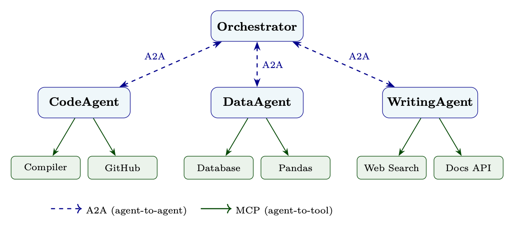

<div class="hh-guide">

<aside class="hh-part">
<p class="hh-part-title">Part V Agentic AI</p>
</aside>

As large language models evolve from isolated assistants into collaborative networks of specialized agents, the question of <em>how agents talk to each other</em> becomes as important as how they reason internally. This section covers the protocols, patterns, and engineering practices that enable multi-agent systems to coordinate, delegate, and collectively solve problems that no single agent could handle alone.

## Motivation: Why Agents Must Communicate

Several forces drive the need for structured inter-agent communication:

Every LLM operates within a finite context window. Complex workflows—spanning hundreds of documents, tool calls, and reasoning steps—quickly exceed what a single agent can hold in memory. By decomposing tasks across agents, each agent operates within a manageable context, and the orchestrating agent maintains only high-level state.

Different agents may be fine-tuned, prompted, or tool-equipped for specific domains: a <code>CodeAgent</code> with access to compilers and test runners, a <code>LegalAgent</code> with access to case-law databases, a <code>DataAgent</code> with statistical libraries. Routing subtasks to the right specialist improves both quality and efficiency.

Independent subtasks can be dispatched to multiple agents simultaneously. A research orchestrator might fan out literature searches across five specialized agents in parallel, then synthesize their results—dramatically reducing wall-clock time.

When one agent fails, a well-designed multi-agent system can retry with a different agent, fall back to a simpler approach, or escalate to a human—without collapsing the entire workflow.

Long-running tasks may need to be handed off between agents as context shifts. An initial <code>PlannerAgent</code> decomposes a goal, hands subtasks to <code>ExecutorAgents</code>, and a final <code>ReviewerAgent</code> validates outputs—each agent receiving exactly the context it needs.

## The Google A2A Protocol

In April 2025, Google (with contributions from over 50 technology partners) released the Agent-to-Agent (A2A) Protocol[115], an open specification for interoperable communication between AI agents. The protocol was subsequently donated to the Linux Foundation and has grown to over 150 supporting organizations as of 2026. A2A is designed around a set of core principles that distinguish it from earlier ad-hoc approaches.

### Design Philosophy

The A2A specification articulates five guiding principles (adapted from the official spec [115], §1.2):

### Agent Cards

The foundation of A2A discoverability is the Agent Card—a machine-readable JSON manifest hosted at a well-known endpoint (<code>/.well-known/agent.json</code>). It advertises what the agent can do, how to authenticate, and where to send tasks—analogous to an OpenAPI spec but for autonomous agents rather than REST endpoints.

Agent Cards enable <em>capability-based routing</em>: an orchestrator agent can fetch cards from a registry, semantically match a subtask to the most appropriate agent, and dispatch accordingly—all without hardcoded routing logic.

### Task Lifecycle

A2A models all work as Tasks. A task progresses through a well-defined state machine:

<code>submitted</code>

The client has sent the task; the server has acknowledged receipt.

<code>working</code>

The agent is actively processing. The client may poll or await SSE events.

<code>input-required</code>

The agent needs additional information from the user or calling agent before it can proceed (e.g., a clarifying question, a missing credential).

<code>completed</code>

The task finished successfully; results are available in the response.

<code>failed</code>

An unrecoverable error occurred; an error message explains the cause.

<code>rejected</code>

The agent declined the task (e.g., outside its capabilities or unauthorized). Added in A2A v1.0.

<code>canceled</code>

The task was aborted, either by the client or by the server.

### Streaming via Server-Sent Events

For tasks that produce incremental output (e.g., a long report being written, a code file being generated), A2A uses Server-Sent Events (SSE). The client opens a persistent HTTP connection and receives a stream of JSON events:

### Push Notifications for Long-Running Tasks

When a task may take minutes or hours, maintaining an open SSE connection is impractical. A2A supports push notifications: the client registers a webhook URL, and the server POSTs status updates as the task progresses.

```python
# Client registers a push notification endpoint when submitting the task
task_request = {
    "id": "task-xyz789",
    "message": {
        "role": "user",
        "parts": [{"type": "text", "text": "Analyze Q3 sales data and produce a report."}]
    },
    "pushNotification": {
        "url": "https://my-orchestrator.example.com/webhooks/a2a",
        "token": "secret-hmac-token-for-verification",
        "authentication": {
            "schemes": ["Bearer"],
            "credentials": "eyJhbGciOiJIUzI1NiJ9..."
        }
    }
}
# The server will POST TaskStatusUpdateEvent objects to the webhook URL
# as the task transitions through states.
```

### Message Format

A2A messages consist of a role (<code>user</code> or <code>agent</code>) plus a list of typed parts (text, file, or structured data). The full message schema, multi-modal examples, and context-passing guidelines are covered in Section 24.5 Message Formats and Schemas.

### Authentication and Authorization

A2A supports multiple authentication schemes, declared in the Agent Card and enforced per-request:

<ul><li>Bearer tokens (JWT/OAuth 2.0): Standard for enterprise deployments; tokens carry scopes that limit what the calling agent is permitted to request.</li><li>API keys: Simpler scheme for internal or trusted environments.</li><li>Mutual TLS (mTLS): Certificate-based authentication for high-security deployments.</li><li>OpenID Connect: Federated identity, enabling cross-organization agent communication.</li></ul>

## Communication Patterns

Multi-agent systems employ a variety of communication patterns depending on the nature of the task, latency requirements, and the number of agents involved.

### Request-Response

The simplest pattern: Agent A sends a task to Agent B and waits for a complete response. Suitable for short, well-defined subtasks where the result is needed before proceeding.

### Streaming

Agent A opens an SSE connection; Agent B streams partial results as they are produced. Ideal for long-form generation (reports, code), real-time collaboration, or progressive UI updates.

### Multi-Turn Interaction

Some tasks require iterative refinement. The agent enters <code>input-required</code> state, the orchestrator provides clarification, and the task resumes. This mirrors human collaborative workflows: draft <math alttext="\to" display="inline"><semantics><mo stretchy="false">→</mo></semantics></math> feedback <math alttext="\to" display="inline"><semantics><mo stretchy="false">→</mo></semantics></math> revision.

```python
# Multi-turn: orchestrator handles input-required state
async def run_multiturn_task(client, initial_message):
    task = await client.send_task(message=initial_message)

    while task.status.state not in ("completed", "failed", "canceled"):
        if task.status.state == "input-required":
            # Agent needs clarification
            clarification_needed = task.status.message
            print(f"Agent asks: {clarification_needed}")

            # Orchestrator generates or forwards a clarifying response
            user_reply = await get_clarification(clarification_needed)

            # Send the reply to continue the task
            task = await client.send_task(
                task_id=task.id,
                message={"role": "user",
                         "parts": [{"type": "text", "text": user_reply}]}
            )
        else:
            # Still working --- poll after a delay
            await asyncio.sleep(2)
            task = await client.get_task(task.id)

    return task
```

### Broadcast

An orchestrator sends the same message to multiple agents simultaneously—useful for announcements, distributing shared context, or triggering parallel independent workflows.

### Publish-Subscribe (Pub-Sub)

Agents subscribe to event channels (e.g., <code>new-document-uploaded</code>, <code>model-retrained</code>). When an event fires, all subscribed agents are notified. This decouples producers from consumers and enables reactive, event-driven architectures.

### Negotiation

Two agents exchange proposals and counter-proposals to reach agreement on a plan, resource allocation, or approach. Common in multi-agent planning systems where agents have different objectives or constraints.

### Auction-Based Task Allocation

The orchestrator announces a task with requirements; candidate agents submit bids (estimated completion time, confidence, cost); the orchestrator awards the task to the winning bidder. This enables dynamic, market-based load balancing across a pool of agents.

<div class="hh-table" id="ch24.t1"><table class="ltx_tabular ltx_align_middle"><thead><tr><th class="ltx_align_left"><span>Pattern</span></th><th class="ltx_align_left ltx_align_top"><span class="ltx_align_top"><span><span>Latency</span></span></span></th><th class="ltx_align_left ltx_align_top"><span class="ltx_align_top"><span><span>Best For</span></span></span></th></tr></thead><tbody><tr><th class="ltx_align_left">Request-Response</th><td class="ltx_align_left ltx_align_top"><span class="ltx_align_top"><span>Low</span></span></td><td class="ltx_align_left ltx_align_top"><span class="ltx_align_top"><span>Short, well-defined subtasks</span></span></td></tr><tr><th class="ltx_align_left">Streaming</th><td class="ltx_align_left ltx_align_top"><span class="ltx_align_top"><span>Low (first token)</span></span></td><td class="ltx_align_left ltx_align_top"><span class="ltx_align_top"><span>Long-form generation, real-time UI</span></span></td></tr><tr><th class="ltx_align_left">Multi-Turn</th><td class="ltx_align_left ltx_align_top"><span class="ltx_align_top"><span>Medium</span></span></td><td class="ltx_align_left ltx_align_top"><span class="ltx_align_top"><span>Ambiguous tasks requiring clarification</span></span></td></tr><tr><th class="ltx_align_left">Broadcast</th><td class="ltx_align_left ltx_align_top"><span class="ltx_align_top"><span>Low</span></span></td><td class="ltx_align_left ltx_align_top"><span class="ltx_align_top"><span>Shared context distribution</span></span></td></tr><tr><th class="ltx_align_left">Pub-Sub</th><td class="ltx_align_left ltx_align_top"><span class="ltx_align_top"><span>Variable</span></span></td><td class="ltx_align_left ltx_align_top"><span class="ltx_align_top"><span>Event-driven reactive workflows</span></span></td></tr><tr><th class="ltx_align_left">Negotiation</th><td class="ltx_align_left ltx_align_top"><span class="ltx_align_top"><span>Medium–High</span></span></td><td class="ltx_align_left ltx_align_top"><span class="ltx_align_top"><span>Resource-constrained planning</span></span></td></tr><tr><th class="ltx_align_left">Auction</th><td class="ltx_align_left ltx_align_top"><span class="ltx_align_top"><span>Medium</span></span></td><td class="ltx_align_left ltx_align_top"><span class="ltx_align_top"><span>Dynamic load balancing</span></span></td></tr></tbody></table><p class="hh-table-caption"><span class="hh-tag">Table 24.1:</span>Summary of A2A communication patterns.</p></div>

## Agent Discovery and Routing

Before an agent can communicate with another, it must <em>find</em> it. Agent discovery is the process of locating agents that can handle a given task.

### Agent Registries

An agent registry is a directory service that indexes Agent Cards and provides search and lookup APIs. Two deployment models exist:

Centralized Registry

A single authoritative registry (e.g., an enterprise service catalog) indexes all agents. Simple to operate but creates a single point of failure and may not scale to cross-organization deployments.

Federated Registry

Multiple registries, each authoritative for a domain or organization, with cross-registry search protocols. More resilient and privacy-preserving, but requires standardized federation protocols.

### Capability-Based Routing

Rather than hardcoding agent URLs, orchestrators perform capability-based routing: they query the registry for agents matching required skills, then select the best match.

```python
class AgentRouter:
    """Routes tasks to agents based on capability matching."""

    def __init__(self, registry_url: str):
        self.registry_url = registry_url
        self._cache: dict[str, list[AgentCard]] = {}

    async def find_agents(self, required_skill: str,
                          tags: list[str] | None = None) -> list[AgentCard]:
        """Query registry for agents with the required skill."""
        params = {"skill": required_skill}
        if tags:
            params["tags"] = ",".join(tags)
        async with httpx.AsyncClient() as client:
            resp = await client.get(f"{self.registry_url}/agents", params=params)
            return [AgentCard(**card) for card in resp.json()["agents"]]

    async def route(self, task_description: str) -> AgentCard:
        """Semantically match a task description to the best available agent."""
        # Embed the task description
        task_embedding = await embed(task_description)

        # Fetch all registered agents
        all_agents = await self.find_agents(required_skill="*")

        # Score each agent by cosine similarity of task to agent description
        scored = []
        for agent in all_agents:
            agent_embedding = await embed(agent.description)
            score = cosine_similarity(task_embedding, agent_embedding)
            scored.append((score, agent))

        # Return the highest-scoring agent
        scored.sort(key=lambda x: x[0], reverse=True)
        return scored[0][1]
```

### Load Balancing Across Equivalent Agents

When multiple agents offer the same capability, the router must distribute load. Common strategies:

<ul><li>Round-robin: Distribute tasks evenly across all available agents.</li><li>Least-loaded: Route to the agent with the fewest active tasks (requires health/metrics endpoints).</li><li>Latency-aware: Route to the agent with the lowest recent response time.</li><li>Affinity-based: Route related tasks to the same agent to exploit cached context.</li></ul>

### Version Management and Compatibility

Agent Cards include a <code>version</code> field. Orchestrators should specify minimum version requirements and handle graceful degradation when only older versions are available. Semantic versioning [293] (<code>MAJOR.MINOR.PATCH</code>) is recommended: breaking interface changes increment <code>MAJOR</code>, new capabilities increment <code>MINOR</code>.

## Message Formats and Schemas

### Structured vs. Unstructured Messages

A2A supports a spectrum from fully unstructured (plain text) to fully structured (typed JSON schemas). The right choice depends on the agents involved:

<div class="hh-table" id="ch24.t2"><table class="ltx_tabular ltx_align_middle"><thead><tr><th class="ltx_align_left"><span>Message Type</span></th><th class="ltx_align_left ltx_align_top"><span class="ltx_align_top"><span><span>Advantages</span></span></span></th><th class="ltx_align_left ltx_align_top"><span class="ltx_align_top"><span><span>Disadvantages</span></span></span></th></tr></thead><tbody><tr><th class="ltx_align_left">Plain text</th><td class="ltx_align_left ltx_align_top"><span class="ltx_align_top"><span>Flexible, human-readable, easy to generate</span></span></td><td class="ltx_align_left ltx_align_top"><span class="ltx_align_top"><span>Hard to parse reliably, no schema validation</span></span></td></tr><tr><th class="ltx_align_left">Structured JSON</th><td class="ltx_align_left ltx_align_top"><span class="ltx_align_top"><span>Machine-parseable, validatable, typed</span></span></td><td class="ltx_align_left ltx_align_top"><span class="ltx_align_top"><span>Requires schema agreement, less flexible</span></span></td></tr><tr><th class="ltx_align_left">Hybrid (text + data)</th><td class="ltx_align_left ltx_align_top"><span class="ltx_align_top"><span>Human-readable intent + machine-parseable payload</span></span></td><td class="ltx_align_left ltx_align_top"><span class="ltx_align_top"><span>More complex to construct and parse</span></span></td></tr></tbody></table><p class="hh-table-caption"><span class="hh-tag">Table 24.2:</span>Structured vs. unstructured A2A message trade-offs.</p></div>

### Multi-Modal Messages

A2A messages are structured as a role (<code>user</code> or <code>agent</code>) plus a list of typed parts:

<div class="hh-table" id="ch24.t3"><table class="ltx_tabular ltx_align_middle"><thead><tr><th class="ltx_align_left"><span>Part Type</span></th><th class="ltx_align_left ltx_align_top"><span class="ltx_align_top"><span><span>Fields</span></span></span></th><th class="ltx_align_left ltx_align_top"><span class="ltx_align_top"><span><span>Use Case</span></span></span></th></tr></thead><tbody><tr><th class="ltx_align_left"><span>TextPart</span></th><td class="ltx_align_left ltx_align_top"><span class="ltx_align_top"><span><span>text: string</span></span></span></td><td class="ltx_align_left ltx_align_top"><span class="ltx_align_top"><span>Natural language instructions, responses</span></span></td></tr><tr><th class="ltx_align_left"><span>FilePart</span></th><td class="ltx_align_left ltx_align_top"><span class="ltx_align_top"><span><span>mimeType</span>, <span>uri</span> or <span>bytes</span></span></span></td><td class="ltx_align_left ltx_align_top"><span class="ltx_align_top"><span>Documents, images, audio, code files</span></span></td></tr><tr><th class="ltx_align_left"><span>DataPart</span></th><td class="ltx_align_left ltx_align_top"><span class="ltx_align_top"><span><span>data: object</span></span></span></td><td class="ltx_align_left ltx_align_top"><span class="ltx_align_top"><span>Structured JSON (tool results, schemas)</span></span></td></tr></tbody></table><p class="hh-table-caption"><span class="hh-tag">Table 24.3:</span>A2A message part types (wire format uses <code>"type": "text"|"file"|"data"</code>).</p></div>

Modern agents increasingly work with non-text modalities. A2A’s <code>FilePart</code> supports any MIME type, enabling rich multi-modal workflows:

### Context Passing: What to Share vs. What to Keep Private

A critical design decision in multi-agent systems is <em>context scoping</em>: how much of the conversation history and internal state to pass to a sub-agent.

### Conversation Threading and Correlation IDs

In complex workflows, many tasks may be in flight simultaneously. Correlation IDs link related tasks across agents:

```python
import uuid

class WorkflowContext:
    """Carries correlation metadata through a multi-agent workflow."""

    def __init__(self, workflow_id: str | None = None):
        self.workflow_id = workflow_id or str(uuid.uuid4())
        self.span_id = str(uuid.uuid4())
        self.parent_span_id: str | None = None

    def child_context(self) -> "WorkflowContext":
        """Create a child context for a sub-task."""
        child = WorkflowContext(workflow_id=self.workflow_id)
        child.parent_span_id = self.span_id
        return child

    def to_metadata(self) -> dict:
        return {
            "x-workflow-id": self.workflow_id,
            "x-span-id": self.span_id,
            "x-parent-span-id": self.parent_span_id
        }

# Usage: attach to every A2A task submission
ctx = WorkflowContext()
task = await client.send_task(
    message=message,
    metadata=ctx.to_metadata()
)
# Sub-tasks use child contexts for tracing
sub_ctx = ctx.child_context()
```

## Coordination Protocols

Beyond point-to-point communication, multi-agent systems benefit from higher-level coordination protocols—structured interaction patterns that enable collective decision-making and problem-solving.

### Contract Net Protocol

The Contract Net Protocol (CNP)[334] is a classic multi-agent coordination mechanism adapted for LLM-based systems:

<ol><li>Announcement: The manager agent broadcasts a task announcement to all potential contractor agents, including task requirements and evaluation criteria.</li><li>Bidding: Contractor agents evaluate the task against their capabilities and submit bids containing estimated completion time, confidence, and resource requirements.</li><li>Award: The manager selects the winning bid (or multiple bids for parallel subtasks) and awards the contract.</li><li>Execution and Reporting: The contractor executes the task and reports results back to the manager.</li></ol>

### Blackboard Systems

A blackboard system[135] provides a shared workspace (the “blackboard”) where agents post partial solutions, observations, and hypotheses. Other agents monitor the blackboard and contribute when they can add value—an <em>opportunistic</em> problem-solving approach.

Blackboard systems are well-suited to problems where the solution path is not known in advance and different agents may contribute at different stages—such as scientific hypothesis generation, complex debugging, or multi-source intelligence analysis.

### Consensus Protocols

When multiple agents must agree on a decision (e.g., which plan to execute, whether a result is correct), consensus protocols provide structured voting mechanisms:

Simple Majority Voting

Each agent votes; the option with <math alttext="&gt;50\%" display="inline"><semantics><mrow><mphantom></mphantom><mo>&gt;</mo><mrow><mn>50</mn><mo>%</mo></mrow></mrow></semantics></math> of votes wins. Fast but vulnerable to correlated errors if agents share the same base model.

Weighted Voting

Votes are weighted by agent confidence or historical accuracy. More robust but requires calibrated confidence estimates.

Quorum-Based

A decision requires agreement from at least <math alttext="k" display="inline"><semantics><mi>k</mi></semantics></math> of <math alttext="n" display="inline"><semantics><mi>n</mi></semantics></math> agents. Provides fault tolerance: up to <math alttext="n-k" display="inline"><semantics><mrow><mi>n</mi><mo>−</mo><mi>k</mi></mrow></semantics></math> agents can fail or disagree without blocking.

Delphi Method

Agents vote, see anonymized results, revise their votes, and repeat until convergence. Reduces anchoring bias and encourages genuine deliberation.

```python
async def quorum_vote(agents: list[AgentCard], question: str,
                      options: list[str], quorum: int) -> str | None:
    """Run a quorum vote across agents. Returns winning option or None."""
    votes = await asyncio.gather(*[
        ask_agent_to_vote(agent, question, options)
        for agent in agents
    ])

    counts: dict[str, int] = {}
    for vote in votes:
        if vote in options:
            counts[vote] = counts.get(vote, 0) + 1

    # Return first option that reaches quorum
    for option, count in sorted(counts.items(), key=lambda x: -x[1]):
        if count >= quorum:
            return option
    return None  # No quorum reached
```

### Leader Election

In dynamic multi-agent systems, a leader (orchestrator) may need to be elected at runtime—for example, when the original orchestrator fails or when agents self-organize without a pre-assigned coordinator. Classic distributed systems algorithms (Bully, Ring) can be adapted for agent networks, with agents exchanging capability scores or priority tokens to elect the most capable available agent as leader.

## A2A vs. MCP: Complementary Protocols

A common source of confusion is the relationship between A2A and the Model Context Protocol (MCP)[10]. These protocols are <em>complementary</em>, not competing:

DimensionMCPA2AParticipantsAgent <math alttext="\leftrightarrow" display="inline"><semantics><mo stretchy="false">↔</mo></semantics></math> Tool/ResourceAgent <math alttext="\leftrightarrow" display="inline"><semantics><mo stretchy="false">↔</mo></semantics></math> AgentIntelligenceOne side (agent) is intelligentBoth sides are intelligentStatefulnessTypically stateless tool callsStateful tasks with lifecycleStreamingLimited (tool results)First-class SSE streamingDiscoveryTool manifestsAgent CardsAuth modelServer-controlledMutual, OAuth 2.0Typical latencyMillisecondsSeconds to minutesUse case“Search the web”, “Run SQL”“Delegate to specialist”

### When to Use Which

<ul><li>Use MCP when the remote endpoint is a deterministic function: a database query, an API call, a code execution sandbox. The agent controls the interaction entirely.</li><li>Use A2A when the remote endpoint needs to <em>reason</em> about the request: interpret ambiguous instructions, make judgment calls, use its own tools, or engage in multi-turn dialogue.</li><li>Use both in the same system: an orchestrator agent uses A2A to delegate to specialist agents, and each specialist agent uses MCP to access its tools.</li></ul>

### Combined Architecture

In production multi-agent systems, A2A and MCP work together at different layers: A2A handles inter-agent delegation and coordination (horizontal communication between peers), while MCP handles each agent’s connection to its tools and data sources (vertical integration with capabilities). This separation of concerns is key to building scalable agentic architectures.

<figure id="ch24.f1"><figcaption><span class="hh-tag">Figure 24.1:</span>Combined A2A + MCP architecture. The orchestrator delegates to specialist agents via A2A; each agent accesses its tools via MCP servers.</figcaption></figure>

## Security and Trust in Multi-Agent Systems

Multi-agent systems introduce unique security challenges. When Agent A delegates to Agent B, which delegates to Agent C, the chain of trust must be carefully managed.

### Agent Identity Verification

Each agent must have a verifiable identity. Options include:

<ul><li>JWT tokens[172] signed by a trusted identity provider, carrying the agent’s ID, issuer, and expiry. Verified by the receiving agent using the provider’s public key.</li><li>mTLS certificates[36] issued by an internal CA, providing both authentication and transport encryption.</li><li>Decentralized identifiers (DIDs)[61] for cross-organization scenarios where no single trusted authority exists.</li></ul>

### Message Integrity and Encryption

<ul><li>All A2A communication should occur over TLS 1.3[307] to prevent eavesdropping and man-in-the-middle attacks.</li><li>For sensitive payloads, end-to-end encryption (e.g., JWE) ensures that intermediate infrastructure (load balancers, proxies) cannot read message content.</li><li>Message signing (JWS) provides non-repudiation: the receiving agent can prove that a specific message came from a specific sender.</li></ul>

### Authorization Scopes

Not every agent should be able to ask every other agent to do anything. OAuth 2.0 authorization scopes [133] define the boundaries:

```python
# Example OAuth 2.0 scopes for a DataAgent
SCOPES = {
    "data:read":        "Read data from connected databases",
    "data:write":       "Write or modify data in connected databases",
    "data:export":      "Export data to external systems",
    "analysis:run":     "Execute statistical analyses",
    "analysis:schedule":"Schedule recurring analyses",
    "admin:config":     "Modify agent configuration"
}

# A ReportingAgent might hold only: data:read, analysis:run
# An ETL pipeline agent might hold: data:read, data:write, data:export
# Only a human admin holds: admin:config

class A2AServer:
    def verify_authorization(self, token: str, required_scope: str) -> bool:
        """Verify that the calling agent holds the required scope."""
        claims = jwt.decode(token, self.public_key, algorithms=["RS256"])
        granted_scopes = claims.get("scope", "").split()
        if required_scope not in granted_scopes:
            raise PermissionError(
                f"Caller lacks required scope '{required_scope}'. "
                f"Granted: {granted_scopes}"
            )
        return True
```

### Audit Trails and Accountability

Every A2A server should emit structured audit logs:

```python
@dataclass
class A2AAuditEvent:
    timestamp: str          # ISO 8601
    workflow_id: str        # Correlation ID for the top-level workflow
    span_id: str            # This task's span
    parent_span_id: str     # Calling task's span (for delegation chains)
    caller_agent_id: str    # Verified identity of the calling agent
    callee_agent_id: str    # This agent's identity
    task_id: str
    skill_invoked: str
    authorization_scopes: list[str]
    outcome: str            # "completed" | "failed" | "rejected"
    duration_ms: int
    error_code: str | None
```

## Implementation Example: Multi-Agent Research Workflow

The following example demonstrates a complete multi-agent research workflow using A2A: an <code>OrchestratorAgent</code> decomposes a research question, delegates to specialist agents, and synthesizes their results.

```python
"""
Multi-agent research workflow using A2A protocol.
Demonstrates: Agent Cards, A2A client/server, task lifecycle,
multi-turn interaction, and agent handoffs.
"""

import asyncio
import json
import uuid
from collections.abc import AsyncIterator
from datetime import datetime, timedelta, timezone

import httpx
from fastapi import FastAPI, HTTPException, Request
from fastapi.responses import StreamingResponse
from pydantic import BaseModel, Field

# -- Data Models --------------------------------------------------------------

class Part(BaseModel):
    type: str           # "text" | "file" | "data"
    text: str | None = None
    data: dict | None = None
    mimeType: str | None = None
    uri: str | None = None

class Message(BaseModel):
    role: str           # "user" | "agent"
    parts: list[Part]

class TaskStatus(BaseModel):
    state: str          # submitted | working | input-required | completed | failed
    message: str | None = None
    timestamp: str = Field(
        default_factory=lambda: datetime.now(timezone.utc).isoformat()
    )

class Artifact(BaseModel):
    parts: list[Part]
    index: int = 0
    append: bool = False
    lastChunk: bool = True

class Task(BaseModel):
    id: str
    status: TaskStatus
    messages: list[Message] = []
    artifacts: list[Artifact] = []
    metadata: dict = {}

# -- A2A Client (HTTP/REST binding) --------------------------------------------
# Note: A2A v1.0 defines three protocol bindings: JSON-RPC 2.0, gRPC, and
# HTTP+JSON/REST. This example uses the REST binding for readability.

class A2AClient:
    """Client for sending tasks to A2A-compliant agents."""

    def __init__(self, agent_url: str, auth_token: str):
        self.agent_url = agent_url.rstrip("/")
        self.headers = {
            "Authorization": f"Bearer {auth_token}",
            "Content-Type": "application/json"
        }

    async def get_agent_card(self) -> dict:
        """Fetch the agent's capability card."""
        async with httpx.AsyncClient() as client:
            resp = await client.get(
                f"{self.agent_url}/.well-known/agent.json",
                headers=self.headers
            )
            resp.raise_for_status()
            return resp.json()

    async def send_task(self, message: Message,
                        task_id: str | None = None,
                        metadata: dict | None = None) -> Task:
        """Submit a task and return the initial task object."""
        payload = {
            "id": task_id or str(uuid.uuid4()),
            "message": message.model_dump(),
            "metadata": metadata or {}
        }
        async with httpx.AsyncClient() as client:
            resp = await client.post(
                f"{self.agent_url}/tasks/send",
                json=payload,
                headers=self.headers,
                timeout=30.0
            )
            resp.raise_for_status()
            return Task(**resp.json())

    async def stream_task(self, message: Message,
                          metadata: dict | None = None) -> AsyncIterator[dict]:
        """Submit a task and stream SSE events."""
        payload = {
            "id": str(uuid.uuid4()),
            "message": message.model_dump(),
            "metadata": metadata or {}
        }
        async with httpx.AsyncClient() as client:
            async with client.stream(
                "POST",
                f"{self.agent_url}/tasks/sendSubscribe",
                json=payload,
                headers={**self.headers, "Accept": "text/event-stream"},
                timeout=300.0
            ) as response:
                async for line in response.aiter_lines():
                    if line.startswith("data: "):
                        event_data = json.loads(line[6:])
                        yield event_data
                        if event_data.get("final"):
                            break

    async def get_task(self, task_id: str) -> Task:
        """Poll for task status."""
        async with httpx.AsyncClient() as client:
            resp = await client.get(
                f"{self.agent_url}/tasks/{task_id}",
                headers=self.headers
            )
            resp.raise_for_status()
            return Task(**resp.json())

    async def wait_for_completion(self, task: Task,
                                  poll_interval: float = 2.0) -> Task:
        """Poll until task reaches a terminal state."""
        terminal_states = {"completed", "failed", "canceled"}
        while task.status.state not in terminal_states:
            await asyncio.sleep(poll_interval)
            task = await self.get_task(task.id)
        return task

# -- A2A Server (FastAPI) -----------------------------------------------------

class ResearchAgent:
    """
    A specialist research agent that searches literature and
    summarizes findings on a given topic.
    """

    AGENT_CARD = {
        "name": "ResearchAgent",
        "description": "Searches academic literature and synthesizes research findings.",
        "url": "https://research-agent.example.com/a2a",
        "version": "1.0.0",
        "capabilities": {
            "streaming": True,
            "pushNotifications": False,
            "stateTransitionHistory": True
        },
        "authentication": {"schemes": ["Bearer"]},
        "skills": [{
            "id": "literature-search",
            "name": "Literature Search",
            "description": "Search and summarize academic papers on a topic.",
            "tags": ["research", "literature", "academic", "papers"],
            "examples": [
                "Summarize recent papers on transformer attention mechanisms.",
                "What does the literature say about RLHF for code generation?"
            ],
            "inputModes": ["text"],
            "outputModes": ["text", "data"]
        }]
    }

    def __init__(self):
        self.tasks: dict[str, Task] = {}
        self.app = FastAPI(title="ResearchAgent A2A Server")
        self._register_routes()

    def _register_routes(self):
        @self.app.get("/.well-known/agent.json")
        async def agent_card():
            return self.AGENT_CARD

        @self.app.post("/tasks/send")
        async def send_task(request: Request):
            body = await request.json()
            task = await self._create_and_run_task(body)
            return task.model_dump()

        @self.app.post("/tasks/sendSubscribe")
        async def send_subscribe(request: Request):
            body = await request.json()
            return StreamingResponse(
                self._stream_task(body),
                media_type="text/event-stream"
            )

        @self.app.get("/tasks/{task_id}")
        async def get_task(task_id: str):
            if task_id not in self.tasks:
                raise HTTPException(status_code=404, detail="Task not found")
            return self.tasks[task_id].model_dump()

    async def _create_and_run_task(self, body: dict) -> Task:
        task_id = body.get("id", str(uuid.uuid4()))
        message = Message(**body["message"])

        task = Task(
            id=task_id,
            status=TaskStatus(state="submitted"),
            messages=[message],
            metadata=body.get("metadata", {})
        )
        self.tasks[task_id] = task

        # Run asynchronously
        asyncio.create_task(self._execute_task(task_id))
        return task

    async def _execute_task(self, task_id: str):
        task = self.tasks[task_id]
        task.status = TaskStatus(state="working")

        try:
            # Extract the research question from the message
            question = task.messages[0].parts[0].text

            # Simulate literature search (replace with real search tool)
            await asyncio.sleep(1)  # Simulated latency
            findings = await self._search_literature(question)

            # Produce artifact
            task.artifacts = [Artifact(parts=[
                Part(type="text", text=findings["summary"]),
                Part(type="data", data={"papers": findings["papers"],
                                        "query": question})
            ])]
            task.status = TaskStatus(state="completed")

        except Exception as e:
            task.status = TaskStatus(state="failed", message=str(e))

        self.tasks[task_id] = task

    async def _search_literature(self, question: str) -> dict:
        """Placeholder: in production, calls a real search API."""
        return {
            "summary": f"Based on a search of recent literature regarding "
                       f"'{question}', key findings include: ...",
            "papers": [
                {"title": "Attention Is All You Need", "year": 2017,
                 "relevance": 0.95},
                {"title": "RLHF: Training Language Models to Follow Instructions",
                 "year": 2022, "relevance": 0.88}
            ]
        }

    async def _stream_task(self, body: dict) -> AsyncIterator[str]:
        task = await self._create_and_run_task(body)

        # Stream status updates
        yield f"data: {json.dumps({'id': task.id, 'status': {'state': 'submitted'}, 'final': False})}\n\n"
        yield f"data: {json.dumps({'id': task.id, 'status': {'state': 'working'}, 'final': False})}\n\n"

        # Wait for completion
        while task.status.state not in ("completed", "failed", "canceled"):
            await asyncio.sleep(0.5)
            task = self.tasks[task.id]

        # Stream the artifact
        if task.artifacts:
            for part in task.artifacts[0].parts:
                event = {
                    "id": task.id,
                    "artifact": {
                        "parts": [part.model_dump()],
                        "index": 0,
                        "append": False,
                        "lastChunk": True
                    },
                    "final": False
                }
                yield f"data: {json.dumps(event)}\n\n"

        # Final status
        yield f"data: {json.dumps({'id': task.id, 'status': task.status.model_dump(), 'final': True})}\n\n"

# -- Orchestrator: Multi-Agent Workflow ----------------------------------------

class ResearchOrchestrator:
    """
    Orchestrates a multi-agent research workflow:
    1. Decomposes the research question into sub-questions
    2. Dispatches each sub-question to a ResearchAgent
    3. Synthesizes results into a final report
    """

    def __init__(self, research_agent_url: str, auth_token: str):
        self.research_client = A2AClient(research_agent_url, auth_token)
        self.workflow_id = str(uuid.uuid4())

    async def run(self, research_question: str) -> str:
        print(f"[Orchestrator] Starting workflow {self.workflow_id}")
        print(f"[Orchestrator] Question: {research_question}")

        # Step 1: Decompose into sub-questions
        sub_questions = self._decompose(research_question)
        print(f"[Orchestrator] Decomposed into {len(sub_questions)} sub-questions")

        # Step 2: Dispatch sub-questions in parallel
        tasks = await asyncio.gather(*[
            self.research_client.send_task(
                message=Message(role="user", parts=[Part(type="text", text=q)]),
                metadata={"workflowId": self.workflow_id, "subQuestion": i}
            )
            for i, q in enumerate(sub_questions)
        ])

        # Step 3: Wait for all tasks to complete
        completed_tasks = await asyncio.gather(*[
            self.research_client.wait_for_completion(task)
            for task in tasks
        ])

        # Step 4: Check for failures
        failed = [t for t in completed_tasks if t.status.state == "failed"]
        if failed:
            print(f"[Orchestrator] Warning: {len(failed)} sub-tasks failed")

        # Step 5: Synthesize results
        findings = []
        for task, question in zip(completed_tasks, sub_questions):
            if task.status.state == "completed" and task.artifacts:
                summary = task.artifacts[0].parts[0].text
                findings.append(f"### {question}\n{summary}")

        report = self._synthesize(research_question, findings)
        print(f"[Orchestrator] Workflow complete. Report: {len(report)} chars")
        return report

    def _decompose(self, question: str) -> list[str]:
        """Decompose a complex question into focused sub-questions."""
        # In production: use an LLM to decompose
        return [
            f"What are the foundational methods for: {question}?",
            f"What are the most recent advances in: {question}?",
            f"What are the open challenges and limitations in: {question}?"
        ]

    def _synthesize(self, question: str, findings: list[str]) -> str:
        """Synthesize sub-findings into a coherent report."""
        # In production: use an LLM to synthesize
        sections = "\n\n".join(findings)
        return f"# Research Report: {question}\n\n{sections}"

# -- Entry Point ---------------------------------------------------------------

async def main():
    orchestrator = ResearchOrchestrator(
        research_agent_url="https://research-agent.example.com/a2a",
        auth_token="eyJhbGciOiJSUzI1NiJ9..."
    )
    report = await orchestrator.run(
        "Reinforcement learning from human feedback for large language models"
    )
    print(report)

if __name__ == "__main__":
    asyncio.run(main())
```

## Summary

<aside class="hh-next">
<p class="hh-next-label">下一篇</p>
<p class="hh-next-title">The Hitchhiker's Guide to Agentic AI · Chapter 25 Multi-Agent Systems</p>
<p class="hh-next-hint">在「智能体 AI 漫游指南」分类下继续阅读。</p>
</aside>

</div>
