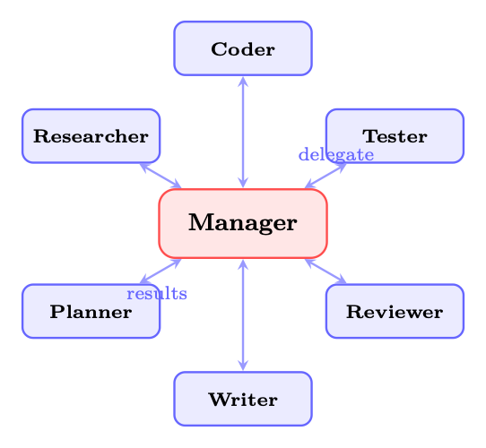
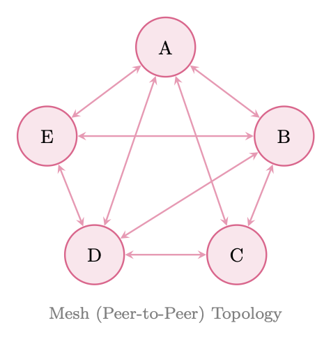
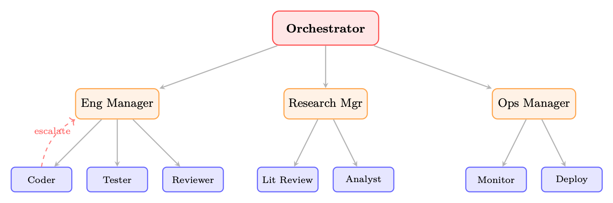

<div class="hh-guide">

<aside class="hh-part">
<p class="hh-part-title">第 V 部分 智能体 AI（Agentic AI）</p>
</aside>

## 动机：为什么需要多个 Agent？

人工智能的历史在很多方面就是一部规模演进史。早期 AI 系统是单体式的：单一程序、单一知识库、单一推理引擎。随着问题日益复杂，研究者发现，没有任何单一 Agent——无论能力多强——能够高效地处理一个丰富、开放式任务的方方面面。这一洞见在分布式 AI 与多智能体系统（Multi-Agent System, MAS）研究中早有定论 [375, 382]，而在大语言模型时代又被赋予了新的紧迫性。

从单体 Agent 转向<em>Agent 社会（agent societies）</em>的根本动机有四个：

不同的子任务受益于不同的能力、Prompt 策略，乃至不同的基础模型。代码生成 Agent 可以在编程语料上微调；事实核查 Agent 可以借助检索工具锚定事实；创意写作 Agent 可以通过 Prompt 激发风格多样性。强迫单个 Agent 在所有这些方面同时出色，既低效，往往也不可能。

许多现实世界的任务可以分解为可并发执行的独立子任务。一个需要文献综述、数据分析和报告撰写的研究流水线可以让这三者并行进行，从而显著降低墙钟时间。串行的单 Agent 处理是一个瓶颈，而多 Agent 并行化正好消除了它。

单个 Agent 是单点故障。如果它产生幻觉、陷入循环或给出细微错误的答案，将无人核验。多 Agent 系统引入了冗余：第二个 Agent 可以验证、批判，或独立地重新推导结果。在输出被信任之前，对抗性 Agent 可以主动探测其弱点。

也许最引人入胜的是，Agent 群体可以展现出任何单一 Agent 都不具备的能力。通过辩论、协商和迭代精化，多 Agent 系统能够得到超越任一单独 Agent 所能产出的解决方案——这是一种社会性生物涌现智能的计算类比。

从单体 Agent 到 Agent 社会的转变映射了复杂系统中一个更广泛的模式：随着问题空间的增长，分布式、模块化架构始终优于集中式、单体式架构。问题不再是<em>是否</em>使用多个 Agent，而是<em>如何</em>组织它们。

## 多智能体架构

多智能体系统的拓扑结构——Agent 之间如何连接、权威如何在它们之间流动——是最具决定性的架构选择。目前已经形成了四种典型模式，各有不同的权衡。

### 集中式（Supervisor/Manager）架构

在集中式架构中，由单一的<em>Orchestrator</em> Agent（也称为 supervisor、manager 或 planner）持有全局状态，分解任务，将子任务委派给工作 Agent，并汇总它们的结果。其拓扑是中心辐射式（hub-and-spoke）：所有通信都通过中心节点流动。

<figure id="ch25.f1"><figcaption><span class="hh-tag">图 25.1：</span>集中式（Supervisor）架构。Manager 将任务委派给专门化的 Worker，并汇总它们的输出。所有通信均通过中央枢纽流动。</figcaption></figure>

Manager 的职责包括：

<ul><li>任务路由：决定哪个 Worker 最适合每个子任务</li><li>上下文管理：为每个 Worker 提供全局上下文中相关的子集</li><li>结果聚合：将 Worker 输出综合为一个连贯整体</li><li>错误处理：检测 Worker 故障并重新路由或重试</li></ul>

### 去中心化（Peer-to-Peer）架构

在去中心化架构中，Agent 之间直接交互，没有中央协调者。其拓扑是网状（mesh）：任何 Agent 都可以与任何其他 Agent 通信。协调从局部交互中涌现，而不是来自全局规划。

<figure id="ch25.f2"><figcaption><span class="hh-tag">图 25.2：</span>去中心化（点对点）架构。Agent 之间直接通信；协调从局部交互中涌现。</figcaption></figure>

点对点系统中的涌现式协调通过如下机制产生：

<ul><li>协商（Negotiation）：Agent 为任务或资源竞标</li><li>Stigmergy：Agent 修改供其他 Agent 观察的共享状态（见第 25.3.6 Stigmergy：通过环境进行的间接通信 节）</li><li>流言协议（Gossip protocols）：Agent 在网络中传播信息</li><li>局部共识：小规模 Agent 群体在没有全局协调的情况下达成一致</li></ul>

### 层级式（Hierarchical）架构

层级式架构把集中式模式推广为具有多级管理的树状结构。顶层 Orchestrator 将任务委派给领域专属的子 Manager，后者再委派给专门化的 Worker。这与大型企业的组织结构相似。

<figure id="ch25.f3"><figcaption><span class="hh-tag">图 25.3：</span>层级式架构。顶层 Orchestrator 委派给领域子 Manager，后者再委派给专门化的 Worker。虚线箭头表示升级路径。</figcaption></figure>

层级式系统的关键特征：

<ul><li>委派链：权威与上下文沿树向下流动，结果向上汇聚</li><li>升级路径：Worker 可以把无法解决的问题上报给其 Manager</li><li>领域隔离：子 Manager 维护领域专属上下文，减轻顶层 Orchestrator 的认知负担</li><li>作用域限制：每个 Agent 只需要了解其直接上级和直接下属</li></ul>

企业类比是贴切的：CEO（顶层 Orchestrator）制定战略；VP（子 Manager）把战略转化为领域计划；个人贡献者（Worker）负责执行。层级结构在保持责任归属的同时实现了规模化。

### 蜂群（Swarm）架构

蜂群（Swarm）架构受生物系统（蚁群、鸟群）启发，由大量遵循简单局部规则的松耦合 Agent组成，在没有中央协调者或全局状态的情况下产生复杂的全局行为。

OpenAI 的 Swarm 框架 [276]（现已被 OpenAI Agents SDK 取代，但其概念原语仍有影响）用两个原语实现了这一点：

<ul><li>Routines：Agent 为完成某个子任务而遵循的指令序列</li><li>Handoffs：一个 Agent 把控制权（及相关上下文）移交给另一个 Agent</li></ul>

## 协调机制

Agent 之间如何协调——如何共享信息、划分工作、解决冲突——与拓扑结构同样重要。有六种典型的协调机制适用于基于 LLM 的多智能体系统。

### 共享状态（全局黑板）

黑板架构（blackboard architecture）[135] 提供了一个所有 Agent 都能读写的共享数据结构。在 LLM 系统中，它通常实现为共享字典、数据库或结构化文档。

```
import threading
from dataclasses import dataclass, field
from typing import Any, Callable, Dict, List

@dataclass
class BlackboardEntry:
    value: Any
    author: str
    timestamp: float
    confidence: float = 1.0

class Blackboard:
    """Thread-safe shared state for multi-agent coordination."""

    def __init__(self):
        self._data: Dict[str, BlackboardEntry] = {}
        self._lock = threading.RLock()
        self._subscribers: Dict[str, List[Callable]] = {}

    def write(self, key: str, value: Any, author: str,
              confidence: float = 1.0) -> bool:
        """Write to blackboard; higher-confidence entries win conflicts."""
        with self._lock:
            existing = self._data.get(key)
            if existing and existing.confidence > confidence:
                return False  # Conflict: existing entry wins
            import time
            self._data[key] = BlackboardEntry(
                value=value, author=author,
                timestamp=time.time(), confidence=confidence
            )
            self._notify(key, value)
            return True

    def read(self, key: str) -> Any:
        with self._lock:
            entry = self._data.get(key)
            return entry.value if entry else None

    def subscribe(self, key: str, callback: Callable):
        """Agents subscribe to changes on specific keys."""
        self._subscribers.setdefault(key, []).append(callback)

    def _notify(self, key: str, value: Any):
        for cb in self._subscribers.get(key, []):
            cb(key, value)
```

<span class="hh-tag">代码清单 33：</span>带冲突解决的共享黑板

### 消息传递（Message Passing）

消息传递是 LLM Agent 最自然的协调机制：Agent 之间通过发送结构化文本消息进行通信。关键设计决策包括：

<ul><li>消息格式：结构化（JSON schema）vs. 自然语言 vs. 混合</li><li>路由：直接（Agent 对 Agent）vs. 广播 vs. 基于主题的发布/订阅</li><li>会话线程：在多轮交换中维持上下文</li><li>确认：发送方是否需要接收/处理确认</li></ul>

### 规划与分解

Manager Agent 把高层任务分解为子任务的有向无环图（DAG），将每个子任务分配给合适的 Worker，并跟踪依赖关系。这是经典的分层任务网络（HTN）规划在多智能体中的对应形式。

```
from dataclasses import dataclass, field
from typing import List, Optional
import asyncio

@dataclass
class Task:
    id: str
    description: str
    assigned_to: str
    dependencies: List[str] = field(default_factory=list)
    status: str = "pending"   # pending | running | done | failed
    result: Optional[str] = None

class TaskDAG:
    def __init__(self):
        self.tasks: dict[str, Task] = {}

    def add_task(self, task: Task):
        self.tasks[task.id] = task

    def ready_tasks(self) -> List[Task]:
        """Return tasks whose dependencies are all completed."""
        return [
            t for t in self.tasks.values()
            if t.status == "pending"
            and all(self.tasks[d].status == "done"
                    for d in t.dependencies)
        ]

    async def execute(self, agent_pool: dict):
        while any(t.status != "done" for t in self.tasks.values()):
            ready = self.ready_tasks()
            if not ready:
                await asyncio.sleep(0.1)
                continue
            # Execute ready tasks in parallel
            await asyncio.gather(*[
                self._run_task(t, agent_pool[t.assigned_to])
                for t in ready
            ])

    async def _run_task(self, task: Task, agent):
        task.status = "running"
        try:
            task.result = await agent.execute(task.description)
            task.status = "done"
        except Exception as e:
            task.status = "failed"
            raise
```

<span class="hh-tag">代码清单 34：</span>任务 DAG 分解

### 投票与共识

当多个 Agent 产生相互冲突的输出时，投票机制会把它们的回答聚合成单一决策。常见方案包括：

<ul><li>多数投票：得票最多的答案获胜；对事实性问题有效</li><li>加权投票：历史表现更好或置信度分数更高的 Agent 获得更大权重</li><li>基于辩论的裁决：Agent 各自为立场辩护，由 judge Agent 裁决</li><li>德尔菲方法：多轮迭代，Agent 在看过他人的推理后修正自己的答案</li></ul>

形式化地，给定 <math alttext="n" display="inline"><semantics><mi>n</mi></semantics></math> 个 Agent 产生输出 <math alttext="\{o_{1},\ldots,o_{n}\}" display="inline"><semantics><mrow><mo stretchy="false">{</mo><msub><mi>o</mi><mn>1</mn></msub><mo>,</mo><mi mathvariant="normal">…</mi><mo>,</mo><msub><mi>o</mi><mi>n</mi></msub><mo stretchy="false">}</mo></mrow></semantics></math>，对应权重为 <math alttext="\{w_{1},\ldots,w_{n}\}" display="inline"><semantics><mrow><mo stretchy="false">{</mo><msub><mi>w</mi><mn>1</mn></msub><mo>,</mo><mi mathvariant="normal">…</mi><mo>,</mo><msub><mi>w</mi><mi>n</mi></msub><mo stretchy="false">}</mo></mrow></semantics></math>，则加权共识为：

<div class="hh-equation" id="ch25.e1"><math alttext="o^{*}=\arg\max_{o}\sum_{i=1}^{n}w_{i}\cdot\mathbf{1}[o_{i}=o]" display="block"><semantics><mrow><msup><mi>o</mi><mo>∗</mo></msup><mo>=</mo><mi>arg</mi><munder><mi>max</mi><mi>o</mi></munder><munderover><mo movablelimits="false">∑</mo><mrow><mi>i</mi><mo>=</mo><mn>1</mn></mrow><mi>n</mi></munderover><msub><mi>w</mi><mi>i</mi></msub><mo lspace="0.222em" rspace="0.222em">⋅</mo><mn>𝟏</mn><mrow><mo stretchy="false">[</mo><msub><mi>o</mi><mi>i</mi></msub><mo>=</mo><mi>o</mi><mo stretchy="false">]</mo></mrow></mrow></semantics></math><span class="hh-equation-number">(25.1)</span></div>

对于连续输出（例如概率估计），适用加权平均：

<div class="hh-equation" id="ch25.e2"><math alttext="\hat{p}=\frac{\sum_{i=1}^{n}w_{i}\cdot p_{i}}{\sum_{i=1}^{n}w_{i}}" display="block"><semantics><mrow><mover accent="true"><mi>p</mi><mo>^</mo></mover><mo>=</mo><mfrac><mrow><mrow><msubsup><mo>∑</mo><mrow><mi>i</mi><mo>=</mo><mn>1</mn></mrow><mi>n</mi></msubsup><msub><mi>w</mi><mi>i</mi></msub></mrow><mo lspace="0.222em" rspace="0.222em">⋅</mo><msub><mi>p</mi><mi>i</mi></msub></mrow><mrow><msubsup><mo>∑</mo><mrow><mi>i</mi><mo>=</mo><mn>1</mn></mrow><mi>n</mi></msubsup><msub><mi>w</mi><mi>i</mi></msub></mrow></mfrac></mrow></semantics></math><span class="hh-equation-number">(25.2)</span></div>

### 基于市场的协调

市场机制通过拍卖与竞标来分配任务和资源。合同网协议（Contract Net Protocol） [334] 是最古老的多智能体协调机制之一，它就是一种任务拍卖：

<ol><li><em>Manager</em> 广播带有需求的任务公告</li><li><em>Contractor</em> Agent 提交投标（能力声明 + 成本估计）</li><li>Manager 把合同授予最佳投标者</li><li>中标的 Contractor 执行任务并报告结果</li></ol>

在 LLM 系统中，投标可以用自然语言表达（“我能在 3 步内以高置信度完成”），也可以用结构化格式。对于必须最小化 API 成本的资源受限场景，市场机制尤为有效。

### Stigmergy：通过环境进行的间接通信

Stigmergy[117] 用更简单的机制取代了显式的 Agent 间消息传递：每个 Agent 作为工作的副作用修改共享环境，其他 Agent 对这些修改作出反应，而不是对直接信号作出反应。经典例子是觅食的蚂蚁在返回路径上留下信息素；后续的蚂蚁会放大成功的路径，而无需任何蚂蚁与另一只蚂蚁“交谈”。

在 LLM 多智能体系统中，stigmergy 表现为：

<ul><li>共享文档：Agent 写入共享文档；其他 Agent 读取并在其基础上继续构建</li><li>代码仓库：一个 Agent 提交代码，另一个 Agent 读取并扩展它</li><li>标注层：Agent 对共享产物进行标注（标记错误、添加评论）</li><li>任务队列：Agent 向共享队列添加任务并消费任务</li></ul>

Stigmergy 使协调无需显式的通信开销——Agent 只需观察共享环境的状态并据此行动。

## 通信协议

有效的多智能体系统需要定义良好的通信协议：Agent 间消息的约定格式、语义和模式。（关于标准化的 Agent 间协议，见第 第 24 章 智能体到智能体通信（Agent-to-Agent, A2A） 章。）

### 结构化消息格式

LLM Agent 之间的消息应当结构化，以便可靠地解析和路由。一个最小消息 schema：

```
from pydantic import BaseModel, Field
from typing import Literal, Optional, Dict, Any
from datetime import datetime, timezone
import uuid

PerformativeType = Literal[
    "inform",    # Share information
    "request",   # Request an action
    "propose",   # Propose a course of action
    "accept",    # Accept a proposal
    "reject",    # Reject a proposal
    "query",     # Ask a question
    "confirm",   # Confirm receipt/completion
    "failure",   # Report a failure
]

class AgentMessage(BaseModel):
    message_id: str = Field(default_factory=lambda: str(uuid.uuid4()))
    conversation_id: str          # Groups related messages
    sender: str                   # Agent identifier
    receiver: str                 # Target agent (or "broadcast")
    performative: PerformativeType
    content: str                  # Natural language content
    metadata: Dict[str, Any] = {} # Structured payload
    reply_to: Optional[str] = None  # message_id being replied to
    timestamp: datetime = Field(default_factory=lambda: datetime.now(timezone.utc))

    def to_llm_prompt(self) -> str:
        """Render message as a prompt fragment for the receiving agent."""
        return (
            f"[MESSAGE from {self.sender}]\n"
            f"Type: {self.performative}\n"
            f"Content: {self.content}\n"
            + (f"Metadata: {self.metadata}\n" if self.metadata else "")
        )
```

<span class="hh-tag">代码清单 35：</span>Agent 消息 schema

### Performative 类型（受 FIPA-ACL 启发）

借鉴 FIPA Agent 通信语言 [93]，并针对 LLM Agent 加以现代化：

<div class="hh-table" id="ch25.t1"><table class="ltx_tabular ltx_align_middle"><thead><tr><th class="ltx_align_left"><span>言语行为</span></th><th class="ltx_align_left ltx_align_top"><span class="ltx_align_top"><span><span>语义</span></span></span></th><th class="ltx_align_left ltx_align_top"><span class="ltx_align_top"><span><span>示例用途</span></span></span></th></tr></thead><tbody><tr><th class="ltx_align_left"><span>inform</span></th><td class="ltx_align_left ltx_align_top"><span class="ltx_align_top"><span>发送方相信 <math alttext="\phi" display="inline"><semantics><mi>ϕ</mi><span></span></semantics></math> 为真</span></span></td><td class="ltx_align_left ltx_align_top"><span class="ltx_align_top"><span>分享研究发现</span></span></td></tr><tr><th class="ltx_align_left"><span>request</span></th><td class="ltx_align_left ltx_align_top"><span class="ltx_align_top"><span>发送方希望接收方执行 <math alttext="\alpha" display="inline"><semantics><mi>α</mi><span></span></semantics></math></span></span></td><td class="ltx_align_left ltx_align_top"><span class="ltx_align_top"><span>委派子任务</span></span></td></tr><tr><th class="ltx_align_left"><span>propose</span></th><td class="ltx_align_left ltx_align_top"><span class="ltx_align_top"><span>发送方提议方案 <math alttext="\pi" display="inline"><semantics><mi>π</mi><span></span></semantics></math></span></span></td><td class="ltx_align_left ltx_align_top"><span class="ltx_align_top"><span>建议一种做法</span></span></td></tr><tr><th class="ltx_align_left"><span>accept</span></th><td class="ltx_align_left ltx_align_top"><span class="ltx_align_top"><span>接收方同意该提议</span></span></td><td class="ltx_align_left ltx_align_top"><span class="ltx_align_top"><span>确认任务分配</span></span></td></tr><tr><th class="ltx_align_left"><span>reject</span></th><td class="ltx_align_left ltx_align_top"><span class="ltx_align_top"><span>接收方拒绝该提议</span></span></td><td class="ltx_align_left ltx_align_top"><span class="ltx_align_top"><span>拒绝不兼容的任务</span></span></td></tr><tr><th class="ltx_align_left"><span>query</span></th><td class="ltx_align_left ltx_align_top"><span class="ltx_align_top"><span>发送方想了解 <math alttext="\phi" display="inline"><semantics><mi>ϕ</mi><span></span></semantics></math></span></span></td><td class="ltx_align_left ltx_align_top"><span class="ltx_align_top"><span>请求澄清</span></span></td></tr><tr><th class="ltx_align_left"><span>confirm</span></th><td class="ltx_align_left ltx_align_top"><span class="ltx_align_top"><span>发送方确认 <math alttext="\phi" display="inline"><semantics><mi>ϕ</mi><span></span></semantics></math> 已发生</span></span></td><td class="ltx_align_left ltx_align_top"><span class="ltx_align_top"><span>确认完成</span></span></td></tr><tr><th class="ltx_align_left"><span>failure</span></th><td class="ltx_align_left ltx_align_top"><span class="ltx_align_top"><span>发送方未能达成 <math alttext="\alpha" display="inline"><semantics><mi>α</mi><span></span></semantics></math></span></span></td><td class="ltx_align_left ltx_align_top"><span class="ltx_align_top"><span>报告错误</span></span></td></tr></tbody></table><p class="hh-table-caption"><span class="hh-tag">表 25.1：</span>受 FIPA-ACL 启发、用于 LLM Agent 消息的言语行为类型。</p></div>

### 上下文共享策略

多智能体通信中的一个关键挑战是上下文管理：每个 Agent 需要多少历史？有三种策略：

<ul><li>完整历史：把整个对话历史传给每个 Agent。信息量最大但成本高昂；上下文窗口很快被填满。</li><li>摘要：由一个 summarizer Agent 把此前的交互压缩成紧凑摘要。高效但有损；重要细节可能被丢弃。</li><li>相关片段：只用语义搜索检索最相关的历史消息。在成本与信息量之间取得平衡；需要检索机制。</li></ul>

## 角色设计与专门化

Agent 角色的设计——它们的能力、人格与职责——既是一门艺术，也是一门科学。设计良好的角色能实现专门化；设计糟糕的角色会带来混乱与冗余。

### 定义 Agent 角色

LLM 多智能体系统中的常见角色：

<div class="hh-table" id="ch25.t2"><table class="ltx_tabular ltx_align_middle"><thead><tr><th class="ltx_align_left"><span>角色</span></th><th class="ltx_align_left ltx_align_top"><span class="ltx_align_top"><span><span>主要能力</span></span></span></th><th class="ltx_align_left ltx_align_top"><span class="ltx_align_top"><span><span>典型工具</span></span></span></th></tr></thead><tbody><tr><th class="ltx_align_left">Researcher</th><td class="ltx_align_left ltx_align_top"><span class="ltx_align_top"><span>信息收集、综合</span></span></td><td class="ltx_align_left ltx_align_top"><span class="ltx_align_top"><span>Web 搜索、检索增强生成（RAG）、数据库</span></span></td></tr><tr><th class="ltx_align_left">Planner</th><td class="ltx_align_left ltx_align_top"><span class="ltx_align_top"><span>任务分解、调度</span></span></td><td class="ltx_align_left ltx_align_top"><span class="ltx_align_top"><span>无（仅推理）</span></span></td></tr><tr><th class="ltx_align_left">Coder</th><td class="ltx_align_left ltx_align_top"><span class="ltx_align_top"><span>代码生成、调试</span></span></td><td class="ltx_align_left ltx_align_top"><span class="ltx_align_top"><span>代码解释器、linter</span></span></td></tr><tr><th class="ltx_align_left">Reviewer</th><td class="ltx_align_left ltx_align_top"><span class="ltx_align_top"><span>质量评估、批判</span></span></td><td class="ltx_align_left ltx_align_top"><span class="ltx_align_top"><span>无（仅推理）</span></span></td></tr><tr><th class="ltx_align_left">Tester</th><td class="ltx_align_left ltx_align_top"><span class="ltx_align_top"><span>测试生成、执行</span></span></td><td class="ltx_align_left ltx_align_top"><span class="ltx_align_top"><span>测试运行器、覆盖率工具</span></span></td></tr><tr><th class="ltx_align_left">Writer</th><td class="ltx_align_left ltx_align_top"><span class="ltx_align_top"><span>散文生成、编辑</span></span></td><td class="ltx_align_left ltx_align_top"><span class="ltx_align_top"><span>语法检查器、风格指南</span></span></td></tr><tr><th class="ltx_align_left">Critic</th><td class="ltx_align_left ltx_align_top"><span class="ltx_align_top"><span>对抗式评估</span></span></td><td class="ltx_align_left ltx_align_top"><span class="ltx_align_top"><span>无（仅推理）</span></span></td></tr><tr><th class="ltx_align_left">Orchestrator</th><td class="ltx_align_left ltx_align_top"><span class="ltx_align_top"><span>协调、委派</span></span></td><td class="ltx_align_left ltx_align_top"><span class="ltx_align_top"><span>所有 Agent 接口</span></span></td></tr></tbody></table><p class="hh-table-caption"><span class="hh-tag">表 25.2：</span>LLM 多智能体系统中的常见 Agent 角色。</p></div>

### 基于能力 vs. 基于角色的分配

任务分配的两种理念：

<ul><li>基于角色：任务依据预定义的角色标签分配。简单且可预测；当任务跨越多个角色时可能不是最优。</li><li>基于能力：任务依据对每个 Agent 能力与任务需求匹配情况的动态评估来分配。更灵活；需要能力注册表与匹配机制。</li></ul>

### 动态角色重分配

在长时间运行的系统里，静态角色分配会变得不再最优。动态重新分配允许 Agent 依据以下因素承担新角色：

<ul><li>当前工作负载（负载均衡）</li><li>在近期任务上的实际表现</li><li>不断变化的任务需求</li><li>需要有人补位的 Agent 故障</li></ul>

### 以人格化设计实现思维多样性

一个微妙但强大的技巧：给 Agent 赋予各不相同的人格，以鼓励多样化的视角。不要用五个一模一样的“assistant” Agent，而应设计：

<ul><li>一个强调机会的<em>乐观主义者</em></li><li>一个质疑假设的<em>怀疑论者</em></li><li>一个关注落地实现的<em>实用主义者</em></li><li>一个着眼长期的<em>远见者</em></li><li>一个专唱反调的<em>魔鬼代言人</em></li></ul>

这种思维多样性受到六顶思考帽 [28] 等技巧的启发，能够减少群体思维、产生更稳健的集体推理。

## 面向 LLM 的多 Agent 模式

除了架构拓扑之外，还有若干交互模式被证明对基于 LLM 的多智能体系统尤为有效。（它们与第 第 20 章 Agent 设计模式 章中的单 Agent 设计模式互为补充。）

### 辩论模式（Debate Pattern）

多个 Agent 为不同立场辩护；由一个 judge Agent 评估论证并作出裁决。辩论已被证明能提升事实准确性并减少幻觉 [78]。

```
async def debate_round(question: str, agents: list, judge: Agent,
                       rounds: int = 2) -> str:
    """Run a multi-agent debate and return the judge's verdict."""
    positions = {a.name: await a.generate_position(question)
                 for a in agents}

    for round_num in range(rounds):
        # Each agent sees others' positions and can rebut
        rebuttals = {}
        for agent in agents:
            others = {k: v for k, v in positions.items()
                      if k != agent.name}
            rebuttals[agent.name] = await agent.rebut(
                question, positions[agent.name], others
            )
        positions = rebuttals

    # Judge evaluates all final positions
    verdict = await judge.evaluate(question, positions)
    return verdict
```

<span class="hh-tag">代码清单 36：</span>辩论模式的实现

### 反思模式（Reflection Pattern）

一个 Agent 生成输出；第二个 Agent 对它进行批判；第一个 Agent 依据批判意见修改。这实现了 generate-critique-revise 循环，可迭代提升质量。

```
async def reflection_loop(task: str, generator: Agent,
                          critic: Agent, max_rounds: int = 3) -> str:
    draft = await generator.generate(task)

    for _ in range(max_rounds):
        critique = await critic.critique(task, draft)
        if critique.is_satisfactory:
            break
        draft = await generator.revise(task, draft, critique.feedback)

    return draft
```

<span class="hh-tag">代码清单 37：</span>反思模式

### 分工模式（Division of Labor Pattern）

任务被分解为并行执行的独立子任务。结果由一个综合 Agent 聚合。该模式能为易并行任务最大化吞吐量。

### 流水线模式（Pipeline Pattern）

Agent 组成顺序处理链：每个 Agent 转换上一个 Agent 的输出。类似于 Unix 管道。对具有清晰顺序依赖的任务有效（例如：研究 <math alttext="\to" display="inline"><semantics><mo stretchy="false">→</mo></semantics></math> 提纲 <math alttext="\to" display="inline"><semantics><mo stretchy="false">→</mo></semantics></math> 草稿 <math alttext="\to" display="inline"><semantics><mo stretchy="false">→</mo></semantics></math> 编辑 <math alttext="\to" display="inline"><semantics><mo stretchy="false">→</mo></semantics></math> 排版）。

### 集成模式（Ensemble Pattern）

多个 Agent 独立求解同一问题；由选择机制挑出最佳答案（best-of-<math alttext="N" display="inline"><semantics><mi>N</mi></semantics></math>），或对答案进行聚合（mixture-of-experts 风格）。以计算量为代价提升可靠性。

<div class="hh-equation" id="ch25.e3"><math alttext="o^{*}=\arg\max_{o\in\{o_{1},\ldots,o_{N}\}}\text{score}(o,\text{task})" display="block"><semantics><mrow><msup><mi>o</mi><mo>∗</mo></msup><mo>=</mo><mrow><mrow><mi>arg</mi><mo lspace="0.167em">⁡</mo><munder><mi>max</mi><mrow><mi>o</mi><mo>∈</mo><mrow><mo stretchy="false">{</mo><msub><mi>o</mi><mn>1</mn></msub><mo>,</mo><mi mathvariant="normal">…</mi><mo>,</mo><msub><mi>o</mi><mi>N</mi></msub><mo stretchy="false">}</mo></mrow></mrow></munder></mrow><mo lspace="0.167em" rspace="0em">​</mo><mtext>score</mtext><mo lspace="0em" rspace="0em">​</mo><mrow><mo stretchy="false">(</mo><mi>o</mi><mo>,</mo><mtext>task</mtext><mo stretchy="false">)</mo></mrow></mrow></mrow></semantics></math><span class="hh-equation-number">(25.3)</span></div>

其中 score 可以是奖励模型、judge LLM 或验证器。

### 师生模式（Teacher-Student Pattern）

能力更强的 Agent（教师）引导能力较弱的 Agent（学生）完成任务，提供提示、纠正与解释。该模式支持推理时的知识蒸馏，也可用于微调学生 Agent。

### 红队模式（Red Team Pattern）

对抗性 Agent（红队）主动尝试找出其他 Agent 输出中的弱点、错误或安全违规。红队 Agent 被提示要以最大程度的批判性和创造性发起攻击。该模式对安全关键型应用至关重要。

## 用强化学习训练多智能体系统

用 RL 训练多智能体系统带来了超出单 Agent RL 的挑战。根本困难在于，每个 Agent 的环境都包含其他正在学习的 Agent，这使得环境从任何单个 Agent 的视角看都是非平稳（non-stationary）的。

### 数学形式化

多智能体系统被形式化为一个马尔可夫博弈（Markov Game）（也称随机博弈） [324]：

<div class="hh-equation" id="ch25.e4"><math alttext="\mathcal{G}=\langle\mathcal{N},\mathcal{S},\{\mathcal{A}^{i}\}_{i\in\mathcal{N}},\mathcal{T},\{R^{i}\}_{i\in\mathcal{N}},\gamma\rangle" display="block"><semantics><mrow><mi>𝒢</mi><mo>=</mo><mrow><mo stretchy="false">⟨</mo><mrow><mi>𝒩</mi><mo>,</mo><mi>𝒮</mi><mo>,</mo><msub><mrow><mo stretchy="false">{</mo><msup><mi>𝒜</mi><mi>i</mi></msup><mo stretchy="false">}</mo></mrow><mrow><mi>i</mi><mo>∈</mo><mi>𝒩</mi></mrow></msub><mo>,</mo><mi>𝒯</mi><mo>,</mo><msub><mrow><mo stretchy="false">{</mo><msup><mi>R</mi><mi>i</mi></msup><mo stretchy="false">}</mo></mrow><mrow><mi>i</mi><mo>∈</mo><mi>𝒩</mi></mrow></msub><mo>,</mo><mi>γ</mi></mrow><mo stretchy="false">⟩</mo></mrow></mrow></semantics></math><span class="hh-equation-number">(25.4)</span></div>

其中 <math alttext="\mathcal{N}=\{1,\ldots,n\}" display="inline"><semantics><mrow><mi>𝒩</mi><mo>=</mo><mrow><mo stretchy="false">{</mo><mrow><mn>1</mn><mo>,</mo><mi mathvariant="normal">…</mi><mo>,</mo><mi>n</mi></mrow><mo stretchy="false">}</mo></mrow></mrow></semantics></math> 是 Agent 集合，<math alttext="\mathcal{S}" display="inline"><semantics><mi>𝒮</mi></semantics></math> 是共享状态空间，<math alttext="\mathcal{A}^{i}" display="inline"><semantics><msup><mi>𝒜</mi><mi>i</mi></msup></semantics></math> 是 Agent <math alttext="i" display="inline"><semantics><mi>i</mi></semantics></math> 的动作空间，<math alttext="\mathcal{T}:\mathcal{S}\times\mathcal{A}^{1}\times\cdots\times\mathcal{A}^{n}\to\Delta(\mathcal{S})" display="inline"><semantics><mrow><mi>𝒯</mi><mo lspace="0.278em" rspace="0.278em">:</mo><mi>𝒮</mi><mo lspace="0.222em" rspace="0.222em">×</mo><msup><mi>𝒜</mi><mn>1</mn></msup><mo lspace="0.222em">×</mo><mo lspace="0.055em" rspace="0.055em">⋯</mo><mo rspace="0.222em">×</mo><msup><mi>𝒜</mi><mi>n</mi></msup><mo stretchy="false">→</mo><mi mathvariant="normal">Δ</mi><mrow><mo stretchy="false">(</mo><mi>𝒮</mi><mo stretchy="false">)</mo></mrow></mrow></semantics></math> 是状态转移函数，<math alttext="R^{i}:\mathcal{S}\times\mathcal{A}^{1}\times\cdots\times\mathcal{A}^{n}\to\mathbb{R}" display="inline"><semantics><mrow><mi>R</mi><msup><mrow></mrow><mi>i</mi></msup><mo lspace="0.278em" rspace="0.278em">:</mo><mi>𝒮</mi><mo lspace="0.222em" rspace="0.222em">×</mo><mi>𝒜</mi><msup><mrow></mrow><mn>1</mn></msup><mo lspace="0.222em">×</mo><mo lspace="0.055em" rspace="0.055em">⋯</mo><mo rspace="0.222em">×</mo><mi>𝒜</mi><msup><mrow></mrow><mi>n</mi></msup><mo stretchy="false">→</mo><mi>ℝ</mi></mrow></semantics></math> 是 Agent <math alttext="i" display="inline"><semantics><mi>i</mi></semantics></math> 的奖励函数，<math alttext="\gamma" display="inline"><semantics><mi>γ</mi></semantics></math> 是折扣因子。

每个 Agent <math alttext="i" display="inline"><semantics><mi>i</mi></semantics></math> 都试图最大化其期望折扣回报：

<div class="hh-equation" id="ch25.e5"><math alttext="J^{i}(\pi^{1},\ldots,\pi^{n})=\mathbb{E}_{\pi^{1},\ldots,\pi^{n}}\left[\sum_{t=0}^{\infty}\gamma^{t}R^{i}(s_{t},a_{t}^{1},\ldots,a_{t}^{n})\right]" display="block"><semantics><mrow><mrow><msup><mi>J</mi><mi>i</mi></msup><mo lspace="0em" rspace="0em">​</mo><mrow><mo stretchy="false">(</mo><msup><mi>π</mi><mn>1</mn></msup><mo>,</mo><mi mathvariant="normal">…</mi><mo>,</mo><msup><mi>π</mi><mi>n</mi></msup><mo stretchy="false">)</mo></mrow></mrow><mo>=</mo><mrow><msub><mi>𝔼</mi><mrow><msup><mi>π</mi><mn>1</mn></msup><mo>,</mo><mi mathvariant="normal">…</mi><mo>,</mo><msup><mi>π</mi><mi>n</mi></msup></mrow></msub><mo lspace="0em" rspace="0em">​</mo><mrow><mo>[</mo><mrow><munderover><mo lspace="0em" movablelimits="false">∑</mo><mrow><mi>t</mi><mo>=</mo><mn>0</mn></mrow><mi mathvariant="normal">∞</mi></munderover><mrow><msup><mi>γ</mi><mi>t</mi></msup><mo lspace="0em" rspace="0em">​</mo><msup><mi>R</mi><mi>i</mi></msup><mo lspace="0em" rspace="0em">​</mo><mrow><mo stretchy="false">(</mo><msub><mi>s</mi><mi>t</mi></msub><mo>,</mo><msubsup><mi>a</mi><mi>t</mi><mn>1</mn></msubsup><mo>,</mo><mi mathvariant="normal">…</mi><mo>,</mo><msubsup><mi>a</mi><mi>t</mi><mi>n</mi></msubsup><mo stretchy="false">)</mo></mrow></mrow></mrow><mo>]</mo></mrow></mrow></mrow></semantics></math><span class="hh-equation-number">(25.5)</span></div>

### 独立学习（Independent Learning）

最简单的方法：每个 Agent <math alttext="i" display="inline"><semantics><mi>i</mi></semantics></math> 把其他 Agent 视为环境的一部分，并用标准的单 Agent RL（例如 PPO、REINFORCE）独立优化自己的策略 <math alttext="\pi^{i}" display="inline"><semantics><msup><mi>π</mi><mi>i</mi></msup></semantics></math>。

<div class="hh-equation" id="ch25.e6"><math alttext="\nabla_{\theta^{i}}J^{i}\approx\mathbb{E}\left[\nabla_{\theta^{i}}\log\pi^{i}(a^{i}_{t}|o^{i}_{t})\cdot\hat{A}^{i}_{t}\right]" display="block"><semantics><mrow><mrow><msub><mo>∇</mo><msup><mi>θ</mi><mi>i</mi></msup></msub><msup><mi>J</mi><mi>i</mi></msup></mrow><mo>≈</mo><mrow><mi>𝔼</mi><mo>⁡</mo><mrow><mo>[</mo><mrow><mrow><msub><mo>∇</mo><msup><mi>θ</mi><mi>i</mi></msup></msub><mo lspace="0.167em" rspace="0em">​</mo><mi>log</mi><mo lspace="0.167em" rspace="0em">​</mo><msup><mi>π</mi><mi>i</mi></msup><mo lspace="0em" rspace="0em">​</mo><mrow><mo stretchy="false">(</mo><msubsup><mi>a</mi><mi>t</mi><mi>i</mi></msubsup><mo lspace="0em" rspace="0em">|</mo><msubsup><mi>o</mi><mi>t</mi><mi>i</mi></msubsup><mo rspace="0.055em" stretchy="false">)</mo></mrow></mrow><mo rspace="0.222em">⋅</mo><msubsup><mover accent="true"><mi>A</mi><mo>^</mo></mover><mi>t</mi><mi>i</mi></msubsup></mrow><mo>]</mo></mrow></mrow></mrow></semantics></math><span class="hh-equation-number">(25.6)</span></div>

### 集中训练、去中心化执行（CTDE）

CTDE [240, 306] 是协作式多智能体 RL 的主导范式。训练期间，集中式评论家（critic）可以访问全局状态 <math alttext="s" display="inline"><semantics><mi>s</mi></semantics></math> 和所有 Agent 的动作 <math alttext="\mathbf{a}=(a^{1},\ldots,a^{n})" display="inline"><semantics><mrow><mi>𝐚</mi><mo>=</mo><mrow><mo stretchy="false">(</mo><msup><mi>a</mi><mn>1</mn></msup><mo>,</mo><mi mathvariant="normal">…</mi><mo>,</mo><msup><mi>a</mi><mi>n</mi></msup><mo stretchy="false">)</mo></mrow></mrow></semantics></math>。执行期间，每个 Agent 仅使用自己的局部观测 <math alttext="o^{i}" display="inline"><semantics><msup><mi>o</mi><mi>i</mi></msup></semantics></math> 行动。

Agent <math alttext="i" display="inline"><semantics><mi>i</mi></semantics></math> 的集中式评论家：

<div class="hh-equation" id="ch25.e7"><math alttext="Q^{i}_{\phi}(s,\mathbf{a})=Q^{i}_{\phi}(s,a^{1},\ldots,a^{n})" display="block"><semantics><mrow><mrow><msubsup><mi>Q</mi><mi>ϕ</mi><mi>i</mi></msubsup><mo lspace="0em" rspace="0em">​</mo><mrow><mo stretchy="false">(</mo><mi>s</mi><mo>,</mo><mi>𝐚</mi><mo stretchy="false">)</mo></mrow></mrow><mo>=</mo><mrow><msubsup><mi>Q</mi><mi>ϕ</mi><mi>i</mi></msubsup><mo lspace="0em" rspace="0em">​</mo><mrow><mo stretchy="false">(</mo><mi>s</mi><mo>,</mo><msup><mi>a</mi><mn>1</mn></msup><mo>,</mo><mi mathvariant="normal">…</mi><mo>,</mo><msup><mi>a</mi><mi>n</mi></msup><mo stretchy="false">)</mo></mrow></mrow></mrow></semantics></math><span class="hh-equation-number">(25.7)</span></div>

Agent <math alttext="i" display="inline"><semantics><mi>i</mi></semantics></math> 的去中心化演员（actor）：

<div class="hh-equation" id="ch25.e8"><math alttext="\pi^{i}_{\theta^{i}}(a^{i}|o^{i})" display="block"><semantics><mrow><msubsup><mi>π</mi><msup><mi>θ</mi><mi>i</mi></msup><mi>i</mi></msubsup><mo lspace="0em" rspace="0em">​</mo><mrow><mo stretchy="false">(</mo><msup><mi>a</mi><mi>i</mi></msup><mo lspace="0em" rspace="0em">|</mo><msup><mi>o</mi><mi>i</mi></msup><mo stretchy="false">)</mo></mrow></mrow></semantics></math><span class="hh-equation-number">(25.8)</span></div>

带集中式评论家的策略梯度：

<div class="hh-equation" id="ch25.e9"><math alttext="\nabla_{\theta^{i}}J^{i}=\mathbb{E}\left[\nabla_{\theta^{i}}\log\pi^{i}(a^{i}|o^{i})\cdot Q^{i}_{\phi}(s,\mathbf{a})\right]" display="block"><semantics><mrow><mrow><msub><mo>∇</mo><msup><mi>θ</mi><mi>i</mi></msup></msub><msup><mi>J</mi><mi>i</mi></msup></mrow><mo>=</mo><mrow><mi>𝔼</mi><mo>⁡</mo><mrow><mo>[</mo><mrow><mrow><mrow><msub><mo>∇</mo><msup><mi>θ</mi><mi>i</mi></msup></msub><mo lspace="0.167em" rspace="0em">​</mo><mi>log</mi><mo lspace="0.167em" rspace="0em">​</mo><msup><mi>π</mi><mi>i</mi></msup><mo lspace="0em" rspace="0em">​</mo><mrow><mo stretchy="false">(</mo><msup><mi>a</mi><mi>i</mi></msup><mo lspace="0em" rspace="0em">|</mo><msup><mi>o</mi><mi>i</mi></msup><mo rspace="0.055em" stretchy="false">)</mo></mrow></mrow><mo rspace="0.222em">⋅</mo><msubsup><mi>Q</mi><mi>ϕ</mi><mi>i</mi></msubsup></mrow><mo lspace="0em" rspace="0em">​</mo><mrow><mo stretchy="false">(</mo><mi>s</mi><mo>,</mo><mi>𝐚</mi><mo stretchy="false">)</mo></mrow></mrow><mo>]</mo></mrow></mrow></mrow></semantics></math><span class="hh-equation-number">(25.9)</span></div>

CTDE 在训练期间解决了非平稳性（集中式评论家能看到完整的联合状态），同时保留了去中心化执行（推理时不需要通信）。

### 通信学习（Communication Learning）

除了使用固定的通信协议之外，Agent 还可以学习该通信什么。在可微通信框架 [342, 66] 中，Agent 产生连续通信向量 <math alttext="m^{i}_{t}" display="inline"><semantics><msubsup><mi>m</mi><mi>t</mi><mi>i</mi></msubsup></semantics></math>，并将它们传给其他 Agent：

<div class="hh-equation" id="ch25.e10"><math alttext="a^{i}_{t},m^{i}_{t}=\pi^{i}_{\theta^{i}}(o^{i}_{t},\{m^{j}_{t-1}\}_{j\neq i})" display="block"><semantics><mrow><msubsup><mi>a</mi><mi>t</mi><mi>i</mi></msubsup><mo>,</mo><mrow><msubsup><mi>m</mi><mi>t</mi><mi>i</mi></msubsup><mo>=</mo><mrow><msubsup><mi>π</mi><msup><mi>θ</mi><mi>i</mi></msup><mi>i</mi></msubsup><mo lspace="0em" rspace="0em">​</mo><mrow><mo stretchy="false">(</mo><msubsup><mi>o</mi><mi>t</mi><mi>i</mi></msubsup><mo>,</mo><msub><mrow><mo stretchy="false">{</mo><msubsup><mi>m</mi><mrow><mi>t</mi><mo>−</mo><mn>1</mn></mrow><mi>j</mi></msubsup><mo stretchy="false">}</mo></mrow><mrow><mi>j</mi><mo>≠</mo><mi>i</mi></mrow></msub><mo stretchy="false">)</mo></mrow></mrow></mrow></mrow></semantics></math><span class="hh-equation-number">(25.10)</span></div>

通信向量通过联合奖励信号的反向传播进行端到端优化。对 LLM Agent 而言，这一点通过训练 Agent 产生能够最大化任务性能的结构化自然语言消息来近似实现。

### 涌现通信（Emergent Communication）

当 Agent 仅凭奖励信号从零开始训练（没有预定义语言）时，它们可能发展出涌现通信协议[200]：编码任务相关信息的共享符号系统。虽然这在科学上很迷人，但 LLM 系统中的涌现通信通常并不可取——我们希望 Agent 用人类可解释的语言交流。

### 自我对弈（Self-Play）

在竞争性或混合动机的场景中，自我对弈（self-play）[332] 通过让 Agent 与自身的副本对抗来训练它们。这会产生自动课程：随着 Agent 进步，它的对手（自己的旧版本）也变得更难击败。

对于 LLM Agent，自我对弈被用于：

<ul><li>红队对蓝队训练</li><li>辩论训练（Agent 之间互相争辩）</li><li>协商训练（Agent 之间互相协商）</li></ul>

### 基于种群的训练（Population-Based Training）

基于种群的训练（Population-Based Training, PBT）[158] 维护一个包含不同策略、超参数和专长的多样化 Agent 种群。Agent 会被定期评估；表现不佳的 Agent 会被高表现 Agent 的变异副本替换。

对多智能体 LLM 系统而言，PBT 能够带来：

<ul><li>自动发现有效的角色专长</li><li>对单个 Agent 故障的鲁棒性（多样化种群）</li><li>通过种群多样性避免陷入局部最优</li></ul>

### 社会福利与 Nash 均衡

在多智能体场景中，最优性的概念比单 Agent 场景更复杂。两个关键的求解概念：

纳什均衡（Nash Equilibrium）：一种联合策略 <math alttext="(\pi^{1*},\ldots,\pi^{n*})" display="inline"><semantics><mrow><mo stretchy="false">(</mo><msup><mi>π</mi><mrow><mn>1</mn><mo lspace="0.222em">∗</mo></mrow></msup><mo>,</mo><mi mathvariant="normal">…</mi><mo>,</mo><msup><mi>π</mi><mrow><mi>n</mi><mo lspace="0.222em">∗</mo></mrow></msup><mo stretchy="false">)</mo></mrow></semantics></math>，使得没有任何 Agent 能通过单方面偏离来提高其期望回报：

<div class="hh-equation" id="ch25.e11"><math alttext="J^{i}(\pi^{i*},\pi^{-i*})\geq J^{i}(\pi^{i},\pi^{-i*})\quad\forall i,\forall\pi^{i}" display="block"><semantics><mrow><msup><mi>J</mi><mi>i</mi></msup><mrow><mo stretchy="false">(</mo><msup><mi>π</mi><mrow><mi>i</mi><mo lspace="0.222em">∗</mo></mrow></msup><mo>,</mo><msup><mi>π</mi><mrow><mo>−</mo><mi>i</mi><mo lspace="0.222em">∗</mo></mrow></msup><mo stretchy="false">)</mo></mrow><mo>≥</mo><msup><mi>J</mi><mi>i</mi></msup><mrow><mo stretchy="false">(</mo><msup><mi>π</mi><mi>i</mi></msup><mo>,</mo><msup><mi>π</mi><mrow><mo>−</mo><mi>i</mi><mo lspace="0.222em">∗</mo></mrow></msup><mo rspace="0.167em" stretchy="false">)</mo></mrow><mo rspace="0.167em">∀</mo><mi>i</mi><mo>,</mo><mo rspace="0.167em">∀</mo><msup><mi>π</mi><mi>i</mi></msup></mrow></semantics></math><span class="hh-equation-number">(25.11)</span></div>

其中 <math alttext="\pi^{-i}" display="inline"><semantics><msup><mi>π</mi><mrow><mo>−</mo><mi>i</mi></mrow></msup></semantics></math> 表示除 <math alttext="i" display="inline"><semantics><mi>i</mi></semantics></math> 之外所有 Agent 的联合策略。

社会福利最大化（Social Welfare Maximization）：优化所有 Agent 回报之和：

<div class="hh-equation" id="ch25.e12"><math alttext="\max_{\pi^{1},\ldots,\pi^{n}}\sum_{i=1}^{n}J^{i}(\pi^{1},\ldots,\pi^{n})" display="block"><semantics><mrow><mi>max</mi><mo>⁡</mo><mrow><mrow><mmultiscripts><munderover><mo movablelimits="false">∑</mo><mrow><mi>i</mi><mo>=</mo><mn>1</mn></mrow><mi>n</mi></munderover><mprescripts></mprescripts><mrow><msup><mi>π</mi><mn>1</mn></msup><mo>,</mo><mi mathvariant="normal">…</mi><mo>,</mo><msup><mi>π</mi><mi>n</mi></msup></mrow><mrow></mrow></mmultiscripts><mo>⁡</mo><msup><mi>J</mi><mi>i</mi></msup></mrow><mo lspace="0em" rspace="0em">​</mo><mrow><mo stretchy="false">(</mo><msup><mi>π</mi><mn>1</mn></msup><mo>,</mo><mi mathvariant="normal">…</mi><mo>,</mo><msup><mi>π</mi><mi>n</mi></msup><mo stretchy="false">)</mo></mrow></mrow></mrow></semantics></math><span class="hh-equation-number">(25.12)</span></div>

在完全协作的场景中（所有 Agent 共享同一奖励），社会福利最大化是合适的目标。在竞争性场景中，纳什均衡是相关的求解概念。现实世界中大多数多智能体 LLM 系统都是混合动机（mixed-motive）的：Agent 的目标部分一致、部分冲突。

## 挑战与解决方案

### 协调开销

每条 Agent 间消息都会消耗 Token——也就意味着消耗时间与金钱。在朴素实现中，即使不必要，Agent 也会不停通信。

量化通信成本：若一条消息消耗 <math alttext="c" display="inline"><semantics><mi>c</mi></semantics></math> 个 Token，接收方 Agent 的任务价值为 <math alttext="v" display="inline"><semantics><mi>v</mi></semantics></math>，则仅当任务价值的期望提升 <math alttext="\Delta v&gt;c\cdot\text{cost\_per\_token}" display="inline"><semantics><mrow><mrow><mi mathvariant="normal">Δ</mi><mo lspace="0em" rspace="0em">​</mo><mi>v</mi></mrow><mo>&gt;</mo><mrow><mi>c</mi><mo lspace="0.222em" rspace="0.222em">⋅</mo><mtext>cost_per_token</mtext></mrow></mrow></semantics></math> 时才进行通信。

### 冗余 vs. 效率

多个 Agent 可能独立求解同一子问题，从而浪费算力。解决方案：

<ul><li>重复检测（Duplicate detection）：开始任务前先检查黑板上是否已有结果</li><li>结果缓存：以语义键存储已完成的子任务结果以便检索</li><li>任务锁：将任务标记为“进行中”以防止重复执行</li></ul>

### 归因（Attribution）

当多智能体系统成功或失败时，是哪个 Agent 应当负责？归因（Attribution）对以下方面至关重要：

<ul><li>RL 的奖励分配（功劳分配问题，credit assignment problem）</li><li>调试与改进</li><li>信任校准（决定该依赖哪些 Agent）</li></ul>

反事实功劳分配（counterfactual credit assignment）方法通过提问“若该 Agent 采取不同行动，结果会改变多少？”来估计每个 Agent 的贡献。

<div class="hh-equation" id="ch25.e13"><math alttext="\text{credit}^{i}=J(\pi^{1},\ldots,\pi^{n})-J(\pi^{1},\ldots,\pi^{i}_{\text{default}},\ldots,\pi^{n})" display="block"><semantics><mrow><msup><mtext>credit</mtext><mi>i</mi></msup><mo>=</mo><mrow><mrow><mi>J</mi><mo>⁡</mo><mrow><mo stretchy="false">(</mo><msup><mi>π</mi><mn>1</mn></msup><mo>,</mo><mi mathvariant="normal">…</mi><mo>,</mo><msup><mi>π</mi><mi>n</mi></msup><mo stretchy="false">)</mo></mrow></mrow><mo>−</mo><mrow><mi>J</mi><mo>⁡</mo><mrow><mo stretchy="false">(</mo><msup><mi>π</mi><mn>1</mn></msup><mo>,</mo><mi mathvariant="normal">…</mi><mo>,</mo><msubsup><mi>π</mi><mtext>default</mtext><mi>i</mi></msubsup><mo>,</mo><mi mathvariant="normal">…</mi><mo>,</mo><msup><mi>π</mi><mi>n</mi></msup><mo stretchy="false">)</mo></mrow></mrow></mrow></mrow></semantics></math><span class="hh-equation-number">(25.13)</span></div>

### 可扩展性（Scalability）

朴素的消息传递在 Agent 数量上呈 <math alttext="O(n^{2})" display="inline"><semantics><mrow><mi>O</mi><mo>⁡</mo><mrow><mo stretchy="false">(</mo><msup><mi>n</mi><mn>2</mn></msup><mo stretchy="false">)</mo></mrow></mrow></semantics></math> 扩展。解决方案：

<ul><li>层级通信：Agent 仅在自身子树内通信</li><li>基于主题的发布/订阅：Agent 仅订阅相关主题的消息</li><li>稀疏通信图：仅连接需要交互的 Agent</li><li>异步通信：Agent 不阻塞等待响应</li></ul>

### 涌现行为与安全性

多智能体系统可能展现出意料之外的涌现行为——Agent 之间的交互产生没有任何单个 Agent 被设计来产出的结果。这既是特性（涌现能力），也是风险（涌现失败）。

### 评估（Evaluation）

评估多智能体系统需要多层级的指标：

<div class="hh-table" id="ch25.t3"><table class="ltx_tabular ltx_align_middle"><thead><tr><th class="ltx_align_left"><span>层级</span></th><th class="ltx_align_left ltx_align_top"><span class="ltx_align_top"><span><span>指标</span></span></span></th><th class="ltx_align_left ltx_align_top"><span class="ltx_align_top"><span><span>示例</span></span></span></th></tr></thead><tbody><tr><th class="ltx_align_left">系统</th><td class="ltx_align_left ltx_align_top"><span class="ltx_align_top"><span>任务完成率</span></span></td><td class="ltx_align_left ltx_align_top"><span class="ltx_align_top"><span>正确完成任务的百分比</span></span></td></tr><tr><th class="ltx_align_left">系统</th><td class="ltx_align_left ltx_align_top"><span class="ltx_align_top"><span>端到端延迟</span></span></td><td class="ltx_align_left ltx_align_top"><span class="ltx_align_top"><span>从任务到最终输出所用时间</span></span></td></tr><tr><th class="ltx_align_left">系统</th><td class="ltx_align_left ltx_align_top"><span class="ltx_align_top"><span>总 Token 成本</span></span></td><td class="ltx_align_left ltx_align_top"><span class="ltx_align_top"><span>所有 Agent 消耗的 Token 总量</span></span></td></tr><tr><th class="ltx_align_left">Agent</th><td class="ltx_align_left ltx_align_top"><span class="ltx_align_top"><span>个体准确率</span></span></td><td class="ltx_align_left ltx_align_top"><span class="ltx_align_top"><span>单个 Agent 的任务成功率</span></span></td></tr><tr><th class="ltx_align_left">Agent</th><td class="ltx_align_left ltx_align_top"><span class="ltx_align_top"><span>通信效率</span></span></td><td class="ltx_align_left ltx_align_top"><span class="ltx_align_top"><span>有用消息 / 总消息数</span></span></td></tr><tr><th class="ltx_align_left">Agent</th><td class="ltx_align_left ltx_align_top"><span class="ltx_align_top"><span>贡献分数</span></span></td><td class="ltx_align_left ltx_align_top"><span class="ltx_align_top"><span>反事实功劳（式 <span></span>）</span></span></td></tr><tr><th class="ltx_align_left">涌现</th><td class="ltx_align_left ltx_align_top"><span class="ltx_align_top"><span>协调质量</span></span></td><td class="ltx_align_left ltx_align_top"><span class="ltx_align_top"><span>任务重叠 / 缺口的程度</span></span></td></tr></tbody></table><p class="hh-table-caption"><span class="hh-tag">表 25.3：</span>多智能体系统的多层级评估指标。</p></div>

## 现实世界中的多智能体应用

### 软件开发团队

一支多 Agent 软件开发团队映射了真实的工程组织：

```python
from dataclasses import dataclass
from typing import Optional
import asyncio

@dataclass
class SoftwareTeamState:
    requirements: str
    architecture: Optional[str] = None
    code: Optional[str] = None
    tests: Optional[str] = None
    review_feedback: Optional[str] = None
    final_code: Optional[str] = None
    approved: bool = False

class SoftwareDevelopmentTeam:
    """
    Multi-agent software team:
      Architect -> Coder -> Tester -> Reviewer -> (iterate or ship)
    """

    def __init__(self, llm_factory):
        self.architect = llm_factory(
            system_prompt="""You are a software architect. Given requirements,
            produce a clear technical design: components, interfaces, data
            structures, and implementation plan."""
        )
        self.coder = llm_factory(
            system_prompt="""You are an expert software engineer. Given a
            technical design, write clean, well-documented, production-ready
            code. Follow best practices for the language."""
        )
        self.tester = llm_factory(
            system_prompt="""You are a QA engineer. Given code, write
            comprehensive tests: unit tests, edge cases, integration tests.
            Identify potential bugs and failure modes."""
        )
        self.reviewer = llm_factory(
            system_prompt="""You are a senior code reviewer. Evaluate code
            for correctness, security, performance, and maintainability.
            Provide specific, actionable feedback. Approve only if excellent."""
        )

    async def build(self, requirements: str,
                    max_iterations: int = 3) -> SoftwareTeamState:
        state = SoftwareTeamState(requirements=requirements)

        # Phase 1: Architecture
        state.architecture = await self.architect.invoke(
            f"Requirements:\n{requirements}\n\nProduce technical design."
        )

        for iteration in range(max_iterations):
            # Phase 2: Implementation
            prompt = (f"Design:\n{state.architecture}\n\n"
                      + (f"Previous feedback:\n{state.review_feedback}\n\n"
                         if state.review_feedback else "")
                      + "Write the implementation.")
            state.code = await self.coder.invoke(prompt)

            # Phase 3: Testing
            state.tests = await self.tester.invoke(
                f"Code:\n{state.code}\n\nWrite comprehensive tests."
            )

            # Phase 4: Review
            review = await self.reviewer.invoke(
                f"Code:\n{state.code}\n\nTests:\n{state.tests}\n\n"
                "Review this code. End with APPROVED or NEEDS_REVISION."
            )

            if "APPROVED" in review:
                state.final_code = state.code
                state.approved = True
                break
            else:
                state.review_feedback = review

        return state

    async def run(self, requirements: str) -> str:
        state = await self.build(requirements)
        if state.approved:
            return f"# Final Implementation\n\n{state.final_code}"
        else:
            return f"# Best Attempt (not approved)\n\n{state.code}"
```

### 研究团队

一个研究团队 Agent 社会映射了学术协作：

<ul><li>文献综述者：检索并综合已有工作</li><li>假设提出者：提出新颖的研究方向</li><li>实验者：设计并运行实验（通过代码执行）</li><li>统计学家：分析结果并评估显著性</li><li>撰写者：将研究发现综合成一份连贯的报告</li></ul>

### 客户服务系统

一个分层客户服务系统：

<ul><li>路由器：对传入请求进行分类并路由给各专家</li><li>账单专家：处理支付与账户问题</li><li>技术专家：解决产品/服务问题</li><li>升级处理 Agent：处理需要人工判断的复杂案例</li></ul>

### 创意团队

一条创意生产流水线：

<ul><li>头脑风暴者：不受自我审查约束地产生多样化想法</li><li>起草者：将最有希望的想法发展为完整初稿</li><li>编辑者：打磨初稿的清晰度、风格与连贯性</li><li>批评者：提供对抗性反馈以强化作品</li></ul>

## 架构对比

<div class="hh-table" id="ch25.t4"><table class="ltx_tabular ltx_align_middle"><thead><tr><th class="ltx_align_left"><span>架构</span></th><th class="ltx_align_left"><span>可扩展性</span></th><th class="ltx_align_left"><span>可调试性</span></th><th class="ltx_align_left"><span>协调成本</span></th><th class="ltx_align_left"><span>容错性</span></th><th class="ltx_align_left"><span>最适用场景</span></th></tr></thead><tbody><tr><td class="ltx_align_left">中心化（主管）</td><td class="ltx_align_left">M</td><td class="ltx_align_left">H</td><td class="ltx_align_left">L</td><td class="ltx_align_left">L</td><td class="ltx_align_left">简单流水线；任务分解清晰；小团队</td></tr><tr><td class="ltx_align_left">去中心化（P2P）</td><td class="ltx_align_left">H</td><td class="ltx_align_left">L</td><td class="ltx_align_left">H</td><td class="ltx_align_left">H</td><td class="ltx_align_left">动态环境；对韧性要求高；大规模</td></tr><tr><td class="ltx_align_left">层级式（Hierarchical）</td><td class="ltx_align_left">H</td><td class="ltx_align_left">M</td><td class="ltx_align_left">M</td><td class="ltx_align_left">M</td><td class="ltx_align_left">企业工作流；复杂的跨领域任务</td></tr><tr><td class="ltx_align_left">蜂群（Swarm）</td><td class="ltx_align_left">H</td><td class="ltx_align_left">L</td><td class="ltx_align_left">L</td><td class="ltx_align_left">H</td><td class="ltx_align_left">客户服务路由；简单的交接链</td></tr><tr><td class="ltx_align_left">流水线（Pipeline）</td><td class="ltx_align_left">M</td><td class="ltx_align_left">H</td><td class="ltx_align_left">L</td><td class="ltx_align_left">L</td><td class="ltx_align_left">顺序处理；阶段依赖清晰</td></tr><tr><td class="ltx_align_left">集成模式（Ensemble）</td><td class="ltx_align_left">L</td><td class="ltx_align_left">H</td><td class="ltx_align_left">H</td><td class="ltx_align_left">H</td><td class="ltx_align_left">高风险决策；可靠性优先于效率</td></tr></tbody></table><p class="hh-table-caption"><span class="hh-tag">表 25.4：</span>多 Agent 架构模式在关键维度上的比较。评级：High（高）/ Medium（中）/ Low（低）。</p></div>

## 自进化 Agent：BDI 遇上 LLM

2026 年 5 月的一条研究路线[427]首次认真尝试将信念-愿望-意图（Belief-Desire-Intention，BDI）架构——多智能体系统中理性 Agent 的经典框架——与 LLM 结合起来。与执行固定 tool 调用序列的静态 Agent 不同，BDI-LLM Agent 会依据环境反馈自主修改自身目标并重写其底层代码：

<ul><li>信念（Beliefs）：LLM 维护并更新一个结构化的世界模型（关于文件状态、API 响应、用户意图的信念）</li><li>愿望（Desires）：可根据观测结果动态重新排序优先级的高层目标</li><li>意图（Intentions）：具体计划（代码 + tool 序列），当计划失败时 Agent 可以重写</li></ul>

## 小结

多智能体系统代表了 LLM 部署方式的根本转变：从孤立的助手转向由专门化 Agent 组成的协作社会。本节的关键洞见：

多智能体 LLM 系统这一领域正在快速演进。这里描述的模式与技术代表了当前的最先进水平，但新的架构、协调机制与训练算法仍在不断涌现。无论具体实现如何演进，那些基础原则——专门化、协调、涌现行为，以及效率与鲁棒性之间的张力——都将保持其相关性。

<aside class="hh-next">
<p class="hh-next-label">下一篇</p>
<p class="hh-next-title">智能体 AI 漫游指南 · 第 26 章 Agent 开发框架</p>
<p class="hh-next-hint">在「智能体 AI 漫游指南」分类下继续阅读。</p>
</aside>

</div>
